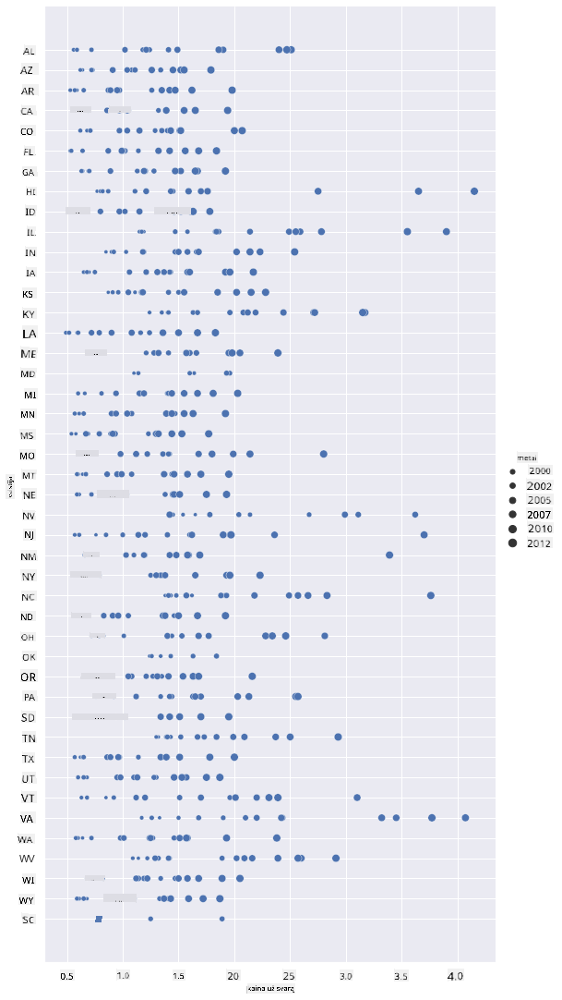
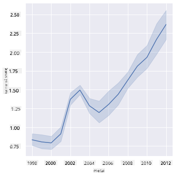
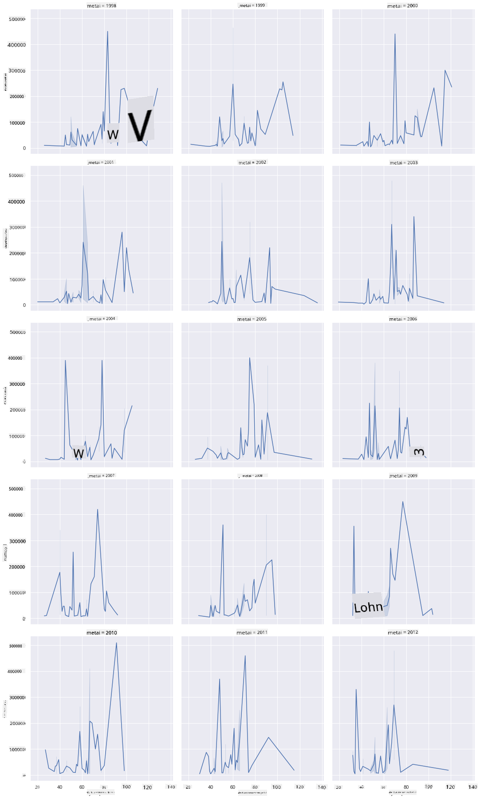

<!--
CO_OP_TRANSLATOR_METADATA:
{
  "original_hash": "0764fd4077f3f04a1d968ec371227744",
  "translation_date": "2025-09-06T11:51:31+00:00",
  "source_file": "3-Data-Visualization/12-visualization-relationships/README.md",
  "language_code": "lt"
}
-->
# Vizualizuojame ryšius: Viskas apie medų 🍯

| ](../../sketchnotes/12-Visualizing-Relationships.png)|
|:---:|
|Ryšių vizualizavimas - _Sketchnote by [@nitya](https://twitter.com/nitya)_ |

Tęsdami gamtos tematiką mūsų tyrimuose, atraskime įdomius būdus vizualizuoti ryšius tarp įvairių medaus rūšių, remdamiesi duomenų rinkiniu, gautu iš [JAV Žemės ūkio departamento](https://www.nass.usda.gov/About_NASS/index.php).

Šis maždaug 600 įrašų duomenų rinkinys rodo medaus gamybą įvairiose JAV valstijose. Pavyzdžiui, galite analizuoti kolonijų skaičių, derlių vienai kolonijai, bendrą gamybą, atsargas, kainą už svarą ir medaus vertę tam tikroje valstijoje nuo 1998 iki 2012 metų, kur kiekviena eilutė atitinka vienerius metus kiekvienoje valstijoje.

Būtų įdomu vizualizuoti ryšį tarp tam tikros valstijos metinės gamybos ir, pavyzdžiui, medaus kainos toje valstijoje. Arba galite vizualizuoti ryšį tarp valstijų medaus derliaus vienai kolonijai. Šis laikotarpis apima niokojantį „kolonijų žlugimo sutrikimą“ (angl. Colony Collapse Disorder, CCD), pirmą kartą pastebėtą 2006 m. (http://npic.orst.edu/envir/ccd.html), todėl tai yra prasmingas duomenų rinkinys tyrimui. 🐝

## [Prieš paskaitą vykdomas testas](https://ff-quizzes.netlify.app/en/ds/quiz/22)

Šioje pamokoje galite naudoti Seaborn biblioteką, kurią jau naudojote anksčiau, kaip puikų įrankį vizualizuoti ryšius tarp kintamųjų. Ypač įdomi yra Seaborn funkcija `relplot`, leidžianti greitai kurti sklaidos diagramas ir linijines diagramas, skirtas '[statistiniams ryšiams](https://seaborn.pydata.org/tutorial/relational.html?highlight=relationships)' vizualizuoti. Tai padeda duomenų mokslininkams geriau suprasti, kaip kintamieji yra susiję tarpusavyje.

## Sklaidos diagramos

Naudokite sklaidos diagramą, kad parodytumėte, kaip medaus kaina keitėsi metai iš metų kiekvienoje valstijoje. Seaborn, naudodamas `relplot`, patogiai grupuoja valstijų duomenis ir rodo duomenų taškus tiek kategoriniams, tiek skaitiniams duomenims.

Pradėkime importuodami duomenis ir Seaborn:

```python
import pandas as pd
import matplotlib.pyplot as plt
import seaborn as sns
honey = pd.read_csv('../../data/honey.csv')
honey.head()
```
Pastebėsite, kad medaus duomenyse yra keletas įdomių stulpelių, įskaitant metus ir kainą už svarą. Išnagrinėkime šiuos duomenis, suskirstytus pagal JAV valstijas:

| valstija | kolonijų skaičius | derlius vienai kolonijai | bendra gamyba | atsargos   | kaina už svarą | gamybos vertė | metai |
| -------- | ----------------- | ------------------------ | ------------- | ---------- | -------------- | ------------- | ----- |
| AL       | 16000            | 71                      | 1136000       | 159000     | 0.72           | 818000        | 1998  |
| AZ       | 55000            | 60                      | 3300000       | 1485000    | 0.64           | 2112000       | 1998  |
| AR       | 53000            | 65                      | 3445000       | 1688000    | 0.59           | 2033000       | 1998  |
| CA       | 450000           | 83                      | 37350000      | 12326000   | 0.62           | 23157000      | 1998  |
| CO       | 27000            | 72                      | 1944000       | 1594000    | 0.7            | 1361000       | 1998  |

Sukurkite paprastą sklaidos diagramą, kad parodytumėte ryšį tarp medaus kainos už svarą ir jo kilmės valstijos. Padarykite `y` ašį pakankamai aukštą, kad būtų matomos visos valstijos:

```python
sns.relplot(x="priceperlb", y="state", data=honey, height=15, aspect=.5);
```


Dabar parodykite tuos pačius duomenis su medaus spalvų schema, kad pavaizduotumėte, kaip kaina keitėsi per metus. Tai galite padaryti pridėdami 'hue' parametrą, kuris parodys pokyčius metai iš metų:

> ✅ Sužinokite daugiau apie [spalvų paletes, kurias galite naudoti Seaborn](https://seaborn.pydata.org/tutorial/color_palettes.html) - išbandykite gražią vaivorykštės spalvų schemą!

```python
sns.relplot(x="priceperlb", y="state", hue="year", palette="YlOrBr", data=honey, height=15, aspect=.5);
```


Naudodami šią spalvų schemą, galite pastebėti, kad medaus kaina už svarą akivaizdžiai didėja metai iš metų. Iš tiesų, jei patikrinsite duomenų pavyzdį (pavyzdžiui, Arizonos valstiją), galite pastebėti kainų didėjimo tendenciją su keliomis išimtimis:

| valstija | kolonijų skaičius | derlius vienai kolonijai | bendra gamyba | atsargos  | kaina už svarą | gamybos vertė | metai |
| -------- | ----------------- | ------------------------ | ------------- | --------- | -------------- | ------------- | ----- |
| AZ       | 55000            | 60                      | 3300000       | 1485000   | 0.64           | 2112000       | 1998  |
| AZ       | 52000            | 62                      | 3224000       | 1548000   | 0.62           | 1999000       | 1999  |
| AZ       | 40000            | 59                      | 2360000       | 1322000   | 0.73           | 1723000       | 2000  |
| AZ       | 43000            | 59                      | 2537000       | 1142000   | 0.72           | 1827000       | 2001  |
| AZ       | 38000            | 63                      | 2394000       | 1197000   | 1.08           | 2586000       | 2002  |
| AZ       | 35000            | 72                      | 2520000       | 983000    | 1.34           | 3377000       | 2003  |
| AZ       | 32000            | 55                      | 1760000       | 774000    | 1.11           | 1954000       | 2004  |
| AZ       | 36000            | 50                      | 1800000       | 720000    | 1.04           | 1872000       | 2005  |
| AZ       | 30000            | 65                      | 1950000       | 839000    | 0.91           | 1775000       | 2006  |
| AZ       | 30000            | 64                      | 1920000       | 902000    | 1.26           | 2419000       | 2007  |
| AZ       | 25000            | 64                      | 1600000       | 336000    | 1.26           | 2016000       | 2008  |
| AZ       | 20000            | 52                      | 1040000       | 562000    | 1.45           | 1508000       | 2009  |
| AZ       | 24000            | 77                      | 1848000       | 665000    | 1.52           | 2809000       | 2010  |
| AZ       | 23000            | 53                      | 1219000       | 427000    | 1.55           | 1889000       | 2011  |
| AZ       | 22000            | 46                      | 1012000       | 253000    | 1.79           | 1811000       | 2012  |

Kitas būdas vizualizuoti šį progresą yra naudoti dydį, o ne spalvą. Spalvų neskiriantiems vartotojams tai gali būti geresnis pasirinkimas. Redaguokite savo vizualizaciją, kad kainos didėjimas būtų parodytas didėjančiu taško apskritimu:

```python
sns.relplot(x="priceperlb", y="state", size="year", data=honey, height=15, aspect=.5);
```
Galite pastebėti, kaip taškų dydis palaipsniui didėja.



Ar tai paprastas pasiūlos ir paklausos atvejis? Dėl tokių veiksnių kaip klimato kaita ir kolonijų žlugimas, ar metai iš metų mažėja medaus pasiūla, todėl kaina kyla?

Norėdami atrasti koreliaciją tarp kai kurių šio duomenų rinkinio kintamųjų, panagrinėkime keletą linijinių diagramų.

## Linijinės diagramos

Klausimas: Ar yra aiškus medaus kainos už svarą kilimas metai iš metų? Tai galite lengviausiai pastebėti sukurdami vieną linijinę diagramą:

```python
sns.relplot(x="year", y="priceperlb", kind="line", data=honey);
```
Atsakymas: Taip, su keliomis išimtimis apie 2003 metus:



✅ Kadangi Seaborn agreguoja duomenis aplink vieną liniją, jis rodo „kelis matavimus kiekvienoje x reikšmėje, braižydamas vidurkį ir 95% pasitikėjimo intervalą aplink vidurkį“. [Šaltinis](https://seaborn.pydata.org/tutorial/relational.html). Šį laikui imlų veiksmą galima išjungti pridėjus `ci=None`.

Klausimas: Na, o 2003 metais, ar taip pat matome medaus pasiūlos šuolį? Ką, jei pažvelgtume į bendrą gamybą metai iš metų?

```python
sns.relplot(x="year", y="totalprod", kind="line", data=honey);
```


Atsakymas: Ne visai. Jei pažvelgsite į bendrą gamybą, ji iš tikrųjų atrodo padidėjusi tais metais, nors apskritai medaus gamyba mažėja per šiuos metus.

Klausimas: Tokiu atveju, kas galėjo sukelti medaus kainos šuolį apie 2003 metus?

Norėdami tai išsiaiškinti, galite naudoti facet grid.

## Facet grid

Facet grid leidžia pasirinkti vieną jūsų duomenų rinkinio aspektą (mūsų atveju galite pasirinkti 'metus', kad būtų išvengta per daug facetų). Seaborn tada gali sukurti diagramą kiekvienam iš šių aspektų, naudojant pasirinktus x ir y koordinates, kad būtų lengviau palyginti. Ar 2003 metai išsiskiria tokiame palyginime?

Sukurkite facet grid, toliau naudodami `relplot`, kaip rekomenduoja [Seaborn dokumentacija](https://seaborn.pydata.org/generated/seaborn.FacetGrid.html?highlight=facetgrid#seaborn.FacetGrid).

```python
sns.relplot(
    data=honey, 
    x="yieldpercol", y="numcol",
    col="year", 
    col_wrap=3,
    kind="line"
    )
```
Šioje vizualizacijoje galite palyginti derlių vienai kolonijai ir kolonijų skaičių metai iš metų, šalia vienas kito, su wrap nustatytu 3 stulpeliams:



Šiame duomenų rinkinyje niekas ypatingai neišsiskiria, kalbant apie kolonijų skaičių ir jų derlių metai iš metų bei valstija iš valstijos. Ar yra kitas būdas ieškoti koreliacijos tarp šių dviejų kintamųjų?

## Dvigubos linijinės diagramos

Išbandykite daugiagubą linijinę diagramą, uždėdami dvi linijines diagramas vieną ant kitos, naudodami Seaborn funkciją 'despine', kad pašalintumėte viršutines ir dešines ašis, ir naudodami `ax.twinx` [iš Matplotlib](https://matplotlib.org/stable/api/_as_gen/matplotlib.axes.Axes.twinx.html). Twinx leidžia diagramai dalintis x ašimi ir rodyti dvi y ašis. Taigi, parodykite derlių vienai kolonijai ir kolonijų skaičių, uždėtus vieną ant kito:

```python
fig, ax = plt.subplots(figsize=(12,6))
lineplot = sns.lineplot(x=honey['year'], y=honey['numcol'], data=honey, 
                        label = 'Number of bee colonies', legend=False)
sns.despine()
plt.ylabel('# colonies')
plt.title('Honey Production Year over Year');

ax2 = ax.twinx()
lineplot2 = sns.lineplot(x=honey['year'], y=honey['yieldpercol'], ax=ax2, color="r", 
                         label ='Yield per colony', legend=False) 
sns.despine(right=False)
plt.ylabel('colony yield')
ax.figure.legend();
```


Nors niekas akivaizdžiai neišsiskiria apie 2003 metus, tai leidžia mums užbaigti šią pamoką šiek tiek linksmesne nata: nors kolonijų skaičius apskritai mažėja, jų skaičius stabilizuojasi, net jei derlius vienai kolonijai mažėja.

Pirmyn, bitės, pirmyn!

🐝❤️
## 🚀 Iššūkis

Šioje pamokoje sužinojote daugiau apie sklaidos diagramų ir linijinių tinklų, įskaitant facet grid, naudojimą. Iššūkis sau: sukurkite facet grid naudodami kitą duomenų rinkinį, galbūt tą, kurį naudojote prieš šias pamokas. Atkreipkite dėmesį, kiek laiko užtrunka jų kūrimas ir kaip reikia būti atsargiems dėl to, kiek tinklų reikia piešti naudojant šiuos metodus.

## [Po paskaitos vykdomas testas](https://ff-quizzes.netlify.app/en/ds/quiz/23)

## Peržiūra ir savarankiškas mokymasis

Linijinės diagramos gali būti paprastos arba gana sudėtingos. Šiek tiek paskaitykite [Seaborn dokumentacijoje](https://seaborn.pydata.org/generated/seaborn.lineplot.html) apie įvairius būdus, kaip jas kurti. Pabandykite patobulinti linijines diagramas, kurias sukūrėte šioje pamokoje, naudodami kitus metodus, išvardytus dokumentacijoje.

## Užduotis

[Pasinerkite į avilį](assignment.md)

---

**Atsakomybės apribojimas**:  
Šis dokumentas buvo išverstas naudojant dirbtinio intelekto vertimo paslaugą [Co-op Translator](https://github.com/Azure/co-op-translator). Nors siekiame tikslumo, atkreipiame dėmesį, kad automatiniai vertimai gali turėti klaidų ar netikslumų. Originalus dokumentas jo gimtąja kalba turėtų būti laikomas autoritetingu šaltiniu. Kritinei informacijai rekomenduojama naudotis profesionalių vertėjų paslaugomis. Mes neprisiimame atsakomybės už nesusipratimus ar klaidingus aiškinimus, kylančius dėl šio vertimo naudojimo.