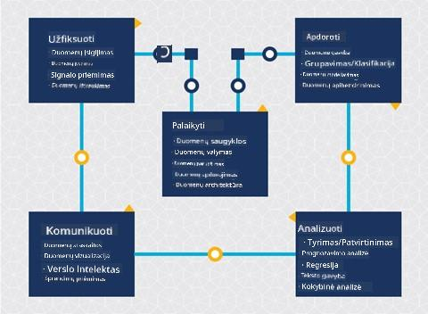
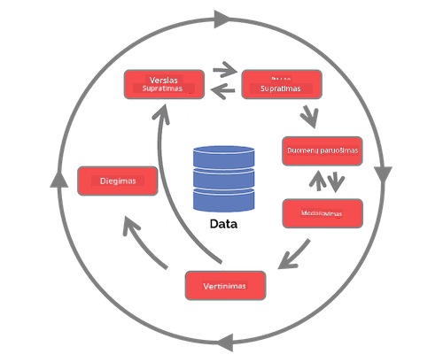

<!--
CO_OP_TRANSLATOR_METADATA:
{
  "original_hash": "07e12a25d20b8f191e3cb651c27fdb2b",
  "translation_date": "2025-09-06T21:54:28+00:00",
  "source_file": "4-Data-Science-Lifecycle/14-Introduction/README.md",
  "language_code": "lt"
}
-->
# Duomenų mokslo gyvavimo ciklo įvadas

| ](../../sketchnotes/14-DataScience-Lifecycle.png)|
|:---:|
| Duomenų mokslo gyvavimo ciklo įvadas - _Sketchnote by [@nitya](https://twitter.com/nitya)_ |

## [Prieš paskaitą: testas](https://ff-quizzes.netlify.app/en/ds/quiz/26)

Šiuo metu tikriausiai jau supratote, kad duomenų mokslas yra procesas. Šį procesą galima suskirstyti į 5 etapus:

- Duomenų rinkimas
- Apdorojimas
- Analizė
- Komunikacija
- Priežiūra

Šioje pamokoje daugiausia dėmesio skiriama trims gyvavimo ciklo dalims: duomenų rinkimui, apdorojimui ir priežiūrai.

> Nuotrauka iš [Berkeley School of Information](https://ischoolonline.berkeley.edu/data-science/what-is-data-science/)

## Duomenų rinkimas

Pirmasis gyvavimo ciklo etapas yra labai svarbus, nes nuo jo priklauso visi kiti etapai. Iš esmės tai yra dviejų etapų derinys: duomenų gavimas ir tikslo bei problemų, kurias reikia spręsti, apibrėžimas. 
Projekto tikslų apibrėžimas reikalauja gilesnio problemos ar klausimo konteksto supratimo. Pirmiausia reikia nustatyti ir įtraukti tuos, kuriems reikia išspręsti problemą. Tai gali būti verslo suinteresuotosios šalys arba projekto rėmėjai, kurie gali padėti nustatyti, kas ar kas gaus naudos iš šio projekto, taip pat ką ir kodėl jiems to reikia. Aiškiai apibrėžtas tikslas turėtų būti išmatuojamas ir kiekybiškai įvertinamas, kad būtų galima nustatyti priimtiną rezultatą.

Klausimai, kuriuos gali užduoti duomenų mokslininkas:
- Ar ši problema jau buvo nagrinėta anksčiau? Ką pavyko atrasti?
- Ar visi dalyviai supranta tikslą ir jo paskirtį?
- Ar yra neaiškumų ir kaip juos sumažinti?
- Kokie yra apribojimai?
- Kaip gali atrodyti galutinis rezultatas?
- Kiek turime išteklių (laiko, žmonių, skaičiavimo galimybių)?

Kitas žingsnis – nustatyti, surinkti ir galiausiai ištirti duomenis, reikalingus šiems tikslams pasiekti. Šiame duomenų gavimo etape duomenų mokslininkai taip pat turi įvertinti duomenų kiekį ir kokybę. Tam reikia atlikti tam tikrą duomenų tyrimą, kad būtų patvirtinta, jog surinkti duomenys padės pasiekti norimą rezultatą.

Klausimai, kuriuos gali užduoti duomenų mokslininkas apie duomenis:
- Kokie duomenys jau yra prieinami?
- Kas yra šių duomenų savininkas?
- Kokie yra privatumo klausimai?
- Ar turiu pakankamai duomenų šiai problemai išspręsti?
- Ar duomenų kokybė yra tinkama šiai problemai?
- Jei per šiuos duomenis atrasiu papildomos informacijos, ar turėtume apsvarstyti tikslų keitimą ar perapibrėžimą?

## Apdorojimas

Gyvavimo ciklo apdorojimo etapas yra skirtas duomenų šablonų atradimui ir modeliavimui. Kai kurie šiame etape naudojami metodai reikalauja statistinių metodų, kad būtų atskleisti šablonai. Paprastai tai būtų varginanti užduotis žmogui, dirbančiam su dideliais duomenų rinkiniais, todėl procesui paspartinti naudojami kompiuteriai. Šiame etape taip pat susikerta duomenų mokslas ir mašininis mokymasis. Kaip sužinojote pirmoje pamokoje, mašininis mokymasis yra modelių kūrimo procesas, siekiant suprasti duomenis. Modeliai yra kintamųjų santykių duomenyse reprezentacija, padedanti prognozuoti rezultatus.

Įprasti šiame etape naudojami metodai aptariami pradedančiųjų mašininio mokymosi kurse. Sekite nuorodas, kad sužinotumėte daugiau apie juos:

- [Klasifikacija](https://github.com/microsoft/ML-For-Beginners/tree/main/4-Classification): Duomenų organizavimas į kategorijas efektyvesniam naudojimui.
- [Grupavimas](https://github.com/microsoft/ML-For-Beginners/tree/main/5-Clustering): Duomenų grupavimas į panašias grupes.
- [Regresija](https://github.com/microsoft/ML-For-Beginners/tree/main/2-Regression): Kintamųjų santykių nustatymas, siekiant prognozuoti ar numatyti reikšmes.

## Priežiūra

Gyvavimo ciklo diagramoje galite pastebėti, kad priežiūra yra tarp duomenų rinkimo ir apdorojimo. Priežiūra yra nuolatinis procesas, apimantis duomenų valdymą, saugojimą ir apsaugą viso projekto metu, ir ją reikėtų apsvarstyti viso projekto eigoje.

### Duomenų saugojimas

Kaip ir kur duomenys saugomi, gali turėti įtakos saugojimo kaštams bei duomenų prieigos greičiui. Tokius sprendimus greičiausiai priima ne vien duomenų mokslininkas, tačiau jis gali būti atsakingas už tai, kaip dirbti su duomenimis, atsižvelgiant į jų saugojimo būdą.

Štai keletas šiuolaikinių duomenų saugojimo sistemų aspektų, kurie gali turėti įtakos šiems pasirinkimams:

**Vietinis vs nuotolinis saugojimas vs viešas ar privatus debesis**

Vietinis saugojimas reiškia duomenų valdymą savo įrangoje, pavyzdžiui, serveryje su kietaisiais diskais, o nuotolinis saugojimas remiasi įranga, kurios jūs nevaldote, pavyzdžiui, duomenų centru. Viešasis debesis yra populiarus pasirinkimas, kai nereikia žinoti, kaip ar kur tiksliai duomenys saugomi. Viešasis debesis reiškia bendrą infrastruktūrą, kuria naudojasi visi debesies vartotojai. Kai kurios organizacijos turi griežtas saugumo politikos taisykles, reikalaujančias visiškos prieigos prie įrangos, kurioje saugomi duomenys, ir pasirenka privatų debesį, kuris teikia savo debesų paslaugas. Apie duomenis debesyje sužinosite daugiau [vėlesnėse pamokose](https://github.com/microsoft/Data-Science-For-Beginners/tree/main/5-Data-Science-In-Cloud).

**Šalti vs karšti duomenys**

Mokant modelius, jums gali prireikti daugiau mokymo duomenų. Jei esate patenkinti savo modeliu, vis tiek gali būti gaunami nauji duomenys, kad modelis galėtų atlikti savo funkciją. Bet kuriuo atveju, kaupiant daugiau duomenų, didės jų saugojimo ir prieigos kaštai. Retai naudojamų duomenų, vadinamų šaltaisiais duomenimis, atskyrimas nuo dažnai naudojamų karštųjų duomenų gali būti pigesnis saugojimo sprendimas naudojant aparatinę ar programinę įrangą. Jei reikia pasiekti šaltuosius duomenis, jų gavimas gali užtrukti šiek tiek ilgiau nei karštųjų duomenų.

### Duomenų valdymas

Dirbdami su duomenimis galite pastebėti, kad kai kuriuos duomenis reikia išvalyti naudojant technikas, aptartas pamokoje apie [duomenų paruošimą](https://github.com/microsoft/Data-Science-For-Beginners/tree/main/2-Working-With-Data/08-data-preparation), kad būtų galima sukurti tikslius modelius. Kai gaunami nauji duomenys, jiems reikės taikyti tas pačias technikas, kad būtų išlaikyta kokybės nuoseklumas. Kai kurie projektai apima automatizuotų įrankių naudojimą duomenų valymui, agregavimui ir suspaudimui prieš perkeliant juos į galutinę vietą. Azure Data Factory yra vienas iš tokių įrankių pavyzdžių.

### Duomenų apsauga

Vienas pagrindinių duomenų apsaugos tikslų yra užtikrinti, kad tie, kurie dirba su duomenimis, kontroliuotų, kas yra renkama ir kokiame kontekste tai naudojama. Duomenų apsauga apima prieigos ribojimą tik tiems, kuriems jos reikia, vietinių įstatymų ir reglamentų laikymąsi bei etikos standartų laikymąsi, kaip aptarta [etikos pamokoje](https://github.com/microsoft/Data-Science-For-Beginners/tree/main/1-Introduction/02-ethics).

Štai keletas dalykų, kuriuos komanda gali atlikti, atsižvelgdama į saugumą:
- Užtikrinti, kad visi duomenys būtų užšifruoti
- Suteikti klientams informaciją apie tai, kaip jų duomenys naudojami
- Pašalinti duomenų prieigą tiems, kurie paliko projektą
- Leisti tik tam tikriems projekto nariams keisti duomenis

## 🚀 Iššūkis

Yra daug duomenų mokslo gyvavimo ciklo versijų, kuriose kiekvienas etapas gali turėti skirtingus pavadinimus ir etapų skaičių, tačiau jose bus tie patys procesai, aptarti šioje pamokoje.

Išnagrinėkite [Komandos duomenų mokslo proceso gyvavimo ciklą](https://docs.microsoft.com/en-us/azure/architecture/data-science-process/lifecycle) ir [Kryžminės pramonės standartinį duomenų gavybos procesą](https://www.datascience-pm.com/crisp-dm-2/). Įvardykite 3 panašumus ir skirtumus tarp jų.

|Komandos duomenų mokslo procesas (TDSP)|Kryžminės pramonės standartinis duomenų gavybos procesas (CRISP-DM)|
|--|--|
| |  |
| Vaizdas iš [Microsoft](https://docs.microsoft.comazure/architecture/data-science-process/lifecycle) | Vaizdas iš [Duomenų mokslo proceso aljanso](https://www.datascience-pm.com/crisp-dm-2/) |

## [Po paskaitos: testas](https://ff-quizzes.netlify.app/en/ds/quiz/27)

## Apžvalga ir savarankiškas mokymasis

Duomenų mokslo gyvavimo ciklo taikymas apima įvairius vaidmenis ir užduotis, kai kurie gali būti orientuoti į konkrečias kiekvieno etapo dalis. Komandos duomenų mokslo procesas pateikia keletą išteklių, kurie paaiškina vaidmenų ir užduočių tipus, kuriuos kažkas gali turėti projekte.

* [Komandos duomenų mokslo proceso vaidmenys ir užduotys](https://docs.microsoft.com/en-us/azure/architecture/data-science-process/roles-tasks)
* [Duomenų mokslo užduočių vykdymas: tyrimas, modeliavimas ir diegimas](https://docs.microsoft.com/en-us/azure/architecture/data-science-process/execute-data-science-tasks)

## Užduotis

[Duomenų rinkinio vertinimas](assignment.md)

---

**Atsakomybės apribojimas**:  
Šis dokumentas buvo išverstas naudojant dirbtinio intelekto vertimo paslaugą [Co-op Translator](https://github.com/Azure/co-op-translator). Nors siekiame tikslumo, atkreipiame dėmesį, kad automatiniai vertimai gali turėti klaidų ar netikslumų. Originalus dokumentas jo gimtąja kalba turėtų būti laikomas autoritetingu šaltiniu. Dėl svarbios informacijos rekomenduojame kreiptis į profesionalius vertėjus. Mes neprisiimame atsakomybės už nesusipratimus ar klaidingus aiškinimus, kylančius dėl šio vertimo naudojimo.