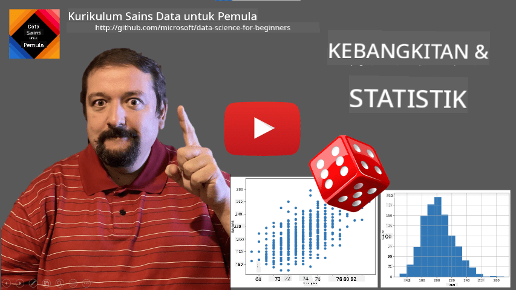
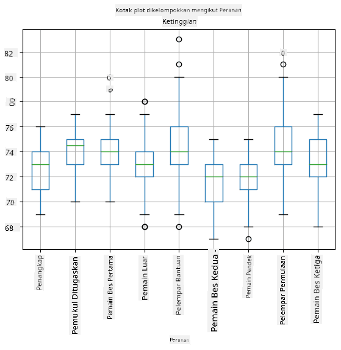
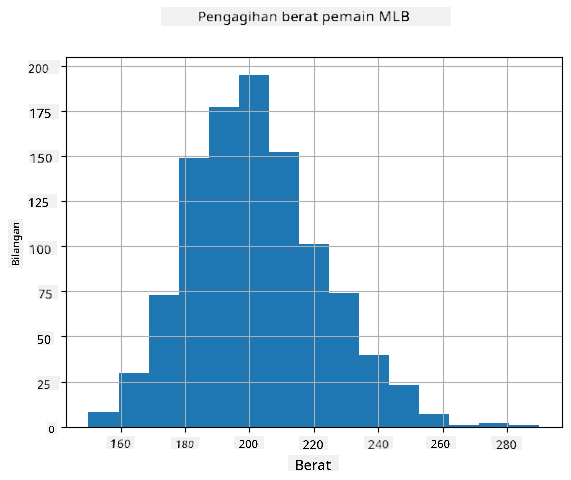
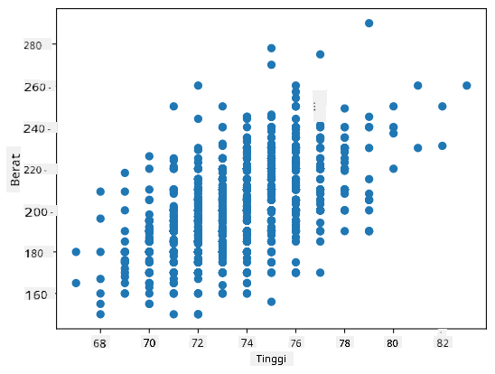

<!--
CO_OP_TRANSLATOR_METADATA:
{
  "original_hash": "ce95884566a74db72572cd51f0cb25ad",
  "translation_date": "2025-09-06T13:54:28+00:00",
  "source_file": "1-Introduction/04-stats-and-probability/README.md",
  "language_code": "ms"
}
-->
# Pengenalan Ringkas kepada Statistik dan Kebarangkalian

| ](../../sketchnotes/04-Statistics-Probability.png)|
|:---:|
| Statistik dan Kebarangkalian - _Sketchnote oleh [@nitya](https://twitter.com/nitya)_ |

Teori Statistik dan Kebarangkalian adalah dua cabang Matematik yang sangat berkait rapat dan amat relevan dalam Sains Data. Walaupun mungkin untuk bekerja dengan data tanpa pengetahuan matematik yang mendalam, adalah lebih baik untuk memahami sekurang-kurangnya konsep asas. Di sini, kami akan memberikan pengenalan ringkas untuk membantu anda bermula.

[](https://youtu.be/Z5Zy85g4Yjw)

## [Kuiz Pra-Kuliah](https://ff-quizzes.netlify.app/en/ds/quiz/6)

## Kebarangkalian dan Pemboleh Ubah Rawak

**Kebarangkalian** ialah nombor antara 0 dan 1 yang menunjukkan kemungkinan sesuatu **peristiwa** berlaku. Ia ditakrifkan sebagai bilangan hasil positif (yang membawa kepada peristiwa tersebut), dibahagi dengan jumlah keseluruhan hasil, dengan syarat semua hasil adalah sama kemungkinan. Sebagai contoh, apabila kita melontar dadu, kebarangkalian untuk mendapatkan nombor genap ialah 3/6 = 0.5.

Apabila kita bercakap tentang peristiwa, kita menggunakan **pemboleh ubah rawak**. Sebagai contoh, pemboleh ubah rawak yang mewakili nombor yang diperoleh apabila melontar dadu akan mengambil nilai dari 1 hingga 6. Set nombor dari 1 hingga 6 dipanggil **ruang sampel**. Kita boleh bercakap tentang kebarangkalian pemboleh ubah rawak mengambil nilai tertentu, contohnya P(X=3)=1/6.

Pemboleh ubah rawak dalam contoh sebelumnya dipanggil **diskret**, kerana ia mempunyai ruang sampel yang boleh dikira, iaitu terdapat nilai-nilai yang berasingan yang boleh disenaraikan. Terdapat juga kes di mana ruang sampel adalah julat nombor nyata, atau keseluruhan set nombor nyata. Pemboleh ubah seperti ini dipanggil **berterusan**. Contoh yang baik ialah masa ketibaan bas.

## Taburan Kebarangkalian

Dalam kes pemboleh ubah rawak diskret, adalah mudah untuk menerangkan kebarangkalian setiap peristiwa dengan fungsi P(X). Untuk setiap nilai *s* dari ruang sampel *S*, ia akan memberikan nombor dari 0 hingga 1, dengan syarat jumlah semua nilai P(X=s) untuk semua peristiwa adalah 1.

Taburan diskret yang paling terkenal ialah **taburan seragam**, di mana terdapat ruang sampel dengan N elemen, dengan kebarangkalian yang sama iaitu 1/N untuk setiap elemen.

Lebih sukar untuk menerangkan taburan kebarangkalian pemboleh ubah berterusan, dengan nilai yang diambil dari julat [a,b], atau keseluruhan set nombor nyata ℝ. Pertimbangkan kes masa ketibaan bas. Sebenarnya, untuk setiap masa ketibaan tepat *t*, kebarangkalian bas tiba pada masa itu adalah 0!

> Kini anda tahu bahawa peristiwa dengan kebarangkalian 0 boleh berlaku, dan ia berlaku dengan kerap! Sekurang-kurangnya setiap kali bas tiba!

Kita hanya boleh bercakap tentang kebarangkalian pemboleh ubah jatuh dalam julat nilai tertentu, contohnya P(t<sub>1</sub>≤X<t<sub>2</sub>). Dalam kes ini, taburan kebarangkalian diterangkan oleh **fungsi ketumpatan kebarangkalian** p(x), di mana


Analog berterusan bagi taburan seragam dipanggil **seragam berterusan**, yang ditakrifkan pada julat terhingga. Kebarangkalian bahawa nilai X jatuh ke dalam julat panjang l adalah berkadar dengan l, dan meningkat sehingga 1.

Satu lagi taburan penting ialah **taburan normal**, yang akan kita bincangkan dengan lebih terperinci di bawah.

## Min, Varians dan Sisihan Piawai

Katakan kita mengambil satu siri n sampel pemboleh ubah rawak X: x<sub>1</sub>, x<sub>2</sub>, ..., x<sub>n</sub>. Kita boleh mentakrifkan **min** (atau **purata aritmetik**) siri ini dengan cara tradisional sebagai (x<sub>1</sub>+x<sub>2</sub>+x<sub>n</sub>)/n. Apabila kita meningkatkan saiz sampel (iaitu mengambil had dengan n→∞), kita akan memperoleh min (juga dipanggil **jangkaan**) taburan. Kita akan menandakan jangkaan dengan **E**(x).

> Ia boleh ditunjukkan bahawa untuk mana-mana taburan diskret dengan nilai {x<sub>1</sub>, x<sub>2</sub>, ..., x<sub>N</sub>} dan kebarangkalian yang sepadan p<sub>1</sub>, p<sub>2</sub>, ..., p<sub>N</sub>, jangkaan adalah sama dengan E(X)=x<sub>1</sub>p<sub>1</sub>+x<sub>2</sub>p<sub>2</sub>+...+x<sub>N</sub>p<sub>N</sub>.

Untuk mengenal pasti sejauh mana nilai-nilai tersebar, kita boleh mengira varians σ<sup>2</sup> = ∑(x<sub>i</sub> - μ)<sup>2</sup>/n, di mana μ ialah min siri tersebut. Nilai σ dipanggil **sisihan piawai**, dan σ<sup>2</sup> dipanggil **varians**.

## Mod, Median dan Kuartil

Kadangkala, min tidak cukup mewakili nilai "tipikal" untuk data. Sebagai contoh, apabila terdapat beberapa nilai ekstrem yang sangat jauh dari julat, ia boleh mempengaruhi min. Petunjuk lain yang baik ialah **median**, iaitu nilai di mana separuh daripada data berada di bawahnya, dan separuh lagi berada di atasnya.

Untuk membantu kita memahami taburan data, adalah berguna untuk bercakap tentang **kuartil**:

* Kuartil pertama, atau Q1, ialah nilai di mana 25% data berada di bawahnya
* Kuartil ketiga, atau Q3, ialah nilai di mana 75% data berada di bawahnya

Secara grafik, kita boleh mewakili hubungan antara median dan kuartil dalam diagram yang dipanggil **plot kotak**:


Di sini kita juga mengira **jarak antara kuartil** IQR=Q3-Q1, dan apa yang dipanggil **outlier** - nilai yang berada di luar sempadan [Q1-1.5*IQR,Q3+1.5*IQR].

Untuk taburan terhingga yang mengandungi bilangan nilai yang kecil, nilai "tipikal" yang baik ialah nilai yang paling kerap muncul, yang dipanggil **mod**. Ia sering digunakan untuk data kategori, seperti warna. Pertimbangkan situasi di mana kita mempunyai dua kumpulan orang - satu kumpulan yang sangat menyukai warna merah, dan satu lagi yang menyukai warna biru. Jika kita mengekod warna dengan nombor, nilai min untuk warna kegemaran mungkin berada di spektrum oren-hijau, yang tidak menunjukkan keutamaan sebenar mana-mana kumpulan. Walau bagaimanapun, mod akan menjadi salah satu warna tersebut, atau kedua-duanya, jika bilangan orang yang memilihnya adalah sama (dalam kes ini kita memanggil sampel **multimodal**).

## Data Dunia Sebenar

Apabila kita menganalisis data dari dunia sebenar, data tersebut selalunya bukan pemboleh ubah rawak dalam erti kata bahawa kita tidak menjalankan eksperimen dengan hasil yang tidak diketahui. Sebagai contoh, pertimbangkan satu pasukan pemain besbol, dan data tubuh mereka, seperti ketinggian, berat dan umur. Nombor-nombor ini tidak sepenuhnya rawak, tetapi kita masih boleh menggunakan konsep matematik yang sama. Sebagai contoh, satu siri berat badan orang boleh dianggap sebagai satu siri nilai yang diambil daripada pemboleh ubah rawak tertentu. Berikut ialah siri berat badan pemain besbol sebenar dari [Major League Baseball](http://mlb.mlb.com/index.jsp), diambil daripada [set data ini](http://wiki.stat.ucla.edu/socr/index.php/SOCR_Data_MLB_HeightsWeights) (untuk kemudahan anda, hanya 20 nilai pertama ditunjukkan):

```
[180.0, 215.0, 210.0, 210.0, 188.0, 176.0, 209.0, 200.0, 231.0, 180.0, 188.0, 180.0, 185.0, 160.0, 180.0, 185.0, 197.0, 189.0, 185.0, 219.0]
```

> **Nota**: Untuk melihat contoh bekerja dengan set data ini, lihat [notebook yang disertakan](notebook.ipynb). Terdapat juga beberapa cabaran sepanjang pelajaran ini, dan anda boleh menyelesaikannya dengan menambah kod pada notebook tersebut. Jika anda tidak pasti bagaimana untuk mengendalikan data, jangan risau - kita akan kembali kepada bekerja dengan data menggunakan Python pada masa akan datang. Jika anda tidak tahu cara menjalankan kod dalam Jupyter Notebook, lihat [artikel ini](https://soshnikov.com/education/how-to-execute-notebooks-from-github/).

Berikut ialah plot kotak yang menunjukkan min, median dan kuartil untuk data kita:


Memandangkan data kita mengandungi maklumat tentang **peranan** pemain yang berbeza, kita juga boleh membuat plot kotak mengikut peranan - ini akan membolehkan kita mendapatkan idea tentang bagaimana nilai parameter berbeza mengikut peranan. Kali ini kita akan mempertimbangkan ketinggian:



Diagram ini mencadangkan bahawa, secara purata, ketinggian pemain bas pertama lebih tinggi daripada pemain bas kedua. Kemudian dalam pelajaran ini kita akan belajar bagaimana kita boleh menguji hipotesis ini dengan lebih formal, dan bagaimana untuk menunjukkan bahawa data kita adalah signifikan secara statistik untuk membuktikannya.

> Apabila bekerja dengan data dunia sebenar, kita menganggap bahawa semua titik data adalah sampel yang diambil daripada taburan kebarangkalian tertentu. Andaian ini membolehkan kita menggunakan teknik pembelajaran mesin dan membina model ramalan yang berfungsi.

Untuk melihat bagaimana taburan data kita, kita boleh melukis graf yang dipanggil **histogram**. Paksi X akan mengandungi bilangan julat berat yang berbeza (dipanggil **bin**), dan paksi menegak akan menunjukkan bilangan kali sampel pemboleh ubah rawak berada dalam julat tertentu.



Daripada histogram ini, anda boleh melihat bahawa semua nilai tertumpu di sekitar berat purata tertentu, dan semakin jauh kita dari berat tersebut - semakin sedikit berat dengan nilai tersebut ditemui. Iaitu, sangat tidak mungkin bahawa berat pemain besbol akan sangat berbeza daripada berat purata. Varians berat menunjukkan sejauh mana berat cenderung berbeza daripada purata.

> Jika kita mengambil berat orang lain, bukan dari liga besbol, taburan mungkin berbeza. Walau bagaimanapun, bentuk taburan akan sama, tetapi purata dan varians akan berubah. Jadi, jika kita melatih model kita pada pemain besbol, ia mungkin memberikan hasil yang salah apabila digunakan pada pelajar universiti, kerana taburan asasnya berbeza.

## Taburan Normal

Taburan berat yang kita lihat di atas adalah sangat tipikal, dan banyak ukuran dari dunia sebenar mengikuti jenis taburan yang sama, tetapi dengan purata dan varians yang berbeza. Taburan ini dipanggil **taburan normal**, dan ia memainkan peranan yang sangat penting dalam statistik.

Menggunakan taburan normal adalah cara yang betul untuk menjana berat rawak pemain besbol yang berpotensi. Setelah kita mengetahui berat purata `mean` dan sisihan piawai `std`, kita boleh menjana 1000 sampel berat dengan cara berikut:
```python
samples = np.random.normal(mean,std,1000)
``` 

Jika kita melukis histogram sampel yang dijana, kita akan melihat gambar yang sangat serupa dengan yang ditunjukkan di atas. Dan jika kita meningkatkan bilangan sampel dan bilangan bin, kita boleh menghasilkan gambar taburan normal yang lebih hampir kepada ideal:


*Taburan Normal dengan purata=0 dan sisihan piawai=1*

## Selang Keyakinan

Apabila kita bercakap tentang berat pemain besbol, kita mengandaikan bahawa terdapat **pemboleh ubah rawak W** tertentu yang sepadan dengan taburan kebarangkalian ideal berat semua pemain besbol (dipanggil **populasi**). Siri berat kita sepadan dengan subset semua pemain besbol yang kita panggil **sampel**. Satu soalan menarik ialah, bolehkah kita mengetahui parameter taburan W, iaitu purata dan varians populasi?

Jawapan yang paling mudah ialah mengira purata dan varians sampel kita. Walau bagaimanapun, mungkin berlaku bahawa sampel rawak kita tidak mewakili populasi sepenuhnya dengan tepat. Oleh itu, masuk akal untuk bercakap tentang **selang keyakinan**.

> **Selang keyakinan** ialah anggaran purata sebenar populasi berdasarkan sampel kita, yang tepat dengan kebarangkalian tertentu (atau **tahap keyakinan**).

Katakan kita mempunyai sampel X

1</sub>, ..., X<sub>n</sub> daripada taburan kita. Setiap kali kita mengambil sampel daripada taburan kita, kita akan mendapat nilai purata μ yang berbeza. Oleh itu, μ boleh dianggap sebagai pemboleh ubah rawak. **Selang keyakinan** dengan keyakinan p adalah sepasang nilai (L<sub>p</sub>,R<sub>p</sub>), di mana **P**(L<sub>p</sub>≤μ≤R<sub>p</sub>) = p, iaitu kebarangkalian nilai purata yang diukur berada dalam selang tersebut adalah sama dengan p.

Ia melangkaui pengenalan ringkas kita untuk membincangkan secara terperinci bagaimana selang keyakinan ini dikira. Beberapa butiran lanjut boleh didapati [di Wikipedia](https://en.wikipedia.org/wiki/Confidence_interval). Secara ringkas, kita mentakrifkan taburan purata sampel yang dikira berbanding purata sebenar populasi, yang dipanggil **taburan pelajar**.

> **Fakta menarik**: Taburan pelajar dinamakan sempena ahli matematik William Sealy Gosset, yang menerbitkan kertas kerjanya di bawah nama samaran "Student". Beliau bekerja di kilang bir Guinness, dan, menurut salah satu versi, majikannya tidak mahu orang awam mengetahui bahawa mereka menggunakan ujian statistik untuk menentukan kualiti bahan mentah.

Jika kita ingin menganggarkan purata μ populasi kita dengan keyakinan p, kita perlu mengambil *(1-p)/2-th percentile* daripada taburan pelajar A, yang boleh diambil daripada jadual, atau dikira menggunakan beberapa fungsi terbina dalam perisian statistik (contohnya Python, R, dll.). Kemudian selang untuk μ akan diberikan oleh X±A*D/√n, di mana X adalah purata sampel yang diperoleh, D adalah sisihan piawai.

> **Nota**: Kita juga mengabaikan perbincangan tentang konsep penting [darjah kebebasan](https://en.wikipedia.org/wiki/Degrees_of_freedom_(statistics)), yang penting berkaitan dengan taburan pelajar. Anda boleh merujuk kepada buku statistik yang lebih lengkap untuk memahami konsep ini dengan lebih mendalam.

Contoh pengiraan selang keyakinan untuk berat dan tinggi diberikan dalam [notebook yang disertakan](notebook.ipynb).

| p | Purata Berat |
|-----|-----------|
| 0.85 | 201.73±0.94 |
| 0.90 | 201.73±1.08 |
| 0.95 | 201.73±1.28 |

Perhatikan bahawa semakin tinggi kebarangkalian keyakinan, semakin luas selang keyakinan.

## Ujian Hipotesis

Dalam dataset pemain besbol kita, terdapat pelbagai peranan pemain, yang boleh diringkaskan seperti berikut (lihat [notebook yang disertakan](notebook.ipynb) untuk melihat bagaimana jadual ini boleh dikira):

| Peranan | Tinggi | Berat | Bilangan |
|------|--------|--------|-------|
| Catcher | 72.723684 | 204.328947 | 76 |
| Designated_Hitter | 74.222222 | 220.888889 | 18 |
| First_Baseman | 74.000000 | 213.109091 | 55 |
| Outfielder | 73.010309 | 199.113402 | 194 |
| Relief_Pitcher | 74.374603 | 203.517460 | 315 |
| Second_Baseman | 71.362069 | 184.344828 | 58 |
| Shortstop | 71.903846 | 182.923077 | 52 |
| Starting_Pitcher | 74.719457 | 205.163636 | 221 |
| Third_Baseman | 73.044444 | 200.955556 | 45 |

Kita boleh perhatikan bahawa purata tinggi pemain first basemen lebih tinggi daripada pemain second basemen. Oleh itu, kita mungkin tergoda untuk membuat kesimpulan bahawa **first basemen lebih tinggi daripada second basemen**.

> Pernyataan ini dipanggil **hipotesis**, kerana kita tidak tahu sama ada fakta ini benar atau tidak.

Walau bagaimanapun, ia tidak selalu jelas sama ada kita boleh membuat kesimpulan ini. Daripada perbincangan di atas, kita tahu bahawa setiap purata mempunyai selang keyakinan yang berkaitan, dan oleh itu perbezaan ini mungkin hanya kesilapan statistik. Kita memerlukan cara yang lebih formal untuk menguji hipotesis kita.

Mari kita kira selang keyakinan secara berasingan untuk tinggi pemain first dan second basemen:

| Keyakinan | First Basemen | Second Basemen |
|------------|---------------|----------------|
| 0.85 | 73.62..74.38 | 71.04..71.69 |
| 0.90 | 73.56..74.44 | 70.99..71.73 |
| 0.95 | 73.47..74.53 | 70.92..71.81 |

Kita boleh lihat bahawa di bawah semua tahap keyakinan, selang tidak bertindih. Ini membuktikan hipotesis kita bahawa first basemen lebih tinggi daripada second basemen.

Secara lebih formal, masalah yang kita selesaikan adalah untuk melihat sama ada **dua taburan kebarangkalian adalah sama**, atau sekurang-kurangnya mempunyai parameter yang sama. Bergantung pada taburan, kita perlu menggunakan ujian yang berbeza untuk itu. Jika kita tahu bahawa taburan kita adalah normal, kita boleh menggunakan **[Student t-test](https://en.wikipedia.org/wiki/Student%27s_t-test)**.

Dalam Student t-test, kita mengira **nilai-t**, yang menunjukkan perbezaan antara purata, dengan mengambil kira varians. Ia ditunjukkan bahawa nilai-t mengikuti **taburan pelajar**, yang membolehkan kita mendapatkan nilai ambang untuk tahap keyakinan **p** tertentu (ini boleh dikira, atau dirujuk dalam jadual numerik). Kita kemudian membandingkan nilai-t dengan ambang ini untuk meluluskan atau menolak hipotesis.

Dalam Python, kita boleh menggunakan pakej **SciPy**, yang termasuk fungsi `ttest_ind` (selain daripada banyak fungsi statistik berguna yang lain!). Ia mengira nilai-t untuk kita, dan juga melakukan carian semula nilai keyakinan p, supaya kita hanya perlu melihat keyakinan untuk membuat kesimpulan.

Sebagai contoh, perbandingan kita antara tinggi pemain first dan second basemen memberikan hasil berikut:
```python
from scipy.stats import ttest_ind

tval, pval = ttest_ind(df.loc[df['Role']=='First_Baseman',['Height']], df.loc[df['Role']=='Designated_Hitter',['Height']],equal_var=False)
print(f"T-value = {tval[0]:.2f}\nP-value: {pval[0]}")
```
```
T-value = 7.65
P-value: 9.137321189738925e-12
```
Dalam kes kita, nilai p sangat rendah, yang bermaksud terdapat bukti kukuh yang menyokong bahawa first basemen lebih tinggi.

Terdapat juga pelbagai jenis hipotesis lain yang mungkin kita ingin uji, contohnya:
* Untuk membuktikan bahawa sampel tertentu mengikuti taburan tertentu. Dalam kes kita, kita telah menganggap bahawa tinggi adalah taburan normal, tetapi itu memerlukan pengesahan statistik formal.
* Untuk membuktikan bahawa nilai purata sampel sepadan dengan nilai yang telah ditetapkan
* Untuk membandingkan purata beberapa sampel (contohnya, apakah perbezaan tahap kebahagiaan antara kumpulan umur yang berbeza)

## Hukum Bilangan Besar dan Teorem Had Pusat

Salah satu sebab mengapa taburan normal sangat penting adalah **teorem had pusat**. Katakan kita mempunyai sampel besar N nilai X<sub>1</sub>, ..., X<sub>N</sub>, yang diambil daripada mana-mana taburan dengan purata μ dan varians σ<sup>2</sup>. Kemudian, untuk N yang cukup besar (dengan kata lain, apabila N→∞), purata Σ<sub>i</sub>X<sub>i</sub> akan menjadi taburan normal, dengan purata μ dan varians σ<sup>2</sup>/N.

> Cara lain untuk mentafsirkan teorem had pusat adalah untuk mengatakan bahawa tanpa mengira taburan, apabila anda mengira purata jumlah nilai pemboleh ubah rawak, anda akan mendapat taburan normal.

Daripada teorem had pusat, ia juga mengikuti bahawa, apabila N→∞, kebarangkalian purata sampel sama dengan μ menjadi 1. Ini dikenali sebagai **hukum bilangan besar**.

## Kovarians dan Korelasi

Salah satu perkara yang dilakukan oleh Sains Data adalah mencari hubungan antara data. Kita mengatakan bahawa dua urutan **berkorelasi** apabila mereka menunjukkan tingkah laku yang serupa pada masa yang sama, iaitu mereka sama-sama meningkat/menurun serentak, atau satu urutan meningkat apabila yang lain menurun dan sebaliknya. Dengan kata lain, nampaknya terdapat hubungan antara dua urutan.

> Korelasi tidak semestinya menunjukkan hubungan sebab-akibat antara dua urutan; kadangkala kedua-dua pemboleh ubah boleh bergantung kepada sebab luaran, atau ia boleh semata-mata kebetulan bahawa kedua-dua urutan berkorelasi. Walau bagaimanapun, korelasi matematik yang kuat adalah petunjuk yang baik bahawa dua pemboleh ubah mempunyai hubungan tertentu.

Secara matematik, konsep utama yang menunjukkan hubungan antara dua pemboleh ubah rawak adalah **kovarians**, yang dikira seperti ini: Cov(X,Y) = **E**\[(X-**E**(X))(Y-**E**(Y))\]. Kita mengira sisihan kedua-dua pemboleh ubah daripada nilai purata mereka, dan kemudian hasil sisihan tersebut. Jika kedua-dua pemboleh ubah menyimpang bersama, hasilnya akan sentiasa menjadi nilai positif, yang akan menambah kepada kovarians positif. Jika kedua-dua pemboleh ubah menyimpang tidak selaras (iaitu satu jatuh di bawah purata apabila yang lain meningkat di atas purata), kita akan sentiasa mendapat nombor negatif, yang akan menambah kepada kovarians negatif. Jika sisihan tidak bergantung, ia akan menambah kepada kira-kira sifar.

Nilai mutlak kovarians tidak memberitahu kita banyak tentang sejauh mana korelasi itu, kerana ia bergantung kepada magnitud nilai sebenar. Untuk menormalkannya, kita boleh membahagikan kovarians dengan sisihan piawai kedua-dua pemboleh ubah, untuk mendapatkan **korelasi**. Perkara yang baik ialah korelasi sentiasa dalam julat [-1,1], di mana 1 menunjukkan korelasi positif yang kuat antara nilai, -1 - korelasi negatif yang kuat, dan 0 - tiada korelasi sama sekali (pemboleh ubah adalah bebas).

**Contoh**: Kita boleh mengira korelasi antara berat dan tinggi pemain besbol daripada dataset yang disebutkan di atas:
```python
print(np.corrcoef(weights,heights))
```
Hasilnya, kita mendapat **matriks korelasi** seperti ini:
```
array([[1.        , 0.52959196],
       [0.52959196, 1.        ]])
```

> Matriks korelasi C boleh dikira untuk sebarang bilangan urutan input S<sub>1</sub>, ..., S<sub>n</sub>. Nilai C<sub>ij</sub> adalah korelasi antara S<sub>i</sub> dan S<sub>j</sub>, dan elemen diagonal sentiasa 1 (yang juga korelasi diri S<sub>i</sub>).

Dalam kes kita, nilai 0.53 menunjukkan bahawa terdapat beberapa korelasi antara berat dan tinggi seseorang. Kita juga boleh membuat plot taburan satu nilai terhadap yang lain untuk melihat hubungan secara visual:



> Lebih banyak contoh korelasi dan kovarians boleh didapati dalam [notebook yang disertakan](notebook.ipynb).

## Kesimpulan

Dalam bahagian ini, kita telah mempelajari:

* sifat statistik asas data, seperti purata, varians, mod dan kuartil
* pelbagai taburan pemboleh ubah rawak, termasuk taburan normal
* bagaimana mencari korelasi antara pelbagai sifat
* bagaimana menggunakan alat matematik dan statistik untuk membuktikan beberapa hipotesis
* bagaimana mengira selang keyakinan untuk pemboleh ubah rawak berdasarkan sampel data

Walaupun ini bukan senarai topik yang lengkap dalam kebarangkalian dan statistik, ia sepatutnya cukup untuk memberi anda permulaan yang baik dalam kursus ini.

## 🚀 Cabaran

Gunakan kod sampel dalam notebook untuk menguji hipotesis lain bahawa:
1. First basemen lebih tua daripada second basemen
2. First basemen lebih tinggi daripada third basemen
3. Shortstops lebih tinggi daripada second basemen

## [Kuiz selepas kuliah](https://ff-quizzes.netlify.app/en/ds/quiz/7)

## Kajian & Pembelajaran Sendiri

Kebarangkalian dan statistik adalah topik yang sangat luas sehingga ia layak mendapat kursus tersendiri. Jika anda berminat untuk mendalami teori, anda mungkin ingin terus membaca beberapa buku berikut:

1. [Carlos Fernandez-Granda](https://cims.nyu.edu/~cfgranda/) dari Universiti New York mempunyai nota kuliah yang hebat [Probability and Statistics for Data Science](https://cims.nyu.edu/~cfgranda/pages/stuff/probability_stats_for_DS.pdf) (tersedia dalam talian)
1. [Peter dan Andrew Bruce. Practical Statistics for Data Scientists.](https://www.oreilly.com/library/view/practical-statistics-for/9781491952955/) [[kod sampel dalam R](https://github.com/andrewgbruce/statistics-for-data-scientists)]. 
1. [James D. Miller. Statistics for Data Science](https://www.packtpub.com/product/statistics-for-data-science/9781788290678) [[kod sampel dalam R](https://github.com/PacktPublishing/Statistics-for-Data-Science)]

## Tugasan

[Small Diabetes Study](assignment.md)

## Kredit

Pelajaran ini telah ditulis dengan ♥️ oleh [Dmitry Soshnikov](http://soshnikov.com)

---

**Penafian**:  
Dokumen ini telah diterjemahkan menggunakan perkhidmatan terjemahan AI [Co-op Translator](https://github.com/Azure/co-op-translator). Walaupun kami berusaha untuk memastikan ketepatan, sila ambil maklum bahawa terjemahan automatik mungkin mengandungi kesilapan atau ketidaktepatan. Dokumen asal dalam bahasa asalnya harus dianggap sebagai sumber yang berwibawa. Untuk maklumat yang kritikal, terjemahan manusia profesional adalah disyorkan. Kami tidak bertanggungjawab atas sebarang salah faham atau salah tafsir yang timbul daripada penggunaan terjemahan ini.