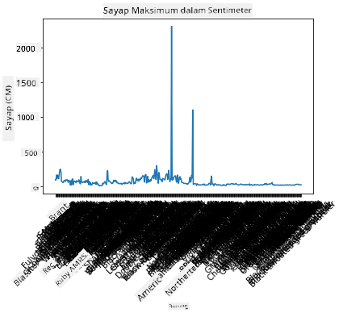
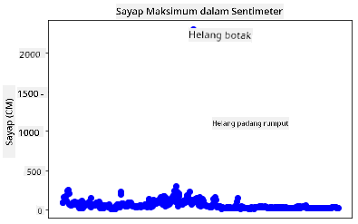
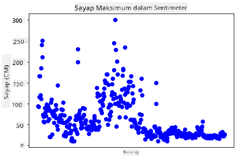
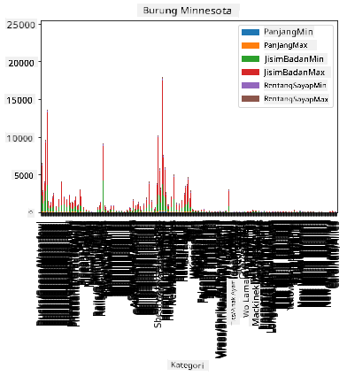
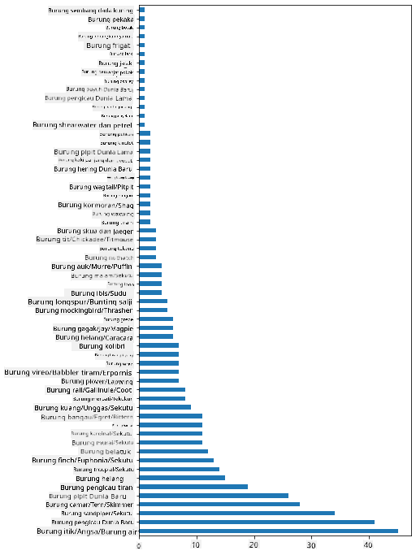
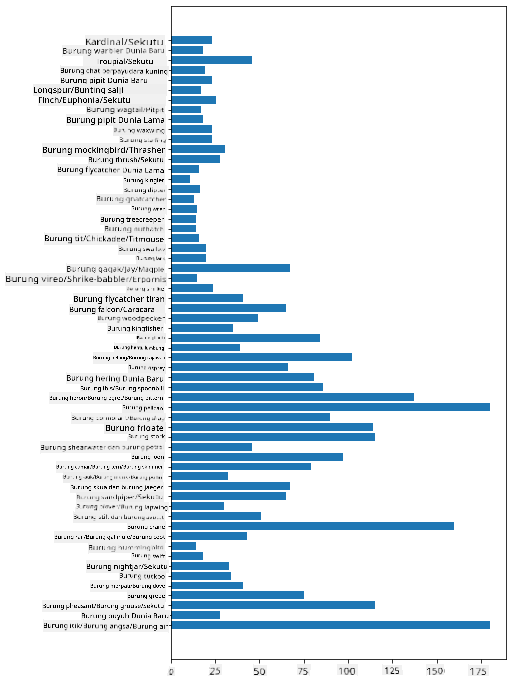

<!--
CO_OP_TRANSLATOR_METADATA:
{
  "original_hash": "69b32b6789a91f796ebc7a02f5575e03",
  "translation_date": "2025-09-04T20:48:41+00:00",
  "source_file": "3-Data-Visualization/09-visualization-quantities/README.md",
  "language_code": "ms"
}
-->
# Memvisualkan Kuantiti

| ](../../sketchnotes/09-Visualizing-Quantities.png)|
|:---:|
| Memvisualkan Kuantiti - _Sketchnote oleh [@nitya](https://twitter.com/nitya)_ |

Dalam pelajaran ini, anda akan meneroka cara menggunakan salah satu daripada banyak perpustakaan Python yang tersedia untuk belajar mencipta visualisasi menarik berkaitan konsep kuantiti. Dengan menggunakan dataset yang telah dibersihkan tentang burung di Minnesota, anda boleh mempelajari banyak fakta menarik tentang hidupan liar tempatan.  
## [Kuiz pra-pelajaran](https://purple-hill-04aebfb03.1.azurestaticapps.net/quiz/16)

## Perhatikan lebar sayap dengan Matplotlib

Satu perpustakaan yang sangat baik untuk mencipta plot dan carta yang mudah serta kompleks adalah [Matplotlib](https://matplotlib.org/stable/index.html). Secara umum, proses memplot data menggunakan perpustakaan ini melibatkan mengenal pasti bahagian dataframe yang ingin anda sasarkan, melakukan sebarang transformasi data yang diperlukan, menetapkan nilai paksi x dan y, memilih jenis plot yang sesuai, dan kemudian memaparkan plot tersebut. Matplotlib menawarkan pelbagai jenis visualisasi, tetapi untuk pelajaran ini, mari kita fokus pada jenis yang paling sesuai untuk memvisualkan kuantiti: carta garis, scatterplot, dan bar plot.

> ✅ Gunakan carta terbaik yang sesuai dengan struktur data anda dan cerita yang ingin anda sampaikan.  
> - Untuk menganalisis trend dari masa ke masa: garis  
> - Untuk membandingkan nilai: bar, kolum, pai, scatterplot  
> - Untuk menunjukkan bagaimana bahagian berkaitan dengan keseluruhan: pai  
> - Untuk menunjukkan taburan data: scatterplot, bar  
> - Untuk menunjukkan trend: garis, kolum  
> - Untuk menunjukkan hubungan antara nilai: garis, scatterplot, bubble  

Jika anda mempunyai dataset dan perlu mengetahui berapa banyak item tertentu yang termasuk, salah satu tugas pertama yang perlu dilakukan adalah memeriksa nilainya.  

✅ Terdapat 'cheat sheets' yang sangat baik untuk Matplotlib [di sini](https://matplotlib.org/cheatsheets/cheatsheets.pdf).

## Bina plot garis tentang nilai lebar sayap burung

Buka fail `notebook.ipynb` di root folder pelajaran ini dan tambahkan sel.

> Nota: data disimpan di root repo ini dalam folder `/data`.

```python
import pandas as pd
import matplotlib.pyplot as plt
birds = pd.read_csv('../../data/birds.csv')
birds.head()
```  
Data ini adalah campuran teks dan nombor:

|      | Nama                         | NamaSaintifik          | Kategori              | Order        | Keluarga | Genus       | StatusKonservasi    | MinPanjang | MaxPanjang | MinJisimBadan | MaxJisimBadan | MinLebarSayap | MaxLebarSayap |
| ---: | :--------------------------- | :--------------------- | :-------------------- | :----------- | :------- | :---------- | :----------------- | --------: | --------: | ----------: | ----------: | ----------: | ----------: |
|    0 | Itik bersiul perut hitam     | Dendrocygna autumnalis | Itik/Angsa/BurungAir  | Anseriformes | Anatidae | Dendrocygna | LC                 |        47 |        56 |         652 |        1020 |          76 |          94 |
|    1 | Itik bersiul fulvous         | Dendrocygna bicolor    | Itik/Angsa/BurungAir  | Anseriformes | Anatidae | Dendrocygna | LC                 |        45 |        53 |         712 |        1050 |          85 |          93 |
|    2 | Angsa salji                  | Anser caerulescens     | Itik/Angsa/BurungAir  | Anseriformes | Anatidae | Anser       | LC                 |        64 |        79 |        2050 |        4050 |         135 |         165 |
|    3 | Angsa Ross                   | Anser rossii           | Itik/Angsa/BurungAir  | Anseriformes | Anatidae | Anser       | LC                 |      57.3 |        64 |        1066 |        1567 |         113 |         116 |
|    4 | Angsa putih besar             | Anser albifrons        | Itik/Angsa/BurungAir  | Anseriformes | Anatidae | Anser       | LC                 |        64 |        81 |        1930 |        3310 |         130 |         165 |

Mari kita mulakan dengan memplotkan beberapa data numerik menggunakan plot garis asas. Katakan anda ingin melihat lebar sayap maksimum burung-burung menarik ini.

```python
wingspan = birds['MaxWingspan'] 
wingspan.plot()
```  


Apa yang anda perhatikan dengan segera? Nampaknya terdapat sekurang-kurangnya satu outlier - itu lebar sayap yang sangat besar! Lebar sayap 2300 sentimeter bersamaan dengan 23 meter - adakah terdapat Pterodactyl di Minnesota? Mari kita selidiki.

Walaupun anda boleh melakukan sort cepat dalam Excel untuk mencari outlier tersebut, yang mungkin adalah kesilapan taip, teruskan proses visualisasi dengan bekerja dari dalam plot.

Tambahkan label pada paksi x untuk menunjukkan jenis burung yang dimaksudkan:

```
plt.title('Max Wingspan in Centimeters')
plt.ylabel('Wingspan (CM)')
plt.xlabel('Birds')
plt.xticks(rotation=45)
x = birds['Name'] 
y = birds['MaxWingspan']

plt.plot(x, y)

plt.show()
```  


Walaupun dengan putaran label ditetapkan pada 45 darjah, terlalu banyak untuk dibaca. Mari cuba strategi yang berbeza: label hanya outlier tersebut dan tetapkan label dalam carta. Anda boleh menggunakan scatter chart untuk memberikan lebih ruang untuk pelabelan:

```python
plt.title('Max Wingspan in Centimeters')
plt.ylabel('Wingspan (CM)')
plt.tick_params(axis='both',which='both',labelbottom=False,bottom=False)

for i in range(len(birds)):
    x = birds['Name'][i]
    y = birds['MaxWingspan'][i]
    plt.plot(x, y, 'bo')
    if birds['MaxWingspan'][i] > 500:
        plt.text(x, y * (1 - 0.05), birds['Name'][i], fontsize=12)
    
plt.show()
```  
Apa yang berlaku di sini? Anda menggunakan `tick_params` untuk menyembunyikan label bawah dan kemudian mencipta gelung atas dataset burung anda. Dengan memplotkan carta menggunakan titik bulat biru kecil dengan `bo`, anda memeriksa sebarang burung dengan lebar sayap maksimum melebihi 500 dan memaparkan label mereka di sebelah titik jika ada. Anda mengimbangi label sedikit pada paksi y (`y * (1 - 0.05)`) dan menggunakan nama burung sebagai label.

Apa yang anda temui?

  
## Tapis data anda

Kedua-dua Bald Eagle dan Prairie Falcon, walaupun mungkin burung yang sangat besar, nampaknya salah label, dengan tambahan `0` pada lebar sayap maksimum mereka. Tidak mungkin anda akan bertemu Bald Eagle dengan lebar sayap 25 meter, tetapi jika ya, sila maklumkan kepada kami! Mari kita cipta dataframe baru tanpa dua outlier tersebut:

```python
plt.title('Max Wingspan in Centimeters')
plt.ylabel('Wingspan (CM)')
plt.xlabel('Birds')
plt.tick_params(axis='both',which='both',labelbottom=False,bottom=False)
for i in range(len(birds)):
    x = birds['Name'][i]
    y = birds['MaxWingspan'][i]
    if birds['Name'][i] not in ['Bald eagle', 'Prairie falcon']:
        plt.plot(x, y, 'bo')
plt.show()
```  

Dengan menapis outlier, data anda kini lebih kohesif dan mudah difahami.

  

Sekarang kita mempunyai dataset yang lebih bersih sekurang-kurangnya dari segi lebar sayap, mari kita temui lebih banyak tentang burung-burung ini.

Walaupun plot garis dan scatterplot boleh memaparkan maklumat tentang nilai data dan taburannya, kita ingin memikirkan nilai-nilai yang wujud dalam dataset ini. Anda boleh mencipta visualisasi untuk menjawab soalan-soalan berikut tentang kuantiti:

> Berapa banyak kategori burung yang ada, dan berapa bilangannya?  
> Berapa banyak burung yang pupus, terancam, jarang, atau biasa?  
> Berapa banyak terdapat genus dan order dalam terminologi Linnaeus?  
## Teroka carta bar

Carta bar adalah praktikal apabila anda perlu menunjukkan pengelompokan data. Mari kita teroka kategori burung yang wujud dalam dataset ini untuk melihat mana yang paling biasa berdasarkan bilangan.

Dalam fail notebook, cipta carta bar asas.

✅ Nota, anda boleh sama ada menapis dua burung outlier yang kita kenal pasti dalam bahagian sebelumnya, mengedit kesilapan dalam lebar sayap mereka, atau biarkan mereka dalam latihan ini yang tidak bergantung pada nilai lebar sayap.

Jika anda ingin mencipta carta bar, anda boleh memilih data yang ingin anda fokuskan. Carta bar boleh dicipta daripada data mentah:

```python
birds.plot(x='Category',
        kind='bar',
        stacked=True,
        title='Birds of Minnesota')

```  
  

Namun, carta bar ini tidak dapat dibaca kerana terdapat terlalu banyak data yang tidak dikelompokkan. Anda perlu memilih hanya data yang ingin anda plot, jadi mari kita lihat panjang burung berdasarkan kategori mereka.

Tapis data anda untuk memasukkan hanya kategori burung.

✅ Perhatikan bahawa anda menggunakan Pandas untuk menguruskan data, dan kemudian membiarkan Matplotlib melakukan pemetaan carta.

Oleh kerana terdapat banyak kategori, anda boleh memaparkan carta ini secara menegak dan menyesuaikan ketinggiannya untuk mengambil kira semua data:

```python
category_count = birds.value_counts(birds['Category'].values, sort=True)
plt.rcParams['figure.figsize'] = [6, 12]
category_count.plot.barh()
```  
  

Carta bar ini menunjukkan pandangan yang baik tentang bilangan burung dalam setiap kategori. Sekilas pandang, anda dapat melihat bahawa bilangan burung terbesar di kawasan ini adalah dalam kategori Itik/Angsa/BurungAir. Minnesota adalah 'tanah 10,000 tasik' jadi ini tidak mengejutkan!

✅ Cuba beberapa kiraan lain pada dataset ini. Adakah ada yang mengejutkan anda?

## Membandingkan data

Anda boleh mencuba perbandingan data yang dikelompokkan dengan mencipta paksi baru. Cuba perbandingan MaxPanjang burung, berdasarkan kategorinya:

```python
maxlength = birds['MaxLength']
plt.barh(y=birds['Category'], width=maxlength)
plt.rcParams['figure.figsize'] = [6, 12]
plt.show()
```  
  

Tiada yang mengejutkan di sini: burung kolibri mempunyai MaxPanjang paling kecil berbanding Pelikan atau Angsa. Bagus apabila data masuk akal secara logik!

Anda boleh mencipta visualisasi carta bar yang lebih menarik dengan meletakkan data secara bertindih. Mari kita letakkan Minimum dan Maximum Panjang pada kategori burung tertentu:

```python
minLength = birds['MinLength']
maxLength = birds['MaxLength']
category = birds['Category']

plt.barh(category, maxLength)
plt.barh(category, minLength)

plt.show()
```  
Dalam plot ini, anda dapat melihat julat per kategori burung untuk Minimum Panjang dan Maximum Panjang. Anda boleh mengatakan dengan yakin bahawa, berdasarkan data ini, semakin besar burung, semakin besar julat panjangnya. Menarik!

  

## 🚀 Cabaran

Dataset burung ini menawarkan banyak maklumat tentang pelbagai jenis burung dalam ekosistem tertentu. Cari di internet dan lihat jika anda boleh menemui dataset lain yang berorientasikan burung. Latih diri anda membina carta dan graf tentang burung-burung ini untuk menemui fakta yang tidak anda sedari.

## [Kuiz pasca-pelajaran](https://ff-quizzes.netlify.app/en/ds/)

## Ulasan & Kajian Kendiri

Pelajaran pertama ini telah memberikan anda beberapa maklumat tentang cara menggunakan Matplotlib untuk memvisualkan kuantiti. Lakukan penyelidikan tentang cara lain untuk bekerja dengan dataset untuk visualisasi. [Plotly](https://github.com/plotly/plotly.py) adalah salah satu yang tidak akan kita bahas dalam pelajaran ini, jadi lihat apa yang boleh ditawarkan olehnya.  
## Tugasan

[Lines, Scatters, and Bars](assignment.md)  

---

**Penafian**:  
Dokumen ini telah diterjemahkan menggunakan perkhidmatan terjemahan AI [Co-op Translator](https://github.com/Azure/co-op-translator). Walaupun kami berusaha untuk memastikan ketepatan, sila ambil perhatian bahawa terjemahan automatik mungkin mengandungi kesilapan atau ketidaktepatan. Dokumen asal dalam bahasa asalnya harus dianggap sebagai sumber yang berwibawa. Untuk maklumat penting, terjemahan manusia profesional adalah disyorkan. Kami tidak bertanggungjawab atas sebarang salah faham atau salah tafsir yang timbul daripada penggunaan terjemahan ini.