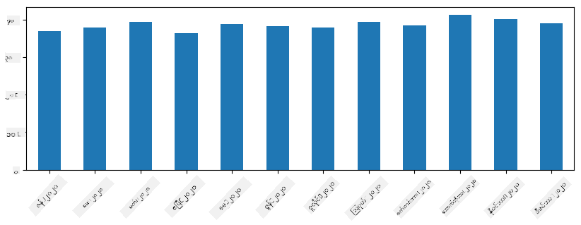
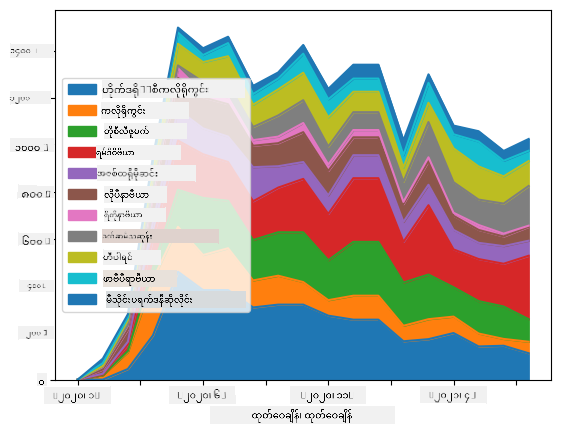

<!--
CO_OP_TRANSLATOR_METADATA:
{
  "original_hash": "7bfec050f4717dcc2dfd028aca9d21f3",
  "translation_date": "2025-09-06T16:05:05+00:00",
  "source_file": "2-Working-With-Data/07-python/README.md",
  "language_code": "my"
}
-->
# ဒေတာနှင့်အလုပ်လုပ်ခြင်း: Python နှင့် Pandas Library

|  ](../../sketchnotes/07-WorkWithPython.png) |
| :-------------------------------------------------------------------------------------------------------: |
|                 Python နှင့်အလုပ်လုပ်ခြင်း - _Sketchnote by [@nitya](https://twitter.com/nitya)_                 |

[](https://youtu.be/dZjWOGbsN4Y)

ဒေတာများကို သိမ်းဆည်းရန်နှင့် query languages အသုံးပြု၍ ရှာဖွေရန်အတွက် databases သည် အလွန်ထိရောက်သောနည်းလမ်းများပေးနိုင်သော်လည်း၊ ဒေတာကို ကိုယ်တိုင်ရေးသားထားသော program ဖြင့် ပြုပြင်ရန် flexibility အများဆုံးရှိသည်။ အချို့သောအခြေအနေများတွင် database query သည် ပိုထိရောက်နိုင်သော်လည်း၊ SQL ဖြင့် လွယ်ကူစွာလုပ်ဆောင်၍မရသော ဒေတာကို ရှုပ်ထွေးစွာ ပြုပြင်ရန်လိုအပ်သောအခါများရှိသည်။  
ဒေတာကို programming language မည်သည့်အမျိုးအစားဖြင့်မဆို ပြုပြင်နိုင်သော်လည်း၊ ဒေတာနှင့်အလုပ်လုပ်ရန်အတွက် အဆင့်မြင့်သော programming languages ရှိသည်။ ဒေတာသိပ္ပံပညာရှင်များသည် အောက်ပါဘာသာစကားများကို အများအားဖြင့်နှစ်သက်ကြသည်-

* **[Python](https://www.python.org/)** သည် general-purpose programming language ဖြစ်ပြီး၊ ရိုးရှင်းမှုကြောင့် စတင်လေ့လာသူများအတွက် အကောင်းဆုံးရွေးချယ်မှုတစ်ခုအဖြစ် သတ်မှတ်ခံရသည်။ Python တွင် ZIP archive မှ ဒေတာကို ထုတ်ယူခြင်း၊ သို့မဟုတ် ပုံကို grayscale သို့ ပြောင်းခြင်းကဲ့သို့သော အများအပြားသော အကူအညီပေးနိုင်သော libraries ရှိသည်။ ဒေတာသိပ္ပံပညာအပြင် Python ကို web development အတွက်လည်း အသုံးပြုကြသည်။
* **[R](https://www.r-project.org/)** သည် statistical data processing အတွက် ထုတ်လုပ်ထားသော traditional toolbox ဖြစ်သည်။ CRAN libraries များပါဝင်သောကြောင့် ဒေတာကို ပြုပြင်ရန်အတွက် ရွေးချယ်ရန်ကောင်းသောအရာဖြစ်သည်။ သို့သော် R သည် general-purpose programming language မဟုတ်သည့်အပြင် ဒေတာသိပ္ပံပညာနယ်ပယ်အပြင် အခြားနယ်ပယ်များတွင် ရှားရှားပါးပါးသာ အသုံးပြုသည်။
* **[Julia](https://julialang.org/)** သည် ဒေတာသိပ္ပံပညာအတွက် အထူးထုတ်လုပ်ထားသော programming language ဖြစ်သည်။ Python ထက် performance ပိုကောင်းစေရန် ရည်ရွယ်ထားသောကြောင့် သိပ္ပံလေ့လာမှုများအတွက် ကောင်းမွန်သောကိရိယာတစ်ခုဖြစ်သည်။

ဒီသင်ခန်းစာတွင် Python ကို အသုံးပြု၍ ရိုးရှင်းသော ဒေတာပြုပြင်ခြင်းကို အဓိကထားမည်ဖြစ်သည်။ Python ဘာသာစကားနှင့် အခြေခံကျွမ်းကျင်မှုရှိသည်ဟု သတ်မှတ်ထားမည်။ Python ကို ပိုမိုနက်နက်ရှိုင်းရှိုင်းလေ့လာလိုပါက အောက်ပါ resources များကို ရည်ညွှန်းနိုင်သည်-

* [Learn Python in a Fun Way with Turtle Graphics and Fractals](https://github.com/shwars/pycourse) - GitHub-based Python Programming အကျဉ်းချုပ်သင်တန်း
* [Take your First Steps with Python](https://docs.microsoft.com/en-us/learn/paths/python-first-steps/?WT.mc_id=academic-77958-bethanycheum) Microsoft Learn တွင် Learning Path

ဒေတာသည် အမျိုးမျိုးသောပုံစံများဖြင့် ရှိနိုင်သည်။ ဒီသင်ခန်းစာတွင် **tabular data**, **text** နှင့် **images** ဆိုသည့် ဒေတာပုံစံသုံးမျိုးကို စဉ်းစားမည်ဖြစ်သည်။

ဒေတာပြုပြင်ခြင်းနှင့်ပတ်သက်သော libraries အားလုံးကို အပြည့်အစုံမဖော်ပြဘဲ၊ အချို့သော ဥပမာများကိုသာ အဓိကထားမည်ဖြစ်သည်။ ဒါက သင်ကို အဓိကအကြောင်းအရာကို နားလည်စေပြီး၊ လိုအပ်သောအခါတွင် သင့်ပြဿနာများအတွက် ဖြေရှင်းချက်များကို ရှာဖွေရန် နားလည်မှုရရှိစေမည်ဖြစ်သည်။

> **အရေးကြီးသောအကြံပေးချက်**။ သင်မသိသော ဒေတာအပေါ်လုပ်ဆောင်ရန်လိုအပ်သော operation ကို ရှာဖွေရန်အခါတွင် အင်တာနက်တွင် ရှာဖွေကြည့်ပါ။ [Stackoverflow](https://stackoverflow.com/) တွင် Python ဖြင့် အများအပြားသော ရိုးရှင်းသောအလုပ်များအတွက် အသုံးဝင်သော code samples ရှိလေ့ရှိသည်။

## [Pre-lecture quiz](https://ff-quizzes.netlify.app/en/ds/quiz/12)

## Tabular Data နှင့် Dataframes

Relational databases အကြောင်းပြောသောအခါတွင် သင်သည် tabular data ကို ရင်းနှီးပြီးဖြစ်သည်။ ဒေတာများစွာရှိပြီး၊ အမျိုးမျိုးသော tables များတွင် ချိတ်ဆက်ထားသောအခါတွင် SQL ကို အသုံးပြု၍ အလုပ်လုပ်ရန် make sense ဖြစ်သည်။ သို့သော် အချို့သောအခြေအနေများတွင် table တစ်ခုရှိသော ဒေတာကို **နားလည်မှု** သို့မဟုတ် **insights** ရရှိရန်လိုအပ်သည်။ ဥပမာအားဖြင့် distribution, correlation between values စသည်ဖြင့်။ ဒေတာသိပ္ပံပညာတွင် original data ကို ပြုပြင်ပြီး visualization ပြုလုပ်ရန်လိုအပ်သောအခါများရှိသည်။ Python ကို အသုံးပြု၍ အလွယ်တကူလုပ်ဆောင်နိုင်သည်။

Python တွင် tabular data ကို handle လုပ်ရန် အထောက်အကူပြုသော libraries နှစ်ခုအများဆုံးအသုံးဝင်သည်-

* **[Pandas](https://pandas.pydata.org/)** သည် **Dataframes** ကို manipulate လုပ်ရန် အထောက်အကူပြုသည်။ Dataframes သည် relational tables နှင့် ဆင်တူသည်။ Named columns ရှိပြီး၊ rows, columns နှင့် dataframes အပေါ် operation များကို ပြုလုပ်နိုင်သည်။
* **[Numpy](https://numpy.org/)** သည် **tensors** (multi-dimensional **arrays**) နှင့်အလုပ်လုပ်ရန် library ဖြစ်သည်။ Array တွင် တူညီသော underlying type ရှိပြီး၊ dataframe ထက် ရိုးရှင်းသော်လည်း mathematical operations ပိုမိုလုပ်ဆောင်နိုင်ပြီး overhead ပိုမိုလျော့နည်းသည်။

အခြားသိထားသင့်သော libraries များမှာ-

* **[Matplotlib](https://matplotlib.org/)** သည် data visualization နှင့် graph plotting အတွက် အသုံးပြုသော library ဖြစ်သည်။
* **[SciPy](https://www.scipy.org/)** သည် အပိုသော သိပ္ပံ functions များပါဝင်သော library ဖြစ်သည်။ Probability နှင့် statistics အကြောင်းပြောသောအခါတွင် library ကို ရင်းနှီးပြီးဖြစ်သည်။

Python program ရဲ့အစမှာ libraries များကို import လုပ်ရန် အသုံးပြုသော code:
```python
import numpy as np
import pandas as pd
import matplotlib.pyplot as plt
from scipy import ... # you need to specify exact sub-packages that you need
```

Pandas သည် အခြေခံ concepts အချို့ကို အဓိကထားသည်။

### Series

**Series** သည် list သို့မဟုတ် numpy array နှင့် ဆင်တူသော values များ၏ အစဉ်လိုက်ဖြစ်သည်။ အဓိကကွာခြားချက်မှာ series တွင် **index** ရှိပြီး၊ series အပေါ် operation (ဥပမာ- add) ပြုလုပ်သောအခါ index ကို အရေးထားသည်။ Index သည် list သို့မဟုတ် array မှ default အနေဖြင့် integer row number ဖြစ်နိုင်သလို၊ date interval ကဲ့သို့သော ရှုပ်ထွေးသော structure ဖြစ်နိုင်သည်။

> **Note**: Pandas code အချို့ကို notebook [`notebook.ipynb`](notebook.ipynb) တွင်ပါဝင်သည်။ ဤနေရာတွင် အချို့သောဥပမာများကို outline လုပ်ထားပြီး၊ notebook အပြည့်အစုံကို ကြည့်ရှုရန် လွတ်လပ်သည်။

ဥပမာအားဖြင့်- ice-cream spot ရဲ့ sales ကို analysis လုပ်လိုပါက sales numbers (နေ့စဉ်ရောင်းချသော items အရေအတွက်) series ကို generate လုပ်မည်:
```python
start_date = "Jan 1, 2020"
end_date = "Mar 31, 2020"
idx = pd.date_range(start_date,end_date)
print(f"Length of index is {len(idx)}")
items_sold = pd.Series(np.random.randint(25,50,size=len(idx)),index=idx)
items_sold.plot()
```


အပတ်စဉ်တွင် party အတွက် ice-cream packs 10 ခုကို ထပ်မံယူသည့်အခါ series တစ်ခုကို week အဖြစ် index လုပ်၍ ဖော်ပြနိုင်သည်:
```python
additional_items = pd.Series(10,index=pd.date_range(start_date,end_date,freq="W"))
```
Series နှစ်ခုကို ပေါင်းလိုက်သောအခါ total number ရရှိမည်:
```python
total_items = items_sold.add(additional_items,fill_value=0)
total_items.plot()
```


> **Note**: `total_items+additional_items` syntax ကို ရိုးရှင်းစွာမသုံးပါ။ သုံးပါက `NaN` (*Not a Number*) values များကို ရရှိမည်။ ဒါကြောင့် `fill_value` parameter ကို addition အတွင်း specify လုပ်ရန်လိုအပ်သည်။

Time series တွင် **resample** လုပ်၍ time interval များကို ပြောင်းနိုင်သည်။ ဥပမာအားဖြင့် monthly mean sales volume ကို ရှာလိုပါက:
```python
monthly = total_items.resample("1M").mean()
ax = monthly.plot(kind='bar')
```


### DataFrame

DataFrame သည် index တူသော series များ၏ collection ဖြစ်သည်။ Series များကို DataFrame အဖြစ်ပေါင်းစည်းနိုင်သည်:
```python
a = pd.Series(range(1,10))
b = pd.Series(["I","like","to","play","games","and","will","not","change"],index=range(0,9))
df = pd.DataFrame([a,b])
```
ဤအခါ horizontal table တစ်ခုရရှိမည်:
|     | 0   | 1    | 2   | 3   | 4      | 5   | 6      | 7    | 8    |
| --- | --- | ---- | --- | --- | ------ | --- | ------ | ---- | ---- |
| 0   | 1   | 2    | 3   | 4   | 5      | 6   | 7      | 8    | 9    |
| 1   | I   | like | to  | use | Python | and | Pandas | very | much |

Series များကို columns အဖြစ်အသုံးပြု၍ dictionary ဖြင့် column names ကို specify လုပ်နိုင်သည်:
```python
df = pd.DataFrame({ 'A' : a, 'B' : b })
```
ဤအခါ table ကို အောက်ပါပုံစံရရှိမည်:

|     | A   | B      |
| --- | --- | ------ |
| 0   | 1   | I      |
| 1   | 2   | like   |
| 2   | 3   | to     |
| 3   | 4   | use    |
| 4   | 5   | Python |
| 5   | 6   | and    |
| 6   | 7   | Pandas |
| 7   | 8   | very   |
| 8   | 9   | much   |

**Note**: `.T` သည် DataFrame ကို transpose လုပ်ခြင်းဖြစ်ပြီး၊ `rename` operation သည် column names ကို ပြောင်းရန် အသုံးပြုသည်။

DataFrame အပေါ်လုပ်ဆောင်နိုင်သော အရေးကြီးသော operations များမှာ-

**Column selection**. Individual columns ကို `df['A']` ဖြင့် ရွေးနိုင်သည်။ Subset of columns ကို `df[['B','A']]` ဖြင့် DataFrame အခြားတစ်ခုအဖြစ် ရွေးနိုင်သည်။

**Filtering**. ဥပမာအားဖြင့် column `A` > 5 ဖြစ်သော rows များကို `df[df['A']>5]` ဖြင့် ရွေးနိုင်သည်။

> **Note**: Filtering သည် boolean series ကို index အဖြစ်အသုံးပြု၍ rows များကို ရွေးသည်။ Boolean expression များကို Python syntax ဖြင့် ရိုးရှင်းစွာရေးမရပါ။ `&` operation ကို boolean series အပေါ်အသုံးပြုရမည်။

**Creating new computable columns**. DataFrame အတွက် computable columns အသစ်များကို ရိုးရှင်းသော expression ဖြင့် ဖန်တီးနိုင်သည်:
```python
df['DivA'] = df['A']-df['A'].mean() 
``` 
Series ကို left-hand-side သို့ assign လုပ်၍ column အသစ်ကို ဖန်တီးသည်။

Complex expressions များကို `apply` function ဖြင့် ရေးနိုင်သည်:
```python
df['LenB'] = df['B'].apply(lambda x : len(x))
# or 
df['LenB'] = df['B'].apply(len)
```

**Selecting rows based on numbers**. `iloc` ကို အသုံးပြု၍ rows များကို ရွေးနိုင်သည်:
```python
df.iloc[:5]
```

**Grouping**. Pivot tables ကဲ့သို့သောအကျိုးအမြတ်ရရှိရန် group လုပ်နိုင်သည်:
```python
df.groupby(by='LenB')[['A','DivA']].mean()
```
Mean နှင့် group အတွင်း elements အရေအတွက်ကို `aggregate` function ဖြင့် ရေးနိုင်သည်:
```python
df.groupby(by='LenB') \
 .aggregate({ 'DivA' : len, 'A' : lambda x: x.mean() }) \
 .rename(columns={ 'DivA' : 'Count', 'A' : 'Mean'})
```

| LenB | Count | Mean     |
| ---- | ----- | -------- |
| 1    | 1     | 1.000000 |
| 2    | 1     | 3.000000 |
| 3    | 2     | 5.000000 |
| 4    | 3     | 6.333333 |
| 6    | 2     | 6.000000 |

### ဒေတာရယူခြင်း
### Series နှင့် DataFrames တည်ဆောက်ခြင်း

Python object တွေကို အသုံးပြုပြီး Series နဲ့ DataFrames တည်ဆောက်တာ ဘယ်လောက်လွယ်ကူတယ်ဆိုတာကို ကြည့်ပြီးသားဖြစ်ပါတယ်။ သို့သော် အချက်အလက်တွေဟာ အများအားဖြင့် text file တစ်ခု၊ ဒါမှမဟုတ် Excel table အနေနဲ့ ရှိတတ်ပါတယ်။ ကံကောင်းစွာ Pandas က disk မှ အချက်အလက်တွေကို load လုပ်ဖို့ လွယ်ကူတဲ့နည်းလမ်းတစ်ခုကို ပေးထားပါတယ်။ ဥပမာ CSV file ကို ဖတ်ရှုဖို့ အလွန်လွယ်ကူပါတယ်:
```python
df = pd.read_csv('file.csv')
```
"Challenge" အပိုင်းမှာ အခြားသော data loading နမူနာများ၊ အပြင်မှာရှိတဲ့ website တွေမှ data ကို ရယူခြင်းအပါအဝင်၊ တွေ့ရပါမယ်။

### Printing နှင့် Plotting

Data Scientist တစ်ဦးအနေနဲ့ အချက်အလက်တွေကို ရှာဖွေဖို့ လုပ်ရတတ်ပါတယ်၊ ဒါကြောင့် visualization လုပ်နိုင်ဖို့ အရေးကြီးပါတယ်။ DataFrame ကြီးတစ်ခုရှိတဲ့အခါမှာ အများအားဖြင့် ပထမဆုံးအတန်းတွေကို print ထုတ်ပြီး အားလုံးကို မှန်ကန်စွာလုပ်နေတယ်လို့ သေချာချင်တတ်ပါတယ်။ ဒါကို `df.head()` ကို ခေါ်ပြီး လုပ်နိုင်ပါတယ်။ Jupyter Notebook မှာ run လုပ်ရင် DataFrame ကို tabular ပုံစံလှလှပပနဲ့ ပြသပါလိမ့်မယ်။

`plot` function ကို အသုံးပြုပြီး column တချို့ကို visualize လုပ်တာကို ကြည့်ပြီးသားဖြစ်ပါတယ်။ `plot` ဟာ အလုပ်အတော်များစွာအတွက် အသုံးဝင်ပြီး `kind=` parameter ကို အသုံးပြုပြီး graph အမျိုးအစားများစွာကို ပံ့ပိုးပေးနိုင်ပါတယ်။ သို့သော် `matplotlib` library ကို အသုံးပြုပြီး ပိုမိုရှုပ်ထွေးတဲ့အရာတွေကို plot လုပ်နိုင်ပါတယ်။ Data visualization ကို သီးသန့်သင်ခန်းစာတွေမှာ အသေးစိတ်လေ့လာပါမယ်။

ဒီအကျဉ်းချုပ်မှာ Pandas ရဲ့ အရေးကြီးဆုံး concept တွေကို ဖော်ပြထားပါတယ်၊ သို့သော် library ဟာ အလွန်ချောမွေ့ပြီး မိမိလုပ်နိုင်တဲ့အရာတွေမှာ အကန့်အသတ်မရှိပါဘူး! အခုတော့ ဒီအတတ်ပညာကို အသုံးပြုပြီး အထူးပြဿနာကို ဖြေရှင်းကြပါစို့။

## 🚀 Challenge 1: COVID-19 ပျံ့နှံ့မှုကို ခွဲခြမ်းစိတ်ဖြာခြင်း

ပထမပြဿနာမှာ COVID-19 ရောဂါပျံ့နှံ့မှုကို မော်ဒယ်တစ်ခုအနေနဲ့ ဖော်ပြပါမယ်။ ဒါကိုလုပ်ဖို့ [Center for Systems Science and Engineering](https://systems.jhu.edu/) (CSSE) မှ [Johns Hopkins University](https://jhu.edu/) က ပေးထားတဲ့ အမျိုးမျိုးသောနိုင်ငံများမှ ကူးစက်ခံရသူအရေအတွက်အချက်အလက်တွေကို အသုံးပြုပါမယ်။ Dataset ကို [ဒီ GitHub Repository](https://github.com/CSSEGISandData/COVID-19) မှာ ရနိုင်ပါတယ်။

အချက်အလက်တွေကို ဘယ်လိုကိုင်တွယ်ရမလဲဆိုတာကို ပြသဖို့ [`notebook-covidspread.ipynb`](notebook-covidspread.ipynb) ကို ဖွင့်ပြီး အပေါ်မှ အောက်သို့ ဖတ်ရှုပါ။ Cell တွေကို run လုပ်နိုင်ပြီး အဆုံးမှာ ကျွန်တော်တို့ထားခဲ့တဲ့ challenge တွေကို လုပ်နိုင်ပါတယ်။


> Jupyter Notebook မှာ code ကို ဘယ်လို run လုပ်ရမလဲ မသိရင် [ဒီဆောင်းပါး](https://soshnikov.com/education/how-to-execute-notebooks-from-github/) ကို ကြည့်ပါ။

## Unstructured Data ကို ကိုင်တွယ်ခြင်း

အချက်အလက်တွေဟာ tabular ပုံစံနဲ့ ရှိတတ်ပေမယ့် တချို့အခါမှာ ပုံစံမရှိတဲ့ အချက်အလက်တွေ၊ ဥပမာ text ဒါမှမဟုတ် image တွေကို ကိုင်တွယ်ရတတ်ပါတယ်။ ဒီအခါမှာ အပေါ်မှာ ပြထားတဲ့ data processing နည်းလမ်းတွေကို အသုံးပြုဖို့ structured data ကို **extract** လုပ်ဖို့ လိုအပ်ပါတယ်။ ဥပမာအချို့မှာ:

* Text မှ keyword တွေကို extract လုပ်ပြီး keyword တွေ ဘယ်လောက်ကြိမ်တွေ့ရလဲဆိုတာ ကြည့်ခြင်း
* Neural networks ကို အသုံးပြုပြီး ပုံထဲမှာရှိတဲ့ object တွေကို အချက်အလက်ရယူခြင်း
* Video camera feed မှ လူတွေ့ရဲ့ခံစားချက်အချက်အလက်ရယူခြင်း

## 🚀 Challenge 2: COVID Papers ကို ခွဲခြမ်းစိတ်ဖြာခြင်း

ဒီ challenge မှာ COVID pandemic နဲ့ ဆက်စပ်တဲ့ သိပ္ပံစာတမ်းတွေကို ကိုင်တွယ်ပါမယ်။ [CORD-19 Dataset](https://www.kaggle.com/allen-institute-for-ai/CORD-19-research-challenge) မှာ metadata နဲ့ abstract တွေပါဝင်တဲ့ COVID ပေါ်မှာ စာတမ်း ၇၀၀၀ ကျော် (ရေးသားချိန်အချိန်မှာ) ရနိုင်ပါတယ်။ အချို့စာတမ်းတွေအတွက် full text ပါဝင်ပါတယ်။

[Text Analytics for Health](https://docs.microsoft.com/azure/cognitive-services/text-analytics/how-tos/text-analytics-for-health/?WT.mc_id=academic-77958-bethanycheum) cognitive service ကို အသုံးပြုပြီး dataset ကို ခွဲခြမ်းစိတ်ဖြာထားတဲ့ နမူနာကို [ဒီ blog post](https://soshnikov.com/science/analyzing-medical-papers-with-azure-and-text-analytics-for-health/) မှာ ဖော်ပြထားပါတယ်။ ကျွန်တော်တို့ ဒီ analysis ရဲ့ ရိုးရှင်းတဲ့ version ကို ဆွေးနွေးပါမယ်။

> **NOTE**: Dataset ကို repository မှာ မပါဝင်ပါဘူး။ [Kaggle](https://www.kaggle.com/allen-institute-for-ai/CORD-19-research-challenge?select=metadata.csv) မှာ [`metadata.csv`](https://www.kaggle.com/allen-institute-for-ai/CORD-19-research-challenge?select=metadata.csv) ကို download လုပ်ဖို့လိုအပ်နိုင်ပါတယ်။ Kaggle မှာ registration လုပ်ဖို့လိုအပ်နိုင်ပါတယ်။ [ဒီနေရာ](https://ai2-semanticscholar-cord-19.s3-us-west-2.amazonaws.com/historical_releases.html) မှာ registration မလိုအပ်ဘဲ dataset ကို download လုပ်နိုင်ပါတယ်၊ ဒါပေမယ့် metadata file အပြင် full texts အားလုံးပါဝင်ပါမယ်။

[`notebook-papers.ipynb`](notebook-papers.ipynb) ကို ဖွင့်ပြီး အပေါ်မှ အောက်သို့ ဖတ်ရှုပါ။ Cell တွေကို run လုပ်နိုင်ပြီး အဆုံးမှာ ကျွန်တော်တို့ထားခဲ့တဲ့ challenge တွေကို လုပ်နိုင်ပါတယ်။



## Image Data ကို ကိုင်တွယ်ခြင်း

လတ်တလောမှာ ပုံတွေကို နားလည်နိုင်တဲ့ အလွန်အစွမ်းထက်တဲ့ AI model တွေ ဖွံ့ဖြိုးလာပါတယ်။ Pre-trained neural networks ဒါမှမဟုတ် cloud services ကို အသုံးပြုပြီး အလုပ်အမျိုးမျိုးကို ဖြေရှင်းနိုင်ပါတယ်။ ဥပမာအချို့မှာ:

* **Image Classification** - ပုံကို pre-defined class တစ်ခုမှာ categorize လုပ်နိုင်ပါတယ်။ [Custom Vision](https://azure.microsoft.com/services/cognitive-services/custom-vision-service/?WT.mc_id=academic-77958-bethanycheum) ကို အသုံးပြုပြီး ကိုယ်ပိုင် image classifier တွေကို training လုပ်နိုင်ပါတယ်။
* **Object Detection** - ပုံထဲမှာ object တွေကို detect လုပ်နိုင်ပါတယ်။ [computer vision](https://azure.microsoft.com/services/cognitive-services/computer-vision/?WT.mc_id=academic-77958-bethanycheum) က အများအားဖြင့် object တွေကို detect လုပ်နိုင်ပြီး [Custom Vision](https://azure.microsoft.com/services/cognitive-services/custom-vision-service/?WT.mc_id=academic-77958-bethanycheum) ကို training လုပ်ပြီး အထူး object တွေကို detect လုပ်နိုင်ပါတယ်။
* **Face Detection** - အသက်၊ ကျား/မ၊ ခံစားချက် detection ပါဝင်ပါတယ်။ [Face API](https://azure.microsoft.com/services/cognitive-services/face/?WT.mc_id=academic-77958-bethanycheum) ကို အသုံးပြုနိုင်ပါတယ်။

Python SDK တွေကို အသုံးပြုပြီး [cloud services](https://docs.microsoft.com/samples/azure-samples/cognitive-services-python-sdk-samples/cognitive-services-python-sdk-samples/?WT.mc_id=academic-77958-bethanycheum) တွေကို ခေါ်နိုင်ပြီး data exploration workflow မှာ ပေါင်းစပ်နိုင်ပါတယ်။

Image data source တွေကို explore လုပ်တဲ့ နမူနာအချို့မှာ:
* [How to Learn Data Science without Coding](https://soshnikov.com/azure/how-to-learn-data-science-without-coding/) blog post မှာ Instagram ပုံတွေကို explore လုပ်ပြီး ပုံတစ်ပုံကို ဘယ်လိုလူတွေ like ပေးတယ်ဆိုတာ နားလည်ဖို့ ကြိုးစားပါတယ်။ [computer vision](https://azure.microsoft.com/services/cognitive-services/computer-vision/?WT.mc_id=academic-77958-bethanycheum) ကို အသုံးပြုပြီး ပုံတွေကနေ အချက်အလက်တွေကို extract လုပ်ပြီး [Azure Machine Learning AutoML](https://docs.microsoft.com/azure/machine-learning/concept-automated-ml/?WT.mc_id=academic-77958-bethanycheum) ကို အသုံးပြုပြီး model တစ်ခုကို တည်ဆောက်ပါတယ်။
* [Facial Studies Workshop](https://github.com/CloudAdvocacy/FaceStudies) မှာ [Face API](https://azure.microsoft.com/services/cognitive-services/face/?WT.mc_id=academic-77958-bethanycheum) ကို အသုံးပြုပြီး ပုံထဲမှာရှိတဲ့ လူတွေ့ရဲ့ခံစားချက်ကို extract လုပ်ပြီး လူတွေကို ဘယ်လိုပျော်ရွှင်စေတယ်ဆိုတာ နားလည်ဖို့ ကြိုးစားပါတယ်။

## နိဂုံး

Structured ဒါမှမဟုတ် unstructured data ရှိနေပါက Python ကို အသုံးပြုပြီး data processing နဲ့ နားလည်မှုနဲ့ ပတ်သက်တဲ့ အဆင့်အားလုံးကို လုပ်နိုင်ပါတယ်။ Python ဟာ data processing အတွက် အလွန် flexible ဖြစ်ပြီး ဒါကြောင့် Data Scientist အများစုက Python ကို အဓိက tool အနေနဲ့ အသုံးပြုကြပါတယ်။ Data science ကို အလေးထားပြီး လေ့လာချင်ရင် Python ကို နက်နက်ရှိုင်းရှိုင်း လေ့လာဖို့ အကြံပေးပါတယ်။

## [Post-lecture quiz](https://ff-quizzes.netlify.app/en/ds/quiz/13)

## Review & Self Study

**Books**
* [Wes McKinney. Python for Data Analysis: Data Wrangling with Pandas, NumPy, and IPython](https://www.amazon.com/gp/product/1491957662)

**Online Resources**
* Official [10 minutes to Pandas](https://pandas.pydata.org/pandas-docs/stable/user_guide/10min.html) tutorial
* [Documentation on Pandas Visualization](https://pandas.pydata.org/pandas-docs/stable/user_guide/visualization.html)

**Learning Python**
* [Learn Python in a Fun Way with Turtle Graphics and Fractals](https://github.com/shwars/pycourse)
* [Take your First Steps with Python](https://docs.microsoft.com/learn/paths/python-first-steps/?WT.mc_id=academic-77958-bethanycheum) Learning Path on [Microsoft Learn](http://learn.microsoft.com/?WT.mc_id=academic-77958-bethanycheum)

## Assignment

[Perform more detailed data study for the challenges above](assignment.md)

## Credits

ဒီသင်ခန်းစာကို [Dmitry Soshnikov](http://soshnikov.com) မှ ♥️ နဲ့ရေးသားထားပါတယ်။

---

**ဝက်ဘ်ဆိုက်မှတ်ချက်**:  
ဤစာရွက်စာတမ်းကို AI ဘာသာပြန်ဝန်ဆောင်မှု [Co-op Translator](https://github.com/Azure/co-op-translator) ကို အသုံးပြု၍ ဘာသာပြန်ထားပါသည်။ ကျွန်ုပ်တို့သည် တိကျမှန်ကန်မှုအတွက် ကြိုးစားနေပါသော်လည်း၊ အလိုအလျောက်ဘာသာပြန်ဆိုမှုများတွင် အမှားများ သို့မဟုတ် မတိကျမှုများ ပါဝင်နိုင်သည်ကို ကျေးဇူးပြု၍ သတိပြုပါ။ မူရင်းဘာသာစကားဖြင့် ရေးသားထားသော စာရွက်စာတမ်းကို အာဏာတည်သော ရင်းမြစ်အဖြစ် သတ်မှတ်သင့်ပါသည်။ အရေးကြီးသော အချက်အလက်များအတွက် လူသားပညာရှင်များ၏ ပရော်ဖက်ရှင်နယ်ဘာသာပြန်ဆိုမှုကို အကြံပြုပါသည်။ ဤဘာသာပြန်ဆိုမှုကို အသုံးပြုခြင်းမှ ဖြစ်ပေါ်လာသော နားလည်မှုမှားများ သို့မဟုတ် အဓိပ္ပာယ်မှားများအတွက် ကျွန်ုပ်တို့သည် တာဝန်မယူပါ။