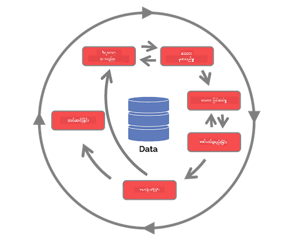

<!--
CO_OP_TRANSLATOR_METADATA:
{
  "original_hash": "07e12a25d20b8f191e3cb651c27fdb2b",
  "translation_date": "2025-09-06T21:48:27+00:00",
  "source_file": "4-Data-Science-Lifecycle/14-Introduction/README.md",
  "language_code": "my"
}
-->
# ဒေတာသိပ္ပံ၏ အသက်တာစဉ်ကို မိတ်ဆက်ခြင်း

| ](../../sketchnotes/14-DataScience-Lifecycle.png)|
|:---:|
| ဒေတာသိပ္ပံ၏ အသက်တာစဉ်ကို မိတ်ဆက်ခြင်း - _Sketchnote by [@nitya](https://twitter.com/nitya)_ |

## [Pre-Lecture Quiz](https://ff-quizzes.netlify.app/en/ds/quiz/26)

ဒီအချိန်မှာ သင်ဟာ ဒေတာသိပ္ပံဟာ တစ်ခုတည်းသော လုပ်ငန်းစဉ်ဖြစ်တယ်ဆိုတာ သိရှိလာပြီးဖြစ်နိုင်ပါတယ်။ ဒီလုပ်ငန်းစဉ်ကို အောက်ပါ ၅ အဆင့်အလိုက် ခွဲခြားနိုင်ပါတယ်-

- ဒေတာရယူခြင်း
- ဒေတာကို အလုပ်လုပ်ခြင်း
- ဒေတာကို ခွဲခြမ်းစိတ်ဖြာခြင်း
- အချက်အလက်ကို ဆက်သွယ်ပေးခြင်း
- စီမံခန့်ခွဲခြင်း

ဒီသင်ခန်းစာမှာ အသက်တာစဉ်ရဲ့ အရေးကြီးတဲ့ အပိုင်း ၃ ခုကို အဓိကထားပြီး လေ့လာပါမယ်- ဒေတာရယူခြင်း၊ အလုပ်လုပ်ခြင်း၊ စီမံခန့်ခွဲခြင်း။

> [Berkeley School of Information](https://ischoolonline.berkeley.edu/data-science/what-is-data-science/) မှဓာတ်ပုံ

## ဒေတာရယူခြင်း

အသက်တာစဉ်ရဲ့ ပထမအဆင့်ဟာ အရေးကြီးဆုံးဖြစ်ပြီး နောက်အဆင့်တွေဟာ ဒီအဆင့်ပေါ်မှာ မူတည်ပါတယ်။ ဒါဟာ အလုံးစုံ ၂ အဆင့်ကို ပေါင်းစပ်ထားတဲ့ အဆင့်တစ်ခုဖြစ်ပါတယ်- ဒေတာရယူခြင်းနဲ့ လိုအပ်တဲ့ ရည်ရွယ်ချက်နဲ့ ပြဿနာတွေကို သတ်မှတ်ခြင်း။  
ပရောဂျက်ရဲ့ ရည်မှန်းချက်တွေကို သတ်မှတ်ဖို့ ပြဿနာနဲ့ မေးခွန်းကို နက်နက်ရှိုင်းရှိုင်း နားလည်ဖို့ လိုအပ်ပါတယ်။ ပထမဦးဆုံး ကျွန်တော်တို့အနေနဲ့ ပြဿနာကို ဖြေရှင်းဖို့ လိုအပ်တဲ့သူတွေကို ရှာဖွေပြီး ရယူဖို့ လိုအပ်ပါတယ်။ ဒါတွေဟာ စီးပွားရေးလုပ်ငန်းရဲ့ အကျိုးဆောင်တွေ ဖြစ်နိုင်ပြီး ပရောဂျက်ရဲ့ အဓိကပံ့ပိုးသူတွေ ဖြစ်နိုင်ပါတယ်။ သူတို့က ဒီပရောဂျက်က ဘယ်သူတွေ၊ ဘာတွေ အကျိုးရှိမလဲဆိုတာကို သတ်မှတ်ပေးနိုင်ပါတယ်။ ရည်မှန်းချက်တစ်ခုဟာ တိကျပြီး တိုင်းတာနိုင်ဖို့ လိုအပ်ပါတယ်။

ဒေတာသိပ္ပံပညာရှင်တွေ မေးနိုင်တဲ့ မေးခွန်းတွေ:
- ဒီပြဿနာကို အရင်က ရှင်းလင်းဖူးလား? ဘာတွေ ရှာဖွေတွေ့ရှိခဲ့လဲ?
- ရည်ရွယ်ချက်နဲ့ ရည်မှန်းချက်ကို ပါဝင်သူအားလုံး နားလည်ထားလား?
- မရေရာမှုရှိလား? ဘယ်လို လျှော့ချနိုင်မလဲ?
- အကန့်အသတ်တွေ ဘာတွေလဲ?
- နောက်ဆုံးရလဒ်ဟာ ဘယ်လိုပုံစံရှိနိုင်မလဲ?
- အရင်းအမြစ် (အချိန်၊ လူတွေ၊ ကွန်ပျူတာ) ဘယ်လောက် ရရှိနိုင်လဲ?

နောက်တစ်ခုကတော့ ရည်မှန်းချက်တွေကို ရောက်ရှိဖို့ လိုအပ်တဲ့ ဒေတာကို ရှာဖွေ၊ စုဆောင်းပြီး စမ်းသပ်ဖို့ ဖြစ်ပါတယ်။ ဒီအဆင့်မှာ ဒေတာသိပ္ပံပညာရှင်တွေဟာ ဒေတာရဲ့ အရည်အသွေးနဲ့ အရေအတွက်ကို သုံးသပ်ဖို့ လိုအပ်ပါတယ်။ ဒေတာရရှိမှုဟာ ရည်မှန်းချက်ကို ရောက်ရှိဖို့ အထောက်အကူဖြစ်မယ်လို့ အတည်ပြုဖို့ ဒေတာကို စမ်းသပ်ဖို့ လိုအပ်ပါတယ်။

ဒေတာအပေါ် ဒေတာသိပ္ပံပညာရှင်တွေ မေးနိုင်တဲ့ မေးခွန်းတွေ:
- ကျွန်တော့်မှာ ရရှိပြီးသား ဒေတာတွေ ဘာတွေလဲ?
- ဒီဒေတာကို ဘယ်သူပိုင်ထားလဲ?
- ကိုယ်ရေးကိုယ်တာအချက်အလက်ဆိုင်ရာ စိုးရိမ်မှုတွေ ရှိလား?
- ဒီပြဿနာကို ဖြေရှင်းဖို့ ဒေတာလုံလောက်လား?
- ဒီပြဿနာအတွက် ဒေတာရဲ့ အရည်အသွေး လုံလောက်လား?
- ဒေတာကနေ ထပ်မံသိရှိလာတဲ့ အချက်အလက်တွေကြောင့် ရည်မှန်းချက်တွေကို ပြောင်းလဲသင့်လား?

## ဒေတာကို အလုပ်လုပ်ခြင်း

အသက်တာစဉ်ရဲ့ ဒီအဆင့်မှာ ဒေတာထဲက ပုံစံတွေကို ရှာဖွေခြင်းနဲ့ မော်ဒယ်တည်ဆောက်ခြင်းကို အဓိကထားပါတယ်။ ဒီအဆင့်မှာ အသုံးပြုတဲ့ နည်းလမ်းတွေဟာ ဒေတာထဲက ပုံစံတွေကို ရှာဖွေဖို့ သင်္ချာနည်းလမ်းတွေကို အသုံးပြုပါတယ်။ ဒေတာအများကြီးနဲ့ အလုပ်လုပ်တဲ့အခါ လူတွေ အလုပ်လုပ်ဖို့ အလွန်ခက်ခဲတဲ့အတွက် ကွန်ပျူတာတွေကို အသုံးပြုရပါတယ်။ ဒီအဆင့်မှာ ဒေတာသိပ္ပံနဲ့ စက်လေ့လာမှု (Machine Learning) တို့ ဆုံဆည်းပါတယ်။ စက်လေ့လာမှုဟာ ဒေတာကို နားလည်ဖို့ မော်ဒယ်တည်ဆောက်တဲ့ လုပ်ငန်းစဉ်ဖြစ်ပါတယ်။ မော်ဒယ်တွေဟာ ဒေတာထဲက အပြောင်းအလဲတွေကို ကိုယ်စားပြုပြီး ရလဒ်ကို ခန့်မှန်းဖို့ အထောက်အကူဖြစ်ပါတယ်။

ဒီအဆင့်မှာ အသုံးပြုတဲ့ နည်းလမ်းတွေကို ML for Beginners သင်ခန်းစာမှာ လေ့လာနိုင်ပါတယ်။ အောက်ပါလင့်ခ်တွေကို အသုံးပြုပြီး ပိုမိုသိရှိပါ:

- [Classification](https://github.com/microsoft/ML-For-Beginners/tree/main/4-Classification): ဒေတာကို အမျိုးအစားအလိုက် စီစဉ်ခြင်း။
- [Clustering](https://github.com/microsoft/ML-For-Beginners/tree/main/5-Clustering): ဒေတာကို ဆင်တူတဲ့ အုပ်စုတွေထဲ စုပေါင်းခြင်း။
- [Regression](https://github.com/microsoft/ML-For-Beginners/tree/main/2-Regression): အပြောင်းအလဲတွေကြား ဆက်နွယ်မှုကို သတ်မှတ်ပြီး တန်ဖိုးတွေကို ခန့်မှန်းခြင်း။

## စီမံခန့်ခွဲခြင်း

အသက်တာစဉ်ရဲ့ ပုံစံမှာ Maintenance (စီမံခန့်ခွဲခြင်း) ဟာ ဒေတာရယူခြင်းနဲ့ ဒေတာကို အလုပ်လုပ်ခြင်းကြားမှာ ရှိနေပါတယ်။ Maintenance ဟာ ပရောဂျက်တစ်ခုရဲ့ လုပ်ငန်းစဉ်တစ်လျှောက်လုံးမှာ ဒေတာကို စီမံခန့်ခွဲခြင်း၊ သိမ်းဆည်းခြင်းနဲ့ လုံခြုံရေးကို အဆက်မပြတ်လုပ်ဆောင်ရတဲ့ လုပ်ငန်းစဉ်ဖြစ်ပါတယ်။

### ဒေတာကို သိမ်းဆည်းခြင်း
ဒေတာကို ဘယ်လိုနဲ့ ဘယ်မှာ သိမ်းဆည်းမလဲဆိုတာက ဒေတာရဲ့ သိမ်းဆည်းမှုကုန်ကျစရိတ်နဲ့ ဒေတာကို အမြန်ဆုံးရယူနိုင်မှုကို သက်ရောက်စေပါတယ်။ ဒီဆုံးဖြတ်ချက်တွေဟာ ဒေတာသိပ္ပံပညာရှင်တစ်ဦးတည်းက မလုပ်နိုင်ပေမယ့် ဒေတာကို ဘယ်လိုနဲ့ အလုပ်လုပ်မလဲဆိုတာမှာ သက်ရောက်မှုရှိနိုင်ပါတယ်။

အခေတ်သစ် ဒေတာသိမ်းဆည်းမှုစနစ်တွေမှာ သက်ရောက်မှုရှိနိုင်တဲ့ အချက်အလက်တွေ:

**On premise vs off premise vs public or private cloud**

On premise ဆိုတာက ကိုယ့်ပိုင် စက်ပစ္စည်းပေါ်မှာ ဒေတာကို သိမ်းဆည်းခြင်းဖြစ်ပြီး၊ off premise ဆိုတာက ကိုယ့်ပိုင်မဟုတ်တဲ့ ဒေတာစင်တာပေါ်မှာ အားထားခြင်းဖြစ်ပါတယ်။ Public cloud ဟာ ဒေတာကို သိမ်းဆည်းဖို့ လူကြိုက်များတဲ့ ရွေးချယ်မှုဖြစ်ပြီး ဒေတာကို ဘယ်မှာ သိမ်းဆည်းထားတယ်ဆိုတာ မသိရပါဘူး။ Public cloud ဟာ အခြေခံအဆောက်အအုံကို အားလုံးနဲ့ မျှဝေထားပြီး၊ Private cloud ဟာ လုံခြုံရေးလိုအပ်ချက်များကြောင့် ကိုယ်ပိုင် cloud services ကို အသုံးပြုပါတယ်။ Cloud-based ဒေတာနဲ့ ပတ်သက်တဲ့ သင်ခန်းစာတွေကို [နောက်ပိုင်းသင်ခန်းစာတွေ](https://github.com/microsoft/Data-Science-For-Beginners/tree/main/5-Data-Science-In-Cloud) မှာ လေ့လာနိုင်ပါတယ်။

**Cold vs hot data**

မော်ဒယ်တွေကို လေ့ကျင့်ဖို့ ဒေတာပိုမိုလိုအပ်နိုင်ပါတယ်။ မော်ဒယ်ကို ပြည့်စုံအောင်လုပ်ပြီးတဲ့အခါမှာလည်း အသုံးပြုဖို့ ဒေတာအသစ်တွေ ရောက်ရှိလာနိုင်ပါတယ်။ ဒေတာကို သိမ်းဆည်းခြင်းနဲ့ ရယူခြင်းမှာ ကုန်ကျစရိတ်တိုးလာနိုင်ပါတယ်။ အလွန်ရှားရှားသုံးတဲ့ ဒေတာ (cold data) ကို အမြဲအသုံးပြုတဲ့ ဒေတာ (hot data) နဲ့ ခွဲခြားထားခြင်းက စျေးသက်သာတဲ့ ရွေးချယ်မှုဖြစ်နိုင်ပါတယ်။ Cold data ကို ရယူဖို့ လိုအပ်တဲ့အခါမှာ Hot data ထက် နည်းနည်းနောက်ကျနိုင်ပါတယ်။

### ဒေတာကို စီမံခန့်ခွဲခြင်း
ဒေတာနဲ့ အလုပ်လုပ်တဲ့အခါမှာ ဒေတာတစ်ချို့ကို သန့်စင်ဖို့ လိုအပ်နိုင်ပါတယ်။ [ဒေတာပြင်ဆင်မှု](https://github.com/microsoft/Data-Science-For-Beginners/tree/main/2-Working-With-Data/08-data-preparation) သင်ခန်းစာမှာ လေ့လာထားတဲ့ နည်းလမ်းတွေကို အသုံးပြုနိုင်ပါတယ်။ ဒေတာအသစ်ရောက်လာတဲ့အခါမှာလည်း အရည်အသွေးကို တူညီအောင် ထိန်းသိမ်းဖို့ လိုအပ်ပါတယ်။ Automated tool တွေကို အသုံးပြုပြီး ဒေတာကို သန့်စင်ခြင်း၊ စုပေါင်းခြင်းနဲ့ ဖိသိမ်းခြင်းလုပ်ငန်းစဉ်တွေကို အလိုအလျောက်လုပ်ဆောင်နိုင်ပါတယ်။ Azure Data Factory ဟာ ဒီ tool တွေထဲက တစ်ခုဖြစ်ပါတယ်။

### ဒေတာကို လုံခြုံစွာ သိမ်းဆည်းခြင်း
ဒေတာကို လုံခြုံစွာ သိမ်းဆည်းဖို့ရည်ရွယ်ချက်က ဒေတာကို ဘယ်လိုရယူပြီး ဘယ်လိုအသုံးပြုမလဲဆိုတာကို ထိန်းချုပ်နိုင်ဖို့ ဖြစ်ပါတယ်။ ဒေတာကို လုံခြုံစွာ သိမ်းဆည်းဖို့ အောက်ပါအချက်တွေကို လိုက်နာရပါတယ်-

- ဒေတာအားလုံးကို စကားဝှက်ဖြင့် ကာကွယ်ထားကြောင်း အတည်ပြုပါ။
- ဖောက်သည်တွေကို သူတို့ရဲ့ ဒေတာကို ဘယ်လိုအသုံးပြုမလဲဆိုတာ အကြောင်းကြားပါ။
- ပရောဂျက်ကနေ ထွက်သွားတဲ့သူတွေကို ဒေတာရယူခွင့်ကို ဖယ်ရှားပါ။
- ပရောဂျက်အဖွဲ့ဝင်တစ်ချို့ကိုသာ ဒေတာကို ပြောင်းလဲခွင့်ပေးပါ။

## 🚀 စိန်ခေါ်မှု

Data Science Lifecycle ဟာ အမျိုးမျိုးသော ဗားရှင်းတွေ ရှိပြီး အဆင့်နဲ့ အမည်တွေက မတူနိုင်ပေမယ့် ဒီသင်ခန်းစာမှာ ဖော်ပြထားတဲ့ လုပ်ငန်းစဉ်တွေကို ပါဝင်ထားပါတယ်။

[Team Data Science Process lifecycle](https://docs.microsoft.com/en-us/azure/architecture/data-science-process/lifecycle) နဲ့ [Cross-industry standard process for data mining](https://www.datascience-pm.com/crisp-dm-2/) ကို လေ့လာပြီး တူညီချက် ၃ ခုနဲ့ ကွဲပြားချက် ၃ ခုကို ဖော်ပြပါ။

|Team Data Science Process (TDSP)|Cross-industry standard process for data mining (CRISP-DM)|
|--|--|
| |  |
| [Microsoft](https://docs.microsoft.comazure/architecture/data-science-process/lifecycle) မှပုံ | [Data Science Process Alliance](https://www.datascience-pm.com/crisp-dm-2/) မှပုံ |

## [Post-lecture quiz](https://ff-quizzes.netlify.app/en/ds/quiz/27)

## ပြန်လည်သုံးသပ်ခြင်းနှင့် ကိုယ်တိုင်လေ့လာခြင်း

Data Science Lifecycle ကို အသုံးချဖို့ အခန်းကဏ္ဍနဲ့ တာဝန်တွေ အမျိုးမျိုး ပါဝင်ပြီး အချို့က အဆင့်တစ်ခုချင်းစီရဲ့ အပိုင်းအချို့ကို အဓိကထားလုပ်ဆောင်နိုင်ပါတယ်။ Team Data Science Process ဟာ ပရောဂျက်တစ်ခုမှာ ပါဝင်နိုင်တဲ့ အခန်းကဏ္ဍနဲ့ တာဝန်တွေကို ရှင်းလင်းဖော်ပြထားတဲ့ အရင်းအမြစ်တွေကို ပေးထားပါတယ်။

* [Team Data Science Process roles and tasks](https://docs.microsoft.com/en-us/azure/architecture/data-science-process/roles-tasks)
* [Execute data science tasks: exploration, modeling, and deployment](https://docs.microsoft.com/en-us/azure/architecture/data-science-process/execute-data-science-tasks)

## အိမ်စာ

[Assessing a Dataset](assignment.md)

---

**ဝက်ဘ်ဆိုက်မှတ်ချက်**:  
ဤစာရွက်စာတမ်းကို AI ဘာသာပြန်ဝန်ဆောင်မှု [Co-op Translator](https://github.com/Azure/co-op-translator) ကို အသုံးပြု၍ ဘာသာပြန်ထားပါသည်။ ကျွန်ုပ်တို့သည် တိကျမှန်ကန်မှုအတွက် ကြိုးစားနေပါသော်လည်း၊ အလိုအလျောက်ဘာသာပြန်မှုများတွင် အမှားများ သို့မဟုတ် မမှန်ကန်မှုများ ပါဝင်နိုင်သည်ကို ကျေးဇူးပြု၍ သတိပြုပါ။ မူရင်းစာရွက်စာတမ်းကို ၎င်း၏ မူလဘာသာစကားဖြင့် အာဏာတည်သောရင်းမြစ်အဖြစ် သတ်မှတ်ရန် လိုအပ်ပါသည်။ အရေးကြီးသော အချက်အလက်များအတွက် လူကောင်းမွန်သော ပရော်ဖက်ရှင်နယ်ဘာသာပြန်ဝန်ဆောင်မှုကို အကြံပြုပါသည်။ ဤဘာသာပြန်မှုကို အသုံးပြုခြင်းမှ ဖြစ်ပေါ်လာသော နားလည်မှုမှားများ သို့မဟုတ် အဓိပ္ပါယ်မှားများအတွက် ကျွန်ုပ်တို့သည် တာဝန်မယူပါ။