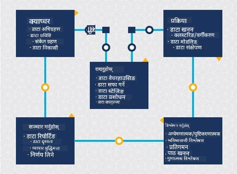
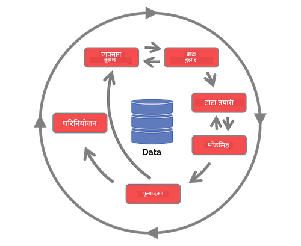

<!--
CO_OP_TRANSLATOR_METADATA:
{
  "original_hash": "79ca8a5a3135e94d2d43f56ba62d5205",
  "translation_date": "2025-09-04T17:00:44+00:00",
  "source_file": "4-Data-Science-Lifecycle/14-Introduction/README.md",
  "language_code": "ne"
}
-->
# डाटा साइन्स जीवनचक्रको परिचय

| द्वारा ](../../sketchnotes/14-DataScience-Lifecycle.png)|
|:---:|
| डाटा साइन्स जीवनचक्रको परिचय - _[@nitya](https://twitter.com/nitya) द्वारा स्केच नोट_ |

## [पाठ अघि क्विज](https://red-water-0103e7a0f.azurestaticapps.net/quiz/26)

यस बिन्दुमा तपाईंले सम्भवतः महसुस गर्नुभएको छ कि डाटा साइन्स एक प्रक्रिया हो। यो प्रक्रिया पाँच चरणमा विभाजित गर्न सकिन्छ:

- डाटा संकलन
- प्रशोधन
- विश्लेषण
- सञ्चार
- मर्मत

यो पाठ जीवनचक्रका तीन भागहरूमा केन्द्रित छ: डाटा संकलन, प्रशोधन, र मर्मत।

> [Berkeley School of Information](https://ischoolonline.berkeley.edu/data-science/what-is-data-science/) द्वारा फोटो

## डाटा संकलन

जीवनचक्रको पहिलो चरण धेरै महत्त्वपूर्ण छ किनभने यसमा आधारित भएर अन्य चरणहरू अगाडि बढ्छन्। यो चरण दुई भागलाई समेट्छ: डाटा प्राप्त गर्ने र परियोजनाको उद्देश्य तथा समाधान गर्नुपर्ने समस्याहरू परिभाषित गर्ने।  
परियोजनाको लक्ष्य परिभाषित गर्न समस्या वा प्रश्नको गहिरो सन्दर्भ आवश्यक हुन्छ। पहिलो चरणमा, हामीले समस्या समाधान गर्न चाहने व्यक्तिहरूलाई पहिचान गर्न र प्राप्त गर्नुपर्छ। यी व्यक्तिहरू व्यवसायका हितधारक वा परियोजनाका प्रायोजक हुन सक्छन्, जसले परियोजनाबाट कसलाई फाइदा हुनेछ, के चाहिन्छ, र किन चाहिन्छ भन्ने कुरा पहिचान गर्न मद्दत गर्न सक्छन्। राम्रोसँग परिभाषित लक्ष्य मापनयोग्य र परिमाणात्मक हुनुपर्छ ताकि स्वीकार्य परिणाम परिभाषित गर्न सकियोस्। 

डाटा वैज्ञानिकले सोध्न सक्ने प्रश्नहरू:
- के यो समस्या पहिले समाधान गरिएको छ? के पत्ता लाग्यो?
- के उद्देश्य र लक्ष्य सबै संलग्न व्यक्तिहरूले बुझेका छन्?
- के अस्पष्टता छ र यसलाई कसरी घटाउन सकिन्छ?
- के सीमाहरू छन्?
- अन्तिम परिणाम कस्तो देखिन सक्छ?
- कति स्रोतहरू (समय, व्यक्ति, कम्प्युटेशनल) उपलब्ध छन्?

अर्को चरणमा, परिभाषित लक्ष्यहरू प्राप्त गर्न आवश्यक डाटालाई पहिचान, संकलन, र अन्वेषण गर्नुपर्छ। यस चरणमा, डाटा वैज्ञानिकहरूले डाटाको मात्रा र गुणस्तर मूल्याङ्कन गर्नुपर्छ। डाटा अन्वेषणले पुष्टि गर्न मद्दत गर्छ कि प्राप्त गरिएको डाटाले चाहिएको परिणाम प्राप्त गर्न सहयोग पुर्‍याउँछ।  

डाटाबारे डाटा वैज्ञानिकले सोध्न सक्ने प्रश्नहरू:
- मेरो लागि पहिले नै उपलब्ध डाटा के हो?
- यो डाटाको मालिक को हो?
- गोपनीयता सम्बन्धी चिन्ताहरू के छन्? 
- के यो समस्या समाधान गर्न पर्याप्त छ?
- के यो डाटा यस समस्याको लागि स्वीकार्य गुणस्तरको छ?
- यदि मैले यस डाटाबाट थप जानकारी पत्ता लगाएँ भने, के हामीले लक्ष्य परिवर्तन वा पुनः परिभाषित गर्न विचार गर्नुपर्छ?

## प्रशोधन

जीवनचक्रको प्रशोधन चरणले डाटामा ढाँचा पत्ता लगाउने र मोडेलिङमा केन्द्रित हुन्छ। प्रशोधन चरणमा प्रयोग गरिने केही प्रविधिहरूले ढाँचा पत्ता लगाउन सांख्यिकीय विधिहरूको आवश्यकता पर्छ। सामान्यतया, यो ठूलो डाटासेटको साथमा मानिसले गर्न कठिन र समय लाग्ने काम हो, त्यसैले कम्प्युटरले प्रक्रिया छिटो बनाउन मद्दत गर्छ। यो चरणमा डाटा साइन्स र मेसिन लर्निङ एकअर्कासँग जोडिन्छ। पहिलो पाठमा सिकिएअनुसार, मेसिन लर्निङ भनेको डाटालाई बुझ्न मोडेल निर्माण गर्ने प्रक्रिया हो। मोडेल भनेको डाटाका भेरिएबलहरू बीचको सम्बन्धको प्रतिनिधित्व हो, जसले परिणामको भविष्यवाणी गर्न मद्दत गर्छ।

यस चरणमा प्रयोग गरिने सामान्य प्रविधिहरू ML for Beginners पाठ्यक्रममा समेटिएका छन्। थप जान्नका लागि लिंकहरू अनुसरण गर्नुहोस्:

- [Classification](https://github.com/microsoft/ML-For-Beginners/tree/main/4-Classification): डाटालाई वर्गहरूमा व्यवस्थित गरेर अधिक प्रभावकारी बनाउने।
- [Clustering](https://github.com/microsoft/ML-For-Beginners/tree/main/5-Clustering): डाटालाई समान समूहहरूमा विभाजन गर्ने।
- [Regression](https://github.com/microsoft/ML-For-Beginners/tree/main/2-Regression): भेरिएबलहरू बीचको सम्बन्ध निर्धारण गरेर मूल्यहरूको भविष्यवाणी वा पूर्वानुमान गर्ने।

## मर्मत

जीवनचक्रको चित्रमा, तपाईंले देख्नुभएको छ कि मर्मत डाटा संकलन र प्रशोधनको बीचमा छ। मर्मत भनेको परियोजनाको प्रक्रिया भरि डाटाको व्यवस्थापन, भण्डारण, र सुरक्षा गर्ने निरन्तर प्रक्रिया हो। 

### डाटा भण्डारण
डाटा कहाँ र कसरी भण्डारण गरिन्छ भन्ने निर्णयले यसको लागत र पहुँचको गति प्रभावित गर्न सक्छ। यस्ता निर्णयहरू डाटा वैज्ञानिकले मात्र गर्ने सम्भावना कम हुन्छ, तर डाटा भण्डारणको आधारमा काम गर्ने तरिका चयन गर्नुपर्ने हुन सक्छ।

आधुनिक डाटा भण्डारण प्रणालीका केही पक्षहरू:
**On premise vs off premise vs public or private cloud**

On premise भनेको आफ्नै उपकरणमा डाटा भण्डारण गर्ने हो, जस्तै आफ्नै सर्भरमा हार्ड ड्राइभहरू प्रयोग गरेर डाटा भण्डारण गर्ने। Off premise भनेको तपाईंको स्वामित्वमा नभएको उपकरणमा निर्भर गर्ने हो, जस्तै डाटा सेन्टर। Public cloud भनेको डाटा भण्डारणको लोकप्रिय विकल्प हो, जसले डाटा कहाँ र कसरी भण्डारण गरिएको छ भन्ने ज्ञान आवश्यक पर्दैन। Public cloud साझा आधारभूत संरचनामा आधारित हुन्छ। केही संस्थाहरूले सुरक्षा नीतिहरूका कारण आफ्नै उपकरणमा डाटा भण्डारण गर्नुपर्ने हुन सक्छ, जसले private cloud प्रयोग गर्छ। [पछिल्ला पाठहरूमा](https://github.com/microsoft/Data-Science-For-Beginners/tree/main/5-Data-Science-In-Cloud) तपाईंले क्लाउडमा डाटाबारे थप सिक्नुहुनेछ।

**Cold vs hot data**

मोडेल प्रशिक्षण गर्दा तपाईंलाई थप प्रशिक्षण डाटा आवश्यक हुन सक्छ। यदि तपाईं आफ्नो मोडेलसँग सन्तुष्ट हुनुहुन्छ भने, मोडेलले आफ्नो उद्देश्य पूरा गर्न थप डाटा प्राप्त गर्न सक्छ। कुनै पनि अवस्थामा, डाटा भण्डारण र पहुँचको लागत बढ्नेछ। कम प्रयोग गरिने डाटालाई (cold data) बारम्बार प्रयोग गरिने डाटाबाट (hot data) अलग गरेर सस्तो भण्डारण विकल्प प्राप्त गर्न सकिन्छ। यदि cold data पहुँच गर्न आवश्यक पर्‍यो भने, hot data को तुलनामा यसलाई प्राप्त गर्न समय लाग्न सक्छ।

### डाटा व्यवस्थापन
डाटासँग काम गर्दा तपाईंले पत्ता लगाउन सक्नुहुन्छ कि केही डाटालाई सफा गर्न आवश्यक छ। [डाटा तयारी](https://github.com/microsoft/Data-Science-For-Beginners/tree/main/2-Working-With-Data/08-data-preparation) पाठमा समेटिएका प्रविधिहरू प्रयोग गरेर सही मोडेल निर्माण गर्न सकिन्छ। नयाँ डाटा प्राप्त हुँदा, गुणस्तरमा निरन्तरता कायम गर्न समान प्रविधिहरू लागू गर्न आवश्यक हुन्छ। केही परियोजनाहरूमा डाटालाई अन्तिम स्थानमा सार्नुअघि सफा गर्ने, समग्र बनाउने, र कम्प्रेस गर्ने स्वचालित उपकरणको प्रयोग गरिन्छ। Azure Data Factory यस्ता उपकरणहरूको उदाहरण हो।

### डाटा सुरक्षा
डाटा सुरक्षित राख्ने मुख्य उद्देश्य भनेको डाटाको संकलन र प्रयोगको सन्दर्भमा नियन्त्रण कायम राख्नु हो। डाटालाई सुरक्षित राख्नका लागि पहुँच सीमित गर्नु, स्थानीय कानुन र नियमहरूको पालना गर्नु, र नैतिक मापदण्डहरू कायम राख्नु आवश्यक छ। [नैतिकता पाठ](https://github.com/microsoft/Data-Science-For-Beginners/tree/main/1-Introduction/02-ethics) मा यसबारे चर्चा गरिएको छ। 

सुरक्षालाई ध्यानमा राखेर टोलीले गर्न सक्ने केही कामहरू:
- सुनिश्चित गर्नु कि सबै डाटा इन्क्रिप्ट गरिएको छ
- ग्राहकहरूलाई उनीहरूको डाटा कसरी प्रयोग भइरहेको छ भन्ने जानकारी दिनु
- परियोजनाबाट बाहिरिएका व्यक्तिहरूको डाटा पहुँच हटाउनु
- केवल निश्चित परियोजना सदस्यहरूलाई डाटामा परिवर्तन गर्न अनुमति दिनु

## 🚀 चुनौती

डाटा साइन्स जीवनचक्रका धेरै संस्करणहरू छन्, जहाँ प्रत्येक चरणका नाम र चरणहरूको संख्या फरक हुन सक्छ तर यस पाठमा उल्लेख गरिएका प्रक्रियाहरू समावेश हुन्छन्।

[Team Data Science Process जीवनचक्र](https://docs.microsoft.com/en-us/azure/architecture/data-science-process/lifecycle) र [Cross-industry standard process for data mining](https://www.datascience-pm.com/crisp-dm-2/) अन्वेषण गर्नुहोस्। यी दुई बीचका तीन समानता र फरकपनहरू नामकरण गर्नुहोस्।

|Team Data Science Process (TDSP)|Cross-industry standard process for data mining (CRISP-DM)|
|--|--|
| |  |
| [Microsoft](https://docs.microsoft.comazure/architecture/data-science-process/lifecycle) द्वारा छवि | [Data Science Process Alliance](https://www.datascience-pm.com/crisp-dm-2/) द्वारा छवि |

## [पाठ पछि क्विज](https://ff-quizzes.netlify.app/en/ds/)

## समीक्षा र आत्म अध्ययन

डाटा साइन्स जीवनचक्र लागू गर्दा विभिन्न भूमिकाहरू र कार्यहरू समावेश हुन्छन्, जहाँ केही व्यक्तिहरू प्रत्येक चरणका विशेष भागहरूमा केन्द्रित हुन्छन्। Team Data Science Process ले परियोजनामा कसैले गर्न सक्ने भूमिकाहरू र कार्यहरूको व्याख्या गर्ने केही स्रोतहरू प्रदान गर्दछ।

* [Team Data Science Process भूमिकाहरू र कार्यहरू](https://docs.microsoft.com/en-us/azure/architecture/data-science-process/roles-tasks)
* [डाटा साइन्स कार्यहरू कार्यान्वयन गर्नुहोस्: अन्वेषण, मोडेलिङ, र परिनियोजन](https://docs.microsoft.com/en-us/azure/architecture/data-science-process/execute-data-science-tasks)

## असाइनमेन्ट

[डाटासेटको मूल्याङ्कन](assignment.md)

---

**अस्वीकरण**:  
यो दस्तावेज़ AI अनुवाद सेवा [Co-op Translator](https://github.com/Azure/co-op-translator) प्रयोग गरी अनुवाद गरिएको हो। हामी यथासम्भव सटीकता सुनिश्चित गर्न प्रयास गर्छौं, तर कृपया ध्यान दिनुहोस् कि स्वचालित अनुवादहरूमा त्रुटि वा अशुद्धि हुन सक्छ। यसको मूल भाषामा रहेको मूल दस्तावेज़लाई आधिकारिक स्रोत मानिनुपर्छ। महत्त्वपूर्ण जानकारीका लागि, व्यावसायिक मानव अनुवाद सिफारिस गरिन्छ। यस अनुवादको प्रयोगबाट उत्पन्न हुने कुनै पनि गलतफहमी वा गलत व्याख्याका लागि हामी जिम्मेवार हुने छैनौं।  