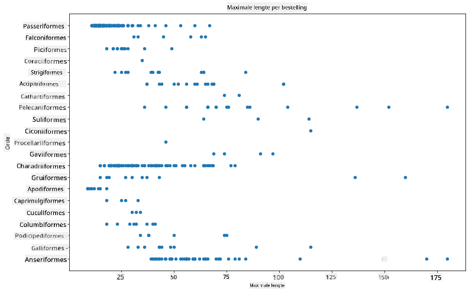
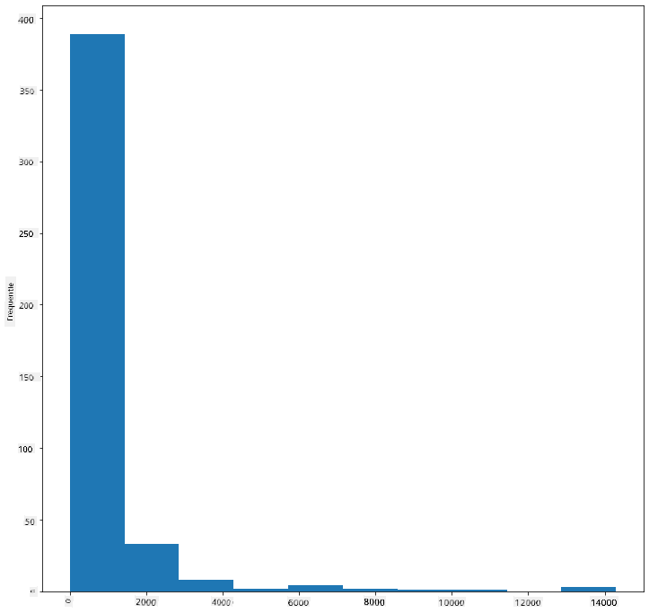
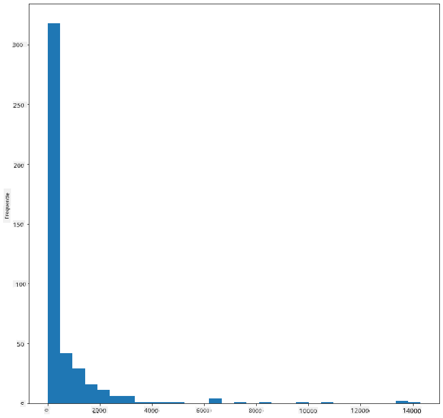
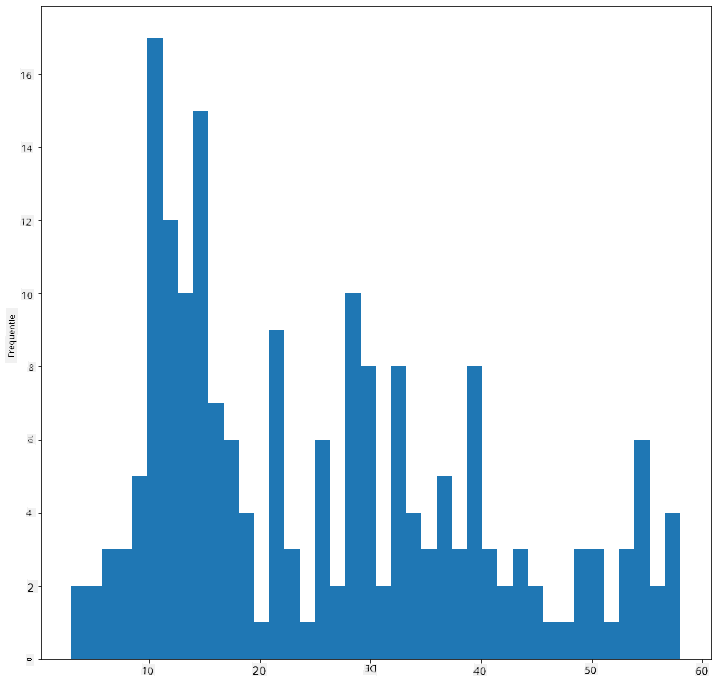
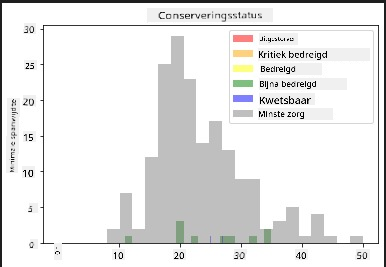
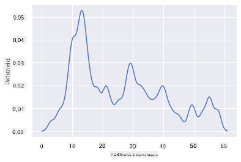
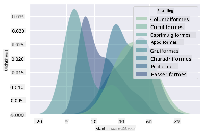
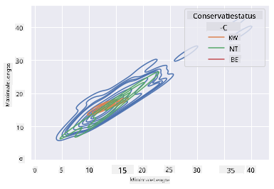

<!--
CO_OP_TRANSLATOR_METADATA:
{
  "original_hash": "02ce904bc1e2bfabb7dc05c25aae375c",
  "translation_date": "2025-09-04T19:57:32+00:00",
  "source_file": "3-Data-Visualization/10-visualization-distributions/README.md",
  "language_code": "nl"
}
-->
# Visualiseren van distributies

| ](../../sketchnotes/10-Visualizing-Distributions.png)|
|:---:|
| Visualiseren van distributies - _Sketchnote door [@nitya](https://twitter.com/nitya)_ |

In de vorige les heb je enkele interessante feiten geleerd over een dataset over de vogels van Minnesota. Je hebt foutieve gegevens gevonden door uitschieters te visualiseren en hebt gekeken naar de verschillen tussen vogelcategorieën op basis van hun maximale lengte.

## [Pre-lecture quiz](https://purple-hill-04aebfb03.1.azurestaticapps.net/quiz/18)
## Verken de vogeldataset

Een andere manier om gegevens te onderzoeken is door te kijken naar de distributie, of hoe de gegevens langs een as zijn georganiseerd. Misschien wil je bijvoorbeeld meer leren over de algemene distributie, voor deze dataset, van de maximale spanwijdte of maximale lichaamsmassa van de vogels van Minnesota.

Laten we enkele feiten ontdekken over de distributies van gegevens in deze dataset. In het _notebook.ipynb_-bestand in de hoofdmap van deze les, importeer Pandas, Matplotlib en je gegevens:

```python
import pandas as pd
import matplotlib.pyplot as plt
birds = pd.read_csv('../../data/birds.csv')
birds.head()
```

|      | Naam                         | WetenschappelijkeNaam  | Categorie             | Orde         | Familie  | Geslacht    | Beschermingsstatus  | MinLengte | MaxLengte | MinLichaamsmassa | MaxLichaamsmassa | MinSpanwijdte | MaxSpanwijdte |
| ---: | :--------------------------- | :--------------------- | :-------------------- | :----------- | :------- | :---------- | :-----------------  | --------: | --------: | --------------: | --------------: | ------------: | ------------: |
|    0 | Zwartbuikfluiteend           | Dendrocygna autumnalis | Eenden/Ganzen/Watervogels | Anseriformes | Anatidae | Dendrocygna | LC                 |        47 |        56 |             652 |            1020 |            76 |            94 |
|    1 | Rosse fluiteend              | Dendrocygna bicolor    | Eenden/Ganzen/Watervogels | Anseriformes | Anatidae | Dendrocygna | LC                 |        45 |        53 |             712 |            1050 |            85 |            93 |
|    2 | Sneeuwgans                   | Anser caerulescens     | Eenden/Ganzen/Watervogels | Anseriformes | Anatidae | Anser       | LC                 |        64 |        79 |            2050 |            4050 |           135 |           165 |
|    3 | Ross' gans                   | Anser rossii           | Eenden/Ganzen/Watervogels | Anseriformes | Anatidae | Anser       | LC                 |      57.3 |        64 |            1066 |            1567 |           113 |           116 |
|    4 | Grote rietgans               | Anser albifrons        | Eenden/Ganzen/Watervogels | Anseriformes | Anatidae | Anser       | LC                 |        64 |        81 |            1930 |            3310 |           130 |           165 |

Over het algemeen kun je snel kijken naar hoe gegevens zijn verdeeld door een scatterplot te gebruiken, zoals we in de vorige les deden:

```python
birds.plot(kind='scatter',x='MaxLength',y='Order',figsize=(12,8))

plt.title('Max Length per Order')
plt.ylabel('Order')
plt.xlabel('Max Length')

plt.show()
```


Dit geeft een overzicht van de algemene verdeling van lichaamslengte per vogelorde, maar het is niet de optimale manier om echte distributies weer te geven. Die taak wordt meestal uitgevoerd door een histogram te maken.

## Werken met histogrammen

Matplotlib biedt zeer goede manieren om gegevensdistributie te visualiseren met behulp van histogrammen. Dit type grafiek lijkt op een staafdiagram waarbij de distributie kan worden gezien via een stijging en daling van de staven. Om een histogram te maken, heb je numerieke gegevens nodig. Om een histogram te maken, kun je een grafiek plotten waarbij je het type instelt op 'hist' voor histogram. Deze grafiek toont de distributie van MaxBodyMass voor het volledige bereik van numerieke gegevens in de dataset. Door de array van gegevens op te splitsen in kleinere bins, kan het de verdeling van de waarden van de gegevens weergeven:

```python
birds['MaxBodyMass'].plot(kind = 'hist', bins = 10, figsize = (12,12))
plt.show()
```


Zoals je kunt zien, valt het merendeel van de 400+ vogels in deze dataset in het bereik van minder dan 2000 voor hun maximale lichaamsmassa. Krijg meer inzicht in de gegevens door de `bins`-parameter te verhogen naar bijvoorbeeld 30:

```python
birds['MaxBodyMass'].plot(kind = 'hist', bins = 30, figsize = (12,12))
plt.show()
```


Deze grafiek toont de distributie op een iets meer gedetailleerde manier. Een grafiek die minder naar links is scheefgetrokken, kan worden gemaakt door ervoor te zorgen dat je alleen gegevens binnen een bepaald bereik selecteert:

Filter je gegevens om alleen die vogels te krijgen waarvan de lichaamsmassa onder de 60 ligt, en toon 40 `bins`:

```python
filteredBirds = birds[(birds['MaxBodyMass'] > 1) & (birds['MaxBodyMass'] < 60)]      
filteredBirds['MaxBodyMass'].plot(kind = 'hist',bins = 40,figsize = (12,12))
plt.show()     
```


✅ Probeer enkele andere filters en gegevenspunten. Om de volledige distributie van de gegevens te zien, verwijder de `['MaxBodyMass']`-filter om gelabelde distributies weer te geven.

Het histogram biedt ook enkele leuke kleur- en labelverbeteringen om te proberen:

Maak een 2D-histogram om de relatie tussen twee distributies te vergelijken. Laten we `MaxBodyMass` vergelijken met `MaxLength`. Matplotlib biedt een ingebouwde manier om convergentie te tonen met behulp van helderdere kleuren:

```python
x = filteredBirds['MaxBodyMass']
y = filteredBirds['MaxLength']

fig, ax = plt.subplots(tight_layout=True)
hist = ax.hist2d(x, y)
```
Er lijkt een verwachte correlatie te zijn tussen deze twee elementen langs een verwachte as, met één bijzonder sterk punt van convergentie:


Histogrammen werken standaard goed voor numerieke gegevens. Wat als je distributies wilt zien op basis van tekstgegevens? 
## Verken de dataset voor distributies met tekstgegevens 

Deze dataset bevat ook goede informatie over de vogelcategorie en zijn geslacht, soort en familie, evenals zijn beschermingsstatus. Laten we deze beschermingsinformatie onderzoeken. Wat is de verdeling van de vogels volgens hun beschermingsstatus?

> ✅ In de dataset worden verschillende acroniemen gebruikt om de beschermingsstatus te beschrijven. Deze acroniemen komen van de [IUCN Red List Categories](https://www.iucnredlist.org/), een organisatie die de status van soorten catalogiseert.
> 
> - CR: Kritiek bedreigd
> - EN: Bedreigd
> - EX: Uitgestorven
> - LC: Minste zorg
> - NT: Bijna bedreigd
> - VU: Kwetsbaar

Dit zijn tekstgebaseerde waarden, dus je moet een transformatie uitvoeren om een histogram te maken. Gebruik de filteredBirds dataframe om de beschermingsstatus weer te geven naast de minimale spanwijdte. Wat zie je?

```python
x1 = filteredBirds.loc[filteredBirds.ConservationStatus=='EX', 'MinWingspan']
x2 = filteredBirds.loc[filteredBirds.ConservationStatus=='CR', 'MinWingspan']
x3 = filteredBirds.loc[filteredBirds.ConservationStatus=='EN', 'MinWingspan']
x4 = filteredBirds.loc[filteredBirds.ConservationStatus=='NT', 'MinWingspan']
x5 = filteredBirds.loc[filteredBirds.ConservationStatus=='VU', 'MinWingspan']
x6 = filteredBirds.loc[filteredBirds.ConservationStatus=='LC', 'MinWingspan']

kwargs = dict(alpha=0.5, bins=20)

plt.hist(x1, **kwargs, color='red', label='Extinct')
plt.hist(x2, **kwargs, color='orange', label='Critically Endangered')
plt.hist(x3, **kwargs, color='yellow', label='Endangered')
plt.hist(x4, **kwargs, color='green', label='Near Threatened')
plt.hist(x5, **kwargs, color='blue', label='Vulnerable')
plt.hist(x6, **kwargs, color='gray', label='Least Concern')

plt.gca().set(title='Conservation Status', ylabel='Min Wingspan')
plt.legend();
```



Er lijkt geen goede correlatie te zijn tussen minimale spanwijdte en beschermingsstatus. Test andere elementen van de dataset met deze methode. Je kunt ook verschillende filters proberen. Vind je enige correlatie?

## Dichtheidsplots

Je hebt misschien gemerkt dat de histogrammen die we tot nu toe hebben bekeken 'getrapt' zijn en niet soepel in een boog verlopen. Om een vloeiender dichtheidsgrafiek te tonen, kun je een dichtheidsplot proberen.

Om met dichtheidsplots te werken, kun je jezelf vertrouwd maken met een nieuwe plotbibliotheek, [Seaborn](https://seaborn.pydata.org/generated/seaborn.kdeplot.html). 

Laad Seaborn en probeer een eenvoudige dichtheidsplot:

```python
import seaborn as sns
import matplotlib.pyplot as plt
sns.kdeplot(filteredBirds['MinWingspan'])
plt.show()
```


Je kunt zien hoe de plot de vorige grafiek voor minimale spanwijdtegegevens weerspiegelt; het is gewoon iets vloeiender. Volgens de documentatie van Seaborn: "In vergelijking met een histogram kan KDE een plot produceren die minder rommelig en beter interpreteerbaar is, vooral bij het tekenen van meerdere distributies. Maar het heeft de potentie om vervormingen te introduceren als de onderliggende distributie begrensd of niet vloeiend is. Net als een histogram hangt de kwaliteit van de representatie ook af van de selectie van goede gladmakingsparameters." [bron](https://seaborn.pydata.org/generated/seaborn.kdeplot.html) Met andere woorden, uitschieters zullen zoals altijd je grafieken negatief beïnvloeden.

Als je die hoekige MaxBodyMass-lijn in de tweede grafiek die je hebt gemaakt opnieuw wilt bekijken, kun je deze heel goed gladstrijken door deze opnieuw te maken met deze methode:

```python
sns.kdeplot(filteredBirds['MaxBodyMass'])
plt.show()
```


Als je een gladde, maar niet te gladde lijn wilt, pas dan de `bw_adjust`-parameter aan:

```python
sns.kdeplot(filteredBirds['MaxBodyMass'], bw_adjust=.2)
plt.show()
```


✅ Lees over de beschikbare parameters voor dit type plot en experimenteer!

Dit type grafiek biedt prachtig verklarende visualisaties. Met een paar regels code kun je bijvoorbeeld de dichtheid van de maximale lichaamsmassa per vogelorde tonen:

```python
sns.kdeplot(
   data=filteredBirds, x="MaxBodyMass", hue="Order",
   fill=True, common_norm=False, palette="crest",
   alpha=.5, linewidth=0,
)
```



Je kunt ook de dichtheid van meerdere variabelen in één grafiek weergeven. Test de MaxLength en MinLength van een vogel in vergelijking met hun beschermingsstatus:

```python
sns.kdeplot(data=filteredBirds, x="MinLength", y="MaxLength", hue="ConservationStatus")
```



Misschien is het de moeite waard om te onderzoeken of de cluster van 'Kwetsbare' vogels volgens hun lengtes betekenisvol is of niet.

## 🚀 Uitdaging

Histogrammen zijn een meer geavanceerd type grafiek dan eenvoudige scatterplots, staafdiagrammen of lijndiagrammen. Ga op zoek op het internet naar goede voorbeelden van het gebruik van histogrammen. Hoe worden ze gebruikt, wat laten ze zien, en in welke vakgebieden of onderzoeksgebieden worden ze vaak gebruikt?

## [Post-lecture quiz](https://ff-quizzes.netlify.app/en/ds/)

## Review & Zelfstudie

In deze les heb je Matplotlib gebruikt en ben je begonnen met werken met Seaborn om meer geavanceerde grafieken te maken. Doe wat onderzoek naar `kdeplot` in Seaborn, een "continue waarschijnlijkheidsdichtheidscurve in één of meer dimensies". Lees de [documentatie](https://seaborn.pydata.org/generated/seaborn.kdeplot.html) om te begrijpen hoe het werkt.

## Opdracht

[Pas je vaardigheden toe](assignment.md)

---

**Disclaimer**:  
Dit document is vertaald met behulp van de AI-vertalingsservice [Co-op Translator](https://github.com/Azure/co-op-translator). Hoewel we streven naar nauwkeurigheid, dient u zich ervan bewust te zijn dat geautomatiseerde vertalingen fouten of onnauwkeurigheden kunnen bevatten. Het originele document in zijn oorspronkelijke taal moet worden beschouwd als de gezaghebbende bron. Voor cruciale informatie wordt professionele menselijke vertaling aanbevolen. Wij zijn niet aansprakelijk voor eventuele misverstanden of verkeerde interpretaties die voortvloeien uit het gebruik van deze vertaling.