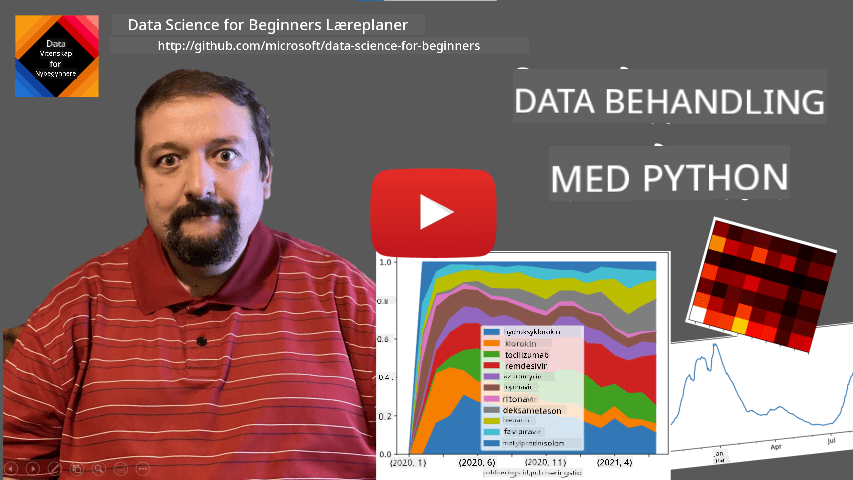
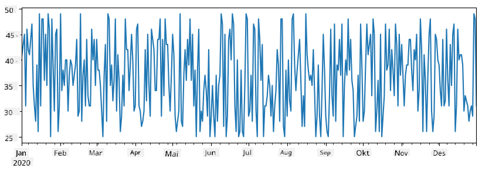
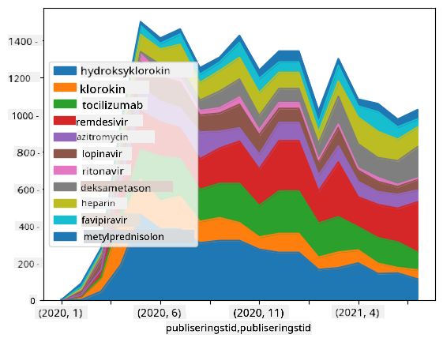

<!--
CO_OP_TRANSLATOR_METADATA:
{
  "original_hash": "57f7db1f4c3ae3361c1d1fbafcdd690c",
  "translation_date": "2025-09-04T19:24:50+00:00",
  "source_file": "2-Working-With-Data/07-python/README.md",
  "language_code": "no"
}
-->
# Arbeide med Data: Python og Pandas-biblioteket

|  ](../../sketchnotes/07-WorkWithPython.png) |
| :-------------------------------------------------------------------------------------------------------: |
|                 Arbeide med Python - _Sketchnote av [@nitya](https://twitter.com/nitya)_                 |

[](https://youtu.be/dZjWOGbsN4Y)

Mens databaser tilbyr svært effektive måter å lagre data og utføre spørringer ved hjelp av spørringsspråk, er den mest fleksible måten å behandle data på å skrive ditt eget program for å manipulere data. I mange tilfeller vil en databasespørring være en mer effektiv løsning. Men i noen tilfeller, når mer kompleks databehandling er nødvendig, kan det ikke enkelt gjøres med SQL. 
Databehandling kan programmeres i hvilket som helst programmeringsspråk, men det finnes visse språk som er mer høy-nivå med hensyn til arbeid med data. Dataforskere foretrekker vanligvis ett av følgende språk:

* **[Python](https://www.python.org/)**, et allsidig programmeringsspråk, som ofte anses som et av de beste alternativene for nybegynnere på grunn av sin enkelhet. Python har mange tilleggslibraries som kan hjelpe deg med å løse praktiske problemer, som å hente data fra en ZIP-arkiv eller konvertere et bilde til gråtoner. I tillegg til dataforskning brukes Python også ofte til webutvikling. 
* **[R](https://www.r-project.org/)** er en tradisjonell verktøykasse utviklet med statistisk databehandling i tankene. Den inneholder også et stort bibliotek (CRAN), som gjør det til et godt valg for databehandling. R er imidlertid ikke et allsidig programmeringsspråk og brukes sjelden utenfor dataforskningsområdet.
* **[Julia](https://julialang.org/)** er et annet språk utviklet spesielt for dataforskning. Det er ment å gi bedre ytelse enn Python, noe som gjør det til et flott verktøy for vitenskapelige eksperimenter.

I denne leksjonen vil vi fokusere på å bruke Python for enkel databehandling. Vi antar grunnleggende kjennskap til språket. Hvis du ønsker en dypere innføring i Python, kan du referere til en av følgende ressurser:

* [Lær Python på en morsom måte med Turtle Graphics og Fractals](https://github.com/shwars/pycourse) - GitHub-basert introduksjonskurs i Python-programmering
* [Ta dine første steg med Python](https://docs.microsoft.com/en-us/learn/paths/python-first-steps/?WT.mc_id=academic-77958-bethanycheum) Læringssti på [Microsoft Learn](http://learn.microsoft.com/?WT.mc_id=academic-77958-bethanycheum)

Data kan komme i mange former. I denne leksjonen vil vi se på tre former for data - **tabulære data**, **tekst** og **bilder**.

Vi vil fokusere på noen få eksempler på databehandling, i stedet for å gi deg en full oversikt over alle relaterte biblioteker. Dette vil gi deg en idé om hva som er mulig, og gi deg forståelse for hvor du kan finne løsninger på dine problemer når du trenger dem.

> **Det mest nyttige rådet**. Når du trenger å utføre en bestemt operasjon på data som du ikke vet hvordan du skal gjøre, prøv å søke etter det på internett. [Stackoverflow](https://stackoverflow.com/) inneholder ofte mange nyttige kodeeksempler i Python for mange typiske oppgaver.


## [Quiz før leksjonen](https://purple-hill-04aebfb03.1.azurestaticapps.net/quiz/12)

## Tabulære data og Dataframes

Du har allerede møtt tabulære data da vi snakket om relasjonsdatabaser. Når du har mye data, og det er lagret i mange forskjellige koblede tabeller, gir det definitivt mening å bruke SQL for å arbeide med det. Men det finnes mange tilfeller der vi har en tabell med data, og vi trenger å få **forståelse** eller **innsikt** om denne dataen, som for eksempel fordeling, korrelasjon mellom verdier, osv. I dataforskning er det mange tilfeller der vi må utføre noen transformasjoner av den opprinnelige dataen, etterfulgt av visualisering. Begge disse trinnene kan enkelt gjøres ved hjelp av Python.

Det finnes to mest nyttige biblioteker i Python som kan hjelpe deg med å arbeide med tabulære data:
* **[Pandas](https://pandas.pydata.org/)** lar deg manipulere såkalte **Dataframes**, som er analoge med relasjonstabeller. Du kan ha navngitte kolonner og utføre forskjellige operasjoner på rader, kolonner og dataframes generelt. 
* **[Numpy](https://numpy.org/)** er et bibliotek for å arbeide med **tensores**, dvs. flerdimensjonale **arrays**. Arrays har verdier av samme underliggende type, og det er enklere enn dataframe, men det tilbyr flere matematiske operasjoner og skaper mindre overhead.

Det finnes også et par andre biblioteker du bør kjenne til:
* **[Matplotlib](https://matplotlib.org/)** er et bibliotek som brukes til datavisualisering og plotting av grafer
* **[SciPy](https://www.scipy.org/)** er et bibliotek med noen ekstra vitenskapelige funksjoner. Vi har allerede kommet over dette biblioteket da vi snakket om sannsynlighet og statistikk

Her er et stykke kode som du vanligvis vil bruke for å importere disse bibliotekene i begynnelsen av Python-programmet ditt:
```python
import numpy as np
import pandas as pd
import matplotlib.pyplot as plt
from scipy import ... # you need to specify exact sub-packages that you need
``` 

Pandas er sentrert rundt noen få grunnleggende konsepter.

### Series 

**Series** er en sekvens av verdier, lik en liste eller numpy-array. Den viktigste forskjellen er at series også har en **indeks**, og når vi opererer på series (f.eks. legger dem sammen), tas indeksen med i betraktning. Indeksen kan være så enkel som et heltall radnummer (det er indeksen som brukes som standard når du oppretter en series fra en liste eller array), eller den kan ha en kompleks struktur, som et datointervall.

> **Merk**: Det finnes noe innledende Pandas-kode i den medfølgende notebooken [`notebook.ipynb`](notebook.ipynb). Vi skisserer bare noen av eksemplene her, og du er definitivt velkommen til å sjekke ut hele notebooken.

Tenk på et eksempel: vi ønsker å analysere salget fra vår iskrembutikk. La oss generere en series med salgsnumre (antall solgte varer hver dag) for en tidsperiode:

```python
start_date = "Jan 1, 2020"
end_date = "Mar 31, 2020"
idx = pd.date_range(start_date,end_date)
print(f"Length of index is {len(idx)}")
items_sold = pd.Series(np.random.randint(25,50,size=len(idx)),index=idx)
items_sold.plot()
```


Nå antar vi at vi hver uke arrangerer en fest for venner, og vi tar med oss 10 ekstra pakker med iskrem til festen. Vi kan opprette en annen series, indeksert etter uke, for å demonstrere dette:
```python
additional_items = pd.Series(10,index=pd.date_range(start_date,end_date,freq="W"))
```
Når vi legger sammen to series, får vi totalt antall:
```python
total_items = items_sold.add(additional_items,fill_value=0)
total_items.plot()
```


> **Merk** at vi ikke bruker enkel syntaks `total_items+additional_items`. Hvis vi gjorde det, ville vi fått mange `NaN` (*Not a Number*) verdier i den resulterende series. Dette skyldes at det mangler verdier for noen av indeksene i `additional_items`-serien, og å legge til `NaN` til noe resulterer i `NaN`. Derfor må vi spesifisere `fill_value`-parameteren under addisjonen.

Med tidsserier kan vi også **resample** serien med forskjellige tidsintervaller. For eksempel, hvis vi ønsker å beregne gjennomsnittlig salgsvolum månedlig, kan vi bruke følgende kode:
```python
monthly = total_items.resample("1M").mean()
ax = monthly.plot(kind='bar')
```


### DataFrame

En DataFrame er i hovedsak en samling av series med samme indeks. Vi kan kombinere flere series sammen til en DataFrame:
```python
a = pd.Series(range(1,10))
b = pd.Series(["I","like","to","play","games","and","will","not","change"],index=range(0,9))
df = pd.DataFrame([a,b])
```
Dette vil opprette en horisontal tabell som denne:
|     | 0   | 1    | 2   | 3   | 4      | 5   | 6      | 7    | 8    |
| --- | --- | ---- | --- | --- | ------ | --- | ------ | ---- | ---- |
| 0   | 1   | 2    | 3   | 4   | 5      | 6   | 7      | 8    | 9    |
| 1   | I   | like | to  | use | Python | and | Pandas | very | much |

Vi kan også bruke Series som kolonner og spesifisere kolonnenavn ved hjelp av dictionary:
```python
df = pd.DataFrame({ 'A' : a, 'B' : b })
```
Dette vil gi oss en tabell som denne:

|     | A   | B      |
| --- | --- | ------ |
| 0   | 1   | I      |
| 1   | 2   | like   |
| 2   | 3   | to     |
| 3   | 4   | use    |
| 4   | 5   | Python |
| 5   | 6   | and    |
| 6   | 7   | Pandas |
| 7   | 8   | very   |
| 8   | 9   | much   |

**Merk** at vi også kan få denne tabelloppsettet ved å transponere den forrige tabellen, f.eks. ved å skrive 
```python
df = pd.DataFrame([a,b]).T..rename(columns={ 0 : 'A', 1 : 'B' })
```
Her betyr `.T` operasjonen med å transponere DataFrame, dvs. bytte rader og kolonner, og `rename`-operasjonen lar oss gi nytt navn til kolonner for å matche det forrige eksemplet.

Her er noen av de viktigste operasjonene vi kan utføre på DataFrames:

**Kolonnevalg**. Vi kan velge individuelle kolonner ved å skrive `df['A']` - denne operasjonen returnerer en Series. Vi kan også velge et delsett av kolonner til en annen DataFrame ved å skrive `df[['B','A']]` - dette returnerer en annen DataFrame.

**Filtrering** av kun visse rader basert på kriterier. For eksempel, for å beholde kun rader med kolonne `A` større enn 5, kan vi skrive `df[df['A']>5]`.

> **Merk**: Måten filtrering fungerer på er som følger. Uttrykket `df['A']<5` returnerer en boolsk series, som indikerer om uttrykket er `True` eller `False` for hvert element i den opprinnelige serien `df['A']`. Når boolsk series brukes som indeks, returnerer det et delsett av rader i DataFrame. Derfor er det ikke mulig å bruke vilkårlige Python boolske uttrykk, for eksempel, å skrive `df[df['A']>5 and df['A']<7]` ville være feil. I stedet bør du bruke spesialoperasjonen `&` på boolske serier, ved å skrive `df[(df['A']>5) & (df['A']<7)]` (*parenteser er viktige her*).

**Opprette nye beregnbare kolonner**. Vi kan enkelt opprette nye beregnbare kolonner for vår DataFrame ved å bruke intuitive uttrykk som dette:
```python
df['DivA'] = df['A']-df['A'].mean() 
``` 
Dette eksemplet beregner avviket til A fra gjennomsnittsverdien. Det som faktisk skjer her er at vi beregner en series, og deretter tilordner denne serien til venstre side, og oppretter en ny kolonne. Derfor kan vi ikke bruke operasjoner som ikke er kompatible med series, for eksempel, koden nedenfor er feil:
```python
# Wrong code -> df['ADescr'] = "Low" if df['A'] < 5 else "Hi"
df['LenB'] = len(df['B']) # <- Wrong result
``` 
Det siste eksemplet, selv om det er syntaktisk korrekt, gir oss feil resultat, fordi det tilordner lengden på serien `B` til alle verdier i kolonnen, og ikke lengden på individuelle elementer som vi hadde tenkt.

Hvis vi trenger å beregne komplekse uttrykk som dette, kan vi bruke `apply`-funksjonen. Det siste eksemplet kan skrives som følger:
```python
df['LenB'] = df['B'].apply(lambda x : len(x))
# or 
df['LenB'] = df['B'].apply(len)
```

Etter operasjonene ovenfor, vil vi ende opp med følgende DataFrame:

|     | A   | B      | DivA | LenB |
| --- | --- | ------ | ---- | ---- |
| 0   | 1   | I      | -4.0 | 1    |
| 1   | 2   | like   | -3.0 | 4    |
| 2   | 3   | to     | -2.0 | 2    |
| 3   | 4   | use    | -1.0 | 3    |
| 4   | 5   | Python | 0.0  | 6    |
| 5   | 6   | and    | 1.0  | 3    |
| 6   | 7   | Pandas | 2.0  | 6    |
| 7   | 8   | very   | 3.0  | 4    |
| 8   | 9   | much   | 4.0  | 4    |

**Velge rader basert på nummer** kan gjøres ved hjelp av `iloc`-konstruksjonen. For eksempel, for å velge de første 5 radene fra DataFrame:
```python
df.iloc[:5]
```

**Gruppering** brukes ofte for å få et resultat som ligner på *pivot-tabeller* i Excel. Anta at vi ønsker å beregne gjennomsnittsverdien av kolonnen `A` for hver gitt verdi av `LenB`. Da kan vi gruppere vår DataFrame etter `LenB`, og kalle `mean`:
```python
df.groupby(by='LenB').mean()
```
Hvis vi trenger å beregne gjennomsnittet og antall elementer i gruppen, kan vi bruke en mer kompleks `aggregate`-funksjon:
```python
df.groupby(by='LenB') \
 .aggregate({ 'DivA' : len, 'A' : lambda x: x.mean() }) \
 .rename(columns={ 'DivA' : 'Count', 'A' : 'Mean'})
```
Dette gir oss følgende tabell:

| LenB | Count | Mean     |
| ---- | ----- | -------- |
| 1    | 1     | 1.000000 |
| 2    | 1     | 3.000000 |
| 3    | 2     | 5.000000 |
| 4    | 3     | 6.333333 |
| 6    | 2     | 6.000000 |

### Hente Data
Vi har sett hvor enkelt det er å konstruere Series og DataFrames fra Python-objekter. Men data kommer vanligvis i form av en tekstfil eller en Excel-tabell. Heldigvis tilbyr Pandas en enkel måte å laste inn data fra disk. For eksempel, å lese en CSV-fil er så enkelt som dette:
```python
df = pd.read_csv('file.csv')
```
Vi vil se flere eksempler på å laste inn data, inkludert å hente det fra eksterne nettsteder, i "Utfordring"-seksjonen.

### Utskrift og Visualisering

En Data Scientist må ofte utforske data, og det er derfor viktig å kunne visualisere det. Når en DataFrame er stor, ønsker vi ofte bare å forsikre oss om at vi gjør alt riktig ved å skrive ut de første radene. Dette kan gjøres ved å kalle `df.head()`. Hvis du kjører det fra Jupyter Notebook, vil det skrive ut DataFrame i en fin tabellform.

Vi har også sett bruken av `plot`-funksjonen for å visualisere noen kolonner. Selv om `plot` er veldig nyttig for mange oppgaver og støtter mange forskjellige grafetyper via `kind=`-parameteren, kan du alltid bruke det rå `matplotlib`-biblioteket for å lage noe mer komplekst. Vi vil dekke datavisualisering i detalj i separate kursleksjoner.

Denne oversikten dekker de viktigste konseptene i Pandas, men biblioteket er veldig rikt, og det er ingen grenser for hva du kan gjøre med det! La oss nå bruke denne kunnskapen til å løse et spesifikt problem.

## 🚀 Utfordring 1: Analysere COVID-spredning

Det første problemet vi vil fokusere på er modellering av epidemisk spredning av COVID-19. For å gjøre dette vil vi bruke data om antall smittede individer i forskjellige land, levert av [Center for Systems Science and Engineering](https://systems.jhu.edu/) (CSSE) ved [Johns Hopkins University](https://jhu.edu/). Datasettet er tilgjengelig i [denne GitHub-repositorien](https://github.com/CSSEGISandData/COVID-19).

Siden vi ønsker å demonstrere hvordan man håndterer data, inviterer vi deg til å åpne [`notebook-covidspread.ipynb`](notebook-covidspread.ipynb) og lese den fra topp til bunn. Du kan også kjøre celler og gjøre noen utfordringer vi har lagt igjen til deg på slutten.


> Hvis du ikke vet hvordan du kjører kode i Jupyter Notebook, ta en titt på [denne artikkelen](https://soshnikov.com/education/how-to-execute-notebooks-from-github/).

## Arbeide med Ustrukturert Data

Selv om data ofte kommer i tabellform, må vi i noen tilfeller håndtere mindre strukturert data, for eksempel tekst eller bilder. I slike tilfeller, for å bruke databehandlingsteknikker vi har sett ovenfor, må vi på en eller annen måte **ekstrahere** strukturert data. Her er noen eksempler:

* Ekstrahere nøkkelord fra tekst og se hvor ofte disse nøkkelordene vises
* Bruke nevrale nettverk for å hente informasjon om objekter på et bilde
* Få informasjon om følelsene til mennesker på videokamera-feed

## 🚀 Utfordring 2: Analysere COVID-artikler

I denne utfordringen fortsetter vi med temaet COVID-pandemien og fokuserer på behandling av vitenskapelige artikler om emnet. Det finnes [CORD-19 Dataset](https://www.kaggle.com/allen-institute-for-ai/CORD-19-research-challenge) med mer enn 7000 (på tidspunktet for skriving) artikler om COVID, tilgjengelig med metadata og sammendrag (og for omtrent halvparten av dem er også fulltekst tilgjengelig).

Et fullstendig eksempel på analyse av dette datasettet ved bruk av [Text Analytics for Health](https://docs.microsoft.com/azure/cognitive-services/text-analytics/how-tos/text-analytics-for-health/?WT.mc_id=academic-77958-bethanycheum) kognitive tjeneste er beskrevet [i denne bloggposten](https://soshnikov.com/science/analyzing-medical-papers-with-azure-and-text-analytics-for-health/). Vi vil diskutere en forenklet versjon av denne analysen.

> **NOTE**: Vi gir ikke en kopi av datasettet som en del av denne repositorien. Du må kanskje først laste ned [`metadata.csv`](https://www.kaggle.com/allen-institute-for-ai/CORD-19-research-challenge?select=metadata.csv)-filen fra [dette datasettet på Kaggle](https://www.kaggle.com/allen-institute-for-ai/CORD-19-research-challenge). Registrering hos Kaggle kan være nødvendig. Du kan også laste ned datasettet uten registrering [herfra](https://ai2-semanticscholar-cord-19.s3-us-west-2.amazonaws.com/historical_releases.html), men det vil inkludere alle fulltekster i tillegg til metadata-filen.

Åpne [`notebook-papers.ipynb`](notebook-papers.ipynb) og les den fra topp til bunn. Du kan også kjøre celler og gjøre noen utfordringer vi har lagt igjen til deg på slutten.



## Behandling av Bildedata

Nylig har svært kraftige AI-modeller blitt utviklet som lar oss forstå bilder. Det finnes mange oppgaver som kan løses ved bruk av forhåndstrente nevrale nettverk eller skytjenester. Noen eksempler inkluderer:

* **Bildeklassifisering**, som kan hjelpe deg med å kategorisere bildet i en av de forhåndsdefinerte klassene. Du kan enkelt trene dine egne bildeklassifiserere ved bruk av tjenester som [Custom Vision](https://azure.microsoft.com/services/cognitive-services/custom-vision-service/?WT.mc_id=academic-77958-bethanycheum)
* **Objektdeteksjon** for å oppdage forskjellige objekter i bildet. Tjenester som [computer vision](https://azure.microsoft.com/services/cognitive-services/computer-vision/?WT.mc_id=academic-77958-bethanycheum) kan oppdage en rekke vanlige objekter, og du kan trene [Custom Vision](https://azure.microsoft.com/services/cognitive-services/custom-vision-service/?WT.mc_id=academic-77958-bethanycheum)-modellen til å oppdage spesifikke objekter av interesse.
* **Ansiktsdeteksjon**, inkludert alder, kjønn og følelsesdeteksjon. Dette kan gjøres via [Face API](https://azure.microsoft.com/services/cognitive-services/face/?WT.mc_id=academic-77958-bethanycheum).

Alle disse skytjenestene kan kalles ved bruk av [Python SDKs](https://docs.microsoft.com/samples/azure-samples/cognitive-services-python-sdk-samples/cognitive-services-python-sdk-samples/?WT.mc_id=academic-77958-bethanycheum), og kan derfor enkelt integreres i din datautforskningsarbeidsflyt.

Her er noen eksempler på utforsking av data fra bildedatakilder:
* I bloggposten [Hvordan lære datavitenskap uten koding](https://soshnikov.com/azure/how-to-learn-data-science-without-coding/) utforsker vi Instagram-bilder, og prøver å forstå hva som får folk til å gi flere likes til et bilde. Vi ekstraherer først så mye informasjon som mulig fra bilder ved bruk av [computer vision](https://azure.microsoft.com/services/cognitive-services/computer-vision/?WT.mc_id=academic-77958-bethanycheum), og bruker deretter [Azure Machine Learning AutoML](https://docs.microsoft.com/azure/machine-learning/concept-automated-ml/?WT.mc_id=academic-77958-bethanycheum) for å bygge en tolkbar modell.
* I [Facial Studies Workshop](https://github.com/CloudAdvocacy/FaceStudies) bruker vi [Face API](https://azure.microsoft.com/services/cognitive-services/face/?WT.mc_id=academic-77958-bethanycheum) for å ekstrahere følelser hos mennesker på fotografier fra arrangementer, for å prøve å forstå hva som gjør folk glade.

## Konklusjon

Enten du allerede har strukturert eller ustrukturert data, kan du ved bruk av Python utføre alle trinn relatert til databehandling og forståelse. Det er sannsynligvis den mest fleksible måten å behandle data på, og det er grunnen til at flertallet av dataforskere bruker Python som sitt primære verktøy. Å lære Python i dybden er sannsynligvis en god idé hvis du er seriøs med din datavitenskapsreise!

## [Quiz etter forelesning](https://ff-quizzes.netlify.app/en/ds/)

## Gjennomgang og Selvstudium

**Bøker**
* [Wes McKinney. Python for Data Analysis: Data Wrangling with Pandas, NumPy, and IPython](https://www.amazon.com/gp/product/1491957662)

**Nettressurser**
* Offisiell [10 minutter til Pandas](https://pandas.pydata.org/pandas-docs/stable/user_guide/10min.html)-veiledning
* [Dokumentasjon om Pandas-visualisering](https://pandas.pydata.org/pandas-docs/stable/user_guide/visualization.html)

**Lære Python**
* [Lær Python på en morsom måte med Turtle Graphics og Fractals](https://github.com/shwars/pycourse)
* [Ta dine første steg med Python](https://docs.microsoft.com/learn/paths/python-first-steps/?WT.mc_id=academic-77958-bethanycheum) Læringssti på [Microsoft Learn](http://learn.microsoft.com/?WT.mc_id=academic-77958-bethanycheum)

## Oppgave

[Utfør mer detaljert datastudie for utfordringene ovenfor](assignment.md)

## Kreditering

Denne leksjonen er skrevet med ♥️ av [Dmitry Soshnikov](http://soshnikov.com)

---

**Ansvarsfraskrivelse**:  
Dette dokumentet er oversatt ved hjelp av AI-oversettelsestjenesten [Co-op Translator](https://github.com/Azure/co-op-translator). Selv om vi streber etter nøyaktighet, vær oppmerksom på at automatiske oversettelser kan inneholde feil eller unøyaktigheter. Det originale dokumentet på sitt opprinnelige språk bør anses som den autoritative kilden. For kritisk informasjon anbefales profesjonell menneskelig oversettelse. Vi er ikke ansvarlige for misforståelser eller feiltolkninger som oppstår ved bruk av denne oversettelsen.