<!--
CO_OP_TRANSLATOR_METADATA:
{
  "original_hash": "39f3b3a9d873eaa522c2e792ce0ca503",
  "translation_date": "2025-09-04T19:22:01+00:00",
  "source_file": "5-Data-Science-In-Cloud/18-Low-Code/README.md",
  "language_code": "no"
}
-->
# Data Science i skyen: "Low code/No code"-metoden

| ](../../sketchnotes/18-DataScience-Cloud.png)|
|:---:|
| Data Science i skyen: Low Code - _Sketchnote av [@nitya](https://twitter.com/nitya)_ |

Innholdsfortegnelse:

- [Data Science i skyen: "Low code/No code"-metoden](../../../../5-Data-Science-In-Cloud/18-Low-Code)
  - [Quiz før forelesning](../../../../5-Data-Science-In-Cloud/18-Low-Code)
  - [1. Introduksjon](../../../../5-Data-Science-In-Cloud/18-Low-Code)
    - [1.1 Hva er Azure Machine Learning?](../../../../5-Data-Science-In-Cloud/18-Low-Code)
    - [1.2 Prosjektet for prediksjon av hjertesvikt:](../../../../5-Data-Science-In-Cloud/18-Low-Code)
    - [1.3 Datasettet for hjertesvikt:](../../../../5-Data-Science-In-Cloud/18-Low-Code)
  - [2. Low code/No code-trening av en modell i Azure ML Studio](../../../../5-Data-Science-In-Cloud/18-Low-Code)
    - [2.1 Opprett et Azure ML-arbeidsområde](../../../../5-Data-Science-In-Cloud/18-Low-Code)
    - [2.2 Databehandlingsressurser](../../../../5-Data-Science-In-Cloud/18-Low-Code)
      - [2.2.1 Velge riktige alternativer for databehandlingsressurser](../../../../5-Data-Science-In-Cloud/18-Low-Code)
      - [2.2.2 Opprette en databehandlingsklynge](../../../../5-Data-Science-In-Cloud/18-Low-Code)
    - [2.3 Laste inn datasettet](../../../../5-Data-Science-In-Cloud/18-Low-Code)
    - [2.4 Low code/No code-trening med AutoML](../../../../5-Data-Science-In-Cloud/18-Low-Code)
  - [3. Low code/No code-modellutplassering og bruk av endepunkter](../../../../5-Data-Science-In-Cloud/18-Low-Code)
    - [3.1 Modellutplassering](../../../../5-Data-Science-In-Cloud/18-Low-Code)
    - [3.2 Bruk av endepunkter](../../../../5-Data-Science-In-Cloud/18-Low-Code)
  - [🚀 Utfordring](../../../../5-Data-Science-In-Cloud/18-Low-Code)
  - [Quiz etter forelesning](../../../../5-Data-Science-In-Cloud/18-Low-Code)
  - [Gjennomgang og selvstudium](../../../../5-Data-Science-In-Cloud/18-Low-Code)
  - [Oppgave](../../../../5-Data-Science-In-Cloud/18-Low-Code)
  
## [Quiz før forelesning](https://ff-quizzes.netlify.app/en/ds/)

## 1. Introduksjon
### 1.1 Hva er Azure Machine Learning?

Azure-skyplattformen består av mer enn 200 produkter og skytjenester designet for å hjelpe deg med å realisere nye løsninger. Dataforskere bruker mye tid på å utforske og forbehandle data, samt teste ulike algoritmer for modelltrening for å produsere nøyaktige modeller. Disse oppgavene er tidkrevende og kan ofte føre til ineffektiv bruk av kostbare databehandlingsressurser.

[Azure ML](https://docs.microsoft.com/azure/machine-learning/overview-what-is-azure-machine-learning?WT.mc_id=academic-77958-bethanycheum&ocid=AID3041109) er en skybasert plattform for å bygge og drifte maskinlæringsløsninger i Azure. Den inkluderer et bredt spekter av funksjoner som hjelper dataforskere med å forberede data, trene modeller, publisere prediktive tjenester og overvåke bruken. Viktigst av alt, den øker effektiviteten ved å automatisere mange av de tidkrevende oppgavene knyttet til modelltrening, og den gjør det mulig å bruke skalerbare skybaserte databehandlingsressurser som kun påløper kostnader når de faktisk brukes.

Azure ML tilbyr alle verktøyene utviklere og dataforskere trenger for sine maskinlæringsarbeidsflyter. Disse inkluderer:

- **Azure Machine Learning Studio**: En nettportal i Azure Machine Learning for lavkode- og kodefrie alternativer for modelltrening, utplassering, automatisering, sporing og ressursadministrasjon. Studioet integreres med Azure Machine Learning SDK for en sømløs opplevelse.
- **Jupyter Notebooks**: Rask prototyping og testing av ML-modeller.
- **Azure Machine Learning Designer**: Lar deg dra og slippe moduler for å bygge eksperimenter og deretter utplassere pipelines i et lavkode-miljø.
- **Automated machine learning UI (AutoML)**: Automatiserer iterative oppgaver i utviklingen av maskinlæringsmodeller, slik at du kan bygge ML-modeller med høy skala, effektivitet og produktivitet, samtidig som modellkvaliteten opprettholdes.
- **Datamerking**: Et assistert ML-verktøy for automatisk merking av data.
- **Maskinlæringsutvidelse for Visual Studio Code**: Gir et fullverdig utviklingsmiljø for bygging og administrasjon av ML-prosjekter.
- **Maskinlærings-CLI**: Gir kommandoer for administrasjon av Azure ML-ressurser fra kommandolinjen.
- **Integrasjon med åpen kildekode-rammeverk** som PyTorch, TensorFlow, Scikit-learn og mange flere for trening, utplassering og administrasjon av hele maskinlæringsprosessen.
- **MLflow**: Et åpen kildekode-bibliotek for administrasjon av livssyklusen til maskinlæringseksperimenter. **MLFlow Tracking** er en komponent av MLflow som logger og sporer treningsløpsmetrikker og modellartefakter, uavhengig av eksperimentets miljø.

### 1.2 Prosjektet for prediksjon av hjertesvikt:

Det er ingen tvil om at det å lage og bygge prosjekter er den beste måten å teste ferdighetene og kunnskapen din på. I denne leksjonen skal vi utforske to forskjellige måter å bygge et datavitenskapsprosjekt for prediksjon av hjertesvikt i Azure ML Studio, gjennom Low code/No code og gjennom Azure ML SDK, som vist i følgende skjema:


Hver metode har sine egne fordeler og ulemper. Low code/No code-metoden er enklere å starte med, da den innebærer interaksjon med en GUI (grafisk brukergrensesnitt) uten krav til forkunnskaper i koding. Denne metoden gjør det mulig å raskt teste prosjektets levedyktighet og lage en POC (Proof Of Concept). Men etter hvert som prosjektet vokser og må bli produksjonsklart, er det ikke praktisk å opprette ressurser gjennom GUI. Da må vi programmere og automatisere alt, fra opprettelse av ressurser til utplassering av en modell. Dette er hvor kunnskap om bruk av Azure ML SDK blir avgjørende.

|                   | Low code/No code | Azure ML SDK              |
|-------------------|------------------|---------------------------|
| Kodeekspertise    | Ikke nødvendig   | Nødvendig                 |
| Utviklingstid     | Raskt og enkelt  | Avhenger av kodeekspertise |
| Produksjonsklar   | Nei              | Ja                        |

### 1.3 Datasettet for hjertesvikt:

Hjerte- og karsykdommer (CVDs) er den største dødsårsaken globalt, og står for 31 % av alle dødsfall verden over. Miljø- og atferdsrisikofaktorer som bruk av tobakk, usunt kosthold og fedme, fysisk inaktivitet og skadelig bruk av alkohol kan brukes som funksjoner i estimeringsmodeller. Å kunne estimere sannsynligheten for utvikling av CVD kan være svært nyttig for å forebygge angrep hos personer med høy risiko.

Kaggle har gjort et [datasett for hjertesvikt](https://www.kaggle.com/andrewmvd/heart-failure-clinical-data) offentlig tilgjengelig, som vi skal bruke i dette prosjektet. Du kan laste ned datasettet nå. Dette er et tabellbasert datasett med 13 kolonner (12 funksjoner og 1 målvariabel) og 299 rader.

|    | Variabelnavn              | Type            | Beskrivelse                                               | Eksempel          |
|----|---------------------------|-----------------|-----------------------------------------------------------|-------------------|
| 1  | age                       | numerisk        | Pasientens alder                                          | 25                |
| 2  | anaemia                   | boolsk          | Reduksjon av røde blodceller eller hemoglobin             | 0 eller 1         |
| 3  | creatinine_phosphokinase  | numerisk        | Nivå av CPK-enzym i blodet                                | 542               |
| 4  | diabetes                  | boolsk          | Om pasienten har diabetes                                 | 0 eller 1         |
| 5  | ejection_fraction         | numerisk        | Prosentandel av blod som forlater hjertet ved hver kontraksjon | 45                |
| 6  | high_blood_pressure       | boolsk          | Om pasienten har høyt blodtrykk                          | 0 eller 1         |
| 7  | platelets                 | numerisk        | Antall blodplater i blodet                                | 149000            |
| 8  | serum_creatinine          | numerisk        | Nivå av serumkreatinin i blodet                           | 0.5               |
| 9  | serum_sodium              | numerisk        | Nivå av serumnatrium i blodet                             | jun               |
| 10 | sex                       | boolsk          | Kvinne eller mann                                         | 0 eller 1         |
| 11 | smoking                   | boolsk          | Om pasienten røyker                                      | 0 eller 1         |
| 12 | time                      | numerisk        | Oppfølgingsperiode (dager)                               | 4                 |
|----|---------------------------|-----------------|-----------------------------------------------------------|-------------------|
| 21 | DEATH_EVENT [Målvariabel] | boolsk          | Om pasienten dør i løpet av oppfølgingsperioden          | 0 eller 1         |

Når du har datasettet, kan vi starte prosjektet i Azure.

## 2. Low code/No code-trening av en modell i Azure ML Studio
### 2.1 Opprett et Azure ML-arbeidsområde
For å trene en modell i Azure ML må du først opprette et Azure ML-arbeidsområde. Arbeidsområdet er den øverste ressursen for Azure Machine Learning og gir et sentralisert sted for å arbeide med alle artefaktene du oppretter når du bruker Azure Machine Learning. Arbeidsområdet holder oversikt over alle treningsløp, inkludert logger, metrikker, utdata og et øyeblikksbilde av skriptene dine. Du bruker denne informasjonen til å avgjøre hvilket treningsløp som produserer den beste modellen. [Lær mer](https://docs.microsoft.com/azure/machine-learning/concept-workspace?WT.mc_id=academic-77958-bethanycheum&ocid=AID3041109)

Det anbefales å bruke den mest oppdaterte nettleseren som er kompatibel med operativsystemet ditt. Følgende nettlesere støttes:

- Microsoft Edge (Den nye Microsoft Edge, siste versjon. Ikke Microsoft Edge legacy)
- Safari (siste versjon, kun Mac)
- Chrome (siste versjon)
- Firefox (siste versjon)

For å bruke Azure Machine Learning, opprett et arbeidsområde i Azure-abonnementet ditt. Du kan deretter bruke dette arbeidsområdet til å administrere data, databehandlingsressurser, kode, modeller og andre artefakter relatert til maskinlæringsarbeidsmengder.

> **_MERK:_** Azure-abonnementet ditt vil bli belastet et lite beløp for datalagring så lenge Azure Machine Learning-arbeidsområdet eksisterer i abonnementet ditt, så vi anbefaler å slette arbeidsområdet når du ikke lenger bruker det.

1. Logg inn på [Azure-portalen](https://ms.portal.azure.com/) med Microsoft-legitimasjonen som er knyttet til Azure-abonnementet ditt.
2. Velg **＋Opprett en ressurs**
   
   

   Søk etter Machine Learning og velg flisen for Machine Learning

   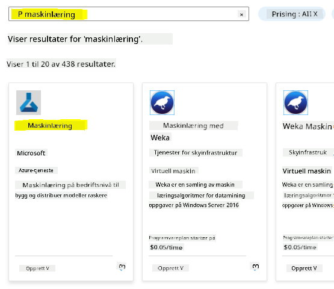

   Klikk på opprett-knappen

   

   Fyll inn innstillingene som følger:
   - Abonnement: Ditt Azure-abonnement
   - Ressursgruppe: Opprett eller velg en ressursgruppe
   - Arbeidsområdenavn: Angi et unikt navn for arbeidsområdet ditt
   - Region: Velg den geografiske regionen nærmest deg
   - Lagringskonto: Merk den nye standardlagringskontoen som vil bli opprettet for arbeidsområdet ditt
   - Nøkkelhvelv: Merk det nye standard nøkkelhvelvet som vil bli opprettet for arbeidsområdet ditt
   - Application insights: Merk den nye standardressursen for Application Insights som vil bli opprettet for arbeidsområdet ditt
   - Containerregister: Ingen (et vil bli opprettet automatisk første gang du utplasserer en modell til en container)

    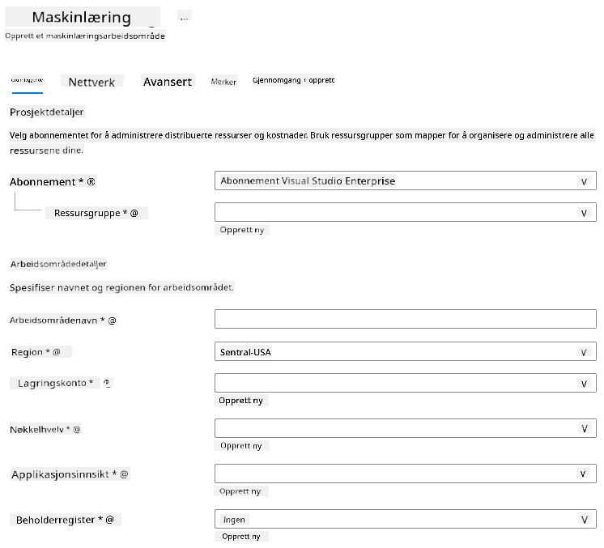

   - Klikk på opprett + gjennomgang og deretter på opprett-knappen
3. Vent til arbeidsområdet ditt er opprettet (dette kan ta noen minutter). Gå deretter til det i portalen. Du finner det via Azure-tjenesten Machine Learning.
4. På oversiktssiden for arbeidsområdet ditt, start Azure Machine Learning Studio (eller åpne en ny nettleserfane og naviger til https://ml.azure.com), og logg inn på Azure Machine Learning Studio med Microsoft-kontoen din. Hvis du blir bedt om det, velg Azure-katalogen og abonnementet ditt, samt Azure Machine Learning-arbeidsområdet ditt.
   
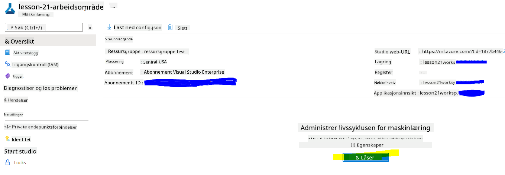

5. I Azure Machine Learning Studio, bruk ☰-ikonet øverst til venstre for å se de ulike sidene i grensesnittet. Du kan bruke disse sidene til å administrere ressursene i arbeidsområdet ditt.

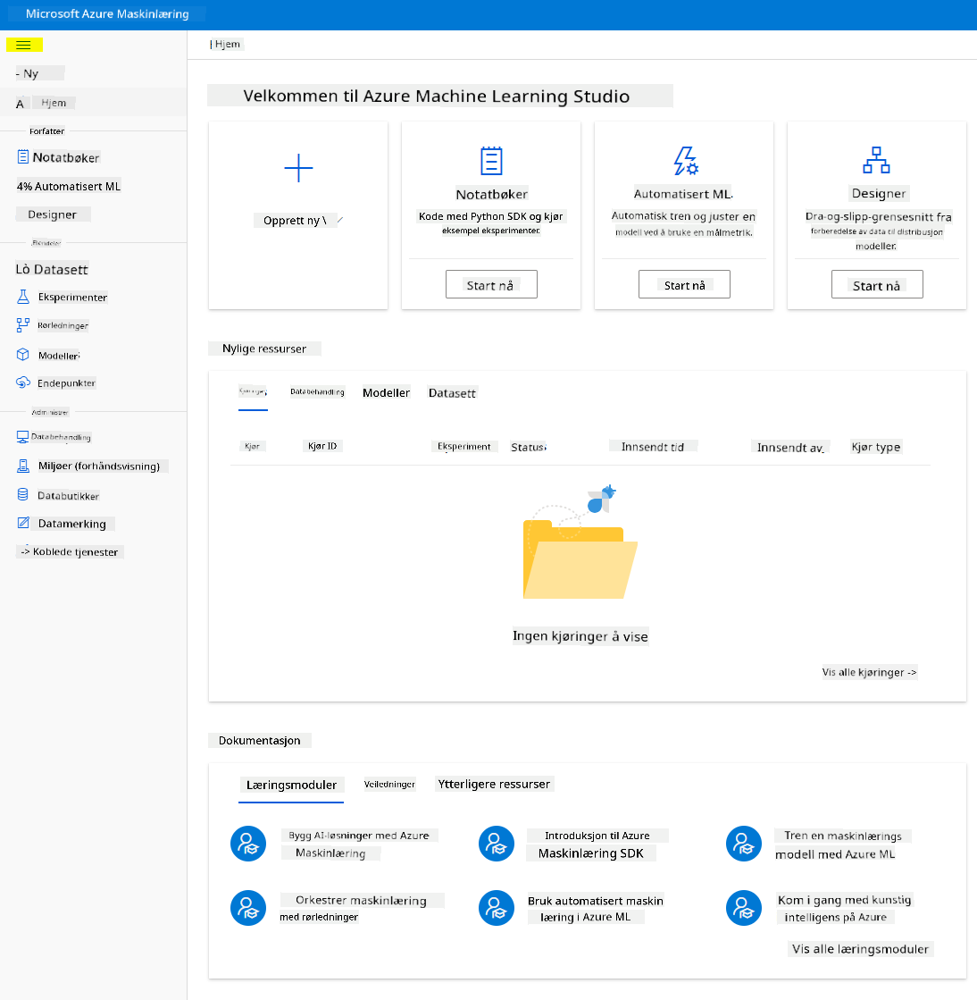

Du kan administrere arbeidsområdet ditt ved hjelp av Azure-portalen, men for dataforskere og maskinlæringsoperasjonsingeniører gir Azure Machine Learning Studio et mer fokusert brukergrensesnitt for administrasjon av arbeidsområderessurser.

### 2.2 Databehandlingsressurser

Databehandlingsressurser er skybaserte ressurser som du kan bruke til å kjøre modelltrening og datautforskningsprosesser. Det finnes fire typer databehandlingsressurser du kan opprette:

- **Databehandlingsinstanser**: Utviklingsarbeidsstasjoner som dataforskere kan bruke til å arbeide med data og modeller. Dette innebærer opprettelse av en virtuell maskin (VM) og oppstart av en notatbokinstans. Du kan deretter trene en modell ved å kalle en databehandlingsklynge fra notatboken.
- **Databehandlingsklynger**: Skalerbare klynger av virtuelle maskiner for behovsbasert behandling av eksperimentkode. Du vil trenge dette når du trener en modell. Databehandlingsklynger kan også bruke spesialiserte GPU- eller CPU-ressurser.
- **Inferenzklynger**: Utplasseringsmål for prediktive tjenester som bruker de trente modellene dine.
- **Tilknyttet beregning**: Lenker til eksisterende Azure-beregningsressurser, som virtuelle maskiner eller Azure Databricks-klynger.

#### 2.2.1 Velge riktige alternativer for dine beregningsressurser

Noen viktige faktorer må vurderes når du oppretter en beregningsressurs, og disse valgene kan være avgjørende.

**Trenger du CPU eller GPU?**

En CPU (Central Processing Unit) er den elektroniske kretsen som utfører instruksjoner som utgjør et dataprogram. En GPU (Graphics Processing Unit) er en spesialisert elektronisk krets som kan utføre grafikkrelatert kode i svært høy hastighet.

Hovedforskjellen mellom CPU- og GPU-arkitektur er at en CPU er designet for å håndtere et bredt spekter av oppgaver raskt (målt ved CPU-klokkehastighet), men er begrenset i antall samtidige oppgaver som kan kjøres. GPU-er er designet for parallell databehandling og er derfor mye bedre egnet for oppgaver innen dyp læring.

| CPU                                     | GPU                         |
|-----------------------------------------|-----------------------------|
| Mindre kostbar                          | Mer kostbar                 |
| Lavere nivå av samtidighet              | Høyere nivå av samtidighet  |
| Langsommere i trening av modeller for dyp læring | Optimal for dyp læring      |

**Klyngestørrelse**

Større klynger er dyrere, men gir bedre respons. Derfor, hvis du har tid, men ikke nok penger, bør du starte med en liten klynge. Omvendt, hvis du har penger, men ikke mye tid, bør du starte med en større klynge.

**VM-størrelse**

Avhengig av dine tids- og budsjettbegrensninger, kan du variere størrelsen på RAM, disk, antall kjerner og klokkehastighet. Å øke alle disse parameterne vil være dyrere, men vil gi bedre ytelse.

**Dedikerte eller lavprioriterte instanser?**

En lavprioritetsinstans betyr at den kan avbrytes: Microsoft Azure kan i hovedsak ta disse ressursene og tildele dem til en annen oppgave, og dermed avbryte en jobb. En dedikert instans, eller ikke-avbrytbar, betyr at jobben aldri vil bli avsluttet uten din tillatelse. Dette er en annen vurdering av tid kontra penger, siden avbrytbare instanser er billigere enn dedikerte.

#### 2.2.2 Opprette en beregningsklynge

I [Azure ML-arbeidsområdet](https://ml.azure.com/) som vi opprettet tidligere, gå til beregning, og du vil kunne se de forskjellige beregningsressursene vi nettopp diskuterte (dvs. beregningsinstanser, beregningsklynger, inferensklynger og tilknyttet beregning). For dette prosjektet trenger vi en beregningsklynge for modelltrening. I Studio, klikk på "Compute"-menyen, deretter "Compute cluster"-fanen og klikk på "+ New"-knappen for å opprette en beregningsklynge.


1. Velg dine alternativer: Dedikert vs lav prioritet, CPU eller GPU, VM-størrelse og antall kjerner (du kan beholde standardinnstillingene for dette prosjektet).
2. Klikk på Neste-knappen.

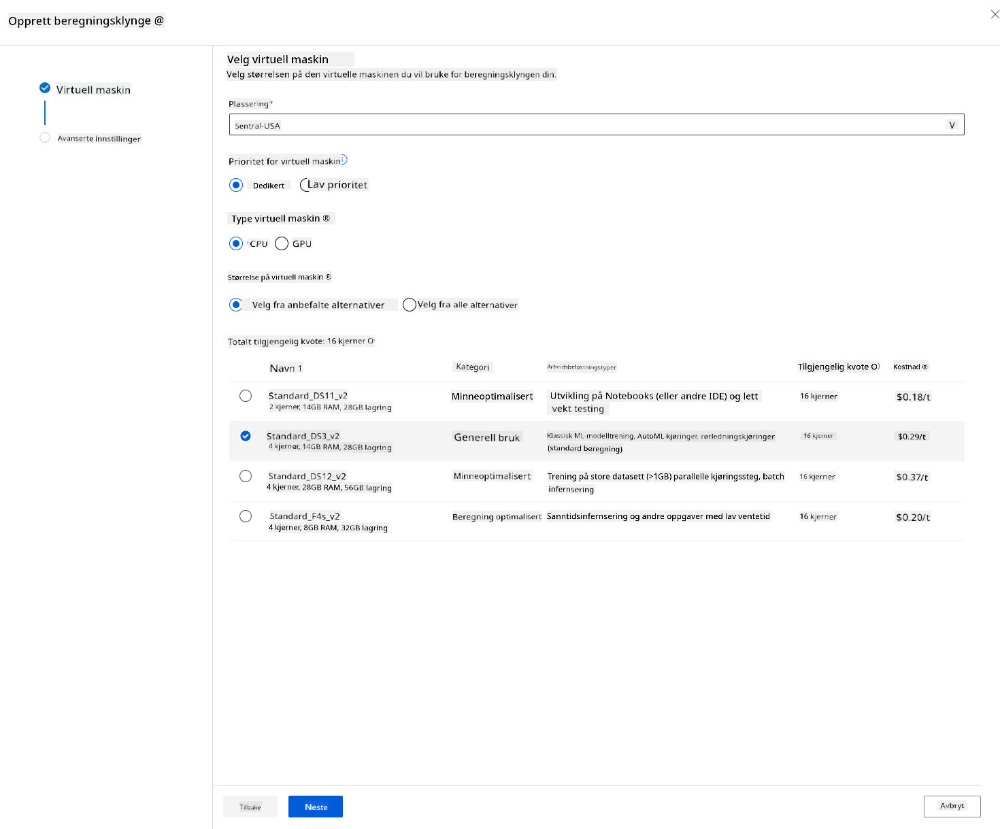

3. Gi klyngen et beregningsnavn.
4. Velg dine alternativer: Minimum/maksimum antall noder, antall sekunder i inaktiv før nedskalering, SSH-tilgang. Merk at hvis minimum antall noder er 0, vil du spare penger når klyngen er inaktiv. Merk at jo høyere antall maksimum noder, jo kortere vil treningen være. Det anbefalte maksimum antall noder er 3.  
5. Klikk på "Create"-knappen. Dette trinnet kan ta noen minutter.


Fantastisk! Nå som vi har en beregningsklynge, må vi laste dataene inn i Azure ML Studio.

### 2.3 Laste inn datasettet

1. I [Azure ML-arbeidsområdet](https://ml.azure.com/) som vi opprettet tidligere, klikk på "Datasets" i venstre meny og klikk på "+ Create dataset"-knappen for å opprette et datasett. Velg alternativet "From local files" og velg Kaggle-datasettet vi lastet ned tidligere.
   
   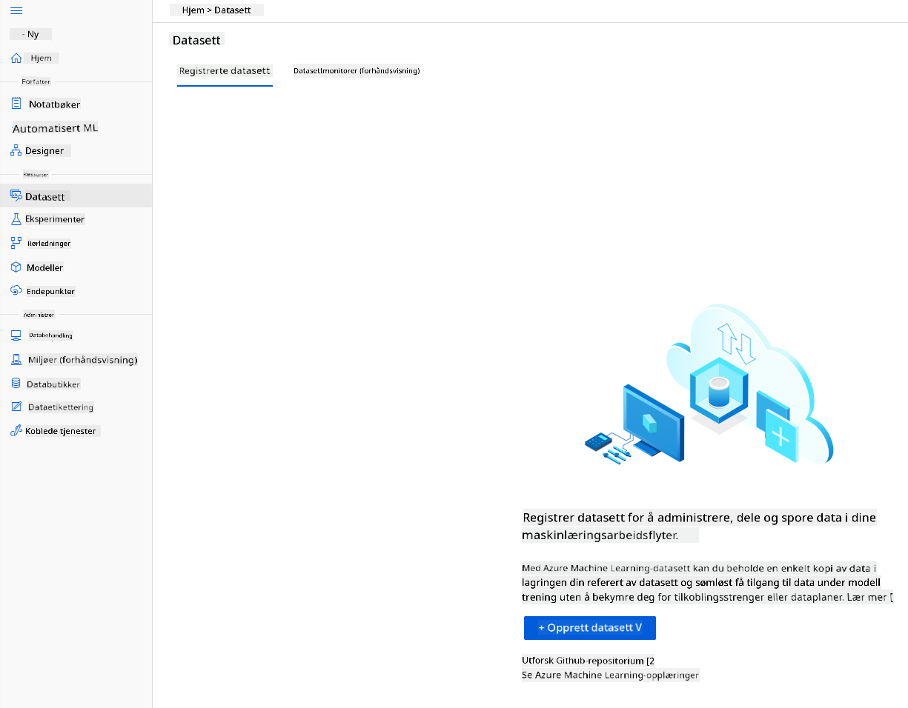

2. Gi datasettet ditt et navn, en type og en beskrivelse. Klikk Neste. Last opp dataene fra filer. Klikk Neste.
   
   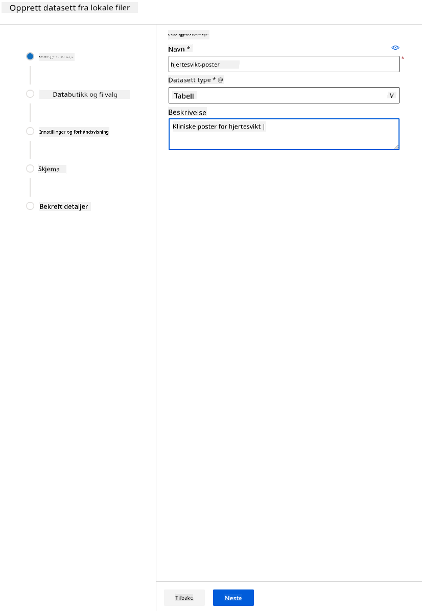

3. I skjemaet, endre datatype til Boolean for følgende funksjoner: anaemia, diabetes, high blood pressure, sex, smoking, og DEATH_EVENT. Klikk Neste og Klikk Create.
   
   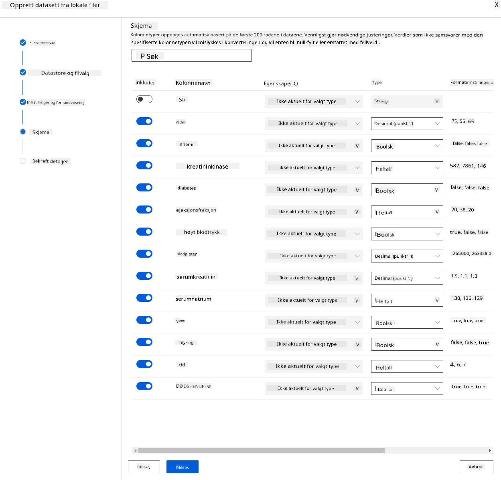

Flott! Nå som datasettet er på plass og beregningsklyngen er opprettet, kan vi starte treningen av modellen!

### 2.4 Lavkode/Ingen kode-trening med AutoML

Tradisjonell utvikling av maskinlæringsmodeller er ressurskrevende, krever betydelig domenekunnskap og tid for å produsere og sammenligne dusinvis av modeller. 
Automatisert maskinlæring (AutoML) er prosessen med å automatisere de tidkrevende, iterative oppgavene ved utvikling av maskinlæringsmodeller. Det lar dataforskere, analytikere og utviklere bygge ML-modeller med høy skala, effektivitet og produktivitet, samtidig som modellkvaliteten opprettholdes. Det reduserer tiden det tar å få produksjonsklare ML-modeller, med stor enkelhet og effektivitet. [Lær mer](https://docs.microsoft.com/azure/machine-learning/concept-automated-ml?WT.mc_id=academic-77958-bethanycheum&ocid=AID3041109)

1. I [Azure ML-arbeidsområdet](https://ml.azure.com/) som vi opprettet tidligere, klikk på "Automated ML" i venstre meny og velg datasettet du nettopp lastet opp. Klikk Neste.

   

2.  Skriv inn et nytt eksperimentnavn, målkolonnen (DEATH_EVENT) og beregningsklyngen vi opprettet. Klikk Neste.
   
   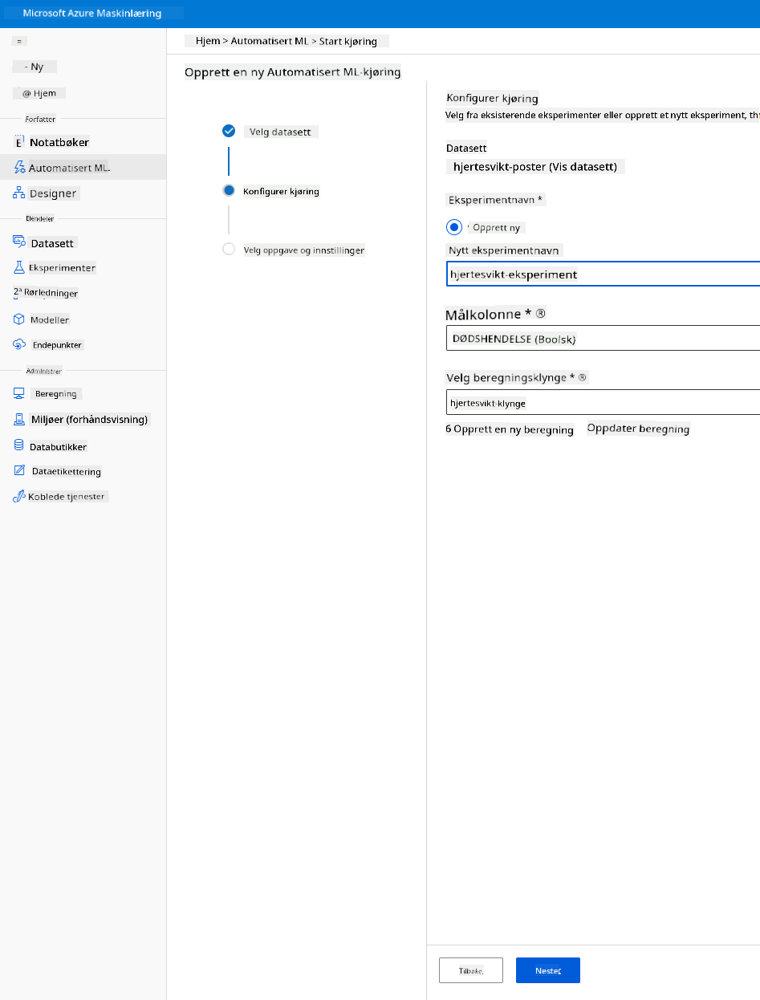

3. Velg "Classification" og Klikk Fullfør. Dette trinnet kan ta mellom 30 minutter til 1 time, avhengig av størrelsen på beregningsklyngen.
    
    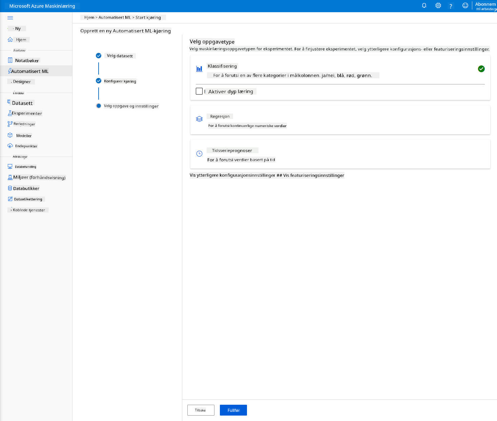

4. Når kjøringen er fullført, klikk på "Automated ML"-fanen, klikk på kjøringen din, og klikk på algoritmen i "Best model summary"-kortet.
    
    

Her kan du se en detaljert beskrivelse av den beste modellen som AutoML genererte. Du kan også utforske andre modeller generert i Modeller-fanen. Ta noen minutter til å utforske modellene i forklaringsfanen (forhåndsvisning). Når du har valgt modellen du vil bruke (her vil vi velge den beste modellen valgt av AutoML), vil vi se hvordan vi kan distribuere den.

## 3. Lavkode/Ingen kode-modellutplassering og forbruk av endepunkt
### 3.1 Modellutplassering

Grensesnittet for automatisert maskinlæring lar deg distribuere den beste modellen som en webtjeneste i noen få trinn. Utplassering er integreringen av modellen slik at den kan gjøre prediksjoner basert på nye data og identifisere potensielle muligheter. For dette prosjektet betyr utplassering til en webtjeneste at medisinske applikasjoner vil kunne bruke modellen til å gjøre live prediksjoner av pasientenes risiko for å få hjerteinfarkt.

I den beste modellbeskrivelsen, klikk på "Deploy"-knappen.
    
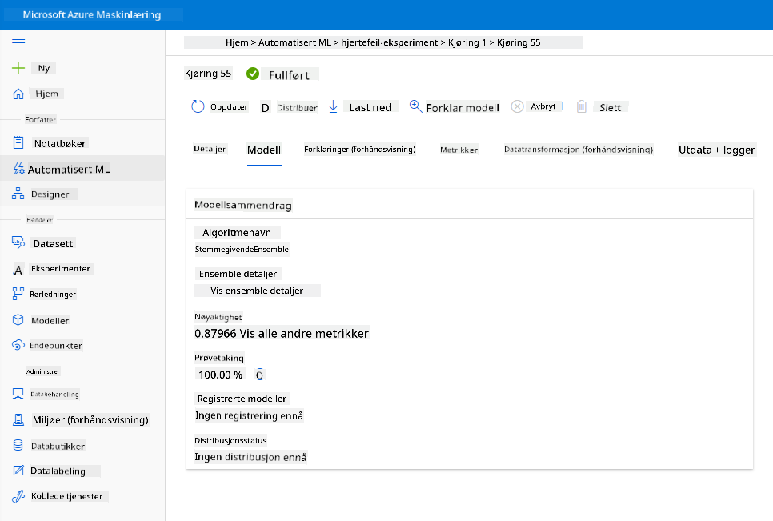

15. Gi den et navn, en beskrivelse, beregningstype (Azure Container Instance), aktiver autentisering og klikk på Deploy. Dette trinnet kan ta omtrent 20 minutter å fullføre. Utplasseringsprosessen innebærer flere trinn, inkludert registrering av modellen, generering av ressurser og konfigurering av dem for webtjenesten. En statusmelding vises under Deploy status. Velg Oppdater periodisk for å sjekke utplasseringsstatusen. Den er utplassert og kjører når statusen er "Healthy".

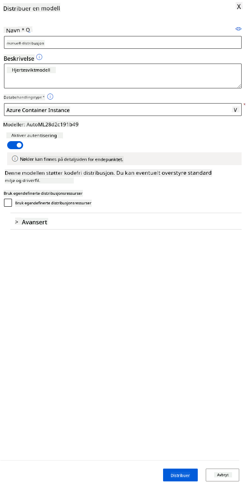

16. Når den er utplassert, klikk på Endepunkt-fanen og klikk på endepunktet du nettopp utplasserte. Her finner du alle detaljene du trenger å vite om endepunktet. 

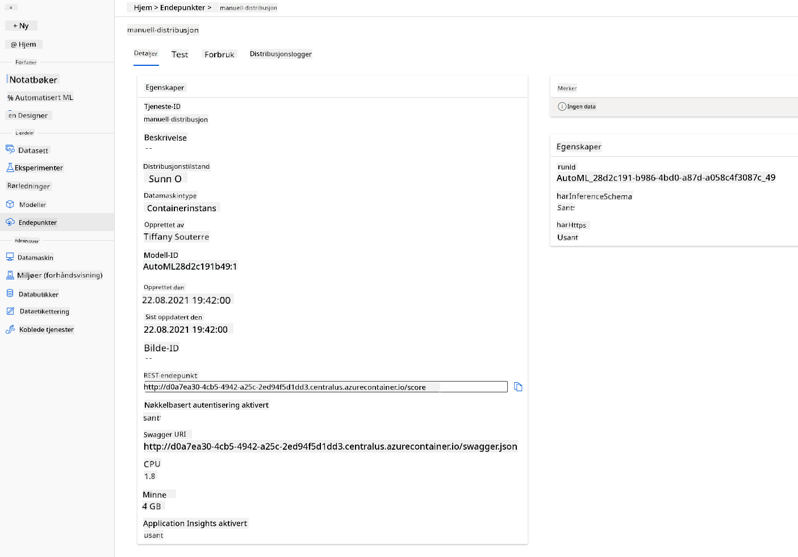

Fantastisk! Nå som vi har en modell utplassert, kan vi starte forbruket av endepunktet.

### 3.2 Forbruk av endepunkt

Klikk på "Consume"-fanen. Her finner du REST-endepunktet og et Python-skript i forbruksalternativet. Ta deg tid til å lese Python-koden. 

Dette skriptet kan kjøres direkte fra din lokale maskin og vil bruke endepunktet.

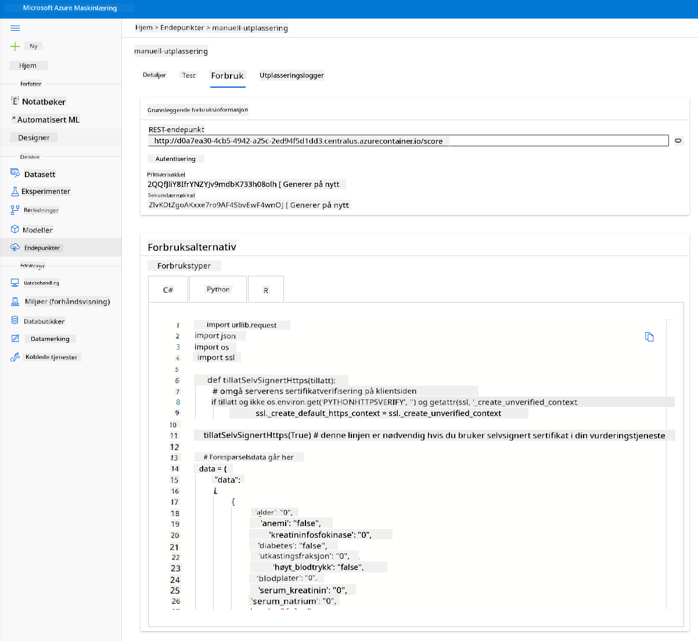

Ta et øyeblikk til å sjekke disse 2 linjene med kode: 

```python
url = 'http://98e3715f-xxxx-xxxx-xxxx-9ec22d57b796.centralus.azurecontainer.io/score'
api_key = '' # Replace this with the API key for the web service
```
Variabelen `url` er REST-endepunktet som finnes i forbruksfanen, og variabelen `api_key` er primærnøkkelen som også finnes i forbruksfanen (kun hvis du har aktivert autentisering). Dette er hvordan skriptet kan bruke endepunktet.

18. Når du kjører skriptet, bør du se følgende utdata:
    ```python
    b'"{\\"result\\": [true]}"'
    ```
Dette betyr at prediksjonen for hjertesvikt for de gitte dataene er sann. Dette gir mening fordi hvis du ser nærmere på dataene som automatisk genereres i skriptet, er alt satt til 0 og falsk som standard. Du kan endre dataene med følgende inndataprøve:

```python
data = {
    "data":
    [
        {
            'age': "0",
            'anaemia': "false",
            'creatinine_phosphokinase': "0",
            'diabetes': "false",
            'ejection_fraction': "0",
            'high_blood_pressure': "false",
            'platelets': "0",
            'serum_creatinine': "0",
            'serum_sodium': "0",
            'sex': "false",
            'smoking': "false",
            'time': "0",
        },
        {
            'age': "60",
            'anaemia': "false",
            'creatinine_phosphokinase': "500",
            'diabetes': "false",
            'ejection_fraction': "38",
            'high_blood_pressure': "false",
            'platelets': "260000",
            'serum_creatinine': "1.40",
            'serum_sodium': "137",
            'sex': "false",
            'smoking': "false",
            'time': "130",
        },
    ],
}
```
Skriptet bør returnere:
    ```python
    b'"{\\"result\\": [true, false]}"'
    ```

Gratulerer! Du har nettopp brukt den utplasserte modellen og trent den på Azure ML!

> **_MERK:_** Når du er ferdig med prosjektet, ikke glem å slette alle ressursene.
## 🚀 Utfordring

Se nøye på modellforklaringene og detaljene som AutoML genererte for de beste modellene. Prøv å forstå hvorfor den beste modellen er bedre enn de andre. Hvilke algoritmer ble sammenlignet? Hva er forskjellene mellom dem? Hvorfor presterer den beste modellen bedre i dette tilfellet?

## [Etter-forelesningsquiz](https://ff-quizzes.netlify.app/en/ds/)

## Gjennomgang og selvstudium

I denne leksjonen lærte du hvordan du trener, distribuerer og bruker en modell for å forutsi risikoen for hjertesvikt på en lavkode/ingen kode-måte i skyen. Hvis du ikke har gjort det ennå, gå dypere inn i modellforklaringene som AutoML genererte for de beste modellene og prøv å forstå hvorfor den beste modellen er bedre enn de andre.

Du kan gå videre med lavkode/ingen kode AutoML ved å lese denne [dokumentasjonen](https://docs.microsoft.com/azure/machine-learning/tutorial-first-experiment-automated-ml?WT.mc_id=academic-77958-bethanycheum&ocid=AID3041109).

## Oppgave

[Lavkode/Ingen kode Data Science-prosjekt på Azure ML](assignment.md)

---

**Ansvarsfraskrivelse**:  
Dette dokumentet er oversatt ved hjelp av AI-oversettelsestjenesten [Co-op Translator](https://github.com/Azure/co-op-translator). Selv om vi streber etter nøyaktighet, vær oppmerksom på at automatiserte oversettelser kan inneholde feil eller unøyaktigheter. Det originale dokumentet på sitt opprinnelige språk bør anses som den autoritative kilden. For kritisk informasjon anbefales profesjonell menneskelig oversettelse. Vi er ikke ansvarlige for misforståelser eller feiltolkninger som oppstår ved bruk av denne oversettelsen.