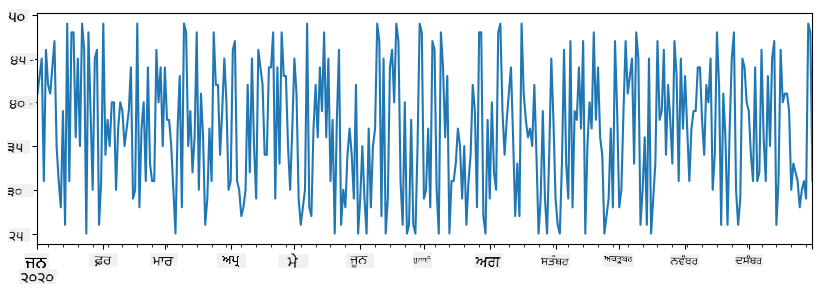
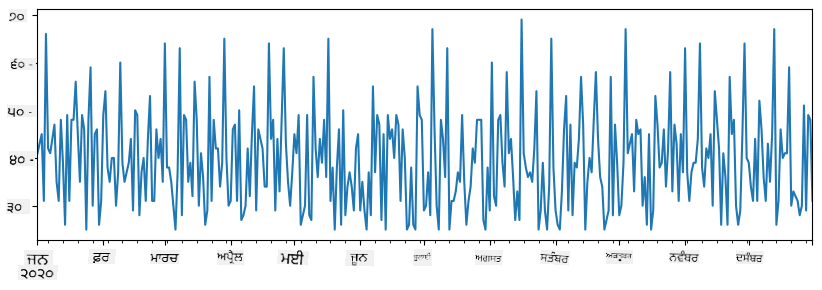
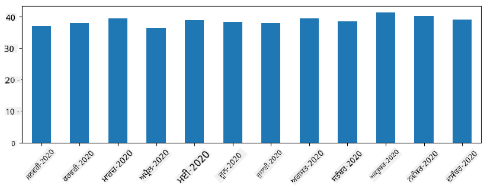
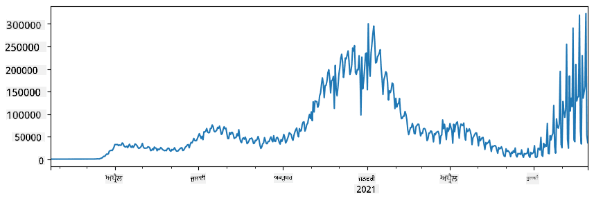
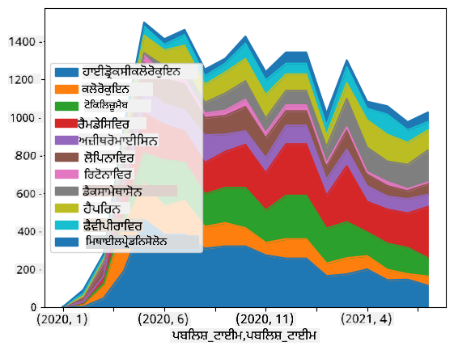

<!--
CO_OP_TRANSLATOR_METADATA:
{
  "original_hash": "7bfec050f4717dcc2dfd028aca9d21f3",
  "translation_date": "2025-09-06T15:37:41+00:00",
  "source_file": "2-Working-With-Data/07-python/README.md",
  "language_code": "pa"
}
-->
# ਡਾਟਾ ਨਾਲ ਕੰਮ ਕਰਨਾ: ਪਾਇਥਨ ਅਤੇ ਪੈਂਡਾਸ ਲਾਇਬ੍ਰੇਰੀ

|  ਦੁਆਰਾ ਬਣਾਈ ਗਈ ਸਕੈਚਨੋਟ ](../../sketchnotes/07-WorkWithPython.png) |
| :---------------------------------------------------------------------------------------------------------------: |
|                 ਪਾਇਥਨ ਨਾਲ ਕੰਮ ਕਰਨਾ - _[@nitya](https://twitter.com/nitya) ਦੁਆਰਾ ਬਣਾਈ ਗਈ ਸਕੈਚਨੋਟ_                 |

[](https://youtu.be/dZjWOGbsN4Y)

ਜਦੋਂ ਕਿ ਡਾਟਾਬੇਸ ਡਾਟਾ ਨੂੰ ਸਟੋਰ ਕਰਨ ਅਤੇ ਕਵੈਰੀ ਲੈਂਗਵੇਜਾਂ ਦੀ ਵਰਤੋਂ ਕਰਕੇ ਕਵੈਰੀ ਕਰਨ ਦੇ ਲਈ ਬਹੁਤ ਕੁਸ਼ਲ ਤਰੀਕੇ ਪੇਸ਼ ਕਰਦੇ ਹਨ, ਡਾਟਾ ਪ੍ਰੋਸੈਸਿੰਗ ਦਾ ਸਭ ਤੋਂ ਲਚਕਦਾਰ ਤਰੀਕਾ ਆਪਣਾ ਪ੍ਰੋਗਰਾਮ ਲਿਖਣਾ ਹੈ ਜੋ ਡਾਟਾ ਨੂੰ ਮੋੜ ਸਕੇ। ਕਈ ਮਾਮਲਿਆਂ ਵਿੱਚ, ਡਾਟਾਬੇਸ ਕਵੈਰੀ ਕਰਨਾ ਜ਼ਿਆਦਾ ਪ੍ਰਭਾਵਸ਼ਾਲੀ ਹੋਵੇਗਾ। ਹਾਲਾਂਕਿ ਕੁਝ ਮਾਮਲਿਆਂ ਵਿੱਚ ਜਦੋਂ ਜ਼ਿਆਦਾ ਜਟਿਲ ਡਾਟਾ ਪ੍ਰੋਸੈਸਿੰਗ ਦੀ ਲੋੜ ਹੁੰਦੀ ਹੈ, ਇਹ SQL ਦੀ ਵਰਤੋਂ ਕਰਕੇ ਆਸਾਨੀ ਨਾਲ ਨਹੀਂ ਕੀਤਾ ਜਾ ਸਕਦਾ। 
ਡਾਟਾ ਪ੍ਰੋਸੈਸਿੰਗ ਕਿਸੇ ਵੀ ਪ੍ਰੋਗਰਾਮਿੰਗ ਭਾਸ਼ਾ ਵਿੱਚ ਕੀਤੀ ਜਾ ਸਕਦੀ ਹੈ, ਪਰ ਕੁਝ ਭਾਸ਼ਾਵਾਂ ਹਨ ਜੋ ਡਾਟਾ ਨਾਲ ਕੰਮ ਕਰਨ ਦੇ ਹਿਸਾਬ ਨਾਲ ਉੱਚ ਪੱਧਰ ਦੀਆਂ ਹਨ। ਡਾਟਾ ਸਾਇੰਟਿਸਟ ਆਮ ਤੌਰ 'ਤੇ ਹੇਠਾਂ ਦਿੱਤੀਆਂ ਭਾਸ਼ਾਵਾਂ ਵਿੱਚੋਂ ਇੱਕ ਨੂੰ ਤਰਜੀਹ ਦਿੰਦੇ ਹਨ:

* **[ਪਾਇਥਨ](https://www.python.org/)**, ਇੱਕ ਜਨਰਲ-ਪਰਪਜ਼ ਪ੍ਰੋਗਰਾਮਿੰਗ ਭਾਸ਼ਾ, ਜੋ ਅਕਸਰ ਇਸਦੀ ਸਧਾਰਨਤਾ ਦੇ ਕਾਰਨ ਸ਼ੁਰੂਆਤ ਕਰਨ ਵਾਲਿਆਂ ਲਈ ਸਭ ਤੋਂ ਵਧੀਆ ਵਿਕਲਪ ਮੰਨੀ ਜਾਂਦੀ ਹੈ। ਪਾਇਥਨ ਵਿੱਚ ਕਈ ਵਾਧੂ ਲਾਇਬ੍ਰੇਰੀਆਂ ਹਨ ਜੋ ਤੁਹਾਨੂੰ ਕਈ ਵਿਆਵਹਾਰਿਕ ਸਮੱਸਿਆਵਾਂ ਦਾ ਹੱਲ ਕਰਨ ਵਿੱਚ ਮਦਦ ਕਰ ਸਕਦੀਆਂ ਹਨ, ਜਿਵੇਂ ਕਿ ZIP ਆਰਕਾਈਵ ਤੋਂ ਤੁਹਾਡਾ ਡਾਟਾ ਕੱਢਣਾ, ਜਾਂ ਤਸਵੀਰ ਨੂੰ ਗ੍ਰੇਸਕੇਲ ਵਿੱਚ ਬਦਲਣਾ। ਡਾਟਾ ਸਾਇੰਸ ਤੋਂ ਇਲਾਵਾ, ਪਾਇਥਨ ਅਕਸਰ ਵੈੱਬ ਵਿਕਾਸ ਲਈ ਵੀ ਵਰਤਿਆ ਜਾਂਦਾ ਹੈ। 
* **[R](https://www.r-project.org/)** ਇੱਕ ਪਰੰਪਰਾਗਤ ਟੂਲਬਾਕਸ ਹੈ ਜੋ ਅੰਕੜੇਵਾਰ ਡਾਟਾ ਪ੍ਰੋਸੈਸਿੰਗ ਨੂੰ ਧਿਆਨ ਵਿੱਚ ਰੱਖ ਕੇ ਵਿਕਸਿਤ ਕੀਤਾ ਗਿਆ ਹੈ। ਇਸ ਵਿੱਚ ਲਾਇਬ੍ਰੇਰੀਆਂ ਦਾ ਵੱਡਾ ਸੰਗ੍ਰਹਿ (CRAN) ਸ਼ਾਮਲ ਹੈ, ਜਿਸ ਕਰਕੇ ਇਹ ਡਾਟਾ ਪ੍ਰੋਸੈਸਿੰਗ ਲਈ ਇੱਕ ਚੰਗਾ ਚੋਣ ਹੈ। ਹਾਲਾਂਕਿ, R ਇੱਕ ਜਨਰਲ-ਪਰਪਜ਼ ਪ੍ਰੋਗਰਾਮਿੰਗ ਭਾਸ਼ਾ ਨਹੀਂ ਹੈ, ਅਤੇ ਡਾਟਾ ਸਾਇੰਸ ਖੇਤਰ ਤੋਂ ਬਾਹਰ ਕਦਾਚਿਤ ਹੀ ਵਰਤਿਆ ਜਾਂਦਾ ਹੈ।
* **[ਜੂਲੀਆ](https://julialang.org/)** ਇੱਕ ਹੋਰ ਭਾਸ਼ਾ ਹੈ ਜੋ ਖਾਸ ਤੌਰ 'ਤੇ ਡਾਟਾ ਸਾਇੰਸ ਲਈ ਵਿਕਸਿਤ ਕੀਤੀ ਗਈ ਹੈ। ਇਹ ਪਾਇਥਨ ਨਾਲੋਂ ਬਿਹਤਰ ਪ੍ਰਦਰਸ਼ਨ ਦੇਣ ਲਈ ਤਿਆਰ ਕੀਤੀ ਗਈ ਹੈ, ਜਿਸ ਕਰਕੇ ਇਹ ਵਿਗਿਆਨਕ ਪ੍ਰਯੋਗਾਂ ਲਈ ਇੱਕ ਸ਼ਾਨਦਾਰ ਸਾਧਨ ਹੈ।

ਇਸ ਪਾਠ ਵਿੱਚ, ਅਸੀਂ ਸਧਾਰਨ ਡਾਟਾ ਪ੍ਰੋਸੈਸਿੰਗ ਲਈ ਪਾਇਥਨ ਦੀ ਵਰਤੋਂ 'ਤੇ ਧਿਆਨ ਦੇਵਾਂਗੇ। ਅਸੀਂ ਭਾਸ਼ਾ ਨਾਲ ਮੂਲ ਜਾਣੂ ਹੋਣ ਦੀ ਧਾਰਨਾ ਕਰਦੇ ਹਾਂ। ਜੇ ਤੁਸੀਂ ਪਾਇਥਨ ਦਾ ਗਹਿਰਾ ਦੌਰਾ ਕਰਨਾ ਚਾਹੁੰਦੇ ਹੋ, ਤਾਂ ਤੁਸੀਂ ਹੇਠਾਂ ਦਿੱਤੇ ਸਾਧਨਾਂ ਵਿੱਚੋਂ ਕਿਸੇ ਇੱਕ ਨੂੰ ਦੇਖ ਸਕਦੇ ਹੋ:

* [Turtle Graphics ਅਤੇ Fractals ਨਾਲ ਮਜ਼ੇਦਾਰ ਤਰੀਕੇ ਨਾਲ ਪਾਇਥਨ ਸਿੱਖੋ](https://github.com/shwars/pycourse) - GitHub-ਅਧਾਰਿਤ ਪਾਇਥਨ ਪ੍ਰੋਗਰਾਮਿੰਗ ਵਿੱਚ ਤੇਜ਼ੀ ਨਾਲ ਜਾਣੂ ਹੋਣ ਦਾ ਕੋਰਸ
* [ਪਾਇਥਨ ਨਾਲ ਆਪਣੇ ਪਹਿਲੇ ਕਦਮ ਚੁੱਕੋ](https://docs.microsoft.com/en-us/learn/paths/python-first-steps/?WT.mc_id=academic-77958-bethanycheum) [Microsoft Learn](http://learn.microsoft.com/?WT.mc_id=academic-77958-bethanycheum) 'ਤੇ ਲਰਨਿੰਗ ਪਾਠ

ਡਾਟਾ ਕਈ ਰੂਪਾਂ ਵਿੱਚ ਆ ਸਕਦਾ ਹੈ। ਇਸ ਪਾਠ ਵਿੱਚ, ਅਸੀਂ ਡਾਟਾ ਦੇ ਤਿੰਨ ਰੂਪਾਂ 'ਤੇ ਵਿਚਾਰ ਕਰਾਂਗੇ - **ਟੇਬੂਲਰ ਡਾਟਾ**, **ਟੈਕਸਟ**, ਅਤੇ **ਤਸਵੀਰਾਂ**।

ਅਸੀਂ ਤੁਹਾਨੂੰ ਸਾਰੇ ਸੰਬੰਧਿਤ ਲਾਇਬ੍ਰੇਰੀਆਂ ਦਾ ਪੂਰਾ ਜਾਇਜ਼ਾ ਦੇਣ ਦੀ ਬਜਾਏ ਡਾਟਾ ਪ੍ਰੋਸੈਸਿੰਗ ਦੇ ਕੁਝ ਉਦਾਹਰਣਾਂ 'ਤੇ ਧਿਆਨ ਦੇਵਾਂਗੇ। ਇਹ ਤੁਹਾਨੂੰ ਕੀ ਸੰਭਵ ਹੈ ਇਸ ਦੀ ਮੁੱਖ ਵਿਚਾਰ ਦੇਵੇਗਾ, ਅਤੇ ਜਦੋਂ ਤੁਹਾਨੂੰ ਲੋੜ ਹੋਵੇ ਤਾਂ ਤੁਹਾਡੇ ਸਮੱਸਿਆਵਾਂ ਦੇ ਹੱਲ ਕਿੱਥੇ ਲੱਭਣੇ ਹਨ ਇਸ ਦੀ ਸਮਝ ਦੇਵੇਗਾ।

> **ਸਭ ਤੋਂ ਉਪਯੋਗ ਸਲਾਹ**। ਜਦੋਂ ਤੁਹਾਨੂੰ ਡਾਟਾ 'ਤੇ ਕੋਈ ਖਾਸ ਕਾਰਵਾਈ ਕਰਨ ਦੀ ਲੋੜ ਹੋਵੇ ਜਿਸ ਬਾਰੇ ਤੁਹਾਨੂੰ ਪਤਾ ਨਹੀਂ ਕਿ ਕਿਵੇਂ ਕਰਨਾ ਹੈ, ਤਾਂ ਇਸ ਨੂੰ ਇੰਟਰਨੈਟ 'ਤੇ ਖੋਜਣ ਦੀ ਕੋਸ਼ਿਸ਼ ਕਰੋ। [Stackoverflow](https://stackoverflow.com/) ਅਕਸਰ ਕਈ ਆਮ ਕੰਮਾਂ ਲਈ ਪਾਇਥਨ ਵਿੱਚ ਬਹੁਤ ਸਾਰੇ ਉਪਯੋਗ ਕੋਡ ਨਮੂਨੇ ਸ਼ਾਮਲ ਕਰਦਾ ਹੈ। 

## [ਪ੍ਰੀ-ਲੈਕਚਰ ਕਵਿਜ਼](https://ff-quizzes.netlify.app/en/ds/quiz/12)

## ਟੇਬੂਲਰ ਡਾਟਾ ਅਤੇ ਡਾਟਾਫ੍ਰੇਮ

ਤੁਸੀਂ ਪਹਿਲਾਂ ਹੀ ਟੇਬੂਲਰ ਡਾਟਾ ਨਾਲ ਮਿਲ ਚੁੱਕੇ ਹੋ ਜਦੋਂ ਅਸੀਂ ਰਿਲੇਸ਼ਨਲ ਡਾਟਾਬੇਸਾਂ ਬਾਰੇ ਗੱਲ ਕੀਤੀ ਸੀ। ਜਦੋਂ ਤੁਹਾਡੇ ਕੋਲ ਬਹੁਤ ਸਾਰਾ ਡਾਟਾ ਹੁੰਦਾ ਹੈ, ਅਤੇ ਇਹ ਕਈ ਵੱਖ-ਵੱਖ ਜੁੜੇ ਹੋਏ ਟੇਬਲਾਂ ਵਿੱਚ ਸ਼ਾਮਲ ਹੁੰਦਾ ਹੈ, ਤਾਂ ਇਸ ਨਾਲ ਕੰਮ ਕਰਨ ਲਈ SQL ਦੀ ਵਰਤੋਂ ਕਰਨਾ ਬਿਲਕੁਲ ਸਹੀ ਹੁੰਦਾ ਹੈ। ਹਾਲਾਂਕਿ, ਕਈ ਮਾਮਲਿਆਂ ਵਿੱਚ ਜਦੋਂ ਸਾਡੇ ਕੋਲ ਡਾਟਾ ਦੀ ਇੱਕ ਸਧਾਰਨ ਟੇਬਲ ਹੁੰਦੀ ਹੈ, ਅਤੇ ਸਾਨੂੰ ਇਸ ਡਾਟਾ ਬਾਰੇ ਕੁਝ **ਸਮਝ** ਜਾਂ **ਅੰਦਰੂਨੀ ਜਾਣਕਾਰੀ** ਪ੍ਰਾਪਤ ਕਰਨ ਦੀ ਲੋੜ ਹੁੰਦੀ ਹੈ, ਜਿਵੇਂ ਕਿ ਵੰਡ, ਮੁੱਲਾਂ ਦੇ ਵਿਚਕਾਰ ਸੰਬੰਧ, ਆਦਿ। ਡਾਟਾ ਸਾਇੰਸ ਵਿੱਚ, ਕਈ ਮਾਮਲਿਆਂ ਵਿੱਚ ਸਾਨੂੰ ਮੂਲ ਡਾਟਾ ਦੇ ਕੁਝ ਰੂਪਾਂਤਰਨ ਕਰਨ ਦੀ ਲੋੜ ਹੁੰਦੀ ਹੈ, ਜਿਸ ਤੋਂ ਬਾਅਦ ਵਿਜ਼ੁਅਲਾਈਜ਼ੇਸ਼ਨ ਹੁੰਦੀ ਹੈ। ਇਹ ਦੋਵੇਂ ਕਦਮ ਪਾਇਥਨ ਦੀ ਵਰਤੋਂ ਕਰਕੇ ਆਸਾਨੀ ਨਾਲ ਕੀਤੇ ਜਾ ਸਕਦੇ ਹਨ।

ਪਾਇਥਨ ਵਿੱਚ ਟੇਬੂਲਰ ਡਾਟਾ ਨਾਲ ਨਿਪਟਣ ਵਿੱਚ ਮਦਦ ਕਰਨ ਵਾਲੀਆਂ ਦੋ ਸਭ ਤੋਂ ਉਪਯੋਗ ਲਾਇਬ੍ਰੇਰੀਆਂ ਹਨ:
* **[Pandas](https://pandas.pydata.org/)** ਤੁਹਾਨੂੰ **ਡਾਟਾਫ੍ਰੇਮ** ਮੋੜਨ ਦੀ ਆਗਿਆ ਦਿੰਦਾ ਹੈ, ਜੋ ਰਿਲੇਸ਼ਨਲ ਟੇਬਲਾਂ ਦੇ ਸਮਾਨ ਹਨ। ਤੁਸੀਂ ਨਾਮਿਤ ਕਾਲਮ ਰੱਖ ਸਕਦੇ ਹੋ, ਅਤੇ ਪੰਗਤਾਂ, ਕਾਲਮਾਂ ਅਤੇ ਡਾਟਾਫ੍ਰੇਮਾਂ 'ਤੇ ਵੱਖ-ਵੱਖ ਕਾਰਵਾਈਆਂ ਕਰ ਸਕਦੇ ਹੋ। 
* **[Numpy](https://numpy.org/)** **ਟੈਂਸਰ**, ਜ਼ਿਆਦਾ-ਮਾਤਰਾ **ਐਰੇ** ਨਾਲ ਕੰਮ ਕਰਨ ਲਈ ਇੱਕ ਲਾਇਬ੍ਰੇਰੀ ਹੈ। ਐਰੇ ਵਿੱਚ ਇੱਕੋ ਜਿਹੇ ਅਧਾਰਤ ਕਿਸਮ ਦੇ ਮੁੱਲ ਹੁੰਦੇ ਹਨ, ਅਤੇ ਇਹ ਡਾਟਾਫ੍ਰੇਮ ਨਾਲੋਂ ਸਧਾਰਨ ਹੁੰਦਾ ਹੈ, ਪਰ ਇਹ ਵਧੇਰੇ ਗਣਿਤੀ ਕਾਰਵਾਈਆਂ ਪੇਸ਼ ਕਰਦਾ ਹੈ, ਅਤੇ ਘੱਟ ਓਵਰਹੈੱਡ ਬਣਾਉਂਦਾ ਹੈ।

ਇਸ ਤੋਂ ਇਲਾਵਾ ਕੁਝ ਹੋਰ ਲਾਇਬ੍ਰੇਰੀਆਂ ਹਨ ਜਿਨ੍ਹਾਂ ਬਾਰੇ ਤੁਹਾਨੂੰ ਪਤਾ ਹੋਣਾ ਚਾਹੀਦਾ ਹੈ:
* **[Matplotlib](https://matplotlib.org/)** ਡਾਟਾ ਵਿਜ਼ੁਅਲਾਈਜ਼ੇਸ਼ਨ ਅਤੇ ਗ੍ਰਾਫ ਪਲਾਟ ਕਰਨ ਲਈ ਵਰਤੀ ਜਾਣ ਵਾਲੀ ਲਾਇਬ੍ਰੇਰੀ ਹੈ
* **[SciPy](https://www.scipy.org/)** ਕੁਝ ਵਾਧੂ ਵਿਗਿਆਨਕ ਫੰਕਸ਼ਨਾਂ ਵਾਲੀ ਲਾਇਬ੍ਰੇਰੀ ਹੈ। ਅਸੀਂ ਪਹਿਲਾਂ ਹੀ ਸੰਭਾਵਨਾ ਅਤੇ ਅੰਕੜੇਵਾਰਤਾ ਬਾਰੇ ਗੱਲ ਕਰਦੇ ਹੋਏ ਇਸ ਲਾਇਬ੍ਰੇਰੀ ਨਾਲ ਮਿਲ ਚੁੱਕੇ ਹਾਂ

ਇਹ ਹੈ ਇੱਕ ਕੋਡ ਦਾ ਟੁਕੜਾ ਜੋ ਤੁਸੀਂ ਆਮ ਤੌਰ 'ਤੇ ਆਪਣੇ ਪਾਇਥਨ ਪ੍ਰੋਗਰਾਮ ਦੇ ਸ਼ੁਰੂ ਵਿੱਚ ਉਹਨਾਂ ਲਾਇਬ੍ਰੇਰੀਆਂ ਨੂੰ ਇੰਪੋਰਟ ਕਰਨ ਲਈ ਵਰਤਦੇ ਹੋ:
```python
import numpy as np
import pandas as pd
import matplotlib.pyplot as plt
from scipy import ... # you need to specify exact sub-packages that you need
``` 

Pandas ਕੁਝ ਮੂਲ ਧਾਰਨਾਵਾਂ 'ਤੇ ਕੇਂਦਰਿਤ ਹੈ।

### ਸਿਰੀਜ਼ 

**ਸਿਰੀਜ਼** ਮੁੱਲਾਂ ਦੀ ਇੱਕ ਲੜੀ ਹੈ, ਜੋ ਸੂਚੀ ਜਾਂ numpy ਐਰੇ ਦੇ ਸਮਾਨ ਹੈ। ਮੁੱਖ ਅੰਤਰ ਇਹ ਹੈ ਕਿ ਸਿਰੀਜ਼ ਵਿੱਚ ਇੱਕ **ਸੂਚਕ** ਵੀ ਹੁੰਦਾ ਹੈ, ਅਤੇ ਜਦੋਂ ਅਸੀਂ ਸਿਰੀਜ਼ 'ਤੇ ਕਾਰਵਾਈ ਕਰਦੇ ਹਾਂ (ਜਿਵੇਂ ਕਿ ਉਹਨਾਂ ਨੂੰ ਜੋੜਨਾ), ਤਾਂ ਸੂਚਕ ਨੂੰ ਧਿਆਨ ਵਿੱਚ ਰੱਖਿਆ ਜਾਂਦਾ ਹੈ। ਸੂਚਕ ਸਧਾਰਨ ਪੰਗਤ ਨੰਬਰ (ਜਦੋਂ ਸੂਚੀ ਜਾਂ ਐਰੇ ਤੋਂ ਸਿਰੀਜ਼ ਬਣਾਈ ਜਾਂਦੀ ਹੈ ਤਾਂ ਇਹ ਡਿਫਾਲਟ ਸੂਚਕ ਹੁੰਦਾ ਹੈ) ਜਿਵੇਂ ਸਧਾਰਨ ਹੋ ਸਕਦਾ ਹੈ, ਜਾਂ ਇਸ ਵਿੱਚ ਜਟਿਲ ਬਣਤਰ ਹੋ ਸਕਦੀ ਹੈ, ਜਿਵੇਂ ਕਿ ਮਿਤੀ ਅੰਤਰਾਲ।

> **ਨੋਟ**: Pandas ਦੇ ਕੁਝ ਸ਼ੁਰੂਆਤੀ ਕੋਡ ਸਾਥੀ ਨੋਟਬੁੱਕ [`notebook.ipynb`](notebook.ipynb) ਵਿੱਚ ਸ਼ਾਮਲ ਹਨ। ਅਸੀਂ ਇੱਥੇ ਕੁਝ ਉਦਾਹਰਣ outline ਕਰਦੇ ਹਾਂ, ਅਤੇ ਤੁਸੀਂ ਪੂਰੀ ਨੋਟਬੁੱਕ ਦੀ ਜਾਂਚ ਕਰਨ ਲਈ ਸਵਾਗਤ ਕਰਦੇ ਹੋ।

ਇੱਕ ਉਦਾਹਰਣ 'ਤੇ ਵਿਚਾਰ ਕਰੋ: ਅਸੀਂ ਆਪਣੇ ਆਈਸ-ਕ੍ਰੀਮ ਸਪਾਟ ਦੀ ਵਿਕਰੀ ਦਾ ਵਿਸ਼ਲੇਸ਼ਣ ਕਰਨਾ ਚਾਹੁੰਦੇ ਹਾਂ। ਆਓ ਕੁਝ ਸਮੇਂ ਦੀ ਮਿਆਦ ਲਈ ਵਿਕਰੀ ਦੇ ਨੰਬਰਾਂ ਦੀ ਇੱਕ ਸਿਰੀਜ਼ ਬਣਾਈਏ (ਹਰ ਦਿਨ ਵੇਚੇ ਗਏ ਆਈਟਮਾਂ ਦੀ ਗਿਣਤੀ):

```python
start_date = "Jan 1, 2020"
end_date = "Mar 31, 2020"
idx = pd.date_range(start_date,end_date)
print(f"Length of index is {len(idx)}")
items_sold = pd.Series(np.random.randint(25,50,size=len(idx)),index=idx)
items_sold.plot()
```


ਹੁਣ ਮੰਨ ਲਓ ਕਿ ਹਰ ਹਫ਼ਤੇ ਅਸੀਂ ਦੋਸਤਾਂ ਲਈ ਇੱਕ ਪਾਰਟੀ ਦਾ ਆਯੋਜਨ ਕਰਦੇ ਹਾਂ, ਅਤੇ ਪਾਰਟੀ ਲਈ 10 ਪੈਕ ਆਈਸ-ਕ੍ਰੀਮ ਵਾਧੂ ਲੈਂਦੇ ਹਾਂ। ਅਸੀਂ ਹਫ਼ਤੇ ਦੇ ਸੂਚਕ ਦੁਆਰਾ ਇੱਕ ਹੋਰ ਸਿਰੀਜ਼ ਬਣਾਉਣ ਲਈ ਇਹ ਦਿਖਾ ਸਕਦੇ ਹਾਂ:
```python
additional_items = pd.Series(10,index=pd.date_range(start_date,end_date,freq="W"))
```
ਜਦੋਂ ਅਸੀਂ ਦੋ ਸਿਰੀਜ਼ ਨੂੰ ਇਕੱਠੇ ਜੋੜਦੇ ਹਾਂ, ਤਾਂ ਸਾਨੂੰ ਕੁੱਲ ਗਿਣਤੀ ਮਿਲਦੀ ਹੈ:
```python
total_items = items_sold.add(additional_items,fill_value=0)
total_items.plot()
```


> **ਨੋਟ** ਕਿ ਅਸੀਂ ਸਧਾਰਨ syntax `total_items+additional_items` ਦੀ ਵਰਤੋਂ ਨਹੀਂ ਕਰ ਰਹੇ। ਜੇ ਅਸੀਂ ਕਰਦੇ, ਤਾਂ ਸਾਨੂੰ resulting ਸਿਰੀਜ਼ ਵਿੱਚ ਬਹੁਤ ਸਾਰੇ `NaN` (*Not a Number*) ਮੁੱਲ ਮਿਲਦੇ। ਇਹ ਇਸ ਲਈ ਹੈ ਕਿਉਂਕਿ `additional_items` ਸਿਰੀਜ਼ ਵਿੱਚ ਕੁਝ ਸੂਚਕ ਬਿੰਦੂਆਂ ਲਈ ਮੁੱਲ ਗੁੰਮ ਹਨ, ਅਤੇ `Nan` ਨੂੰ ਕਿਸੇ ਵੀ ਚੀਜ਼ ਵਿੱਚ ਜੋੜਨਾ `NaN` ਦੇ ਨਤੀਜੇ ਵਿੱਚ ਹੁੰਦਾ ਹੈ। ਇਸ ਲਈ ਅਸੀਂ ਜੋੜਦੇ ਸਮੇਂ `fill_value` ਪੈਰਾਮੀਟਰ ਨੂੰ ਨਿਰਧਾਰਤ ਕਰਨ ਦੀ ਲੋੜ ਹੁੰਦੀ ਹੈ।

ਟਾਈਮ ਸਿਰੀਜ਼ ਨਾਲ, ਅਸੀਂ ਵੱਖ-ਵੱਖ ਸਮੇਂ ਦੇ ਅੰਤਰਾਲਾਂ ਨਾਲ ਸਿਰੀਜ਼ ਨੂੰ **resample** ਵੀ ਕਰ ਸਕਦੇ ਹਾਂ। ਉਦਾਹਰਣ ਲਈ, ਮੰਨ ਲਓ ਕਿ ਅਸੀਂ ਮਹੀਨਾਵਾਰ mean ਵਿਕਰੀ ਦੀ ਮਾਤਰਾ ਗਣਨਾ ਕਰਨਾ ਚਾਹੁੰਦੇ ਹਾਂ। ਅਸੀਂ ਹੇਠਾਂ ਦਿੱਤੇ ਕੋਡ ਦੀ ਵਰਤੋਂ ਕਰ ਸਕਦੇ ਹਾਂ:
```python
monthly = total_items.resample("1M").mean()
ax = monthly.plot(kind='bar')
```


### ਡਾਟਾਫ੍ਰੇਮ

ਡਾਟਾਫ੍ਰੇਮ ਅਸਲ ਵਿੱਚ ਇੱਕੋ ਸੂਚਕ ਵਾਲੀਆਂ ਕਈ ਸਿਰੀਜ਼ਾਂ ਦਾ ਸੰਗ੍ਰਹਿ ਹੈ। ਅਸੀਂ ਕਈ ਸਿਰੀਜ਼ਾਂ ਨੂੰ ਇਕੱਠੇ ਕਰਕੇ ਡਾਟਾਫ੍ਰੇਮ ਵਿੱਚ ਜੋੜ ਸਕਦੇ ਹਾਂ:
```python
a = pd.Series(range(1,10))
b = pd.Series(["I","like","to","play","games","and","will","not","change"],index=range(0,9))
df = pd.DataFrame([a,b])
```
ਇਹ ਹੇਠਾਂ ਦਿੱਤੇ ਜਿਵੇਂ ਇੱਕ ਹੋਰਿਜ਼ਾਂਟਲ ਟੇਬਲ ਬਣਾਏਗਾ:
|     | 0   | 1    | 2   | 3   | 4      | 5   | 6      | 7    | 8    |
| --- | --- | ---- | --- | --- | ------ | --- | ------ | ---- | ---- |
| 0   | 1   | 2    | 3   | 4   | 5      | 6   | 7      | 8    | 9    |
| 1   | I   | like | to  | use | Python | and | Pandas | very | much |

ਅਸੀਂ ਸਿਰੀਜ਼ਾਂ ਨੂੰ ਕਾਲਮ ਵਜੋਂ ਵੀ ਵਰਤ ਸਕਦੇ ਹਾਂ, ਅਤੇ ਡਿਕਸ਼ਨਰੀ ਦੀ ਵਰਤੋਂ ਕਰਕੇ ਕਾਲਮ ਦੇ ਨਾਮ ਨਿਰਧਾਰਤ ਕਰ ਸਕਦੇ ਹਾਂ:
```python
df = pd.DataFrame({ 'A' : a, 'B' : b })
```
ਇਹ ਸਾਨੂੰ ਹੇਠਾਂ ਦਿੱਤੇ ਜਿਵੇਂ ਇੱਕ ਟੇਬਲ ਦੇਵੇਗਾ:

|     | A   | B      |
| --- | --- | ------ |
| 0   | 1   | I      |
| 1   | 2   | like   |
| 2   | 3   | to     |
| 3   | 4   | use    |
| 4   | 5   | Python |
| 5   | 6   | and    |
| 6   | 7   | Pandas |
| 7   | 8   | very   |
| 8   | 9   | much   |

**ਨੋਟ** ਕਿ ਅਸੀਂ ਪਿਛਲੇ ਟੇਬਲ ਨੂੰ ਟ੍ਰਾਂਸਪੋਜ਼ ਕਰਕੇ ਵੀ ਇਹ ਟੇਬਲ ਲੇਆਉਟ ਪ੍ਰਾਪਤ ਕਰ ਸਕਦੇ ਹਾਂ, ਜਿਵੇਂ ਕਿ ਲਿਖ ਕੇ 
```python
df = pd.DataFrame([a,b]).T..rename(columns={ 0 : 'A', 1 : 'B' })
```
ਇੱਥੇ `.T` ਦਾ ਮਤਲਬ ਹੈ ਡਾਟਾਫ੍ਰੇਮ ਨੂੰ ਟ੍ਰਾਂਸਪੋਜ਼ ਕਰਨ ਦੀ ਕਾਰਵਾਈ, ਯਾਨੀ ਪੰਗਤਾਂ ਅਤੇ ਕਾਲਮਾਂ ਨੂੰ ਬਦਲਣਾ, ਅਤੇ `rename` ਕਾਰਵਾਈ ਸਾਨੂੰ ਕਾਲਮਾਂ ਨੂੰ ਪਿਛਲੇ ਉਦਾਹਰਣ ਨਾਲ ਮੇਲ ਕਰਨ ਲਈ ਨਾਮ ਬਦਲਣ ਦੀ ਆਗਿਆ ਦਿੰਦੀ ਹੈ।

ਇੱਥੇ ਕੁਝ ਸਭ ਤੋਂ ਮਹੱਤਵਪੂਰਨ ਕਾਰਵਾਈਆਂ ਹਨ ਜੋ ਅਸੀਂ ਡਾਟਾਫ੍ਰੇਮ 'ਤੇ ਕਰ ਸਕਦੇ ਹਾਂ:

**ਕਾਲਮ ਚੋਣ**। ਅਸੀਂ `df['A']` ਲਿਖ ਕੇ ਵਿਅਕਤੀਗਤ ਕਾਲਮ ਚੁਣ ਸਕਦੇ ਹਾਂ - ਇਹ ਕਾਰਵਾਈ ਇੱਕ ਸਿਰੀਜ਼ ਨੂੰ ਵਾਪਸ ਕਰਦੀ ਹੈ। ਅਸੀਂ `df[['B','A']]` ਲਿਖ ਕੇ ਕਾਲਮਾਂ ਦੇ ਇੱਕ subset ਨੂੰ ਇੱਕ ਹੋਰ ਡਾਟਾਫ੍ਰੇਮ ਵਿੱਚ ਚੁਣ ਸਕਦੇ ਹਾਂ - ਇਹ ਇੱਕ ਹੋਰ ਡਾਟਾਫ੍ਰੇਮ ਵਾਪਸ ਕਰਦਾ ਹੈ।

**ਕੇਵਲ ਕੁਝ ਪੰਗਤਾਂ ਨੂੰ ਫਿਲਟਰ ਕਰਨਾ**। ਉਦਾਹਰਣ ਲਈ, ਕੇਵਲ ਉਹ ਪੰਗਤਾਂ ਛੱਡਣ ਲਈ ਜਿਨ੍ਹਾਂ ਵਿੱਚ ਕਾਲਮ `A` 5 ਤੋਂ ਵੱਧ ਹੈ, ਅਸੀਂ ਲ
ਅਸੀਂ ਵੇਖਿਆ ਹੈ ਕਿ Python ਆਬਜੈਕਟਾਂ ਤੋਂ Series ਅਤੇ DataFrames ਬਣਾਉਣਾ ਕਿੰਨਾ ਆਸਾਨ ਹੈ। ਹਾਲਾਂਕਿ, ਡਾਟਾ ਆਮ ਤੌਰ 'ਤੇ ਟੈਕਸਟ ਫਾਈਲ ਜਾਂ Excel ਟੇਬਲ ਦੇ ਰੂਪ ਵਿੱਚ ਆਉਂਦਾ ਹੈ। ਖੁਸ਼ਕਿਸਮਤੀ ਨਾਲ, Pandas ਸਾਨੂੰ ਡਿਸਕ ਤੋਂ ਡਾਟਾ ਲੋਡ ਕਰਨ ਦਾ ਇੱਕ ਸਧਾਰਨ ਤਰੀਕਾ ਦਿੰਦਾ ਹੈ। ਉਦਾਹਰਣ ਲਈ, CSV ਫਾਈਲ ਪੜ੍ਹਨਾ ਇਸ ਤਰ੍ਹਾਂ ਆਸਾਨ ਹੈ:
```python
df = pd.read_csv('file.csv')
```
ਅਸੀਂ ਡਾਟਾ ਲੋਡ ਕਰਨ ਦੇ ਹੋਰ ਉਦਾਹਰਣ ਵੇਖਾਂਗੇ, ਜਿਸ ਵਿੱਚ ਬਾਹਰੀ ਵੈਬਸਾਈਟਾਂ ਤੋਂ ਡਾਟਾ ਲੈਣਾ ਸ਼ਾਮਲ ਹੈ, "Challenge" ਸੈਕਸ਼ਨ ਵਿੱਚ।

### ਪ੍ਰਿੰਟਿੰਗ ਅਤੇ ਪਲੌਟਿੰਗ

ਇੱਕ Data Scientist ਨੂੰ ਅਕਸਰ ਡਾਟਾ ਦੀ ਜਾਂਚ ਕਰਨੀ ਪੈਂਦੀ ਹੈ, ਇਸ ਲਈ ਇਸਨੂੰ ਵਿਜੁਅਲਾਈਜ਼ ਕਰਨਾ ਮਹੱਤਵਪੂਰਨ ਹੈ। ਜਦੋਂ DataFrame ਵੱਡਾ ਹੁੰਦਾ ਹੈ, ਅਕਸਰ ਅਸੀਂ ਸਿਰਫ ਇਹ ਯਕੀਨੀ ਬਣਾਉਣਾ ਚਾਹੁੰਦੇ ਹਾਂ ਕਿ ਅਸੀਂ ਸਭ ਕੁਝ ਠੀਕ ਕਰ ਰਹੇ ਹਾਂ, ਪਹਿਲੀਆਂ ਕੁਝ ਲਾਈਨਾਂ ਪ੍ਰਿੰਟ ਕਰਕੇ। ਇਹ `df.head()` ਕਾਲ ਕਰਕੇ ਕੀਤਾ ਜਾ ਸਕਦਾ ਹੈ। ਜੇ ਤੁਸੀਂ ਇਸਨੂੰ Jupyter Notebook ਤੋਂ ਚਲਾ ਰਹੇ ਹੋ, ਤਾਂ ਇਹ DataFrame ਨੂੰ ਇੱਕ ਸੁੰਦਰ ਟੇਬਲਰ ਰੂਪ ਵਿੱਚ ਪ੍ਰਿੰਟ ਕਰੇਗਾ।

ਅਸੀਂ ਕੁਝ ਕਾਲਮਾਂ ਨੂੰ ਵਿਜੁਅਲਾਈਜ਼ ਕਰਨ ਲਈ `plot` ਫੰਕਸ਼ਨ ਦੀ ਵਰਤੋਂ ਵੀ ਵੇਖੀ ਹੈ। ਜਦੋਂ ਕਿ `plot` ਕਈ ਕੰਮਾਂ ਲਈ ਬਹੁਤ ਹੀ ਲਾਭਦਾਇਕ ਹੈ ਅਤੇ `kind=` ਪੈਰਾਮੀਟਰ ਰਾਹੀਂ ਕਈ ਵੱਖ-ਵੱਖ ਗ੍ਰਾਫ ਕਿਸਮਾਂ ਨੂੰ ਸਹਾਰਾ ਦਿੰਦਾ ਹੈ, ਤੁਸੀਂ ਹਮੇਸ਼ਾ ਕੁਝ ਹੋਰ ਜਟਿਲ ਪਲੌਟ ਕਰਨ ਲਈ ਕੱਚੀ `matplotlib` ਲਾਇਬ੍ਰੇਰੀ ਦੀ ਵਰਤੋਂ ਕਰ ਸਕਦੇ ਹੋ। ਅਸੀਂ ਡਾਟਾ ਵਿਜੁਅਲਾਈਜ਼ੇਸ਼ਨ ਨੂੰ ਵਿਸਥਾਰ ਵਿੱਚ ਵੱਖਰੇ ਕੋਰਸ ਪਾਠਾਂ ਵਿੱਚ ਕਵਰ ਕਰਾਂਗੇ।

ਇਹ ਝਲਕ Pandas ਦੇ ਸਭ ਤੋਂ ਮਹੱਤਵਪੂਰਨ ਸੰਕਲਪਾਂ ਨੂੰ ਕਵਰ ਕਰਦੀ ਹੈ, ਹਾਲਾਂਕਿ, ਲਾਇਬ੍ਰੇਰੀ ਬਹੁਤ ਹੀ ਸਮਰੱਥ ਹੈ, ਅਤੇ ਤੁਸੀਂ ਇਸ ਨਾਲ ਕੀ ਕਰ ਸਕਦੇ ਹੋ ਇਸ ਦੀ ਕੋਈ ਸੀਮਾ ਨਹੀਂ ਹੈ! ਆਓ ਹੁਣ ਇਸ ਗਿਆਨ ਨੂੰ ਇੱਕ ਵਿਸ਼ੇਸ਼ ਸਮੱਸਿਆ ਨੂੰ ਹੱਲ ਕਰਨ ਲਈ ਲਾਗੂ ਕਰੀਏ।

## 🚀 ਚੁਣੌਤੀ 1: COVID ਫੈਲਾਅ ਦਾ ਵਿਸ਼ਲੇਸ਼ਣ

ਪਹਿਲੀ ਸਮੱਸਿਆ ਜਿਸ 'ਤੇ ਅਸੀਂ ਧਿਆਨ ਦੇਵਾਂਗੇ, COVID-19 ਦੀ ਮਹਾਂਮਾਰੀ ਦੇ ਫੈਲਾਅ ਦਾ ਮਾਡਲ ਬਣਾਉਣਾ ਹੈ। ਇਸ ਨੂੰ ਕਰਨ ਲਈ, ਅਸੀਂ ਵੱਖ-ਵੱਖ ਦੇਸ਼ਾਂ ਵਿੱਚ ਸੰਕਰਮਿਤ ਵਿਅਕਤੀਆਂ ਦੀ ਗਿਣਤੀ ਦੇ ਡਾਟਾ ਦੀ ਵਰਤੋਂ ਕਰਾਂਗੇ, ਜੋ [Center for Systems Science and Engineering](https://systems.jhu.edu/) (CSSE) ਦੁਆਰਾ [Johns Hopkins University](https://jhu.edu/) ਵਿੱਚ ਪ੍ਰਦਾਨ ਕੀਤਾ ਗਿਆ ਹੈ। ਡਾਟਾਸੈਟ [ਇਸ GitHub Repository](https://github.com/CSSEGISandData/COVID-19) ਵਿੱਚ ਉਪਲਬਧ ਹੈ।

ਜਦੋਂ ਕਿ ਅਸੀਂ ਡਾਟਾ ਨਾਲ ਨਿਪਟਣ ਦਾ ਪ੍ਰਦਰਸ਼ਨ ਕਰਨਾ ਚਾਹੁੰਦੇ ਹਾਂ, ਅਸੀਂ ਤੁਹਾਨੂੰ ਸਲਾਹ ਦਿੰਦੇ ਹਾਂ ਕਿ [`notebook-covidspread.ipynb`](notebook-covidspread.ipynb) ਖੋਲ੍ਹੋ ਅਤੇ ਇਸਨੂੰ ਉੱਪਰ ਤੋਂ ਹੇਠਾਂ ਪੜ੍ਹੋ। ਤੁਸੀਂ ਸੈੱਲ ਚਲਾ ਸਕਦੇ ਹੋ ਅਤੇ ਕੁਝ ਚੁਣੌਤੀਆਂ ਕਰ ਸਕਦੇ ਹੋ ਜੋ ਅਸੀਂ ਤੁਹਾਡੇ ਲਈ ਅੰਤ ਵਿੱਚ ਛੱਡੀਆਂ ਹਨ।



> ਜੇ ਤੁਸੀਂ Jupyter Notebook ਵਿੱਚ ਕੋਡ ਚਲਾਉਣ ਦਾ ਤਰੀਕਾ ਨਹੀਂ ਜਾਣਦੇ, ਤਾਂ [ਇਸ ਲੇਖ](https://soshnikov.com/education/how-to-execute-notebooks-from-github/) ਨੂੰ ਵੇਖੋ।

## ਅਸੰਰਚਿਤ ਡਾਟਾ ਨਾਲ ਕੰਮ ਕਰਨਾ

ਜਦੋਂ ਕਿ ਡਾਟਾ ਅਕਸਰ ਟੇਬਲਰ ਰੂਪ ਵਿੱਚ ਆਉਂਦਾ ਹੈ, ਕੁਝ ਮਾਮਲਿਆਂ ਵਿੱਚ ਸਾਨੂੰ ਘੱਟ ਸੰਗਠਿਤ ਡਾਟਾ ਨਾਲ ਨਿਪਟਣਾ ਪੈਂਦਾ ਹੈ, ਉਦਾਹਰਣ ਲਈ, ਟੈਕਸਟ ਜਾਂ ਚਿੱਤਰ। ਇਸ ਮਾਮਲੇ ਵਿੱਚ, ਉੱਪਰ ਵੇਖੇ ਡਾਟਾ ਪ੍ਰੋਸੈਸਿੰਗ ਤਕਨੀਕਾਂ ਨੂੰ ਲਾਗੂ ਕਰਨ ਲਈ, ਸਾਨੂੰ ਕਿਸੇ ਤਰੀਕੇ ਨਾਲ **ਸੰਰਚਿਤ** ਡਾਟਾ ਕੱਢਣਾ ਪੈਂਦਾ ਹੈ। ਇੱਥੇ ਕੁਝ ਉਦਾਹਰਣ ਹਨ:

* ਟੈਕਸਟ ਤੋਂ ਕੀਵਰਡ ਕੱਢਣਾ ਅਤੇ ਵੇਖਣਾ ਕਿ ਉਹ ਕੀਵਰਡ ਕਿੰਨੀ ਵਾਰ ਆਉਂਦੇ ਹਨ
* ਚਿੱਤਰ 'ਤੇ ਆਬਜੈਕਟਾਂ ਬਾਰੇ ਜਾਣਕਾਰੀ ਕੱਢਣ ਲਈ ਨਿਊਰਲ ਨੈਟਵਰਕ ਦੀ ਵਰਤੋਂ ਕਰਨਾ
* ਵੀਡੀਓ ਕੈਮਰਾ ਫੀਡ 'ਤੇ ਲੋਕਾਂ ਦੇ ਭਾਵਨਾਵਾਂ ਬਾਰੇ ਜਾਣਕਾਰੀ ਪ੍ਰਾਪਤ ਕਰਨਾ

## 🚀 ਚੁਣੌਤੀ 2: COVID ਪੇਪਰਾਂ ਦਾ ਵਿਸ਼ਲੇਸ਼ਣ

ਇਸ ਚੁਣੌਤੀ ਵਿੱਚ, ਅਸੀਂ COVID ਮਹਾਂਮਾਰੀ ਦੇ ਵਿਸ਼ੇ ਨੂੰ ਜਾਰੀ ਰੱਖਾਂਗੇ ਅਤੇ ਇਸ ਵਿਸ਼ੇ 'ਤੇ ਵਿਗਿਆਨਕ ਪੇਪਰਾਂ ਦੇ ਪ੍ਰੋਸੈਸਿੰਗ 'ਤੇ ਧਿਆਨ ਦੇਵਾਂਗੇ। [CORD-19 Dataset](https://www.kaggle.com/allen-institute-for-ai/CORD-19-research-challenge) ਵਿੱਚ COVID 'ਤੇ 7000 ਤੋਂ ਵੱਧ (ਇਸ ਲੇਖਨ ਦੇ ਸਮੇਂ) ਪੇਪਰ ਉਪਲਬਧ ਹਨ, ਜਿਨ੍ਹਾਂ ਵਿੱਚ ਮੈਟਾਡਾਟਾ ਅਤੇ ਐਬਸਟਰੈਕਟ ਸ਼ਾਮਲ ਹਨ (ਅਤੇ ਲਗਭਗ ਅੱਧੇ ਪੇਪਰਾਂ ਲਈ ਪੂਰਾ ਟੈਕਸਟ ਵੀ ਉਪਲਬਧ ਹੈ)।

ਇਸ ਡਾਟਾਸੈਟ ਦਾ ਵਿਸ਼ਲੇਸ਼ਣ ਕਰਨ ਦਾ ਪੂਰਾ ਉਦਾਹਰਣ [Text Analytics for Health](https://docs.microsoft.com/azure/cognitive-services/text-analytics/how-tos/text-analytics-for-health/?WT.mc_id=academic-77958-bethanycheum) ਕੌਗਨਿਟਿਵ ਸਰਵਿਸ ਦੀ ਵਰਤੋਂ ਕਰਕੇ [ਇਸ ਬਲੌਗ ਪੋਸਟ](https://soshnikov.com/science/analyzing-medical-papers-with-azure-and-text-analytics-for-health/) ਵਿੱਚ ਵਰਣਨ ਕੀਤਾ ਗਿਆ ਹੈ। ਅਸੀਂ ਇਸ ਵਿਸ਼ਲੇਸ਼ਣ ਦਾ ਸਰਲ ਰੂਪ ਚਰਚਾ ਕਰਾਂਗੇ।

> **NOTE**: ਅਸੀਂ ਇਸ ਰਿਪੋਜ਼ਟਰੀ ਦੇ ਹਿੱਸੇ ਵਜੋਂ ਡਾਟਾਸੈਟ ਦੀ ਕਾਪੀ ਪ੍ਰਦਾਨ ਨਹੀਂ ਕਰਦੇ। ਤੁਹਾਨੂੰ ਪਹਿਲਾਂ [`metadata.csv`](https://www.kaggle.com/allen-institute-for-ai/CORD-19-research-challenge?select=metadata.csv) ਫਾਈਲ [ਇਸ Kaggle ਡਾਟਾਸੈਟ](https://www.kaggle.com/allen-institute-for-ai/CORD-19-research-challenge) ਤੋਂ ਡਾਊਨਲੋਡ ਕਰਨ ਦੀ ਲੋੜ ਹੋ ਸਕਦੀ ਹੈ। Kaggle ਨਾਲ ਰਜਿਸਟ੍ਰੇਸ਼ਨ ਦੀ ਲੋੜ ਹੋ ਸਕਦੀ ਹੈ। ਤੁਸੀਂ ਰਜਿਸਟ੍ਰੇਸ਼ਨ ਤੋਂ ਬਿਨਾਂ [ਇਥੋਂ](https://ai2-semanticscholar-cord-19.s3-us-west-2.amazonaws.com/historical_releases.html) ਡਾਟਾਸੈਟ ਡਾਊਨਲੋਡ ਕਰ ਸਕਦੇ ਹੋ, ਪਰ ਇਸ ਵਿੱਚ ਮੈਟਾਡਾਟਾ ਫਾਈਲ ਦੇ ਨਾਲ ਸਾਰੇ ਪੂਰੇ ਟੈਕਸਟ ਸ਼ਾਮਲ ਹੋਣਗੇ।

[`notebook-papers.ipynb`](notebook-papers.ipynb) ਖੋਲ੍ਹੋ ਅਤੇ ਇਸਨੂੰ ਉੱਪਰ ਤੋਂ ਹੇਠਾਂ ਪੜ੍ਹੋ। ਤੁਸੀਂ ਸੈੱਲ ਚਲਾ ਸਕਦੇ ਹੋ ਅਤੇ ਕੁਝ ਚੁਣੌਤੀਆਂ ਕਰ ਸਕਦੇ ਹੋ ਜੋ ਅਸੀਂ ਤੁਹਾਡੇ ਲਈ ਅੰਤ ਵਿੱਚ ਛੱਡੀਆਂ ਹਨ।



## ਚਿੱਤਰ ਡਾਟਾ ਦੀ ਪ੍ਰੋਸੈਸਿੰਗ

ਹਾਲ ਹੀ ਵਿੱਚ, ਬਹੁਤ ਹੀ ਸ਼ਕਤੀਸ਼ਾਲੀ AI ਮਾਡਲ ਵਿਕਸਿਤ ਕੀਤੇ ਗਏ ਹਨ ਜੋ ਚਿੱਤਰਾਂ ਨੂੰ ਸਮਝਣ ਦੀ ਯੋਗਤਾ ਦਿੰਦੇ ਹਨ। ਕਈ ਕੰਮ ਹਨ ਜੋ ਪ੍ਰੀ-ਟ੍ਰੇਨਡ ਨਿਊਰਲ ਨੈਟਵਰਕ ਜਾਂ ਕਲਾਉਡ ਸਰਵਿਸ ਦੀ ਵਰਤੋਂ ਕਰਕੇ ਹੱਲ ਕੀਤੇ ਜਾ ਸਕਦੇ ਹਨ। ਕੁਝ ਉਦਾਹਰਣ ਸ਼ਾਮਲ ਹਨ:

* **ਚਿੱਤਰ ਵਰਗੀਕਰਨ**, ਜੋ ਤੁਹਾਨੂੰ ਚਿੱਤਰ ਨੂੰ ਪਹਿਲਾਂ ਤੋਂ ਪਰਿਭਾਸ਼ਿਤ ਵਰਗਾਂ ਵਿੱਚ ਸ਼ਾਮਲ ਕਰਨ ਵਿੱਚ ਮਦਦ ਕਰ ਸਕਦਾ ਹੈ। ਤੁਸੀਂ ਆਸਾਨੀ ਨਾਲ [Custom Vision](https://azure.microsoft.com/services/cognitive-services/custom-vision-service/?WT.mc_id=academic-77958-bethanycheum) ਵਰਗੇ ਸਰਵਿਸ ਦੀ ਵਰਤੋਂ ਕਰਕੇ ਆਪਣੇ ਚਿੱਤਰ ਵਰਗੀਕਰਨ ਮਾਡਲ ਤਿਆਰ ਕਰ ਸਕਦੇ ਹੋ।
* **ਆਬਜੈਕਟ ਡਿਟੈਕਸ਼ਨ** ਚਿੱਤਰ ਵਿੱਚ ਵੱਖ-ਵੱਖ ਆਬਜੈਕਟਾਂ ਦੀ ਪਛਾਣ ਕਰਨ ਲਈ। [Computer Vision](https://azure.microsoft.com/services/cognitive-services/computer-vision/?WT.mc_id=academic-77958-bethanycheum) ਵਰਗੇ ਸਰਵਿਸ ਕਈ ਆਮ ਆਬਜੈਕਟਾਂ ਦੀ ਪਛਾਣ ਕਰ ਸਕਦੇ ਹਨ, ਅਤੇ ਤੁਸੀਂ [Custom Vision](https://azure.microsoft.com/services/cognitive-services/custom-vision-service/?WT.mc_id=academic-77958-bethanycheum) ਮਾਡਲ ਨੂੰ ਕੁਝ ਵਿਸ਼ੇਸ਼ ਆਬਜੈਕਟਾਂ ਦੀ ਪਛਾਣ ਕਰਨ ਲਈ ਤਿਆਰ ਕਰ ਸਕਦੇ ਹੋ।
* **ਚਿਹਰਾ ਪਛਾਣ**, ਜਿਸ ਵਿੱਚ ਉਮਰ, ਲਿੰਗ ਅਤੇ ਭਾਵਨਾਵਾਂ ਦੀ ਪਛਾਣ ਸ਼ਾਮਲ ਹੈ। ਇਹ [Face API](https://azure.microsoft.com/services/cognitive-services/face/?WT.mc_id=academic-77958-bethanycheum) ਰਾਹੀਂ ਕੀਤਾ ਜਾ ਸਕਦਾ ਹੈ।

ਇਹ ਸਾਰੇ ਕਲਾਉਡ ਸਰਵਿਸਾਂ ਨੂੰ [Python SDKs](https://docs.microsoft.com/samples/azure-samples/cognitive-services-python-sdk-samples/cognitive-services-python-sdk-samples/?WT.mc_id=academic-77958-bethanycheum) ਦੀ ਵਰਤੋਂ ਕਰਕੇ ਕਾਲ ਕੀਤਾ ਜਾ ਸਕਦਾ ਹੈ, ਅਤੇ ਇਸ ਤਰ੍ਹਾਂ ਤੁਹਾਡੇ ਡਾਟਾ ਐਕਸਪਲੋਰੇਸ਼ਨ ਵਰਕਫਲੋ ਵਿੱਚ ਆਸਾਨੀ ਨਾਲ ਸ਼ਾਮਲ ਕੀਤਾ ਜਾ ਸਕਦਾ ਹੈ।

ਇੱਥੇ ਚਿੱਤਰ ਡਾਟਾ ਸਰੋਤਾਂ ਤੋਂ ਡਾਟਾ ਦੀ ਜਾਂਚ ਕਰਨ ਦੇ ਕੁਝ ਉਦਾਹਰਣ ਹਨ:
* [How to Learn Data Science without Coding](https://soshnikov.com/azure/how-to-learn-data-science-without-coding/) ਬਲੌਗ ਪੋਸਟ ਵਿੱਚ ਅਸੀਂ Instagram ਫੋਟੋਆਂ ਦੀ ਜਾਂਚ ਕਰਦੇ ਹਾਂ, ਇਹ ਸਮਝਣ ਦੀ ਕੋਸ਼ਿਸ਼ ਕਰਦੇ ਹੋਏ ਕਿ ਕਿਸ ਚਿੱਤਰ ਨੂੰ ਲੋਕ ਵਧੇਰੇ ਲਾਈਕ ਦਿੰਦੇ ਹਨ। ਅਸੀਂ ਪਹਿਲਾਂ [Computer Vision](https://azure.microsoft.com/services/cognitive-services/computer-vision/?WT.mc_id=academic-77958-bethanycheum) ਦੀ ਵਰਤੋਂ ਕਰਕੇ ਚਿੱਤਰਾਂ ਤੋਂ ਜਿੰਨੀ ਸੰਭਵ ਹੋ ਸਕੇ ਜਾਣਕਾਰੀ ਕੱਢਦੇ ਹਾਂ, ਅਤੇ ਫਿਰ [Azure Machine Learning AutoML](https://docs.microsoft.com/azure/machine-learning/concept-automated-ml/?WT.mc_id=academic-77958-bethanycheum) ਦੀ ਵਰਤੋਂ ਕਰਕੇ ਵਿਆਖਿਆਯੋਗ ਮਾਡਲ ਬਣਾਉਂਦੇ ਹਾਂ।
* [Facial Studies Workshop](https://github.com/CloudAdvocacy/FaceStudies) ਵਿੱਚ ਅਸੀਂ [Face API](https://azure.microsoft.com/services/cognitive-services/face/?WT.mc_id=academic-77958-bethanycheum) ਦੀ ਵਰਤੋਂ ਕਰਕੇ ਇਵੈਂਟਾਂ ਦੀਆਂ ਫੋਟੋਆਂ 'ਤੇ ਲੋਕਾਂ ਦੀਆਂ ਭਾਵਨਾਵਾਂ ਕੱਢਦੇ ਹਾਂ, ਇਹ ਸਮਝਣ ਦੀ ਕੋਸ਼ਿਸ਼ ਕਰਦੇ ਹੋਏ ਕਿ ਲੋਕਾਂ ਨੂੰ ਖੁਸ਼ ਕੀ ਕਰਦਾ ਹੈ।

## ਨਿਸਕਰਸ਼

ਚਾਹੇ ਤੁਹਾਡੇ ਕੋਲ ਪਹਿਲਾਂ ਹੀ ਸੰਰਚਿਤ ਜਾਂ ਅਸੰਰਚਿਤ ਡਾਟਾ ਹੈ, Python ਦੀ ਵਰਤੋਂ ਕਰਕੇ ਤੁਸੀਂ ਡਾਟਾ ਪ੍ਰੋਸੈਸਿੰਗ ਅਤੇ ਸਮਝਣ ਨਾਲ ਸੰਬੰਧਿਤ ਸਾਰੇ ਕਦਮ ਕਰ ਸਕਦੇ ਹੋ। ਇਹ ਸ਼ਾਇਦ ਡਾਟਾ ਪ੍ਰੋਸੈਸਿੰਗ ਦਾ ਸਭ ਤੋਂ ਲਚਕਦਾਰ ਤਰੀਕਾ ਹੈ, ਅਤੇ ਇਹੀ ਕਾਰਨ ਹੈ ਕਿ ਜ਼ਿਆਦਾਤਰ ਡਾਟਾ ਸਾਇੰਟਿਸਟ Python ਨੂੰ ਆਪਣਾ ਮੁੱਖ ਸਾਧਨ ਵਜੋਂ ਵਰਤਦੇ ਹਨ। ਜੇ ਤੁਸੀਂ ਆਪਣੀ ਡਾਟਾ ਸਾਇੰਸ ਯਾਤਰਾ ਵਿੱਚ ਗੰਭੀਰ ਹੋ, ਤਾਂ Python ਨੂੰ ਗਹਿਰਾਈ ਨਾਲ ਸਿੱਖਣਾ ਸ਼ਾਇਦ ਇੱਕ ਚੰਗਾ ਵਿਚਾਰ ਹੈ!

## [ਪੋਸਟ-ਲੈਕਚਰ ਕਵਿਜ਼](https://ff-quizzes.netlify.app/en/ds/quiz/13)

## ਸਮੀਖਿਆ ਅਤੇ ਸਵੈ-ਅਧਿਐਨ

**ਕਿਤਾਬਾਂ**
* [Wes McKinney. Python for Data Analysis: Data Wrangling with Pandas, NumPy, and IPython](https://www.amazon.com/gp/product/1491957662)

**ਆਨਲਾਈਨ ਸਰੋਤ**
* ਅਧਿਕਾਰਕ [10 minutes to Pandas](https://pandas.pydata.org/pandas-docs/stable/user_guide/10min.html) ਟਿਊਟੋਰਿਅਲ
* [Pandas Visualization](https://pandas.pydata.org/pandas-docs/stable/user_guide/visualization.html) 'ਤੇ ਦਸਤਾਵੇਜ਼

**Python ਸਿੱਖਣਾ**
* [Learn Python in a Fun Way with Turtle Graphics and Fractals](https://github.com/shwars/pycourse)
* [Take your First Steps with Python](https://docs.microsoft.com/learn/paths/python-first-steps/?WT.mc_id=academic-77958-bethanycheum) Microsoft Learn 'ਤੇ ਲਰਨਿੰਗ ਪਾਠ

## ਅਸਾਈਨਮੈਂਟ

[ਉਪਰੋਕਤ ਚੁਣੌਤੀਆਂ ਲਈ ਵਧੇਰੇ ਵਿਸਥਾਰਿਤ ਡਾਟਾ ਅਧਿਐਨ ਕਰੋ](assignment.md)

## ਸ਼੍ਰੇਯ

ਇਹ ਪਾਠ [Dmitry Soshnikov](http://soshnikov.com) ਦੁਆਰਾ ♥️ ਨਾਲ ਲਿਖਿਆ ਗਿਆ ਹੈ।

---

**ਅਸਵੀਕਾਰਨਾ**:  
ਇਹ ਦਸਤਾਵੇਜ਼ AI ਅਨੁਵਾਦ ਸੇਵਾ [Co-op Translator](https://github.com/Azure/co-op-translator) ਦੀ ਵਰਤੋਂ ਕਰਕੇ ਅਨੁਵਾਦ ਕੀਤਾ ਗਿਆ ਹੈ। ਹਾਲਾਂਕਿ ਅਸੀਂ ਸਹੀ ਹੋਣ ਦੀ ਕੋਸ਼ਿਸ਼ ਕਰਦੇ ਹਾਂ, ਕਿਰਪਾ ਕਰਕੇ ਧਿਆਨ ਦਿਓ ਕਿ ਸਵੈਚਾਲਿਤ ਅਨੁਵਾਦਾਂ ਵਿੱਚ ਗਲਤੀਆਂ ਜਾਂ ਅਸੁਚਤਤਾਵਾਂ ਹੋ ਸਕਦੀਆਂ ਹਨ। ਮੂਲ ਦਸਤਾਵੇਜ਼, ਜੋ ਇਸਦੀ ਮੂਲ ਭਾਸ਼ਾ ਵਿੱਚ ਹੈ, ਨੂੰ ਅਧਿਕਾਰਤ ਸਰੋਤ ਮੰਨਿਆ ਜਾਣਾ ਚਾਹੀਦਾ ਹੈ। ਮਹੱਤਵਪੂਰਨ ਜਾਣਕਾਰੀ ਲਈ, ਪੇਸ਼ੇਵਰ ਮਨੁੱਖੀ ਅਨੁਵਾਦ ਦੀ ਸਿਫਾਰਸ਼ ਕੀਤੀ ਜਾਂਦੀ ਹੈ। ਇਸ ਅਨੁਵਾਦ ਦੀ ਵਰਤੋਂ ਤੋਂ ਪੈਦਾ ਹੋਣ ਵਾਲੇ ਕਿਸੇ ਵੀ ਗਲਤਫਹਿਮੀ ਜਾਂ ਗਲਤ ਵਿਆਖਿਆ ਲਈ ਅਸੀਂ ਜ਼ਿੰਮੇਵਾਰ ਨਹੀਂ ਹਾਂ।