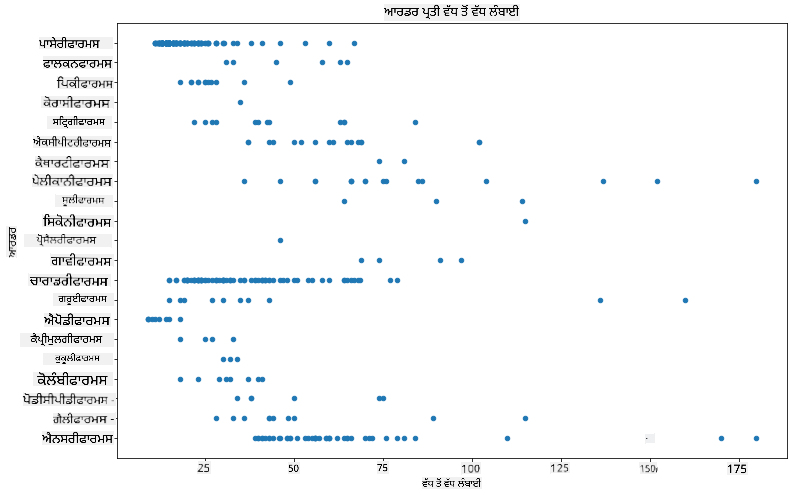
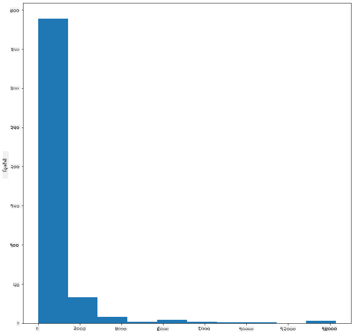
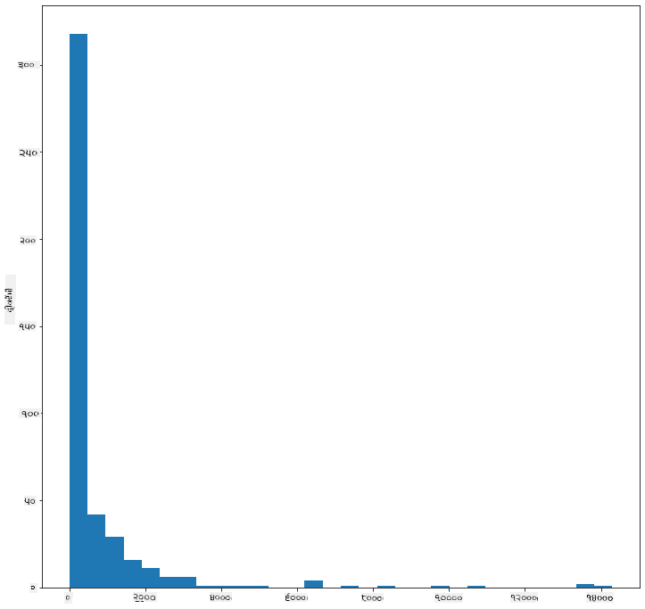
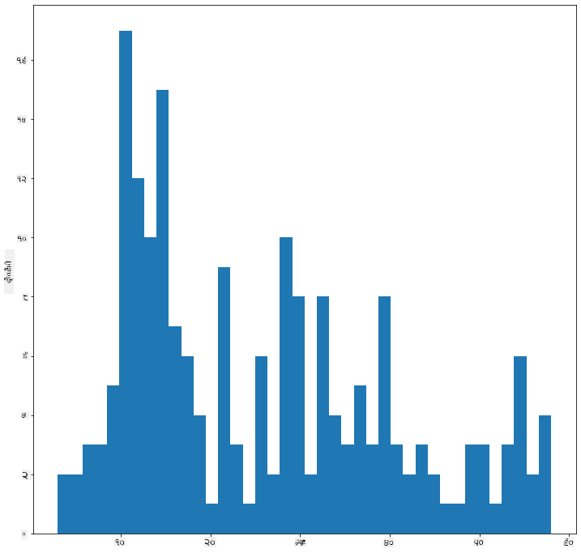
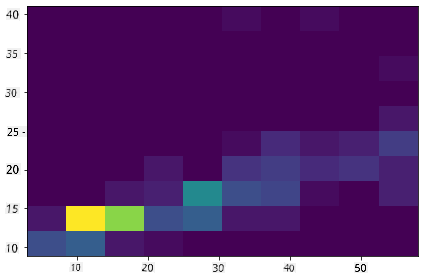
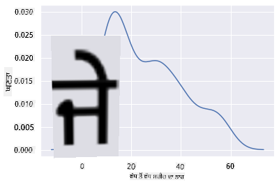

<!--
CO_OP_TRANSLATOR_METADATA:
{
  "original_hash": "02ce904bc1e2bfabb7dc05c25aae375c",
  "translation_date": "2025-09-04T17:29:16+00:00",
  "source_file": "3-Data-Visualization/10-visualization-distributions/README.md",
  "language_code": "pa"
}
-->
# ਵੰਡਾਂ ਨੂੰ ਵਿਖਾਉਣਾ

|![ [(@sketchthedocs)] ਦੁਆਰਾ ਬਣਾਈ ਗਈ ਸਕੈਚਨੋਟ](https://sketchthedocs.dev) ](../../sketchnotes/10-Visualizing-Distributions.png)|
|:---:|
| ਵੰਡਾਂ ਨੂੰ ਵਿਖਾਉਣਾ - _[@nitya](https://twitter.com/nitya) ਦੁਆਰਾ ਸਕੈਚਨੋਟ_ |

ਪਿਛਲੇ ਪਾਠ ਵਿੱਚ, ਤੁਸੀਂ ਮਿਨੇਸੋਟਾ ਦੇ ਪੰਛੀਆਂ ਦੇ ਡਾਟਾਸੈਟ ਬਾਰੇ ਕੁਝ ਦਿਲਚਸਪ ਤੱਥ ਸਿੱਖੇ। ਤੁਸੀਂ ਆਉਟਲਾਇਰਜ਼ ਨੂੰ ਵਿਖਾਉਣ ਦੁਆਰਾ ਕੁਝ ਗਲਤ ਡਾਟਾ ਲੱਭਿਆ ਅਤੇ ਪੰਛੀ ਸ਼੍ਰੇਣੀਆਂ ਦੇ ਵੱਧ ਤੋਂ ਵੱਧ ਲੰਬਾਈ ਦੇ ਅੰਤਰਾਂ ਨੂੰ ਦੇਖਿਆ।

## [ਪ੍ਰੀ-ਲੈਕਚਰ ਕਵਿਜ਼](https://purple-hill-04aebfb03.1.azurestaticapps.net/quiz/18)
## ਪੰਛੀਆਂ ਦੇ ਡਾਟਾਸੈਟ ਦੀ ਖੋਜ ਕਰੋ

ਡਾਟਾ ਵਿੱਚ ਖੋਜ ਕਰਨ ਦਾ ਇੱਕ ਹੋਰ ਤਰੀਕਾ ਇਸ ਦੀ ਵੰਡ ਦੇਖਣਾ ਹੈ, ਜਾਂ ਡਾਟਾ ਕਿਸੇ ਅਕਸ ਦੇ ਨਾਲ ਕਿਵੇਂ ਸੰਗਠਿਤ ਹੈ। ਸ਼ਾਇਦ, ਉਦਾਹਰਣ ਲਈ, ਤੁਸੀਂ ਮਿਨੇਸੋਟਾ ਦੇ ਪੰਛੀਆਂ ਲਈ ਵੱਧ ਤੋਂ ਵੱਧ ਪੰਖਾਂ ਦੇ ਫੈਲਾਅ ਜਾਂ ਵੱਧ ਤੋਂ ਵੱਧ ਸਰੀਰ ਦੇ ਭਾਰ ਦੀ ਆਮ ਵੰਡ ਬਾਰੇ ਸਿੱਖਣਾ ਚਾਹੁੰਦੇ ਹੋ। 

ਆਓ ਇਸ ਡਾਟਾਸੈਟ ਵਿੱਚ ਡਾਟਾ ਦੀਆਂ ਵੰਡਾਂ ਬਾਰੇ ਕੁਝ ਤੱਥ ਪਤਾ ਕਰੀਏ। ਇਸ ਪਾਠ ਫੋਲਡਰ ਦੇ ਰੂਟ ਵਿੱਚ _notebook.ipynb_ ਫਾਈਲ ਵਿੱਚ Pandas, Matplotlib, ਅਤੇ ਆਪਣਾ ਡਾਟਾ ਇੰਪੋਰਟ ਕਰੋ:

```python
import pandas as pd
import matplotlib.pyplot as plt
birds = pd.read_csv('../../data/birds.csv')
birds.head()
```

|      | ਨਾਮ                          | ਵਿਗਿਆਨਕ ਨਾਮ           | ਸ਼੍ਰੇਣੀ               | ਕ੍ਰਮ         | ਪਰਿਵਾਰ  | ਜਨਸ        | ਸੰਰਕਸ਼ਣ ਸਥਿਤੀ       | ਘੱਟੋ-ਘੱਟ ਲੰਬਾਈ | ਵੱਧ ਤੋਂ ਵੱਧ ਲੰਬਾਈ | ਘੱਟੋ-ਘੱਟ ਸਰੀਰ ਭਾਰ | ਵੱਧ ਤੋਂ ਵੱਧ ਸਰੀਰ ਭਾਰ | ਘੱਟੋ-ਘੱਟ ਪੰਖਾਂ ਦਾ ਫੈਲਾਅ | ਵੱਧ ਤੋਂ ਵੱਧ ਪੰਖਾਂ ਦਾ ਫੈਲਾਅ |
| ---: | :--------------------------- | :--------------------- | :-------------------- | :----------- | :------- | :---------- | :----------------- | --------: | --------: | ----------: | ----------: | ----------: | ----------: |
|    0 | ਕਾਲੇ ਪੇਟ ਵਾਲਾ ਵਿਸਲਿੰਗ-ਡੱਕ    | Dendrocygna autumnalis | ਬਤਖਾਂ/ਹੰਸ/ਜਲ ਪੰਛੀ    | Anseriformes | Anatidae | Dendrocygna | LC                 |        47 |        56 |         652 |        1020 |          76 |          94 |
|    1 | ਫੁਲਵਸ ਵਿਸਲਿੰਗ-ਡੱਕ           | Dendrocygna bicolor    | ਬਤਖਾਂ/ਹੰਸ/ਜਲ ਪੰਛੀ    | Anseriformes | Anatidae | Dendrocygna | LC                 |        45 |        53 |         712 |        1050 |          85 |          93 |
|    2 | ਸਨੋ ਗੂਸ                     | Anser caerulescens     | ਬਤਖਾਂ/ਹੰਸ/ਜਲ ਪੰਛੀ    | Anseriformes | Anatidae | Anser       | LC                 |        64 |        79 |        2050 |        4050 |         135 |         165 |
|    3 | ਰੌਸ ਦਾ ਗੂਸ                  | Anser rossii           | ਬਤਖਾਂ/ਹੰਸ/ਜਲ ਪੰਛੀ    | Anseriformes | Anatidae | Anser       | LC                 |      57.3 |        64 |        1066 |        1567 |         113 |         116 |
|    4 | ਵੱਡਾ ਵ੍ਹਾਈਟ-ਫਰੰਟਡ ਗੂਸ      | Anser albifrons        | ਬਤਖਾਂ/ਹੰਸ/ਜਲ ਪੰਛੀ    | Anseriformes | Anatidae | Anser       | LC                 |        64 |        81 |        1930 |        3310 |         130 |         165 |

ਆਮ ਤੌਰ 'ਤੇ, ਤੁਸੀਂ ਡਾਟਾ ਦੀ ਵੰਡ ਨੂੰ ਛੇਤੀ ਨਾਲ ਸਕੈਟਰ ਪਲਾਟ ਦੀ ਵਰਤੋਂ ਕਰਕੇ ਦੇਖ ਸਕਦੇ ਹੋ, ਜਿਵੇਂ ਕਿ ਅਸੀਂ ਪਿਛਲੇ ਪਾਠ ਵਿੱਚ ਕੀਤਾ ਸੀ:

```python
birds.plot(kind='scatter',x='MaxLength',y='Order',figsize=(12,8))

plt.title('Max Length per Order')
plt.ylabel('Order')
plt.xlabel('Max Length')

plt.show()
```


ਇਹ ਪੰਛੀ ਦੇ ਕ੍ਰਮ ਪ੍ਰਤੀ ਸਰੀਰ ਦੀ ਲੰਬਾਈ ਦੀ ਆਮ ਵੰਡ ਦਾ ਝਲਕ ਦਿੰਦਾ ਹੈ, ਪਰ ਇਹ ਸੱਚੀ ਵੰਡਾਂ ਨੂੰ ਵਿਖਾਉਣ ਦਾ ਵਧੀਆ ਤਰੀਕਾ ਨਹੀਂ ਹੈ। ਇਹ ਕੰਮ ਆਮ ਤੌਰ 'ਤੇ ਹਿਸਟੋਗ੍ਰਾਮ ਬਣਾਉਣ ਦੁਆਰਾ ਕੀਤਾ ਜਾਂਦਾ ਹੈ।
## ਹਿਸਟੋਗ੍ਰਾਮ ਨਾਲ ਕੰਮ ਕਰਨਾ

Matplotlib ਹਿਸਟੋਗ੍ਰਾਮ ਦੀ ਵਰਤੋਂ ਕਰਕੇ ਡਾਟਾ ਵੰਡ ਨੂੰ ਵਿਖਾਉਣ ਦੇ ਬਹੁਤ ਵਧੀਆ ਤਰੀਕੇ ਪੇਸ਼ ਕਰਦਾ ਹੈ। ਇਸ ਕਿਸਮ ਦਾ ਚਾਰਟ ਇੱਕ ਬਾਰ ਚਾਰਟ ਵਾਂਗ ਹੁੰਦਾ ਹੈ ਜਿੱਥੇ ਵੰਡ ਬਾਰਾਂ ਦੇ ਉਤਾਰ-ਚੜ੍ਹਾਅ ਦੁਆਰਾ ਦੇਖੀ ਜਾ ਸਕਦੀ ਹੈ। ਹਿਸਟੋਗ੍ਰਾਮ ਬਣਾਉਣ ਲਈ, ਤੁਹਾਨੂੰ ਸੰਖਿਆਵਾਂ ਵਾਲੇ ਡਾਟਾ ਦੀ ਲੋੜ ਹੁੰਦੀ ਹੈ। ਹਿਸਟੋਗ੍ਰਾਮ ਬਣਾਉਣ ਲਈ, ਤੁਸੀਂ ਚਾਰਟ ਨੂੰ 'hist' ਕਿਸਮ ਦੇ ਰੂਪ ਵਿੱਚ ਪਰਿਭਾਸ਼ਿਤ ਕਰਕੇ ਪਲਾਟ ਕਰ ਸਕਦੇ ਹੋ। ਇਹ ਚਾਰਟ ਪੂਰੇ ਡਾਟਾਸੈਟ ਦੇ ਸੰਖਿਆਵਾਂ ਵਾਲੇ ਡਾਟਾ ਦੀ ਵੰਡ ਨੂੰ ਵਿਖਾਉਂਦਾ ਹੈ। ਡਾਟਾ ਦੇ ਐਰੇ ਨੂੰ ਛੋਟੇ ਬਿਨਾਂ ਵਿੱਚ ਵੰਡ ਕੇ, ਇਹ ਡਾਟਾ ਦੇ ਮੁੱਲਾਂ ਦੀ ਵੰਡ ਨੂੰ ਵਿਖਾਉਣ ਦੇ ਯੋਗ ਹੈ:

```python
birds['MaxBodyMass'].plot(kind = 'hist', bins = 10, figsize = (12,12))
plt.show()
```


ਜਿਵੇਂ ਤੁਸੀਂ ਦੇਖ ਸਕਦੇ ਹੋ, ਇਸ ਡਾਟਾਸੈਟ ਵਿੱਚ ਜ਼ਿਆਦਾਤਰ 400+ ਪੰਛੀ ਆਪਣੇ ਵੱਧ ਤੋਂ ਵੱਧ ਸਰੀਰ ਭਾਰ ਲਈ 2000 ਤੋਂ ਘੱਟ ਦੀ ਸ਼੍ਰੇਣੀ ਵਿੱਚ ਆਉਂਦੇ ਹਨ। ਡਾਟਾ ਬਾਰੇ ਹੋਰ ਜਾਣਕਾਰੀ ਪ੍ਰਾਪਤ ਕਰਨ ਲਈ `bins` ਪੈਰਾਮੀਟਰ ਨੂੰ ਵਧੇਰੇ ਸੰਖਿਆ ਵਿੱਚ ਬਦਲੋ, ਕੁਝ 30 ਵਰਗਾ:

```python
birds['MaxBodyMass'].plot(kind = 'hist', bins = 30, figsize = (12,12))
plt.show()
```


ਇਹ ਚਾਰਟ ਵੰਡ ਨੂੰ ਥੋੜ੍ਹਾ ਹੋਰ ਵਿਸਤ੍ਰਿਤ ਢੰਗ ਨਾਲ ਵਿਖਾਉਂਦਾ ਹੈ। ਇੱਕ ਚਾਰਟ ਜੋ ਖੱਬੇ ਪਾਸੇ ਘੱਟ ਝੁਕਿਆ ਹੋਵੇ, ਉਸ ਨੂੰ ਬਣਾਇਆ ਜਾ ਸਕਦਾ ਹੈ ਜੇਕਰ ਤੁਸੀਂ ਸਿਰਫ਼ ਦਿੱਤੀ ਗਈ ਸ਼੍ਰੇਣੀ ਦੇ ਅੰਦਰ ਡਾਟਾ ਚੁਣੋ:

ਆਪਣੇ ਡਾਟਾ ਨੂੰ ਫਿਲਟਰ ਕਰੋ ਤਾਂ ਜੋ ਸਿਰਫ਼ ਉਹ ਪੰਛੀ ਮਿਲਣ ਜਿਨ੍ਹਾਂ ਦਾ ਸਰੀਰ ਭਾਰ 60 ਤੋਂ ਘੱਟ ਹੈ, ਅਤੇ 40 `bins` ਵਿਖਾਓ:

```python
filteredBirds = birds[(birds['MaxBodyMass'] > 1) & (birds['MaxBodyMass'] < 60)]      
filteredBirds['MaxBodyMass'].plot(kind = 'hist',bins = 40,figsize = (12,12))
plt.show()     
```


✅ ਕੁਝ ਹੋਰ ਫਿਲਟਰ ਅਤੇ ਡਾਟਾ ਪੌਇੰਟ ਦੀ ਕੋਸ਼ਿਸ਼ ਕਰੋ। ਡਾਟਾ ਦੀ ਪੂਰੀ ਵੰਡ ਨੂੰ ਦੇਖਣ ਲਈ, `['MaxBodyMass']` ਫਿਲਟਰ ਨੂੰ ਹਟਾਓ ਤਾਂ ਜੋ ਲੇਬਲ ਕੀਤੀਆਂ ਵੰਡਾਂ ਨੂੰ ਵਿਖਾਇਆ ਜਾ ਸਕੇ।

ਹਿਸਟੋਗ੍ਰਾਮ ਕੁਝ ਵਧੀਆ ਰੰਗ ਅਤੇ ਲੇਬਲਿੰਗ ਸੁਧਾਰਾਂ ਦੀ ਪੇਸ਼ਕਸ਼ ਕਰਦਾ ਹੈ:

ਦੋ ਵੰਡਾਂ ਦੇ ਰਿਸ਼ਤੇ ਦੀ ਤੁਲਨਾ ਕਰਨ ਲਈ ਇੱਕ 2D ਹਿਸਟੋਗ੍ਰਾਮ ਬਣਾਓ। ਆਓ `MaxBodyMass` ਅਤੇ `MaxLength` ਦੀ ਤੁਲਨਾ ਕਰੀਏ। Matplotlib ਇੱਕ ਬਣੇ-ਬਨਾਏ ਤਰੀਕੇ ਦੀ ਪੇਸ਼ਕਸ਼ ਕਰਦਾ ਹੈ ਜੋ ਚਮਕਦਾਰ ਰੰਗਾਂ ਦੀ ਵਰਤੋਂ ਕਰਕੇ ਸੰਮਿਲਨ ਨੂੰ ਵਿਖਾਉਂਦਾ ਹੈ:

```python
x = filteredBirds['MaxBodyMass']
y = filteredBirds['MaxLength']

fig, ax = plt.subplots(tight_layout=True)
hist = ax.hist2d(x, y)
```
ਇਹ ਦੋ ਤੱਤਾਂ ਦੇ ਵਿਚਕਾਰ ਇੱਕ ਉਮੀਦਵਾਰ ਧੁਰੇ ਦੇ ਨਾਲ ਇੱਕ ਉਮੀਦਵਾਰ ਰਿਸ਼ਤਾ ਦਿਖਾਈ ਦਿੰਦਾ ਹੈ, ਇੱਕ ਖਾਸ ਤੌਰ 'ਤੇ ਮਜ਼ਬੂਤ ਸੰਮਿਲਨ ਬਿੰਦੂ ਦੇ ਨਾਲ:



ਹਿਸਟੋਗ੍ਰਾਮ ਸੰਖਿਆਵਾਂ ਵਾਲੇ ਡਾਟਾ ਲਈ ਮੂਲ ਰੂਪ ਵਿੱਚ ਚੰਗਾ ਕੰਮ ਕਰਦੇ ਹਨ। ਜੇਕਰ ਤੁਹਾਨੂੰ ਟੈਕਸਟ ਡਾਟਾ ਦੇ ਅਨੁਸਾਰ ਵੰਡਾਂ ਦੇਖਣ ਦੀ ਲੋੜ ਹੋਵੇ ਤਾਂ ਕੀ ਹੋਵੇਗਾ? 
## ਟੈਕਸਟ ਡਾਟਾ ਦੀ ਵਰਤੋਂ ਕਰਕੇ ਡਾਟਾਸੈਟ ਲਈ ਵੰਡਾਂ ਦੀ ਖੋਜ ਕਰੋ 

ਇਸ ਡਾਟਾਸੈਟ ਵਿੱਚ ਪੰਛੀ ਦੀ ਸ਼੍ਰੇਣੀ ਅਤੇ ਇਸ ਦੇ ਜਨਸ, ਪ੍ਰਜਾਤੀ, ਅਤੇ ਪਰਿਵਾਰ ਦੇ ਨਾਲ-साथ ਇਸ ਦੀ ਸੰਰਕਸ਼ਣ ਸਥਿਤੀ ਬਾਰੇ ਚੰਗੀ ਜਾਣਕਾਰੀ ਸ਼ਾਮਲ ਹੈ। ਆਓ ਇਸ ਸੰਰਕਸ਼ਣ ਜਾਣਕਾਰੀ ਵਿੱਚ ਖੋਜ ਕਰੀਏ। ਪੰਛੀਆਂ ਦੀ ਸੰਰਕਸ਼ਣ ਸਥਿਤੀ ਦੇ ਅਨੁਸਾਰ ਵੰਡ ਕੀ ਹੈ?

> ✅ ਡਾਟਾਸੈਟ ਵਿੱਚ, ਸੰਰਕਸ਼ਣ ਸਥਿਤੀ ਨੂੰ ਵੇਖਾਉਣ ਲਈ ਕਈ ਸੰਖੇਪ ਸ਼ਬਦ ਵਰਤੇ ਜਾਂਦੇ ਹਨ। ਇਹ ਸੰਖੇਪ ਸ਼ਬਦ [IUCN Red List Categories](https://www.iucnredlist.org/) ਤੋਂ ਆਉਂਦੇ ਹਨ, ਇੱਕ ਸੰਗਠਨ ਜੋ ਪ੍ਰਜਾਤੀਆਂ ਦੀ ਸਥਿਤੀ ਨੂੰ ਸੂਚੀਬੱਧ ਕਰਦਾ ਹੈ।
> 
> - CR: ਗੰਭੀਰ ਤੌਰ 'ਤੇ ਖਤਰੇ ਵਿੱਚ
> - EN: ਖਤਰੇ ਵਿੱਚ
> - EX: ਲੁਪਤ
> - LC: ਘੱਟ ਚਿੰਤਾ
> - NT: ਨਜ਼ਦੀਕੀ ਖਤਰੇ ਵਿੱਚ
> - VU: ਸੰਵੇਦਨਸ਼ੀਲ

ਇਹ ਟੈਕਸਟ-ਅਧਾਰਿਤ ਮੁੱਲ ਹਨ ਇਸ ਲਈ ਤੁਹਾਨੂੰ ਹਿਸਟੋਗ੍ਰਾਮ ਬਣਾਉਣ ਲਈ ਇੱਕ ਰੂਪਾਂਤਰ ਕਰਨ ਦੀ ਲੋੜ ਹੋਵੇਗੀ। FilteredBirds ਡਾਟਾਫਰੇਮ ਦੀ ਵਰਤੋਂ ਕਰਕੇ, ਇਸ ਦੀ ਸੰਰਕਸ਼ਣ ਸਥਿਤੀ ਨੂੰ ਘੱਟੋ-ਘੱਟ ਪੰਖਾਂ ਦੇ ਫੈਲਾਅ ਦੇ ਨਾਲ ਵਿਖਾਓ। ਤੁਸੀਂ ਕੀ ਦੇਖਦੇ ਹੋ? 

```python
x1 = filteredBirds.loc[filteredBirds.ConservationStatus=='EX', 'MinWingspan']
x2 = filteredBirds.loc[filteredBirds.ConservationStatus=='CR', 'MinWingspan']
x3 = filteredBirds.loc[filteredBirds.ConservationStatus=='EN', 'MinWingspan']
x4 = filteredBirds.loc[filteredBirds.ConservationStatus=='NT', 'MinWingspan']
x5 = filteredBirds.loc[filteredBirds.ConservationStatus=='VU', 'MinWingspan']
x6 = filteredBirds.loc[filteredBirds.ConservationStatus=='LC', 'MinWingspan']

kwargs = dict(alpha=0.5, bins=20)

plt.hist(x1, **kwargs, color='red', label='Extinct')
plt.hist(x2, **kwargs, color='orange', label='Critically Endangered')
plt.hist(x3, **kwargs, color='yellow', label='Endangered')
plt.hist(x4, **kwargs, color='green', label='Near Threatened')
plt.hist(x5, **kwargs, color='blue', label='Vulnerable')
plt.hist(x6, **kwargs, color='gray', label='Least Concern')

plt.gca().set(title='Conservation Status', ylabel='Min Wingspan')
plt.legend();
```


ਘੱਟੋ-ਘੱਟ ਪੰਖਾਂ ਦੇ ਫੈਲਾਅ ਅਤੇ ਸੰਰਕਸ਼ਣ ਸਥਿਤੀ ਦੇ ਵਿਚਕਾਰ ਕੋਈ ਚੰਗਾ ਸੰਬੰਧ ਨਹੀਂ ਲੱਗਦਾ। ਇਸ ਤਰੀਕੇ ਦੀ ਵਰਤੋਂ ਕਰਕੇ ਡਾਟਾਸੈਟ ਦੇ ਹੋਰ ਤੱਤਾਂ ਦੀ ਜਾਂਚ ਕਰੋ। ਤੁਸੀਂ ਵੱਖ-ਵੱਖ ਫਿਲਟਰਾਂ ਦੀ ਕੋਸ਼ਿਸ਼ ਕਰ ਸਕਦੇ ਹੋ। ਕੀ ਤੁਹਾਨੂੰ ਕੋਈ ਸੰਬੰਧ ਮਿਲਦਾ ਹੈ?

## ਡੈਂਸਿਟੀ ਪਲਾਟ

ਤੁਹਾਨੂੰ ਸ਼ਾਇਦ ਧਿਆਨ ਦਿੱਤਾ ਹੋਵੇਗਾ ਕਿ ਅਸੀਂ ਹੁਣ ਤੱਕ ਦੇਖੇ ਹਿਸਟੋਗ੍ਰਾਮ 'ਕਦਮਦਾਰ' ਹਨ ਅਤੇ ਇੱਕ ਆਰਕ ਵਿੱਚ ਸੁਚਾਰੂ ਤੌਰ 'ਤੇ ਨਹੀਂ ਵਹਿੰਦੇ। ਇੱਕ ਹੋਰ ਸੁਚਾਰੂ ਡੈਂਸਿਟੀ ਚਾਰਟ ਵਿਖਾਉਣ ਲਈ, ਤੁਸੀਂ ਡੈਂਸਿਟੀ ਪਲਾਟ ਦੀ ਕੋਸ਼ਿਸ਼ ਕਰ ਸਕਦੇ ਹੋ।

ਡੈਂਸਿਟੀ ਪਲਾਟ ਨਾਲ ਕੰਮ ਕਰਨ ਲਈ, ਇੱਕ ਨਵੀਂ ਪਲਾਟਿੰਗ ਲਾਇਬ੍ਰੇਰੀ, [Seaborn](https://seaborn.pydata.org/generated/seaborn.kdeplot.html) ਨਾਲ ਜਾਣੂ ਹੋਵੋ। 

Seaborn ਨੂੰ ਲੋਡ ਕਰਕੇ, ਇੱਕ ਬੁਨਿਆਦੀ ਡੈਂਸਿਟੀ ਪਲਾਟ ਦੀ ਕੋਸ਼ਿਸ਼ ਕਰੋ:

```python
import seaborn as sns
import matplotlib.pyplot as plt
sns.kdeplot(filteredBirds['MinWingspan'])
plt.show()
```


ਤੁਸੀਂ ਦੇਖ ਸਕਦੇ ਹੋ ਕਿ ਪਲਾਟ ਘੱਟੋ-ਘੱਟ ਪੰਖਾਂ ਦੇ ਫੈਲਾਅ ਡਾਟਾ ਲਈ ਪਿਛਲੇ ਪਲਾਟ ਨੂੰ ਗੂੰਜਦਾ ਹੈ; ਇਹ ਸਿਰਫ਼ ਥੋੜ੍ਹਾ ਹੋਰ ਸੁਚਾਰੂ ਹੈ। Seaborn ਦੀ ਦਸਤਾਵੇਜ਼ੀ ਦੇ ਅਨੁਸਾਰ, "ਹਿਸਟੋਗ੍ਰਾਮ ਦੇ ਮੁਕਾਬਲੇ, KDE ਇੱਕ ਪਲਾਟ ਪੈਦਾ ਕਰ ਸਕਦਾ ਹੈ ਜੋ ਘੱਟ ਭਰੇ ਹੋਏ ਅਤੇ ਹੋਰ ਵਿਆਖਿਆਯੋਗ ਹੁੰਦਾ ਹੈ, ਖਾਸ ਕਰਕੇ ਜਦੋਂ ਕਈ ਵੰਡਾਂ ਖਿੱਚੀਆਂ ਜਾਂਦੀਆਂ ਹਨ। ਪਰ ਇਹ ਵਿਪਰੀਤਾਂ ਪੈਦਾ ਕਰਨ ਦੀ ਸੰਭਾਵਨਾ ਰੱਖਦਾ ਹੈ ਜੇਕਰ ਅਧਾਰਤ ਵੰਡ ਬਾਊਂਡਡ ਜਾਂ ਸੁਚਾਰੂ ਨਾ ਹੋਵੇ। ਇੱਕ ਹਿਸਟੋਗ੍ਰਾਮ ਵਾਂਗ, ਪ੍ਰਸਤੁਤੀ ਦੀ ਗੁਣਵੱਤਾ ਵੀ ਚੰਗੇ ਸੁਚਾਰੂ ਪੈਰਾਮੀਟਰਾਂ ਦੀ ਚੋਣ 'ਤੇ ਨਿਰਭਰ ਕਰਦੀ ਹੈ।" [source](https://seaborn.pydata.org/generated/seaborn.kdeplot.html) ਦੂਜੇ ਸ਼ਬਦਾਂ ਵਿੱਚ, ਆਉਟਲਾਇਰਜ਼ ਹਮੇਸ਼ਾ ਤੁਹਾਡੇ ਚਾਰਟਾਂ ਨੂੰ ਖਰਾਬ ਬਣਾਉਣਗੇ।

ਜੇਕਰ ਤੁਸੀਂ ਦੂਜੇ ਚਾਰਟ ਵਿੱਚ ਬਣਾਈ ਗਈ ਜੱਗਡ MaxBodyMass ਲਾਈਨ ਨੂੰ ਦੁਬਾਰਾ ਦੇਖਣਾ ਚਾਹੁੰਦੇ ਹੋ, ਤਾਂ ਤੁਸੀਂ ਇਸ ਤਰੀਕੇ ਦੀ ਵਰਤੋਂ ਕਰਕੇ ਇਸਨੂੰ ਬਹੁਤ ਚੰਗੀ ਤਰ੍ਹਾਂ ਸੁਚਾਰੂ ਕਰ ਸਕਦੇ ਹੋ:

```python
sns.kdeplot(filteredBirds['MaxBodyMass'])
plt.show()
```


ਜੇਕਰ ਤੁਸੀਂ ਇੱਕ ਸੁਚਾਰੂ, ਪਰ ਬਹੁਤ ਜ਼ਿਆਦਾ ਸੁਚਾਰੂ ਲਾਈਨ ਨਹੀਂ ਚਾਹੁੰਦੇ, ਤਾਂ `bw_adjust` ਪੈਰਾਮੀਟਰ ਨੂੰ ਸੋਧੋ: 

```python
sns.kdeplot(filteredBirds['MaxBodyMass'], bw_adjust=.2)
plt.show()
```


✅ ਇਸ ਕਿਸਮ ਦੇ ਪਲਾਟ ਲਈ ਉਪਲਬਧ ਪੈਰਾਮੀਟਰਾਂ ਬਾਰੇ ਪੜ੍ਹੋ ਅਤੇ ਪ੍ਰਯੋਗ ਕਰੋ!

ਇਸ ਕਿਸਮ ਦਾ ਚਾਰਟ ਸੁੰਦਰ ਤਰੀਕੇ ਨਾਲ ਵਿਆਖਿਆਯੋਗ ਵਿਜ਼ੁਅਲਾਈਜ਼ੇਸ਼ਨ ਪੇਸ਼ ਕਰਦਾ ਹੈ। ਉਦਾਹਰਣ ਲਈ, ਕੁਝ ਲਾਈਨਾਂ ਦੇ ਕੋਡ ਨਾਲ, ਤੁਸੀਂ ਪੰਛੀ ਦੇ ਕ੍ਰਮ ਪ੍ਰਤੀ ਵੱਧ ਤੋਂ ਵੱਧ ਸਰੀਰ ਭਾਰ ਡੈਂਸਿਟੀ ਵਿਖਾ ਸਕਦੇ ਹੋ:

```python
sns.kdeplot(
   data=filteredBirds, x="MaxBodyMass", hue="Order",
   fill=True, common_norm=False, palette="crest",
   alpha=.5, linewidth=0,
)
```


ਤੁਸੀਂ ਇੱਕ ਚਾਰਟ ਵਿੱਚ ਕਈ ਵੈਰੀਏਬਲਾਂ ਦੀ ਡੈਂਸਿਟੀ ਨੂੰ ਵੀ ਮੈਪ ਕਰ ਸਕਦੇ ਹੋ। ਪੰਛੀ ਦੀ ਵੱਧ ਤੋਂ ਵੱਧ ਲੰਬਾਈ ਅਤੇ ਘੱਟੋ-ਘੱਟ ਲੰਬਾਈ ਦੀ ਸੰਰਕਸ਼ਣ ਸਥਿਤੀ ਦੇ ਮੁਕਾਬਲੇ ਜਾਂਚ ਕਰੋ:

```python
sns.kdeplot(data=filteredBirds, x="MinLength", y="MaxLength", hue="ConservationStatus")
```


ਸ਼ਾਇਦ ਇਹ ਖੋਜ ਕਰਨ ਯੋਗ ਹੈ ਕਿ 'ਸੰਵੇਦਨਸ਼ੀਲ' ਪੰਛੀਆਂ ਦੀ ਲੰਬਾਈ ਦੇ ਅਨੁਸਾਰ ਕਲਸਟਰ ਮਹੱਤਵਪੂਰਨ ਹੈ ਜਾਂ ਨਹੀਂ।

## 🚀 ਚੁਣੌਤੀ

ਹਿਸਟੋਗ੍ਰਾਮ ਬੁਨਿਆਦੀ ਸਕੈਟਰਪਲਾਟ, ਬਾਰ ਚਾਰਟ, ਜਾਂ ਲਾਈਨ ਚਾਰਟ ਦੇ ਮੁਕਾਬਲੇ ਇੱਕ ਹੋਰ ਸੁਧਾਰਤ ਕਿਸਮ ਦੇ ਚਾਰਟ ਹਨ। ਇੰਟਰਨੈਟ 'ਤੇ ਚੰਗੇ ਹਿਸਟੋਗ੍ਰਾਮ ਦੇ ਉਦਾਹਰਣ ਲੱਭਣ ਲਈ ਖੋਜ ਕਰੋ। ਇਹ ਕਿਵੇਂ ਵਰਤੇ ਜਾਂਦੇ ਹਨ, ਇਹ ਕੀ ਦਰਸਾਉਂਦੇ ਹਨ, ਅਤੇ ਇਹ ਕਿਹੜੇ ਖੇਤਰਾਂ ਜਾਂ ਖੋਜ ਦੇ ਖੇਤਰਾਂ ਵਿੱਚ ਵਰਤੇ ਜਾਂਦੇ ਹਨ?

## [ਪੋਸਟ-ਲੈਕਚਰ ਕਵਿਜ਼](https://ff-quizzes.netlify.app/en/ds/)

## ਸਮੀਖਿਆ ਅਤੇ ਸਵੈ ਅਧਿਐਨ

ਇਸ ਪਾਠ ਵਿੱਚ, ਤੁਸੀਂ Matplotlib ਦੀ ਵਰਤੋਂ ਕੀਤੀ ਅਤੇ ਹੋਰ ਸੁਧਾਰਤ ਚਾਰਟ ਦਿਖਾਉਣ ਲਈ Seaborn ਨਾਲ ਕੰਮ ਕਰਨਾ ਸ਼ੁਰੂ ਕੀਤਾ। Seaborn ਵਿੱਚ `kdeplot`, ਇੱਕ "ਇੱਕ ਜਾਂ ਕਈ ਮਾਪਾਂ ਵਿੱਚ ਲਗਾਤਾਰ ਸੰਭਾਵਨਾ ਡੈਂਸਿਟ

---

**ਅਸਵੀਕਾਰਨਾ**:  
ਇਹ ਦਸਤਾਵੇਜ਼ AI ਅਨੁਵਾਦ ਸੇਵਾ [Co-op Translator](https://github.com/Azure/co-op-translator) ਦੀ ਵਰਤੋਂ ਕਰਕੇ ਅਨੁਵਾਦ ਕੀਤਾ ਗਿਆ ਹੈ। ਜਦੋਂ ਕਿ ਅਸੀਂ ਸਹੀਤਾ ਲਈ ਯਤਨਸ਼ੀਲ ਹਾਂ, ਕਿਰਪਾ ਕਰਕੇ ਧਿਆਨ ਦਿਓ ਕਿ ਸਵੈਚਾਲਿਤ ਅਨੁਵਾਦਾਂ ਵਿੱਚ ਗਲਤੀਆਂ ਜਾਂ ਅਸੁਚੀਤਤਾਵਾਂ ਹੋ ਸਕਦੀਆਂ ਹਨ। ਮੂਲ ਦਸਤਾਵੇਜ਼ ਨੂੰ ਇਸਦੀ ਮੂਲ ਭਾਸ਼ਾ ਵਿੱਚ ਅਧਿਕਾਰਤ ਸਰੋਤ ਮੰਨਿਆ ਜਾਣਾ ਚਾਹੀਦਾ ਹੈ। ਮਹੱਤਵਪੂਰਨ ਜਾਣਕਾਰੀ ਲਈ, ਪੇਸ਼ੇਵਰ ਮਨੁੱਖੀ ਅਨੁਵਾਦ ਦੀ ਸਿਫਾਰਸ਼ ਕੀਤੀ ਜਾਂਦੀ ਹੈ। ਇਸ ਅਨੁਵਾਦ ਦੀ ਵਰਤੋਂ ਤੋਂ ਪੈਦਾ ਹੋਣ ਵਾਲੇ ਕਿਸੇ ਵੀ ਗਲਤਫਹਿਮੀ ਜਾਂ ਗਲਤ ਵਿਆਖਿਆ ਲਈ ਅਸੀਂ ਜ਼ਿੰਮੇਵਾਰ ਨਹੀਂ ਹਾਂ।