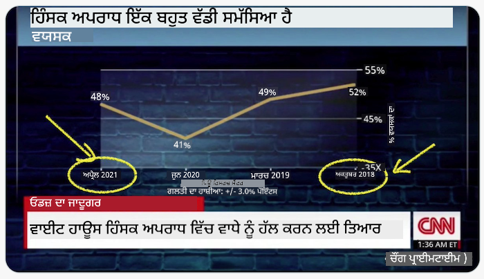
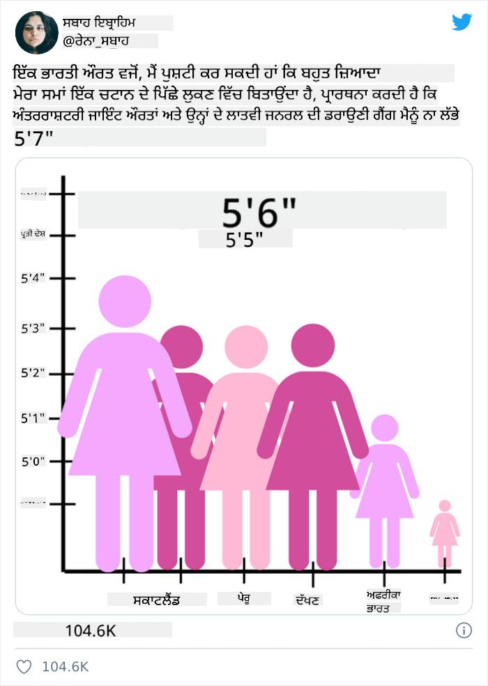

<!--
CO_OP_TRANSLATOR_METADATA:
{
  "original_hash": "0b380bb6d34102bb061eb41de23d9834",
  "translation_date": "2025-09-04T17:27:51+00:00",
  "source_file": "3-Data-Visualization/13-meaningful-visualizations/README.md",
  "language_code": "pa"
}
-->
# ਮਾਨਵਪ੍ਰਦ ਦ੍ਰਿਸ਼ਾਵਲੀਆਂ ਬਣਾਉਣਾ

|![ [(@sketchthedocs)] ਦੁਆਰਾ ਬਣਾਈ ਗਈ ਸਕੈਚਨੋਟ](https://sketchthedocs.dev) ](../../sketchnotes/13-MeaningfulViz.png)|
|:---:|
| ਮਾਨਵਪ੍ਰਦ ਦ੍ਰਿਸ਼ਾਵਲੀਆਂ - _[@nitya](https://twitter.com/nitya) ਦੁਆਰਾ ਬਣਾਈ ਗਈ ਸਕੈਚਨੋਟ_ |

> "ਜੇ ਤੁਸੀਂ ਡਾਟਾ ਨੂੰ ਕਾਫ਼ੀ ਸਮੇਂ ਤੱਕ ਤੰਗ ਕਰੋ, ਤਾਂ ਇਹ ਕੁਝ ਵੀ ਸਵੀਕਾਰ ਕਰ ਲਵੇਗਾ" -- [ਰੋਨਾਲਡ ਕੋਜ਼](https://en.wikiquote.org/wiki/Ronald_Coase)

ਡਾਟਾ ਵਿਗਿਆਨੀਆਂ ਦੀ ਇੱਕ ਮੁੱਖ ਕੌਸ਼ਲ ਇਹ ਹੈ ਕਿ ਉਹ ਅਜਿਹੀ ਦ੍ਰਿਸ਼ਾਵਲੀ ਬਣਾਉਣ ਦੀ ਯੋਗਤਾ ਰੱਖਦੇ ਹਨ ਜੋ ਸਵਾਲਾਂ ਦੇ ਜਵਾਬ ਦੇਣ ਵਿੱਚ ਮਦਦ ਕਰਦੀ ਹੈ। ਡਾਟਾ ਨੂੰ ਦ੍ਰਿਸ਼ਾਵਲ ਕਰਨ ਤੋਂ ਪਹਿਲਾਂ, ਤੁਹਾਨੂੰ ਇਹ ਯਕੀਨੀ ਬਣਾਉਣਾ ਪਵੇਗਾ ਕਿ ਇਹ ਸਾਫ਼ ਅਤੇ ਤਿਆਰ ਕੀਤਾ ਗਿਆ ਹੈ, ਜਿਵੇਂ ਕਿ ਤੁਸੀਂ ਪਿਛਲੇ ਪਾਠਾਂ ਵਿੱਚ ਕੀਤਾ। ਇਸ ਤੋਂ ਬਾਅਦ, ਤੁਸੀਂ ਇਹ ਫੈਸਲਾ ਕਰ ਸਕਦੇ ਹੋ ਕਿ ਡਾਟਾ ਨੂੰ ਕਿਵੇਂ ਪੇਸ਼ ਕਰਨਾ ਹੈ।

ਇਸ ਪਾਠ ਵਿੱਚ, ਤੁਸੀਂ ਸਮੀਖਿਆ ਕਰੋਗੇ:

1. ਸਹੀ ਚਾਰਟ ਕਿਸਮ ਕਿਵੇਂ ਚੁਣੀ ਜਾਵੇ
2. ਧੋਖੇਬਾਜ਼ ਚਾਰਟਿੰਗ ਤੋਂ ਕਿਵੇਂ ਬਚਿਆ ਜਾਵੇ
3. ਰੰਗਾਂ ਨਾਲ ਕਿਵੇਂ ਕੰਮ ਕੀਤਾ ਜਾਵੇ
4. ਪੜ੍ਹਨਯੋਗਤਾ ਲਈ ਚਾਰਟਾਂ ਨੂੰ ਕਿਵੇਂ ਸਟਾਈਲ ਕੀਤਾ ਜਾਵੇ
5. ਐਨੀਮੇਟਡ ਜਾਂ 3D ਚਾਰਟਿੰਗ ਹੱਲ ਕਿਵੇਂ ਬਣਾਏ ਜਾਵਨ
6. ਰਚਨਾਤਮਕ ਦ੍ਰਿਸ਼ਾਵਲੀ ਕਿਵੇਂ ਬਣਾਈ ਜਾਵੇ

## [ਪ੍ਰੀ-ਪਾਠ ਕਵਿਜ਼](https://purple-hill-04aebfb03.1.azurestaticapps.net/quiz/24)

## ਸਹੀ ਚਾਰਟ ਕਿਸਮ ਚੁਣੋ

ਪਿਛਲੇ ਪਾਠਾਂ ਵਿੱਚ, ਤੁਸੀਂ Matplotlib ਅਤੇ Seaborn ਵਰਗੇ ਚਾਰਟਿੰਗ ਟੂਲਾਂ ਦੀ ਵਰਤੋਂ ਕਰਕੇ ਵੱਖ-ਵੱਖ ਦ੍ਰਿਸ਼ਾਵਲੀਆਂ ਬਣਾਉਣ ਦਾ ਅਨੁਭਵ ਕੀਤਾ। ਆਮ ਤੌਰ 'ਤੇ, ਤੁਸੀਂ [ਸਹੀ ਚਾਰਟ](https://chartio.com/learn/charts/how-to-select-a-data-vizualization/) ਦੀ ਚੋਣ ਇਸ ਟੇਬਲ ਦੀ ਮਦਦ ਨਾਲ ਕਰ ਸਕਦੇ ਹੋ:

| ਤੁਹਾਨੂੰ ਇਹ ਕਰਨ ਦੀ ਲੋੜ ਹੈ: | ਤੁਸੀਂ ਇਹ ਵਰਤੋ:                 |
| -------------------------- | ------------------------------- |
| ਸਮੇਂ ਦੇ ਨਾਲ ਡਾਟਾ ਰੁਝਾਨ ਦਿਖਾਓ | ਲਾਈਨ                            |
| ਸ਼੍ਰੇਣੀਆਂ ਦੀ ਤੁਲਨਾ ਕਰੋ       | ਬਾਰ, ਪਾਈ                        |
| ਕੁੱਲ ਦੀ ਤੁਲਨਾ ਕਰੋ           | ਪਾਈ, ਸਟੈਕਡ ਬਾਰ                |
| ਸੰਬੰਧ ਦਿਖਾਓ               | ਸਕੈਟਰ, ਲਾਈਨ, ਫੈਸਿਟ, ਡੁਅਲ ਲਾਈਨ |
| ਵੰਡ ਦਿਖਾਓ                  | ਸਕੈਟਰ, ਹਿਸਟੋਗ੍ਰਾਮ, ਬਾਕਸ         |
| ਅਨੁਪਾਤ ਦਿਖਾਓ               | ਪਾਈ, ਡੋਨਟ, ਵਾਫਲ                |

> ✅ ਤੁਹਾਡੇ ਡਾਟਾ ਦੇ ਬਣਤਰ ਦੇ ਅਨੁਸਾਰ, ਤੁਹਾਨੂੰ ਇਸਨੂੰ ਟੈਕਸਟ ਤੋਂ ਨੰਬਰਿਕ ਵਿੱਚ ਬਦਲਣ ਦੀ ਲੋੜ ਹੋ ਸਕਦੀ ਹੈ ਤਾਂ ਜੋ ਚਾਰਟ ਇਸਨੂੰ ਸਹਾਰ ਸਕੇ।

## ਧੋਖੇਬਾਜ਼ੀ ਤੋਂ ਬਚੋ

ਭਾਵੇਂ ਡਾਟਾ ਵਿਗਿਆਨੀ ਸਹੀ ਡਾਟਾ ਲਈ ਸਹੀ ਚਾਰਟ ਦੀ ਚੋਣ ਕਰਨ ਵਿੱਚ ਸਾਵਧਾਨ ਹੋਵੇ, ਡਾਟਾ ਨੂੰ ਅਕਸਰ ਇਸ ਤਰੀਕੇ ਨਾਲ ਪੇਸ਼ ਕੀਤਾ ਜਾ ਸਕਦਾ ਹੈ ਕਿ ਇਹ ਇੱਕ ਨੁਕਤਾ ਸਾਬਤ ਕਰੇ, ਜੋ ਅਕਸਰ ਡਾਟਾ ਨੂੰ ਖਤਮ ਕਰਨ ਦੀ ਕੀਮਤ 'ਤੇ ਹੁੰਦਾ ਹੈ। ਧੋਖੇਬਾਜ਼ ਚਾਰਟਾਂ ਅਤੇ ਇਨਫੋਗ੍ਰਾਫਿਕਸ ਦੇ ਕਈ ਉਦਾਹਰਨ ਹਨ!

> 🎥 ਉੱਪਰ ਦਿੱਤੇ ਚਿੱਤਰ 'ਤੇ ਕਲਿਕ ਕਰੋ ਧੋਖੇਬਾਜ਼ ਚਾਰਟਾਂ ਬਾਰੇ ਕਾਨਫਰੰਸ ਟਾਕ ਲਈ

ਇਹ ਚਾਰਟ X ਅਕਸ ਨੂੰ ਉਲਟਾ ਦਿਖਾਉਂਦਾ ਹੈ ਤਾਂ ਜੋ ਸੱਚ ਦੇ ਵਿਰੁੱਧ ਦਿਖਾਇਆ ਜਾ ਸਕੇ, ਮਿਤੀ ਦੇ ਅਧਾਰ 'ਤੇ:

[ਇਹ ਚਾਰਟ](https://media.firstcoastnews.com/assets/WTLV/images/170ae16f-4643-438f-b689-50d66ca6a8d8/170ae16f-4643-438f-b689-50d66ca6a8d8_1140x641.jpg) ਹੋਰ ਵੀ ਧੋਖੇਬਾਜ਼ ਹੈ, ਕਿਉਂਕਿ ਅੱਖ ਸੱਜੇ ਪਾਸੇ ਖਿੱਚੀ ਜਾਂਦੀ ਹੈ ਇਹ ਨਤੀਜਾ ਕੱਢਣ ਲਈ ਕਿ ਸਮੇਂ ਦੇ ਨਾਲ COVID ਕੇਸਾਂ ਵਿੱਚ ਕਮੀ ਆਈ ਹੈ। ਹਾਲਾਂਕਿ, ਜੇ ਤੁਸੀਂ ਮਿਤੀਆਂ ਨੂੰ ਧਿਆਨ ਨਾਲ ਦੇਖੋ, ਤਾਂ ਤੁਸੀਂ ਪਤਾ ਲਗਾਉਗੇ ਕਿ ਇਹਨਾਂ ਨੂੰ ਧੋਖੇਬਾਜ਼ੀ ਨਾਲ ਹੇਠਾਂ ਵਧਦੇ ਰੁਝਾਨ ਦਿਖਾਉਣ ਲਈ ਦੁਬਾਰਾ ਸਜਾਇਆ ਗਿਆ ਹੈ।

ਇਹ ਮਸ਼ਹੂਰ ਉਦਾਹਰਨ ਰੰਗ ਅਤੇ ਉਲਟੇ Y ਅਕਸ ਦੀ ਵਰਤੋਂ ਕਰਦੀ ਹੈ ਧੋਖੇਬਾਜ਼ੀ ਲਈ: ਬੰਦੂਕ ਮਿਤੀ-ਅਨੁਕੂਲ ਕਾਨੂੰਨ ਪਾਸ ਹੋਣ ਤੋਂ ਬਾਅਦ ਬੰਦੂਕ ਮੌਤਾਂ ਵਿੱਚ ਵਾਧਾ ਹੋਇਆ, ਪਰ ਅੱਖ ਨੂੰ ਧੋਖਾ ਦਿੱਤਾ ਜਾਂਦਾ ਹੈ ਕਿ ਇਸਦਾ ਉਲਟਾ ਸੱਚ ਹੈ:

ਇਹ ਅਜੀਬ ਚਾਰਟ ਦਿਖਾਉਂਦਾ ਹੈ ਕਿ ਅਨੁਪਾਤ ਨੂੰ ਕਿਵੇਂ ਹਾਸਿਆਂ ਵਾਲੇ ਪ੍ਰਭਾਵ ਲਈ ਮੋੜਿਆ ਜਾ ਸਕਦਾ ਹੈ:

ਅਤੁਲਨਾਤਮਕ ਚੀਜ਼ਾਂ ਦੀ ਤੁਲਨਾ ਕਰਨਾ ਇੱਕ ਹੋਰ ਧੋਖੇਬਾਜ਼ ਚਾਲ ਹੈ। [ਇੱਕ ਸ਼ਾਨਦਾਰ ਵੈਬਸਾਈਟ](https://tylervigen.com/spurious-correlations) 'ਸਪੁਰਿਅਸ ਕੋਰਲੇਸ਼ਨ' ਬਾਰੇ 'ਤੱਥ' ਦਿਖਾਉਂਦੀ ਹੈ ਜਿਵੇਂ ਕਿ ਮੈਨ ਵਿੱਚ ਤਲਾਕ ਦੀ ਦਰ ਅਤੇ ਮਾਰਗਰੀਨ ਦੀ ਖਪਤ। ਇੱਕ Reddit ਸਮੂਹ ਵੀ [ਡਾਟਾ ਦੀ ਬਦਸੂਰਤ ਵਰਤੋਂ](https://www.reddit.com/r/dataisugly/top/?t=all) ਨੂੰ ਇਕੱਠਾ ਕਰਦਾ ਹੈ।

ਇਹ ਸਮਝਣਾ ਮਹੱਤਵਪੂਰਨ ਹੈ ਕਿ ਅੱਖ ਨੂੰ ਧੋਖੇਬਾਜ਼ ਚਾਰਟਾਂ ਦੁਆਰਾ ਕਿਵੇਂ ਆਸਾਨੀ ਨਾਲ ਧੋਖਾ ਦਿੱਤਾ ਜਾ ਸਕਦਾ ਹੈ। ਭਾਵੇਂ ਡਾਟਾ ਵਿਗਿਆਨੀ ਦੀ ਨੀਅਤ ਚੰਗੀ ਹੋਵੇ, ਚਾਰਟ ਦੀ ਖਰਾਬ ਕਿਸਮ ਦੀ ਚੋਣ, ਜਿਵੇਂ ਕਿ ਬਹੁਤ ਸਾਰੀਆਂ ਸ਼੍ਰੇਣੀਆਂ ਦਿਖਾਉਣ ਵਾਲਾ ਪਾਈ ਚਾਰਟ, ਧੋਖੇਬਾਜ਼ ਹੋ ਸਕਦਾ ਹੈ।

## ਰੰਗ

ਤੁਸੀਂ ਉੱਪਰ 'ਫਲੋਰੀਡਾ ਗਨ ਵਾਇਲੈਂਸ' ਚਾਰਟ ਵਿੱਚ ਦੇਖਿਆ ਕਿ ਰੰਗ ਚਾਰਟਾਂ ਵਿੱਚ ਇੱਕ ਵਾਧੂ ਅਰਥ ਦੀ ਪਰਤ ਪ੍ਰਦਾਨ ਕਰ ਸਕਦੇ ਹਨ, ਖਾਸ ਕਰਕੇ ਉਹਨਾਂ ਵਿੱਚ ਜੋ Matplotlib ਅਤੇ Seaborn ਵਰਗੇ ਲਾਇਬ੍ਰੇਰੀਆਂ ਦੀ ਵਰਤੋਂ ਕਰਕੇ ਡਿਜ਼ਾਇਨ ਨਹੀਂ ਕੀਤੇ ਗਏ। ਜੇ ਤੁਸੀਂ ਹੱਥੋਂ ਚਾਰਟ ਬਣਾਉਣ ਜਾ ਰਹੇ ਹੋ, ਤਾਂ [ਰੰਗ ਸਿਧਾਂਤ](https://colormatters.com/color-and-design/basic-color-theory) ਦਾ ਕੁਝ ਅਧਿਐਨ ਕਰੋ।

> ✅ ਚਾਰਟਾਂ ਨੂੰ ਡਿਜ਼ਾਇਨ ਕਰਦੇ ਸਮੇਂ, ਇਹ ਯਾਦ ਰੱਖੋ ਕਿ ਪਹੁੰਚਯੋਗਤਾ ਦ੍ਰਿਸ਼ਾਵਲੀ ਦਾ ਇੱਕ ਮਹੱਤਵਪੂਰਨ ਪਹلو ਹੈ। ਤੁਹਾਡੇ ਕੁਝ ਉਪਭੋਗਤਾ ਰੰਗਾਂ ਨੂੰ ਨਹੀਂ ਦੇਖ ਸਕਦੇ - ਕੀ ਤੁਹਾਡਾ ਚਾਰਟ ਵਿਜ਼ੂਅਲ ਅਪੰਗਤਾ ਵਾਲੇ ਉਪਭੋਗਤਾਵਾਂ ਲਈ ਚੰਗਾ ਦਿਖਾਈ ਦਿੰਦਾ ਹੈ?

ਚਾਰਟ ਲਈ ਰੰਗ ਚੁਣਦੇ ਸਮੇਂ ਸਾਵਧਾਨ ਰਹੋ, ਕਿਉਂਕਿ ਰੰਗ ਉਹ ਅਰਥ ਪ੍ਰਦਾਨ ਕਰ ਸਕਦੇ ਹਨ ਜੋ ਤੁਸੀਂ ਨਹੀਂ ਚਾਹੁੰਦੇ। 'ਹਾਈਟ' ਚਾਰਟ ਵਿੱਚ 'ਪਿੰਕ ਲੇਡੀਜ਼' ਇੱਕ ਵਿਸ਼ੇਸ਼ 'ਨਾਰੀਵਾਦੀ' ਅਰਥ ਪ੍ਰਦਾਨ ਕਰਦੇ ਹਨ ਜੋ ਚਾਰਟ ਦੀ ਅਜੀਬਤਾ ਵਿੱਚ ਵਾਧਾ ਕਰਦੇ ਹਨ।

ਜਦੋਂ ਕਿ [ਰੰਗ ਦਾ ਅਰਥ](https://colormatters.com/color-symbolism/the-meanings-of-colors) ਦੁਨੀਆ ਦੇ ਵੱਖ-ਵੱਖ ਹਿੱਸਿਆਂ ਵਿੱਚ ਵੱਖ-ਵੱਖ ਹੋ ਸਕਦਾ ਹੈ, ਅਤੇ ਇਹਨਾਂ ਦੇ ਸ਼ੇਡ ਦੇ ਅਨੁਸਾਰ ਅਰਥ ਵਿੱਚ ਬਦਲਾਅ ਆ ਸਕਦਾ ਹੈ। ਆਮ ਤੌਰ 'ਤੇ, ਰੰਗ ਦੇ ਅਰਥ ਵਿੱਚ ਸ਼ਾਮਲ ਹਨ:

| ਰੰਗ   | ਅਰਥ                 |
| ------ | ------------------- |
| ਲਾਲ    | ਸ਼ਕਤੀ               |
| ਨੀਲਾ   | ਭਰੋਸਾ, ਵਫ਼ਾਦਾਰੀ    |
| ਪੀਲਾ   | ਖੁਸ਼ੀ, ਸਾਵਧਾਨੀ      |
| ਹਰਾ    | ਪਰਿਆਵਰਣ, ਕਿਸਮਤ, ਈਰਖਾ |
| ਜਾਮਨੀ  | ਖੁਸ਼ੀ               |
| ਸੰਤਰੀ | ਚਮਕਦਾਰ             |

ਜੇ ਤੁਹਾਨੂੰ ਕਸਟਮ ਰੰਗਾਂ ਨਾਲ ਚਾਰਟ ਬਣਾਉਣ ਲਈ ਕਿਹਾ ਜਾਂਦਾ ਹੈ, ਤਾਂ ਇਹ ਯਕੀਨੀ ਬਣਾਓ ਕਿ ਤੁਹਾਡੇ ਚਾਰਟ ਪਹੁੰਚਯੋਗ ਹਨ ਅਤੇ ਤੁਸੀਂ ਚੁਣਿਆ ਰੰਗ ਉਸ ਅਰਥ ਨਾਲ ਮਿਲਦਾ ਹੈ ਜੋ ਤੁਸੀਂ ਪ੍ਰਦਾਨ ਕਰਨਾ ਚਾਹੁੰਦੇ ਹੋ।

## ਪੜ੍ਹਨਯੋਗਤਾ ਲਈ ਚਾਰਟਾਂ ਨੂੰ ਸਟਾਈਲ ਕਰਨਾ

ਚਾਰਟ ਮਾਨਵਪ੍ਰਦ ਨਹੀਂ ਹੁੰਦੇ ਜੇ ਇਹ ਪੜ੍ਹਨਯੋਗ ਨਹੀਂ ਹੁੰਦੇ! ਆਪਣੇ ਡਾਟਾ ਨਾਲ ਚੰਗੀ ਤਰ੍ਹਾਂ ਸਕੇਲ ਕਰਨ ਲਈ ਚਾਰਟ ਦੀ ਚੌੜਾਈ ਅਤੇ ਉਚਾਈ ਨੂੰ ਸਟਾਈਲ ਕਰਨ ਬਾਰੇ ਵਿਚਾਰ ਕਰਨ ਲਈ ਇੱਕ ਪਲ ਲਓ। ਜੇਕਰ ਇੱਕ ਵੈਰੀਏਬਲ (ਜਿਵੇਂ ਕਿ ਸਾਰੇ 50 ਰਾਜ) ਨੂੰ ਦਿਖਾਉਣ ਦੀ ਲੋੜ ਹੈ, ਤਾਂ Y ਅਕਸ 'ਤੇ ਇਹਨਾਂ ਨੂੰ ਲੰਬਵਾਧ ਦਿਖਾਓ ਜਿਵੇਂ ਕਿ ਹੋਰਿਜ਼ਾਂਟਲ-ਸਕ੍ਰੋਲਿੰਗ ਚਾਰਟ ਤੋਂ ਬਚਿਆ ਜਾ ਸਕੇ।

ਆਪਣੇ ਅਕਸਾਂ ਨੂੰ ਲੇਬਲ ਕਰੋ, ਜੇ ਲੋੜ ਹੋਵੇ ਤਾਂ ਇੱਕ ਲੈਜੈਂਡ ਪ੍ਰਦਾਨ ਕਰੋ, ਅਤੇ ਡਾਟਾ ਦੀ ਬਿਹਤਰ ਸਮਝ ਲਈ ਟੂਲਟਿਪਸ ਦੀ ਪੇਸ਼ਕਸ਼ ਕਰੋ।

ਜੇ ਤੁਹਾਡਾ ਡਾਟਾ X ਅਕਸ 'ਤੇ ਟੈਕਸਟ ਅਤੇ ਵਿਆਪਕ ਹੈ, ਤਾਂ ਪੜ੍ਹਨਯੋਗਤਾ ਵਿੱਚ ਸੁਧਾਰ ਲਈ ਟੈਕਸਟ ਨੂੰ ਕੋਣਵਾਧ ਕਰ ਸਕਦੇ ਹੋ। [Matplotlib](https://matplotlib.org/stable/tutorials/toolkits/mplot3d.html) 3D ਪਲਾਟਿੰਗ ਦੀ ਪੇਸ਼ਕਸ਼ ਕਰਦਾ ਹੈ, ਜੇ ਤੁਹਾਡਾ ਡਾਟਾ ਇਸਨੂੰ ਸਹਾਰਦਾ ਹੈ। 'mpl_toolkits.mplot3d' ਦੀ ਵਰਤੋਂ ਕਰਕੇ ਸੁਧਾਰਸ਼ੀਲ ਦ੍ਰਿਸ਼ਾਵਲੀਆਂ ਬਣਾਈਆਂ ਜਾ ਸਕਦੀਆਂ ਹਨ।

## ਐਨੀਮੇਸ਼ਨ ਅਤੇ 3D ਚਾਰਟ ਡਿਸਪਲੇਅ

ਅੱਜ ਦੀਆਂ ਕੁਝ ਸਭ ਤੋਂ ਵਧੀਆ ਦ੍ਰਿਸ਼ਾਵਲੀਆਂ ਐਨੀਮੇਟਡ ਹਨ। Shirley Wu ਨੇ D3 ਨਾਲ ਕੀਤੀਆਂ ਸ਼ਾਨਦਾਰ ਦ੍ਰਿਸ਼ਾਵਲੀਆਂ ਬਣਾਈਆਂ ਹਨ, ਜਿਵੇਂ '[ਫਿਲਮ ਫਲਾਵਰਜ਼](http://bl.ocks.org/sxywu/raw/d612c6c653fb8b4d7ff3d422be164a5d/)', ਜਿੱਥੇ ਹਰ ਫੁੱਲ ਇੱਕ ਫਿਲਮ ਦੀ ਦ੍ਰਿਸ਼ਾਵਲੀ ਹੈ। Guardian ਲਈ ਇੱਕ ਹੋਰ ਉਦਾਹਰਨ 'bussed out' ਹੈ, ਜੋ ਇੱਕ ਇੰਟਰੈਕਟਿਵ ਅਨੁਭਵ ਹੈ ਜੋ ਦ੍ਰਿਸ਼ਾਵਲੀਆਂ ਨੂੰ Greensock ਅਤੇ D3 ਨਾਲ ਜੋੜਦਾ ਹੈ ਅਤੇ NYC ਦੇ ਬੇਘਰ ਸਮੱਸਿਆ ਨੂੰ ਹੱਲ ਕਰਨ ਦੇ ਤਰੀਕੇ ਨੂੰ ਦਿਖਾਉਣ ਲਈ ਇੱਕ ਸਕ੍ਰੋਲਟੈਲਿੰਗ ਲੇਖ ਫਾਰਮੈਟ ਨੂੰ ਵਰਤਦਾ ਹੈ।

> "Bussed Out: How America Moves its Homeless" [Guardian](https://www.theguardian.com/us-news/ng-interactive/2017/dec/20/bussed-out-america-moves-homeless-people-country-study) ਤੋਂ। ਦ੍ਰਿਸ਼ਾਵਲੀਆਂ Nadieh Bremer & Shirley Wu ਦੁਆਰਾ

ਜਦੋਂ ਕਿ ਇਹ ਪਾਠ ਸ਼ਕਤੀਸ਼ਾਲੀ ਦ੍ਰਿਸ਼ਾਵਲੀ ਲਾਇਬ੍ਰੇਰੀਆਂ ਸਿਖਾਉਣ ਲਈ ਗਹਿਰਾਈ ਵਿੱਚ ਜਾਣ ਲਈ ਅਪਰਾਅਪਤ ਹੈ, Vue.js ਐਪ ਵਿੱਚ D3 ਦੀ ਵਰਤੋਂ ਕਰਕੇ "Dangerous Liaisons" ਦੀ ਇੱਕ ਐਨੀਮੇਟਡ ਸੋਸ਼ਲ ਨੈਟਵਰਕ ਦ੍ਰਿਸ਼ਾਵਲੀ ਬਣਾਉਣ ਦੀ ਕੋਸ਼ਿਸ਼ ਕਰੋ।

> "Les Liaisons Dangereuses" ਇੱਕ ਪੱਤਰਕਾਰੀ ਨਾਵਲ ਹੈ, ਜਾਂ ਪੱਤਰਾਂ ਦੀ ਲੜੀ ਵਜੋਂ ਪੇਸ਼ ਕੀਤਾ ਨਾਵਲ। 1782 ਵਿੱਚ Choderlos de Laclos ਦੁਆਰਾ ਲਿਖਿਆ ਗਿਆ, ਇਹ 18ਵੀਂ ਸਦੀ ਦੇ ਫਰਾਂਸੀਸੀ ਅਰਿਸਟੋਕ੍ਰੇਸੀ ਦੇ ਦੋ ਮੁੱਖ ਪਾਤਰਾਂ Vicomte de Valmont ਅਤੇ Marquise de Merteuil ਦੀ ਕਹਾਣੀ ਦੱਸਦਾ ਹੈ। ਦੋਵੇਂ ਅੰਤ ਵਿੱਚ ਆਪਣੇ ਅੰਤ ਨੂੰ ਪਹੁੰਚਦੇ ਹਨ ਪਰ ਬਹੁਤ ਸਾਰੇ ਸਮਾਜਿਕ ਨੁਕਸਾਨ ਪਹੁੰਚਾਉਣ ਤੋਂ ਬਿਨਾਂ ਨਹੀਂ। ਨਾਵਲ ਪੱਤਰਾਂ ਦੀ ਇੱਕ ਲੜੀ ਵਜੋਂ ਖੁਲ੍ਹਦਾ ਹੈ ਜੋ ਵੱਖ-ਵੱਖ ਲੋਕਾਂ ਨੂੰ ਲਿਖੇ ਜਾਂਦੇ ਹਨ, ਬਦਲਾ ਲੈਣ ਜਾਂ ਸਿਰਫ਼ ਮੁਸ਼ਕਲ ਪੈਦਾ ਕਰਨ ਲਈ ਯੋਜਨਾਬੱਧ। ਇਹਨਾਂ ਪੱਤਰਾਂ ਦੀ ਦ੍ਰਿਸ਼ਾਵਲੀ ਬਣਾਓ ਤਾਂ ਜੋ ਕਹਾਣੀ ਦੇ ਮੁੱਖ ਪਾਤਰਾਂ ਨੂੰ ਦ੍ਰਿਸ਼ਾਵਲ ਰੂਪ ਵਿੱਚ ਖੋਜਿਆ ਜਾ ਸਕੇ।

ਤੁਸੀਂ ਇੱਕ ਵੈਬ ਐਪ ਪੂਰਾ ਕਰੋਗੇ ਜੋ ਇਸ ਸੋਸ਼ਲ ਨੈਟਵਰਕ ਦਾ ਐਨੀਮੇਟਡ ਦ੍ਰਿਸ਼ਾਵਲ ਦਿਖਾਏਗਾ। ਇਹ Vue.js ਅਤੇ D3 ਦੀ ਵਰਤੋਂ ਕਰਕੇ [ਨੈਟਵਰਕ ਦੀ ਦ੍ਰਿਸ਼ਾਵਲ](https://github.com/emiliorizzo/vue-d3-network) ਬਣਾਉਣ ਲਈ ਬਣਾਈ ਗਈ ਲਾਇਬ੍ਰੇਰੀ ਦੀ ਵਰਤੋਂ ਕਰਦਾ ਹੈ। ਜਦੋਂ ਐਪ ਚੱਲ ਰਿਹਾ ਹੈ, ਤੁਸੀਂ ਸਕ੍ਰੀਨ 'ਤੇ ਨੋਡਸ ਨੂੰ ਖਿੱਚ ਕੇ ਡਾਟਾ ਨੂੰ ਹਿਲਾ ਸਕਦੇ ਹੋ।

## ਪ੍ਰੋਜੈਕਟ: D3.js ਦੀ ਵਰਤੋਂ ਕਰਕੇ ਨੈਟਵਰਕ ਦਿਖਾਉਣ ਲਈ ਚਾਰਟ ਬਣਾਓ

> ਇਸ ਪਾਠ ਫੋਲਡਰ ਵਿੱਚ ਇੱਕ `solution` ਫੋਲਡਰ ਸ਼ਾਮਲ ਹੈ ਜਿੱਥੇ ਤੁਸੀਂ ਪੂਰਾ ਕੀਤਾ ਪ੍ਰੋਜੈਕਟ ਆਪਣੇ ਹਵਾਲੇ ਲਈ ਪਾ ਸਕਦੇ ਹੋ।

1. `starter` ਫੋਲਡਰ ਦੀ ਜੜ ਵਿੱਚ README.md ਫਾਈਲ ਵਿੱਚ ਦਿੱਤੇ ਨਿਰਦੇਸ਼ਾਂ ਦੀ ਪਾਲਣਾ ਕਰੋ। ਯਕੀਨੀ ਬਣਾਓ ਕਿ ਤੁਹਾਡੇ ਕੰਪਿਊਟਰ 'ਤੇ NPM ਅਤੇ Node.js ਚੱਲ ਰਹੇ ਹਨ ਜਦੋਂ ਤੁਸੀਂ ਆਪਣੇ ਪ੍ਰੋਜੈਕਟ ਦੀਆਂ ਡਿਪੈਂਡੈਂਸੀਜ਼ ਨੂੰ ਇੰਸਟਾਲ ਕਰ ਰਹੇ ਹੋ।

2. `starter/src` ਫੋਲਡਰ ਖੋਲ੍ਹੋ। ਤੁਸੀਂ ਇੱਕ `assets` ਫੋਲਡਰ ਪਾਓਗੇ ਜਿੱਥੇ ਤੁਹਾਨੂੰ .json ਫਾਈਲ ਮਿਲੇਗੀ ਜਿਸ ਵਿੱਚ ਨਾਵਲ ਦੇ ਸਾਰੇ ਪੱਤਰ ਹਨ, ਗਿਣਤੀਵਾਰ, 'to' ਅਤੇ 'from' ਐਨੋਟੇਸ਼ਨ ਦੇ ਨਾਲ।

3. `components/Nodes.vue` ਵਿੱਚ ਕੋਡ ਪੂਰਾ ਕਰੋ ਤਾਂ ਜੋ ਦ੍ਰਿਸ਼ਾਵਲ ਨੂੰ ਯੋਗ ਕੀਤਾ ਜਾ ਸਕੇ। `createLinks()` ਨਾਮਕ ਵਿਧੀ ਦੀ ਭਾਲ ਕਰੋ ਅਤੇ ਹੇਠਾਂ ਦਿੱਤਾ nested ਲੂਪ ਸ਼ਾਮਲ ਕਰੋ।

.json ਆਬਜੈਕਟ ਵਿੱਚ ਲੂਪ ਕਰੋ ਤਾਂ ਜੋ ਪੱਤਰਾਂ ਲਈ 'to' ਅਤੇ 'from' ਡਾਟਾ ਕੈਪ

---

**ਅਸਵੀਕਾਰਨਾ**:  
ਇਹ ਦਸਤਾਵੇਜ਼ AI ਅਨੁਵਾਦ ਸੇਵਾ [Co-op Translator](https://github.com/Azure/co-op-translator) ਦੀ ਵਰਤੋਂ ਕਰਕੇ ਅਨੁਵਾਦ ਕੀਤਾ ਗਿਆ ਹੈ। ਜਦੋਂ ਕਿ ਅਸੀਂ ਸਹੀਤਾ ਲਈ ਯਤਨਸ਼ੀਲ ਹਾਂ, ਕਿਰਪਾ ਕਰਕੇ ਧਿਆਨ ਦਿਓ ਕਿ ਸਵੈਚਾਲਿਤ ਅਨੁਵਾਦਾਂ ਵਿੱਚ ਗਲਤੀਆਂ ਜਾਂ ਅਸੁਚਨਾਵਾਂ ਹੋ ਸਕਦੀਆਂ ਹਨ। ਮੂਲ ਦਸਤਾਵੇਜ਼ ਨੂੰ ਇਸਦੀ ਮੂਲ ਭਾਸ਼ਾ ਵਿੱਚ ਅਧਿਕਾਰਤ ਸਰੋਤ ਮੰਨਿਆ ਜਾਣਾ ਚਾਹੀਦਾ ਹੈ। ਮਹੱਤਵਪੂਰਨ ਜਾਣਕਾਰੀ ਲਈ, ਪੇਸ਼ੇਵਰ ਮਨੁੱਖੀ ਅਨੁਵਾਦ ਦੀ ਸਿਫਾਰਸ਼ ਕੀਤੀ ਜਾਂਦੀ ਹੈ। ਇਸ ਅਨੁਵਾਦ ਦੀ ਵਰਤੋਂ ਤੋਂ ਪੈਦਾ ਹੋਣ ਵਾਲੇ ਕਿਸੇ ਵੀ ਗਲਤਫਹਿਮੀ ਜਾਂ ਗਲਤ ਵਿਆਖਿਆ ਲਈ ਅਸੀਂ ਜ਼ਿੰਮੇਵਾਰ ਨਹੀਂ ਹਾਂ।