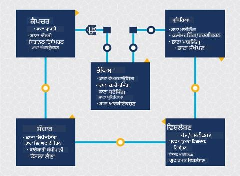
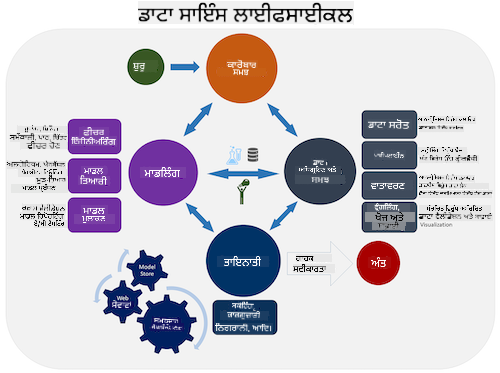
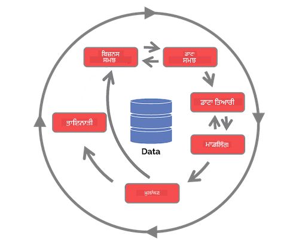

<!--
CO_OP_TRANSLATOR_METADATA:
{
  "original_hash": "79ca8a5a3135e94d2d43f56ba62d5205",
  "translation_date": "2025-09-04T17:21:55+00:00",
  "source_file": "4-Data-Science-Lifecycle/14-Introduction/README.md",
  "language_code": "pa"
}
-->
# ਡਾਟਾ ਸਾਇੰਸ ਲਾਈਫਸਾਈਕਲ ਦਾ ਪਰਿਚਯ

|![ [(@sketchthedocs)] ਦੁਆਰਾ ਬਣਾਈ ਗਈ ਸਕੈਚਨੋਟ](https://sketchthedocs.dev) ](../../sketchnotes/14-DataScience-Lifecycle.png)|
|:---:|
| ਡਾਟਾ ਸਾਇੰਸ ਲਾਈਫਸਾਈਕਲ ਦਾ ਪਰਿਚਯ - _[@nitya](https://twitter.com/nitya) ਦੁਆਰਾ ਬਣਾਈ ਗਈ ਸਕੈਚਨੋਟ_ |

## [ਪ੍ਰੀ-ਲੈਕਚਰ ਕਵਿਜ਼](https://red-water-0103e7a0f.azurestaticapps.net/quiz/26)

ਇਸ ਸਮੇਂ ਤੱਕ ਤੁਹਾਨੂੰ ਸ਼ਾਇਦ ਇਹ ਅਹਿਸਾਸ ਹੋ ਗਿਆ ਹੋਵੇਗਾ ਕਿ ਡਾਟਾ ਸਾਇੰਸ ਇੱਕ ਪ੍ਰਕਿਰਿਆ ਹੈ। ਇਸ ਪ੍ਰਕਿਰਿਆ ਨੂੰ 5 ਚਰਨਾਂ ਵਿੱਚ ਵੰਡਿਆ ਜਾ ਸਕਦਾ ਹੈ:

- ਡਾਟਾ ਇਕੱਠਾ ਕਰਨਾ
- ਪ੍ਰੋਸੈਸਿੰਗ
- ਵਿਸ਼ਲੇਸ਼ਣ
- ਸੰਚਾਰ
- ਰੱਖ-ਰਖਾਵ

ਇਹ ਪਾਠ ਲਾਈਫਸਾਈਕਲ ਦੇ 3 ਹਿੱਸਿਆਂ 'ਤੇ ਧਿਆਨ ਕੇਂਦਰਿਤ ਕਰਦਾ ਹੈ: ਡਾਟਾ ਇਕੱਠਾ ਕਰਨਾ, ਪ੍ਰੋਸੈਸਿੰਗ ਅਤੇ ਰੱਖ-ਰਖਾਵ।

> [ਬਰਕਲੀ ਸਕੂਲ ਆਫ ਇਨਫਾਰਮੇਸ਼ਨ](https://ischoolonline.berkeley.edu/data-science/what-is-data-science/) ਦੁਆਰਾ ਤਸਵੀਰ

## ਡਾਟਾ ਇਕੱਠਾ ਕਰਨਾ

ਲਾਈਫਸਾਈਕਲ ਦਾ ਪਹਿਲਾ ਚਰਨ ਬਹੁਤ ਮਹੱਤਵਪੂਰਨ ਹੈ ਕਿਉਂਕਿ ਅਗਲੇ ਚਰਨ ਇਸ 'ਤੇ ਨਿਰਭਰ ਕਰਦੇ ਹਨ। ਇਹ ਅਸਲ ਵਿੱਚ ਦੋ ਚਰਨਾਂ ਨੂੰ ਇੱਕ ਵਿੱਚ ਜੋੜਦਾ ਹੈ: ਡਾਟਾ ਪ੍ਰਾਪਤ ਕਰਨਾ ਅਤੇ ਉਸ ਦੇ ਉਦੇਸ਼ ਅਤੇ ਸਮੱਸਿਆਵਾਂ ਨੂੰ ਪਰਿਭਾਸ਼ਿਤ ਕਰਨਾ ਜਿਨ੍ਹਾਂ ਨੂੰ ਹੱਲ ਕਰਨ ਦੀ ਲੋੜ ਹੈ।  
ਪ੍ਰੋਜੈਕਟ ਦੇ ਉਦੇਸ਼ਾਂ ਨੂੰ ਪਰਿਭਾਸ਼ਿਤ ਕਰਨ ਲਈ ਸਮੱਸਿਆ ਜਾਂ ਸਵਾਲ ਦੇ ਗਹਿਰੇ ਸੰਦਰਭ ਦੀ ਲੋੜ ਹੋਵੇਗੀ। ਪਹਿਲਾਂ, ਸਾਨੂੰ ਉਹਨਾਂ ਦੀ ਪਛਾਣ ਅਤੇ ਪ੍ਰਾਪਤੀ ਕਰਨੀ ਪਵੇਗੀ ਜਿਨ੍ਹਾਂ ਦੀ ਸਮੱਸਿਆ ਹੱਲ ਕਰਨ ਦੀ ਲੋੜ ਹੈ। ਇਹ ਕਾਰੋਬਾਰ ਵਿੱਚ ਹਿੱਸੇਦਾਰ ਜਾਂ ਪ੍ਰੋਜੈਕਟ ਦੇ ਸਪਾਂਸਰ ਹੋ ਸਕਦੇ ਹਨ, ਜੋ ਇਹ ਪਛਾਣ ਕਰਨ ਵਿੱਚ ਮਦਦ ਕਰ ਸਕਦੇ ਹਨ ਕਿ ਇਸ ਪ੍ਰੋਜੈਕਟ ਤੋਂ ਕੌਣ ਜਾਂ ਕੀ ਲਾਭ ਪ੍ਰਾਪਤ ਕਰੇਗਾ ਅਤੇ ਕਿਉਂ। ਇੱਕ ਚੰਗਾ ਪਰਿਭਾਸ਼ਿਤ ਉਦੇਸ਼ ਮਾਪਣਯੋਗ ਅਤੇ ਗਣਨਯੋਗ ਹੋਣਾ ਚਾਹੀਦਾ ਹੈ ਤਾਂ ਜੋ ਇੱਕ ਸਵੀਕਾਰਯੋਗ ਨਤੀਜੇ ਨੂੰ ਪਰਿਭਾਸ਼ਿਤ ਕੀਤਾ ਜਾ ਸਕੇ।  

ਡਾਟਾ ਸਾਇੰਟਿਸਟ ਪੂਛ ਸਕਦੇ ਹਨ:
- ਕੀ ਇਸ ਸਮੱਸਿਆ ਨੂੰ ਪਹਿਲਾਂ ਹੱਲ ਕਰਨ ਦੀ ਕੋਸ਼ਿਸ਼ ਕੀਤੀ ਗਈ ਹੈ? ਕੀ ਪਤਾ ਲੱਗਾ?
- ਕੀ ਉਦੇਸ਼ ਅਤੇ ਲਕਸ਼ ਸਾਰੇ ਸ਼ਾਮਲ ਲੋਕਾਂ ਦੁਆਰਾ ਸਮਝੇ ਗਏ ਹਨ?
- ਕੀ ਕੋਈ ਅਸਪਸ਼ਟਤਾ ਹੈ ਅਤੇ ਇਸ ਨੂੰ ਘਟਾਉਣ ਲਈ ਕੀ ਕੀਤਾ ਜਾ ਸਕਦਾ ਹੈ?
- ਰੋਕਾਵਟਾਂ ਕੀ ਹਨ?
- ਅੰਤਮ ਨਤੀਜਾ ਕਿਵੇਂ ਦਿਖ ਸਕਦਾ ਹੈ?
- ਕਿੰਨੇ ਸਰੋਤ (ਸਮਾਂ, ਲੋਕ, ਗਣਨਾਤਮਕ) ਉਪਲਬਧ ਹਨ?

ਅਗਲਾ ਕਦਮ ਹੈ ਡਾਟਾ ਦੀ ਪਛਾਣ ਕਰਨਾ, ਇਕੱਠਾ ਕਰਨਾ ਅਤੇ ਫਿਰ ਉਸ ਡਾਟਾ ਦੀ ਖੋਜ ਕਰਨਾ ਜੋ ਪਰਿਭਾਸ਼ਿਤ ਉਦੇਸ਼ਾਂ ਨੂੰ ਪ੍ਰਾਪਤ ਕਰਨ ਲਈ ਲੋੜੀਂਦਾ ਹੈ। ਇਸ ਪ੍ਰਾਪਤੀ ਦੇ ਕਦਮ 'ਤੇ, ਡਾਟਾ ਸਾਇੰਟਿਸਟਾਂ ਨੂੰ ਡਾਟਾ ਦੀ ਮਾਤਰਾ ਅਤੇ ਗੁਣਵੱਤਾ ਦਾ ਮੁਲਾਂਕਣ ਕਰਨਾ ਪਵੇਗਾ। ਇਸ ਲਈ ਕੁਝ ਡਾਟਾ ਦੀ ਖੋਜ ਕਰਨ ਦੀ ਲੋੜ ਹੋਵੇਗੀ ਤਾਂ ਜੋ ਇਹ ਪੁਸ਼ਟੀ ਕੀਤੀ ਜਾ ਸਕੇ ਕਿ ਜੋ ਪ੍ਰਾਪਤ ਕੀਤਾ ਗਿਆ ਹੈ ਉਹ ਚਾਹੇ ਨਤੀਜੇ ਤੱਕ ਪਹੁੰਚਣ ਵਿੱਚ ਸਹਾਇਕ ਹੋਵੇਗਾ।  

ਡਾਟਾ ਸਾਇੰਟਿਸਟ ਡਾਟਾ ਬਾਰੇ ਪੂਛ ਸਕਦੇ ਹਨ:
- ਮੇਰੇ ਕੋਲ ਪਹਿਲਾਂ ਹੀ ਕਿਹੜਾ ਡਾਟਾ ਉਪਲਬਧ ਹੈ?
- ਇਸ ਡਾਟਾ ਦਾ ਮਾਲਕ ਕੌਣ ਹੈ?
- ਗੋਪਨੀਯਤਾ ਸੰਬੰਧੀ ਚਿੰਤਾਵਾਂ ਕੀ ਹਨ? 
- ਕੀ ਇਸ ਸਮੱਸਿਆ ਨੂੰ ਹੱਲ ਕਰਨ ਲਈ ਮੇਰੇ ਕੋਲ ਕਾਫ਼ੀ ਡਾਟਾ ਹੈ?
- ਕੀ ਇਹ ਡਾਟਾ ਇਸ ਸਮੱਸਿਆ ਲਈ ਸਵੀਕਾਰਯੋਗ ਗੁਣਵੱਤਾ ਦਾ ਹੈ?
- ਜੇ ਮੈਂ ਇਸ ਡਾਟਾ ਰਾਹੀਂ ਵਾਧੂ ਜਾਣਕਾਰੀ ਖੋਜਦਾ ਹਾਂ, ਤਾਂ ਕੀ ਸਾਨੂੰ ਉਦੇਸ਼ਾਂ ਨੂੰ ਬਦਲਣ ਜਾਂ ਦੁਬਾਰਾ ਪਰਿਭਾਸ਼ਿਤ ਕਰਨ ਬਾਰੇ ਸੋਚਣਾ ਚਾਹੀਦਾ ਹੈ?

## ਪ੍ਰੋਸੈਸਿੰਗ

ਲਾਈਫਸਾਈਕਲ ਦਾ ਪ੍ਰੋਸੈਸਿੰਗ ਚਰਨ ਡਾਟਾ ਵਿੱਚ ਪੈਟਰਨ ਦੀ ਖੋਜ ਕਰਨ ਅਤੇ ਮਾਡਲਿੰਗ 'ਤੇ ਧਿਆਨ ਕੇਂਦਰਿਤ ਕਰਦਾ ਹੈ। ਪ੍ਰੋਸੈਸਿੰਗ ਚਰਨ ਵਿੱਚ ਵਰਤੀਆਂ ਜਾਣ ਵਾਲੀਆਂ ਕੁਝ ਤਕਨੀਕਾਂ ਪੈਟਰਨ ਦੀ ਖੋਜ ਕਰਨ ਲਈ ਅੰਕਗਣਿਤ ਵਿਧੀਆਂ ਦੀ ਲੋੜ ਹੋਵੇਗੀ। ਆਮ ਤੌਰ 'ਤੇ, ਇਹ ਇੱਕ ਵੱਡੇ ਡਾਟਾ ਸੈਟ ਨਾਲ ਮਨੁੱਖ ਲਈ ਬਹੁਤ ਥਕਾਵਟ ਭਰਿਆ ਕੰਮ ਹੋਵੇਗਾ ਅਤੇ ਇਸ ਪ੍ਰਕਿਰਿਆ ਨੂੰ ਤੇਜ਼ ਕਰਨ ਲਈ ਕੰਪਿਊਟਰਾਂ 'ਤੇ ਨਿਰਭਰ ਕੀਤਾ ਜਾਵੇਗਾ। ਇਹ ਚਰਨ ਉਹ ਜਗ੍ਹਾ ਹੈ ਜਿੱਥੇ ਡਾਟਾ ਸਾਇੰਸ ਅਤੇ ਮਸ਼ੀਨ ਲਰਨਿੰਗ ਇੱਕ ਦੂਜੇ ਨਾਲ ਜੁੜਦੇ ਹਨ। ਜਿਵੇਂ ਕਿ ਤੁਸੀਂ ਪਹਿਲੇ ਪਾਠ ਵਿੱਚ ਸਿੱਖਿਆ, ਮਸ਼ੀਨ ਲਰਨਿੰਗ ਡਾਟਾ ਨੂੰ ਸਮਝਣ ਲਈ ਮਾਡਲ ਬਣਾਉਣ ਦੀ ਪ੍ਰਕਿਰਿਆ ਹੈ। ਮਾਡਲ ਡਾਟਾ ਵਿੱਚ ਵੈਰੀਏਬਲਾਂ ਦੇ ਰਿਸ਼ਤੇ ਦੀ ਪ੍ਰਤੀਨਿਧਤਾ ਹੁੰਦੇ ਹਨ ਜੋ ਨਤੀਜਿਆਂ ਦੀ ਪੇਸ਼ਗੋਈ ਕਰਨ ਵਿੱਚ ਮਦਦ ਕਰਦੇ ਹਨ।

ਇਸ ਚਰਨ ਵਿੱਚ ਵਰਤੀਆਂ ਜਾਣ ਵਾਲੀਆਂ ਆਮ ਤਕਨੀਕਾਂ ML for Beginners ਦੇ ਕੋਰਸ ਵਿੱਚ ਕਵਰ ਕੀਤੀਆਂ ਗਈਆਂ ਹਨ। ਹੇਠਾਂ ਦਿੱਤੇ ਲਿੰਕਾਂ ਨੂੰ ਫਾਲੋ ਕਰਕੇ ਉਨ੍ਹਾਂ ਬਾਰੇ ਹੋਰ ਜਾਣੋ:

- [ਕਲਾਸੀਫਿਕੇਸ਼ਨ](https://github.com/microsoft/ML-For-Beginners/tree/main/4-Classification): ਡਾਟਾ ਨੂੰ ਸ਼੍ਰੇਣੀਆਂ ਵਿੱਚ ਵਿਵਸਥਿਤ ਕਰਨਾ।
- [ਕਲਸਟਰਿੰਗ](https://github.com/microsoft/ML-For-Beginners/tree/main/5-Clustering): ਡਾਟਾ ਨੂੰ ਸਮਾਨ ਸਮੂਹਾਂ ਵਿੱਚ ਵੰਡਣਾ।
- [ਰਿਗਰੈਸ਼ਨ](https://github.com/microsoft/ML-For-Beginners/tree/main/2-Regression): ਵੈਰੀਏਬਲਾਂ ਦੇ ਰਿਸ਼ਤਿਆਂ ਨੂੰ ਪਤਾ ਲਗਾਉਣਾ ਅਤੇ ਮੁੱਲਾਂ ਦੀ ਪੇਸ਼ਗੋਈ ਕਰਨਾ।

## ਰੱਖ-ਰਖਾਵ
ਲਾਈਫਸਾਈਕਲ ਦੇ ਡਾਇਗ੍ਰਾਮ ਵਿੱਚ, ਤੁਸੀਂ ਸ਼ਾਇਦ ਧਿਆਨ ਦਿੱਤਾ ਹੋਵੇਗਾ ਕਿ ਰੱਖ-ਰਖਾਵ ਡਾਟਾ ਇਕੱਠਾ ਕਰਨ ਅਤੇ ਪ੍ਰੋਸੈਸਿੰਗ ਦੇ ਵਿਚਕਾਰ ਹੈ। ਰੱਖ-ਰਖਾਵ ਇੱਕ ongoing ਪ੍ਰਕਿਰਿਆ ਹੈ ਜੋ ਪ੍ਰੋਜੈਕਟ ਦੇ ਦੌਰਾਨ ਡਾਟਾ ਦੇ ਪ੍ਰਬੰਧਨ, ਸਟੋਰੇਜ ਅਤੇ ਸੁਰੱਖਿਆ 'ਤੇ ਧਿਆਨ ਕੇਂਦਰਿਤ ਕਰਦੀ ਹੈ ਅਤੇ ਇਸ ਨੂੰ ਪ੍ਰੋਜੈਕਟ ਦੀ ਪੂਰੀ ਮਿਆਦ ਵਿੱਚ ਧਿਆਨ ਵਿੱਚ ਰੱਖਣਾ ਚਾਹੀਦਾ ਹੈ।  

### ਡਾਟਾ ਸਟੋਰ ਕਰਨਾ
ਡਾਟਾ ਕਿਵੇਂ ਅਤੇ ਕਿੱਥੇ ਸਟੋਰ ਕੀਤਾ ਜਾਂਦਾ ਹੈ, ਇਸ ਦੇ ਖਰਚੇ ਅਤੇ ਡਾਟਾ ਤਕ ਪਹੁੰਚਣ ਦੀ ਗਤੀ ਨੂੰ ਪ੍ਰਭਾਵਿਤ ਕਰ ਸਕਦਾ ਹੈ। ਇਸ ਤਰ੍ਹਾਂ ਦੇ ਫੈਸਲੇ ਸਿਰਫ ਡਾਟਾ ਸਾਇੰਟਿਸਟ ਦੁਆਰਾ ਨਹੀਂ ਕੀਤੇ ਜਾਂਦੇ, ਪਰ ਉਹ ਡਾਟਾ ਸਟੋਰੇਜ ਦੇ ਅਧਾਰ 'ਤੇ ਡਾਟਾ ਨਾਲ ਕੰਮ ਕਰਨ ਦੇ ਤਰੀਕੇ 'ਤੇ ਚੋਣਾਂ ਕਰਨ ਦੀ ਲੋੜ ਮਹਿਸੂ ਕਰ ਸਕਦੇ ਹਨ।

ਆਧੁਨਿਕ ਡਾਟਾ ਸਟੋਰੇਜ ਸਿਸਟਮ ਦੇ ਕੁਝ ਪਹਲੂ ਜੋ ਇਹ ਚੋਣਾਂ ਪ੍ਰਭਾਵਿਤ ਕਰ ਸਕਦੇ ਹਨ:

**ਆਨ-ਪ੍ਰੈਮਿਸ ਵਿਰੁੱਧ ਆਫ-ਪ੍ਰੈਮਿਸ ਵਿਰੁੱਧ ਪਬਲਿਕ ਜਾਂ ਪ੍ਰਾਈਵੇਟ ਕਲਾਉਡ**

ਆਨ-ਪ੍ਰੈਮਿਸ ਦਾ ਮਤਲਬ ਹੈ ਆਪਣੇ ਸਾਜੋ-ਸਾਮਾਨ 'ਤੇ ਡਾਟਾ ਦੀ ਹੋਸਟਿੰਗ ਅਤੇ ਪ੍ਰਬੰਧਨ ਕਰਨਾ, ਜਿਵੇਂ ਕਿ ਸਰਵਰ ਦੇ ਮਾਲਕ ਹੋਣਾ ਜਿਸ ਵਿੱਚ ਡਾਟਾ ਸਟੋਰ ਕੀਤਾ ਜਾਂਦਾ ਹੈ, ਜਦਕਿ ਆਫ-ਪ੍ਰੈਮਿਸ ਉਹ ਸਾਜੋ-ਸਾਮਾਨ 'ਤੇ ਨਿਰਭਰ ਕਰਦਾ ਹੈ ਜੋ ਤੁਹਾਡੇ ਮਾਲਕ ਨਹੀਂ ਹਨ, ਜਿਵੇਂ ਕਿ ਡਾਟਾ ਸੈਂਟਰ। ਪਬਲਿਕ ਕਲਾਉਡ ਡਾਟਾ ਸਟੋਰੇਜ ਲਈ ਇੱਕ ਲੋਕਪ੍ਰਿਯ ਚੋਣ ਹੈ ਜਿਸ ਵਿੱਚ ਇਹ ਜਾਣਨ ਦੀ ਲੋੜ ਨਹੀਂ ਹੁੰਦੀ ਕਿ ਡਾਟਾ ਕਿਵੇਂ ਜਾਂ ਕਿੱਥੇ ਸਟੋਰ ਕੀਤਾ ਗਿਆ ਹੈ। ਕੁਝ ਸੰਗਠਨਾਂ ਦੀਆਂ ਸੁਰੱਖਿਆ ਨੀਤੀਆਂ ਸਖਤ ਹੁੰਦੀਆਂ ਹਨ ਜੋ ਇਹ ਯਕੀਨੀ ਬਣਾਉਂਦੀਆਂ ਹਨ ਕਿ ਉਹ ਸਾਜੋ-ਸਾਮਾਨ ਤਕ ਪੂਰੀ ਪਹੁੰਚ ਰੱਖਦੇ ਹਨ ਜਿੱਥੇ ਡਾਟਾ ਹੋਸਟ ਕੀਤਾ ਜਾਂਦਾ ਹੈ ਅਤੇ ਉਹ ਪ੍ਰਾਈਵੇਟ ਕਲਾਉਡ 'ਤੇ ਨਿਰਭਰ ਕਰਦੇ ਹਨ ਜੋ ਆਪਣੀਆਂ ਕਲਾਉਡ ਸੇਵਾਵਾਂ ਪ੍ਰਦਾਨ ਕਰਦਾ ਹੈ। ਤੁਸੀਂ ਕਲਾਉਡ ਵਿੱਚ ਡਾਟਾ ਬਾਰੇ ਹੋਰ ਜਾਣਕਾਰੀ [ਅਗਲੇ ਪਾਠਾਂ](https://github.com/microsoft/Data-Science-For-Beginners/tree/main/5-Data-Science-In-Cloud) ਵਿੱਚ ਸਿੱਖੋਗੇ।

**ਕੋਲਡ ਵਿਰੁੱਧ ਹਾਟ ਡਾਟਾ**

ਜਦੋਂ ਤੁਸੀਂ ਆਪਣੇ ਮਾਡਲਾਂ ਨੂੰ ਟ੍ਰੇਨ ਕਰ ਰਹੇ ਹੋ, ਤੁਹਾਨੂੰ ਹੋਰ ਟ੍ਰੇਨਿੰਗ ਡਾਟਾ ਦੀ ਲੋੜ ਹੋ ਸਕਦੀ ਹੈ। ਜੇ ਤੁਸੀਂ ਆਪਣੇ ਮਾਡਲ ਨਾਲ ਸੰਤੁਸ਼ਟ ਹੋ, ਹੋਰ ਡਾਟਾ ਮਾਡਲ ਨੂੰ ਇਸਦੇ ਉਦੇਸ਼ ਦੀ ਸੇਵਾ ਕਰਨ ਲਈ ਆਵੇਗਾ। ਕਿਸੇ ਵੀ ਹਾਲਤ ਵਿੱਚ, ਜਿਵੇਂ ਜ਼ਿਆਦਾ ਡਾਟਾ ਇਕੱਠਾ ਕੀਤਾ ਜਾਂਦਾ ਹੈ, ਸਟੋਰੇਜ ਅਤੇ ਪਹੁੰਚ ਦੀ ਲਾਗਤ ਵਧੇਗੀ। ਕਦੇ-ਕਦੇ ਵਰਤਿਆ ਜਾਣ ਵਾਲਾ ਡਾਟਾ, ਜਿਸ ਨੂੰ ਕੋਲਡ ਡਾਟਾ ਕਿਹਾ ਜਾਂਦਾ ਹੈ, ਨੂੰ ਅਕਸਰ ਪਹੁੰਚ ਕੀਤੇ ਜਾਣ ਵਾਲੇ ਹਾਟ ਡਾਟਾ ਤੋਂ ਵੱਖ ਕਰਨਾ ਇੱਕ ਸਸਤਾ ਸਟੋਰੇਜ ਵਿਕਲਪ ਹੋ ਸਕਦਾ ਹੈ। ਜੇ ਕੋਲਡ ਡਾਟਾ ਤਕ ਪਹੁੰਚ ਕਰਨ ਦੀ ਲੋੜ ਹੋਵੇ, ਤਾਂ ਇਸਨੂੰ ਹਾਟ ਡਾਟਾ ਦੇ ਮੁਕਾਬਲੇ ਵਾਪਸ ਲੈਣ ਵਿੱਚ ਥੋੜਾ ਜ਼ਿਆਦਾ ਸਮਾਂ ਲੱਗ ਸਕਦਾ ਹੈ।

### ਡਾਟਾ ਦਾ ਪ੍ਰਬੰਧਨ
ਜਦੋਂ ਤੁਸੀਂ ਡਾਟਾ ਨਾਲ ਕੰਮ ਕਰਦੇ ਹੋ, ਤੁਸੀਂ ਪਤਾ ਲਗਾ ਸਕਦੇ ਹੋ ਕਿ ਕੁਝ ਡਾਟਾ ਨੂੰ ਸਾਫ਼ ਕਰਨ ਦੀ ਲੋੜ ਹੈ। ਇਹ ਤਕਨੀਕਾਂ [ਡਾਟਾ ਤਿਆਰੀ](https://github.com/microsoft/Data-Science-For-Beginners/tree/main/2-Working-With-Data/08-data-preparation) ਪਾਠ ਵਿੱਚ ਕਵਰ ਕੀਤੀਆਂ ਗਈਆਂ ਹਨ। ਜਦੋਂ ਨਵਾਂ ਡਾਟਾ ਆਉਂਦਾ ਹੈ, ਇਸ ਨੂੰ ਗੁਣਵੱਤਾ ਵਿੱਚ ਸਥਿਰਤਾ ਬਣਾਈ ਰੱਖਣ ਲਈ ਉਹੀ ਤਕਨੀਕਾਂ ਦੀ ਲੋੜ ਹੋਵੇਗੀ। ਕੁਝ ਪ੍ਰੋਜੈਕਟਾਂ ਵਿੱਚ ਡਾਟਾ ਨੂੰ ਸਾਫ਼ ਕਰਨ, ਇਕੱਠਾ ਕਰਨ ਅਤੇ ਕੰਪ੍ਰੈਸ ਕਰਨ ਲਈ ਆਟੋਮੈਟਿਕ ਟੂਲ ਦੀ ਵਰਤੋਂ ਸ਼ਾਮਲ ਹੋ ਸਕਦੀ ਹੈ। Azure Data Factory ਇਸ ਤਰ੍ਹਾਂ ਦੇ ਟੂਲ ਦਾ ਇੱਕ ਉਦਾਹਰਨ ਹੈ।

### ਡਾਟਾ ਦੀ ਸੁਰੱਖਿਆ
ਡਾਟਾ ਦੀ ਸੁਰੱਖਿਆ ਦਾ ਇੱਕ ਮੁੱਖ ਉਦੇਸ਼ ਇਹ ਯਕੀਨੀ ਬਣਾਉਣਾ ਹੈ ਕਿ ਜੋ ਲੋਕ ਇਸ ਨਾਲ ਕੰਮ ਕਰ ਰਹੇ ਹਨ ਉਹ ਇਸ ਨੂੰ ਕਿਵੇਂ ਇਕੱਠਾ ਕੀਤਾ ਗਿਆ ਹੈ ਅਤੇ ਕਿਹੜੇ ਸੰਦਰਭ ਵਿੱਚ ਇਸਨੂੰ ਵਰਤਿਆ ਜਾ ਰਿਹਾ ਹੈ, ਇਸ 'ਤੇ ਨਿਯੰਤਰਣ ਰੱਖਦੇ ਹਨ। ਡਾਟਾ ਨੂੰ ਸੁਰੱਖਿਅਤ ਰੱਖਣ ਵਿੱਚ ਸਿਰਫ਼ ਉਹਨਾਂ ਨੂੰ ਪਹੁੰਚ ਦੇਣਾ ਸ਼ਾਮਲ ਹੈ ਜਿਨ੍ਹਾਂ ਨੂੰ ਇਸ ਦੀ ਲੋੜ ਹੈ, ਸਥਾਨਕ ਕਾਨੂੰਨਾਂ ਅਤੇ ਨਿਯਮਾਂ ਦੀ ਪਾਲਣਾ ਕਰਨਾ, ਅਤੇ ਨੈਤਿਕ ਮਿਆਰਾਂ ਨੂੰ ਬਣਾਈ ਰੱਖਣਾ। ਇਹ [ਨੈਤਿਕਤਾ ਪਾਠ](https://github.com/microsoft/Data-Science-For-Beginners/tree/main/1-Introduction/02-ethics) ਵਿੱਚ ਕਵਰ ਕੀਤਾ ਗਿਆ ਹੈ।  

ਇਹ ਕੁਝ ਚੀਜ਼ਾਂ ਹਨ ਜੋ ਸੁਰੱਖਿਆ ਨੂੰ ਧਿਆਨ ਵਿੱਚ ਰੱਖਦੇ ਹੋਏ ਟੀਮ ਕਰ ਸਕਦੀ ਹੈ:
- ਯਕੀਨੀ ਬਣਾਓ ਕਿ ਸਾਰਾ ਡਾਟਾ ਇਨਕ੍ਰਿਪਟ ਕੀਤਾ ਗਿਆ ਹੈ
- ਗਾਹਕਾਂ ਨੂੰ ਇਹ ਜਾਣਕਾਰੀ ਪ੍ਰਦਾਨ ਕਰੋ ਕਿ ਉਨ੍ਹਾਂ ਦਾ ਡਾਟਾ ਕਿਵੇਂ ਵਰਤਿਆ ਜਾ ਰਿਹਾ ਹੈ
- ਪ੍ਰੋਜੈਕਟ ਛੱਡ ਚੁੱਕੇ ਲੋਕਾਂ ਤੋਂ ਡਾਟਾ ਤਕ ਪਹੁੰਚ ਹਟਾਓ
- ਸਿਰਫ਼ ਕੁਝ ਪ੍ਰੋਜੈਕਟ ਮੈਂਬਰਾਂ ਨੂੰ ਡਾਟਾ ਵਿੱਚ ਤਬਦੀਲੀ ਕਰਨ ਦੀ ਆਗਿਆ ਦਿਓ

## 🚀 ਚੁਣੌਤੀ

ਡਾਟਾ ਸਾਇੰਸ ਲਾਈਫਸਾਈਕਲ ਦੇ ਕਈ ਵਰਜਨ ਹਨ, ਜਿੱਥੇ ਹਰ ਕਦਮ ਦੇ ਵੱਖ-ਵੱਖ ਨਾਮ ਅਤੇ ਚਰਨਾਂ ਦੀ ਗਿਣਤੀ ਹੋ ਸਕਦੀ ਹੈ ਪਰ ਇਸ ਪਾਠ ਵਿੱਚ ਉਲਲੇਖ ਕੀਤੇ ਗਏ ਸਮਾਨ ਪ੍ਰਕਿਰਿਆਵਾਂ ਸ਼ਾਮਲ ਹੋਣਗੀਆਂ।

[Team Data Science Process lifecycle](https://docs.microsoft.com/en-us/azure/architecture/data-science-process/lifecycle) ਅਤੇ [Cross-industry standard process for data mining](https://www.datascience-pm.com/crisp-dm-2/) ਦੀ ਖੋਜ ਕਰੋ। ਦੋਨਾਂ ਵਿੱਚੋਂ 3 ਸਮਾਨਤਾਵਾਂ ਅਤੇ ਵੱਖ-ਵੱਖਤਾ ਦਾ ਨਾਮ ਦਿਓ।

|Team Data Science Process (TDSP)|Cross-industry standard process for data mining (CRISP-DM)|
|--|--|
| |  |
| [Microsoft](https://docs.microsoft.comazure/architecture/data-science-process/lifecycle) ਦੁਆਰਾ ਚਿੱਤਰ | [Data Science Process Alliance](https://www.datascience-pm.com/crisp-dm-2/) ਦੁਆਰਾ ਚਿੱਤਰ |

## [ਪੋਸਟ-ਲੈਕਚਰ ਕਵਿਜ਼](https://ff-quizzes.netlify.app/en/ds/)

## ਸਮੀਖਿਆ ਅਤੇ ਸਵੈ-ਅਧਿਐਨ

ਡਾਟਾ ਸਾਇੰਸ ਲਾਈਫਸਾਈਕਲ ਨੂੰ ਲਾਗੂ ਕਰਨ ਵਿੱਚ ਕਈ ਭੂਮਿਕਾਵਾਂ ਅਤੇ ਕੰਮ ਸ਼ਾਮਲ ਹੁੰਦੇ ਹਨ, ਜਿੱਥੇ ਕੁਝ ਹਰ ਚਰਨ ਦੇ ਵਿਸ਼ੇਸ਼ ਹਿੱਸਿਆਂ 'ਤੇ ਧਿਆਨ ਕੇਂਦਰਿਤ ਕਰਦੇ ਹਨ। Team Data Science Process ਕੁਝ ਸਰੋਤ ਪ੍ਰਦਾਨ ਕਰਦਾ ਹੈ ਜੋ ਇਹ ਸਮਝਾਉਂਦੇ ਹਨ ਕਿ ਕਿਸੇ ਪ੍ਰੋਜੈਕਟ ਵਿੱਚ ਕਿਸੇ ਵਿਅਕਤੀ ਦੀਆਂ ਭੂਮਿਕਾਵਾਂ ਅਤੇ ਕੰਮ ਕੀ ਹੋ ਸਕਦੇ ਹਨ।

* [Team Data Science Process roles and tasks](https://docs.microsoft.com/en-us/azure/architecture/data-science-process/roles-tasks)
* [Execute data science tasks: exploration, modeling, and deployment](https://docs.microsoft.com/en-us/azure/architecture/data-science-process/execute-data-science-tasks)

## ਅਸਾਈਨਮੈਂਟ

[ਡਾਟਾ ਸੈਟ ਦਾ ਮੁਲਾਂਕਣ](assignment.md)

---

**ਅਸਵੀਕਰਤੀ**:  
ਇਹ ਦਸਤਾਵੇਜ਼ AI ਅਨੁਵਾਦ ਸੇਵਾ [Co-op Translator](https://github.com/Azure/co-op-translator) ਦੀ ਵਰਤੋਂ ਕਰਕੇ ਅਨੁਵਾਦ ਕੀਤਾ ਗਿਆ ਹੈ। ਜਦੋਂ ਕਿ ਅਸੀਂ ਸਹੀ ਹੋਣ ਦੀ ਕੋਸ਼ਿਸ਼ ਕਰਦੇ ਹਾਂ, ਕਿਰਪਾ ਕਰਕੇ ਧਿਆਨ ਦਿਓ ਕਿ ਸਵੈਚਾਲਿਤ ਅਨੁਵਾਦਾਂ ਵਿੱਚ ਗਲਤੀਆਂ ਜਾਂ ਅਸੁਚਤਤਾਵਾਂ ਹੋ ਸਕਦੀਆਂ ਹਨ। ਮੂਲ ਦਸਤਾਵੇਜ਼ ਨੂੰ ਇਸਦੀ ਮੂਲ ਭਾਸ਼ਾ ਵਿੱਚ ਅਧਿਕਾਰਤ ਸਰੋਤ ਮੰਨਿਆ ਜਾਣਾ ਚਾਹੀਦਾ ਹੈ। ਮਹੱਤਵਪੂਰਨ ਜਾਣਕਾਰੀ ਲਈ, ਪੇਸ਼ੇਵਰ ਮਨੁੱਖੀ ਅਨੁਵਾਦ ਦੀ ਸਿਫਾਰਸ਼ ਕੀਤੀ ਜਾਂਦੀ ਹੈ। ਇਸ ਅਨੁਵਾਦ ਦੀ ਵਰਤੋਂ ਤੋਂ ਪੈਦਾ ਹੋਣ ਵਾਲੇ ਕਿਸੇ ਵੀ ਗਲਤ ਫਹਿਮੀ ਜਾਂ ਗਲਤ ਵਿਆਖਿਆ ਲਈ ਅਸੀਂ ਜ਼ਿੰਮੇਵਾਰ ਨਹੀਂ ਹਾਂ।