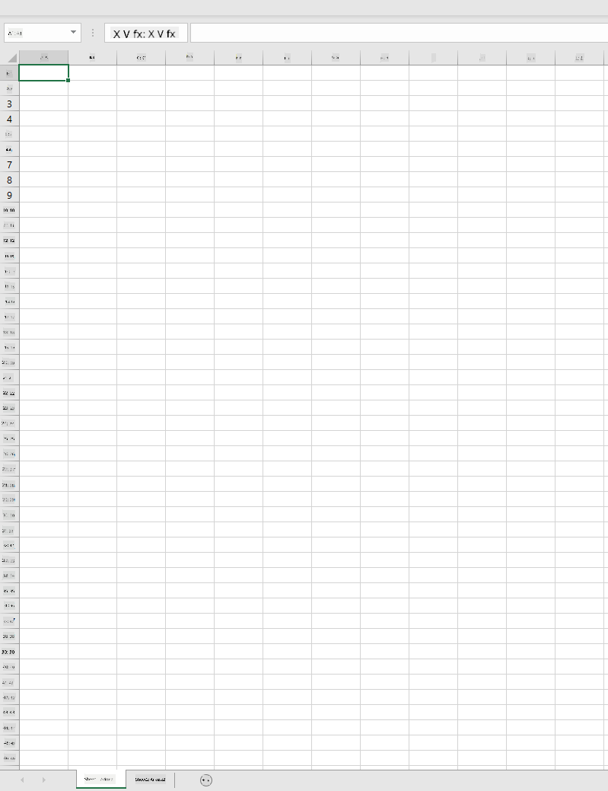
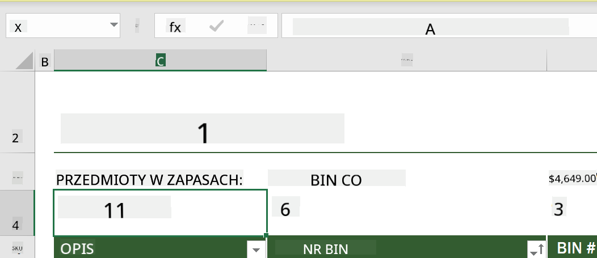
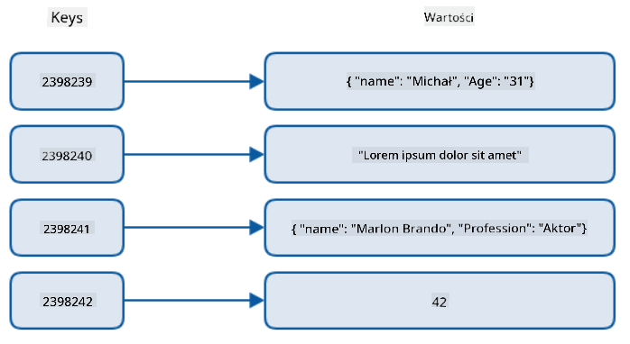
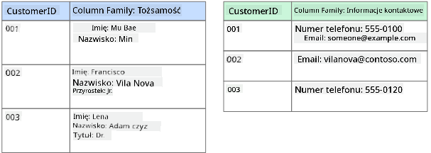
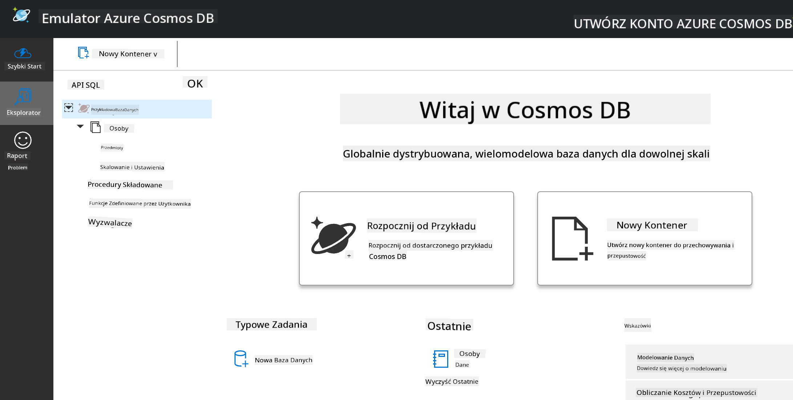
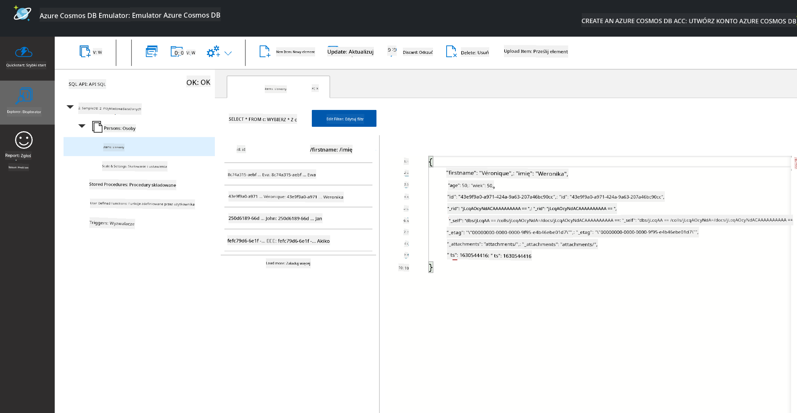
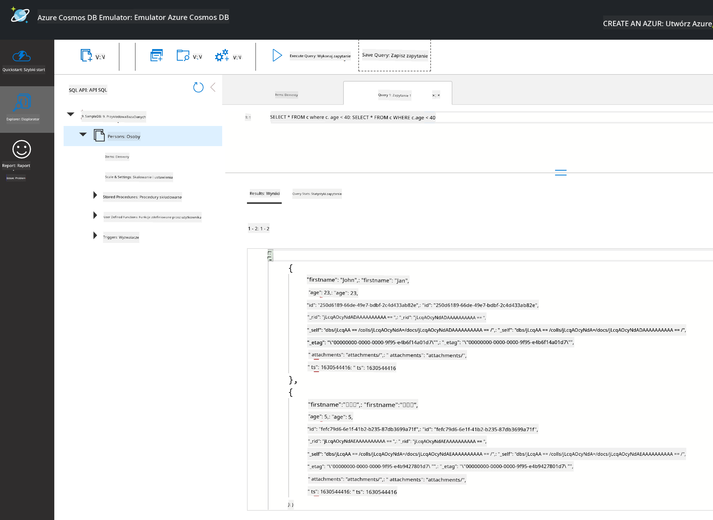

<!--
CO_OP_TRANSLATOR_METADATA:
{
  "original_hash": "54c5a1c74aecb69d2f9099300a4b7eea",
  "translation_date": "2025-09-04T14:37:05+00:00",
  "source_file": "2-Working-With-Data/06-non-relational/README.md",
  "language_code": "pl"
}
-->
# Praca z danymi: dane nierelacyjne

| ](../../sketchnotes/06-NoSQL.png)|
|:---:|
|Praca z danymi NoSQL - _Sketchnote autorstwa [@nitya](https://twitter.com/nitya)_ |

## [Quiz przed wykładem](https://purple-hill-04aebfb03.1.azurestaticapps.net/quiz/10)

Dane nie ograniczają się tylko do relacyjnych baz danych. Ta lekcja skupia się na danych nierelacyjnych i obejmuje podstawy arkuszy kalkulacyjnych oraz NoSQL.

## Arkusze kalkulacyjne

Arkusze kalkulacyjne są popularnym sposobem przechowywania i eksploracji danych, ponieważ wymagają mniej pracy przy konfiguracji i rozpoczęciu pracy. W tej lekcji poznasz podstawowe elementy arkusza kalkulacyjnego, a także formuły i funkcje. Przykłady będą ilustrowane za pomocą Microsoft Excel, ale większość części i tematów będzie miała podobne nazwy i kroki w porównaniu z innym oprogramowaniem do arkuszy kalkulacyjnych.



Arkusz kalkulacyjny to plik, który będzie dostępny w systemie plików komputera, urządzenia lub w systemie plików opartym na chmurze. Samo oprogramowanie może być przeglądarkowe lub aplikacją, którą należy zainstalować na komputerze lub pobrać jako aplikację. W Excelu te pliki są również definiowane jako **zeszyty** i ta terminologia będzie używana w dalszej części tej lekcji.

Zeszyt zawiera jeden lub więcej **arkuszy roboczych**, z których każdy jest oznaczony zakładkami. W arkuszu roboczym znajdują się prostokąty zwane **komórkami**, które zawierają rzeczywiste dane. Komórka to przecięcie wiersza i kolumny, gdzie kolumny są oznaczone znakami alfabetycznymi, a wiersze numerycznie. Niektóre arkusze kalkulacyjne zawierają nagłówki w pierwszych kilku wierszach, które opisują dane w komórce.

Korzystając z tych podstawowych elementów zeszytu Excel, użyjemy przykładu z [Microsoft Templates](https://templates.office.com/) skoncentrowanego na inwentarzu, aby przejść przez dodatkowe części arkusza kalkulacyjnego.

### Zarządzanie inwentarzem

Plik arkusza kalkulacyjnego o nazwie "InventoryExample" to sformatowany arkusz kalkulacyjny przedmiotów w inwentarzu, który zawiera trzy arkusze robocze, gdzie zakładki są oznaczone jako "Inventory List", "Inventory Pick List" i "Bin Lookup". Wiersz 4 arkusza roboczego Inventory List to nagłówek, który opisuje wartość każdej komórki w kolumnie nagłówka.


Zdarzają się sytuacje, w których wartość komórki zależy od wartości innych komórek, aby wygenerować swoją wartość. Arkusz Inventory List śledzi koszt każdego przedmiotu w inwentarzu, ale co jeśli musimy znać wartość całego inwentarza? [**Formuły**](https://support.microsoft.com/en-us/office/overview-of-formulas-34519a4e-1e8d-4f4b-84d4-d642c4f63263) wykonują operacje na danych w komórkach i są używane do obliczania kosztu inwentarza w tym przykładzie. Ten arkusz kalkulacyjny użył formuły w kolumnie Inventory Value, aby obliczyć wartość każdego przedmiotu, mnożąc ilość pod nagłówkiem QTY przez koszty pod nagłówkiem COST. Podwójne kliknięcie lub podświetlenie komórki pokaże formułę. Zauważysz, że formuły zaczynają się od znaku równości, po którym następuje obliczenie lub operacja.



Możemy użyć innej formuły, aby dodać wszystkie wartości z kolumny Inventory Value i uzyskać jej całkowitą wartość. Można to obliczyć, dodając każdą komórkę, aby wygenerować sumę, ale może to być żmudne zadanie. Excel posiada [**funkcje**](https://support.microsoft.com/en-us/office/sum-function-043e1c7d-7726-4e80-8f32-07b23e057f89), czyli wstępnie zdefiniowane formuły do wykonywania obliczeń na wartościach komórek. Funkcje wymagają argumentów, czyli wartości potrzebnych do wykonania obliczeń. Gdy funkcje wymagają więcej niż jednego argumentu, muszą być wymienione w określonej kolejności, inaczej funkcja może nie obliczyć poprawnej wartości. W tym przykładzie użyto funkcji SUM, która wykorzystuje wartości z kolumny Inventory Value jako argument do dodania i wygenerowania sumy podanej w wierszu 3, kolumnie B (znanej również jako B3).

## NoSQL

NoSQL to ogólny termin dla różnych sposobów przechowywania danych nierelacyjnych i może być interpretowany jako "non-SQL", "nierelacyjny" lub "nie tylko SQL". Tego typu systemy baz danych można podzielić na 4 kategorie.


> Źródło: [Blog Michała Białeckiego](https://www.michalbialecki.com/2018/03/18/azure-cosmos-db-key-value-database-cloud/)

Bazy danych [klucz-wartość](https://docs.microsoft.com/en-us/azure/architecture/data-guide/big-data/non-relational-data#keyvalue-data-stores) łączą unikalne klucze, które są unikalnym identyfikatorem powiązanym z wartością. Te pary są przechowywane za pomocą [tablicy mieszającej](https://www.hackerearth.com/practice/data-structures/hash-tables/basics-of-hash-tables/tutorial/) z odpowiednią funkcją mieszającą.


> Źródło: [Microsoft](https://docs.microsoft.com/en-us/azure/cosmos-db/graph/graph-introduction#graph-database-by-example)

Bazy danych [grafowe](https://docs.microsoft.com/en-us/azure/architecture/data-guide/big-data/non-relational-data#graph-data-stores) opisują relacje w danych i są reprezentowane jako zbiór węzłów i krawędzi. Węzeł reprezentuje jednostkę, coś istniejącego w rzeczywistości, na przykład studenta lub wyciąg bankowy. Krawędzie reprezentują relację między dwoma jednostkami. Każdy węzeł i krawędź mają właściwości, które dostarczają dodatkowych informacji o każdym węźle i krawędzi.



Magazyny danych [kolumnowe](https://docs.microsoft.com/en-us/azure/architecture/data-guide/big-data/non-relational-data#columnar-data-stores) organizują dane w kolumny i wiersze, podobnie jak struktura relacyjna, ale każda kolumna jest podzielona na grupy zwane rodzinami kolumn, gdzie wszystkie dane pod jedną kolumną są powiązane i mogą być pobierane oraz zmieniane jako jedna jednostka.

### Magazyny danych dokumentowych z Azure Cosmos DB

Magazyny danych [dokumentowe](https://docs.microsoft.com/en-us/azure/architecture/data-guide/big-data/non-relational-data#document-data-stores) opierają się na koncepcji magazynu danych typu klucz-wartość i składają się z serii pól i obiektów. W tej sekcji zbadamy bazy danych dokumentowe za pomocą emulatora Cosmos DB.

Baza danych Cosmos DB pasuje do definicji "Nie tylko SQL", gdzie baza danych dokumentowa Cosmos DB opiera się na SQL do zapytań o dane. [Poprzednia lekcja](../05-relational-databases/README.md) dotycząca SQL obejmuje podstawy języka, a tutaj będziemy mogli zastosować niektóre z tych samych zapytań do bazy danych dokumentowej. Będziemy korzystać z emulatora Cosmos DB, który pozwala na tworzenie i eksplorację bazy danych dokumentowej lokalnie na komputerze. Przeczytaj więcej o emulatorze [tutaj](https://docs.microsoft.com/en-us/azure/cosmos-db/local-emulator?tabs=ssl-netstd21).

Dokument to zbiór pól i wartości obiektów, gdzie pola opisują, co reprezentuje wartość obiektu. Poniżej znajduje się przykład dokumentu.

```json
{
    "firstname": "Eva",
    "age": 44,
    "id": "8c74a315-aebf-4a16-bb38-2430a9896ce5",
    "_rid": "bHwDAPQz8s0BAAAAAAAAAA==",
    "_self": "dbs/bHwDAA==/colls/bHwDAPQz8s0=/docs/bHwDAPQz8s0BAAAAAAAAAA==/",
    "_etag": "\"00000000-0000-0000-9f95-010a691e01d7\"",
    "_attachments": "attachments/",
    "_ts": 1630544034
}
```

Pola, które nas interesują w tym dokumencie, to: `firstname`, `id` i `age`. Pozostałe pola z podkreśleniami zostały wygenerowane przez Cosmos DB.

#### Eksploracja danych za pomocą emulatora Cosmos DB

Możesz pobrać i zainstalować emulator [dla systemu Windows tutaj](https://aka.ms/cosmosdb-emulator). Zapoznaj się z tą [dokumentacją](https://docs.microsoft.com/en-us/azure/cosmos-db/local-emulator?tabs=ssl-netstd21#run-on-linux-macos), aby dowiedzieć się, jak uruchomić emulator na macOS i Linux.

Emulator uruchamia okno przeglądarki, gdzie widok Explorer pozwala na eksplorację dokumentów.



Jeśli podążasz za instrukcjami, kliknij "Start with Sample", aby wygenerować przykładową bazę danych o nazwie SampleDB. Jeśli rozwiniesz SampleDB, klikając strzałkę, znajdziesz kontener o nazwie `Persons`. Kontener przechowuje zbiór elementów, które są dokumentami w kontenerze. Możesz eksplorować cztery indywidualne dokumenty w sekcji `Items`.



#### Zapytania o dane dokumentowe za pomocą emulatora Cosmos DB

Możemy również wykonywać zapytania o przykładowe dane, klikając przycisk nowego zapytania SQL (drugi przycisk od lewej).

`SELECT * FROM c` zwraca wszystkie dokumenty w kontenerze. Dodajmy klauzulę WHERE i znajdźmy wszystkich poniżej 40 roku życia.

`SELECT * FROM c where c.age < 40`



Zapytanie zwraca dwa dokumenty, zauważ, że wartość pola age dla każdego dokumentu jest mniejsza niż 40.

#### JSON i dokumenty

Jeśli znasz JavaScript Object Notation (JSON), zauważysz, że dokumenty wyglądają podobnie do JSON. W tym katalogu znajduje się plik `PersonsData.json` z większą ilością danych, które możesz przesłać do kontenera Persons w emulatorze za pomocą przycisku `Upload Item`.

W większości przypadków interfejsy API zwracające dane JSON mogą być bezpośrednio przenoszone i przechowywane w bazach danych dokumentowych. Poniżej znajduje się kolejny dokument, który reprezentuje tweety z konta Microsoft na Twitterze, pobrane za pomocą API Twittera, a następnie wstawione do Cosmos DB.

```json
{
    "created_at": "2021-08-31T19:03:01.000Z",
    "id": "1432780985872142341",
    "text": "Blank slate. Like this tweet if you’ve ever painted in Microsoft Paint before. https://t.co/cFeEs8eOPK",
    "_rid": "dhAmAIUsA4oHAAAAAAAAAA==",
    "_self": "dbs/dhAmAA==/colls/dhAmAIUsA4o=/docs/dhAmAIUsA4oHAAAAAAAAAA==/",
    "_etag": "\"00000000-0000-0000-9f84-a0958ad901d7\"",
    "_attachments": "attachments/",
    "_ts": 1630537000
```

Pola, które nas interesują w tym dokumencie, to: `created_at`, `id` i `text`.

## 🚀 Wyzwanie

W katalogu znajduje się plik `TwitterData.json`, który możesz przesłać do bazy danych SampleDB. Zaleca się dodanie go do osobnego kontenera. Można to zrobić, wykonując następujące kroki:

1. Kliknij przycisk nowego kontenera w prawym górnym rogu.
1. Wybierz istniejącą bazę danych (SampleDB), utwórz identyfikator kontenera.
1. Ustaw klucz partycji na `/id`.
1. Kliknij OK (możesz zignorować resztę informacji w tym widoku, ponieważ jest to mały zestaw danych uruchamiany lokalnie na Twoim komputerze).
1. Otwórz nowy kontener i prześlij plik Twitter Data za pomocą przycisku `Upload Item`.

Spróbuj wykonać kilka zapytań SELECT, aby znaleźć dokumenty, które zawierają Microsoft w polu text. Wskazówka: spróbuj użyć [słowa kluczowego LIKE](https://docs.microsoft.com/en-us/azure/cosmos-db/sql/sql-query-keywords#using-like-with-the--wildcard-character).

## [Quiz po wykładzie](https://ff-quizzes.netlify.app/en/ds/)

## Przegląd i samodzielna nauka

- Istnieją dodatkowe formatowania i funkcje dodane do tego arkusza kalkulacyjnego, które nie są omawiane w tej lekcji. Microsoft posiada [dużą bibliotekę dokumentacji i filmów](https://support.microsoft.com/excel) na temat Excela, jeśli chcesz dowiedzieć się więcej.

- Ta dokumentacja architektoniczna szczegółowo opisuje cechy różnych typów danych nierelacyjnych: [Dane nierelacyjne i NoSQL](https://docs.microsoft.com/en-us/azure/architecture/data-guide/big-data/non-relational-data).

- Cosmos DB to oparta na chmurze baza danych nierelacyjnych, która może również przechowywać różne typy NoSQL wspomniane w tej lekcji. Dowiedz się więcej o tych typach w tym [module Microsoft Learn dotyczącym Cosmos DB](https://docs.microsoft.com/en-us/learn/paths/work-with-nosql-data-in-azure-cosmos-db/).

## Zadanie

[Soda Profits](assignment.md)

---

**Zastrzeżenie**:  
Ten dokument został przetłumaczony za pomocą usługi tłumaczenia AI [Co-op Translator](https://github.com/Azure/co-op-translator). Chociaż dokładamy wszelkich starań, aby tłumaczenie było precyzyjne, prosimy pamiętać, że automatyczne tłumaczenia mogą zawierać błędy lub nieścisłości. Oryginalny dokument w jego języku źródłowym powinien być uznawany za autorytatywne źródło. W przypadku informacji o kluczowym znaczeniu zaleca się skorzystanie z profesjonalnego tłumaczenia przez człowieka. Nie ponosimy odpowiedzialności za jakiekolwiek nieporozumienia lub błędne interpretacje wynikające z użycia tego tłumaczenia.