<!--
CO_OP_TRANSLATOR_METADATA:
{
  "original_hash": "39f3b3a9d873eaa522c2e792ce0ca503",
  "translation_date": "2025-09-04T14:33:42+00:00",
  "source_file": "5-Data-Science-In-Cloud/18-Low-Code/README.md",
  "language_code": "pl"
}
-->
# Data Science w chmurze: Podejście "Low code/No code"

| ](../../sketchnotes/18-DataScience-Cloud.png)|
|:---:|
| Data Science w chmurze: Low Code - _Sketchnote autorstwa [@nitya](https://twitter.com/nitya)_ |

Spis treści:

- [Data Science w chmurze: Podejście "Low code/No code"](../../../../5-Data-Science-In-Cloud/18-Low-Code)
  - [Quiz przed wykładem](../../../../5-Data-Science-In-Cloud/18-Low-Code)
  - [1. Wprowadzenie](../../../../5-Data-Science-In-Cloud/18-Low-Code)
    - [1.1 Czym jest Azure Machine Learning?](../../../../5-Data-Science-In-Cloud/18-Low-Code)
    - [1.2 Projekt przewidywania niewydolności serca:](../../../../5-Data-Science-In-Cloud/18-Low-Code)
    - [1.3 Zbiór danych dotyczący niewydolności serca:](../../../../5-Data-Science-In-Cloud/18-Low-Code)
  - [2. Trening modelu w Azure ML Studio metodą Low code/No code](../../../../5-Data-Science-In-Cloud/18-Low-Code)
    - [2.1 Tworzenie przestrzeni roboczej Azure ML](../../../../5-Data-Science-In-Cloud/18-Low-Code)
    - [2.2 Zasoby obliczeniowe](../../../../5-Data-Science-In-Cloud/18-Low-Code)
      - [2.2.1 Wybór odpowiednich opcji dla zasobów obliczeniowych](../../../../5-Data-Science-In-Cloud/18-Low-Code)
      - [2.2.2 Tworzenie klastra obliczeniowego](../../../../5-Data-Science-In-Cloud/18-Low-Code)
    - [2.3 Ładowanie zbioru danych](../../../../5-Data-Science-In-Cloud/18-Low-Code)
    - [2.4 Trening metodą Low code/No code z AutoML](../../../../5-Data-Science-In-Cloud/18-Low-Code)
  - [3. Wdrażanie modelu i konsumpcja punktu końcowego metodą Low code/No code](../../../../5-Data-Science-In-Cloud/18-Low-Code)
    - [3.1 Wdrażanie modelu](../../../../5-Data-Science-In-Cloud/18-Low-Code)
    - [3.2 Konsumpcja punktu końcowego](../../../../5-Data-Science-In-Cloud/18-Low-Code)
  - [🚀 Wyzwanie](../../../../5-Data-Science-In-Cloud/18-Low-Code)
  - [Quiz po wykładzie](../../../../5-Data-Science-In-Cloud/18-Low-Code)
  - [Przegląd i samodzielna nauka](../../../../5-Data-Science-In-Cloud/18-Low-Code)
  - [Zadanie](../../../../5-Data-Science-In-Cloud/18-Low-Code)

## [Quiz przed wykładem](https://ff-quizzes.netlify.app/en/ds/)

## 1. Wprowadzenie
### 1.1 Czym jest Azure Machine Learning?

Platforma chmurowa Azure to ponad 200 produktów i usług chmurowych zaprojektowanych, aby pomóc w tworzeniu nowych rozwiązań. Data scientist poświęcają dużo czasu na eksplorację i wstępne przetwarzanie danych oraz testowanie różnych algorytmów treningowych, aby stworzyć dokładne modele. Te zadania są czasochłonne i często nieefektywnie wykorzystują kosztowny sprzęt obliczeniowy.

[Azure ML](https://docs.microsoft.com/azure/machine-learning/overview-what-is-azure-machine-learning?WT.mc_id=academic-77958-bethanycheum&ocid=AID3041109) to platforma chmurowa do budowania i obsługi rozwiązań uczenia maszynowego w Azure. Oferuje szeroki zakres funkcji, które pomagają data scientistom w przygotowywaniu danych, trenowaniu modeli, publikowaniu usług predykcyjnych i monitorowaniu ich użycia. Najważniejsze jest to, że zwiększa efektywność pracy, automatyzując wiele czasochłonnych zadań związanych z trenowaniem modeli, oraz umożliwia korzystanie z zasobów obliczeniowych w chmurze, które skalują się efektywnie, obsługując duże ilości danych i generując koszty tylko podczas ich faktycznego użycia.

Azure ML dostarcza wszystkie narzędzia potrzebne programistom i data scientistom do realizacji ich procesów uczenia maszynowego. Obejmują one:

- **Azure Machine Learning Studio**: portal internetowy w Azure Machine Learning oferujący opcje low-code i no-code do trenowania modeli, wdrażania, automatyzacji, śledzenia i zarządzania zasobami. Studio integruje się z Azure Machine Learning SDK, zapewniając płynne doświadczenie.
- **Jupyter Notebooks**: szybkie prototypowanie i testowanie modeli ML.
- **Azure Machine Learning Designer**: umożliwia przeciąganie i upuszczanie modułów w celu budowania eksperymentów i wdrażania pipeline'ów w środowisku low-code.
- **Automatyczne uczenie maszynowe (AutoML)**: automatyzuje iteracyjne zadania związane z rozwojem modeli ML, pozwalając na budowanie modeli o wysokiej skali, efektywności i produktywności, przy jednoczesnym utrzymaniu jakości modeli.
- **Etykietowanie danych**: narzędzie wspomagane ML do automatycznego etykietowania danych.
- **Rozszerzenie uczenia maszynowego dla Visual Studio Code**: zapewnia pełne środowisko programistyczne do budowania i zarządzania projektami ML.
- **CLI uczenia maszynowego**: dostarcza polecenia do zarządzania zasobami Azure ML z poziomu wiersza poleceń.
- **Integracja z frameworkami open-source**, takimi jak PyTorch, TensorFlow, Scikit-learn i wiele innych, do trenowania, wdrażania i zarządzania procesem uczenia maszynowego od początku do końca.
- **MLflow**: otwartoźródłowa biblioteka do zarządzania cyklem życia eksperymentów uczenia maszynowego. **MLFlow Tracking** to komponent MLflow, który loguje i śledzi metryki treningowe oraz artefakty modelu, niezależnie od środowiska eksperymentu.

### 1.2 Projekt przewidywania niewydolności serca:

Nie ma wątpliwości, że tworzenie i budowanie projektów to najlepszy sposób na sprawdzenie swoich umiejętności i wiedzy. W tej lekcji zbadamy dwa różne sposoby budowania projektu data science do przewidywania ataków niewydolności serca w Azure ML Studio: metodą Low code/No code oraz za pomocą Azure ML SDK, jak pokazano na poniższym schemacie:

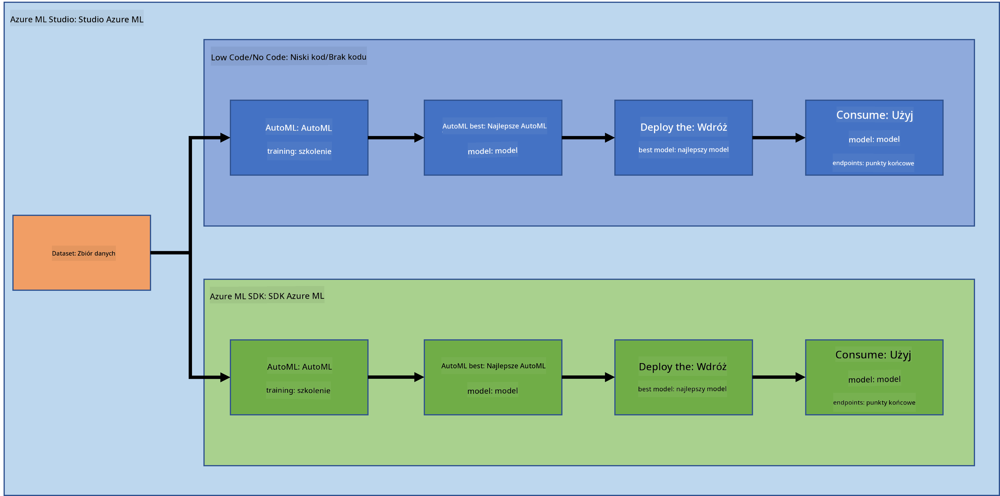

Każda z metod ma swoje zalety i wady. Podejście Low code/No code jest łatwiejsze na początek, ponieważ polega na interakcji z graficznym interfejsem użytkownika (GUI) i nie wymaga wcześniejszej znajomości kodu. Ta metoda pozwala na szybkie testowanie wykonalności projektu i tworzenie POC (Proof Of Concept). Jednakże, gdy projekt się rozwija i musi być gotowy do produkcji, tworzenie zasobów za pomocą GUI staje się niepraktyczne. Wtedy kluczowa staje się umiejętność programatycznego automatyzowania wszystkiego, od tworzenia zasobów po wdrażanie modelu. W tym miejscu znajomość Azure ML SDK staje się niezbędna.

|                   | Low code/No code | Azure ML SDK              |
|-------------------|------------------|---------------------------|
| Znajomość kodu    | Nie wymagana     | Wymagana                  |
| Czas tworzenia    | Szybko i łatwo   | Zależy od znajomości kodu |
| Gotowość produkcyjna | Nie               | Tak                       |

### 1.3 Zbiór danych dotyczący niewydolności serca:

Choroby układu krążenia (CVD) są główną przyczyną zgonów na świecie, odpowiadając za 31% wszystkich zgonów. Czynniki ryzyka środowiskowe i behawioralne, takie jak używanie tytoniu, niezdrowa dieta i otyłość, brak aktywności fizycznej oraz szkodliwe spożycie alkoholu, mogą być użyte jako cechy w modelach estymacyjnych. Możliwość oszacowania prawdopodobieństwa rozwoju CVD może być bardzo przydatna w zapobieganiu atakom u osób z grupy wysokiego ryzyka.

Kaggle udostępniło publicznie [zbiór danych dotyczący niewydolności serca](https://www.kaggle.com/andrewmvd/heart-failure-clinical-data), który wykorzystamy w tym projekcie. Możesz teraz pobrać ten zbiór danych. Jest to zbiór tabelaryczny z 13 kolumnami (12 cech i 1 zmienna docelowa) oraz 299 wierszami.

|    | Nazwa zmiennej            | Typ             | Opis                                                     | Przykład          |
|----|---------------------------|-----------------|---------------------------------------------------------|-------------------|
| 1  | age                       | numeryczny      | wiek pacjenta                                           | 25                |
| 2  | anaemia                   | logiczny        | Spadek liczby czerwonych krwinek lub hemoglobiny        | 0 lub 1           |
| 3  | creatinine_phosphokinase  | numeryczny      | Poziom enzymu CPK we krwi                               | 542               |
| 4  | diabetes                  | logiczny        | Czy pacjent ma cukrzycę                                 | 0 lub 1           |
| 5  | ejection_fraction         | numeryczny      | Procent krwi opuszczającej serce przy każdym skurczu    | 45                |
| 6  | high_blood_pressure       | logiczny        | Czy pacjent ma nadciśnienie                             | 0 lub 1           |
| 7  | platelets                 | numeryczny      | Liczba płytek krwi                                      | 149000            |
| 8  | serum_creatinine          | numeryczny      | Poziom kreatyniny w surowicy                            | 0.5               |
| 9  | serum_sodium              | numeryczny      | Poziom sodu w surowicy                                  | jun               |
| 10 | sex                       | logiczny        | kobieta lub mężczyzna                                   | 0 lub 1           |
| 11 | smoking                   | logiczny        | Czy pacjent pali                                        | 0 lub 1           |
| 12 | time                      | numeryczny      | okres obserwacji (dni)                                  | 4                 |
|----|---------------------------|-----------------|---------------------------------------------------------|-------------------|
| 21 | DEATH_EVENT [Target]      | logiczny        | Czy pacjent zmarł w trakcie okresu obserwacji           | 0 lub 1           |

Po pobraniu zbioru danych możemy rozpocząć projekt w Azure.

## 2. Trening modelu w Azure ML Studio metodą Low code/No code
### 2.1 Tworzenie przestrzeni roboczej Azure ML
Aby trenować model w Azure ML, najpierw musisz utworzyć przestrzeń roboczą Azure ML. Przestrzeń robocza to zasób najwyższego poziomu w Azure Machine Learning, zapewniający centralne miejsce do pracy ze wszystkimi artefaktami tworzonymi podczas korzystania z Azure Machine Learning. Przestrzeń robocza przechowuje historię wszystkich uruchomień treningowych, w tym logi, metryki, wyniki i migawki skryptów. Dzięki tym informacjom możesz określić, które uruchomienie treningowe wygenerowało najlepszy model. [Dowiedz się więcej](https://docs.microsoft.com/azure/machine-learning/concept-workspace?WT.mc_id=academic-77958-bethanycheum&ocid=AID3041109)

Zaleca się korzystanie z najnowszej wersji przeglądarki zgodnej z Twoim systemem operacyjnym. Obsługiwane przeglądarki to:

- Microsoft Edge (nowa wersja Microsoft Edge, najnowsza wersja. Nie Microsoft Edge legacy)
- Safari (najnowsza wersja, tylko Mac)
- Chrome (najnowsza wersja)
- Firefox (najnowsza wersja)

Aby korzystać z Azure Machine Learning, utwórz przestrzeń roboczą w swojej subskrypcji Azure. Następnie możesz używać tej przestrzeni roboczej do zarządzania danymi, zasobami obliczeniowymi, kodem, modelami i innymi artefaktami związanymi z Twoimi zadaniami uczenia maszynowego.

> **_UWAGA:_** Twoja subskrypcja Azure będzie obciążona niewielką opłatą za przechowywanie danych, dopóki przestrzeń robocza Azure Machine Learning istnieje w Twojej subskrypcji. Zalecamy usunięcie przestrzeni roboczej Azure Machine Learning, gdy przestaniesz z niej korzystać.

1. Zaloguj się do [portalu Azure](https://ms.portal.azure.com/) za pomocą poświadczeń Microsoft powiązanych z Twoją subskrypcją Azure.
2. Wybierz **＋Utwórz zasób**
   
   

   Wyszukaj Machine Learning i wybierz kafelek Machine Learning.

   

   Kliknij przycisk "Utwórz".

   

   Wypełnij ustawienia w następujący sposób:
   - Subskrypcja: Twoja subskrypcja Azure
   - Grupa zasobów: Utwórz lub wybierz grupę zasobów
   - Nazwa przestrzeni roboczej: Wprowadź unikalną nazwę dla swojej przestrzeni roboczej
   - Region: Wybierz najbliższy region geograficzny
   - Konto magazynu: Zwróć uwagę na domyślne nowe konto magazynu, które zostanie utworzone dla Twojej przestrzeni roboczej
   - Key vault: Zwróć uwagę na domyślny nowy key vault, który zostanie utworzony dla Twojej przestrzeni roboczej
   - Application insights: Zwróć uwagę na domyślny nowy zasób Application Insights, który zostanie utworzony dla Twojej przestrzeni roboczej
   - Rejestr kontenerów: Brak (zostanie utworzony automatycznie przy pierwszym wdrożeniu modelu do kontenera)

    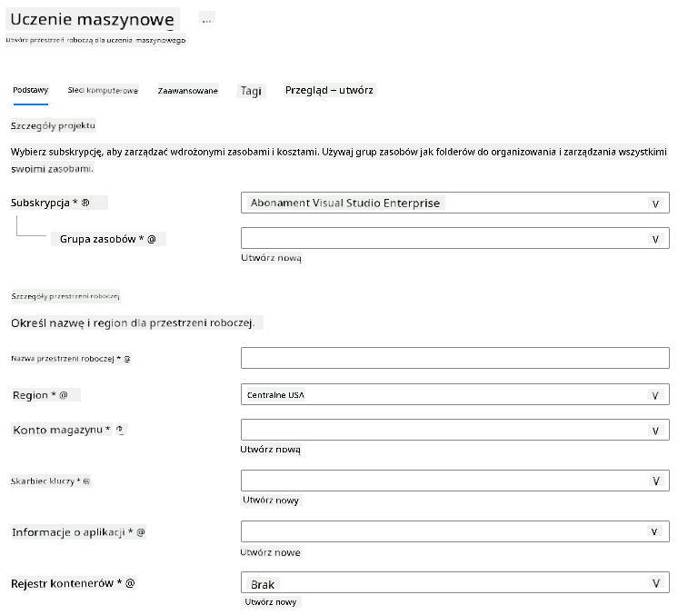

   - Kliknij przycisk "Utwórz + przejrzyj", a następnie przycisk "Utwórz".
3. Poczekaj, aż Twoja przestrzeń robocza zostanie utworzona (może to potrwać kilka minut). Następnie przejdź do niej w portalu. Możesz ją znaleźć za pomocą usługi Azure Machine Learning.
4. Na stronie przeglądu swojej przestrzeni roboczej uruchom Azure Machine Learning Studio (lub otwórz nową kartę przeglądarki i przejdź do https://ml.azure.com), a następnie zaloguj się do Azure Machine Learning Studio za pomocą swojego konta Microsoft. Jeśli zostaniesz o to poproszony, wybierz swój katalog i subskrypcję Azure oraz swoją przestrzeń roboczą Azure Machine Learning.
   
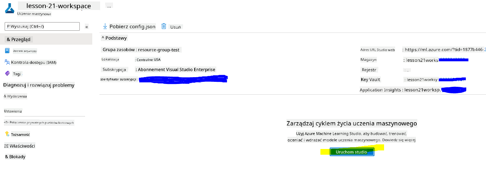

5. W Azure Machine Learning Studio przełącz ikonę ☰ w lewym górnym rogu, aby zobaczyć różne strony w interfejsie. Możesz używać tych stron do zarządzania zasobami w swojej przestrzeni roboczej.

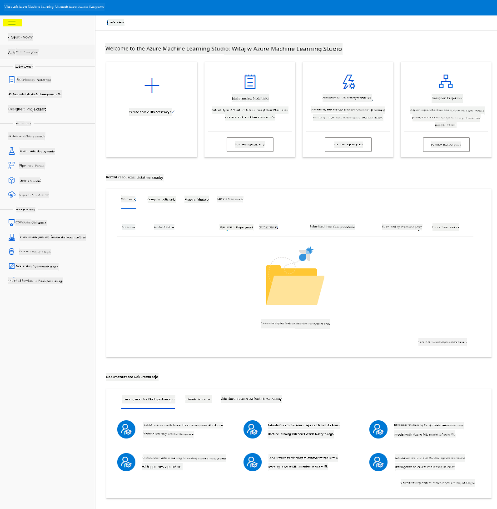

Możesz zarządzać swoją przestrzenią roboczą za pomocą portalu Azure, ale dla data scientistów i inżynierów operacji uczenia maszynowego Azure Machine Learning Studio oferuje bardziej skoncentrowany interfejs użytkownika do zarządzania zasobami przestrzeni roboczej.

### 2.2 Zasoby obliczeniowe

Zasoby obliczeniowe to zasoby w chmurze, na których możesz uruchamiać procesy trenowania modeli i eksploracji danych. Możesz utworzyć cztery rodzaje zasobów obliczeniowych:

- **Compute Instances**: Stacje robocze dla data scientistów do pracy z danymi i modelami. Obejmuje to tworzenie maszyny wirtualnej (VM) i uruchamianie instancji notebooka. Możesz następnie trenować model, wywołując klaster obliczeniowy z poziomu notebooka.
- **Compute Clusters**: Skalowalne klastry maszyn wirtualnych do przetwarzania kodu eksperymentu na żądanie. Będziesz ich potrzebować podczas trenowania modelu. Klastry obliczeniowe mogą również korzystać ze specjalistycznych zasobów GPU lub CPU.
- **Inference Clusters**: Cele wdrożeniowe dla usług predykcyjnych wykorzystujących Twoje wytrenowane modele.
- **Attached Compute**: Łącza do istniejących zasobów obliczeniowych Azure, takich jak maszyny wirtualne czy klastry Azure Databricks.

#### 2.2.1 Wybór odpowiednich opcji dla zasobów obliczeniowych

Przy tworzeniu zasobu obliczeniowego należy wziąć pod uwagę kilka kluczowych czynników, które mogą być istotne dla podejmowanych decyzji.

**Potrzebujesz CPU czy GPU?**

CPU (Central Processing Unit) to układ elektroniczny wykonujący instrukcje składające się na program komputerowy. GPU (Graphics Processing Unit) to wyspecjalizowany układ elektroniczny, który może wykonywać kod związany z grafiką w bardzo szybkim tempie.

Główna różnica między architekturą CPU a GPU polega na tym, że CPU jest zaprojektowane do szybkiego wykonywania szerokiego zakresu zadań (mierzonego prędkością zegara CPU), ale ma ograniczoną równoległość zadań, które mogą być wykonywane jednocześnie. GPU są zaprojektowane do obliczeń równoległych, dzięki czemu znacznie lepiej nadają się do zadań związanych z uczeniem głębokim.

| CPU                                     | GPU                         |
|-----------------------------------------|-----------------------------|
| Mniej kosztowne                         | Bardziej kosztowne          |
| Niższy poziom równoległości             | Wyższy poziom równoległości |
| Wolniejsze w trenowaniu modeli uczenia głębokiego | Optymalne dla uczenia głębokiego |

**Rozmiar klastra**

Większe klastry są droższe, ale zapewniają lepszą responsywność. Dlatego, jeśli masz czas, ale ograniczone środki finansowe, powinieneś zacząć od małego klastra. Natomiast jeśli masz środki finansowe, ale mało czasu, powinieneś zacząć od większego klastra.

**Rozmiar maszyny wirtualnej**

W zależności od ograniczeń czasowych i budżetowych możesz zmieniać rozmiar pamięci RAM, dysku, liczbę rdzeni i prędkość zegara. Zwiększenie tych parametrów będzie kosztowniejsze, ale zapewni lepszą wydajność.

**Dedykowane czy instancje o niskim priorytecie?**

Instancja o niskim priorytecie oznacza, że jest przerywalna: Microsoft Azure może przejąć te zasoby i przypisać je do innego zadania, przerywając pracę. Instancja dedykowana, czyli nieprzerywalna, oznacza, że praca nigdy nie zostanie zakończona bez Twojej zgody. 
To kolejny aspekt wyboru między czasem a kosztami, ponieważ instancje przerywalne są tańsze niż dedykowane.

#### 2.2.2 Tworzenie klastra obliczeniowego

W [Azure ML workspace](https://ml.azure.com/), który utworzyliśmy wcześniej, przejdź do sekcji Compute, gdzie zobaczysz różne zasoby obliczeniowe, o których właśnie rozmawialiśmy (tj. instancje obliczeniowe, klastry obliczeniowe, klastry inferencyjne i podłączone zasoby obliczeniowe). W tym projekcie będziemy potrzebować klastra obliczeniowego do trenowania modelu. W Studio kliknij menu "Compute", następnie zakładkę "Compute cluster" i kliknij przycisk "+ New", aby utworzyć klaster obliczeniowy.

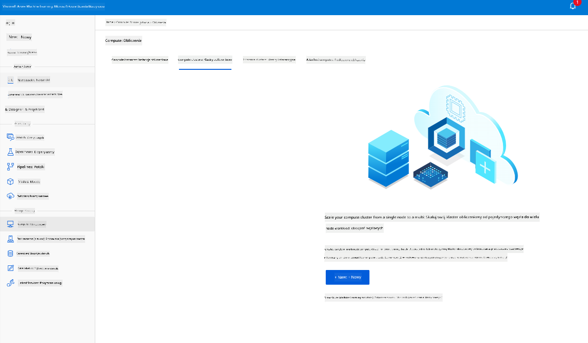

1. Wybierz opcje: Dedykowane vs Niski priorytet, CPU lub GPU, rozmiar maszyny wirtualnej i liczbę rdzeni (możesz zachować domyślne ustawienia dla tego projektu).
2. Kliknij przycisk Next.

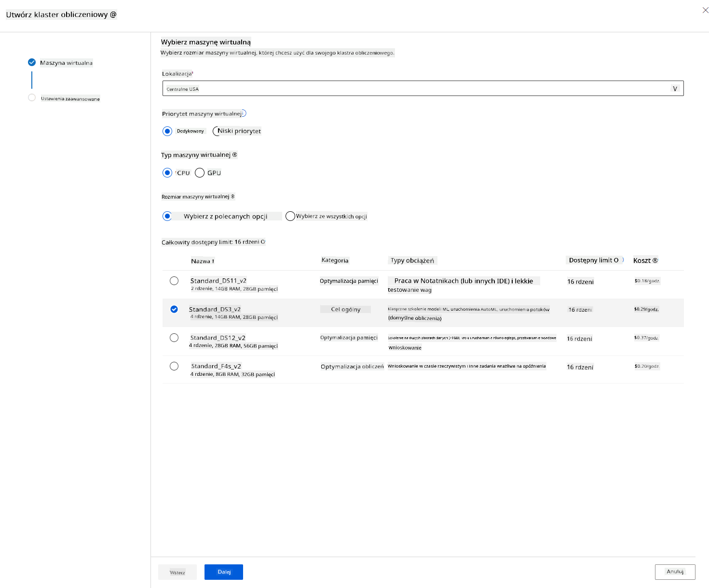

3. Nadaj klastrowi nazwę obliczeniową.
4. Wybierz opcje: Minimalna/maksymalna liczba węzłów, czas bezczynności przed skalowaniem w dół, dostęp SSH. Zauważ, że jeśli minimalna liczba węzłów wynosi 0, zaoszczędzisz pieniądze, gdy klaster będzie bezczynny. Zauważ, że im wyższa liczba maksymalnych węzłów, tym krótszy czas trenowania. Zalecana maksymalna liczba węzłów to 3.  
5. Kliknij przycisk "Create". Ten krok może zająć kilka minut.

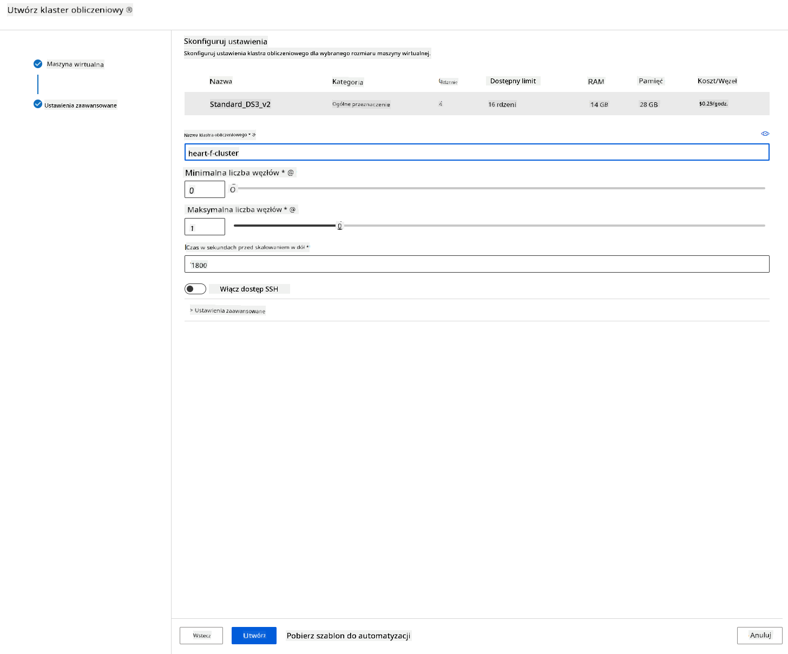

Świetnie! Teraz, gdy mamy klaster obliczeniowy, musimy załadować dane do Azure ML Studio.

### 2.3 Ładowanie zbioru danych

1. W [Azure ML workspace](https://ml.azure.com/), który utworzyliśmy wcześniej, kliknij "Datasets" w lewym menu i kliknij przycisk "+ Create dataset", aby utworzyć zbiór danych. Wybierz opcję "From local files" i wybierz zbiór danych Kaggle, który wcześniej pobraliśmy.
   
   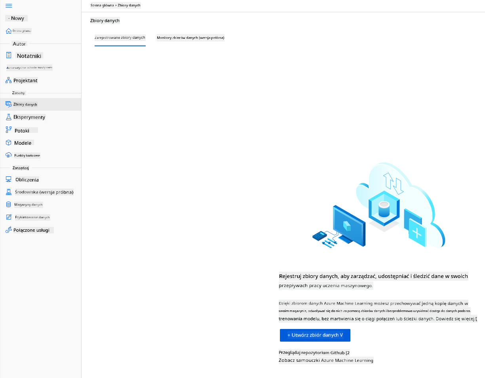

2. Nadaj swojemu zbiorowi danych nazwę, typ i opis. Kliknij Next. Prześlij dane z plików. Kliknij Next.
   
   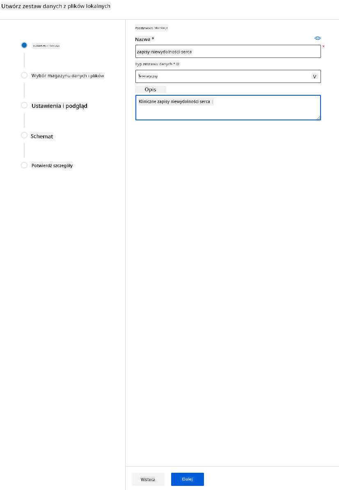

3. W sekcji Schema zmień typ danych na Boolean dla następujących cech: anaemia, diabetes, high blood pressure, sex, smoking i DEATH_EVENT. Kliknij Next, a następnie Create.
   
   

Świetnie! Teraz, gdy zbiór danych jest gotowy, a klaster obliczeniowy utworzony, możemy rozpocząć trenowanie modelu!

### 2.4 Trenowanie z AutoML bez kodowania lub z minimalnym kodowaniem

Tradycyjne tworzenie modeli uczenia maszynowego jest zasobożerne, wymaga znacznej wiedzy dziedzinowej i czasu na stworzenie oraz porównanie dziesiątek modeli. 
Automatyczne uczenie maszynowe (AutoML) to proces automatyzacji czasochłonnych, iteracyjnych zadań związanych z tworzeniem modeli uczenia maszynowego. Pozwala naukowcom danych, analitykom i programistom budować modele ML na dużą skalę, efektywnie i produktywnie, jednocześnie utrzymując wysoką jakość modeli. Skraca czas potrzebny na uzyskanie modeli ML gotowych do produkcji, zapewniając łatwość i efektywność. [Dowiedz się więcej](https://docs.microsoft.com/azure/machine-learning/concept-automated-ml?WT.mc_id=academic-77958-bethanycheum&ocid=AID3041109)

1. W [Azure ML workspace](https://ml.azure.com/), który utworzyliśmy wcześniej, kliknij "Automated ML" w lewym menu i wybierz zbiór danych, który właśnie przesłałeś. Kliknij Next.

   

2. Wprowadź nazwę nowego eksperymentu, kolumnę docelową (DEATH_EVENT) oraz klaster obliczeniowy, który utworzyliśmy. Kliknij Next.
   
   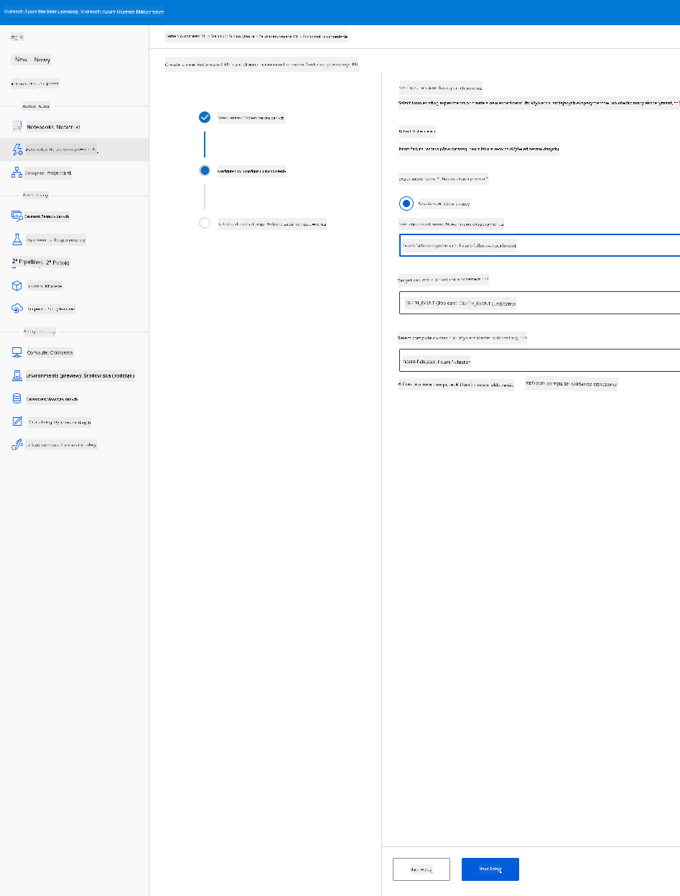

3. Wybierz "Classification" i kliknij Finish. Ten krok może zająć od 30 minut do 1 godziny, w zależności od rozmiaru klastra obliczeniowego.
    
    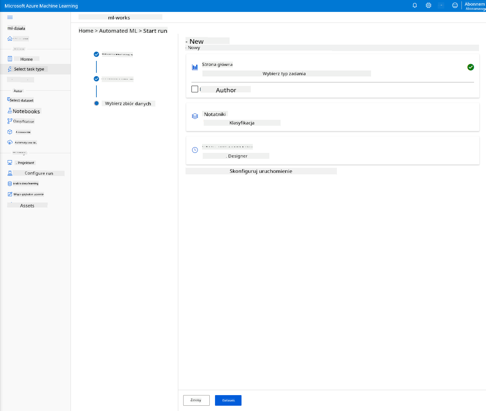

4. Po zakończeniu uruchomienia kliknij zakładkę "Automated ML", kliknij swoje uruchomienie, a następnie kliknij algorytm w karcie "Best model summary".
    
    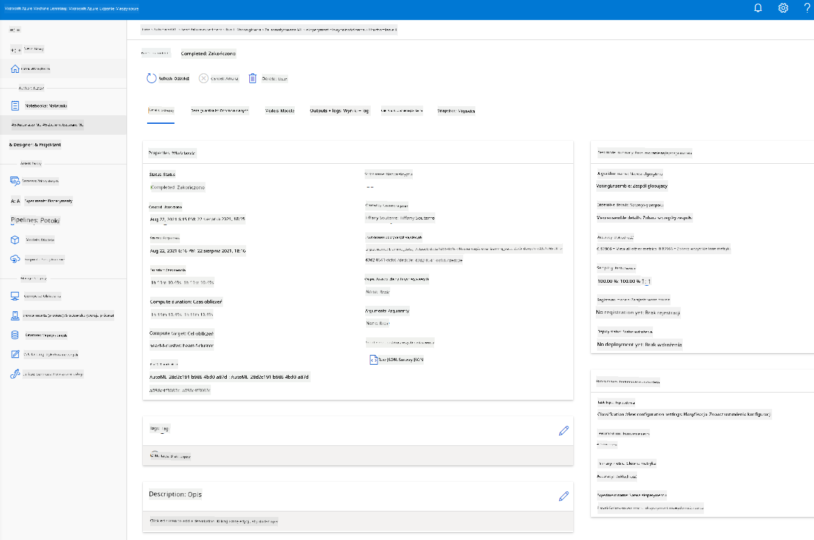

Tutaj możesz zobaczyć szczegółowy opis najlepszego modelu wygenerowanego przez AutoML. Możesz również eksplorować inne modele w zakładce Models. Poświęć kilka minut na eksplorację modeli w sekcji Explanations (przycisk preview). Gdy wybierzesz model, który chcesz użyć (tutaj wybierzemy najlepszy model wybrany przez AutoML), zobaczymy, jak można go wdrożyć.

## 3. Wdrożenie modelu bez kodowania lub z minimalnym kodowaniem oraz konsumpcja punktu końcowego
### 3.1 Wdrożenie modelu

Interfejs automatycznego uczenia maszynowego pozwala na wdrożenie najlepszego modelu jako usługi internetowej w kilku krokach. Wdrożenie to integracja modelu, aby mógł dokonywać prognoz na podstawie nowych danych i identyfikować potencjalne obszary możliwości. W tym projekcie wdrożenie jako usługi internetowej oznacza, że aplikacje medyczne będą mogły korzystać z modelu, aby dokonywać prognoz na żywo dotyczących ryzyka zawału serca u pacjentów.

W opisie najlepszego modelu kliknij przycisk "Deploy".
    
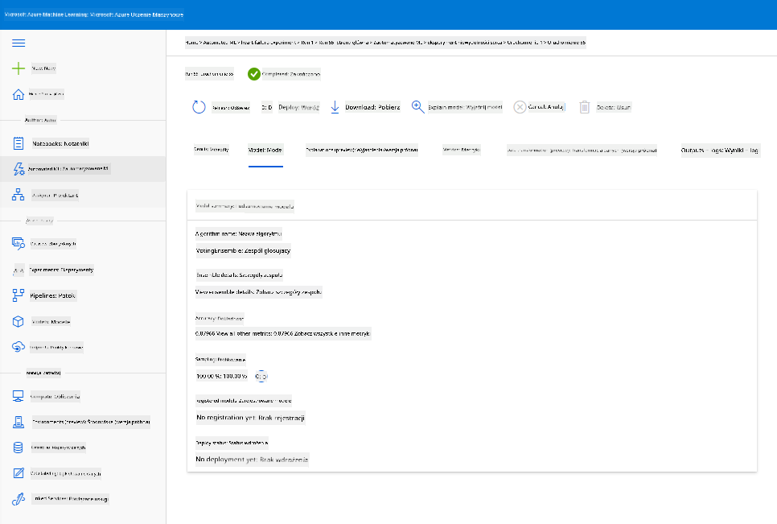

15. Nadaj nazwę, opis, typ obliczeń (Azure Container Instance), włącz uwierzytelnianie i kliknij Deploy. Ten krok może zająć około 20 minut. Proces wdrożenia obejmuje kilka kroków, w tym rejestrację modelu, generowanie zasobów i ich konfigurację dla usługi internetowej. Pod wiadomością o statusie wdrożenia pojawi się komunikat. Wybierz Refresh, aby okresowo sprawdzać status wdrożenia. Model jest wdrożony i działa, gdy status to "Healthy".

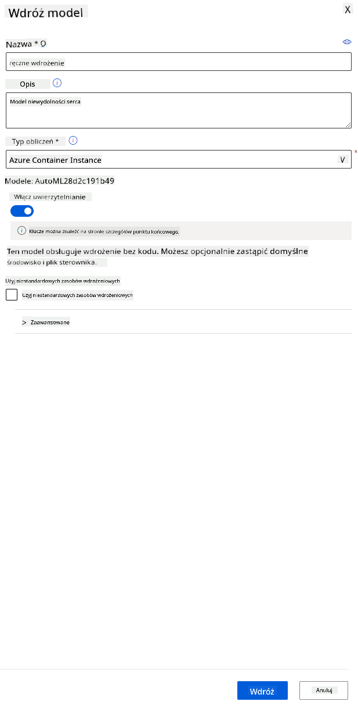

16. Po wdrożeniu kliknij zakładkę Endpoint i wybierz punkt końcowy, który właśnie wdrożyłeś. Znajdziesz tutaj wszystkie szczegóły dotyczące punktu końcowego.

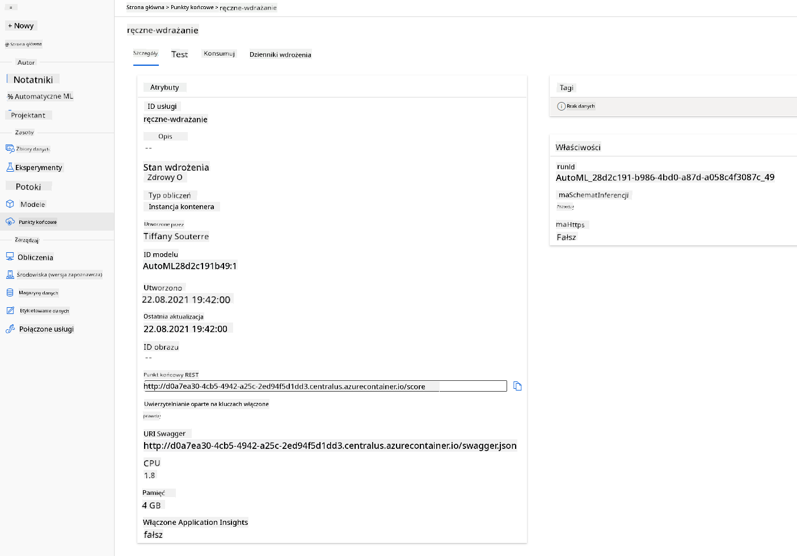

Niesamowite! Teraz, gdy mamy wdrożony model, możemy rozpocząć konsumpcję punktu końcowego.

### 3.2 Konsumpcja punktu końcowego

Kliknij zakładkę "Consume". Tutaj znajdziesz punkt końcowy REST oraz skrypt w Pythonie w opcji konsumpcji. Poświęć chwilę na przeczytanie kodu w Pythonie.

Ten skrypt można uruchomić bezpośrednio z lokalnego komputera i będzie on konsumował Twój punkt końcowy.

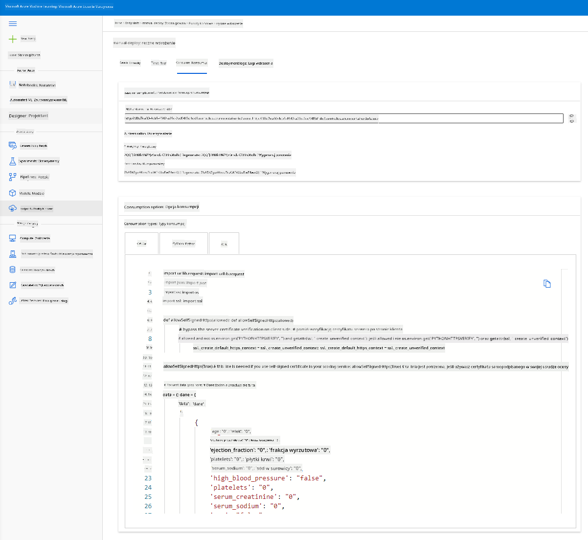

Zwróć uwagę na te dwie linie kodu:

```python
url = 'http://98e3715f-xxxx-xxxx-xxxx-9ec22d57b796.centralus.azurecontainer.io/score'
api_key = '' # Replace this with the API key for the web service
```
Zmienna `url` to punkt końcowy REST znaleziony w zakładce consume, a zmienna `api_key` to klucz główny również znaleziony w zakładce consume (tylko w przypadku, gdy włączyłeś uwierzytelnianie). Tak właśnie skrypt konsumuje punkt końcowy.

18. Po uruchomieniu skryptu powinieneś zobaczyć następujący wynik:
    ```python
    b'"{\\"result\\": [true]}"'
    ```
Oznacza to, że prognoza niewydolności serca dla podanych danych jest prawdziwa. To ma sens, ponieważ jeśli przyjrzysz się bliżej danym automatycznie wygenerowanym w skrypcie, wszystko jest ustawione na 0 i false domyślnie. Możesz zmienić dane na następujący przykład wejściowy:

```python
data = {
    "data":
    [
        {
            'age': "0",
            'anaemia': "false",
            'creatinine_phosphokinase': "0",
            'diabetes': "false",
            'ejection_fraction': "0",
            'high_blood_pressure': "false",
            'platelets': "0",
            'serum_creatinine': "0",
            'serum_sodium': "0",
            'sex': "false",
            'smoking': "false",
            'time': "0",
        },
        {
            'age': "60",
            'anaemia': "false",
            'creatinine_phosphokinase': "500",
            'diabetes': "false",
            'ejection_fraction': "38",
            'high_blood_pressure': "false",
            'platelets': "260000",
            'serum_creatinine': "1.40",
            'serum_sodium': "137",
            'sex': "false",
            'smoking': "false",
            'time': "130",
        },
    ],
}
```
Skrypt powinien zwrócić:
    ```python
    b'"{\\"result\\": [true, false]}"'
    ```

Gratulacje! Właśnie skonsumowałeś wdrożony model i wytrenowałeś go na Azure ML!

> **_NOTE:_** Po zakończeniu projektu nie zapomnij usunąć wszystkich zasobów.
## 🚀 Wyzwanie

Przyjrzyj się dokładnie wyjaśnieniom modelu i szczegółom, które AutoML wygenerował dla najlepszych modeli. Spróbuj zrozumieć, dlaczego najlepszy model jest lepszy od innych. Jakie algorytmy były porównywane? Jakie są różnice między nimi? Dlaczego najlepszy model działa lepiej w tym przypadku?

## [Post-lecture quiz](https://ff-quizzes.netlify.app/en/ds/)

## Przegląd i samodzielna nauka

W tej lekcji nauczyłeś się, jak trenować, wdrażać i konsumować model do prognozowania ryzyka niewydolności serca w sposób bez kodowania lub z minimalnym kodowaniem w chmurze. Jeśli jeszcze tego nie zrobiłeś, zagłęb się w wyjaśnienia modelu wygenerowane przez AutoML dla najlepszych modeli i spróbuj zrozumieć, dlaczego najlepszy model jest lepszy od innych.

Możesz zgłębić temat AutoML bez kodowania lub z minimalnym kodowaniem, czytając tę [dokumentację](https://docs.microsoft.com/azure/machine-learning/tutorial-first-experiment-automated-ml?WT.mc_id=academic-77958-bethanycheum&ocid=AID3041109).

## Zadanie

[Projekt Data Science bez kodowania lub z minimalnym kodowaniem na Azure ML](assignment.md)

---

**Zastrzeżenie**:  
Ten dokument został przetłumaczony za pomocą usługi tłumaczeniowej AI [Co-op Translator](https://github.com/Azure/co-op-translator). Chociaż dokładamy wszelkich starań, aby tłumaczenie było precyzyjne, prosimy pamiętać, że automatyczne tłumaczenia mogą zawierać błędy lub nieścisłości. Oryginalny dokument w jego rodzimym języku powinien być uznawany za wiarygodne źródło. W przypadku informacji krytycznych zaleca się skorzystanie z profesjonalnego tłumaczenia wykonanego przez człowieka. Nie ponosimy odpowiedzialności za jakiekolwiek nieporozumienia lub błędne interpretacje wynikające z korzystania z tego tłumaczenia.