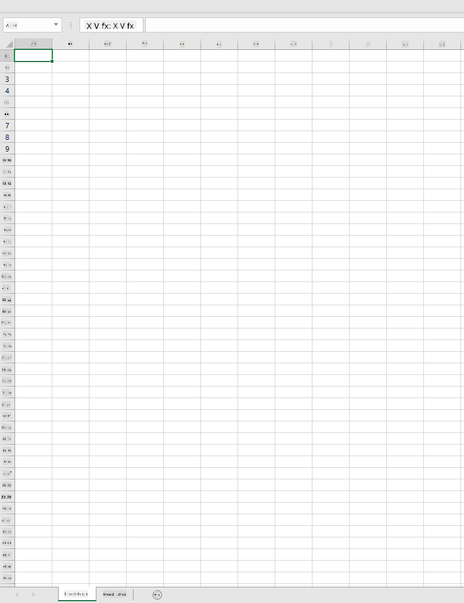
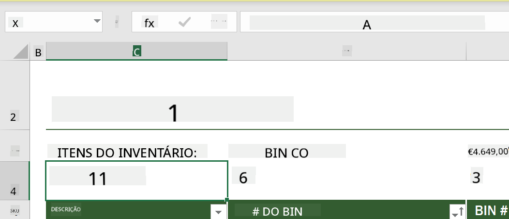
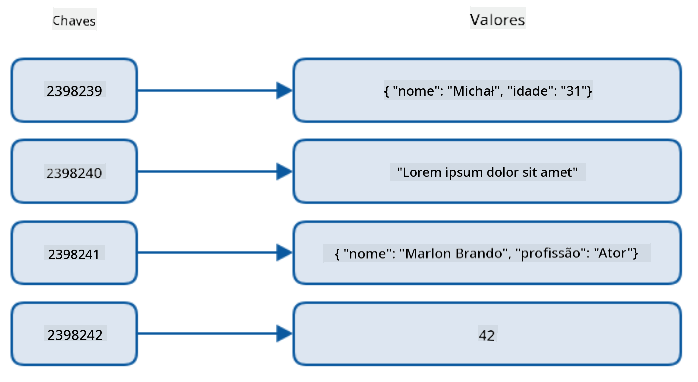
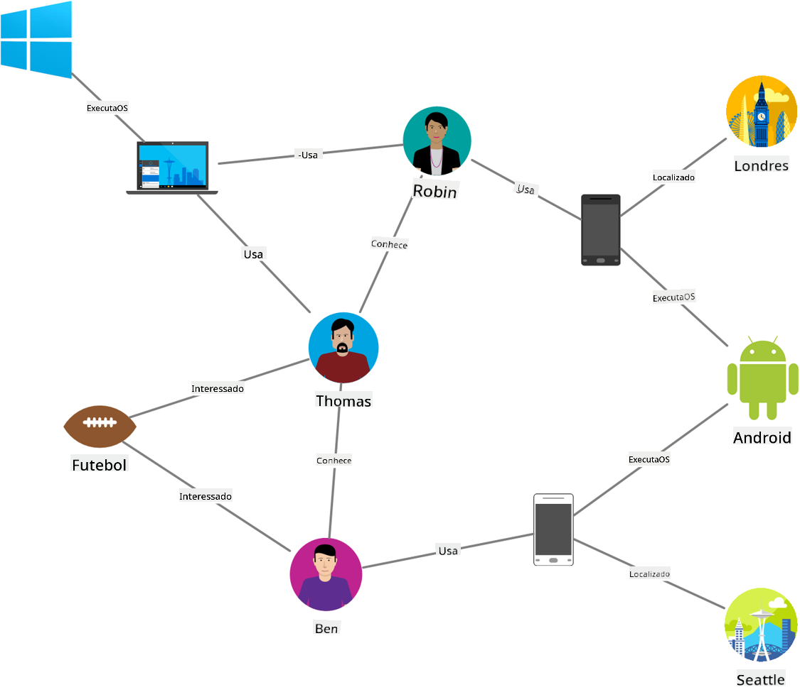
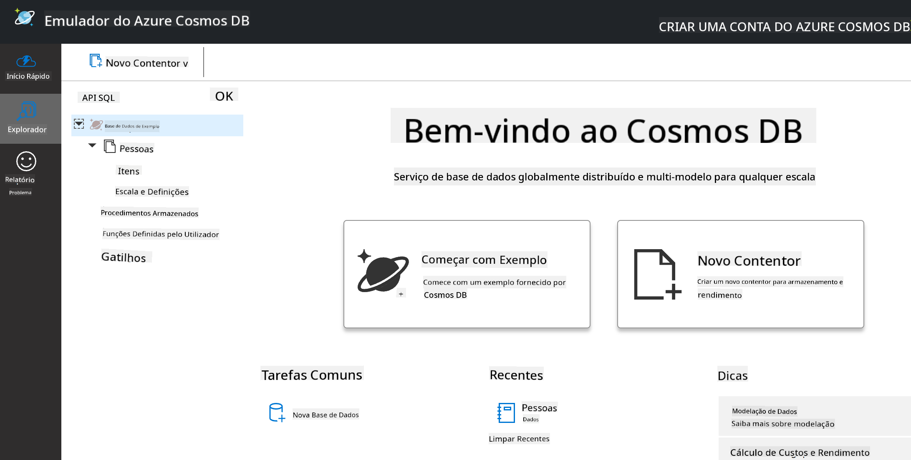
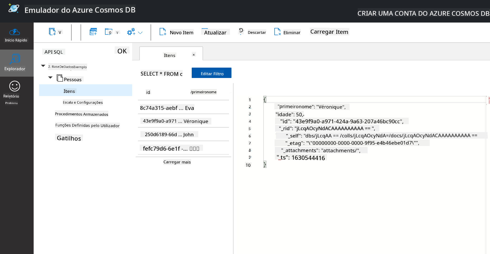

<!--
CO_OP_TRANSLATOR_METADATA:
{
  "original_hash": "54c5a1c74aecb69d2f9099300a4b7eea",
  "translation_date": "2025-09-04T13:39:29+00:00",
  "source_file": "2-Working-With-Data/06-non-relational/README.md",
  "language_code": "pt"
}
-->
# Trabalhar com Dados: Dados Não-Relacionais

| ](../../sketchnotes/06-NoSQL.png)|
|:---:|
|Trabalhar com Dados NoSQL - _Sketchnote por [@nitya](https://twitter.com/nitya)_ |

## [Questionário Pré-Aula](https://purple-hill-04aebfb03.1.azurestaticapps.net/quiz/10)

Os dados não estão limitados a bases de dados relacionais. Esta lição foca em dados não-relacionais e abordará os fundamentos de folhas de cálculo e NoSQL.

## Folhas de Cálculo

As folhas de cálculo são uma forma popular de armazenar e explorar dados porque exigem menos trabalho para configurar e começar. Nesta lição, vais aprender os componentes básicos de uma folha de cálculo, bem como fórmulas e funções. Os exemplos serão ilustrados com o Microsoft Excel, mas a maioria das partes e tópicos terá nomes e passos semelhantes em comparação com outros softwares de folhas de cálculo.



Uma folha de cálculo é um ficheiro e estará acessível no sistema de ficheiros de um computador, dispositivo ou sistema de ficheiros baseado na nuvem. O software em si pode ser baseado no navegador ou uma aplicação que deve ser instalada num computador ou descarregada como uma app. No Excel, estes ficheiros também são definidos como **livros de trabalho** e esta terminologia será usada ao longo desta lição.

Um livro de trabalho contém uma ou mais **folhas**, onde cada folha é identificada por abas. Dentro de uma folha, há retângulos chamados **células**, que contêm os dados reais. Uma célula é a interseção de uma linha e uma coluna, onde as colunas são identificadas por caracteres alfabéticos e as linhas por números. Algumas folhas de cálculo contêm cabeçalhos nas primeiras linhas para descrever os dados numa célula.

Com estes elementos básicos de um livro de trabalho do Excel, usaremos um exemplo dos [Modelos da Microsoft](https://templates.office.com/) focado num inventário para explorar algumas partes adicionais de uma folha de cálculo.

### Gerir um Inventário

O ficheiro de folha de cálculo chamado "InventoryExample" é uma folha formatada de itens dentro de um inventário que contém três folhas, onde as abas estão identificadas como "Inventory List", "Inventory Pick List" e "Bin Lookup". A linha 4 da folha Inventory List é o cabeçalho, que descreve o valor de cada célula na coluna do cabeçalho.


Existem casos em que uma célula depende dos valores de outras células para gerar o seu valor. A folha Inventory List mantém o registo do custo de cada item no inventário, mas e se precisarmos de saber o valor total de tudo no inventário? [**Fórmulas**](https://support.microsoft.com/en-us/office/overview-of-formulas-34519a4e-1e8d-4f4b-84d4-d642c4f63263) realizam ações nos dados das células e são usadas para calcular o custo do inventário neste exemplo. Esta folha usou uma fórmula na coluna Inventory Value para calcular o valor de cada item multiplicando a quantidade sob o cabeçalho QTY e os custos pelas células sob o cabeçalho COST. Ao clicar duas vezes ou destacar uma célula, será exibida a fórmula. Vais notar que as fórmulas começam com um sinal de igual, seguido pelo cálculo ou operação.



Podemos usar outra fórmula para somar todos os valores de Inventory Value e obter o valor total. Isto poderia ser calculado somando cada célula para gerar a soma, mas isso pode ser uma tarefa tediosa. O Excel tem [**funções**](https://support.microsoft.com/en-us/office/sum-function-043e1c7d-7726-4e80-8f32-07b23e057f89), ou fórmulas predefinidas para realizar cálculos nos valores das células. As funções requerem argumentos, que são os valores necessários para realizar esses cálculos. Quando as funções requerem mais de um argumento, eles precisam ser listados numa ordem específica ou a função pode não calcular o valor correto. Este exemplo usa a função SUM e utiliza os valores de Inventory Value como argumento para gerar o total listado na linha 3, coluna B (também referida como B3).

## NoSQL

NoSQL é um termo abrangente para as diferentes formas de armazenar dados não-relacionais e pode ser interpretado como "não-SQL", "não-relacional" ou "não apenas SQL". Estes tipos de sistemas de bases de dados podem ser categorizados em 4 tipos.


> Fonte: [Blog de Michał Białecki](https://www.michalbialecki.com/2018/03/18/azure-cosmos-db-key-value-database-cloud/)

Bases de dados [chave-valor](https://docs.microsoft.com/en-us/azure/architecture/data-guide/big-data/non-relational-data#keyvalue-data-stores) associam chaves únicas, que são identificadores únicos associados a um valor. Estas associações são armazenadas usando uma [tabela de hash](https://www.hackerearth.com/practice/data-structures/hash-tables/basics-of-hash-tables/tutorial/) com uma função de hash apropriada.


> Fonte: [Microsoft](https://docs.microsoft.com/en-us/azure/cosmos-db/graph/graph-introduction#graph-database-by-example)

Bases de dados [grafo](https://docs.microsoft.com/en-us/azure/architecture/data-guide/big-data/non-relational-data#graph-data-stores) descrevem relações nos dados e são representadas como uma coleção de nós e arestas. Um nó representa uma entidade, algo que existe no mundo real, como um estudante ou um extrato bancário. As arestas representam a relação entre duas entidades. Cada nó e aresta têm propriedades que fornecem informações adicionais sobre cada um deles.


Armazenamentos de dados [colunar](https://docs.microsoft.com/en-us/azure/architecture/data-guide/big-data/non-relational-data#columnar-data-stores) organizam dados em colunas e linhas como uma estrutura de dados relacional, mas cada coluna é dividida em grupos chamados famílias de colunas, onde todos os dados sob uma coluna estão relacionados e podem ser recuperados e alterados como uma unidade.

### Armazenamentos de Dados Documentais com o Azure Cosmos DB

Armazenamentos de dados [documentais](https://docs.microsoft.com/en-us/azure/architecture/data-guide/big-data/non-relational-data#document-data-stores) baseiam-se no conceito de armazenamento de dados chave-valor e são compostos por uma série de campos e objetos. Esta secção explorará bases de dados documentais com o emulador do Cosmos DB.

Uma base de dados do Cosmos DB encaixa na definição de "Não Apenas SQL", onde a base de dados documental do Cosmos DB depende de SQL para consultar os dados. A [lição anterior](../05-relational-databases/README.md) sobre SQL cobre os fundamentos da linguagem, e poderemos aplicar algumas das mesmas consultas a uma base de dados documental aqui. Usaremos o Emulador do Cosmos DB, que nos permite criar e explorar uma base de dados documental localmente num computador. Lê mais sobre o Emulador [aqui](https://docs.microsoft.com/en-us/azure/cosmos-db/local-emulator?tabs=ssl-netstd21).

Um documento é uma coleção de campos e valores de objetos, onde os campos descrevem o que o valor do objeto representa. Abaixo está um exemplo de um documento.

```json
{
    "firstname": "Eva",
    "age": 44,
    "id": "8c74a315-aebf-4a16-bb38-2430a9896ce5",
    "_rid": "bHwDAPQz8s0BAAAAAAAAAA==",
    "_self": "dbs/bHwDAA==/colls/bHwDAPQz8s0=/docs/bHwDAPQz8s0BAAAAAAAAAA==/",
    "_etag": "\"00000000-0000-0000-9f95-010a691e01d7\"",
    "_attachments": "attachments/",
    "_ts": 1630544034
}
```

Os campos de interesse neste documento são: `firstname`, `id` e `age`. Os restantes campos com os sublinhados foram gerados pelo Cosmos DB.

#### Explorar Dados com o Emulador do Cosmos DB

Podes descarregar e instalar o emulador [para Windows aqui](https://aka.ms/cosmosdb-emulator). Consulta esta [documentação](https://docs.microsoft.com/en-us/azure/cosmos-db/local-emulator?tabs=ssl-netstd21#run-on-linux-macos) para opções sobre como executar o Emulador em macOS e Linux.

O Emulador abre uma janela no navegador, onde a vista Explorer permite explorar documentos.



Se estiveres a seguir os passos, clica em "Start with Sample" para gerar uma base de dados de exemplo chamada SampleDB. Se expandires o SampleDB clicando na seta, encontrarás um contentor chamado `Persons`. Um contentor contém uma coleção de itens, que são os documentos dentro do contentor. Podes explorar os quatro documentos individuais sob `Items`.



#### Consultar Dados Documentais com o Emulador do Cosmos DB

Também podemos consultar os dados de exemplo clicando no botão de nova consulta SQL (segundo botão da esquerda).

`SELECT * FROM c` retorna todos os documentos no contentor. Vamos adicionar uma cláusula where e encontrar todos com menos de 40 anos.

`SELECT * FROM c where c.age < 40`


A consulta retorna dois documentos, nota que o valor de age para cada documento é menor que 40.

#### JSON e Documentos

Se estás familiarizado com JavaScript Object Notation (JSON), vais notar que os documentos são semelhantes ao JSON. Há um ficheiro `PersonsData.json` neste diretório com mais dados que podes carregar no contentor Persons no Emulador através do botão `Upload Item`.

Na maioria dos casos, APIs que retornam dados JSON podem ser diretamente transferidas e armazenadas em bases de dados documentais. Abaixo está outro documento, que representa tweets da conta de Twitter da Microsoft, recuperados usando a API do Twitter e inseridos no Cosmos DB.

```json
{
    "created_at": "2021-08-31T19:03:01.000Z",
    "id": "1432780985872142341",
    "text": "Blank slate. Like this tweet if you’ve ever painted in Microsoft Paint before. https://t.co/cFeEs8eOPK",
    "_rid": "dhAmAIUsA4oHAAAAAAAAAA==",
    "_self": "dbs/dhAmAA==/colls/dhAmAIUsA4o=/docs/dhAmAIUsA4oHAAAAAAAAAA==/",
    "_etag": "\"00000000-0000-0000-9f84-a0958ad901d7\"",
    "_attachments": "attachments/",
    "_ts": 1630537000
```

Os campos de interesse neste documento são: `created_at`, `id` e `text`.

## 🚀 Desafio

Há um ficheiro `TwitterData.json` que podes carregar na base de dados SampleDB. Recomenda-se que o adiciones a um contentor separado. Isto pode ser feito por:

1. Clicar no botão de novo contentor no canto superior direito
1. Selecionar a base de dados existente (SampleDB), criar um id de contentor para o contentor
1. Definir a chave de partição como `/id`
1. Clicar em OK (podes ignorar o resto das informações nesta vista, pois este é um conjunto de dados pequeno a ser executado localmente na tua máquina)
1. Abrir o novo contentor e carregar o ficheiro de Dados do Twitter com o botão `Upload Item`

Tenta executar algumas consultas SELECT para encontrar os documentos que têm "Microsoft" no campo text. Dica: tenta usar a [palavra-chave LIKE](https://docs.microsoft.com/en-us/azure/cosmos-db/sql/sql-query-keywords#using-like-with-the--wildcard-character).

## [Questionário Pós-Aula](https://ff-quizzes.netlify.app/en/ds/)

## Revisão & Estudo Individual

- Há algumas formatações e funcionalidades adicionais adicionadas a esta folha de cálculo que esta lição não aborda. A Microsoft tem uma [grande biblioteca de documentação e vídeos](https://support.microsoft.com/excel) sobre Excel, caso estejas interessado em aprender mais.

- Esta documentação arquitetural detalha as características nos diferentes tipos de dados não-relacionais: [Dados Não-Relacionais e NoSQL](https://docs.microsoft.com/en-us/azure/architecture/data-guide/big-data/non-relational-data)

- O Cosmos DB é uma base de dados não-relacional baseada na nuvem que também pode armazenar os diferentes tipos de NoSQL mencionados nesta lição. Aprende mais sobre estes tipos neste [Módulo de Aprendizagem do Cosmos DB da Microsoft](https://docs.microsoft.com/en-us/learn/paths/work-with-nosql-data-in-azure-cosmos-db/)

## Tarefa

[Soda Profits](assignment.md)

---

**Aviso Legal**:  
Este documento foi traduzido utilizando o serviço de tradução por IA [Co-op Translator](https://github.com/Azure/co-op-translator). Embora nos esforcemos para garantir a precisão, esteja ciente de que traduções automáticas podem conter erros ou imprecisões. O documento original no seu idioma nativo deve ser considerado a fonte oficial. Para informações críticas, recomenda-se a tradução profissional humana. Não nos responsabilizamos por quaisquer mal-entendidos ou interpretações incorretas resultantes do uso desta tradução.