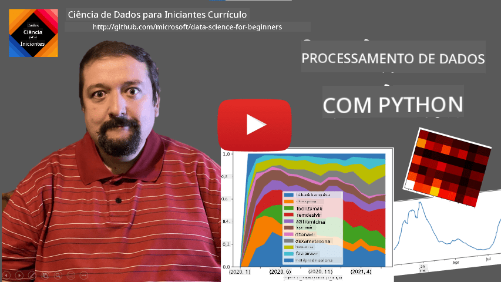
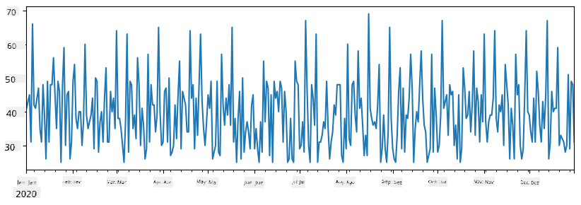
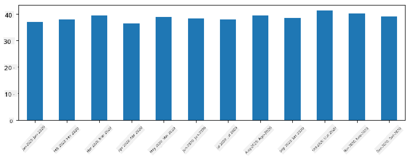
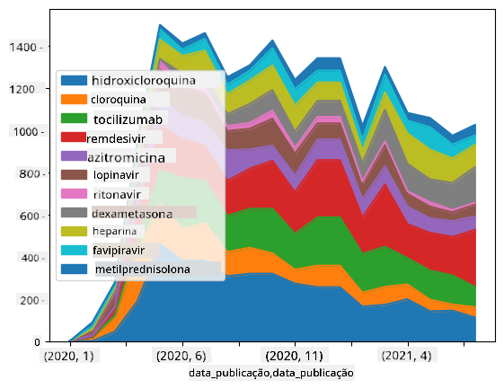

<!--
CO_OP_TRANSLATOR_METADATA:
{
  "original_hash": "57f7db1f4c3ae3361c1d1fbafcdd690c",
  "translation_date": "2025-09-04T13:40:14+00:00",
  "source_file": "2-Working-With-Data/07-python/README.md",
  "language_code": "pt"
}
-->
# Trabalhar com Dados: Python e a Biblioteca Pandas

|  ](../../sketchnotes/07-WorkWithPython.png) |
| :-------------------------------------------------------------------------------------------------------: |
|                 Trabalhar com Python - _Sketchnote por [@nitya](https://twitter.com/nitya)_                 |

[](https://youtu.be/dZjWOGbsN4Y)

Embora bases de dados ofereçam formas muito eficientes de armazenar e consultar dados usando linguagens de consulta, a maneira mais flexível de processar dados é escrever o seu próprio programa para manipulá-los. Em muitos casos, realizar uma consulta em uma base de dados seria mais eficaz. No entanto, em alguns casos onde é necessário um processamento de dados mais complexo, isso não pode ser feito facilmente usando SQL.  
O processamento de dados pode ser programado em qualquer linguagem de programação, mas há certas linguagens que são mais adequadas para trabalhar com dados. Cientistas de dados geralmente preferem uma das seguintes linguagens:

* **[Python](https://www.python.org/)**, uma linguagem de programação de propósito geral, frequentemente considerada uma das melhores opções para iniciantes devido à sua simplicidade. Python possui muitas bibliotecas adicionais que podem ajudar a resolver diversos problemas práticos, como extrair dados de um arquivo ZIP ou converter uma imagem para escala de cinza. Além da ciência de dados, Python também é amplamente utilizado para desenvolvimento web.  
* **[R](https://www.r-project.org/)** é uma ferramenta tradicional desenvolvida com foco no processamento estatístico de dados. Ela também contém um grande repositório de bibliotecas (CRAN), tornando-se uma boa escolha para processamento de dados. No entanto, R não é uma linguagem de propósito geral e raramente é usada fora do domínio da ciência de dados.  
* **[Julia](https://julialang.org/)** é outra linguagem desenvolvida especificamente para ciência de dados. Ela foi projetada para oferecer melhor desempenho do que Python, tornando-se uma excelente ferramenta para experimentação científica.

Nesta lição, vamos focar no uso de Python para processamento simples de dados. Assumimos que você já tem uma familiaridade básica com a linguagem. Se quiser um aprendizado mais aprofundado sobre Python, pode consultar um dos seguintes recursos:

* [Aprenda Python de Forma Divertida com Gráficos Turtle e Fractais](https://github.com/shwars/pycourse) - Curso introdutório rápido baseado no GitHub sobre programação em Python  
* [Dê seus Primeiros Passos com Python](https://docs.microsoft.com/en-us/learn/paths/python-first-steps/?WT.mc_id=academic-77958-bethanycheum) Caminho de Aprendizado no [Microsoft Learn](http://learn.microsoft.com/?WT.mc_id=academic-77958-bethanycheum)

Os dados podem vir em muitas formas. Nesta lição, consideraremos três formas de dados - **dados tabulares**, **texto** e **imagens**.

Vamos focar em alguns exemplos de processamento de dados, em vez de oferecer uma visão completa de todas as bibliotecas relacionadas. Isso permitirá que você entenda o que é possível e saiba onde encontrar soluções para seus problemas quando precisar.

> **Conselho mais útil**. Quando precisar realizar uma operação específica em dados e não souber como fazê-lo, tente pesquisar na internet. [Stackoverflow](https://stackoverflow.com/) geralmente contém muitos exemplos úteis de código em Python para diversas tarefas típicas.

## [Questionário pré-aula](https://purple-hill-04aebfb03.1.azurestaticapps.net/quiz/12)

## Dados Tabulares e Dataframes

Você já encontrou dados tabulares quando falamos sobre bases de dados relacionais. Quando você tem muitos dados contidos em várias tabelas interligadas, definitivamente faz sentido usar SQL para trabalhar com eles. No entanto, há muitos casos em que temos uma tabela de dados e precisamos obter algum **entendimento** ou **insights** sobre esses dados, como a distribuição, correlação entre valores, etc. Na ciência de dados, há muitos casos em que precisamos realizar algumas transformações nos dados originais, seguidas de visualização. Ambos os passos podem ser facilmente realizados usando Python.

Existem duas bibliotecas mais úteis em Python que podem ajudar você a lidar com dados tabulares:
* **[Pandas](https://pandas.pydata.org/)** permite manipular os chamados **Dataframes**, que são análogos às tabelas relacionais. Você pode ter colunas nomeadas e realizar diferentes operações em linhas, colunas e dataframes em geral.  
* **[Numpy](https://numpy.org/)** é uma biblioteca para trabalhar com **tensores**, ou seja, **arrays** multidimensionais. Um array possui valores do mesmo tipo subjacente e é mais simples do que um dataframe, mas oferece mais operações matemáticas e cria menos sobrecarga.

Há também algumas outras bibliotecas que você deve conhecer:
* **[Matplotlib](https://matplotlib.org/)** é uma biblioteca usada para visualização de dados e criação de gráficos  
* **[SciPy](https://www.scipy.org/)** é uma biblioteca com algumas funções científicas adicionais. Já nos deparamos com esta biblioteca ao falar sobre probabilidade e estatística  

Aqui está um trecho de código que você normalmente usaria para importar essas bibliotecas no início do seu programa em Python:  
```python
import numpy as np
import pandas as pd
import matplotlib.pyplot as plt
from scipy import ... # you need to specify exact sub-packages that you need
```  

Pandas é centrado em alguns conceitos básicos.

### Series

**Series** é uma sequência de valores, semelhante a uma lista ou array do numpy. A principal diferença é que uma série também possui um **índice**, e quando operamos em séries (por exemplo, somamos), o índice é levado em consideração. O índice pode ser tão simples quanto o número inteiro da linha (é o índice usado por padrão ao criar uma série a partir de uma lista ou array), ou pode ter uma estrutura complexa, como intervalo de datas.

> **Nota**: Há algum código introdutório de Pandas no notebook associado [`notebook.ipynb`](notebook.ipynb). Apenas destacamos alguns exemplos aqui, e você está definitivamente convidado a conferir o notebook completo.

Considere um exemplo: queremos analisar as vendas do nosso ponto de venda de gelados. Vamos gerar uma série de números de vendas (número de itens vendidos por dia) para um determinado período de tempo:

```python
start_date = "Jan 1, 2020"
end_date = "Mar 31, 2020"
idx = pd.date_range(start_date,end_date)
print(f"Length of index is {len(idx)}")
items_sold = pd.Series(np.random.randint(25,50,size=len(idx)),index=idx)
items_sold.plot()
```  


Agora suponha que, a cada semana, organizamos uma festa para amigos e levamos 10 pacotes adicionais de gelados para a festa. Podemos criar outra série, indexada por semana, para demonstrar isso:  
```python
additional_items = pd.Series(10,index=pd.date_range(start_date,end_date,freq="W"))
```  
Quando somamos duas séries, obtemos o número total:  
```python
total_items = items_sold.add(additional_items,fill_value=0)
total_items.plot()
```  


> **Nota** que não estamos usando a sintaxe simples `total_items+additional_items`. Se o fizéssemos, receberíamos muitos valores `NaN` (*Not a Number*) na série resultante. Isso ocorre porque há valores ausentes para alguns dos pontos de índice na série `additional_items`, e somar `NaN` a qualquer coisa resulta em `NaN`. Assim, precisamos especificar o parâmetro `fill_value` durante a soma.

Com séries temporais, também podemos **reamostrar** a série com diferentes intervalos de tempo. Por exemplo, suponha que queremos calcular o volume médio de vendas mensal. Podemos usar o seguinte código:  
```python
monthly = total_items.resample("1M").mean()
ax = monthly.plot(kind='bar')
```  


### DataFrame

Um DataFrame é essencialmente uma coleção de séries com o mesmo índice. Podemos combinar várias séries em um DataFrame:  
```python
a = pd.Series(range(1,10))
b = pd.Series(["I","like","to","play","games","and","will","not","change"],index=range(0,9))
df = pd.DataFrame([a,b])
```  
Isso criará uma tabela horizontal como esta:  
|     | 0   | 1    | 2   | 3   | 4      | 5   | 6      | 7    | 8    |
| --- | --- | ---- | --- | --- | ------ | --- | ------ | ---- | ---- |
| 0   | 1   | 2    | 3   | 4   | 5      | 6   | 7      | 8    | 9    |
| 1   | I   | like | to  | use | Python | and | Pandas | very | much |

Também podemos usar Series como colunas e especificar nomes de colunas usando um dicionário:  
```python
df = pd.DataFrame({ 'A' : a, 'B' : b })
```  
Isso nos dará uma tabela como esta:

|     | A   | B      |
| --- | --- | ------ |
| 0   | 1   | I      |
| 1   | 2   | like   |
| 2   | 3   | to     |
| 3   | 4   | use    |
| 4   | 5   | Python |
| 5   | 6   | and    |
| 6   | 7   | Pandas |
| 7   | 8   | very   |
| 8   | 9   | much   |

**Nota** que também podemos obter este layout de tabela transpondo a tabela anterior, por exemplo, escrevendo  
```python
df = pd.DataFrame([a,b]).T..rename(columns={ 0 : 'A', 1 : 'B' })
```  
Aqui `.T` significa a operação de transposição do DataFrame, ou seja, trocar linhas e colunas, e a operação `rename` permite renomear colunas para corresponder ao exemplo anterior.

Aqui estão algumas das operações mais importantes que podemos realizar em DataFrames:

**Seleção de colunas**. Podemos selecionar colunas individuais escrevendo `df['A']` - esta operação retorna uma Series. Também podemos selecionar um subconjunto de colunas em outro DataFrame escrevendo `df[['B','A']]` - isso retorna outro DataFrame.

**Filtragem** de apenas certas linhas por critérios. Por exemplo, para deixar apenas linhas com a coluna `A` maior que 5, podemos escrever `df[df['A']>5]`.

> **Nota**: A forma como a filtragem funciona é a seguinte. A expressão `df['A']<5` retorna uma série booleana, que indica se a expressão é `True` ou `False` para cada elemento da série original `df['A']`. Quando a série booleana é usada como índice, ela retorna um subconjunto de linhas no DataFrame. Assim, não é possível usar expressões booleanas arbitrárias do Python, por exemplo, escrever `df[df['A']>5 and df['A']<7]` estaria errado. Em vez disso, você deve usar a operação especial `&` em séries booleanas, escrevendo `df[(df['A']>5) & (df['A']<7)]` (*os parênteses são importantes aqui*).

**Criar novas colunas computáveis**. Podemos facilmente criar novas colunas computáveis para nosso DataFrame usando expressões intuitivas como esta:  
```python
df['DivA'] = df['A']-df['A'].mean() 
```  
Este exemplo calcula a divergência de A em relação ao seu valor médio. O que realmente acontece aqui é que estamos calculando uma série e, em seguida, atribuímos essa série ao lado esquerdo, criando outra coluna. Assim, não podemos usar operações que não sejam compatíveis com séries, por exemplo, o código abaixo está errado:  
```python
# Wrong code -> df['ADescr'] = "Low" if df['A'] < 5 else "Hi"
df['LenB'] = len(df['B']) # <- Wrong result
```  
O último exemplo, embora seja sintaticamente correto, nos dá um resultado errado, porque atribui o comprimento da série `B` a todos os valores na coluna, e não o comprimento dos elementos individuais como pretendíamos.

Se precisarmos calcular expressões complexas como esta, podemos usar a função `apply`. O último exemplo pode ser escrito da seguinte forma:  
```python
df['LenB'] = df['B'].apply(lambda x : len(x))
# or 
df['LenB'] = df['B'].apply(len)
```  

Após as operações acima, terminaremos com o seguinte DataFrame:

|     | A   | B      | DivA | LenB |
| --- | --- | ------ | ---- | ---- |
| 0   | 1   | I      | -4.0 | 1    |
| 1   | 2   | like   | -3.0 | 4    |
| 2   | 3   | to     | -2.0 | 2    |
| 3   | 4   | use    | -1.0 | 3    |
| 4   | 5   | Python | 0.0  | 6    |
| 5   | 6   | and    | 1.0  | 3    |
| 6   | 7   | Pandas | 2.0  | 6    |
| 7   | 8   | very   | 3.0  | 4    |
| 8   | 9   | much   | 4.0  | 4    |

**Selecionar linhas com base em números** pode ser feito usando o construto `iloc`. Por exemplo, para selecionar as primeiras 5 linhas do DataFrame:  
```python
df.iloc[:5]
```  

**Agrupamento** é frequentemente usado para obter um resultado semelhante às *tabelas dinâmicas* no Excel. Suponha que queremos calcular o valor médio da coluna `A` para cada número dado de `LenB`. Então podemos agrupar nosso DataFrame por `LenB` e chamar `mean`:  
```python
df.groupby(by='LenB').mean()
```  
Se precisarmos calcular a média e o número de elementos no grupo, então podemos usar a função mais complexa `aggregate`:  
```python
df.groupby(by='LenB') \
 .aggregate({ 'DivA' : len, 'A' : lambda x: x.mean() }) \
 .rename(columns={ 'DivA' : 'Count', 'A' : 'Mean'})
```  
Isso nos dá a seguinte tabela:

| LenB | Count | Mean     |
| ---- | ----- | -------- |
| 1    | 1     | 1.000000 |
| 2    | 1     | 3.000000 |
| 3    | 2     | 5.000000 |
| 4    | 3     | 6.333333 |
| 6    | 2     | 6.000000 |

### Obtendo Dados
Já vimos como é fácil construir Series e DataFrames a partir de objetos Python. No entanto, os dados geralmente vêm na forma de um ficheiro de texto ou uma tabela Excel. Felizmente, o Pandas oferece-nos uma maneira simples de carregar dados do disco. Por exemplo, ler um ficheiro CSV é tão simples quanto isto:  
```python
df = pd.read_csv('file.csv')
```  
Veremos mais exemplos de como carregar dados, incluindo obtê-los de sites externos, na seção "Desafio".

### Impressão e Visualização

Um Cientista de Dados frequentemente precisa explorar os dados, por isso é importante ser capaz de visualizá-los. Quando o DataFrame é grande, muitas vezes queremos apenas garantir que estamos a fazer tudo corretamente, imprimindo as primeiras linhas. Isto pode ser feito chamando `df.head()`. Se estiver a executar isto a partir do Jupyter Notebook, ele imprimirá o DataFrame numa forma tabular agradável.

Também já vimos o uso da função `plot` para visualizar algumas colunas. Embora `plot` seja muito útil para muitas tarefas e suporte diferentes tipos de gráficos através do parâmetro `kind=`, pode sempre usar a biblioteca `matplotlib` diretamente para criar algo mais complexo. Vamos abordar a visualização de dados em detalhe em lições separadas do curso.

Este resumo cobre os conceitos mais importantes do Pandas, no entanto, a biblioteca é muito rica e não há limites para o que pode fazer com ela! Vamos agora aplicar este conhecimento para resolver um problema específico.

## 🚀 Desafio 1: Analisar a Propagação da COVID

O primeiro problema em que nos vamos concentrar é a modelação da propagação epidémica da COVID-19. Para isso, usaremos os dados sobre o número de indivíduos infetados em diferentes países, fornecidos pelo [Center for Systems Science and Engineering](https://systems.jhu.edu/) (CSSE) da [Johns Hopkins University](https://jhu.edu/). O conjunto de dados está disponível neste [repositório GitHub](https://github.com/CSSEGISandData/COVID-19).

Como queremos demonstrar como lidar com dados, convidamo-lo a abrir [`notebook-covidspread.ipynb`](notebook-covidspread.ipynb) e lê-lo de cima para baixo. Também pode executar as células e realizar alguns desafios que deixámos para si no final.


> Se não sabe como executar código no Jupyter Notebook, veja este [artigo](https://soshnikov.com/education/how-to-execute-notebooks-from-github/).

## Trabalhar com Dados Não Estruturados

Embora os dados frequentemente venham em forma tabular, em alguns casos precisamos de lidar com dados menos estruturados, como texto ou imagens. Neste caso, para aplicar as técnicas de processamento de dados que vimos acima, precisamos de **extrair** dados estruturados. Aqui estão alguns exemplos:

* Extrair palavras-chave de texto e verificar com que frequência essas palavras-chave aparecem
* Usar redes neurais para extrair informações sobre objetos numa imagem
* Obter informações sobre emoções de pessoas num feed de câmara de vídeo

## 🚀 Desafio 2: Analisar Artigos sobre COVID

Neste desafio, continuaremos com o tema da pandemia de COVID e focar-nos-emos no processamento de artigos científicos sobre o assunto. Existe o [Conjunto de Dados CORD-19](https://www.kaggle.com/allen-institute-for-ai/CORD-19-research-challenge) com mais de 7000 (à data de escrita) artigos sobre COVID, disponível com metadados e resumos (e para cerca de metade deles também está disponível o texto completo).

Um exemplo completo de análise deste conjunto de dados usando o serviço cognitivo [Text Analytics for Health](https://docs.microsoft.com/azure/cognitive-services/text-analytics/how-tos/text-analytics-for-health/?WT.mc_id=academic-77958-bethanycheum) é descrito [neste post de blog](https://soshnikov.com/science/analyzing-medical-papers-with-azure-and-text-analytics-for-health/). Vamos discutir uma versão simplificada desta análise.

> **NOTE**: Não fornecemos uma cópia do conjunto de dados como parte deste repositório. Pode precisar de fazer o download do ficheiro [`metadata.csv`](https://www.kaggle.com/allen-institute-for-ai/CORD-19-research-challenge?select=metadata.csv) deste [conjunto de dados no Kaggle](https://www.kaggle.com/allen-institute-for-ai/CORD-19-research-challenge). Pode ser necessário registar-se no Kaggle. Também pode fazer o download do conjunto de dados sem registo [a partir daqui](https://ai2-semanticscholar-cord-19.s3-us-west-2.amazonaws.com/historical_releases.html), mas incluirá todos os textos completos além do ficheiro de metadados.

Abra [`notebook-papers.ipynb`](notebook-papers.ipynb) e leia-o de cima para baixo. Também pode executar as células e realizar alguns desafios que deixámos para si no final.



## Processamento de Dados de Imagem

Recentemente, foram desenvolvidos modelos de IA muito poderosos que permitem compreender imagens. Existem muitas tarefas que podem ser resolvidas usando redes neurais pré-treinadas ou serviços na nuvem. Alguns exemplos incluem:

* **Classificação de Imagens**, que pode ajudá-lo a categorizar a imagem numa das classes pré-definidas. Pode facilmente treinar os seus próprios classificadores de imagens usando serviços como [Custom Vision](https://azure.microsoft.com/services/cognitive-services/custom-vision-service/?WT.mc_id=academic-77958-bethanycheum)
* **Deteção de Objetos** para identificar diferentes objetos na imagem. Serviços como [computer vision](https://azure.microsoft.com/services/cognitive-services/computer-vision/?WT.mc_id=academic-77958-bethanycheum) podem detetar vários objetos comuns, e pode treinar um modelo [Custom Vision](https://azure.microsoft.com/services/cognitive-services/custom-vision-service/?WT.mc_id=academic-77958-bethanycheum) para detetar objetos específicos de interesse.
* **Deteção Facial**, incluindo idade, género e deteção de emoções. Isto pode ser feito através da [Face API](https://azure.microsoft.com/services/cognitive-services/face/?WT.mc_id=academic-77958-bethanycheum).

Todos esses serviços na nuvem podem ser chamados usando [Python SDKs](https://docs.microsoft.com/samples/azure-samples/cognitive-services-python-sdk-samples/cognitive-services-python-sdk-samples/?WT.mc_id=academic-77958-bethanycheum), e assim podem ser facilmente incorporados no seu fluxo de trabalho de exploração de dados.

Aqui estão alguns exemplos de exploração de dados a partir de fontes de dados de imagem:
* No post de blog [Como Aprender Ciência de Dados sem Programação](https://soshnikov.com/azure/how-to-learn-data-science-without-coding/) exploramos fotos do Instagram, tentando entender o que faz as pessoas darem mais "likes" a uma foto. Primeiro extraímos o máximo de informações possível das imagens usando [computer vision](https://azure.microsoft.com/services/cognitive-services/computer-vision/?WT.mc_id=academic-77958-bethanycheum), e depois usamos [Azure Machine Learning AutoML](https://docs.microsoft.com/azure/machine-learning/concept-automated-ml/?WT.mc_id=academic-77958-bethanycheum) para construir um modelo interpretável.
* No [Workshop de Estudos Faciais](https://github.com/CloudAdvocacy/FaceStudies) usamos a [Face API](https://azure.microsoft.com/services/cognitive-services/face/?WT.mc_id=academic-77958-bethanycheum) para extrair emoções de pessoas em fotografias de eventos, com o objetivo de tentar entender o que faz as pessoas felizes.

## Conclusão

Quer tenha dados estruturados ou não estruturados, usando Python pode realizar todos os passos relacionados com o processamento e compreensão de dados. É provavelmente a forma mais flexível de processar dados, e é por isso que a maioria dos cientistas de dados usa Python como a sua ferramenta principal. Aprender Python em profundidade é provavelmente uma boa ideia se estiver sério sobre a sua jornada na ciência de dados!

## [Questionário pós-aula](https://ff-quizzes.netlify.app/en/ds/)

## Revisão e Estudo Individual

**Livros**  
* [Wes McKinney. Python for Data Analysis: Data Wrangling with Pandas, NumPy, and IPython](https://www.amazon.com/gp/product/1491957662)

**Recursos Online**  
* Tutorial oficial [10 minutos para Pandas](https://pandas.pydata.org/pandas-docs/stable/user_guide/10min.html)  
* [Documentação sobre Visualização com Pandas](https://pandas.pydata.org/pandas-docs/stable/user_guide/visualization.html)

**Aprender Python**  
* [Aprenda Python de forma divertida com Turtle Graphics e Fractais](https://github.com/shwars/pycourse)  
* [Dê os seus primeiros passos com Python](https://docs.microsoft.com/learn/paths/python-first-steps/?WT.mc_id=academic-77958-bethanycheum) Caminho de Aprendizagem no [Microsoft Learn](http://learn.microsoft.com/?WT.mc_id=academic-77958-bethanycheum)

## Tarefa

[Realize um estudo de dados mais detalhado para os desafios acima](assignment.md)

## Créditos

Esta lição foi criada com ♥️ por [Dmitry Soshnikov](http://soshnikov.com)

---

**Aviso Legal**:  
Este documento foi traduzido utilizando o serviço de tradução por IA [Co-op Translator](https://github.com/Azure/co-op-translator). Embora nos esforcemos para garantir a precisão, é importante ter em conta que traduções automáticas podem conter erros ou imprecisões. O documento original na sua língua nativa deve ser considerado a fonte autoritária. Para informações críticas, recomenda-se a tradução profissional realizada por humanos. Não nos responsabilizamos por quaisquer mal-entendidos ou interpretações incorretas decorrentes da utilização desta tradução.