<!--
CO_OP_TRANSLATOR_METADATA:
{
  "original_hash": "39f3b3a9d873eaa522c2e792ce0ca503",
  "translation_date": "2025-09-04T13:36:43+00:00",
  "source_file": "5-Data-Science-In-Cloud/18-Low-Code/README.md",
  "language_code": "pt"
}
-->
# Ciência de Dados na Nuvem: O método "Low code/No code"

| ](../../sketchnotes/18-DataScience-Cloud.png)|
|:---:|
| Ciência de Dados na Nuvem: Low Code - _Sketchnote por [@nitya](https://twitter.com/nitya)_ |

Índice:

- [Ciência de Dados na Nuvem: O método "Low code/No code"](../../../../5-Data-Science-In-Cloud/18-Low-Code)
  - [Quiz pré-aula](../../../../5-Data-Science-In-Cloud/18-Low-Code)
  - [1. Introdução](../../../../5-Data-Science-In-Cloud/18-Low-Code)
    - [1.1 O que é o Azure Machine Learning?](../../../../5-Data-Science-In-Cloud/18-Low-Code)
    - [1.2 O Projeto de Previsão de Insuficiência Cardíaca:](../../../../5-Data-Science-In-Cloud/18-Low-Code)
    - [1.3 O Conjunto de Dados de Insuficiência Cardíaca:](../../../../5-Data-Science-In-Cloud/18-Low-Code)
  - [2. Treinamento Low code/No code de um modelo no Azure ML Studio](../../../../5-Data-Science-In-Cloud/18-Low-Code)
    - [2.1 Criar um workspace no Azure ML](../../../../5-Data-Science-In-Cloud/18-Low-Code)
    - [2.2 Recursos de Computação](../../../../5-Data-Science-In-Cloud/18-Low-Code)
      - [2.2.1 Escolhendo as opções certas para os recursos de computação](../../../../5-Data-Science-In-Cloud/18-Low-Code)
      - [2.2.2 Criando um cluster de computação](../../../../5-Data-Science-In-Cloud/18-Low-Code)
    - [2.3 Carregando o Conjunto de Dados](../../../../5-Data-Science-In-Cloud/18-Low-Code)
    - [2.4 Treinamento Low code/No code com AutoML](../../../../5-Data-Science-In-Cloud/18-Low-Code)
  - [3. Implantação de modelo Low code/No code e consumo de endpoint](../../../../5-Data-Science-In-Cloud/18-Low-Code)
    - [3.1 Implantação de modelo](../../../../5-Data-Science-In-Cloud/18-Low-Code)
    - [3.2 Consumo de endpoint](../../../../5-Data-Science-In-Cloud/18-Low-Code)
  - [🚀 Desafio](../../../../5-Data-Science-In-Cloud/18-Low-Code)
  - [Quiz pós-aula](../../../../5-Data-Science-In-Cloud/18-Low-Code)
  - [Revisão e Autoestudo](../../../../5-Data-Science-In-Cloud/18-Low-Code)
  - [Tarefa](../../../../5-Data-Science-In-Cloud/18-Low-Code)
  
## [Quiz pré-aula](https://ff-quizzes.netlify.app/en/ds/)

## 1. Introdução
### 1.1 O que é o Azure Machine Learning?

A plataforma de nuvem Azure é composta por mais de 200 produtos e serviços de nuvem projetados para ajudar a dar vida a novas soluções. Cientistas de dados dedicam muito esforço à exploração e pré-processamento de dados, além de testar vários tipos de algoritmos de treinamento de modelos para produzir modelos precisos. Essas tarefas consomem tempo e frequentemente utilizam de forma ineficiente hardware de computação caro.

[Azure ML](https://docs.microsoft.com/azure/machine-learning/overview-what-is-azure-machine-learning?WT.mc_id=academic-77958-bethanycheum&ocid=AID3041109) é uma plataforma baseada na nuvem para construir e operar soluções de machine learning no Azure. Ela inclui uma ampla gama de recursos e capacidades que ajudam cientistas de dados a preparar dados, treinar modelos, publicar serviços preditivos e monitorar seu uso. O mais importante é que ela aumenta a eficiência ao automatizar muitas das tarefas demoradas associadas ao treinamento de modelos e permite o uso de recursos de computação baseados na nuvem que escalam de forma eficaz, lidando com grandes volumes de dados enquanto incorrendo em custos apenas quando realmente utilizados.

O Azure ML fornece todas as ferramentas que desenvolvedores e cientistas de dados precisam para seus fluxos de trabalho de machine learning. Estas incluem:

- **Azure Machine Learning Studio**: um portal web no Azure Machine Learning para opções de treinamento de modelo, implantação, automação, rastreamento e gerenciamento de ativos com pouco ou nenhum código. O Studio integra-se ao Azure Machine Learning SDK para uma experiência contínua.
- **Jupyter Notebooks**: prototipagem rápida e teste de modelos de ML.
- **Azure Machine Learning Designer**: permite arrastar e soltar módulos para construir experimentos e depois implantar pipelines em um ambiente de baixo código.
- **Interface de AutoML**: automatiza tarefas iterativas de desenvolvimento de modelos de machine learning, permitindo construir modelos de ML com alta escala, eficiência e produtividade, mantendo a qualidade do modelo.
- **Rotulagem de Dados**: uma ferramenta assistida de ML para rotular dados automaticamente.
- **Extensão de machine learning para Visual Studio Code**: fornece um ambiente de desenvolvimento completo para construir e gerenciar projetos de ML.
- **CLI de machine learning**: fornece comandos para gerenciar recursos do Azure ML a partir da linha de comando.
- **Integração com frameworks de código aberto** como PyTorch, TensorFlow, Scikit-learn e muitos outros para treinar, implantar e gerenciar o processo de machine learning de ponta a ponta.
- **MLflow**: uma biblioteca de código aberto para gerenciar o ciclo de vida de seus experimentos de machine learning. **MLFlow Tracking** é um componente do MLflow que registra e rastreia métricas de execução de treinamento e artefatos de modelo, independentemente do ambiente do experimento.

### 1.2 O Projeto de Previsão de Insuficiência Cardíaca:

Não há dúvida de que criar e desenvolver projetos é a melhor maneira de testar suas habilidades e conhecimentos. Nesta aula, vamos explorar duas maneiras diferentes de construir um projeto de ciência de dados para prever ataques de insuficiência cardíaca no Azure ML Studio, utilizando Low code/No code e o Azure ML SDK, conforme mostrado no esquema abaixo:

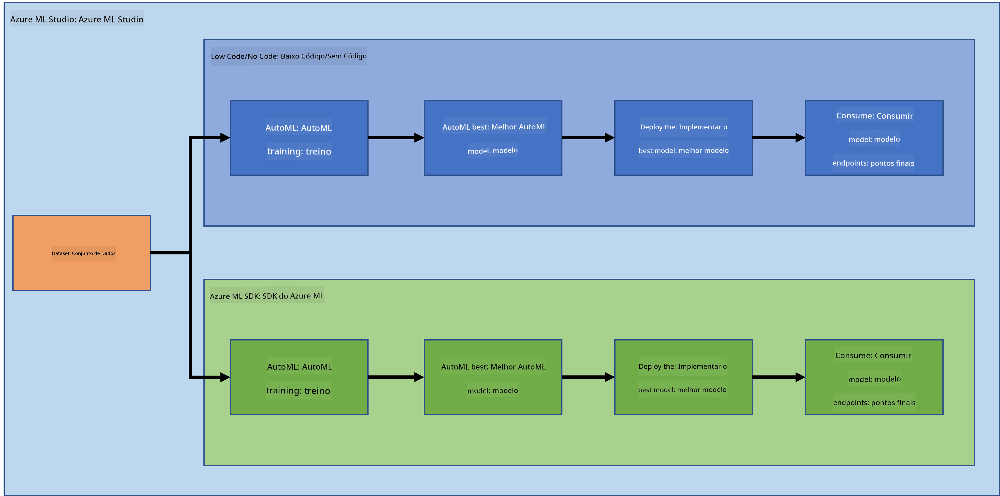

Cada abordagem tem seus próprios prós e contras. O método Low code/No code é mais fácil para começar, pois envolve interagir com uma interface gráfica (GUI), sem necessidade de conhecimento prévio de código. Este método permite testar rapidamente a viabilidade do projeto e criar um POC (Prova de Conceito). No entanto, à medida que o projeto cresce e precisa estar pronto para produção, não é viável criar recursos por meio de GUI. É necessário automatizar tudo programaticamente, desde a criação de recursos até a implantação de um modelo. É aqui que o conhecimento do Azure ML SDK se torna essencial.

|                   | Low code/No code | Azure ML SDK              |
|-------------------|------------------|---------------------------|
| Conhecimento de código | Não necessário  | Necessário                |
| Tempo de desenvolvimento | Rápido e fácil  | Depende da experiência em código |
| Pronto para produção | Não               | Sim                       |

### 1.3 O Conjunto de Dados de Insuficiência Cardíaca: 

As doenças cardiovasculares (DCVs) são a principal causa de morte globalmente, representando 31% de todas as mortes no mundo. Fatores de risco ambientais e comportamentais, como uso de tabaco, dieta pouco saudável e obesidade, inatividade física e consumo nocivo de álcool, podem ser usados como características para modelos de estimativa. Ser capaz de estimar a probabilidade de desenvolvimento de uma DCV pode ser muito útil para prevenir ataques em pessoas de alto risco.

O Kaggle disponibilizou publicamente um [conjunto de dados de insuficiência cardíaca](https://www.kaggle.com/andrewmvd/heart-failure-clinical-data), que vamos usar neste projeto. Você pode baixar o conjunto de dados agora. Este é um conjunto de dados tabular com 13 colunas (12 características e 1 variável alvo) e 299 linhas. 

|    | Nome da variável          | Tipo            | Descrição                                               | Exemplo           |
|----|---------------------------|-----------------|---------------------------------------------------------|-------------------|
| 1  | age                       | numérico        | idade do paciente                                       | 25                |
| 2  | anaemia                   | booleano        | Redução de glóbulos vermelhos ou hemoglobina           | 0 ou 1            |
| 3  | creatinine_phosphokinase  | numérico        | Nível da enzima CPK no sangue                          | 542               |
| 4  | diabetes                  | booleano        | Se o paciente tem diabetes                             | 0 ou 1            |
| 5  | ejection_fraction         | numérico        | Percentagem de sangue que sai do coração em cada contração | 45                |
| 6  | high_blood_pressure       | booleano        | Se o paciente tem hipertensão                          | 0 ou 1            |
| 7  | platelets                 | numérico        | Plaquetas no sangue                                    | 149000            |
| 8  | serum_creatinine          | numérico        | Nível de creatinina sérica no sangue                   | 0.5               |
| 9  | serum_sodium              | numérico        | Nível de sódio sérico no sangue                        | jun               |
| 10 | sex                       | booleano        | mulher ou homem                                        | 0 ou 1            |
| 11 | smoking                   | booleano        | Se o paciente fuma                                     | 0 ou 1            |
| 12 | time                      | numérico        | período de acompanhamento (dias)                       | 4                 |
|----|---------------------------|-----------------|---------------------------------------------------------|-------------------|
| 21 | DEATH_EVENT [Alvo]        | booleano        | se o paciente morre durante o período de acompanhamento | 0 ou 1            |

Depois de obter o conjunto de dados, podemos começar o projeto no Azure.

## 2. Treinamento Low code/No code de um modelo no Azure ML Studio
### 2.1 Criar um workspace no Azure ML
Para treinar um modelo no Azure ML, você primeiro precisa criar um workspace no Azure ML. O workspace é o recurso de nível superior para o Azure Machine Learning, fornecendo um local centralizado para trabalhar com todos os artefatos que você cria ao usar o Azure Machine Learning. O workspace mantém um histórico de todas as execuções de treinamento, incluindo logs, métricas, saída e um snapshot de seus scripts. Você usa essas informações para determinar qual execução de treinamento produz o melhor modelo. [Saiba mais](https://docs.microsoft.com/azure/machine-learning/concept-workspace?WT.mc_id=academic-77958-bethanycheum&ocid=AID3041109)

Recomenda-se usar o navegador mais atualizado que seja compatível com seu sistema operacional. Os seguintes navegadores são suportados:

- Microsoft Edge (O novo Microsoft Edge, versão mais recente. Não o Microsoft Edge legado)
- Safari (versão mais recente, apenas para Mac)
- Chrome (versão mais recente)
- Firefox (versão mais recente)

Para usar o Azure Machine Learning, crie um workspace na sua assinatura do Azure. Você pode então usar este workspace para gerenciar dados, recursos de computação, código, modelos e outros artefatos relacionados às suas cargas de trabalho de machine learning.

> **_NOTA:_** Sua assinatura do Azure será cobrada uma pequena quantia pelo armazenamento de dados enquanto o workspace do Azure Machine Learning existir na sua assinatura, por isso recomendamos que você exclua o workspace do Azure Machine Learning quando não estiver mais utilizando-o.

1. Entre no [portal do Azure](https://ms.portal.azure.com/) usando as credenciais da Microsoft associadas à sua assinatura do Azure.
2. Selecione **＋Criar um recurso**
   
   

   Pesquise por Machine Learning e selecione o tile de Machine Learning

   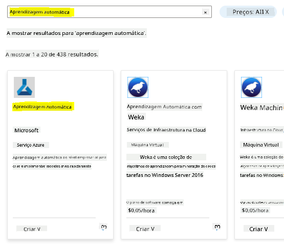

   Clique no botão criar

   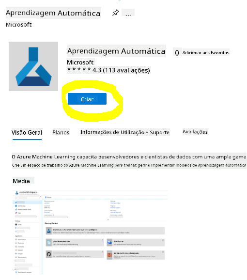

   Preencha as configurações da seguinte forma:
   - Assinatura: Sua assinatura do Azure
   - Grupo de recursos: Crie ou selecione um grupo de recursos
   - Nome do workspace: Insira um nome único para seu workspace
   - Região: Selecione a região geográfica mais próxima de você
   - Conta de armazenamento: Observe a nova conta de armazenamento padrão que será criada para seu workspace
   - Key vault: Observe o novo key vault padrão que será criado para seu workspace
   - Application insights: Observe o novo recurso de application insights padrão que será criado para seu workspace
   - Container registry: Nenhum (um será criado automaticamente na primeira vez que você implantar um modelo em um container)

    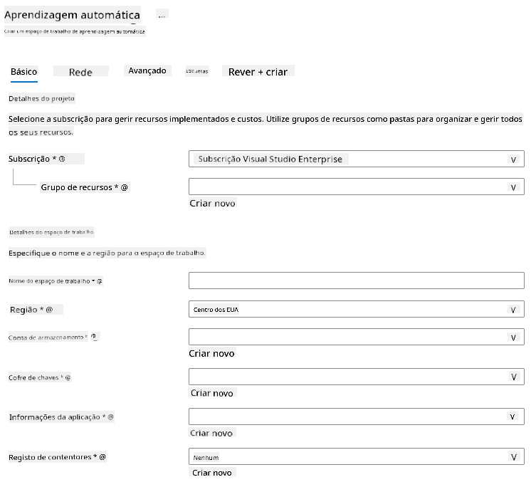

   - Clique em criar + revisar e depois no botão criar
3. Aguarde a criação do seu workspace (isso pode levar alguns minutos). Depois, acesse-o no portal. Você pode encontrá-lo através do serviço Azure Machine Learning.
4. Na página de visão geral do seu workspace, inicie o Azure Machine Learning Studio (ou abra uma nova aba do navegador e navegue para https://ml.azure.com), e entre no Azure Machine Learning Studio usando sua conta Microsoft. Se solicitado, selecione seu diretório e assinatura do Azure, e seu workspace do Azure Machine Learning.
   
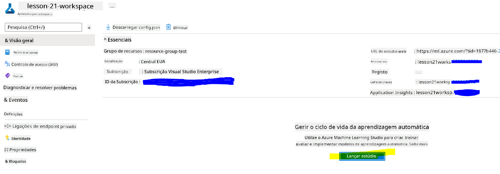

5. No Azure Machine Learning Studio, alterne o ícone ☰ no canto superior esquerdo para visualizar as várias páginas da interface. Você pode usar essas páginas para gerenciar os recursos do seu workspace.

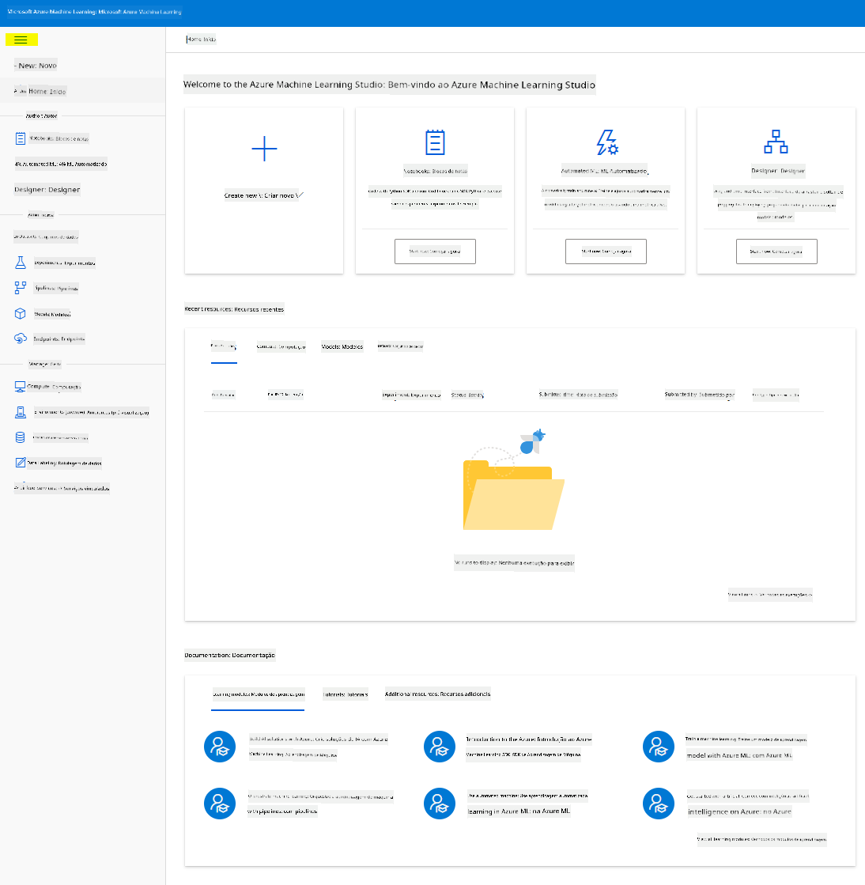

Você pode gerenciar seu workspace usando o portal do Azure, mas para cientistas de dados e engenheiros de operações de Machine Learning, o Azure Machine Learning Studio fornece uma interface de usuário mais focada para gerenciar os recursos do workspace.

### 2.2 Recursos de Computação

Recursos de Computação são recursos baseados na nuvem nos quais você pode executar processos de treinamento de modelo e exploração de dados. Existem quatro tipos de recursos de computação que você pode criar:

- **Instâncias de Computação**: Estações de trabalho de desenvolvimento que cientistas de dados podem usar para trabalhar com dados e modelos. Isso envolve a criação de uma Máquina Virtual (VM) e o lançamento de uma instância de notebook. Você pode então treinar um modelo chamando um cluster de computação a partir do notebook.
- **Clusters de Computação**: Clusters escaláveis de VMs para processamento sob demanda de código de experimentos. Você precisará deles ao treinar um modelo. Clusters de computação também podem empregar recursos especializados de GPU ou CPU.
- **Clusters de Inferência**: Alvos de implantação para serviços preditivos que utilizam seus modelos treinados.
- **Attached Compute**: Ligações a recursos de computação existentes no Azure, como Máquinas Virtuais ou clusters do Azure Databricks.

#### 2.2.1 Escolher as opções certas para os seus recursos de computação

Alguns fatores importantes devem ser considerados ao criar um recurso de computação, e essas escolhas podem ser decisões críticas.

**Precisa de CPU ou GPU?**

Uma CPU (Unidade Central de Processamento) é o circuito eletrônico que executa instruções de um programa de computador. Uma GPU (Unidade de Processamento Gráfico) é um circuito eletrônico especializado que pode executar código relacionado a gráficos a uma taxa muito alta.

A principal diferença entre a arquitetura de CPU e GPU é que uma CPU é projetada para lidar com uma ampla gama de tarefas rapidamente (medida pela velocidade do clock da CPU), mas é limitada na simultaneidade das tarefas que podem estar em execução. As GPUs são projetadas para computação paralela e, portanto, são muito melhores em tarefas de aprendizagem profunda.

| CPU                                     | GPU                         |
|-----------------------------------------|-----------------------------|
| Menos caro                              | Mais caro                  |
| Nível mais baixo de simultaneidade      | Nível mais alto de simultaneidade |
| Mais lento no treino de modelos de aprendizagem profunda | Ótimo para aprendizagem profunda |

**Tamanho do Cluster**

Clusters maiores são mais caros, mas resultam em melhor capacidade de resposta. Portanto, se tiver tempo, mas não muito dinheiro, deve começar com um cluster pequeno. Por outro lado, se tiver dinheiro, mas pouco tempo, deve começar com um cluster maior.

**Tamanho da VM**

Dependendo das suas restrições de tempo e orçamento, pode variar o tamanho da RAM, disco, número de núcleos e velocidade do clock. Aumentar todos esses parâmetros será mais caro, mas resultará em melhor desempenho.

**Instâncias Dedicadas ou de Baixa Prioridade?**

Uma instância de baixa prioridade significa que é interrompível: essencialmente, a Microsoft Azure pode usar esses recursos e atribuí-los a outra tarefa, interrompendo assim um trabalho. Uma instância dedicada, ou não interrompível, significa que o trabalho nunca será terminado sem a sua permissão.  
Esta é outra consideração entre tempo e dinheiro, já que instâncias interrompíveis são menos caras do que as dedicadas.

#### 2.2.2 Criar um cluster de computação

No [espaço de trabalho do Azure ML](https://ml.azure.com/) que criámos anteriormente, vá para computação e poderá ver os diferentes recursos de computação que acabámos de discutir (ou seja, instâncias de computação, clusters de computação, clusters de inferência e computação ligada). Para este projeto, vamos precisar de um cluster de computação para treino de modelo. No Studio, clique no menu "Compute", depois na aba "Compute cluster" e clique no botão "+ New" para criar um cluster de computação.

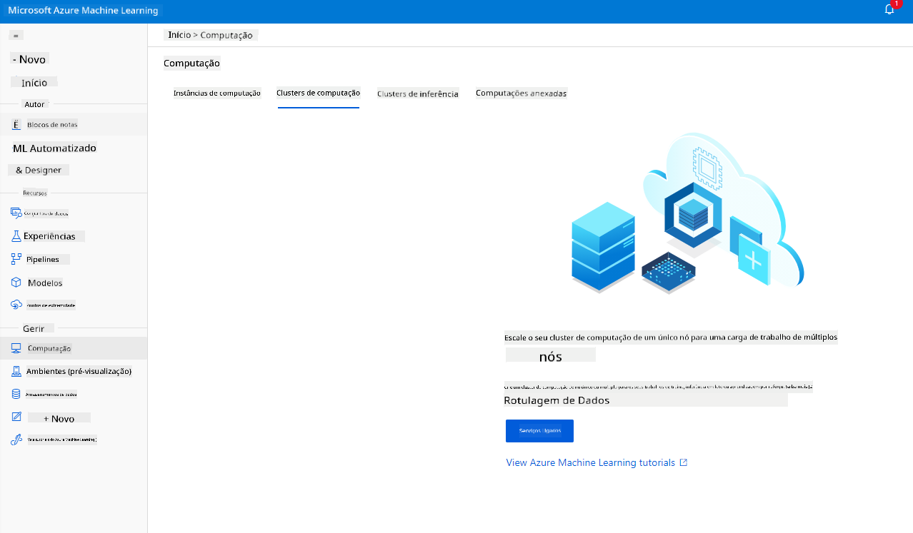

1. Escolha as suas opções: Dedicado vs Baixa prioridade, CPU ou GPU, tamanho da VM e número de núcleos (pode manter as configurações padrão para este projeto).
2. Clique no botão Next.

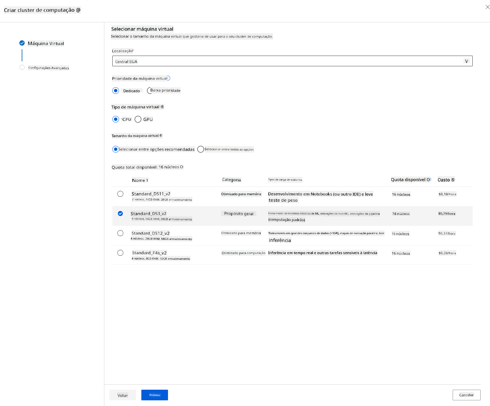

3. Dê ao cluster um nome de computação.  
4. Escolha as suas opções: Número mínimo/máximo de nós, segundos inativos antes de reduzir, acesso SSH. Note que, se o número mínimo de nós for 0, poupará dinheiro quando o cluster estiver inativo. Note também que, quanto maior o número de nós máximos, mais curto será o treino. O número máximo de nós recomendado é 3.  
5. Clique no botão "Create". Este passo pode levar alguns minutos.

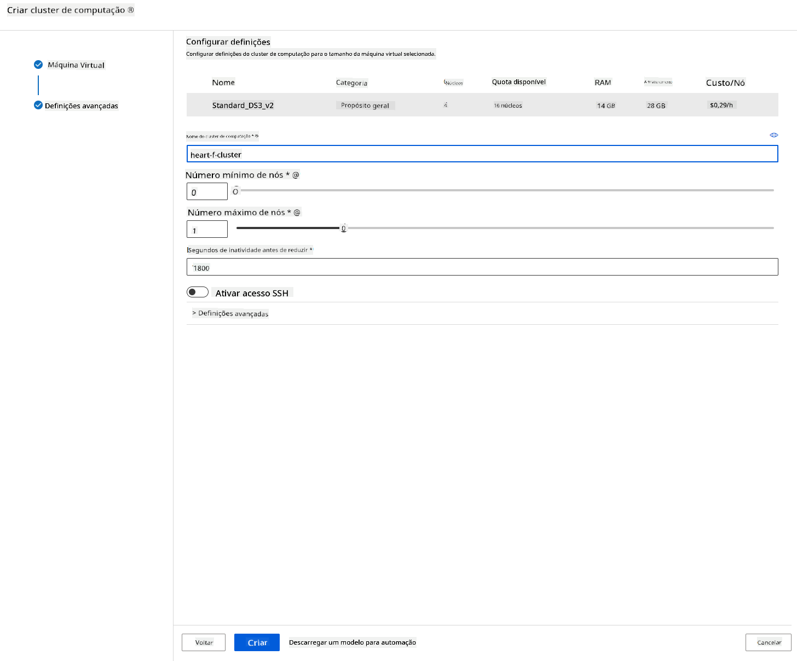

Fantástico! Agora que temos um cluster de computação, precisamos de carregar os dados para o Azure ML Studio.

### 2.3 Carregar o Conjunto de Dados

1. No [espaço de trabalho do Azure ML](https://ml.azure.com/) que criámos anteriormente, clique em "Datasets" no menu à esquerda e clique no botão "+ Create dataset" para criar um conjunto de dados. Escolha a opção "From local files" e selecione o conjunto de dados do Kaggle que descarregámos anteriormente.

   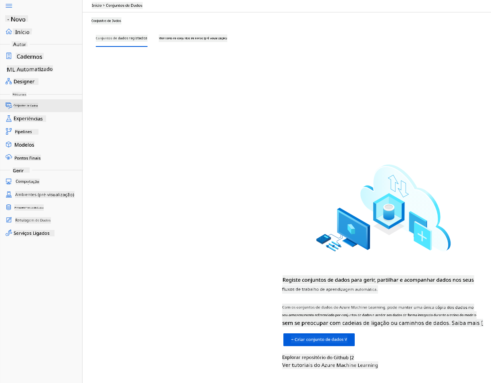

2. Dê ao seu conjunto de dados um nome, um tipo e uma descrição. Clique em Next. Carregue os dados a partir dos ficheiros. Clique em Next.

   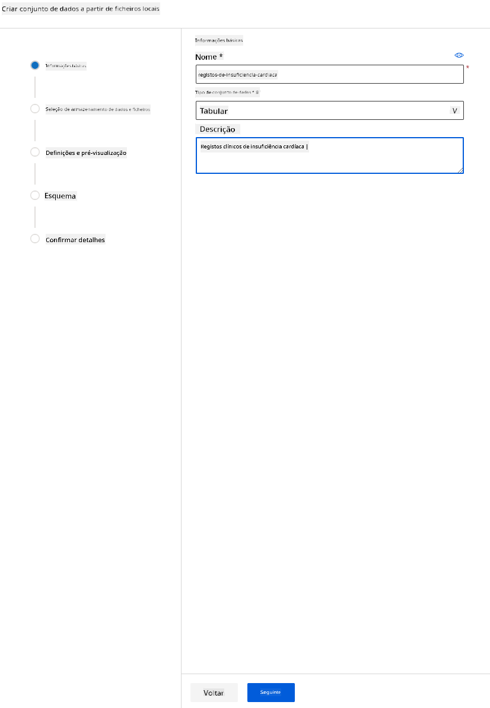

3. No esquema, altere o tipo de dados para Boolean para as seguintes características: anemia, diabetes, pressão alta, sexo, fumar e DEATH_EVENT. Clique em Next e clique em Create.

   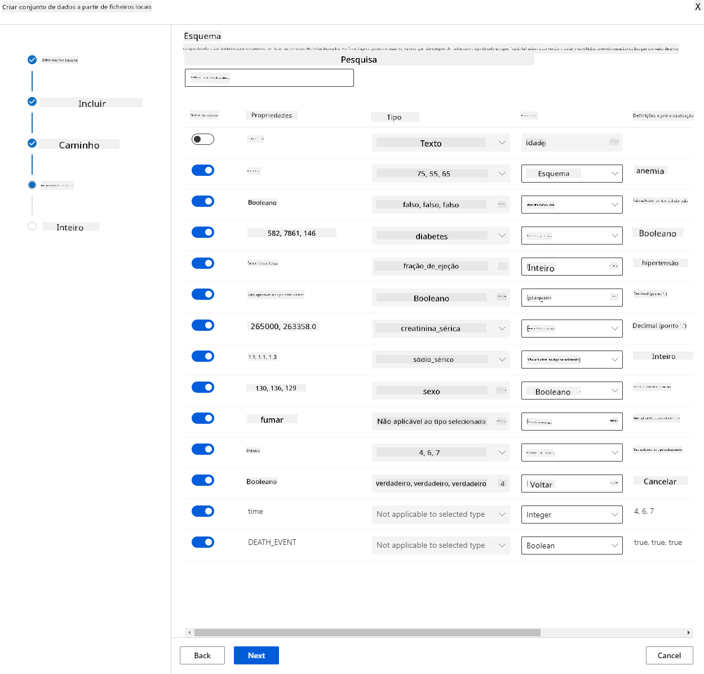

Ótimo! Agora que o conjunto de dados está pronto e o cluster de computação foi criado, podemos começar o treino do modelo!

### 2.4 Treino com pouco código/sem código usando AutoML

O desenvolvimento tradicional de modelos de aprendizagem automática é intensivo em recursos, requer conhecimento significativo do domínio e tempo para produzir e comparar dezenas de modelos.  
A aprendizagem automática automatizada (AutoML) é o processo de automatizar as tarefas iterativas e demoradas do desenvolvimento de modelos de aprendizagem automática. Permite que cientistas de dados, analistas e desenvolvedores construam modelos de ML com alta escala, eficiência e produtividade, mantendo a qualidade do modelo. Reduz o tempo necessário para obter modelos de ML prontos para produção, com grande facilidade e eficiência. [Saiba mais](https://docs.microsoft.com/azure/machine-learning/concept-automated-ml?WT.mc_id=academic-77958-bethanycheum&ocid=AID3041109)

1. No [espaço de trabalho do Azure ML](https://ml.azure.com/) que criámos anteriormente, clique em "Automated ML" no menu à esquerda e selecione o conjunto de dados que acabou de carregar. Clique em Next.

   

2. Insira um novo nome de experimento, a coluna alvo (DEATH_EVENT) e o cluster de computação que criámos. Clique em Next.

   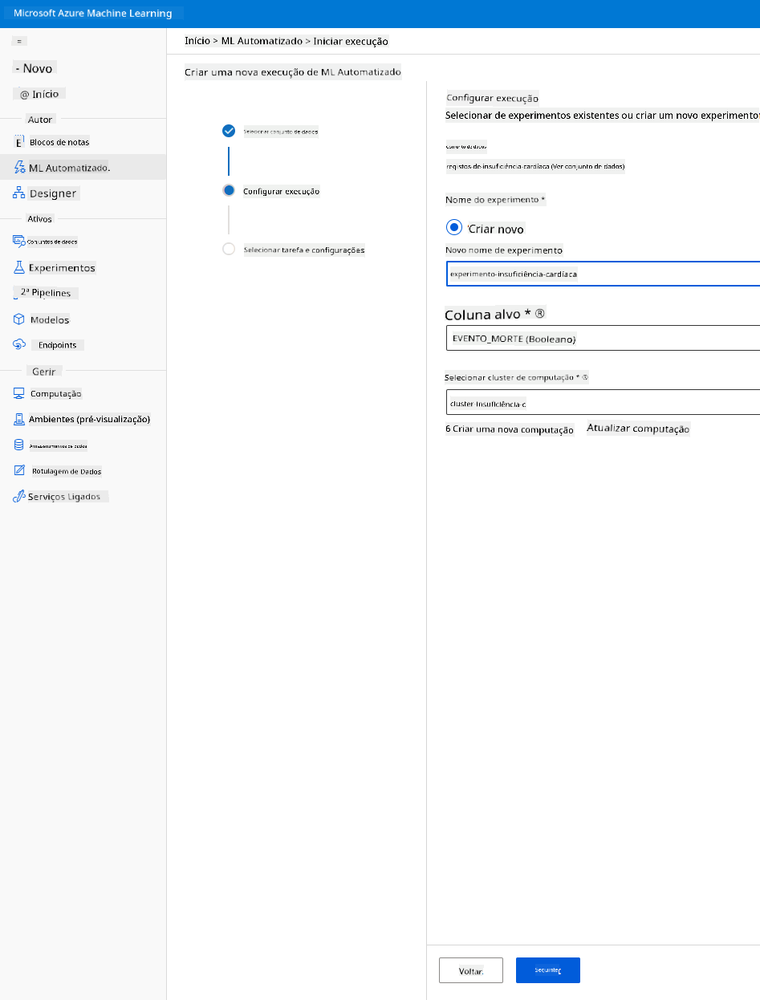

3. Escolha "Classification" e clique em Finish. Este passo pode levar entre 30 minutos a 1 hora, dependendo do tamanho do seu cluster de computação.

   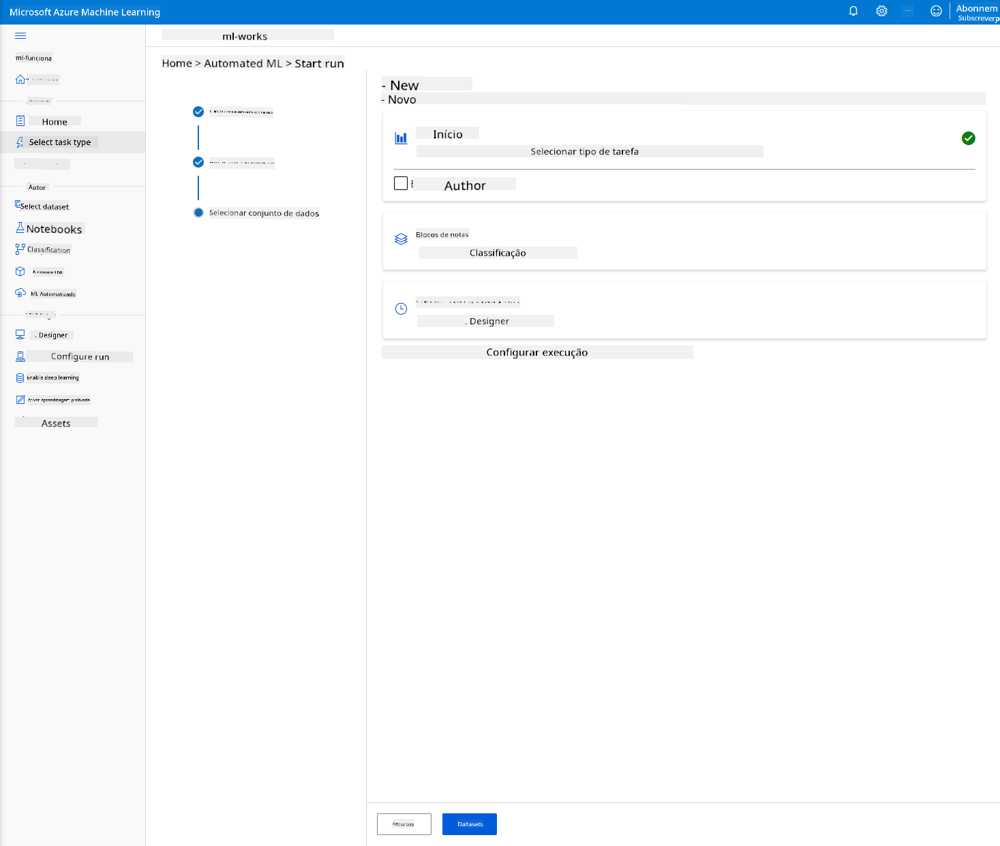

4. Quando a execução estiver concluída, clique na aba "Automated ML", clique na sua execução e clique no algoritmo no cartão "Best model summary".

   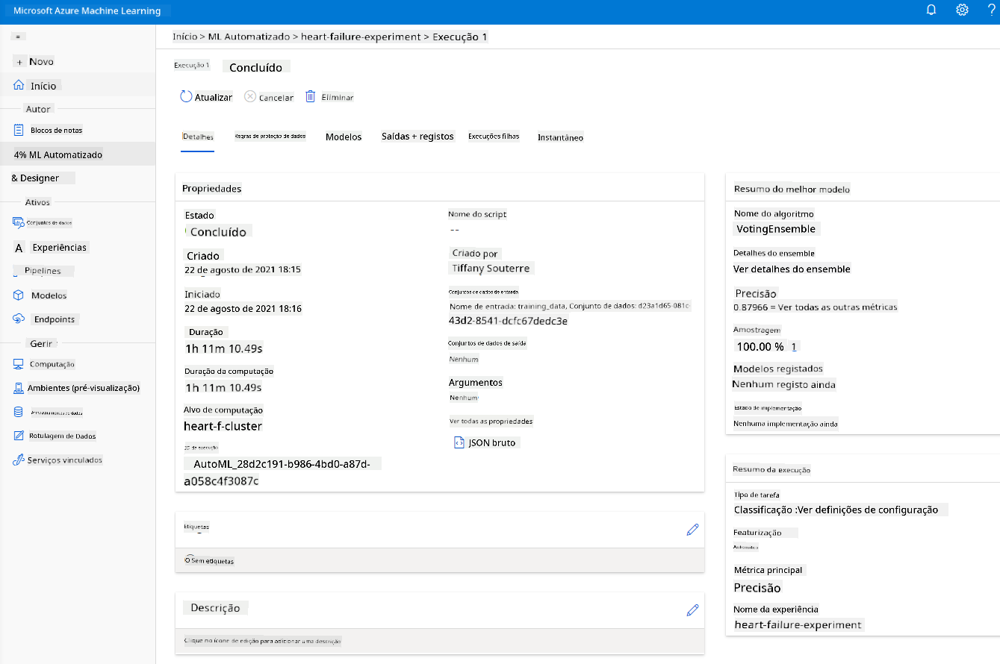

Aqui pode ver uma descrição detalhada do melhor modelo que o AutoML gerou. Também pode explorar outros modelos gerados na aba Models. Dedique alguns minutos para explorar os modelos na aba Explanations (preview). Depois de escolher o modelo que deseja usar (neste caso, escolhemos o melhor modelo selecionado pelo AutoML), veremos como podemos implantá-lo.

## 3. Implantação de modelo com pouco código/sem código e consumo de endpoint
### 3.1 Implantação do modelo

A interface de aprendizagem automática automatizada permite implantar o melhor modelo como um serviço web em alguns passos. A implantação é a integração do modelo para que ele possa fazer previsões com base em novos dados e identificar áreas potenciais de oportunidade. Para este projeto, a implantação como um serviço web significa que aplicações médicas poderão consumir o modelo para fazer previsões em tempo real sobre o risco de ataque cardíaco dos seus pacientes.

Na descrição do melhor modelo, clique no botão "Deploy".

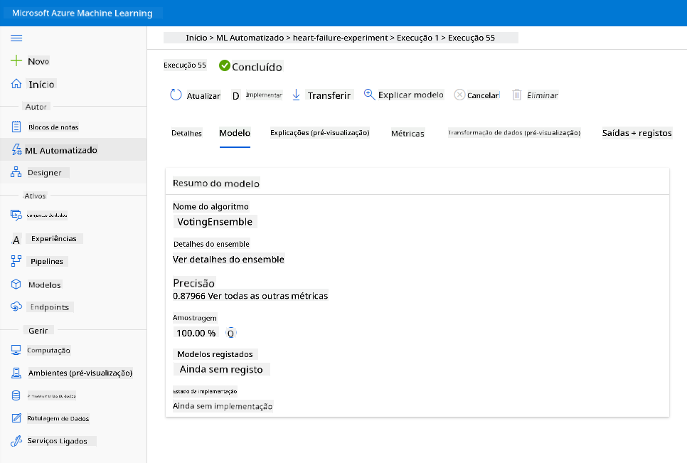

15. Dê-lhe um nome, uma descrição, tipo de computação (Azure Container Instance), habilite a autenticação e clique em Deploy. Este passo pode levar cerca de 20 minutos para ser concluído. O processo de implantação envolve várias etapas, incluindo o registo do modelo, a geração de recursos e a configuração para o serviço web. Uma mensagem de status aparece em Deploy status. Selecione Refresh periodicamente para verificar o status da implantação. Está implantado e em execução quando o status é "Healthy".


16. Depois de implantado, clique na aba Endpoint e clique no endpoint que acabou de implantar. Aqui pode encontrar todos os detalhes que precisa saber sobre o endpoint.

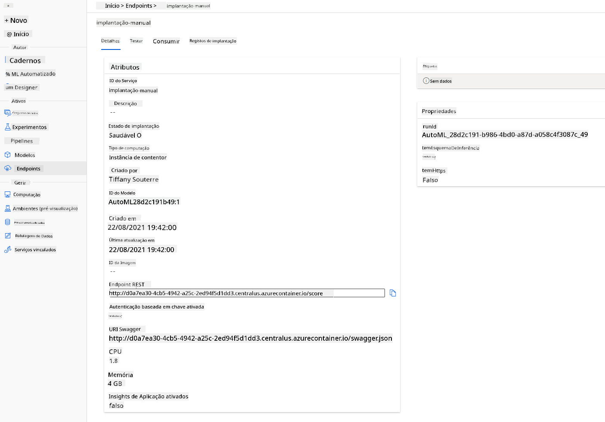

Incrível! Agora que temos um modelo implantado, podemos começar o consumo do endpoint.

### 3.2 Consumo do endpoint

Clique na aba "Consume". Aqui pode encontrar o endpoint REST e um script Python na opção de consumo. Dedique algum tempo para ler o código Python.

Este script pode ser executado diretamente a partir da sua máquina local e consumirá o seu endpoint.

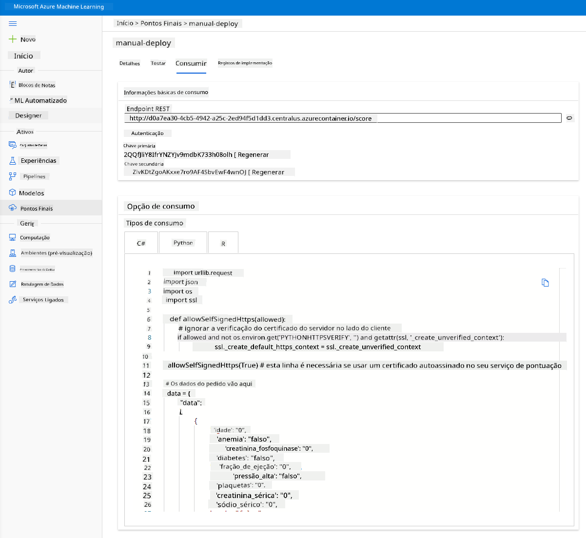

Dedique um momento para verificar estas 2 linhas de código:

```python
url = 'http://98e3715f-xxxx-xxxx-xxxx-9ec22d57b796.centralus.azurecontainer.io/score'
api_key = '' # Replace this with the API key for the web service
```  
A variável `url` é o endpoint REST encontrado na aba de consumo e a variável `api_key` é a chave primária também encontrada na aba de consumo (apenas no caso de ter habilitado a autenticação). É assim que o script pode consumir o endpoint.

18. Ao executar o script, deverá ver o seguinte resultado:  
```python
    b'"{\\"result\\": [true]}"'
    ```  
Isto significa que a previsão de insuficiência cardíaca para os dados fornecidos é verdadeira. Isto faz sentido porque, se olhar mais de perto os dados gerados automaticamente no script, tudo está a 0 e falso por padrão. Pode alterar os dados com a seguinte amostra de entrada:

```python
data = {
    "data":
    [
        {
            'age': "0",
            'anaemia': "false",
            'creatinine_phosphokinase': "0",
            'diabetes': "false",
            'ejection_fraction': "0",
            'high_blood_pressure': "false",
            'platelets': "0",
            'serum_creatinine': "0",
            'serum_sodium': "0",
            'sex': "false",
            'smoking': "false",
            'time': "0",
        },
        {
            'age': "60",
            'anaemia': "false",
            'creatinine_phosphokinase': "500",
            'diabetes': "false",
            'ejection_fraction': "38",
            'high_blood_pressure': "false",
            'platelets': "260000",
            'serum_creatinine': "1.40",
            'serum_sodium': "137",
            'sex': "false",
            'smoking': "false",
            'time': "130",
        },
    ],
}
```  
O script deverá retornar:  
```python
    b'"{\\"result\\": [true, false]}"'
    ```  

Parabéns! Acabou de consumir o modelo implantado e treinado no Azure ML!

> **_NOTA:_** Quando terminar o projeto, não se esqueça de eliminar todos os recursos.

## 🚀 Desafio

Observe atentamente as explicações e detalhes do modelo que o AutoML gerou para os melhores modelos. Tente entender por que o melhor modelo é superior aos outros. Que algoritmos foram comparados? Quais são as diferenças entre eles? Por que o melhor está a ter um desempenho superior neste caso?

## [Questionário pós-aula](https://ff-quizzes.netlify.app/en/ds/)

## Revisão e Estudo Individual

Nesta lição, aprendeu como treinar, implantar e consumir um modelo para prever o risco de insuficiência cardíaca de forma Low code/No code na nuvem. Se ainda não o fez, aprofunde-se nas explicações do modelo que o AutoML gerou para os melhores modelos e tente entender por que o melhor modelo é superior aos outros.

Pode aprofundar-se em AutoML Low code/No code lendo esta [documentação](https://docs.microsoft.com/azure/machine-learning/tutorial-first-experiment-automated-ml?WT.mc_id=academic-77958-bethanycheum&ocid=AID3041109).

## Tarefa

[Projeto de Ciência de Dados Low code/No code no Azure ML](assignment.md)

---

**Aviso Legal**:  
Este documento foi traduzido utilizando o serviço de tradução por IA [Co-op Translator](https://github.com/Azure/co-op-translator). Embora nos esforcemos para garantir a precisão, esteja ciente de que traduções automáticas podem conter erros ou imprecisões. O documento original no seu idioma nativo deve ser considerado a fonte oficial. Para informações críticas, recomenda-se uma tradução profissional realizada por humanos. Não nos responsabilizamos por quaisquer mal-entendidos ou interpretações incorretas resultantes do uso desta tradução.