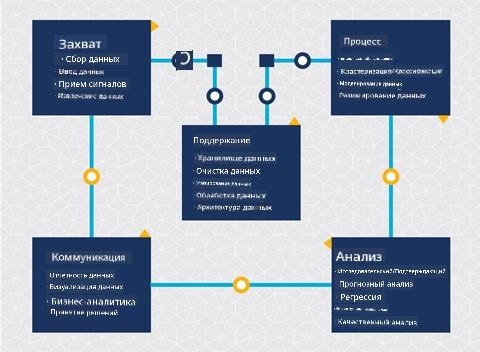
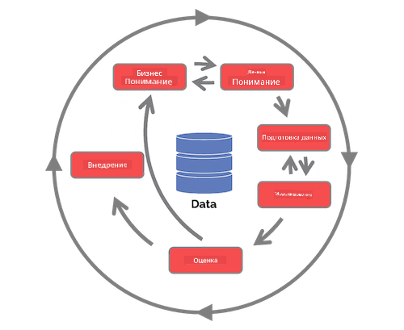

<!--
CO_OP_TRANSLATOR_METADATA:
{
  "original_hash": "79ca8a5a3135e94d2d43f56ba62d5205",
  "translation_date": "2025-09-04T15:32:01+00:00",
  "source_file": "4-Data-Science-Lifecycle/14-Introduction/README.md",
  "language_code": "ru"
}
-->
# Введение в жизненный цикл Data Science

| ](../../sketchnotes/14-DataScience-Lifecycle.png)|
|:---:|
| Введение в жизненный цикл Data Science - _Скетчноут от [@nitya](https://twitter.com/nitya)_ |

## [Тест перед лекцией](https://red-water-0103e7a0f.azurestaticapps.net/quiz/26)

На данном этапе вы, вероятно, уже поняли, что Data Science — это процесс. Этот процесс можно разделить на 5 этапов:

- Сбор данных
- Обработка
- Анализ
- Коммуникация
- Поддержка

Этот урок сосредоточен на трех частях жизненного цикла: сборе данных, обработке и поддержке.

  
> Фото от [Berkeley School of Information](https://ischoolonline.berkeley.edu/data-science/what-is-data-science/)

## Сбор данных

Первый этап жизненного цикла очень важен, так как от него зависят все последующие этапы. По сути, это два этапа, объединенные в один: сбор данных и определение цели и проблем, которые необходимо решить.  
Определение целей проекта требует глубокого понимания контекста проблемы или вопроса. Сначала нужно выявить и привлечь тех, чью проблему необходимо решить. Это могут быть заинтересованные стороны бизнеса или спонсоры проекта, которые помогут определить, кто или что получит выгоду от проекта, а также что и почему им это нужно. Хорошо сформулированная цель должна быть измеримой и количественно определяемой, чтобы можно было оценить приемлемый результат.

Вопросы, которые может задать специалист по данным:
- Решалась ли эта проблема ранее? Что было обнаружено?
- Понятны ли цель и задачи всем участникам?
- Есть ли неопределенность и как ее можно уменьшить?
- Какие существуют ограничения?
- Как может выглядеть конечный результат?
- Сколько ресурсов (времени, людей, вычислительных мощностей) доступно?

Далее необходимо определить, собрать, а затем изучить данные, необходимые для достижения поставленных целей. На этапе сбора специалисты по данным также должны оценить количество и качество данных. Это требует некоторого исследования данных, чтобы убедиться, что собранные данные помогут достичь желаемого результата.

Вопросы, которые может задать специалист по данным о данных:
- Какие данные уже доступны мне?
- Кто владеет этими данными?
- Какие существуют проблемы конфиденциальности?
- Достаточно ли данных для решения этой задачи?
- Соответствуют ли данные необходимому качеству для данной задачи?
- Если я обнаружу дополнительную информацию через эти данные, стоит ли пересмотреть или переопределить цели?

## Обработка

Этап обработки жизненного цикла сосредоточен на выявлении закономерностей в данных, а также на моделировании. Некоторые методы, используемые на этапе обработки, требуют применения статистических методов для выявления закономерностей. Обычно это была бы трудоемкая задача для человека при работе с большим набором данных, поэтому используются компьютеры для ускорения процесса. На этом этапе Data Science пересекается с машинным обучением. Как вы узнали в первом уроке, машинное обучение — это процесс создания моделей для понимания данных. Модели представляют собой отношения между переменными в данных, которые помогают прогнозировать результаты.

Распространенные методы, используемые на этом этапе, подробно рассматриваются в учебной программе ML для начинающих. Ознакомьтесь с ними по ссылкам:

- [Классификация](https://github.com/microsoft/ML-For-Beginners/tree/main/4-Classification): Организация данных в категории для более эффективного использования.
- [Кластеризация](https://github.com/microsoft/ML-For-Beginners/tree/main/5-Clustering): Группировка данных в схожие группы.
- [Регрессия](https://github.com/microsoft/ML-For-Beginners/tree/main/2-Regression): Определение отношений между переменными для прогнозирования или предсказания значений.

## Поддержка

На диаграмме жизненного цикла вы могли заметить, что поддержка находится между сбором данных и обработкой. Поддержка — это непрерывный процесс управления, хранения и защиты данных на протяжении всего проекта и должна учитываться на всех этапах проекта.

### Хранение данных

Решения о том, как и где хранить данные, могут повлиять на стоимость их хранения, а также на производительность, то есть скорость доступа к данным. Такие решения, скорее всего, не будут приниматься только специалистом по данным, но он может столкнуться с выбором, как работать с данными в зависимости от того, как они хранятся.

Вот некоторые аспекты современных систем хранения данных, которые могут повлиять на эти решения:

**Локальное хранение vs удаленное хранение vs публичное или частное облако**

Локальное хранение подразумевает управление данными на собственном оборудовании, например, на сервере с жесткими дисками, где хранятся данные, тогда как удаленное хранение зависит от оборудования, которым вы не владеете, например, дата-центра. Публичное облако — популярный выбор для хранения данных, который не требует знания о том, как и где именно хранятся данные. Публичное облако подразумевает единую инфраструктуру, которая используется всеми пользователями облака. Некоторые организации имеют строгие политики безопасности, которые требуют полного доступа к оборудованию, где хранятся данные, и используют частное облако, предоставляющее собственные облачные услуги. Вы узнаете больше о данных в облаке в [поздних уроках](https://github.com/microsoft/Data-Science-For-Beginners/tree/main/5-Data-Science-In-Cloud).

**"Холодные" vs "горячие" данные**

При обучении моделей может потребоваться больше данных для обучения. Если модель вас устраивает, новые данные будут поступать для выполнения ее задач. В любом случае стоимость хранения и доступа к данным будет увеличиваться по мере их накопления. Разделение редко используемых данных, известных как "холодные", от часто используемых "горячих" данных может быть более дешевым вариантом хранения данных с помощью аппаратных или программных решений. Если потребуется доступ к "холодным" данным, их извлечение может занять немного больше времени по сравнению с "горячими" данными.

### Управление данными

Работая с данными, вы можете обнаружить, что некоторые из них нуждаются в очистке с использованием методов, рассмотренных в уроке, посвященном [подготовке данных](https://github.com/microsoft/Data-Science-For-Beginners/tree/main/2-Working-With-Data/08-data-preparation), чтобы построить точные модели. Когда поступают новые данные, им потребуется применение тех же методов для поддержания качества. Некоторые проекты включают использование автоматизированных инструментов для очистки, агрегации и сжатия данных перед их перемещением в конечное место хранения. Примером такого инструмента является Azure Data Factory.

### Защита данных

Одна из главных целей защиты данных — обеспечение того, чтобы те, кто с ними работает, контролировали, что собирается и в каком контексте используется. Защита данных включает ограничение доступа только для тех, кому он необходим, соблюдение местных законов и нормативов, а также поддержание этических стандартов, рассмотренных в [уроке об этике](https://github.com/microsoft/Data-Science-For-Beginners/tree/main/1-Introduction/02-ethics).

Вот некоторые действия, которые команда может предпринять с учетом безопасности:
- Убедиться, что все данные зашифрованы
- Предоставить клиентам информацию о том, как используются их данные
- Удалить доступ к данным у тех, кто покинул проект
- Разрешить изменять данные только определенным участникам проекта

## 🚀 Задание

Существует множество версий жизненного цикла Data Science, где каждый этап может иметь разные названия и количество стадий, но будет включать те же процессы, которые упомянуты в этом уроке.

Изучите [жизненный цикл процесса командного Data Science](https://docs.microsoft.com/en-us/azure/architecture/data-science-process/lifecycle) и [стандартный процесс для анализа данных в различных отраслях](https://www.datascience-pm.com/crisp-dm-2/). Назовите 3 сходства и различия между ними.

|Процесс командного Data Science (TDSP)|Стандартный процесс для анализа данных в различных отраслях (CRISP-DM)|
|--|--|
| |  |
| Изображение от [Microsoft](https://docs.microsoft.comazure/architecture/data-science-process/lifecycle) | Изображение от [Data Science Process Alliance](https://www.datascience-pm.com/crisp-dm-2/) |

## [Тест после лекции](https://ff-quizzes.netlify.app/en/ds/)

## Обзор и самостоятельное изучение

Применение жизненного цикла Data Science включает множество ролей и задач, где некоторые могут сосредоточиться на определенных частях каждого этапа. Процесс командного Data Science предоставляет несколько ресурсов, которые объясняют типы ролей и задач, которые могут быть в проекте.

* [Роли и задачи процесса командного Data Science](https://docs.microsoft.com/en-us/azure/architecture/data-science-process/roles-tasks)
* [Выполнение задач Data Science: исследование, моделирование и развертывание](https://docs.microsoft.com/en-us/azure/architecture/data-science-process/execute-data-science-tasks)

## Задание

[Оценка набора данных](assignment.md)

---

**Отказ от ответственности**:  
Этот документ был переведен с использованием сервиса автоматического перевода [Co-op Translator](https://github.com/Azure/co-op-translator). Хотя мы стремимся к точности, пожалуйста, имейте в виду, что автоматические переводы могут содержать ошибки или неточности. Оригинальный документ на его родном языке следует считать авторитетным источником. Для получения критически важной информации рекомендуется профессиональный перевод человеком. Мы не несем ответственности за любые недоразумения или неправильные интерпретации, возникшие в результате использования данного перевода.