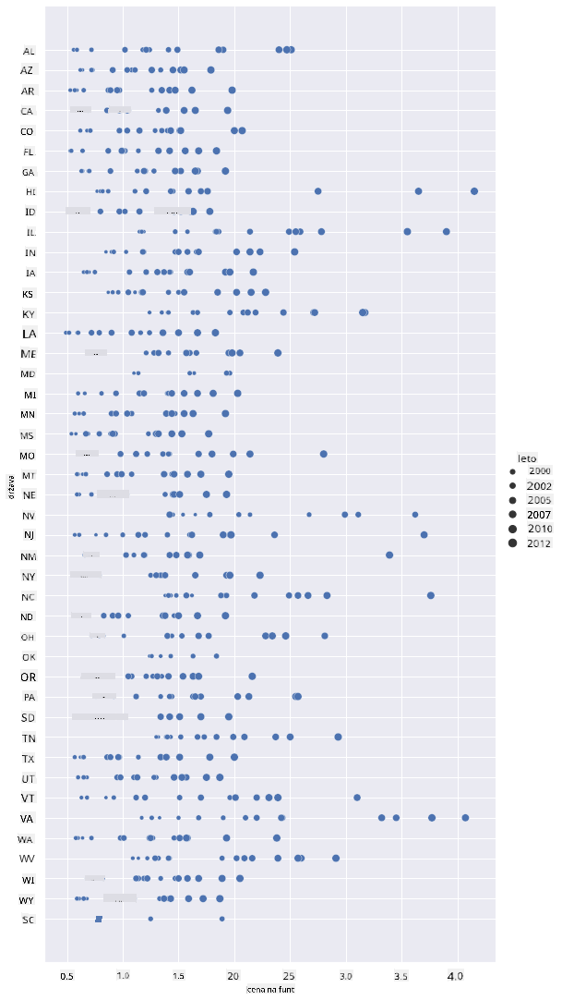
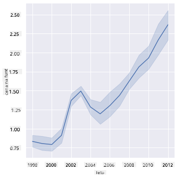
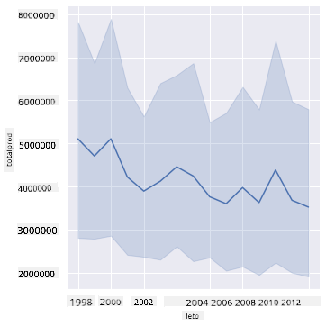
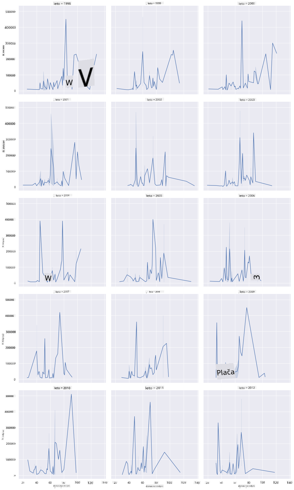
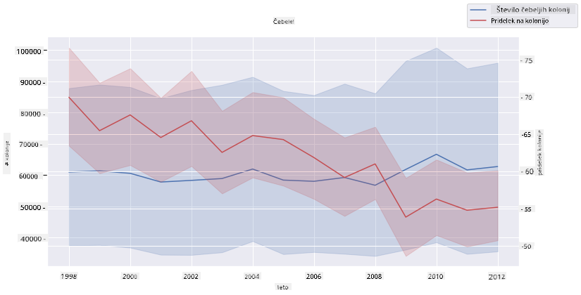

<!--
CO_OP_TRANSLATOR_METADATA:
{
  "original_hash": "0764fd4077f3f04a1d968ec371227744",
  "translation_date": "2025-09-06T11:49:12+00:00",
  "source_file": "3-Data-Visualization/12-visualization-relationships/README.md",
  "language_code": "sl"
}
-->
# Vizualizacija odnosov: Vse o medu 🍯

| ](../../sketchnotes/12-Visualizing-Relationships.png)|
|:---:|
|Vizualizacija odnosov - _Sketchnote by [@nitya](https://twitter.com/nitya)_ |

Nadaljujmo z naravoslovno usmerjenostjo našega raziskovanja in odkrijmo zanimive vizualizacije, ki prikazujejo odnose med različnimi vrstami medu, na podlagi podatkovne zbirke, pridobljene od [Ministrstva za kmetijstvo Združenih držav Amerike](https://www.nass.usda.gov/About_NASS/index.php).

Ta podatkovna zbirka, ki vsebuje približno 600 elementov, prikazuje proizvodnjo medu v številnih zveznih državah ZDA. Na primer, lahko si ogledate število kolonij, donos na kolonijo, skupno proizvodnjo, zaloge, ceno na funt in vrednost proizvedenega medu v določeni državi od leta 1998 do 2012, pri čemer je ena vrstica na leto za vsako državo.

Zanimivo bo vizualizirati odnos med letno proizvodnjo določene države in, na primer, ceno medu v tej državi. Alternativno bi lahko vizualizirali odnos med donosom medu na kolonijo v različnih državah. To časovno obdobje zajema uničujočo 'CCD' ali 'motnjo propada kolonij', ki je bila prvič opažena leta 2006 (http://npic.orst.edu/envir/ccd.html), zato je to ganljiva podatkovna zbirka za preučevanje. 🐝

## [Predhodni kviz](https://ff-quizzes.netlify.app/en/ds/quiz/22)

V tej lekciji lahko uporabite knjižnico Seaborn, ki ste jo že uporabljali, kot odlično orodje za vizualizacijo odnosov med spremenljivkami. Še posebej zanimiva je funkcija `relplot` v Seabornu, ki omogoča hitro ustvarjanje razpršenih in linijskih grafov za vizualizacijo '[statističnih odnosov](https://seaborn.pydata.org/tutorial/relational.html?highlight=relationships)', kar podatkovnemu znanstveniku pomaga bolje razumeti, kako se spremenljivke med seboj povezujejo.

## Razpršeni grafi

Uporabite razpršeni graf za prikaz, kako se je cena medu spreminjala iz leta v leto, po posameznih državah. Seaborn, z uporabo `relplot`, priročno združi podatke držav in prikaže točke za kategorijske in numerične podatke.

Začnimo z uvozom podatkov in knjižnice Seaborn:

```python
import pandas as pd
import matplotlib.pyplot as plt
import seaborn as sns
honey = pd.read_csv('../../data/honey.csv')
honey.head()
```
Opazili boste, da ima podatkovna zbirka medu več zanimivih stolpcev, vključno z letom in ceno na funt. Raziščimo te podatke, razvrščene po zveznih državah ZDA:

| država | št_kolonij | donos_na_kolonijo | skupna_proizvodnja | zaloge   | cena_na_funt | vrednost_proizvodnje | leto |
| ------ | ---------- | ----------------- | ------------------ | -------- | ------------ | -------------------- | ---- |
| AL     | 16000      | 71                | 1136000            | 159000   | 0.72         | 818000               | 1998 |
| AZ     | 55000      | 60                | 3300000            | 1485000  | 0.64         | 2112000              | 1998 |
| AR     | 53000      | 65                | 3445000            | 1688000  | 0.59         | 2033000              | 1998 |
| CA     | 450000     | 83                | 37350000           | 12326000 | 0.62         | 23157000             | 1998 |
| CO     | 27000      | 72                | 1944000            | 1594000  | 0.7          | 1361000              | 1998 |

Ustvarite osnovni razpršeni graf za prikaz odnosa med ceno na funt medu in njegovo državo izvora. Os `y` naj bo dovolj visoka, da prikaže vse države:

```python
sns.relplot(x="priceperlb", y="state", data=honey, height=15, aspect=.5);
```


Sedaj prikažite iste podatke z barvno shemo medu, da pokažete, kako se cena spreminja skozi leta. To lahko storite z dodajanjem parametra 'hue', ki prikazuje spremembe iz leta v leto:

> ✅ Več o [barvnih paletah, ki jih lahko uporabite v Seabornu](https://seaborn.pydata.org/tutorial/color_palettes.html) - preizkusite čudovito mavrično barvno shemo!

```python
sns.relplot(x="priceperlb", y="state", hue="year", palette="YlOrBr", data=honey, height=15, aspect=.5);
```


S to spremembo barvne sheme lahko jasno vidite močan napredek skozi leta glede cene medu na funt. Če pogledate vzorec podatkov (na primer za določeno državo, recimo Arizono), lahko opazite vzorec naraščanja cen iz leta v leto, z nekaj izjemami:

| država | št_kolonij | donos_na_kolonijo | skupna_proizvodnja | zaloge  | cena_na_funt | vrednost_proizvodnje | leto |
| ------ | ---------- | ----------------- | ------------------ | ------- | ------------ | -------------------- | ---- |
| AZ     | 55000      | 60                | 3300000            | 1485000 | 0.64         | 2112000              | 1998 |
| AZ     | 52000      | 62                | 3224000            | 1548000 | 0.62         | 1999000              | 1999 |
| AZ     | 40000      | 59                | 2360000            | 1322000 | 0.73         | 1723000              | 2000 |
| AZ     | 43000      | 59                | 2537000            | 1142000 | 0.72         | 1827000              | 2001 |
| AZ     | 38000      | 63                | 2394000            | 1197000 | 1.08         | 2586000              | 2002 |
| AZ     | 35000      | 72                | 2520000            | 983000  | 1.34         | 3377000              | 2003 |
| AZ     | 32000      | 55                | 1760000            | 774000  | 1.11         | 1954000              | 2004 |
| AZ     | 36000      | 50                | 1800000            | 720000  | 1.04         | 1872000              | 2005 |
| AZ     | 30000      | 65                | 1950000            | 839000  | 0.91         | 1775000              | 2006 |
| AZ     | 30000      | 64                | 1920000            | 902000  | 1.26         | 2419000              | 2007 |
| AZ     | 25000      | 64                | 1600000            | 336000  | 1.26         | 2016000              | 2008 |
| AZ     | 20000      | 52                | 1040000            | 562000  | 1.45         | 1508000              | 2009 |
| AZ     | 24000      | 77                | 1848000            | 665000  | 1.52         | 2809000              | 2010 |
| AZ     | 23000      | 53                | 1219000            | 427000  | 1.55         | 1889000              | 2011 |
| AZ     | 22000      | 46                | 1012000            | 253000  | 1.79         | 1811000              | 2012 |

Drug način za vizualizacijo tega napredka je uporaba velikosti namesto barve. Za uporabnike z barvno slepoto je to morda boljša možnost. Spremenite svojo vizualizacijo tako, da pokažete povečanje cene z večanjem obsega točk:

```python
sns.relplot(x="priceperlb", y="state", size="year", data=honey, height=15, aspect=.5);
```
Vidite lahko, da se velikost točk postopoma povečuje.



Je to preprost primer ponudbe in povpraševanja? Zaradi dejavnikov, kot so podnebne spremembe in propad kolonij, je na voljo manj medu za nakup iz leta v leto, zato se cena povečuje?

Da bi odkrili korelacijo med nekaterimi spremenljivkami v tej podatkovni zbirki, raziščimo nekaj linijskih grafov.

## Linijski grafi

Vprašanje: Ali je jasno vidno naraščanje cene medu na funt iz leta v leto? To lahko najlažje odkrijete z ustvarjanjem enega samega linijskega grafa:

```python
sns.relplot(x="year", y="priceperlb", kind="line", data=honey);
```
Odgovor: Da, z nekaj izjemami okoli leta 2003:



✅ Ker Seaborn združuje podatke okoli ene črte, prikazuje "več meritev pri vsaki vrednosti x z izrisom povprečja in 95% intervala zaupanja okoli povprečja". [Vir](https://seaborn.pydata.org/tutorial/relational.html). To časovno zahtevno vedenje lahko onemogočite z dodajanjem `ci=None`.

Vprašanje: No, ali lahko leta 2003 opazimo tudi porast zaloge medu? Kaj pa, če pogledate skupno proizvodnjo iz leta v leto?

```python
sns.relplot(x="year", y="totalprod", kind="line", data=honey);
```



Odgovor: Ne ravno. Če pogledate skupno proizvodnjo, se zdi, da se je v tem letu dejansko povečala, čeprav na splošno količina proizvedenega medu v teh letih upada.

Vprašanje: V tem primeru, kaj bi lahko povzročilo porast cene medu okoli leta 2003?

Da bi to odkrili, lahko raziščete mrežo faset.

## Mreže faset

Mreže faset vzamejo en vidik vaše podatkovne zbirke (v našem primeru lahko izberete 'leto', da se izognete prevelikemu številu faset). Seaborn nato ustvari graf za vsako od teh faset vaših izbranih koordinat x in y za lažjo vizualno primerjavo. Ali leto 2003 izstopa v tej vrsti primerjave?

Ustvarite mrežo faset z nadaljnjo uporabo `relplot`, kot je priporočeno v [dokumentaciji Seaborn](https://seaborn.pydata.org/generated/seaborn.FacetGrid.html?highlight=facetgrid#seaborn.FacetGrid).

```python
sns.relplot(
    data=honey, 
    x="yieldpercol", y="numcol",
    col="year", 
    col_wrap=3,
    kind="line"
    )
```
V tej vizualizaciji lahko primerjate donos na kolonijo in število kolonij iz leta v leto, ena ob drugi, z nastavitvijo razporeditve na 3 za stolpce:



Za to podatkovno zbirko nič posebej ne izstopa glede števila kolonij in njihovega donosa, iz leta v leto in iz države v državo. Ali obstaja drugačen način za iskanje korelacije med tema dvema spremenljivkama?

## Dvovrstični grafi

Poskusite večvrstični graf z nadgradnjo dveh linijskih grafov enega na drugega, z uporabo funkcije 'despine' v Seabornu za odstranitev zgornjih in desnih osi ter z uporabo `ax.twinx` [iz Matplotlib](https://matplotlib.org/stable/api/_as_gen/matplotlib.axes.Axes.twinx.html). Twinx omogoča grafu, da deli os x in prikaže dve osi y. Prikažite donos na kolonijo in število kolonij, nadgrajeno:

```python
fig, ax = plt.subplots(figsize=(12,6))
lineplot = sns.lineplot(x=honey['year'], y=honey['numcol'], data=honey, 
                        label = 'Number of bee colonies', legend=False)
sns.despine()
plt.ylabel('# colonies')
plt.title('Honey Production Year over Year');

ax2 = ax.twinx()
lineplot2 = sns.lineplot(x=honey['year'], y=honey['yieldpercol'], ax=ax2, color="r", 
                         label ='Yield per colony', legend=False) 
sns.despine(right=False)
plt.ylabel('colony yield')
ax.figure.legend();
```


Čeprav nič ne izstopa okoli leta 2003, nam to omogoča, da zaključimo to lekcijo na nekoliko bolj pozitivni noti: čeprav se število kolonij na splošno zmanjšuje, se število kolonij stabilizira, tudi če njihov donos na kolonijo upada.

Naprej, čebele, naprej!

🐝❤️
## 🚀 Izziv

V tej lekciji ste se naučili nekaj več o drugih uporabah razpršenih grafov in mrež faset, vključno z mrežami faset. Izzovite se in ustvarite mrežo faset z uporabo drugačne podatkovne zbirke, morda tiste, ki ste jo uporabili pred temi lekcijami. Opazujte, kako dolgo traja njihova izdelava in kako morate biti previdni glede števila mrež, ki jih morate narisati z uporabo teh tehnik.

## [Naknadni kviz](https://ff-quizzes.netlify.app/en/ds/quiz/23)

## Pregled in samostojno učenje

Linijski grafi so lahko preprosti ali precej zapleteni. Preberite nekaj več v [dokumentaciji Seaborn](https://seaborn.pydata.org/generated/seaborn.lineplot.html) o različnih načinih, kako jih lahko zgradite. Poskusite izboljšati linijske grafe, ki ste jih zgradili v tej lekciji, z drugimi metodami, navedenimi v dokumentaciji.
## Naloga

[Potopite se v čebelnjak](assignment.md)

---

**Omejitev odgovornosti**:  
Ta dokument je bil preveden z uporabo storitve za strojno prevajanje [Co-op Translator](https://github.com/Azure/co-op-translator). Čeprav si prizadevamo za natančnost, vas prosimo, da se zavedate, da lahko avtomatizirani prevodi vsebujejo napake ali netočnosti. Izvirni dokument v njegovem izvirnem jeziku je treba obravnavati kot avtoritativni vir. Za ključne informacije priporočamo strokovno človeško prevajanje. Ne prevzemamo odgovornosti za morebitna nesporazumevanja ali napačne razlage, ki izhajajo iz uporabe tega prevoda.