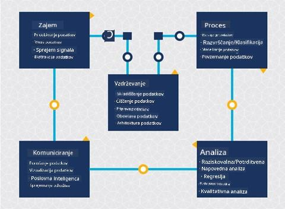
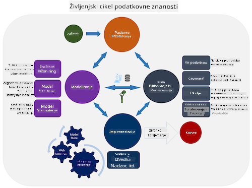

<!--
CO_OP_TRANSLATOR_METADATA:
{
  "original_hash": "07e12a25d20b8f191e3cb651c27fdb2b",
  "translation_date": "2025-09-06T21:45:47+00:00",
  "source_file": "4-Data-Science-Lifecycle/14-Introduction/README.md",
  "language_code": "sl"
}
-->
# Uvod v življenjski cikel podatkovne znanosti

| ](../../sketchnotes/14-DataScience-Lifecycle.png)|
|:---:|
| Uvod v življenjski cikel podatkovne znanosti - _Sketchnote avtorja [@nitya](https://twitter.com/nitya)_ |

## [Predavanje kviz](https://ff-quizzes.netlify.app/en/ds/quiz/26)

Do zdaj ste verjetno že ugotovili, da je podatkovna znanost proces. Ta proces lahko razdelimo na 5 faz:

- Zajemanje
- Obdelava
- Analiza
- Komunikacija
- Vzdrževanje

Ta lekcija se osredotoča na 3 dele življenjskega cikla: zajemanje, obdelavo in vzdrževanje.

> Fotografija avtorja [Berkeley School of Information](https://ischoolonline.berkeley.edu/data-science/what-is-data-science/)

## Zajemanje

Prva faza življenjskega cikla je zelo pomembna, saj so naslednje faze odvisne od nje. Pravzaprav gre za dve fazi združeni v eno: pridobivanje podatkov in določanje namena ter problemov, ki jih je treba rešiti.  
Določanje ciljev projekta zahteva globlji vpogled v problem ali vprašanje. Najprej moramo identificirati in pridobiti tiste, ki potrebujejo rešitev svojega problema. To so lahko deležniki v podjetju ali sponzorji projekta, ki lahko pomagajo določiti, kdo ali kaj bo imelo koristi od tega projekta, ter kaj in zakaj to potrebujejo. Dobro definiran cilj mora biti merljiv in kvantificiran, da lahko določimo sprejemljiv rezultat.

Vprašanja, ki si jih lahko zastavi podatkovni znanstvenik:
- Ali je bil ta problem že obravnavan? Kaj je bilo odkrito?
- Ali vsi vključeni razumejo namen in cilj?
- Ali obstaja nejasnost in kako jo zmanjšati?
- Kakšne so omejitve?
- Kako bo izgledal končni rezultat?
- Koliko virov (časa, ljudi, računalniških) je na voljo?

Naslednji korak je identificiranje, zbiranje in nato raziskovanje podatkov, potrebnih za dosego teh ciljev. V tej fazi pridobivanja morajo podatkovni znanstveniki oceniti tudi količino in kakovost podatkov. To zahteva nekaj raziskovanja podatkov, da potrdimo, da bodo pridobljeni podatki podpirali dosego želenega rezultata.

Vprašanja, ki si jih lahko zastavi podatkovni znanstvenik glede podatkov:
- Kateri podatki so mi že na voljo?
- Kdo je lastnik teh podatkov?
- Kakšni so pomisleki glede zasebnosti?
- Ali imam dovolj podatkov za rešitev tega problema?
- Ali so podatki ustrezne kakovosti za ta problem?
- Če odkrijem dodatne informacije skozi te podatke, ali bi morali razmisliti o spremembi ali ponovni opredelitvi ciljev?

## Obdelava

Faza obdelave v življenjskem ciklu se osredotoča na odkrivanje vzorcev v podatkih in modeliranje. Nekatere tehnike, uporabljene v tej fazi, zahtevajo statistične metode za odkrivanje vzorcev. Običajno bi bila to zamudna naloga za človeka pri delu z velikimi nabori podatkov, zato se zanašamo na računalnike, da pospešijo proces. Ta faza je tudi točka, kjer se podatkovna znanost in strojno učenje prekrivata. Kot ste se naučili v prvi lekciji, je strojno učenje proces gradnje modelov za razumevanje podatkov. Modeli so predstavitev odnosa med spremenljivkami v podatkih, ki pomagajo napovedovati rezultate.

Pogoste tehnike, uporabljene v tej fazi, so obravnavane v učnem načrtu za začetnike v strojnem učenju. Sledite povezavam, da izveste več o njih:

- [Klasifikacija](https://github.com/microsoft/ML-For-Beginners/tree/main/4-Classification): Organiziranje podatkov v kategorije za učinkovitejšo uporabo.
- [Gručenje](https://github.com/microsoft/ML-For-Beginners/tree/main/5-Clustering): Združevanje podatkov v podobne skupine.
- [Regresija](https://github.com/microsoft/ML-For-Beginners/tree/main/2-Regression): Določanje odnosov med spremenljivkami za napovedovanje ali napovedovanje vrednosti.

## Vzdrževanje

Na diagramu življenjskega cikla ste morda opazili, da vzdrževanje leži med zajemanjem in obdelavo. Vzdrževanje je stalen proces upravljanja, shranjevanja in varovanja podatkov skozi celoten proces projekta in ga je treba upoštevati skozi celoten projekt.

### Shranjevanje podatkov

Premisleki o tem, kako in kje so podatki shranjeni, lahko vplivajo na stroške shranjevanja in na zmogljivost dostopa do podatkov. Takšne odločitve verjetno ne bo sprejemal samo podatkovni znanstvenik, vendar se lahko znajde v situaciji, ko mora izbirati, kako delati s podatki glede na način njihovega shranjevanja.

Tukaj je nekaj vidikov sodobnih sistemov za shranjevanje podatkov, ki lahko vplivajo na te odločitve:

**Na lokaciji proti zunaj lokacije ter javni ali zasebni oblak**

Na lokaciji pomeni gostovanje in upravljanje podatkov na lastni opremi, kot je strežnik s trdimi diski, ki shranjujejo podatke, medtem ko zunaj lokacije pomeni zanašanje na opremo, ki ni v vaši lasti, kot je podatkovni center. Javni oblak je priljubljena izbira za shranjevanje podatkov, ki ne zahteva znanja o tem, kako ali kje so podatki natančno shranjeni, pri čemer "javni" pomeni enotno osnovno infrastrukturo, ki jo delijo vsi uporabniki oblaka. Nekatere organizacije imajo stroge varnostne politike, ki zahtevajo popoln dostop do opreme, kjer so podatki gostovani, in se bodo zanašale na zasebni oblak, ki zagotavlja lastne storitve v oblaku. Več o podatkih v oblaku boste izvedeli v [kasnejših lekcijah](https://github.com/microsoft/Data-Science-For-Beginners/tree/main/5-Data-Science-In-Cloud).

**Hladni proti vročim podatkom**

Ko trenirate svoje modele, boste morda potrebovali več učnih podatkov. Če ste zadovoljni s svojim modelom, bodo novi podatki še vedno prihajali, da bo model služil svojemu namenu. V vsakem primeru se bodo stroški shranjevanja in dostopa do podatkov povečali, ko jih boste kopičili. Ločevanje redko uporabljenih podatkov, znanih kot hladni podatki, od pogosto dostopanih vročih podatkov je lahko cenejša možnost shranjevanja podatkov prek strojne ali programske opreme. Če je treba dostopati do hladnih podatkov, lahko traja nekoliko dlje kot pri vročih podatkih.

### Upravljanje podatkov

Ko delate s podatki, lahko ugotovite, da je treba nekatere podatke očistiti z uporabo tehnik, obravnavanih v lekciji o [pripravi podatkov](https://github.com/microsoft/Data-Science-For-Beginners/tree/main/2-Working-With-Data/08-data-preparation), da zgradite natančne modele. Ko prispejo novi podatki, bodo potrebovali enake aplikacije za ohranjanje doslednosti kakovosti. Nekateri projekti bodo vključevali uporabo avtomatiziranega orodja za čiščenje, združevanje in stiskanje podatkov, preden se ti premaknejo na končno lokacijo. Azure Data Factory je primer enega od teh orodij.

### Varovanje podatkov

Eden glavnih ciljev varovanja podatkov je zagotoviti, da tisti, ki z njimi delajo, nadzorujejo, kaj se zbira in v kakšnem kontekstu se uporablja. Ohranjanje varnosti podatkov vključuje omejevanje dostopa le na tiste, ki ga potrebujejo, spoštovanje lokalnih zakonov in predpisov ter ohranjanje etičnih standardov, kot je obravnavano v [lekciji o etiki](https://github.com/microsoft/Data-Science-For-Beginners/tree/main/1-Introduction/02-ethics).

Tukaj je nekaj stvari, ki jih lahko ekipa naredi z mislijo na varnost:
- Potrditev, da so vsi podatki šifrirani
- Zagotavljanje informacij strankam o tem, kako se njihovi podatki uporabljajo
- Odstranitev dostopa do podatkov za tiste, ki so zapustili projekt
- Dovoljenje za spreminjanje podatkov le določenim članom projekta

## 🚀 Izziv

Obstaja veliko različic življenjskega cikla podatkovne znanosti, kjer ima lahko vsak korak drugačna imena in število faz, vendar vsebujejo iste procese, omenjene v tej lekciji.

Raziščite [življenjski cikel procesa podatkovne znanosti ekipe](https://docs.microsoft.com/en-us/azure/architecture/data-science-process/lifecycle) in [križnoindustrijski standardni proces za rudarjenje podatkov](https://www.datascience-pm.com/crisp-dm-2/). Naštejte 3 podobnosti in razlike med obema.

|Proces podatkovne znanosti ekipe (TDSP)|Križnoindustrijski standardni proces za rudarjenje podatkov (CRISP-DM)|
|--|--|
| |  |
| Slika avtorja [Microsoft](https://docs.microsoft.comazure/architecture/data-science-process/lifecycle) | Slika avtorja [Data Science Process Alliance](https://www.datascience-pm.com/crisp-dm-2/) |

## [Kviz po predavanju](https://ff-quizzes.netlify.app/en/ds/quiz/27)

## Pregled in samostojno učenje

Uporaba življenjskega cikla podatkovne znanosti vključuje več vlog in nalog, kjer se nekateri osredotočajo na določene dele vsake faze. Proces podatkovne znanosti ekipe ponuja nekaj virov, ki pojasnjujejo vrste vlog in nalog, ki jih ima lahko nekdo v projektu.

* [Vloge in naloge procesa podatkovne znanosti ekipe](https://docs.microsoft.com/en-us/azure/architecture/data-science-process/roles-tasks)
* [Izvajanje nalog podatkovne znanosti: raziskovanje, modeliranje in uvajanje](https://docs.microsoft.com/en-us/azure/architecture/data-science-process/execute-data-science-tasks)

## Naloga

[Ocenjevanje nabora podatkov](assignment.md)

---

**Omejitev odgovornosti**:  
Ta dokument je bil preveden z uporabo storitve za strojno prevajanje [Co-op Translator](https://github.com/Azure/co-op-translator). Čeprav si prizadevamo za natančnost, vas prosimo, da upoštevate, da lahko avtomatizirani prevodi vsebujejo napake ali netočnosti. Izvirni dokument v njegovem izvirnem jeziku je treba obravnavati kot avtoritativni vir. Za ključne informacije priporočamo strokovno človeško prevajanje. Ne prevzemamo odgovornosti za morebitna nesporazumevanja ali napačne razlage, ki izhajajo iz uporabe tega prevoda.