<!--
CO_OP_TRANSLATOR_METADATA:
{
  "original_hash": "14b2a7f1c63202920bd98eeb913f5614",
  "translation_date": "2025-08-30T17:40:29+00:00",
  "source_file": "5-Data-Science-In-Cloud/18-Low-Code/README.md",
  "language_code": "sl"
}
-->
# Podatkovna znanost v oblaku: Način "Low code/No code"

| ](../../sketchnotes/18-DataScience-Cloud.png)|
|:---:|
| Podatkovna znanost v oblaku: Low Code - _Sketchnote by [@nitya](https://twitter.com/nitya)_ |

Kazalo:

- [Podatkovna znanost v oblaku: Način "Low code/No code"](../../../../5-Data-Science-In-Cloud/18-Low-Code)
  - [Predhodni kviz](../../../../5-Data-Science-In-Cloud/18-Low-Code)
  - [1. Uvod](../../../../5-Data-Science-In-Cloud/18-Low-Code)
    - [1.1 Kaj je Azure Machine Learning?](../../../../5-Data-Science-In-Cloud/18-Low-Code)
    - [1.2 Projekt napovedovanja srčnega popuščanja:](../../../../5-Data-Science-In-Cloud/18-Low-Code)
    - [1.3 Podatkovni niz srčnega popuščanja:](../../../../5-Data-Science-In-Cloud/18-Low-Code)
  - [2. Usposabljanje modela z nizko kodo/brez kode v Azure ML Studio](../../../../5-Data-Science-In-Cloud/18-Low-Code)
    - [2.1 Ustvarjanje delovnega prostora Azure ML](../../../../5-Data-Science-In-Cloud/18-Low-Code)
    - [2.2 Računalniški viri](../../../../5-Data-Science-In-Cloud/18-Low-Code)
      - [2.2.1 Izbira pravih možnosti za računalniške vire](../../../../5-Data-Science-In-Cloud/18-Low-Code)
      - [2.2.2 Ustvarjanje računalniškega grozda](../../../../5-Data-Science-In-Cloud/18-Low-Code)
    - [2.3 Nalaganje podatkovnega niza](../../../../5-Data-Science-In-Cloud/18-Low-Code)
    - [2.4 Usposabljanje z nizko kodo/brez kode z AutoML](../../../../5-Data-Science-In-Cloud/18-Low-Code)
  - [3. Namestitev modela z nizko kodo/brez kode in uporaba končne točke](../../../../5-Data-Science-In-Cloud/18-Low-Code)
    - [3.1 Namestitev modela](../../../../5-Data-Science-In-Cloud/18-Low-Code)
    - [3.2 Uporaba končne točke](../../../../5-Data-Science-In-Cloud/18-Low-Code)
  - [🚀 Izziv](../../../../5-Data-Science-In-Cloud/18-Low-Code)
  - [Kvizi po predavanju](../../../../5-Data-Science-In-Cloud/18-Low-Code)
  - [Pregled in samostojno učenje](../../../../5-Data-Science-In-Cloud/18-Low-Code)
  - [Naloga](../../../../5-Data-Science-In-Cloud/18-Low-Code)

## [Predhodni kviz](https://purple-hill-04aebfb03.1.azurestaticapps.net/quiz/34)
## 1. Uvod
### 1.1 Kaj je Azure Machine Learning?

Azure je oblačna platforma z več kot 200 izdelki in storitvami, zasnovanimi za pomoč pri ustvarjanju novih rešitev. Podatkovni znanstveniki porabijo veliko časa za raziskovanje in predobdelavo podatkov ter preizkušanje različnih algoritmov za usposabljanje modelov, da bi ustvarili natančne modele. Te naloge so časovno zahtevne in pogosto neučinkovito izkoriščajo drago računalniško strojno opremo.

[Azure ML](https://docs.microsoft.com/azure/machine-learning/overview-what-is-azure-machine-learning?WT.mc_id=academic-77958-bethanycheum&ocid=AID3041109) je oblačna platforma za gradnjo in upravljanje rešitev strojnega učenja v Azure. Ponuja širok nabor funkcij in zmogljivosti, ki pomagajo podatkovnim znanstvenikom pri pripravi podatkov, usposabljanju modelov, objavi napovednih storitev in spremljanju njihove uporabe. Najpomembneje je, da povečuje njihovo učinkovitost z avtomatizacijo številnih časovno zahtevnih nalog, povezanih z usposabljanjem modelov, ter omogoča uporabo oblačnih računalniških virov, ki se učinkovito prilagajajo za obdelavo velikih količin podatkov, pri čemer nastanejo stroški le ob dejanski uporabi.

Azure ML ponuja vsa orodja, ki jih razvijalci in podatkovni znanstveniki potrebujejo za svoje delovne procese strojnega učenja. Ta vključujejo:

- **Azure Machine Learning Studio**: spletni portal v Azure Machine Learning za možnosti z nizko kodo in brez kode za usposabljanje modelov, namestitev, avtomatizacijo, sledenje in upravljanje sredstev. Studio se integrira z Azure Machine Learning SDK za brezhibno izkušnjo.
- **Jupyter Notebooks**: hitro prototipiranje in testiranje modelov strojnega učenja.
- **Azure Machine Learning Designer**: omogoča povleci-in-spusti module za gradnjo eksperimentov in nato namestitev cevovodov v okolju z nizko kodo.
- **Avtomatiziran uporabniški vmesnik strojnega učenja (AutoML)**: avtomatizira iterativne naloge razvoja modelov strojnega učenja, kar omogoča gradnjo modelov z visoko učinkovitostjo in produktivnostjo, hkrati pa ohranja kakovost modelov.
- **Označevanje podatkov**: orodje za pomoč pri strojnem učenju za samodejno označevanje podatkov.
- **Razširitev strojnega učenja za Visual Studio Code**: ponuja popolnoma opremljeno razvojno okolje za gradnjo in upravljanje projektov strojnega učenja.
- **CLI za strojno učenje**: ponuja ukaze za upravljanje virov Azure ML iz ukazne vrstice.
- **Integracija z odprtokodnimi ogrodji**, kot so PyTorch, TensorFlow, Scikit-learn in mnogi drugi, za usposabljanje, namestitev in upravljanje celotnega procesa strojnega učenja.
- **MLflow**: odprtokodna knjižnica za upravljanje življenjskega cikla eksperimentov strojnega učenja. **MLFlow Tracking** je komponenta MLflow, ki beleži in spremlja metrike usposabljanja ter artefakte modelov, ne glede na okolje eksperimenta.

### 1.2 Projekt napovedovanja srčnega popuščanja:

Ni dvoma, da je izdelava projektov najboljši način za preizkus vaših veščin in znanja. V tej lekciji bomo raziskali dva različna načina gradnje projekta podatkovne znanosti za napovedovanje srčnih napadov v Azure ML Studio, in sicer z nizko kodo/brez kode ter z uporabo Azure ML SDK, kot je prikazano v naslednji shemi:

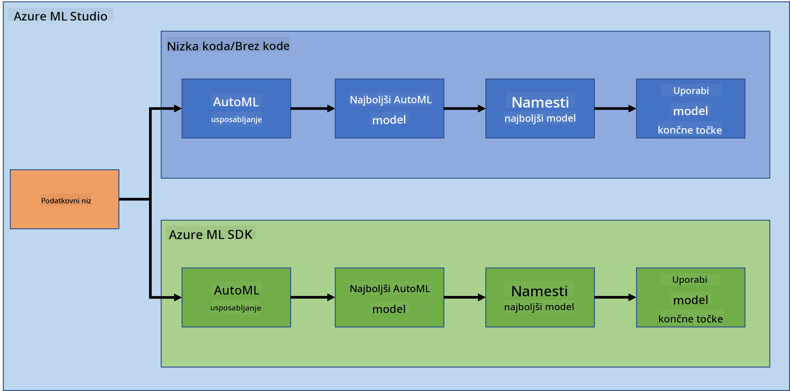

Vsak način ima svoje prednosti in slabosti. Način z nizko kodo/brez kode je lažji za začetek, saj vključuje interakcijo z grafičnim uporabniškim vmesnikom (GUI) in ne zahteva predhodnega znanja o kodiranju. Ta metoda omogoča hitro testiranje izvedljivosti projekta in ustvarjanje POC (Proof Of Concept). Vendar pa, ko projekt raste in je treba stvari pripraviti za produkcijo, ni izvedljivo ustvarjati virov prek GUI. Takrat je ključnega pomena znanje uporabe Azure ML SDK.

|                   | Nizka koda/Brez kode | Azure ML SDK              |
|-------------------|----------------------|---------------------------|
| Znanje kodiranja  | Ni potrebno          | Potrebno                  |
| Čas razvoja       | Hiter in enostaven   | Odvisno od znanja kodiranja |
| Pripravljenost za produkcijo | Ne               | Da                       |

### 1.3 Podatkovni niz srčnega popuščanja:

Kardiovaskularne bolezni (CVD) so glavni vzrok smrti po vsem svetu, saj predstavljajo 31 % vseh smrti. Okoljski in vedenjski dejavniki tveganja, kot so uporaba tobaka, nezdrava prehrana in debelost, telesna neaktivnost ter škodljiva uporaba alkohola, bi lahko služili kot značilnosti za ocenjevalne modele. Sposobnost ocenjevanja verjetnosti razvoja CVD bi bila zelo koristna za preprečevanje napadov pri ljudeh z visokim tveganjem.

Kaggle je objavil [podatkovni niz srčnega popuščanja](https://www.kaggle.com/andrewmvd/heart-failure-clinical-data), ki ga bomo uporabili za ta projekt. Podatkovni niz lahko prenesete zdaj. Gre za tabelarni podatkovni niz s 13 stolpci (12 značilnosti in 1 ciljno spremenljivko) ter 299 vrsticami.

|    | Ime spremenljivke         | Tip            | Opis                                                   | Primer            |
|----|---------------------------|----------------|-------------------------------------------------------|-------------------|
| 1  | age                       | numerični      | starost pacienta                                      | 25                |
| 2  | anaemia                   | logični        | Zmanjšanje rdečih krvnih celic ali hemoglobina        | 0 ali 1           |
| 3  | creatinine_phosphokinase  | numerični      | Raven encima CPK v krvi                               | 542               |
| 4  | diabetes                  | logični        | Ali ima pacient sladkorno bolezen                    | 0 ali 1           |
| 5  | ejection_fraction         | numerični      | Odstotek krvi, ki zapusti srce ob vsakem krčenju      | 45                |
| 6  | high_blood_pressure       | logični        | Ali ima pacient hipertenzijo                          | 0 ali 1           |
| 7  | platelets                 | numerični      | Trombociti v krvi                                     | 149000            |
| 8  | serum_creatinine          | numerični      | Raven serumske kreatinina v krvi                     | 0.5               |
| 9  | serum_sodium              | numerični      | Raven serumske natrija v krvi                        | jun               |
| 10 | sex                       | logični        | ženska ali moški                                      | 0 ali 1           |
| 11 | smoking                   | logični        | Ali pacient kadi                                      | 0 ali 1           |
| 12 | time                      | numerični      | obdobje spremljanja (dni)                            | 4                 |
|----|---------------------------|----------------|-------------------------------------------------------|-------------------|
| 21 | DEATH_EVENT [Cilj]        | logični        | Ali pacient umre med obdobjem spremljanja            | 0 ali 1           |

Ko imate podatkovni niz, lahko začnemo projekt v Azure.

## 2. Usposabljanje modela z nizko kodo/brez kode v Azure ML Studio
### 2.1 Ustvarjanje delovnega prostora Azure ML
Za usposabljanje modela v Azure ML morate najprej ustvariti delovni prostor Azure ML. Delovni prostor je najvišji vir za Azure Machine Learning, ki zagotavlja centralizirano mesto za delo z vsemi artefakti, ki jih ustvarite pri uporabi Azure Machine Learning. Delovni prostor vodi zgodovino vseh usposabljanj, vključno z dnevniki, metrikami, rezultati in posnetki vaših skriptov. Te informacije uporabite za določitev, katero usposabljanje ustvari najboljši model. [Več o tem](https://docs.microsoft.com/azure/machine-learning/concept-workspace?WT.mc_id=academic-77958-bethanycheum&ocid=AID3041109)

Priporočljivo je, da uporabljate najbolj posodobljen brskalnik, ki je združljiv z vašim operacijskim sistemom. Podprti so naslednji brskalniki:

- Microsoft Edge (novi Microsoft Edge, najnovejša različica. Ne Microsoft Edge legacy)
- Safari (najnovejša različica, samo Mac)
- Chrome (najnovejša različica)
- Firefox (najnovejša različica)

Za uporabo Azure Machine Learning ustvarite delovni prostor v svoji naročnini Azure. Nato lahko ta delovni prostor uporabite za upravljanje podatkov, računalniških virov, kode, modelov in drugih artefaktov, povezanih z vašimi delovnimi obremenitvami strojnega učenja.

> **_OPOMBA:_** Vaša naročnina Azure bo zaračunana majhen znesek za shranjevanje podatkov, dokler delovni prostor Azure Machine Learning obstaja v vaši naročnini, zato priporočamo, da izbrišete delovni prostor Azure Machine Learning, ko ga ne uporabljate več.

1. Prijavite se v [portal Azure](https://ms.portal.azure.com/) z Microsoftovimi poverilnicami, povezanimi z vašo naročnino Azure.
2. Izberite **＋Ustvari vir**
   
   

   Poiščite Machine Learning in izberite ploščico Machine Learning

   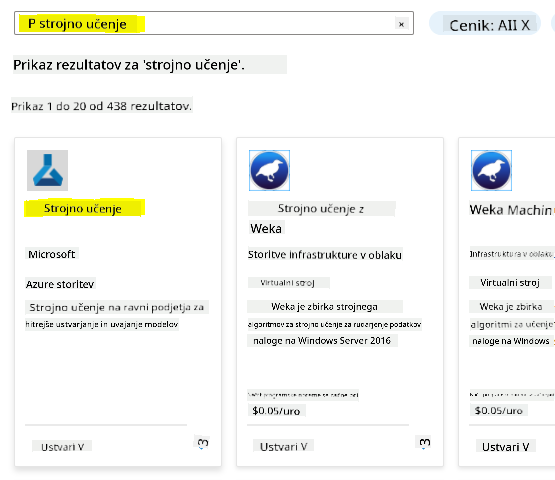

   Kliknite gumb za ustvarjanje

   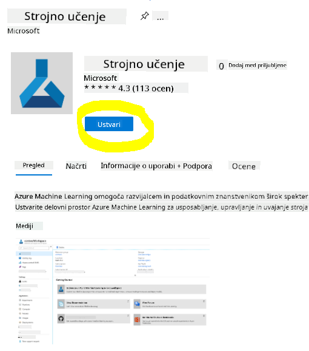

   Izpolnite nastavitve, kot sledi:
   - Naročnina: Vaša naročnina Azure
   - Skupina virov: Ustvarite ali izberite skupino virov
   - Ime delovnega prostora: Vnesite edinstveno ime za vaš delovni prostor
   - Regija: Izberite geografsko regijo, ki je najbližja vam
   - Račun za shranjevanje: Upoštevajte privzeti nov račun za shranjevanje, ki bo ustvarjen za vaš delovni prostor
   - Ključni trezor: Upoštevajte privzeti nov ključni trezor, ki bo ustvarjen za vaš delovni prostor
   - Aplikacijski vpogledi: Upoštevajte privzeti nov vir aplikacijskih vpogledov, ki bo ustvarjen za vaš delovni prostor
   - Register vsebnikov: Noben (eden bo samodejno ustvarjen ob prvi namestitvi modela v vsebnik)

    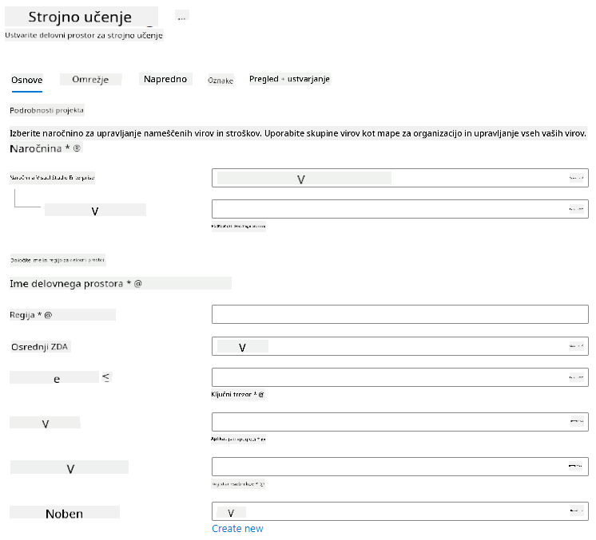

   - Kliknite gumb za pregled in ustvarjanje ter nato gumb za ustvarjanje
3. Počakajte, da se vaš delovni prostor ustvari (to lahko traja nekaj minut). Nato pojdite nanj v portalu. Najdete ga lahko prek storitve Machine Learning Azure.
4. Na strani Pregled za vaš delovni prostor zaženite Azure Machine Learning studio (ali odprite nov zavihek brskalnika in pojdite na https://ml.azure.com), ter se prijavite v Azure Machine Learning studio z Microsoftovim računom. Če ste pozvani, izberite svoj imenik in naročnino Azure ter svoj delovni prostor Azure Machine Learning.
   
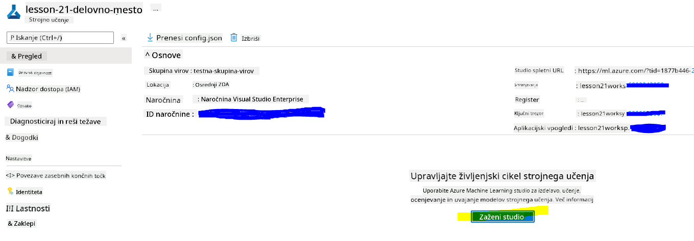

5. V Azure Machine Learning studio preklopite ikono ☰ na vrhu levo, da si ogledate različne strani vmesnika. Te strani lahko uporabite za upravljanje virov v vašem delovnem prostoru.

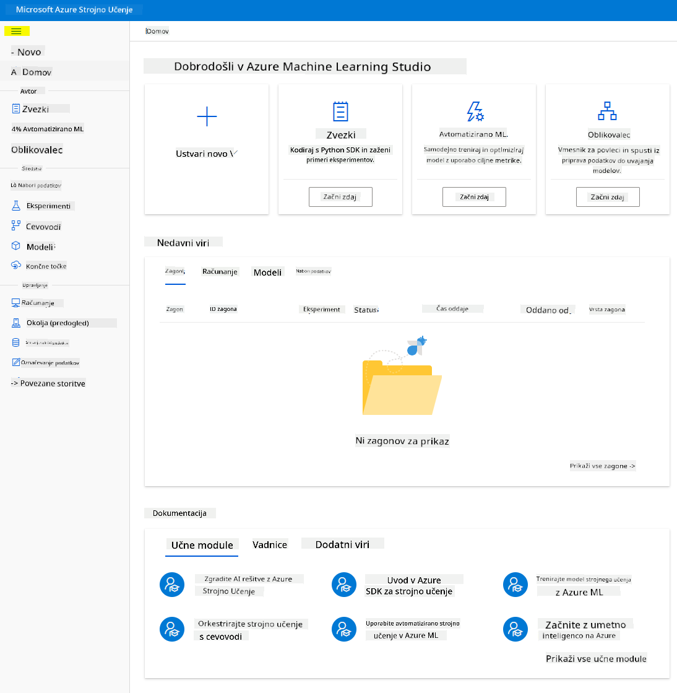

Delovni prostor lahko upravljate z uporabo portala Azure, vendar za podatkovne znanstvenike in inženirje operacij strojnega učenja Azure Machine Learning Studio ponuja bolj osredotočen uporabniški vmesnik za upravljanje virov delovnega prostora.

### 2.2 Računalniški viri

Računalniški viri so oblačni viri, na katerih lahko izvajate procese usposabljanja modelov in raziskovanja podatkov. Obstajajo štiri vrste računalniških virov, ki jih lahko ustvarite:

- **Računalniški primerki**: Razvojne delovne postaje, ki jih podatkovni znanstveniki lahko uporabljajo za delo s podatki in modeli. To vključuje ustvarjanje virtualnega stroja (VM) in zagon primerka beležke. Nato lahko usposabljate model z uporabo računalniškega grozda iz beležke.
- **Računalniški grozdi**: Prilagodljivi grozdi VM za procesiranje eksperimentne kode na zahtevo. Potrebovali jih boste pri usposabljanju modela. Računalniški grozdi lahko uporabljajo tudi specializirane GPU ali CPU vire.
- **Inferenčni grozdi**: Cilji za namestitev napovednih storitev, ki uporabljajo vaše usposobljene modele.
- **Priključeni izračun**: Povezave do obstoječih Azure računalniških virov, kot so virtualni stroji ali Azure Databricks grozdi.

#### 2.2.1 Izbira pravih možnosti za vaše računalniške vire

Pri ustvarjanju računalniškega vira je treba upoštevati nekaj ključnih dejavnikov, saj so te odločitve lahko ključnega pomena.

**Ali potrebujete CPU ali GPU?**

CPU (Centralna procesna enota) je elektronsko vezje, ki izvaja ukaze računalniškega programa. GPU (Grafična procesna enota) je specializirano elektronsko vezje, ki lahko izvaja grafično povezano kodo z zelo visoko hitrostjo.

Glavna razlika med arhitekturo CPU in GPU je, da je CPU zasnovan za hitro obdelavo širokega spektra nalog (merjeno s hitrostjo procesorja), vendar je omejen v sočasnosti nalog, ki jih lahko izvaja. GPU-ji so zasnovani za vzporedno računalništvo in so zato veliko boljši za naloge globokega učenja.

| CPU                                     | GPU                         |
|-----------------------------------------|-----------------------------|
| Manj drago                              | Dražje                     |
| Nižja stopnja sočasnosti                | Višja stopnja sočasnosti   |
| Počasnejši pri treniranju modelov globokega učenja | Optimalen za globoko učenje |

**Velikost grozda**

Večji grozdi so dražji, vendar zagotavljajo boljšo odzivnost. Če imate čas, vendar omejen proračun, začnite z manjšim grozdom. Če pa imate denar, vendar malo časa, začnite z večjim grozdom.

**Velikost VM**

Glede na vaše časovne in proračunske omejitve lahko prilagodite velikost RAM-a, diska, število jeder in hitrost procesorja. Povečanje vseh teh parametrov bo dražje, vendar bo prineslo boljšo zmogljivost.

**Namenske ali nizkoprednostne instance?**

Nizkoprednostna instanca pomeni, da je prekinljiva: Microsoft Azure lahko te vire dodeli drugi nalogi, kar lahko prekine vašo nalogo. Namenska instanca, ali neprekinljiva, pomeni, da naloga ne bo nikoli prekinjena brez vašega dovoljenja. To je še ena odločitev med časom in denarjem, saj so prekinljive instance cenejše od namenskih.

#### 2.2.2 Ustvarjanje računalniškega grozda

V [Azure ML delovnem prostoru](https://ml.azure.com/), ki smo ga ustvarili prej, pojdite na zavihek "Compute" in si oglejte različne računalniške vire, o katerih smo govorili (npr. računalniške instance, računalniški grozdi, inferenčni grozdi in priključeni izračuni). Za ta projekt bomo potrebovali računalniški grozd za treniranje modela. V Studiu kliknite meni "Compute", nato zavihek "Compute cluster" in kliknite gumb "+ New" za ustvarjanje računalniškega grozda.

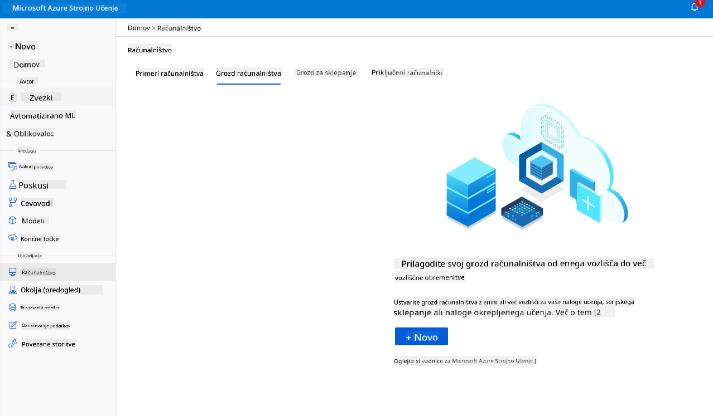

1. Izberite svoje možnosti: Namensko ali nizkoprednostno, CPU ali GPU, velikost VM in število jeder (za ta projekt lahko obdržite privzete nastavitve).
2. Kliknite gumb "Next".

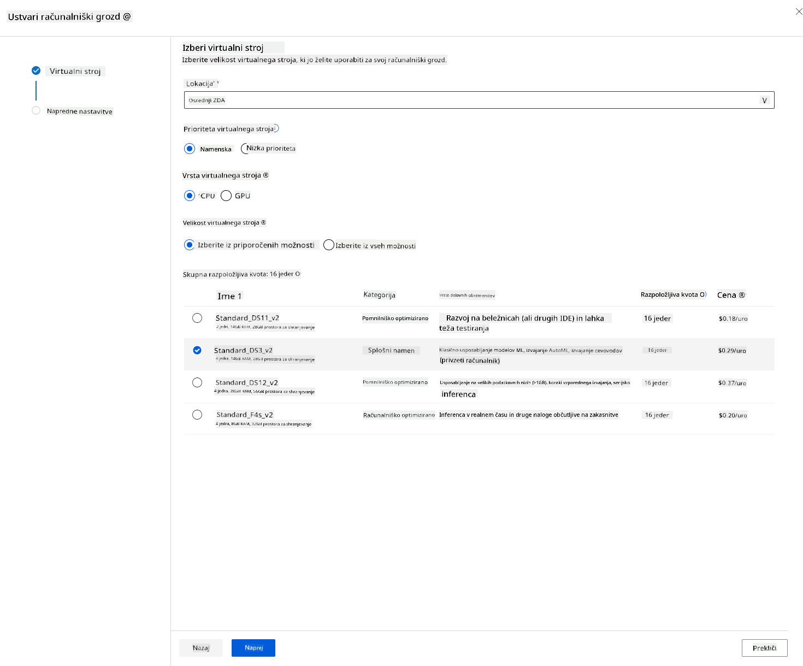

3. Dajte grozdu ime.
4. Izberite svoje možnosti: Minimalno/maksimalno število vozlišč, število sekund nedejavnosti pred zmanjšanjem obsega, SSH dostop. Upoštevajte, da če je minimalno število vozlišč 0, boste prihranili denar, ko bo grozd nedejaven. Upoštevajte, da večje število maksimalnih vozlišč pomeni krajši čas treniranja. Priporočeno maksimalno število vozlišč je 3.  
5. Kliknite gumb "Create". Ta korak lahko traja nekaj minut.

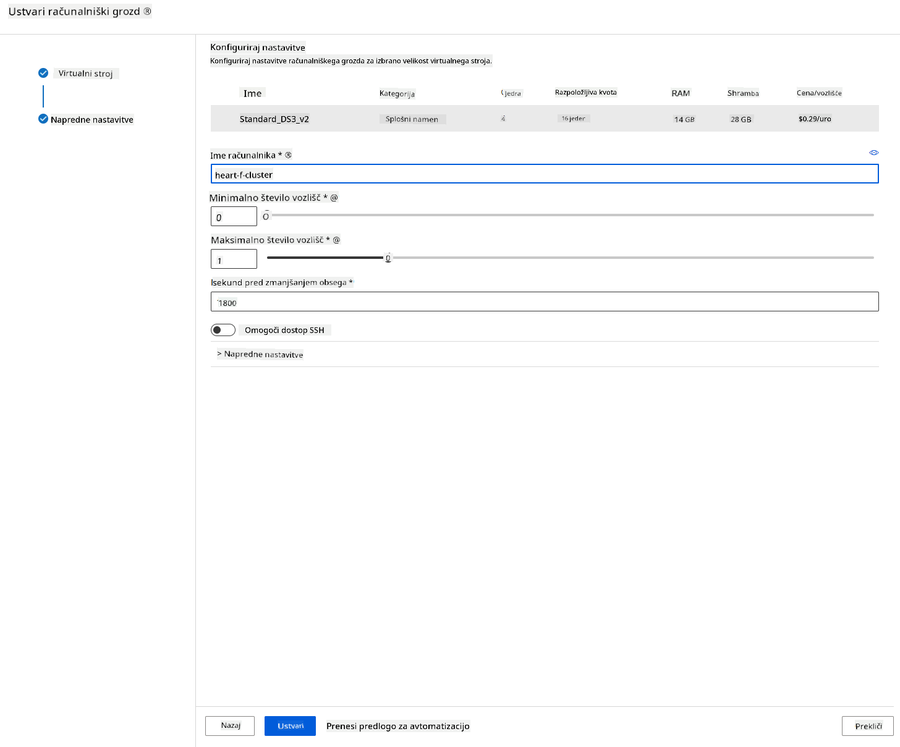

Odlično! Zdaj, ko imamo računalniški grozd, moramo naložiti podatke v Azure ML Studio.

### 2.3 Nalaganje podatkovnega nabora

1. V [Azure ML delovnem prostoru](https://ml.azure.com/), ki smo ga ustvarili prej, kliknite "Datasets" v levem meniju in nato gumb "+ Create dataset" za ustvarjanje podatkovnega nabora. Izberite možnost "From local files" in izberite Kaggle podatkovni niz, ki smo ga prenesli prej.
   
   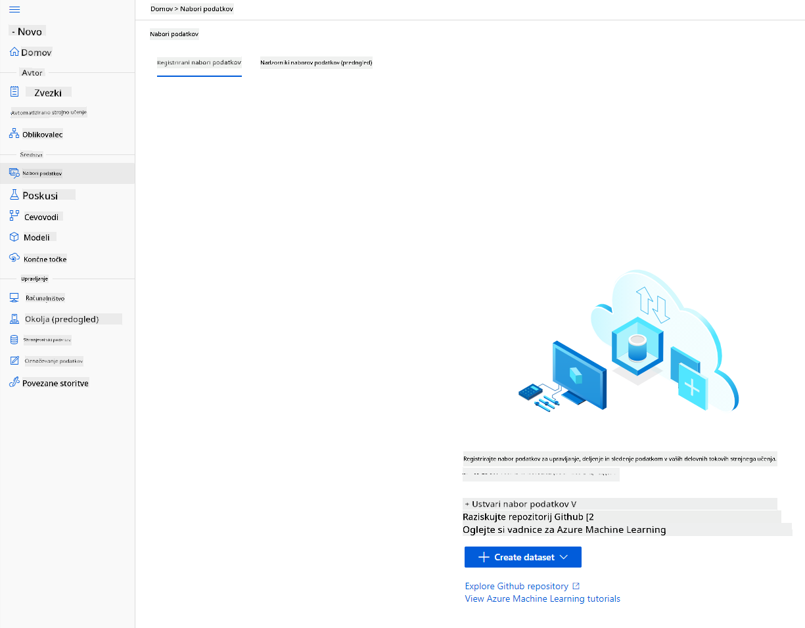

2. Dajte podatkovnemu naboru ime, vrsto in opis. Kliknite "Next". Naložite podatke iz datotek. Kliknite "Next".
   
   

3. V shemi spremenite vrsto podatkov v Boolean za naslednje značilnosti: anemija, diabetes, visok krvni tlak, spol, kajenje in DEATH_EVENT. Kliknite "Next" in nato "Create".
   
   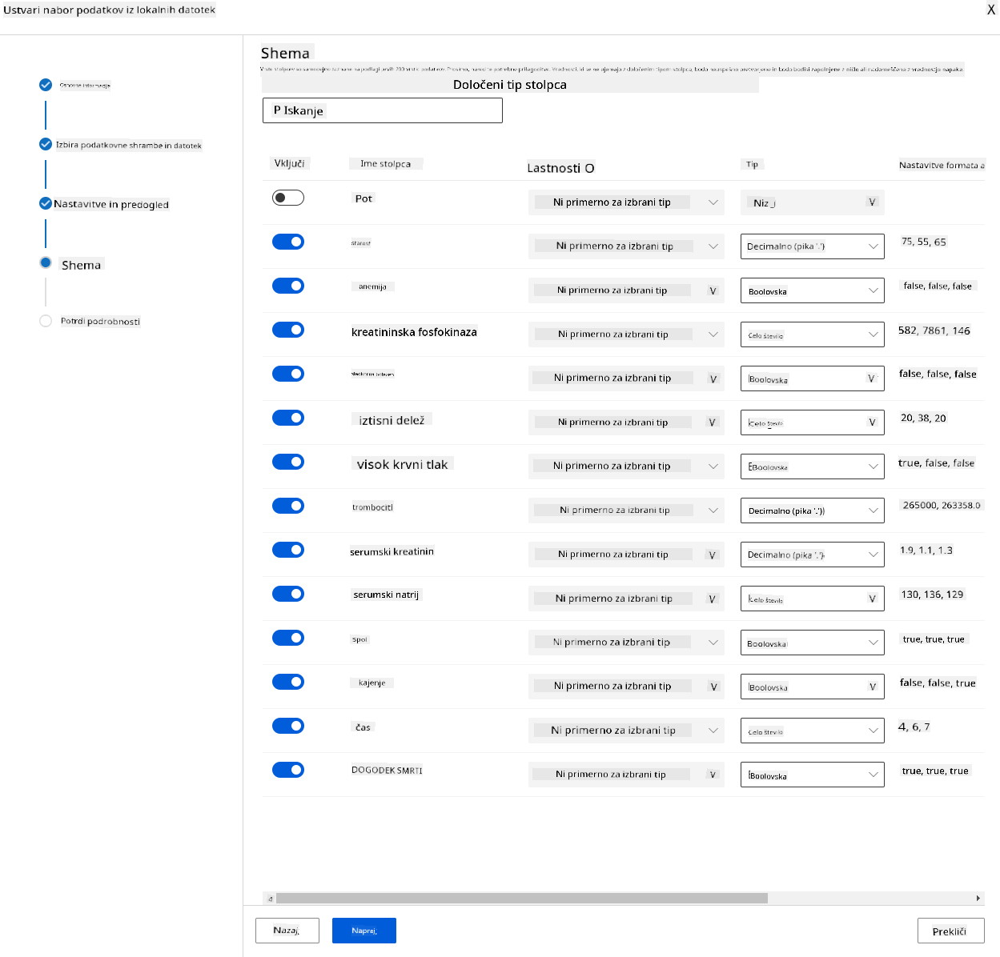

Odlično! Zdaj, ko je podatkovni niz pripravljen in je računalniški grozd ustvarjen, lahko začnemo s treniranjem modela!

### 2.4 Treniranje z malo ali brez kode z AutoML

Tradicionalni razvoj modelov strojnega učenja je zahteven, potrebuje veliko domenskega znanja in časa za izdelavo ter primerjavo več modelov. Avtomatizirano strojno učenje (AutoML) je proces avtomatizacije zamudnih, ponavljajočih se nalog razvoja modelov strojnega učenja. Omogoča podatkovnim znanstvenikom, analitikom in razvijalcem, da gradijo modele strojnega učenja z visoko učinkovitostjo in produktivnostjo, hkrati pa ohranjajo kakovost modela. Zmanjšuje čas, potreben za pripravo modelov za produkcijo, z veliko lahkoto in učinkovitostjo. [Več o tem](https://docs.microsoft.com/azure/machine-learning/concept-automated-ml?WT.mc_id=academic-77958-bethanycheum&ocid=AID3041109)

1. V [Azure ML delovnem prostoru](https://ml.azure.com/), ki smo ga ustvarili prej, kliknite "Automated ML" v levem meniju in izberite podatkovni niz, ki ste ga pravkar naložili. Kliknite "Next".

   

2. Vnesite novo ime eksperimenta, ciljni stolpec (DEATH_EVENT) in računalniški grozd, ki smo ga ustvarili. Kliknite "Next".
   
   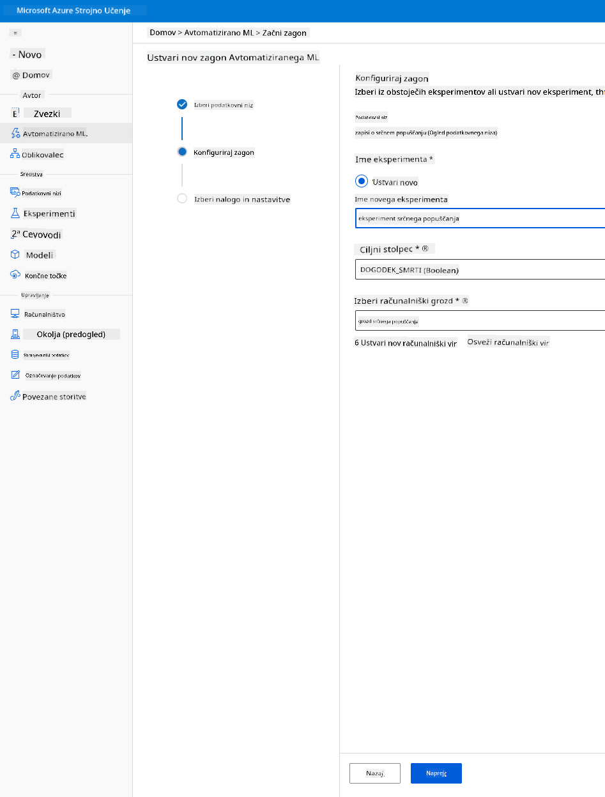

3. Izberite "Classification" in kliknite "Finish". Ta korak lahko traja med 30 minutami in 1 uro, odvisno od velikosti vašega računalniškega grozda.
    
    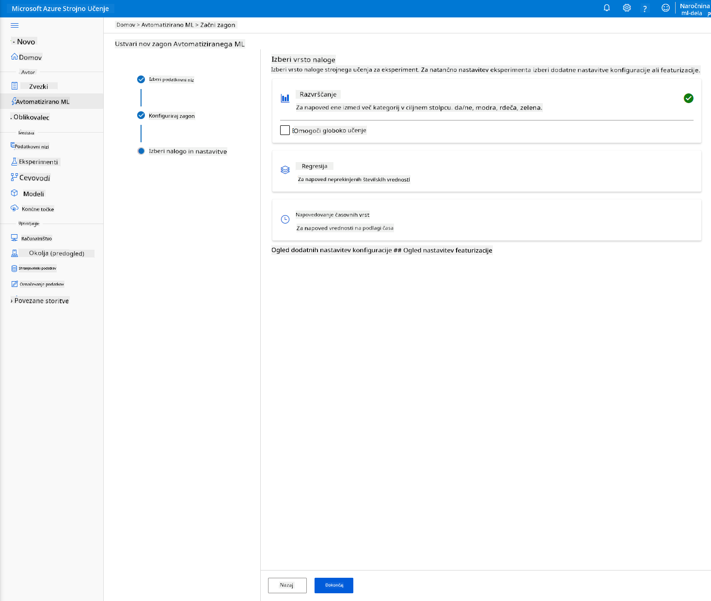

4. Ko je postopek zaključen, kliknite na zavihek "Automated ML", izberite svoj zagon in kliknite na algoritem v kartici "Best model summary".
    
    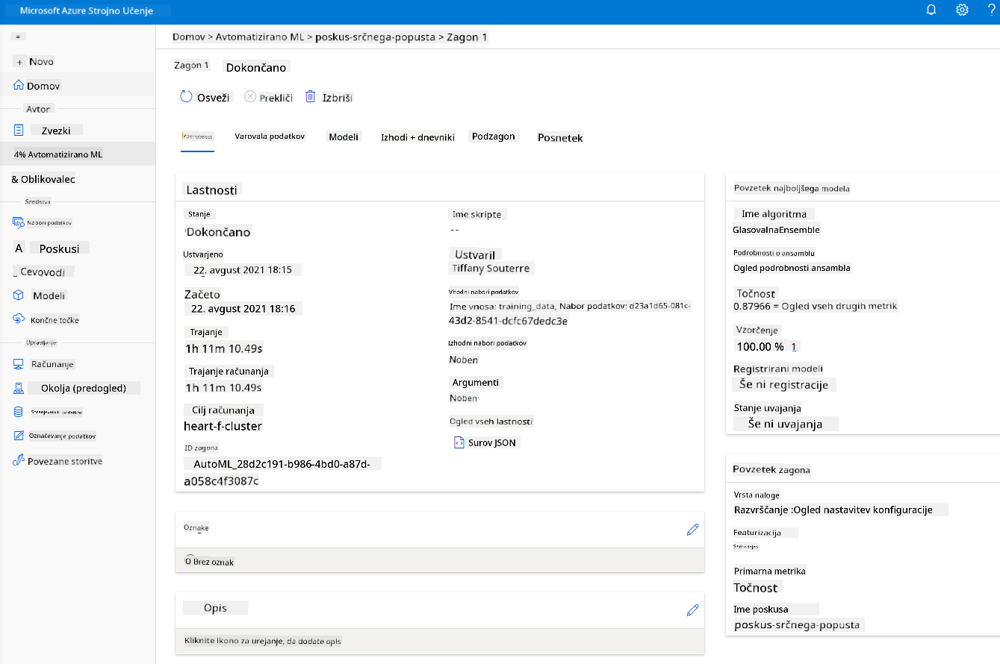

Tukaj si lahko ogledate podroben opis najboljšega modela, ki ga je ustvaril AutoML. Prav tako lahko raziščete druge modele v zavihku "Models". Vzemite si nekaj minut za raziskovanje modelov v razdelku "Explanations (preview)". Ko izberete model, ki ga želite uporabiti (v tem primeru bomo izbrali najboljši model, ki ga je izbral AutoML), bomo videli, kako ga lahko implementiramo.

## 3. Implementacija modela z malo ali brez kode in uporaba končne točke
### 3.1 Implementacija modela

Vmesnik za avtomatizirano strojno učenje omogoča implementacijo najboljšega modela kot spletne storitve v nekaj korakih. Implementacija je integracija modela, da lahko na podlagi novih podatkov napoveduje in prepozna potencialna področja priložnosti. Za ta projekt implementacija kot spletna storitev pomeni, da bodo medicinske aplikacije lahko uporabljale model za napovedovanje tveganja srčnega napada pri svojih pacientih.

V opisu najboljšega modela kliknite gumb "Deploy".
    
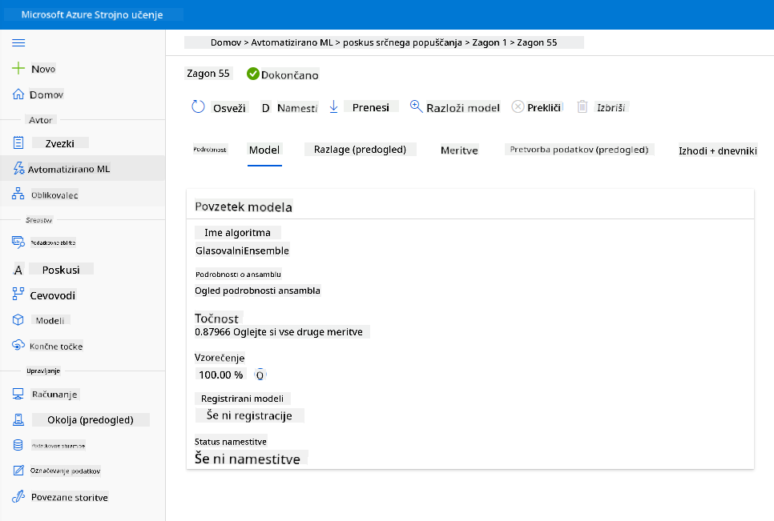

15. Dajte mu ime, opis, vrsto računalništva (Azure Container Instance), omogočite avtentikacijo in kliknite "Deploy". Ta korak lahko traja približno 20 minut. Postopek implementacije vključuje več korakov, vključno z registracijo modela, ustvarjanjem virov in njihovo konfiguracijo za spletno storitev. Pod statusom implementacije se prikaže sporočilo o stanju. Občasno kliknite "Refresh", da preverite stanje implementacije. Ko je status "Healthy", je implementacija zaključena in storitev deluje.

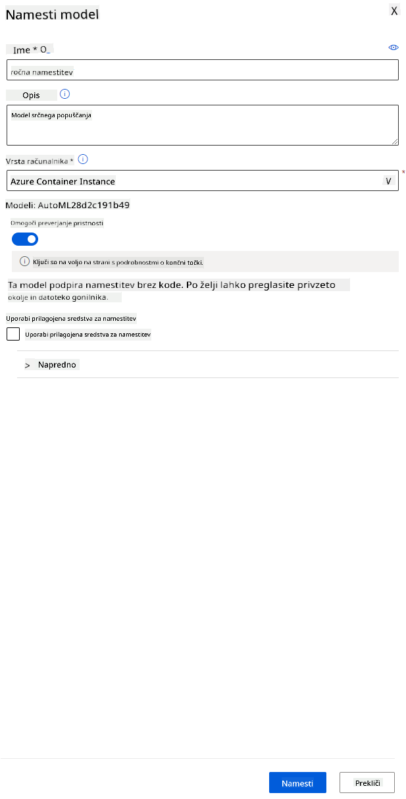

16. Ko je implementacija zaključena, kliknite na zavihek "Endpoint" in izberite končno točko, ki ste jo pravkar implementirali. Tukaj lahko najdete vse podrobnosti o končni točki.

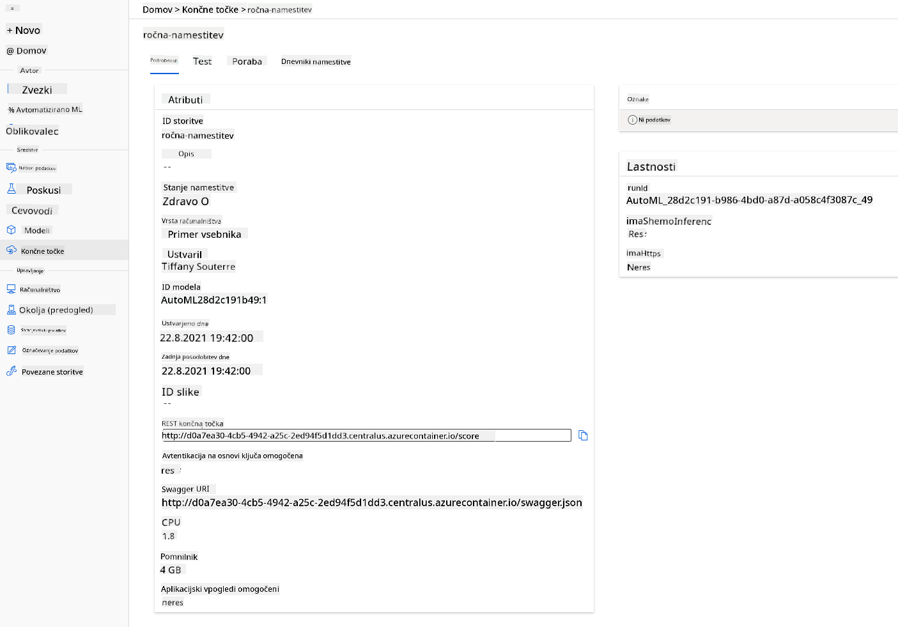

Neverjetno! Zdaj, ko imamo model implementiran, lahko začnemo z uporabo končne točke.

### 3.2 Uporaba končne točke

Kliknite na zavihek "Consume". Tukaj lahko najdete REST končno točko in Python skripto v razdelku za uporabo. Vzemite si čas za pregled Python kode.

Ta skripta se lahko zažene neposredno iz vašega lokalnega računalnika in bo uporabljala vašo končno točko.

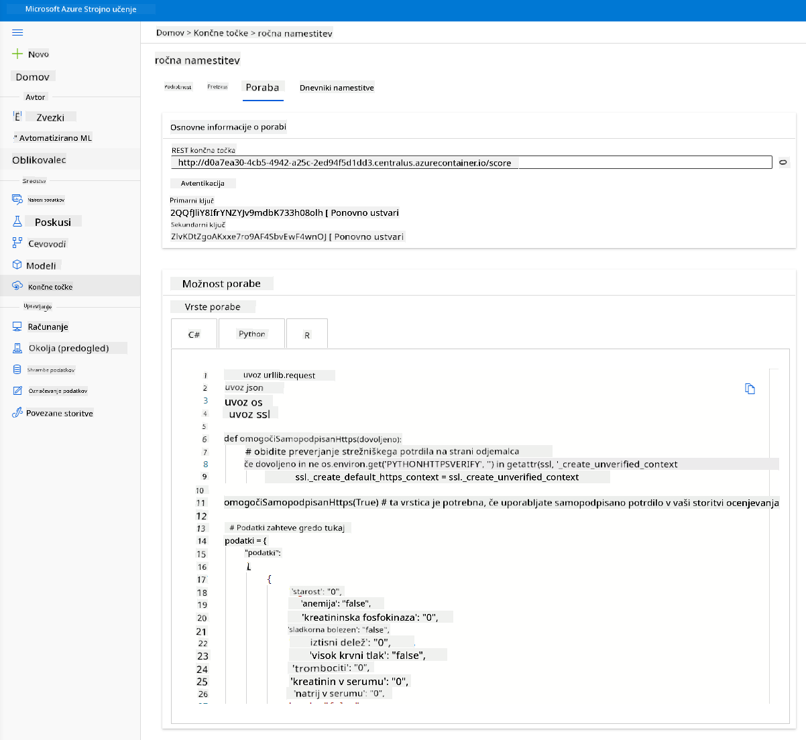

Vzemite si trenutek za pregled teh dveh vrstic kode:

```python
url = 'http://98e3715f-xxxx-xxxx-xxxx-9ec22d57b796.centralus.azurecontainer.io/score'
api_key = '' # Replace this with the API key for the web service
```
Spremenljivka `url` je REST končna točka, ki jo najdete v zavihku za uporabo, in spremenljivka `api_key` je primarni ključ, ki ga prav tako najdete v zavihku za uporabo (samo v primeru, da ste omogočili avtentikacijo). Tako skripta uporablja končno točko.

18. Ko zaženete skripto, bi morali videti naslednji izhod:
    ```python
    b'"{\\"result\\": [true]}"'
    ```
To pomeni, da je napoved srčnega popuščanja za dane podatke resnična. To je smiselno, saj so vsi podatki, ki jih skripta samodejno generira, privzeto nastavljeni na 0 in napačno. Podatke lahko spremenite z naslednjim vzorcem vnosa:

```python
data = {
    "data":
    [
        {
            'age': "0",
            'anaemia': "false",
            'creatinine_phosphokinase': "0",
            'diabetes': "false",
            'ejection_fraction': "0",
            'high_blood_pressure': "false",
            'platelets': "0",
            'serum_creatinine': "0",
            'serum_sodium': "0",
            'sex': "false",
            'smoking': "false",
            'time': "0",
        },
        {
            'age': "60",
            'anaemia': "false",
            'creatinine_phosphokinase': "500",
            'diabetes': "false",
            'ejection_fraction': "38",
            'high_blood_pressure': "false",
            'platelets': "260000",
            'serum_creatinine': "1.40",
            'serum_sodium': "137",
            'sex': "false",
            'smoking': "false",
            'time': "130",
        },
    ],
}
```
Skripta bi morala vrniti:
    ```python
    b'"{\\"result\\": [true, false]}"'
    ```

Čestitke! Pravkar ste uporabili implementiran model in ga trenirali na Azure ML!

> **_OPOMBA:_** Ko končate s projektom, ne pozabite izbrisati vseh virov.
## 🚀 Izziv

Podrobno preglejte razlage modelov in podrobnosti, ki jih je AutoML ustvaril za najboljše modele. Poskusite razumeti, zakaj je najboljši model boljši od drugih. Kateri algoritmi so bili primerjani? Kakšne so razlike med njimi? Zakaj je najboljši model v tem primeru boljši?

## [Kvizi po predavanju](https://purple-hill-04aebfb03.1.azurestaticapps.net/quiz/35)

## Pregled in samostojno učenje

V tej lekciji ste se naučili, kako trenirati, implementirati in uporabljati model za napovedovanje tveganja srčnega popuščanja z malo ali brez kode v oblaku. Če tega še niste storili, se poglobite v razlage modelov, ki jih je AutoML ustvaril za najboljše modele, in poskusite razumeti, zakaj je najboljši model boljši od drugih.

Lahko se poglobite v AutoML z malo ali brez kode z branjem te [dokumentacije](https://docs.microsoft.com/azure/machine-learning/tutorial-first-experiment-automated-ml?WT.mc_id=academic-77958-bethanycheum&ocid=AID3041109).

## Naloga

[Projekt podatkovne znanosti z malo ali brez kode na Azure ML](assignment.md)

---

**Omejitev odgovornosti**:  
Ta dokument je bil preveden z uporabo storitve za strojno prevajanje [Co-op Translator](https://github.com/Azure/co-op-translator). Čeprav si prizadevamo za natančnost, vas prosimo, da upoštevate, da lahko avtomatizirani prevodi vsebujejo napake ali netočnosti. Izvirni dokument v njegovem maternem jeziku je treba obravnavati kot avtoritativni vir. Za ključne informacije priporočamo profesionalni človeški prevod. Ne prevzemamo odgovornosti za morebitne nesporazume ali napačne razlage, ki izhajajo iz uporabe tega prevoda.