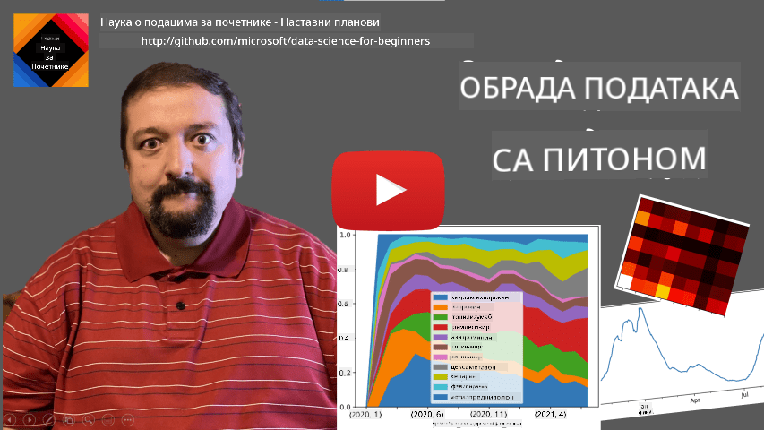
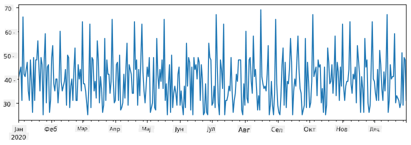
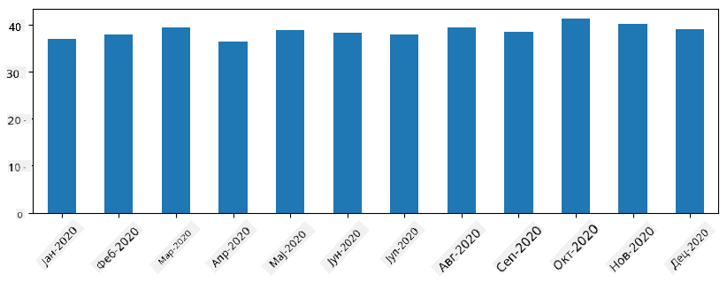
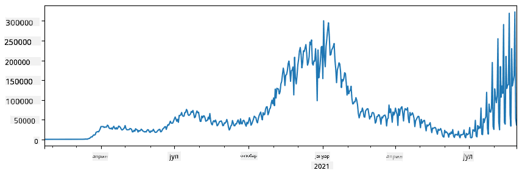
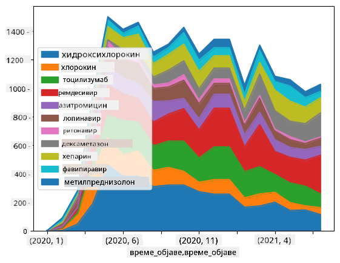

<!--
CO_OP_TRANSLATOR_METADATA:
{
  "original_hash": "7bfec050f4717dcc2dfd028aca9d21f3",
  "translation_date": "2025-09-06T16:00:52+00:00",
  "source_file": "2-Working-With-Data/07-python/README.md",
  "language_code": "sr"
}
-->
# Рад са подацима: Python и библиотека Pandas

|  ](../../sketchnotes/07-WorkWithPython.png) |
| :-------------------------------------------------------------------------------------------------------: |
|                 Рад са Python-ом - _Скетч од [@nitya](https://twitter.com/nitya)_                        |

[](https://youtu.be/dZjWOGbsN4Y)

Иако базе података нуде веома ефикасне начине за складиштење података и њихово претраживање помоћу језика за упите, најфлексибилнији начин обраде података је писање сопственог програма за манипулацију подацима. У многим случајевима, коришћење упита у бази података би било ефикасније. Међутим, у неким случајевима када је потребна сложенија обрада података, то се не може лако урадити помоћу SQL-а. 
Обрада података може се програмирати у било ком програмском језику, али постоје одређени језици који су на вишем нивоу када је у питању рад са подацима. Научници који се баве подацима обично преферирају један од следећих језика:

* **[Python](https://www.python.org/)**, програмски језик опште намене, који се често сматра једним од најбољих избора за почетнике због своје једноставности. Python има много додатних библиотека које вам могу помоћи да решите многе практичне проблеме, као што су издвајање података из ZIP архиве или претварање слике у сиве тонове. Поред науке о подацима, Python се често користи и за развој веба. 
* **[R](https://www.r-project.org/)** је традиционални алат развијен са обрадом статистичких података на уму. Такође садржи велики репозиторијум библиотека (CRAN), што га чини добрим избором за обраду података. Међутим, R није програмски језик опште намене и ретко се користи ван домена науке о подацима.
* **[Julia](https://julialang.org/)** је још један језик развијен посебно за науку о подацима. Намера му је да пружи боље перформансе од Python-а, што га чини одличним алатом за научне експерименте.

У овом лекцији, фокусираћемо се на коришћење Python-а за једноставну обраду података. Претпоставићемо основно познавање језика. Ако желите дубљи увод у Python, можете се обратити једном од следећих ресурса:

* [Научите Python на забаван начин уз Turtle Graphics и фрактале](https://github.com/shwars/pycourse) - GitHub курс за брзи увод у Python програмирање
* [Направите прве кораке са Python-ом](https://docs.microsoft.com/en-us/learn/paths/python-first-steps/?WT.mc_id=academic-77958-bethanycheum) Пут учења на [Microsoft Learn](http://learn.microsoft.com/?WT.mc_id=academic-77958-bethanycheum)

Подаци могу бити у различитим облицима. У овој лекцији, разматраћемо три облика података - **табеларни подаци**, **текст** и **слике**.

Фокусираћемо се на неколико примера обраде података, уместо да вам дамо потпуни преглед свих повезаних библиотека. Ово ће вам омогућити да добијете основну идеју о томе шта је могуће, и оставити вас са разумевањем где да пронађете решења за своје проблеме када вам затребају.

> **Најкориснији савет**. Када треба да извршите одређену операцију на подацима коју не знате како да урадите, покушајте да је потражите на интернету. [Stackoverflow](https://stackoverflow.com/) обично садржи много корисних примера кода у Python-у за многе типичне задатке.


## [Квиз пре предавања](https://ff-quizzes.netlify.app/en/ds/quiz/12)

## Табеларни подаци и Dataframes

Већ сте се сусрели са табеларним подацима када смо говорили о релационим базама података. Када имате много података, и они су садржани у многим различитим повезаним табелама, дефинитивно има смисла користити SQL за рад са њима. Међутим, постоје многи случајеви када имамо табелу података и треба да стекнемо неко **разумевање** или **увиде** о тим подацима, као што су расподела, корелација између вредности, итд. У науци о подацима, постоји много случајева када треба да извршимо неке трансформације оригиналних података, праћене визуализацијом. Оба ова корака могу се лако урадити помоћу Python-а.

Постоје две најкорисније библиотеке у Python-у које вам могу помоћи да радите са табеларним подацима:
* **[Pandas](https://pandas.pydata.org/)** вам омогућава да манипулишете такозваним **Dataframes**, који су аналогни релационим табелама. Можете имати именоване колоне и извршавати различите операције на редовима, колонама и Dataframes-има уопште. 
* **[Numpy](https://numpy.org/)** је библиотека за рад са **тензорима**, тј. вишедимензионалним **низовима**. Низ има вредности истог основног типа и једноставнији је од Dataframe-а, али нуди више математичких операција и ствара мање оптерећења.

Постоје и неке друге библиотеке које би требало да знате:
* **[Matplotlib](https://matplotlib.org/)** је библиотека која се користи за визуализацију података и цртање графикона
* **[SciPy](https://www.scipy.org/)** је библиотека са неким додатним научним функцијама. Већ смо наишли на ову библиотеку када смо говорили о вероватноћи и статистици

Ево дела кода који бисте обично користили за увоз ових библиотека на почетку вашег Python програма:
```python
import numpy as np
import pandas as pd
import matplotlib.pyplot as plt
from scipy import ... # you need to specify exact sub-packages that you need
``` 

Pandas је заснован на неколико основних концепата.

### Series 

**Series** је низ вредности, сличан листи или numpy низу. Главна разлика је у томе што Series такође има **индекс**, и када радимо са Series (нпр. додајемо их), индекс се узима у обзир. Индекс може бити једноставан као број реда (то је индекс који се користи подразумевано када се креира Series из листе или низа), или може имати сложену структуру, као што је интервал датума.

> **Напомена**: У пратећем notebook-у [`notebook.ipynb`](notebook.ipynb) налази се уводни код за Pandas. Овде ћемо само навести неке примере, а свакако сте добродошли да проверите комплетан notebook.

Размотримо пример: желимо да анализирамо продају у нашој продавници сладоледа. Генеришимо низ бројева продаје (број продатих артикала сваког дана) за одређени временски период:

```python
start_date = "Jan 1, 2020"
end_date = "Mar 31, 2020"
idx = pd.date_range(start_date,end_date)
print(f"Length of index is {len(idx)}")
items_sold = pd.Series(np.random.randint(25,50,size=len(idx)),index=idx)
items_sold.plot()
```


Сада претпоставимо да сваке недеље организујемо журку за пријатеље и узимамо додатних 10 пакета сладоледа за журку. Можемо креирати други низ, индексиран по недељама, да то покажемо:
```python
additional_items = pd.Series(10,index=pd.date_range(start_date,end_date,freq="W"))
```
Када додамо два низа заједно, добијамо укупан број:
```python
total_items = items_sold.add(additional_items,fill_value=0)
total_items.plot()
```


> **Напомена** да не користимо једноставну синтаксу `total_items+additional_items`. Да јесмо, добили бисмо много `NaN` (*Not a Number*) вредности у резултујућем низу. То је зато што недостају вредности за неке тачке индекса у низу `additional_items`, а додавање `NaN` било чему резултира у `NaN`. Због тога морамо да наведемо параметар `fill_value` током сабирања.

Са временским низовима, можемо такође **пресемплирати** низ са различитим временским интервалима. На пример, ако желимо да израчунамо просечан обим продаје месечно, можемо користити следећи код:
```python
monthly = total_items.resample("1M").mean()
ax = monthly.plot(kind='bar')
```


### DataFrame

DataFrame је у суштини колекција Series-а са истим индексом. Можемо комбиновати неколико Series-а у DataFrame:
```python
a = pd.Series(range(1,10))
b = pd.Series(["I","like","to","play","games","and","will","not","change"],index=range(0,9))
df = pd.DataFrame([a,b])
```
Ово ће креирати хоризонталну табелу попут ове:
|     | 0   | 1    | 2   | 3   | 4      | 5   | 6      | 7    | 8    |
| --- | --- | ---- | --- | --- | ------ | --- | ------ | ---- | ---- |
| 0   | 1   | 2    | 3   | 4   | 5      | 6   | 7      | 8    | 9    |
| 1   | I   | like | to  | use | Python | and | Pandas | very | much |

Можемо такође користити Series као колоне и одредити имена колона користећи речник:
```python
df = pd.DataFrame({ 'A' : a, 'B' : b })
```
Ово ће нам дати табелу попут ове:

|     | A   | B      |
| --- | --- | ------ |
| 0   | 1   | I      |
| 1   | 2   | like   |
| 2   | 3   | to     |
| 3   | 4   | use    |
| 4   | 5   | Python |
| 5   | 6   | and    |
| 6   | 7   | Pandas |
| 7   | 8   | very   |
| 8   | 9   | much   |

**Напомена** да ову табелу можемо добити и транспоновањем претходне табеле, нпр. писањем 
```python
df = pd.DataFrame([a,b]).T..rename(columns={ 0 : 'A', 1 : 'B' })
```
Овде `.T` означава операцију транспоновања DataFrame-а, тј. промену редова и колона, а операција `rename` нам омогућава да преименујемо колоне како би одговарале претходном примеру.

Ево неколико најважнијих операција које можемо извршити на DataFrame-овима:

**Избор колона**. Можемо изабрати појединачне колоне писањем `df['A']` - ова операција враћа Series. Такође можемо изабрати подскуп колона у други DataFrame писањем `df[['B','A']]` - ово враћа други DataFrame.

**Филтрирање** само одређених редова по критеријуму. На пример, да оставимо само редове са колоном `A` већом од 5, можемо написати `df[df['A']>5]`.

> **Напомена**: Начин на који филтрирање функционише је следећи. Израз `df['A']<5` враћа буловски низ, који указује да ли је израз `True` или `False` за сваки елемент оригиналног низа `df['A']`. Када се буловски низ користи као индекс, он враћа подскуп редова у DataFrame-у. Због тога није могуће користити произвољни Python буловски израз, на пример, писање `df[df['A']>5 and df['A']<7]` било би погрешно. Уместо тога, требало би да користите специјалну `&` операцију на буловским низовима, писањем `df[(df['A']>5) & (df['A']<7)]` (*заграде су овде важне*).

**Креирање нових рачунских колона**. Лако можемо креирати нове рачунске колоне за наш DataFrame користећи интуитиван израз попут овог:
```python
df['DivA'] = df['A']-df['A'].mean() 
``` 
Овај пример израчунава одступање A од његове просечне вредности. Оно што се овде заправо дешава је да израчунавамо Series, а затим додељујемо овај Series левој страни, креирајући нову колону. Због тога не можемо користити операције које нису компатибилне са Series-ом, на пример, следећи код је погрешан:
```python
# Wrong code -> df['ADescr'] = "Low" if df['A'] < 5 else "Hi"
df['LenB'] = len(df['B']) # <- Wrong result
``` 
Последњи пример, иако је синтаксно исправан, даје нам погрешан резултат, јер додељује дужину Series-а `B` свим вредностима у колони, а не дужину појединачних елемената како смо намеравали.

Ако треба да израчунамо сложене изразе попут овог, можемо користити функцију `apply`. Последњи пример може се написати на следећи начин:
```python
df['LenB'] = df['B'].apply(lambda x : len(x))
# or 
df['LenB'] = df['B'].apply(len)
```

Након горе наведених операција, добићемо следећи DataFrame:

|     | A   | B      | DivA | LenB |
| --- | --- | ------ | ---- | ---- |
| 0   | 1   | I      | -4.0 | 1    |
| 1   | 2   | like   | -3.0 | 4    |
| 2   | 3   | to     | -2.0 | 2    |
| 3   | 4   | use    | -1.0 | 3    |
| 4   | 5   | Python | 0.0  | 6    |
| 5   | 6   | and    | 1.0  | 3    |
| 6   | 7   | Pandas | 2.0  | 6    |
| 7   | 8   | very   | 3.0  | 4    |
| 8   | 9   | much   | 4.0  | 4    |

**Избор редова на основу бројева** може се урадити коришћењем конструкта `iloc`. На пример, да изаберемо првих 5 редова из DataFrame-а:
```python
df.iloc[:5]
```

**Груписање** се често користи за добијање резултата сличних *пивот табелама* у Excel-у. Претпоставимо да желимо да израчунамо просечну вредност колоне `A` за сваки дати број `LenB`. Тада можемо груписати наш DataFrame по `LenB` и позвати `mean`:
```python
df.groupby(by='LenB')[['A','DivA']].mean()
```
Ако треба да израчунамо просек и број елемената у групи, онда можемо користити сложенију функцију `aggregate`:
```python
df.groupby(by='LenB') \
 .aggregate({ 'DivA' : len, 'A' : lambda x: x.mean() }) \
 .rename(columns={ 'DivA' : 'Count', 'A' : 'Mean'})
```
Ово нам даје следећу табелу:

| LenB | Count | Mean     |
| ---- | ----- | -------- |
| 1    | 1     | 1.000000 |
| 2    | 1     | 3.000000 |
| 3    | 2     | 5.000000 |
| 4    | 3     | 6.333333 |
| 6    | 2     | 6.000000 |

### Добијање података
Видели смо колико је лако конструисати Series и DataFrame објекте из Python објеката. Међутим, подаци обично долазе у облику текстуалних фајлова или Excel табела. Срећом, Pandas нам нуди једноставан начин за учитавање података са диска. На пример, читање CSV фајла је једноставно као ово:
```python
df = pd.read_csv('file.csv')
```
Видећемо још примера учитавања података, укључујући и преузимање са спољних веб сајтова, у одељку "Изазов".

### Штампање и Визуелизација

Data Scientist често мора да истражује податке, па је важно да их може визуализовати. Када је DataFrame велики, често желимо само да проверимо да ли све радимо исправно тако што ћемо исписати првих неколико редова. Ово се може урадити позивом `df.head()`. Ако га покрећете из Jupyter Notebook-а, он ће исписати DataFrame у лепом табеларном облику.

Такође смо видели употребу функције `plot` за визуализацију неких колона. Иако је `plot` веома користан за многе задатке и подржава различите типове графикона преко параметра `kind=`, увек можете користити библиотеку `matplotlib` за цртање нечег сложенијег. Детаљно ћемо обрадити визуализацију података у посебним лекцијама курса.

Овај преглед покрива најважније концепте Pandas-а, али библиотека је веома богата и нема ограничења у томе шта можете да урадите са њом! Сада ћемо применити ово знање за решавање конкретног проблема.

## 🚀 Изазов 1: Анализа ширења COVID-а

Први проблем на који ћемо се фокусирати је моделирање епидемијског ширења COVID-19. Да бисмо то урадили, користићемо податке о броју заражених особа у различитим земљама, које пружа [Центар за системску науку и инжењерство](https://systems.jhu.edu/) (CSSE) на [Универзитету Џонс Хопкинс](https://jhu.edu/). Скуп података је доступан у [овом GitHub репозиторијуму](https://github.com/CSSEGISandData/COVID-19).

Пошто желимо да покажемо како се ради са подацима, позивамо вас да отворите [`notebook-covidspread.ipynb`](notebook-covidspread.ipynb) и прочитате га од почетка до краја. Такође можете извршавати ћелије и решавати неке изазове које смо оставили за вас на крају.



> Ако не знате како да покренете код у Jupyter Notebook-у, погледајте [овај чланак](https://soshnikov.com/education/how-to-execute-notebooks-from-github/).

## Рад са неструктурираним подацима

Иако подаци често долазе у табеларном облику, у неким случајевима морамо радити са мање структурираном врстом података, као што су текст или слике. У том случају, да бисмо применили технике обраде података које смо видели, морамо некако **извући** структуиране податке. Ево неколико примера:

* Извлачење кључних речи из текста и праћење њихове учесталости
* Коришћење неуронских мрежа за извлачење информација о објектима на слици
* Добијање информација о емоцијама људи са видео снимка

## 🚀 Изазов 2: Анализа COVID радова

У овом изазову настављамо са темом COVID пандемије и фокусирамо се на обраду научних радова на ту тему. Постоји [CORD-19 скуп података](https://www.kaggle.com/allen-institute-for-ai/CORD-19-research-challenge) са више од 7000 (у време писања) радова о COVID-у, доступних са метаподацима и апстрактима (а за око половину њих доступан је и цео текст).

Потпун пример анализе овог скупа података коришћењем когнитивне услуге [Text Analytics for Health](https://docs.microsoft.com/azure/cognitive-services/text-analytics/how-tos/text-analytics-for-health/?WT.mc_id=academic-77958-bethanycheum) описан је [у овом блогу](https://soshnikov.com/science/analyzing-medical-papers-with-azure-and-text-analytics-for-health/). Размотрићемо поједностављену верзију ове анализе.

> **NOTE**: Не пружамо копију скупа података као део овог репозиторијума. Можда ћете прво морати да преузмете [`metadata.csv`](https://www.kaggle.com/allen-institute-for-ai/CORD-19-research-challenge?select=metadata.csv) фајл из [овог скупа података на Kaggle-у](https://www.kaggle.com/allen-institute-for-ai/CORD-19-research-challenge). Регистрација на Kaggle-у може бити потребна. Такође можете преузети скуп података без регистрације [овде](https://ai2-semanticscholar-cord-19.s3-us-west-2.amazonaws.com/historical_releases.html), али ће укључивати све пуне текстове поред метаподатака.

Отворите [`notebook-papers.ipynb`](notebook-papers.ipynb) и прочитајте га од почетка до краја. Такође можете извршавати ћелије и решавати неке изазове које смо оставили за вас на крају.



## Обрада сликовних података

У последње време развијени су веома моћни AI модели који нам омогућавају да разумемо слике. Постоји много задатака који се могу решити коришћењем претходно обучених неуронских мрежа или услуга у облаку. Неки примери укључују:

* **Класификацију слика**, која вам може помоћи да категоризујете слику у једну од унапред дефинисаних класа. Лако можете обучити сопствене класификаторе слика користећи услуге као што је [Custom Vision](https://azure.microsoft.com/services/cognitive-services/custom-vision-service/?WT.mc_id=academic-77958-bethanycheum)
* **Детекцију објеката** за откривање различитих објеката на слици. Услуге као што је [computer vision](https://azure.microsoft.com/services/cognitive-services/computer-vision/?WT.mc_id=academic-77958-bethanycheum) могу детектовати бројне уобичајене објекте, а можете обучити [Custom Vision](https://azure.microsoft.com/services/cognitive-services/custom-vision-service/?WT.mc_id=academic-77958-bethanycheum) модел за детекцију специфичних објеката од интереса.
* **Детекцију лица**, укључујући процену старости, пола и емоција. Ово се може урадити преко [Face API](https://azure.microsoft.com/services/cognitive-services/face/?WT.mc_id=academic-77958-bethanycheum).

Све ове услуге у облаку могу се позивати коришћењем [Python SDK-ова](https://docs.microsoft.com/samples/azure-samples/cognitive-services-python-sdk-samples/cognitive-services-python-sdk-samples/?WT.mc_id=academic-77958-bethanycheum), и тако се лако могу укључити у ваш ток истраживања података.

Ево неких примера истраживања података из извора сликовних података:
* У блогу [Како научити Data Science без програмирања](https://soshnikov.com/azure/how-to-learn-data-science-without-coding/) истражујемо Instagram фотографије, покушавајући да разумемо шта чини да људи дају више лајкова на фотографију. Прво извлачимо што више информација са слика користећи [computer vision](https://azure.microsoft.com/services/cognitive-services/computer-vision/?WT.mc_id=academic-77958-bethanycheum), а затим користимо [Azure Machine Learning AutoML](https://docs.microsoft.com/azure/machine-learning/concept-automated-ml/?WT.mc_id=academic-77958-bethanycheum) за изградњу интерпретабилног модела.
* У [Радионици за проучавање лица](https://github.com/CloudAdvocacy/FaceStudies) користимо [Face API](https://azure.microsoft.com/services/cognitive-services/face/?WT.mc_id=academic-77958-bethanycheum) за извлачење емоција људи на фотографијама са догађаја, како бисмо покушали да разумемо шта људе чини срећним.

## Закључак

Без обзира да ли већ имате структуиране или неструктуиране податке, коришћењем Python-а можете извршити све кораке везане за обраду и разумевање података. Python је вероватно најфлексибилнији алат за обраду података, и то је разлог зашто већина Data Scientist-а користи Python као свој примарни алат. Учити Python детаљно је вероватно добра идеја ако сте озбиљни у својој Data Science авантури!

## [Квиз након предавања](https://ff-quizzes.netlify.app/en/ds/quiz/13)

## Преглед и Самостално Учење

**Књиге**
* [Wes McKinney. Python for Data Analysis: Data Wrangling with Pandas, NumPy, and IPython](https://www.amazon.com/gp/product/1491957662)

**Онлајн ресурси**
* Званични [10 минута до Pandas](https://pandas.pydata.org/pandas-docs/stable/user_guide/10min.html) туторијал
* [Документација о Pandas визуализацији](https://pandas.pydata.org/pandas-docs/stable/user_guide/visualization.html)

**Учење Python-а**
* [Научите Python на забаван начин са Turtle Graphics и Фракталима](https://github.com/shwars/pycourse)
* [Направите своје прве кораке са Python-ом](https://docs.microsoft.com/learn/paths/python-first-steps/?WT.mc_id=academic-77958-bethanycheum) Пут учења на [Microsoft Learn](http://learn.microsoft.com/?WT.mc_id=academic-77958-bethanycheum)

## Задатак

[Извршите детаљнију анализу података за горе наведене изазове](assignment.md)

## Аутори

Ову лекцију је са ♥️ написао [Дмитриј Сошњиков](http://soshnikov.com)

---

**Одрицање од одговорности**:  
Овај документ је преведен коришћењем услуге за превођење помоћу вештачке интелигенције [Co-op Translator](https://github.com/Azure/co-op-translator). Иако настојимо да обезбедимо тачност, молимо вас да имате у виду да аутоматизовани преводи могу садржати грешке или нетачности. Оригинални документ на изворном језику треба сматрати ауторитативним извором. За критичне информације препоручује се професионални превод од стране људи. Не сносимо одговорност за било каква неспоразумевања или погрешна тумачења која могу произаћи из коришћења овог превода.