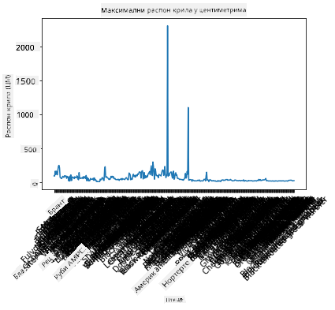
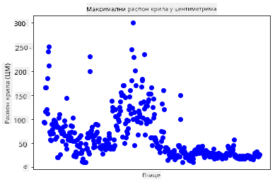
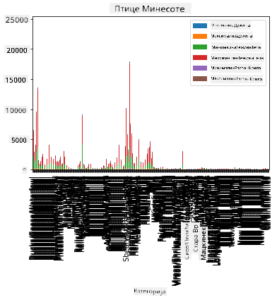
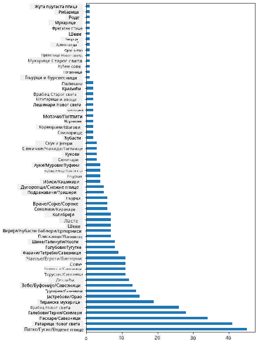
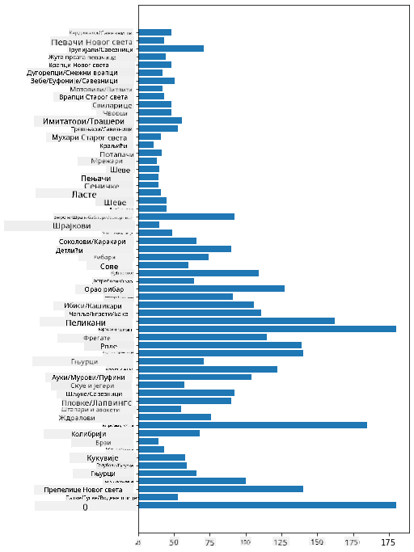
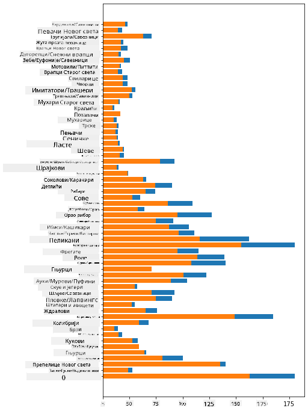

<!--
CO_OP_TRANSLATOR_METADATA:
{
  "original_hash": "43c402d9d90ae6da55d004519ada5033",
  "translation_date": "2025-08-30T19:00:28+00:00",
  "source_file": "3-Data-Visualization/09-visualization-quantities/README.md",
  "language_code": "sr"
}
-->
# Визуелизација количина

| ](../../sketchnotes/09-Visualizing-Quantities.png)|
|:---:|
| Визуелизација количина - _Скетч од [@nitya](https://twitter.com/nitya)_ |

У овој лекцији ћете истражити како да користите једну од многих доступних Python библиотека како бисте научили да креирате занимљиве визуелизације засноване на концепту количине. Користећи очишћену базу података о птицама из Минесоте, можете научити многе занимљиве чињенице о локалној дивљини.  
## [Квиз пре предавања](https://purple-hill-04aebfb03.1.azurestaticapps.net/quiz/16)

## Посматрање распона крила уз Matplotlib

Одлична библиотека за креирање како једноставних тако и сложених графикона и дијаграма различитих врста је [Matplotlib](https://matplotlib.org/stable/index.html). Уопштено, процес креирања графикона уз помоћ ових библиотека укључује идентификовање делова вашег dataframe-а које желите да циљате, извршавање потребних трансформација над тим подацима, додељивање вредности за x и y осе, одлучивање о врсти графикона који желите да прикажете, и затим приказивање графикона. Matplotlib нуди велики избор визуелизација, али за ову лекцију, фокусираћемо се на оне које су најприкладније за визуелизацију количине: линијске графиконе, расејане графиконе и стубне дијаграме.

> ✅ Користите најбољи графикон који одговара структури ваших података и причи коју желите да испричате.  
> - За анализу трендова током времена: линијски графикон  
> - За поређење вредности: стубни, колумнарни, пите, расејани графикон  
> - За приказ односа делова према целини: пите  
> - За приказ дистрибуције података: расејани графикон, стубни  
> - За приказ трендова: линијски, колумнарни  
> - За приказ односа између вредности: линијски, расејани, балон графикон  

Ако имате базу података и треба да откријете колико одређеног предмета је укључено, један од првих задатака који имате је да испитате његове вредности.  

✅ Постоје веома добри 'cheat sheets' за Matplotlib [овде](https://matplotlib.org/cheatsheets/cheatsheets.pdf).

## Креирање линијског графикона за вредности распона крила птица

Отворите датотеку `notebook.ipynb` у корену ове лекције и додајте ћелију.

> Напомена: подаци се налазе у корену овог репозиторијума у фолдеру `/data`.

```python
import pandas as pd
import matplotlib.pyplot as plt
birds = pd.read_csv('../../data/birds.csv')
birds.head()
```  
Ови подаци су мешавина текста и бројева:

|      | Име                          | Научно име             | Категорија            | Ред          | Породица | Род         | Статус очувања      | МинДужина | МаксДужина | МинТежина   | МаксТежина   | МинРаспонКрила | МаксРаспонКрила |
| ---: | :--------------------------- | :--------------------- | :-------------------- | :----------- | :------- | :---------- | :----------------- | --------: | --------: | ----------: | ----------: | ----------: | ----------: |
|    0 | Црнотрбушна патка            | Dendrocygna autumnalis | Патке/Гуске/Водене птице | Anseriformes | Anatidae | Dendrocygna | LC                 |        47 |        56 |         652 |        1020 |          76 |          94 |
|    1 | Жућкаста патка               | Dendrocygna bicolor    | Патке/Гуске/Водене птице | Anseriformes | Anatidae | Dendrocygna | LC                 |        45 |        53 |         712 |        1050 |          85 |          93 |
|    2 | Снежна гуска                 | Anser caerulescens     | Патке/Гуске/Водене птице | Anseriformes | Anatidae | Anser       | LC                 |        64 |        79 |        2050 |        4050 |         135 |         165 |
|    3 | Росова гуска                 | Anser rossii           | Патке/Гуске/Водене птице | Anseriformes | Anatidae | Anser       | LC                 |      57.3 |        64 |        1066 |        1567 |         113 |         116 |
|    4 | Велика бела гуска            | Anser albifrons        | Патке/Гуске/Водене птице | Anseriformes | Anatidae | Anser       | LC                 |        64 |        81 |        1930 |        3310 |         130 |         165 |

Хајде да почнемо са приказивањем неких нумеричких података користећи основни линијски графикон. Претпоставимо да желите да видите максимални распон крила ових занимљивих птица.

```python
wingspan = birds['MaxWingspan'] 
wingspan.plot()
```  


Шта одмах примећујете? Чини се да постоји бар један изузетак - то је прилично велики распон крила! Распон крила од 2300 центиметара износи 23 метра - да ли у Минесоти лете птеродактили? Хајде да истражимо.

Иако бисте могли брзо сортирати податке у Excel-у да бисте пронашли те изузетке, који су вероватно грешке у куцању, наставите процес визуелизације радећи из самог графикона.

Додајте ознаке на x-осу да бисте приказали о којим птицама је реч:

```
plt.title('Max Wingspan in Centimeters')
plt.ylabel('Wingspan (CM)')
plt.xlabel('Birds')
plt.xticks(rotation=45)
x = birds['Name'] 
y = birds['MaxWingspan']

plt.plot(x, y)

plt.show()
```  


Чак и са ротацијом ознака постављеном на 45 степени, има их превише да би се читале. Хајде да пробамо другачију стратегију: означите само те изузетке и поставите ознаке унутар графикона. Можете користити расејани графикон да бисте направили више простора за означавање:

```python
plt.title('Max Wingspan in Centimeters')
plt.ylabel('Wingspan (CM)')
plt.tick_params(axis='both',which='both',labelbottom=False,bottom=False)

for i in range(len(birds)):
    x = birds['Name'][i]
    y = birds['MaxWingspan'][i]
    plt.plot(x, y, 'bo')
    if birds['MaxWingspan'][i] > 500:
        plt.text(x, y * (1 - 0.05), birds['Name'][i], fontsize=12)
    
plt.show()
```  
Шта се овде дешава? Користили сте `tick_params` да сакријете доње ознаке и затим креирали петљу преко ваше базе података о птицама. Приказујући графикон са малим округлим плавим тачкама користећи `bo`, проверили сте да ли постоји птица са максималним распоном крила већим од 500 и приказали њену ознаку поред тачке ако је тако. Померили сте ознаке мало на y оси (`y * (1 - 0.05)`) и користили име птице као ознаку.

Шта сте открили?

  
## Филтрирање података

И Белоглави орао и Преријски соко, иако вероватно веома велике птице, изгледа да су погрешно означени, са додатним `0` у максималном распону крила. Мало је вероватно да ћете срести Белоглавог орла са распоном крила од 25 метара, али ако се то догоди, молимо вас да нас обавестите! Хајде да креирамо нови dataframe без та два изузетка:

```python
plt.title('Max Wingspan in Centimeters')
plt.ylabel('Wingspan (CM)')
plt.xlabel('Birds')
plt.tick_params(axis='both',which='both',labelbottom=False,bottom=False)
for i in range(len(birds)):
    x = birds['Name'][i]
    y = birds['MaxWingspan'][i]
    if birds['Name'][i] not in ['Bald eagle', 'Prairie falcon']:
        plt.plot(x, y, 'bo')
plt.show()
```  

Филтрирањем изузетака, ваши подаци су сада кохезивнији и разумљивији.

  

Сада када имамо чистију базу података барем у смислу распона крила, хајде да откријемо више о овим птицама.

Иако линијски и расејани графикони могу приказати информације о вредностима података и њиховим дистрибуцијама, желимо да размишљамо о вредностима које су инхерентне у овој бази података. Можете креирати визуелизације да бисте одговорили на следећа питања о количини:

> Колико категорија птица постоји и који су њихови бројеви?  
> Колико птица је изумрло, угрожено, ретко или уобичајено?  
> Колико их има у различитим родовима и редовима у Линеовој терминологији?  
## Истраживање стубних дијаграма

Стубни дијаграми су практични када треба да прикажете груписање података. Хајде да истражимо категорије птица које постоје у овој бази података да видимо која је најчешћа по броју.

У датотеци notebook креирајте основни стубни дијаграм.

✅ Напомена, можете или филтрирати две птице изузетке које смо идентификовали у претходном одељку, уредити грешку у њиховом распону крила, или их оставити за ове вежбе које не зависе од вредности распона крила.

Ако желите да креирате стубни дијаграм, можете изабрати податке на које желите да се фокусирате. Стубни дијаграми могу бити креирани од необрађених података:

```python
birds.plot(x='Category',
        kind='bar',
        stacked=True,
        title='Birds of Minnesota')

```  
  

Овај стубни дијаграм, међутим, није читљив јер има превише неповезаних података. Потребно је да изаберете само податке које желите да прикажете, па хајде да погледамо дужину птица на основу њихове категорије.

Филтрирајте своје податке да укључите само категорију птица.

✅ Приметите да користите Pandas за управљање подацима, а затим препуштате Matplotlib-у да креира графикон.

Пошто има много категорија, можете приказати овај графикон вертикално и прилагодити његову висину да обухвати све податке:

```python
category_count = birds.value_counts(birds['Category'].values, sort=True)
plt.rcParams['figure.figsize'] = [6, 12]
category_count.plot.barh()
```  
  

Овај стубни дијаграм пружа добар преглед броја птица у свакој категорији. На први поглед видите да је највећи број птица у овом региону у категорији Патке/Гуске/Водене птице. Минесота је 'земља 10,000 језера', па ово није изненађујуће!

✅ Испробајте неке друге бројеве у овој бази података. Да ли вас нешто изненађује?

## Поређење података

Можете пробати различита поређења груписаних података креирањем нових оса. Пробајте поређење максималне дужине птице, на основу њене категорије:

```python
maxlength = birds['MaxLength']
plt.barh(y=birds['Category'], width=maxlength)
plt.rcParams['figure.figsize'] = [6, 12]
plt.show()
```  
  

Ништа није изненађујуће овде: колибри имају најмању максималну дужину у поређењу са пеликанима или гускама. Добро је када подаци имају логичан смисао!

Можете креирати занимљивије визуелизације стубних дијаграма суперимпонујући податке. Хајде да суперимпонујемо минималну и максималну дужину на одређену категорију птица:

```python
minLength = birds['MinLength']
maxLength = birds['MaxLength']
category = birds['Category']

plt.barh(category, maxLength)
plt.barh(category, minLength)

plt.show()
```  
На овом графикону можете видети опсег по категорији птица минималне и максималне дужине. Можете са сигурношћу рећи да, на основу ових података, што је птица већа, већи је њен опсег дужине. Фасцинантно!

  

## 🚀 Изазов

Ова база података о птицама нуди богатство информација о различитим врстама птица у одређеном екосистему. Претражите интернет и видите да ли можете пронаћи друге базе података о птицама. Вежбајте креирање графикона и дијаграма о овим птицама како бисте открили чињенице које нисте знали.  
## [Квиз после предавања](https://purple-hill-04aebfb03.1.azurestaticapps.net/quiz/17)

## Преглед и самостално учење

Ова прва лекција вам је дала неке информације о томе како да користите Matplotlib за визуелизацију количина. Истражите друге начине рада са базама података за визуелизацију. [Plotly](https://github.com/plotly/plotly.py) је један који нећемо покривати у овим лекцијама, па погледајте шта он може да понуди.  
## Задатак

[Линије, Расејани графикони и Стубови](assignment.md)  

---

**Одрицање од одговорности**:  
Овај документ је преведен коришћењем услуге за превођење помоћу вештачке интелигенције [Co-op Translator](https://github.com/Azure/co-op-translator). Иако се трудимо да обезбедимо тачност, молимо вас да имате у виду да аутоматски преводи могу садржати грешке или нетачности. Оригинални документ на његовом изворном језику треба сматрати меродавним извором. За критичне информације препоручује се професионални превод од стране људи. Не сносимо одговорност за било каква погрешна тумачења или неспоразуме који могу настати услед коришћења овог превода.