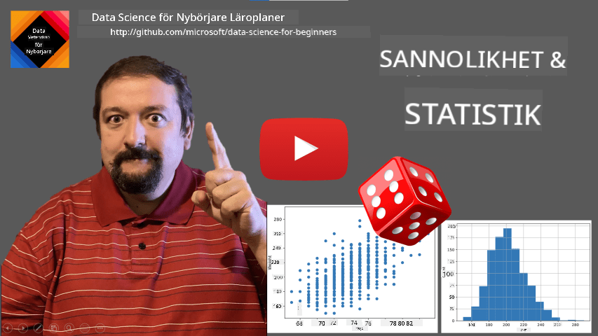
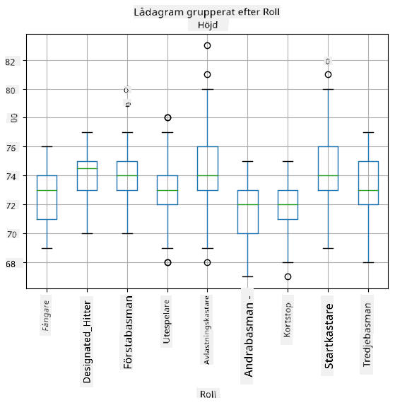
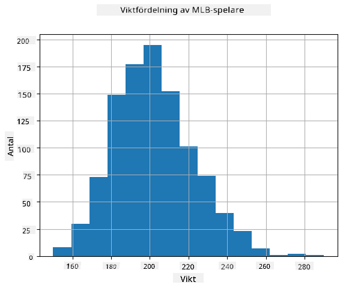
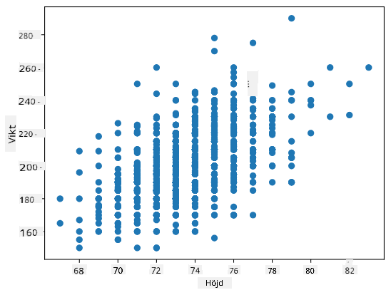

<!--
CO_OP_TRANSLATOR_METADATA:
{
  "original_hash": "8bbb3fa0d4ad61384a3b4b5f7560226f",
  "translation_date": "2025-09-04T19:06:07+00:00",
  "source_file": "1-Introduction/04-stats-and-probability/README.md",
  "language_code": "sv"
}
-->
# En Kort Introduktion till Statistik och Sannolikhet

| ](../../sketchnotes/04-Statistics-Probability.png)|
|:---:|
| Statistik och Sannolikhet - _Sketchnote av [@nitya](https://twitter.com/nitya)_ |

Statistik och sannolikhetsteori är två starkt relaterade områden inom matematik som är mycket relevanta för datavetenskap. Det är möjligt att arbeta med data utan djupgående kunskaper i matematik, men det är ändå bättre att känna till åtminstone några grundläggande begrepp. Här presenterar vi en kort introduktion som hjälper dig att komma igång.

[](https://youtu.be/Z5Zy85g4Yjw)

## [Quiz före föreläsningen](https://purple-hill-04aebfb03.1.azurestaticapps.net/quiz/6)

## Sannolikhet och Slumpvariabler

**Sannolikhet** är ett tal mellan 0 och 1 som uttrycker hur sannolikt en **händelse** är. Det definieras som antalet positiva utfall (som leder till händelsen), dividerat med det totala antalet utfall, givet att alla utfall är lika sannolika. Till exempel, när vi kastar en tärning, är sannolikheten att vi får ett jämnt tal 3/6 = 0,5.

När vi pratar om händelser använder vi **slumpvariabler**. Till exempel, slumpvariabeln som representerar ett tal som erhålls vid kast av en tärning skulle anta värden från 1 till 6. Mängden av tal från 1 till 6 kallas **utfallsrum**. Vi kan prata om sannolikheten för att en slumpvariabel antar ett visst värde, till exempel P(X=3)=1/6.

Slumpvariabeln i det tidigare exemplet kallas **diskret**, eftersom den har ett räkneligt utfallsrum, dvs. det finns separata värden som kan numreras. Det finns fall där utfallsrummet är ett intervall av reella tal, eller hela mängden av reella tal. Sådana variabler kallas **kontinuerliga**. Ett bra exempel är tiden då bussen anländer.

## Sannolikhetsfördelning

För diskreta slumpvariabler är det enkelt att beskriva sannolikheten för varje händelse med en funktion P(X). För varje värde *s* från utfallsrummet *S* ger den ett tal mellan 0 och 1, så att summan av alla värden av P(X=s) för alla händelser blir 1.

Den mest kända diskreta fördelningen är **likformig fördelning**, där det finns ett utfallsrum med N element, med lika sannolikhet 1/N för var och en av dem.

Det är svårare att beskriva sannolikhetsfördelningen för en kontinuerlig variabel, med värden från ett intervall [a,b], eller hela mängden av reella tal ℝ. Tänk på fallet med busstidens ankomst. Faktum är att för varje exakt ankomsttid *t* är sannolikheten att bussen anländer exakt vid den tiden 0!

> Nu vet du att händelser med sannolikhet 0 inträffar, och väldigt ofta! Åtminstone varje gång bussen anländer!

Vi kan bara prata om sannolikheten för att en variabel faller inom ett givet intervall av värden, t.ex. P(t<sub>1</sub>≤X<t<sub>2</sub>). I detta fall beskrivs sannolikhetsfördelningen av en **sannolikhetstäthetsfunktion** p(x), så att


En kontinuerlig analog av likformig fördelning kallas **kontinuerlig likformig**, som definieras på ett ändligt intervall. Sannolikheten att värdet X faller inom ett intervall av längd l är proportionell mot l och stiger upp till 1.

En annan viktig fördelning är **normalfördelning**, som vi kommer att prata om mer detaljerat nedan.

## Medelvärde, Varians och Standardavvikelse

Anta att vi drar en sekvens av n prover av en slumpvariabel X: x<sub>1</sub>, x<sub>2</sub>, ..., x<sub>n</sub>. Vi kan definiera **medelvärde** (eller **aritmetiskt medelvärde**) för sekvensen på traditionellt sätt som (x<sub>1</sub>+x<sub>2</sub>+x<sub>n</sub>)/n. När vi ökar storleken på provet (dvs. tar gränsen med n→∞), får vi medelvärdet (även kallat **förväntan**) för fördelningen. Vi betecknar förväntan med **E**(x).

> Det kan visas att för varje diskret fördelning med värden {x<sub>1</sub>, x<sub>2</sub>, ..., x<sub>N</sub>} och motsvarande sannolikheter p<sub>1</sub>, p<sub>2</sub>, ..., p<sub>N</sub>, skulle förväntan vara E(X)=x<sub>1</sub>p<sub>1</sub>+x<sub>2</sub>p<sub>2</sub>+...+x<sub>N</sub>p<sub>N</sub>.

För att identifiera hur långt värdena är spridda kan vi beräkna variansen σ<sup>2</sup> = ∑(x<sub>i</sub> - μ)<sup>2</sup>/n, där μ är medelvärdet för sekvensen. Värdet σ kallas **standardavvikelse**, och σ<sup>2</sup> kallas **varians**.

## Typvärde, Median och Kvartiler

Ibland representerar medelvärdet inte tillräckligt väl det "typiska" värdet för data. Till exempel, när det finns några extrema värden som är helt utanför intervallet, kan de påverka medelvärdet. Ett annat bra mått är **median**, ett värde sådant att hälften av datapunkterna är lägre än det, och den andra hälften - högre.

För att hjälpa oss förstå fördelningen av data är det användbart att prata om **kvartiler**:

* Första kvartilen, eller Q1, är ett värde sådant att 25% av data ligger under det
* Tredje kvartilen, eller Q3, är ett värde sådant att 75% av data ligger under det

Grafiskt kan vi representera förhållandet mellan median och kvartiler i ett diagram som kallas **boxplot**:


Här beräknar vi också **interkvartilavstånd** IQR=Q3-Q1, och så kallade **uteliggare** - värden som ligger utanför gränserna [Q1-1.5*IQR,Q3+1.5*IQR].

För en ändlig fördelning som innehåller ett litet antal möjliga värden är ett bra "typiskt" värde det som förekommer oftast, vilket kallas **typvärde**. Det används ofta för kategoriska data, såsom färger. Tänk på en situation där vi har två grupper av människor - några som starkt föredrar rött, och andra som föredrar blått. Om vi kodar färger med siffror, skulle medelvärdet för en favoritfärg vara någonstans i det orange-gröna spektrumet, vilket inte indikerar den faktiska preferensen hos någon av grupperna. Däremot skulle typvärdet vara antingen en av färgerna, eller båda färgerna, om antalet personer som röstar på dem är lika (i detta fall kallar vi provet **multimodalt**).

## Data från Verkligheten

När vi analyserar data från verkligheten är de ofta inte slumpvariabler i den meningen att vi inte utför experiment med okänt resultat. Till exempel, tänk på ett lag av basebollspelare och deras kroppsliga data, såsom längd, vikt och ålder. Dessa siffror är inte exakt slumpmässiga, men vi kan ändå tillämpa samma matematiska begrepp. Till exempel kan en sekvens av människors vikter betraktas som en sekvens av värden som dras från en slumpvariabel. Nedan är sekvensen av vikter för faktiska basebollspelare från [Major League Baseball](http://mlb.mlb.com/index.jsp), hämtad från [denna dataset](http://wiki.stat.ucla.edu/socr/index.php/SOCR_Data_MLB_HeightsWeights) (för din bekvämlighet visas endast de första 20 värdena):

```
[180.0, 215.0, 210.0, 210.0, 188.0, 176.0, 209.0, 200.0, 231.0, 180.0, 188.0, 180.0, 185.0, 160.0, 180.0, 185.0, 197.0, 189.0, 185.0, 219.0]
```

> **Note**: För att se ett exempel på att arbeta med denna dataset, ta en titt på [den medföljande notebooken](notebook.ipynb). Det finns också ett antal utmaningar genom hela lektionen, och du kan slutföra dem genom att lägga till lite kod i den notebooken. Om du inte är säker på hur man arbetar med data, oroa dig inte - vi kommer tillbaka till att arbeta med data med Python vid ett senare tillfälle. Om du inte vet hur man kör kod i Jupyter Notebook, ta en titt på [denna artikel](https://soshnikov.com/education/how-to-execute-notebooks-from-github/).

Här är boxploten som visar medelvärde, median och kvartiler för vår data:


Eftersom vår data innehåller information om olika spelares **roller**, kan vi också göra en boxplot per roll - det låter oss få en uppfattning om hur parametrarnas värden skiljer sig mellan roller. Den här gången tittar vi på längd:



Detta diagram antyder att, i genomsnitt, är längden på första basmän högre än längden på andra basmän. Senare i denna lektion kommer vi att lära oss hur vi kan testa denna hypotes mer formellt och hur vi kan visa att vår data är statistiskt signifikant för att bevisa detta.

> När vi arbetar med data från verkligheten antar vi att alla datapunkter är prover som dras från någon sannolikhetsfördelning. Detta antagande gör det möjligt för oss att tillämpa maskininlärningstekniker och bygga fungerande prediktiva modeller.

För att se hur fördelningen av vår data ser ut kan vi rita ett diagram som kallas **histogram**. X-axeln innehåller ett antal olika viktintervall (så kallade **bins**), och Y-axeln visar antalet gånger vårt slumpvariabelprov låg inom ett givet intervall.



Från detta histogram kan du se att alla värden är centrerade kring ett visst medelvärde, och ju längre vi går från det medelvärdet - desto färre vikter av det värdet förekommer. Dvs. det är mycket osannolikt att vikten på en basebollspelare skulle skilja sig mycket från medelvikten. Variansen i vikter visar i vilken utsträckning vikterna sannolikt skiljer sig från medelvärdet.

> Om vi tar vikter från andra människor, inte från basebolligan, är fördelningen sannolikt annorlunda. Men formen på fördelningen kommer att vara densamma, men medelvärdet och variansen skulle förändras. Så, om vi tränar vår modell på basebollspelare, är det sannolikt att den ger fel resultat när den tillämpas på studenter vid ett universitet, eftersom den underliggande fördelningen är annorlunda.

## Normalfördelning

Fördelningen av vikter som vi har sett ovan är mycket typisk, och många mätningar från verkligheten följer samma typ av fördelning, men med olika medelvärde och varians. Denna fördelning kallas **normalfördelning**, och den spelar en mycket viktig roll inom statistik.

Att använda normalfördelning är ett korrekt sätt att generera slumpmässiga vikter för potentiella basebollspelare. När vi väl känner till medelvikten `mean` och standardavvikelsen `std`, kan vi generera 1000 viktprover på följande sätt:
```python
samples = np.random.normal(mean,std,1000)
``` 

Om vi ritar histogrammet för de genererade proverna kommer vi att se en bild som liknar den som visas ovan. Och om vi ökar antalet prover och antalet bins kan vi generera en bild av en normalfördelning som är närmare idealet:


*Normalfördelning med medelvärde=0 och std.avvikelse=1*

## Konfidensintervall

När vi pratar om vikter på basebollspelare antar vi att det finns en viss **slumpvariabel W** som motsvarar den ideala sannolikhetsfördelningen av vikter för alla basebollspelare (så kallad **population**). Vår sekvens av vikter motsvarar en delmängd av alla basebollspelare som vi kallar **prov**. En intressant fråga är, kan vi känna till parametrarna för fördelningen av W, dvs. medelvärde och varians för populationen?

Det enklaste svaret skulle vara att beräkna medelvärde och varians för vårt prov. Men det kan hända att vårt slumpmässiga prov inte exakt representerar hela populationen. Därför är det meningsfullt att prata om **konfidensintervall**.
> **Konfidensintervall** är en uppskattning av den sanna medelvärdet för populationen baserat på vårt urval, vilket är korrekt med en viss sannolikhet (eller **konfidensnivå**).
Anta att vi har ett urval X<sub>1</sub>, ..., X<sub>n</sub> från vår fördelning. Varje gång vi drar ett urval från vår fördelning får vi ett annat medelvärde μ. Därför kan μ betraktas som en slumpvariabel. Ett **konfidensintervall** med konfidens p är ett par värden (L<sub>p</sub>,R<sub>p</sub>), sådant att **P**(L<sub>p</sub>≤μ≤R<sub>p</sub>) = p, dvs sannolikheten att det uppmätta medelvärdet ligger inom intervallet är lika med p.

Det går utanför vår korta introduktion att diskutera i detalj hur dessa konfidensintervall beräknas. Mer information finns [på Wikipedia](https://en.wikipedia.org/wiki/Confidence_interval). Kort sagt definierar vi fördelningen av det beräknade urvalsmedelvärdet i förhållande till populationens sanna medelvärde, vilket kallas **studentfördelning**.

> **Intressant fakta**: Studentfördelningen är uppkallad efter matematikern William Sealy Gosset, som publicerade sin artikel under pseudonymen "Student". Han arbetade på Guinness bryggeri, och enligt en av versionerna ville hans arbetsgivare inte att allmänheten skulle veta att de använde statistiska tester för att bestämma kvaliteten på råvaror.

Om vi vill uppskatta medelvärdet μ för vår population med konfidens p, behöver vi ta *(1-p)/2-percentilen* av en Studentfördelning A, som antingen kan tas från tabeller eller beräknas med hjälp av inbyggda funktioner i statistisk mjukvara (t.ex. Python, R, etc.). Då ges intervallet för μ av X±A*D/√n, där X är det erhållna medelvärdet för urvalet och D är standardavvikelsen.

> **Notera**: Vi utelämnar också diskussionen om ett viktigt begrepp, [frihetsgrader](https://en.wikipedia.org/wiki/Degrees_of_freedom_(statistics)), som är relevant i förhållande till Studentfördelningen. Du kan hänvisa till mer kompletta böcker om statistik för att förstå detta begrepp djupare.

Ett exempel på att beräkna konfidensintervall för vikter och längder ges i [medföljande notebook](notebook.ipynb).

| p | Viktmedelvärde |
|-----|-----------|
| 0.85 | 201.73±0.94 |
| 0.90 | 201.73±1.08 |
| 0.95 | 201.73±1.28 |

Observera att ju högre konfidenssannolikheten är, desto bredare är konfidensintervallet.

## Hypotesprövning 

I vår dataset med basebollspelare finns olika spelarroller, som kan sammanfattas nedan (se [medföljande notebook](notebook.ipynb) för att se hur denna tabell kan beräknas):

| Roll | Längd | Vikt | Antal |
|------|--------|--------|-------|
| Catcher | 72.723684 | 204.328947 | 76 |
| Designated_Hitter | 74.222222 | 220.888889 | 18 |
| First_Baseman | 74.000000 | 213.109091 | 55 |
| Outfielder | 73.010309 | 199.113402 | 194 |
| Relief_Pitcher | 74.374603 | 203.517460 | 315 |
| Second_Baseman | 71.362069 | 184.344828 | 58 |
| Shortstop | 71.903846 | 182.923077 | 52 |
| Starting_Pitcher | 74.719457 | 205.163636 | 221 |
| Third_Baseman | 73.044444 | 200.955556 | 45 |

Vi kan notera att medellängden för första basmän är högre än för andra basmän. Därför kan vi frestas att dra slutsatsen att **första basmän är längre än andra basmän**.

> Detta uttalande kallas **en hypotes**, eftersom vi inte vet om det faktiskt är sant eller inte.

Det är dock inte alltid uppenbart om vi kan dra denna slutsats. Från diskussionen ovan vet vi att varje medelvärde har ett associerat konfidensintervall, och därför kan denna skillnad bara vara ett statistiskt fel. Vi behöver ett mer formellt sätt att testa vår hypotes.

Låt oss beräkna konfidensintervall separat för längderna hos första och andra basmän:

| Konfidens | Första basmän | Andra basmän |
|------------|---------------|----------------|
| 0.85 | 73.62..74.38 | 71.04..71.69 |
| 0.90 | 73.56..74.44 | 70.99..71.73 |
| 0.95 | 73.47..74.53 | 70.92..71.81 |

Vi kan se att under ingen konfidens överlappar intervallen. Det bevisar vår hypotes att första basmän är längre än andra basmän.

Mer formellt är problemet vi löser att se om **två sannolikhetsfördelningar är desamma**, eller åtminstone har samma parametrar. Beroende på fördelningen behöver vi använda olika tester för detta. Om vi vet att våra fördelningar är normala kan vi använda **[Student t-test](https://en.wikipedia.org/wiki/Student%27s_t-test)**.

I Student t-test beräknar vi den så kallade **t-värdet**, som indikerar skillnaden mellan medelvärdena med hänsyn till variansen. Det har visats att t-värdet följer **studentfördelningen**, vilket gör att vi kan få tröskelvärdet för en given konfidensnivå **p** (detta kan beräknas eller hittas i numeriska tabeller). Vi jämför sedan t-värdet med denna tröskel för att godkänna eller förkasta hypotesen.

I Python kan vi använda paketet **SciPy**, som inkluderar funktionen `ttest_ind` (förutom många andra användbara statistiska funktioner!). Den beräknar t-värdet åt oss och gör också den omvända uppslagningen av konfidens p-värde, så att vi bara kan titta på konfidensen för att dra slutsatsen.

Till exempel ger vår jämförelse mellan längderna hos första och andra basmän följande resultat: 
```python
from scipy.stats import ttest_ind

tval, pval = ttest_ind(df.loc[df['Role']=='First_Baseman',['Height']], df.loc[df['Role']=='Designated_Hitter',['Height']],equal_var=False)
print(f"T-value = {tval[0]:.2f}\nP-value: {pval[0]}")
```
```
T-value = 7.65
P-value: 9.137321189738925e-12
```
I vårt fall är p-värdet mycket lågt, vilket innebär att det finns starka bevis som stödjer att första basmän är längre.

Det finns också olika andra typer av hypoteser som vi kanske vill testa, till exempel:
* Att bevisa att ett givet urval följer en viss fördelning. I vårt fall har vi antagit att längder är normalfördelade, men det behöver formell statistisk verifiering. 
* Att bevisa att medelvärdet för ett urval motsvarar ett fördefinierat värde
* Att jämföra medelvärden för ett antal urval (t.ex. vad är skillnaden i lyckonivåer mellan olika åldersgrupper)

## Lagen om stora tal och centrala gränsvärdessatsen

En av anledningarna till att normalfördelningen är så viktig är den så kallade **centrala gränsvärdessatsen**. Anta att vi har ett stort urval av oberoende N värden X<sub>1</sub>, ..., X<sub>N</sub>, tagna från en fördelning med medelvärde μ och varians σ<sup>2</sup>. Då, för tillräckligt stort N (med andra ord, när N→∞), kommer medelvärdet Σ<sub>i</sub>X<sub>i</sub> att vara normalfördelat, med medelvärde μ och varians σ<sup>2</sup>/N.

> Ett annat sätt att tolka den centrala gränsvärdessatsen är att säga att oavsett fördelning, när du beräknar medelvärdet av summan av slumpmässiga variabelvärden hamnar du med en normalfördelning. 

Från den centrala gränsvärdessatsen följer också att, när N→∞, blir sannolikheten att urvalsmedelvärdet är lika med μ lika med 1. Detta är känt som **lagen om stora tal**.

## Kovarians och korrelation

En av sakerna Data Science gör är att hitta relationer mellan data. Vi säger att två sekvenser **korrelerar** när de uppvisar liknande beteende samtidigt, dvs de stiger/faller samtidigt, eller en sekvens stiger när en annan faller och vice versa. Med andra ord verkar det finnas någon relation mellan två sekvenser.

> Korrelation indikerar inte nödvändigtvis ett orsakssamband mellan två sekvenser; ibland kan båda variablerna bero på någon extern orsak, eller det kan vara ren slump att de två sekvenserna korrelerar. Men stark matematisk korrelation är en bra indikation på att två variabler på något sätt är kopplade.

Matematiskt är det huvudsakliga begreppet som visar relationen mellan två slumpvariabler **kovarians**, som beräknas så här: Cov(X,Y) = **E**\[(X-**E**(X))(Y-**E**(Y))\]. Vi beräknar avvikelsen för båda variablerna från deras medelvärden och sedan produkten av dessa avvikelser. Om båda variablerna avviker tillsammans kommer produkten alltid att vara ett positivt värde, vilket leder till positiv kovarians. Om båda variablerna avviker osynkroniserat (dvs en faller under genomsnittet när en annan stiger över genomsnittet) får vi alltid negativa tal, vilket leder till negativ kovarians. Om avvikelserna inte är beroende kommer de att summeras till ungefär noll.

Det absoluta värdet av kovarians säger inte mycket om hur stor korrelationen är, eftersom det beror på storleken av de faktiska värdena. För att normalisera det kan vi dela kovariansen med standardavvikelsen för båda variablerna för att få **korrelation**. Det bra är att korrelation alltid ligger inom intervallet [-1,1], där 1 indikerar stark positiv korrelation mellan värden, -1 - stark negativ korrelation, och 0 - ingen korrelation alls (variablerna är oberoende). 

**Exempel**: Vi kan beräkna korrelationen mellan vikter och längder hos basebollspelare från datasetet som nämns ovan:
```python
print(np.corrcoef(weights,heights))
```
Som resultat får vi **korrelationsmatris** som denna:
```
array([[1.        , 0.52959196],
       [0.52959196, 1.        ]])
```

> Korrelationsmatrisen C kan beräknas för valfritt antal inmatningssekvenser S<sub>1</sub>, ..., S<sub>n</sub>. Värdet av C<sub>ij</sub> är korrelationen mellan S<sub>i</sub> och S<sub>j</sub>, och diagonalelementen är alltid 1 (vilket också är självkorrelationen för S<sub>i</sub>).

I vårt fall indikerar värdet 0.53 att det finns viss korrelation mellan en persons vikt och längd. Vi kan också göra ett spridningsdiagram av ett värde mot det andra för att se relationen visuellt:



> Fler exempel på korrelation och kovarians finns i [medföljande notebook](notebook.ipynb).

## Slutsats

I denna sektion har vi lärt oss:

* grundläggande statistiska egenskaper hos data, såsom medelvärde, varians, typvärde och kvartiler
* olika fördelningar av slumpvariabler, inklusive normalfördelning
* hur man hittar korrelation mellan olika egenskaper
* hur man använder matematiska och statistiska metoder för att bevisa vissa hypoteser
* hur man beräknar konfidensintervall för slumpvariabler baserat på dataurval

Även om detta definitivt inte är en uttömmande lista över ämnen inom sannolikhet och statistik, bör det vara tillräckligt för att ge dig en bra start i denna kurs.

## 🚀 Utmaning

Använd exempelkoden i notebooken för att testa andra hypoteser:
1. Första basmän är äldre än andra basmän
2. Första basmän är längre än tredje basmän
3. Shortstops är längre än andra basmän

## [Quiz efter föreläsningen](https://ff-quizzes.netlify.app/en/ds/)

## Granskning & Självstudier

Sannolikhet och statistik är ett så brett ämne att det förtjänar sin egen kurs. Om du är intresserad av att gå djupare in i teorin kan du fortsätta läsa några av följande böcker:

1. [Carlos Fernandez-Granda](https://cims.nyu.edu/~cfgranda/) från New York University har utmärkta föreläsningsanteckningar [Probability and Statistics for Data Science](https://cims.nyu.edu/~cfgranda/pages/stuff/probability_stats_for_DS.pdf) (tillgängliga online)
1. [Peter och Andrew Bruce. Practical Statistics for Data Scientists.](https://www.oreilly.com/library/view/practical-statistics-for/9781491952955/) [[exempelkod i R](https://github.com/andrewgbruce/statistics-for-data-scientists)]. 
1. [James D. Miller. Statistics for Data Science](https://www.packtpub.com/product/statistics-for-data-science/9781788290678) [[exempelkod i R](https://github.com/PacktPublishing/Statistics-for-Data-Science)]

## Uppgift

[Small Diabetes Study](assignment.md)

## Krediter

Denna lektion har skrivits med ♥️ av [Dmitry Soshnikov](http://soshnikov.com)

---

**Ansvarsfriskrivning**:  
Detta dokument har översatts med hjälp av AI-översättningstjänsten [Co-op Translator](https://github.com/Azure/co-op-translator). Även om vi strävar efter noggrannhet, bör du vara medveten om att automatiserade översättningar kan innehålla fel eller inexaktheter. Det ursprungliga dokumentet på dess originalspråk bör betraktas som den auktoritativa källan. För kritisk information rekommenderas professionell mänsklig översättning. Vi ansvarar inte för eventuella missförstånd eller feltolkningar som uppstår vid användning av denna översättning.