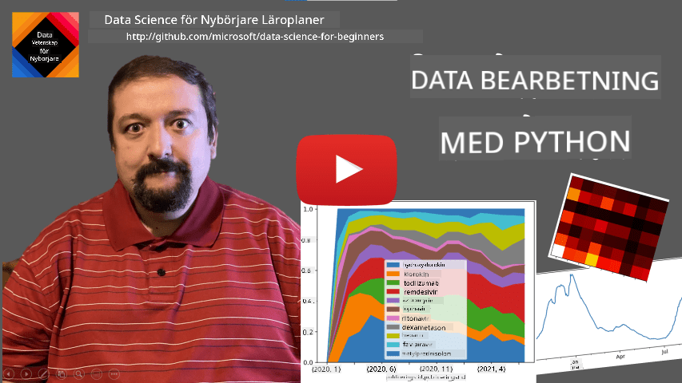
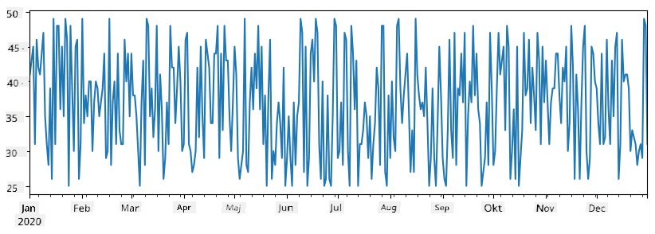
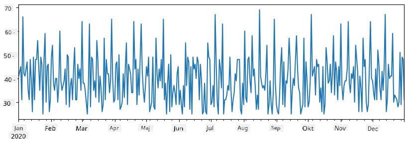
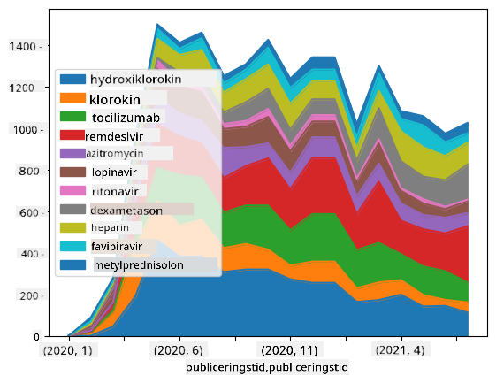

<!--
CO_OP_TRANSLATOR_METADATA:
{
  "original_hash": "57f7db1f4c3ae3361c1d1fbafcdd690c",
  "translation_date": "2025-09-04T18:58:36+00:00",
  "source_file": "2-Working-With-Data/07-python/README.md",
  "language_code": "sv"
}
-->
# Arbeta med data: Python och Pandas-biblioteket

|  ](../../sketchnotes/07-WorkWithPython.png) |
| :-------------------------------------------------------------------------------------------------------: |
|                 Arbeta med Python - _Sketchnote av [@nitya](https://twitter.com/nitya)_                  |

[](https://youtu.be/dZjWOGbsN4Y)

Även om databaser erbjuder mycket effektiva sätt att lagra data och söka i dem med hjälp av frågespråk, är det mest flexibla sättet att bearbeta data att skriva ditt eget program för att manipulera data. I många fall skulle en databasfråga vara ett mer effektivt sätt. Men i vissa fall, när mer komplex databehandling behövs, kan det inte göras enkelt med SQL.  
Databehandling kan programmeras i vilket programmeringsspråk som helst, men det finns vissa språk som är mer hög nivå när det gäller att arbeta med data. Dataanalytiker föredrar vanligtvis ett av följande språk:

* **[Python](https://www.python.org/)**, ett allmänt programmeringsspråk, som ofta anses vara ett av de bästa alternativen för nybörjare på grund av dess enkelhet. Python har många ytterligare bibliotek som kan hjälpa dig att lösa många praktiska problem, såsom att extrahera data från en ZIP-fil eller konvertera en bild till gråskala. Förutom dataanalys används Python också ofta för webbutveckling.  
* **[R](https://www.r-project.org/)** är en traditionell verktygslåda utvecklad med statistisk databehandling i åtanke. Det innehåller också ett stort bibliotek (CRAN), vilket gör det till ett bra val för databehandling. Dock är R inte ett allmänt programmeringsspråk och används sällan utanför dataanalysområdet.  
* **[Julia](https://julialang.org/)** är ett annat språk som är specifikt utvecklat för dataanalys. Det är avsett att ge bättre prestanda än Python, vilket gör det till ett utmärkt verktyg för vetenskapliga experiment.  

I denna lektion kommer vi att fokusera på att använda Python för enkel databehandling. Vi antar grundläggande kunskaper om språket. Om du vill ha en djupare introduktion till Python kan du hänvisa till en av följande resurser:

* [Lär dig Python på ett roligt sätt med Turtle Graphics och Fraktaler](https://github.com/shwars/pycourse) - GitHub-baserad snabbkurs i Python-programmering  
* [Ta dina första steg med Python](https://docs.microsoft.com/en-us/learn/paths/python-first-steps/?WT.mc_id=academic-77958-bethanycheum) Lärväg på [Microsoft Learn](http://learn.microsoft.com/?WT.mc_id=academic-77958-bethanycheum)  

Data kan komma i många former. I denna lektion kommer vi att titta på tre former av data - **tabellformad data**, **text** och **bilder**.

Vi kommer att fokusera på några exempel på databehandling, istället för att ge dig en fullständig översikt över alla relaterade bibliotek. Detta gör att du kan få en grundläggande förståelse för vad som är möjligt och ger dig insikt i var du kan hitta lösningar på dina problem när du behöver dem.

> **Det mest användbara rådet**. När du behöver utföra en viss operation på data som du inte vet hur du ska göra, försök att söka efter det på internet. [Stackoverflow](https://stackoverflow.com/) innehåller ofta många användbara kodexempel i Python för många typiska uppgifter.  

## [Quiz före föreläsningen](https://purple-hill-04aebfb03.1.azurestaticapps.net/quiz/12)

## Tabellformad data och Dataframes

Du har redan stött på tabellformad data när vi pratade om relationsdatabaser. När du har mycket data och det är lagrat i många olika länkade tabeller, är det definitivt vettigt att använda SQL för att arbeta med det. Men det finns många fall där vi har en tabell med data och vi behöver få **förståelse** eller **insikter** om denna data, såsom fördelning, korrelation mellan värden, etc. Inom dataanalys finns det många fall där vi behöver utföra vissa transformationer av den ursprungliga datan, följt av visualisering. Båda dessa steg kan enkelt göras med Python.

Det finns två mest användbara bibliotek i Python som kan hjälpa dig att hantera tabellformad data:
* **[Pandas](https://pandas.pydata.org/)** låter dig manipulera så kallade **Dataframes**, som är analoga med relationstabeller. Du kan ha namngivna kolumner och utföra olika operationer på rader, kolumner och dataframes i allmänhet.  
* **[Numpy](https://numpy.org/)** är ett bibliotek för att arbeta med **tensors**, dvs. multidimensionella **arrayer**. En array har värden av samma underliggande typ och är enklare än en dataframe, men erbjuder fler matematiska operationer och skapar mindre overhead.  

Det finns också ett par andra bibliotek du bör känna till:
* **[Matplotlib](https://matplotlib.org/)** är ett bibliotek som används för datavisualisering och att rita grafer  
* **[SciPy](https://www.scipy.org/)** är ett bibliotek med några ytterligare vetenskapliga funktioner. Vi har redan stött på detta bibliotek när vi pratade om sannolikhet och statistik  

Här är en kodsnutt som du vanligtvis skulle använda för att importera dessa bibliotek i början av ditt Python-program:  
```python
import numpy as np
import pandas as pd
import matplotlib.pyplot as plt
from scipy import ... # you need to specify exact sub-packages that you need
```  

Pandas är centrerat kring några grundläggande koncept.

### Series

**Series** är en sekvens av värden, liknande en lista eller numpy-array. Den största skillnaden är att en series också har ett **index**, och när vi arbetar med series (t.ex. lägger ihop dem), tas indexet med i beräkningen. Indexet kan vara så enkelt som ett heltals radnummer (det är indexet som används som standard när man skapar en series från en lista eller array), eller det kan ha en komplex struktur, såsom ett datumintervall.

> **Obs**: Det finns introducerande Pandas-kod i den medföljande notebook-filen [`notebook.ipynb`](notebook.ipynb). Vi skisserar bara några av exemplen här, och du är definitivt välkommen att kolla in hela notebook-filen.

Tänk på ett exempel: vi vill analysera försäljningen på vår glasskiosk. Låt oss generera en series med försäljningssiffror (antal sålda artiklar varje dag) för en viss tidsperiod:

```python
start_date = "Jan 1, 2020"
end_date = "Mar 31, 2020"
idx = pd.date_range(start_date,end_date)
print(f"Length of index is {len(idx)}")
items_sold = pd.Series(np.random.randint(25,50,size=len(idx)),index=idx)
items_sold.plot()
```  


Anta nu att vi varje vecka organiserar en fest för vänner och tar med oss ytterligare 10 paket glass till festen. Vi kan skapa en annan series, indexerad per vecka, för att visa detta:  
```python
additional_items = pd.Series(10,index=pd.date_range(start_date,end_date,freq="W"))
```  
När vi lägger ihop två series får vi det totala antalet:  
```python
total_items = items_sold.add(additional_items,fill_value=0)
total_items.plot()
```  


> **Obs** att vi inte använder den enkla syntaxen `total_items+additional_items`. Om vi gjorde det skulle vi ha fått många `NaN` (*Not a Number*) värden i den resulterande serien. Detta beror på att det saknas värden för vissa indexpunkter i serien `additional_items`, och att lägga till `NaN` till något resulterar i `NaN`. Därför måste vi specificera parametern `fill_value` under additionen.

Med tidsserier kan vi också **resampla** serien med olika tidsintervall. Till exempel, anta att vi vill beräkna den genomsnittliga försäljningsvolymen per månad. Vi kan använda följande kod:  
```python
monthly = total_items.resample("1M").mean()
ax = monthly.plot(kind='bar')
```  


### DataFrame

En DataFrame är i grunden en samling av series med samma index. Vi kan kombinera flera series till en DataFrame:  
```python
a = pd.Series(range(1,10))
b = pd.Series(["I","like","to","play","games","and","will","not","change"],index=range(0,9))
df = pd.DataFrame([a,b])
```  
Detta skapar en horisontell tabell som denna:  
|     | 0   | 1    | 2   | 3   | 4      | 5   | 6      | 7    | 8    |
| --- | --- | ---- | --- | --- | ------ | --- | ------ | ---- | ---- |
| 0   | 1   | 2    | 3   | 4   | 5      | 6   | 7      | 8    | 9    |
| 1   | I   | like | to  | use | Python | and | Pandas | very | much |

Vi kan också använda Series som kolumner och specificera kolumnnamn med hjälp av en dictionary:  
```python
df = pd.DataFrame({ 'A' : a, 'B' : b })
```  
Detta ger oss en tabell som denna:

|     | A   | B      |
| --- | --- | ------ |
| 0   | 1   | I      |
| 1   | 2   | like   |
| 2   | 3   | to     |
| 3   | 4   | use    |
| 4   | 5   | Python |
| 5   | 6   | and    |
| 6   | 7   | Pandas |
| 7   | 8   | very   |
| 8   | 9   | much   |

**Obs** att vi också kan få denna tabelllayout genom att transponera den tidigare tabellen, t.ex. genom att skriva  
```python
df = pd.DataFrame([a,b]).T..rename(columns={ 0 : 'A', 1 : 'B' })
```  
Här betyder `.T` operationen att transponera DataFrame, dvs. byta rader och kolumner, och `rename`-operationen låter oss byta namn på kolumner för att matcha det tidigare exemplet.

Här är några av de viktigaste operationerna vi kan utföra på DataFrames:

**Kolumnval**. Vi kan välja enskilda kolumner genom att skriva `df['A']` - denna operation returnerar en Series. Vi kan också välja ett delmängd av kolumner till en annan DataFrame genom att skriva `df[['B','A']]` - detta returnerar en annan DataFrame.

**Filtrering** av endast vissa rader baserat på kriterier. Till exempel, för att endast behålla rader där kolumnen `A` är större än 5, kan vi skriva `df[df['A']>5]`.

> **Obs**: Så här fungerar filtrering. Uttrycket `df['A']<5` returnerar en boolesk series, som indikerar om uttrycket är `True` eller `False` för varje element i den ursprungliga serien `df['A']`. När boolesk series används som index returnerar det en delmängd av rader i DataFrame. Därför är det inte möjligt att använda godtyckliga Python-booleska uttryck, till exempel skulle det vara fel att skriva `df[df['A']>5 and df['A']<7]`. Istället bör du använda den speciella `&`-operationen på boolesk series, genom att skriva `df[(df['A']>5) & (df['A']<7)]` (*parenteser är viktiga här*).

**Skapa nya beräkningsbara kolumner**. Vi kan enkelt skapa nya beräkningsbara kolumner för vår DataFrame genom att använda intuitiva uttryck som detta:  
```python
df['DivA'] = df['A']-df['A'].mean() 
```  
Detta exempel beräknar avvikelsen för A från dess medelvärde. Vad som faktiskt händer här är att vi beräknar en series och sedan tilldelar denna series till vänster sida, vilket skapar en ny kolumn. Därför kan vi inte använda några operationer som inte är kompatibla med series, till exempel är koden nedan fel:  
```python
# Wrong code -> df['ADescr'] = "Low" if df['A'] < 5 else "Hi"
df['LenB'] = len(df['B']) # <- Wrong result
```  
Det senare exemplet, även om det är syntaktiskt korrekt, ger oss fel resultat eftersom det tilldelar längden på serien `B` till alla värden i kolumnen, och inte längden på de enskilda elementen som vi avsåg.

Om vi behöver beräkna komplexa uttryck som detta kan vi använda funktionen `apply`. Det sista exemplet kan skrivas så här:  
```python
df['LenB'] = df['B'].apply(lambda x : len(x))
# or 
df['LenB'] = df['B'].apply(len)
```  

Efter ovanstående operationer kommer vi att ha följande DataFrame:

|     | A   | B      | DivA | LenB |
| --- | --- | ------ | ---- | ---- |
| 0   | 1   | I      | -4.0 | 1    |
| 1   | 2   | like   | -3.0 | 4    |
| 2   | 3   | to     | -2.0 | 2    |
| 3   | 4   | use    | -1.0 | 3    |
| 4   | 5   | Python | 0.0  | 6    |
| 5   | 6   | and    | 1.0  | 3    |
| 6   | 7   | Pandas | 2.0  | 6    |
| 7   | 8   | very   | 3.0  | 4    |
| 8   | 9   | much   | 4.0  | 4    |

**Välja rader baserat på nummer** kan göras med hjälp av `iloc`-konstruktionen. Till exempel, för att välja de första 5 raderna från DataFrame:  
```python
df.iloc[:5]
```  

**Gruppering** används ofta för att få ett resultat som liknar *pivot-tabeller* i Excel. Anta att vi vill beräkna medelvärdet för kolumnen `A` för varje givet antal `LenB`. Då kan vi gruppera vår DataFrame efter `LenB` och kalla `mean`:  
```python
df.groupby(by='LenB').mean()
```  
Om vi behöver beräkna medelvärdet och antalet element i gruppen kan vi använda den mer komplexa funktionen `aggregate`:  
```python
df.groupby(by='LenB') \
 .aggregate({ 'DivA' : len, 'A' : lambda x: x.mean() }) \
 .rename(columns={ 'DivA' : 'Count', 'A' : 'Mean'})
```  
Detta ger oss följande tabell:

| LenB | Count | Mean     |
| ---- | ----- | -------- |
| 1    | 1     | 1.000000 |
| 2    | 1     | 3.000000 |
| 3    | 2     | 5.000000 |
| 4    | 3     | 6.333333 |
| 6    | 2     | 6.000000 |

### Hämta data
Vi har sett hur enkelt det är att skapa Series och DataFrames från Python-objekt. Men data kommer oftast i form av en textfil eller en Excel-tabell. Lyckligtvis erbjuder Pandas ett enkelt sätt att ladda data från disk. Till exempel, att läsa en CSV-fil är så enkelt som detta:
```python
df = pd.read_csv('file.csv')
```
Vi kommer att se fler exempel på att ladda data, inklusive att hämta den från externa webbplatser, i avsnittet "Utmaning".

### Utskrift och Visualisering

En Data Scientist måste ofta utforska data, och därför är det viktigt att kunna visualisera den. När en DataFrame är stor vill vi ofta bara försäkra oss om att vi gör allt korrekt genom att skriva ut de första raderna. Detta kan göras genom att kalla på `df.head()`. Om du kör det från Jupyter Notebook kommer det att skriva ut DataFrame i en snygg tabellform.

Vi har också sett användningen av funktionen `plot` för att visualisera vissa kolumner. Även om `plot` är mycket användbar för många uppgifter och stöder många olika grafiska typer via parametern `kind=`, kan du alltid använda det råa biblioteket `matplotlib` för att skapa något mer komplext. Vi kommer att täcka datavisualisering i detalj i separata kurslektioner.

Denna översikt täcker de viktigaste koncepten i Pandas, men biblioteket är mycket rikt och det finns ingen gräns för vad du kan göra med det! Låt oss nu tillämpa denna kunskap för att lösa ett specifikt problem.

## 🚀 Utmaning 1: Analysera spridningen av COVID

Det första problemet vi kommer att fokusera på är modellering av epidemisk spridning av COVID-19. För att göra det kommer vi att använda data om antalet smittade individer i olika länder, tillhandahållen av [Center for Systems Science and Engineering](https://systems.jhu.edu/) (CSSE) vid [Johns Hopkins University](https://jhu.edu/). Datasetet finns tillgängligt i [detta GitHub Repository](https://github.com/CSSEGISandData/COVID-19).

Eftersom vi vill demonstrera hur man hanterar data, uppmanar vi dig att öppna [`notebook-covidspread.ipynb`](notebook-covidspread.ipynb) och läsa det från början till slut. Du kan också köra celler och göra några utmaningar som vi har lämnat åt dig i slutet.


> Om du inte vet hur man kör kod i Jupyter Notebook, ta en titt på [denna artikel](https://soshnikov.com/education/how-to-execute-notebooks-from-github/).

## Arbeta med Ostrukturerad Data

Även om data ofta kommer i tabellform, måste vi ibland hantera mindre strukturerad data, till exempel text eller bilder. I sådana fall, för att tillämpa databehandlingstekniker som vi har sett ovan, måste vi på något sätt **extrahera** strukturerad data. Här är några exempel:

* Extrahera nyckelord från text och se hur ofta dessa nyckelord förekommer
* Använda neurala nätverk för att extrahera information om objekt på en bild
* Få information om människors känslor från en videokameraflöde

## 🚀 Utmaning 2: Analysera COVID-artiklar

I denna utmaning fortsätter vi med ämnet COVID-pandemin och fokuserar på att bearbeta vetenskapliga artiklar om ämnet. Det finns [CORD-19 Dataset](https://www.kaggle.com/allen-institute-for-ai/CORD-19-research-challenge) med mer än 7000 (vid skrivande stund) artiklar om COVID, tillgängliga med metadata och abstrakt (och för ungefär hälften av dem finns även fulltext tillgänglig).

Ett fullständigt exempel på att analysera detta dataset med hjälp av [Text Analytics for Health](https://docs.microsoft.com/azure/cognitive-services/text-analytics/how-tos/text-analytics-for-health/?WT.mc_id=academic-77958-bethanycheum) kognitiv tjänst beskrivs [i detta blogginlägg](https://soshnikov.com/science/analyzing-medical-papers-with-azure-and-text-analytics-for-health/). Vi kommer att diskutera en förenklad version av denna analys.

> **NOTE**: Vi tillhandahåller inte en kopia av datasetet som en del av detta repository. Du kan först behöva ladda ner filen [`metadata.csv`](https://www.kaggle.com/allen-institute-for-ai/CORD-19-research-challenge?select=metadata.csv) från [detta dataset på Kaggle](https://www.kaggle.com/allen-institute-for-ai/CORD-19-research-challenge). Registrering hos Kaggle kan krävas. Du kan också ladda ner datasetet utan registrering [härifrån](https://ai2-semanticscholar-cord-19.s3-us-west-2.amazonaws.com/historical_releases.html), men det kommer att inkludera alla fulltexter utöver metadatafilen.

Öppna [`notebook-papers.ipynb`](notebook-papers.ipynb) och läs det från början till slut. Du kan också köra celler och göra några utmaningar som vi har lämnat åt dig i slutet.



## Bearbeta Bilddata

Nyligen har mycket kraftfulla AI-modeller utvecklats som gör det möjligt att förstå bilder. Det finns många uppgifter som kan lösas med hjälp av förtränade neurala nätverk eller molntjänster. Några exempel inkluderar:

* **Bildklassificering**, som kan hjälpa dig att kategorisera bilden i en av de fördefinierade klasserna. Du kan enkelt träna dina egna bildklassificerare med tjänster som [Custom Vision](https://azure.microsoft.com/services/cognitive-services/custom-vision-service/?WT.mc_id=academic-77958-bethanycheum)
* **Objektdetektion** för att identifiera olika objekt på bilden. Tjänster som [computer vision](https://azure.microsoft.com/services/cognitive-services/computer-vision/?WT.mc_id=academic-77958-bethanycheum) kan identifiera ett antal vanliga objekt, och du kan träna en [Custom Vision](https://azure.microsoft.com/services/cognitive-services/custom-vision-service/?WT.mc_id=academic-77958-bethanycheum) modell för att identifiera specifika objekt av intresse.
* **Ansiktsdetektion**, inklusive ålder, kön och känslodetektion. Detta kan göras via [Face API](https://azure.microsoft.com/services/cognitive-services/face/?WT.mc_id=academic-77958-bethanycheum).

Alla dessa molntjänster kan anropas med [Python SDKs](https://docs.microsoft.com/samples/azure-samples/cognitive-services-python-sdk-samples/cognitive-services-python-sdk-samples/?WT.mc_id=academic-77958-bethanycheum), och kan därför enkelt integreras i ditt datautforskningsflöde.

Här är några exempel på att utforska data från bilddatakällor:
* I blogginlägget [How to Learn Data Science without Coding](https://soshnikov.com/azure/how-to-learn-data-science-without-coding/) utforskar vi Instagram-foton och försöker förstå vad som får människor att ge fler likes till ett foto. Vi extraherar först så mycket information som möjligt från bilder med hjälp av [computer vision](https://azure.microsoft.com/services/cognitive-services/computer-vision/?WT.mc_id=academic-77958-bethanycheum), och använder sedan [Azure Machine Learning AutoML](https://docs.microsoft.com/azure/machine-learning/concept-automated-ml/?WT.mc_id=academic-77958-bethanycheum) för att bygga en tolkningsbar modell.
* I [Facial Studies Workshop](https://github.com/CloudAdvocacy/FaceStudies) använder vi [Face API](https://azure.microsoft.com/services/cognitive-services/face/?WT.mc_id=academic-77958-bethanycheum) för att extrahera känslor hos människor på fotografier från evenemang, för att försöka förstå vad som gör människor glada.

## Slutsats

Oavsett om du redan har strukturerad eller ostrukturerad data, kan du med Python utföra alla steg relaterade till databehandling och förståelse. Det är förmodligen det mest flexibla sättet att bearbeta data, och det är anledningen till att majoriteten av data scientists använder Python som sitt primära verktyg. Att lära sig Python på djupet är förmodligen en bra idé om du är seriös med din resa inom data science!

## [Quiz efter föreläsningen](https://ff-quizzes.netlify.app/en/ds/)

## Granskning & Självstudier

**Böcker**
* [Wes McKinney. Python for Data Analysis: Data Wrangling with Pandas, NumPy, and IPython](https://www.amazon.com/gp/product/1491957662)

**Online-resurser**
* Officiell [10 minutes to Pandas](https://pandas.pydata.org/pandas-docs/stable/user_guide/10min.html) tutorial
* [Dokumentation om Pandas-visualisering](https://pandas.pydata.org/pandas-docs/stable/user_guide/visualization.html)

**Lär dig Python**
* [Learn Python in a Fun Way with Turtle Graphics and Fractals](https://github.com/shwars/pycourse)
* [Ta dina första steg med Python](https://docs.microsoft.com/learn/paths/python-first-steps/?WT.mc_id=academic-77958-bethanycheum) Learning Path på [Microsoft Learn](http://learn.microsoft.com/?WT.mc_id=academic-77958-bethanycheum)

## Uppgift

[Utför en mer detaljerad datastudie för utmaningarna ovan](assignment.md)

## Krediter

Denna lektion har skrivits med ♥️ av [Dmitry Soshnikov](http://soshnikov.com)

---

**Ansvarsfriskrivning**:  
Detta dokument har översatts med hjälp av AI-översättningstjänsten [Co-op Translator](https://github.com/Azure/co-op-translator). Även om vi strävar efter noggrannhet, bör det noteras att automatiserade översättningar kan innehålla fel eller brister. Det ursprungliga dokumentet på dess originalspråk bör betraktas som den auktoritativa källan. För kritisk information rekommenderas professionell mänsklig översättning. Vi ansvarar inte för eventuella missförstånd eller feltolkningar som kan uppstå vid användning av denna översättning.