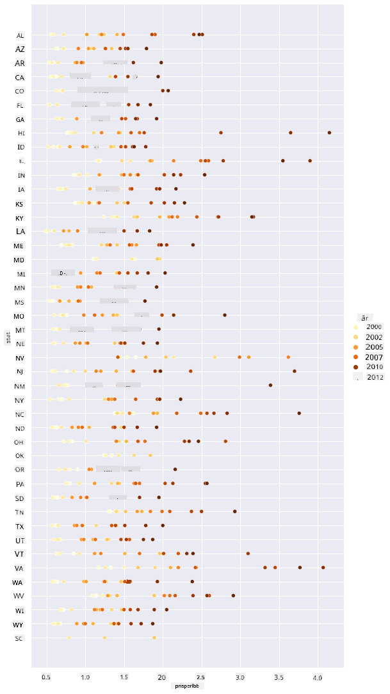
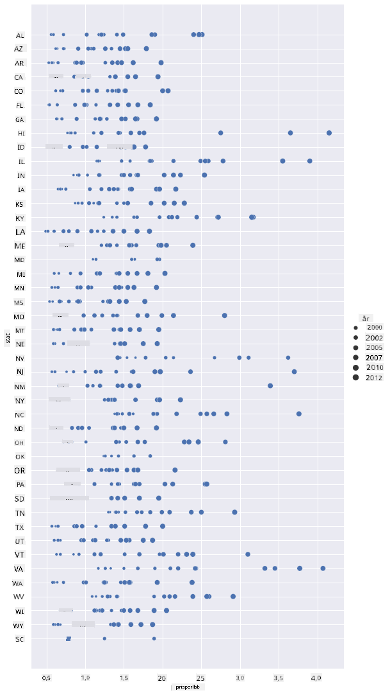
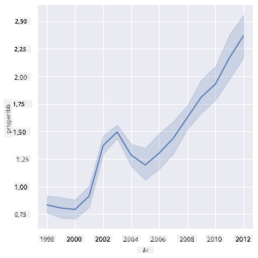
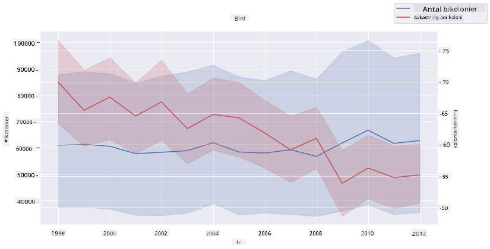

<!--
CO_OP_TRANSLATOR_METADATA:
{
  "original_hash": "b29e427401499e81f4af55a8c4afea76",
  "translation_date": "2025-09-04T19:05:04+00:00",
  "source_file": "3-Data-Visualization/12-visualization-relationships/README.md",
  "language_code": "sv"
}
-->
# Visualisera relationer: Allt om honung 🍯

| ](../../sketchnotes/12-Visualizing-Relationships.png)|
|:---:|
|Visualisera relationer - _Sketchnote av [@nitya](https://twitter.com/nitya)_ |

Fortsätt med naturfokuset i vår forskning och upptäck intressanta visualiseringar för att visa relationerna mellan olika typer av honung, baserat på en dataset från [United States Department of Agriculture](https://www.nass.usda.gov/About_NASS/index.php). 

Denna dataset med cirka 600 poster visar honungsproduktion i många amerikanska delstater. Du kan till exempel se antalet kolonier, avkastning per koloni, total produktion, lager, pris per pund och värdet av den producerade honungen i en given delstat från 1998-2012, med en rad per år för varje delstat. 

Det kan vara intressant att visualisera relationen mellan en given delstats produktion per år och till exempel priset på honung i den delstaten. Alternativt kan du visualisera relationen mellan delstaternas honungsavkastning per koloni. Denna tidsperiod täcker den förödande 'CCD' eller 'Colony Collapse Disorder' som först observerades 2006 (http://npic.orst.edu/envir/ccd.html), vilket gör det till en gripande dataset att studera. 🐝

## [Quiz före lektionen](https://purple-hill-04aebfb03.1.azurestaticapps.net/quiz/22)

I denna lektion kan du använda Seaborn, som du har använt tidigare, som ett bra bibliotek för att visualisera relationer mellan variabler. Särskilt intressant är användningen av Seaborns `relplot`-funktion som möjliggör spridningsdiagram och linjediagram för att snabbt visualisera '[statistiska relationer](https://seaborn.pydata.org/tutorial/relational.html?highlight=relationships)', vilket hjälper dataforskaren att bättre förstå hur variabler relaterar till varandra.

## Spridningsdiagram

Använd ett spridningsdiagram för att visa hur priset på honung har utvecklats år för år, per delstat. Seaborn, med hjälp av `relplot`, grupperar bekvämt delstatsdata och visar datapunkter för både kategoriska och numeriska data. 

Låt oss börja med att importera data och Seaborn:

```python
import pandas as pd
import matplotlib.pyplot as plt
import seaborn as sns
honey = pd.read_csv('../../data/honey.csv')
honey.head()
```
Du märker att honungsdatan har flera intressanta kolumner, inklusive år och pris per pund. Låt oss utforska denna data, grupperad efter amerikansk delstat:

| state | numcol | yieldpercol | totalprod | stocks   | priceperlb | prodvalue | year |
| ----- | ------ | ----------- | --------- | -------- | ---------- | --------- | ---- |
| AL    | 16000  | 71          | 1136000   | 159000   | 0.72       | 818000    | 1998 |
| AZ    | 55000  | 60          | 3300000   | 1485000  | 0.64       | 2112000   | 1998 |
| AR    | 53000  | 65          | 3445000   | 1688000  | 0.59       | 2033000   | 1998 |
| CA    | 450000 | 83          | 37350000  | 12326000 | 0.62       | 23157000  | 1998 |
| CO    | 27000  | 72          | 1944000   | 1594000  | 0.7        | 1361000   | 1998 |

Skapa ett grundläggande spridningsdiagram för att visa relationen mellan priset per pund honung och dess ursprungsdelstat i USA. Gör `y`-axeln tillräckligt hög för att visa alla delstater:

```python
sns.relplot(x="priceperlb", y="state", data=honey, height=15, aspect=.5);
```


Visa nu samma data med ett honungsfärgschema för att visa hur priset utvecklas över åren. Du kan göra detta genom att lägga till en 'hue'-parameter för att visa förändringen år för år:

> ✅ Läs mer om [färgpaletter du kan använda i Seaborn](https://seaborn.pydata.org/tutorial/color_palettes.html) - prova ett vackert regnbågsfärgschema!

```python
sns.relplot(x="priceperlb", y="state", hue="year", palette="YlOrBr", data=honey, height=15, aspect=.5);
```


Med denna färgschemaförändring kan du tydligt se en stark utveckling över åren när det gäller honungspriset per pund. Faktum är att om du tittar på ett urval i datan för att verifiera (välj en given delstat, till exempel Arizona) kan du se ett mönster av prisökningar år för år, med få undantag:

| state | numcol | yieldpercol | totalprod | stocks  | priceperlb | prodvalue | year |
| ----- | ------ | ----------- | --------- | ------- | ---------- | --------- | ---- |
| AZ    | 55000  | 60          | 3300000   | 1485000 | 0.64       | 2112000   | 1998 |
| AZ    | 52000  | 62          | 3224000   | 1548000 | 0.62       | 1999000   | 1999 |
| AZ    | 40000  | 59          | 2360000   | 1322000 | 0.73       | 1723000   | 2000 |
| AZ    | 43000  | 59          | 2537000   | 1142000 | 0.72       | 1827000   | 2001 |
| AZ    | 38000  | 63          | 2394000   | 1197000 | 1.08       | 2586000   | 2002 |
| AZ    | 35000  | 72          | 2520000   | 983000  | 1.34       | 3377000   | 2003 |
| AZ    | 32000  | 55          | 1760000   | 774000  | 1.11       | 1954000   | 2004 |
| AZ    | 36000  | 50          | 1800000   | 720000  | 1.04       | 1872000   | 2005 |
| AZ    | 30000  | 65          | 1950000   | 839000  | 0.91       | 1775000   | 2006 |
| AZ    | 30000  | 64          | 1920000   | 902000  | 1.26       | 2419000   | 2007 |
| AZ    | 25000  | 64          | 1600000   | 336000  | 1.26       | 2016000   | 2008 |
| AZ    | 20000  | 52          | 1040000   | 562000  | 1.45       | 1508000   | 2009 |
| AZ    | 24000  | 77          | 1848000   | 665000  | 1.52       | 2809000   | 2010 |
| AZ    | 23000  | 53          | 1219000   | 427000  | 1.55       | 1889000   | 2011 |
| AZ    | 22000  | 46          | 1012000   | 253000  | 1.79       | 1811000   | 2012 |

Ett annat sätt att visualisera denna utveckling är att använda storlek istället för färg. För färgblinda användare kan detta vara ett bättre alternativ. Redigera din visualisering för att visa en ökning av priset genom en ökning av punktens omkrets:

```python
sns.relplot(x="priceperlb", y="state", size="year", data=honey, height=15, aspect=.5);
```
Du kan se att storleken på punkterna gradvis ökar.



Är detta ett enkelt fall av utbud och efterfrågan? På grund av faktorer som klimatförändringar och kollaps av kolonier, finns det mindre honung tillgänglig för köp år för år, och därför ökar priset?

För att upptäcka en korrelation mellan några av variablerna i denna dataset, låt oss utforska några linjediagram.

## Linjediagram

Fråga: Finns det en tydlig ökning av priset på honung per pund år för år? Du kan enklast upptäcka detta genom att skapa ett enda linjediagram:

```python
sns.relplot(x="year", y="priceperlb", kind="line", data=honey);
```
Svar: Ja, med vissa undantag runt år 2003:



✅ Eftersom Seaborn aggregerar data runt en linje, visar det "de flera mätningarna vid varje x-värde genom att plotta medelvärdet och 95% konfidensintervallet runt medelvärdet". [Källa](https://seaborn.pydata.org/tutorial/relational.html). Detta tidskrävande beteende kan inaktiveras genom att lägga till `ci=None`.

Fråga: Kan vi också se en topp i honungstillgången runt 2003? Vad händer om du tittar på total produktion år för år?

```python
sns.relplot(x="year", y="totalprod", kind="line", data=honey);
```


Svar: Inte riktigt. Om du tittar på total produktion verkar det faktiskt ha ökat det året, även om mängden honung som produceras generellt sett minskar under dessa år.

Fråga: I så fall, vad kan ha orsakat den prisökningen på honung runt 2003? 

För att upptäcka detta kan du utforska ett facet grid.

## Facet grids

Facet grids tar en aspekt av din dataset (i vårt fall kan du välja 'year' för att undvika att skapa för många facetter). Seaborn kan sedan skapa en plot för varje av dessa facetter av dina valda x- och y-koordinater för enklare visuell jämförelse. Sticker 2003 ut i denna typ av jämförelse?

Skapa ett facet grid genom att fortsätta använda `relplot` som rekommenderas av [Seaborns dokumentation](https://seaborn.pydata.org/generated/seaborn.FacetGrid.html?highlight=facetgrid#seaborn.FacetGrid). 

```python
sns.relplot(
    data=honey, 
    x="yieldpercol", y="numcol",
    col="year", 
    col_wrap=3,
    kind="line"
```
I denna visualisering kan du jämföra avkastning per koloni och antal kolonier år för år, sida vid sida med en wrap inställd på 3 för kolumnerna:


För denna dataset sticker inget särskilt ut när det gäller antalet kolonier och deras avkastning, år för år och delstat för delstat. Finns det ett annat sätt att hitta en korrelation mellan dessa två variabler?

## Dubbel-linjediagram

Prova ett flerlinjediagram genom att lägga två linjediagram ovanpå varandra, använda Seaborns 'despine' för att ta bort deras övre och högra spines, och använda `ax.twinx` [härledd från Matplotlib](https://matplotlib.org/stable/api/_as_gen/matplotlib.axes.Axes.twinx.html). Twinx tillåter ett diagram att dela x-axeln och visa två y-axlar. Visa avkastning per koloni och antal kolonier, överlagrade:

```python
fig, ax = plt.subplots(figsize=(12,6))
lineplot = sns.lineplot(x=honey['year'], y=honey['numcol'], data=honey, 
                        label = 'Number of bee colonies', legend=False)
sns.despine()
plt.ylabel('# colonies')
plt.title('Honey Production Year over Year');

ax2 = ax.twinx()
lineplot2 = sns.lineplot(x=honey['year'], y=honey['yieldpercol'], ax=ax2, color="r", 
                         label ='Yield per colony', legend=False) 
sns.despine(right=False)
plt.ylabel('colony yield')
ax.figure.legend();
```


Även om inget särskilt sticker ut runt år 2003, låter det oss avsluta denna lektion på en lite gladare ton: även om det totalt sett är ett minskande antal kolonier, stabiliseras antalet kolonier även om deras avkastning per koloni minskar.

Heja bina, heja!

🐝❤️
## 🚀 Utmaning

I denna lektion lärde du dig lite mer om andra användningar av spridningsdiagram och linjediagram, inklusive facet grids. Utmana dig själv att skapa ett facet grid med en annan dataset, kanske en du använde tidigare i dessa lektioner. Notera hur lång tid det tar att skapa och hur du behöver vara försiktig med hur många grids du behöver rita med dessa tekniker.

## [Quiz efter lektionen](https://ff-quizzes.netlify.app/en/ds/)

## Granskning & Självstudier

Linjediagram kan vara enkla eller ganska komplexa. Läs lite i [Seaborns dokumentation](https://seaborn.pydata.org/generated/seaborn.lineplot.html) om de olika sätten du kan bygga dem. Försök förbättra de linjediagram du byggde i denna lektion med andra metoder som listas i dokumentationen.
## Uppgift

[Utforska bikupan](assignment.md)

---

**Ansvarsfriskrivning**:  
Detta dokument har översatts med hjälp av AI-översättningstjänsten [Co-op Translator](https://github.com/Azure/co-op-translator). Även om vi strävar efter noggrannhet, bör du vara medveten om att automatiserade översättningar kan innehålla fel eller felaktigheter. Det ursprungliga dokumentet på dess originalspråk bör betraktas som den auktoritativa källan. För kritisk information rekommenderas professionell mänsklig översättning. Vi ansvarar inte för eventuella missförstånd eller feltolkningar som uppstår vid användning av denna översättning.