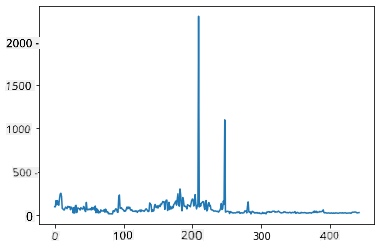
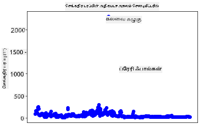
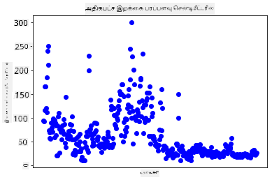
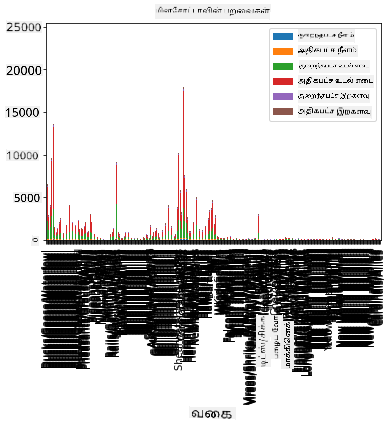
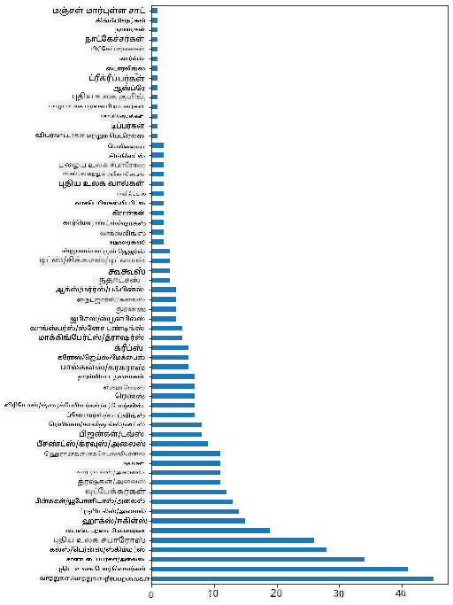
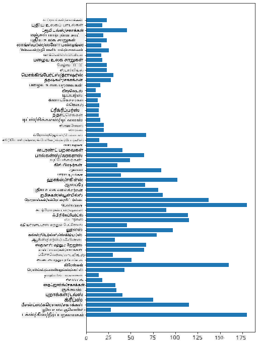
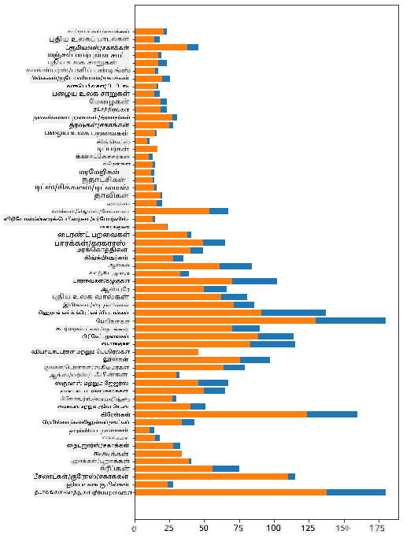

<!--
CO_OP_TRANSLATOR_METADATA:
{
  "original_hash": "a49d78e32e280c410f04e5f2a2068e77",
  "translation_date": "2025-10-11T16:04:30+00:00",
  "source_file": "3-Data-Visualization/09-visualization-quantities/README.md",
  "language_code": "ta"
}
-->
# அளவுகளை காட்சிப்படுத்துதல்

| ](../../sketchnotes/09-Visualizing-Quantities.png)|
|:---:|
| அளவுகளை காட்சிப்படுத்துதல் - _Sketchnote by [@nitya](https://twitter.com/nitya)_ |

இந்த பாடத்தில், அளவின் கருத்தை மையமாகக் கொண்டு சுவாரஸ்யமான காட்சிகளை உருவாக்க Python நூலகங்களைப் பயன்படுத்துவது எப்படி என்பதை நீங்கள் ஆராய்வீர்கள். மினசோட்டாவின் பறவைகள் பற்றிய சுத்தமான தரவுத்தொகுப்பைப் பயன்படுத்தி, உள்ளூர் வனவிலங்குகள் பற்றிய பல சுவாரஸ்யமான தகவல்களை நீங்கள் கற்றுக்கொள்ளலாம்.  
## [பாடத்துக்கு முன் வினாடி வினா](https://ff-quizzes.netlify.app/en/ds/quiz/16)

## Matplotlib மூலம் இறகுகளின் அகலத்தை கவனிக்கவும்

பல வகையான எளிய மற்றும் சிக்கலான வரைபடங்கள் மற்றும் அட்டவணைகளை உருவாக்க ஒரு சிறந்த நூலகம் [Matplotlib](https://matplotlib.org/stable/index.html) ஆகும். பொதுவாக, இந்த நூலகங்களைப் பயன்படுத்தி தரவுகளை வரைபடமாக்கும் செயல்முறை உங்கள் dataframe இல் நீங்கள் இலக்காகக் கொள்ள விரும்பும் பகுதிகளை அடையாளம் காணுதல், தேவையான மாற்றங்களைச் செய்யுதல், அதன் x மற்றும் y அச்ச மதிப்புகளை ஒதுக்குதல், எந்த வகையான வரைபடத்தை காட்ட வேண்டும் என்பதை முடிவு செய்தல், பின்னர் வரைபடத்தை காட்டுதல் ஆகியவற்றை உள்ளடக்கியது. Matplotlib பல்வேறு காட்சிகளை வழங்குகிறது, ஆனால் இந்த பாடத்திற்காக, அளவுகளை காட்சிப்படுத்த மிகவும் பொருத்தமானவை: கோடு வரைபடங்கள், சிதறல் வரைபடங்கள் மற்றும் பட்டை வரைபடங்கள்.

> ✅ உங்கள் தரவின் அமைப்பு மற்றும் நீங்கள் சொல்ல விரும்பும் கதைக்கு பொருத்தமான சிறந்த வரைபடத்தைப் பயன்படுத்தவும்.  
> - காலத்தின் ஓரளவு போக்குகளை பகுப்பாய்வு செய்ய: கோடு  
> - மதிப்புகளை ஒப்பிட: பட்டை, நெடுவெட்டு, பை, சிதறல்  
> - ஒரு முழுமையுடன் பாகங்கள் எப்படி தொடர்புடையவை என்பதை காட்ட: பை  
> - தரவின் பகிர்வை காட்ட: சிதறல், பட்டை  
> - போக்குகளை காட்ட: கோடு, நெடுவெட்டு  
> - மதிப்புகளுக்கு இடையிலான தொடர்புகளை காட்ட: கோடு, சிதறல், பபுள்  

உங்களிடம் ஒரு தரவுத்தொகுப்பு இருந்தால், ஒரு குறிப்பிட்ட பொருள் எவ்வளவு உள்ளதென்று கண்டறிய வேண்டும் என்றால், முதலில் நீங்கள் செய்ய வேண்டிய பணிகளில் ஒன்று அதன் மதிப்புகளை ஆய்வு செய்வது.

✅ Matplotlib க்கான சிறந்த 'cheat sheets' [இங்கே](https://matplotlib.org/cheatsheets/cheatsheets.pdf) கிடைக்கின்றன.

## பறவைகளின் இறகுகளின் அதிகபட்ச அகலத்தைப் பற்றிய கோடு வரைபடம் உருவாக்கவும்

இந்த பாடத்தின் கோப்புறையின் அடிப்பகுதியில் உள்ள `notebook.ipynb` கோப்பை திறந்து ஒரு செல் சேர்க்கவும்.

> குறிப்பு: தரவுகள் இந்த repo இன் அடிப்பகுதியில் உள்ள `/data` கோப்புறையில் சேமிக்கப்பட்டுள்ளன.

```python
import pandas as pd
import matplotlib.pyplot as plt
birds = pd.read_csv('../../data/birds.csv')
birds.head()
```
இந்த தரவுகள் உரை மற்றும் எண்களின் கலவையாகும்:

|      | Name                         | ScientificName         | Category              | Order        | Family   | Genus       | ConservationStatus | MinLength | MaxLength | MinBodyMass | MaxBodyMass | MinWingspan | MaxWingspan |
| ---: | :--------------------------- | :--------------------- | :-------------------- | :----------- | :------- | :---------- | :----------------- | --------: | --------: | ----------: | ----------: | ----------: | ----------: |
|    0 | Black-bellied whistling-duck | Dendrocygna autumnalis | Ducks/Geese/Waterfowl | Anseriformes | Anatidae | Dendrocygna | LC                 |        47 |        56 |         652 |        1020 |          76 |          94 |
|    1 | Fulvous whistling-duck       | Dendrocygna bicolor    | Ducks/Geese/Waterfowl | Anseriformes | Anatidae | Dendrocygna | LC                 |        45 |        53 |         712 |        1050 |          85 |          93 |
|    2 | Snow goose                   | Anser caerulescens     | Ducks/Geese/Waterfowl | Anseriformes | Anatidae | Anser       | LC                 |        64 |        79 |        2050 |        4050 |         135 |         165 |
|    3 | Ross's goose                 | Anser rossii           | Ducks/Geese/Waterfowl | Anseriformes | Anatidae | Anser       | LC                 |      57.3 |        64 |        1066 |        1567 |         113 |         116 |
|    4 | Greater white-fronted goose  | Anser albifrons        | Ducks/Geese/Waterfowl | Anseriformes | Anatidae | Anser       | LC                 |        64 |        81 |        1930 |        3310 |         130 |         165 |

இந்த சுவாரஸ்யமான பறவைகளின் அதிகபட்ச இறகுகளின் அகலத்தைப் பார்வையிட ஒரு அடிப்படை கோடு வரைபடத்தை உருவாக்குவோம்.

```python
wingspan = birds['MaxWingspan'] 
wingspan.plot()
```


உடனடியாக நீங்கள் என்ன கவனிக்கிறீர்கள்? குறைந்தது ஒரு outlier உள்ளது போல தெரிகிறது - இது மிகவும் பெரிய இறகுகளின் அகலமாக இருக்கிறது! 2300 செ.மீ. அகலம் 23 மீட்டர் ஆகும் - மினசோட்டாவில் ப்டெரோடாக்டில்கள் சுற்றி வருகிறதா? இதை ஆராய்வோம்.

Excel இல் ஒரு விரைவான வரிசைப்படுத்தலைச் செய்யலாம், இது தவறான டைப் ஆக இருக்கலாம், ஆனால் காட்சிப்படுத்தல் செயல்முறையை வரைபடத்திலிருந்து தொடருங்கள்.

x-அச்சத்தில் எந்த வகையான பறவைகள் உள்ளன என்பதை காட்ட லேபிள்களைச் சேர்க்கவும்:

```
plt.title('Max Wingspan in Centimeters')
plt.ylabel('Wingspan (CM)')
plt.xlabel('Birds')
plt.xticks(rotation=45)
x = birds['Name'] 
y = birds['MaxWingspan']

plt.plot(x, y)

plt.show()
```


லேபிள்களை 45 டிகிரிகளுக்கு சுழற்சியுடன் அமைத்தாலும், அவற்றை படிக்க மிகவும் அதிகமாக உள்ளது. ஒரு வேறு உத்தியை முயற்சிப்போம்: outliers க்கு மட்டும் லேபிள் அமைத்து, லேபிள்களை வரைபடத்திற்குள் அமைக்கவும். லேபிள் இடமளிக்க அதிக இடம் பெற ஒரு சிதறல் வரைபடத்தைப் பயன்படுத்தலாம்:

```python
plt.title('Max Wingspan in Centimeters')
plt.ylabel('Wingspan (CM)')
plt.tick_params(axis='both',which='both',labelbottom=False,bottom=False)

for i in range(len(birds)):
    x = birds['Name'][i]
    y = birds['MaxWingspan'][i]
    plt.plot(x, y, 'bo')
    if birds['MaxWingspan'][i] > 500:
        plt.text(x, y * (1 - 0.05), birds['Name'][i], fontsize=12)
    
plt.show()
```
இங்கே என்ன நடக்கிறது? நீங்கள் `tick_params` ஐப் பயன்படுத்தி கீழ் லேபிள்களை மறைத்தீர்கள், பின்னர் உங்கள் பறவைகள் தரவுத்தொகுப்பில் ஒரு மடக்கத்தை உருவாக்கினீர்கள். `bo` ஐப் பயன்படுத்தி சிறிய வட்ட நீல புள்ளிகளுடன் வரைபடத்தை வரைந்து, அதிகபட்ச இறகுகளின் அகலம் 500 க்கு மேல் உள்ள எந்த பறவையையும் சரிபார்த்து, அவற்றின் பெயரை புள்ளியின் அருகில் லேபிளாகக் காட்டினீர்கள். y அச்சத்தில் லேபிள்களை சிறிது தள்ளி அமைத்தீர்கள் (`y * (1 - 0.05)`) மற்றும் பறவையின் பெயரை லேபிளாக பயன்படுத்தினீர்கள்.

நீங்கள் என்ன கண்டறிந்தீர்கள்?


## உங்கள் தரவுகளை வடிகட்டவும்

Bald Eagle மற்றும் Prairie Falcon, மிகப்பெரிய பறவைகள் ஆக இருக்கலாம், ஆனால் அவற்றின் அதிகபட்ச இறகுகளின் அகலத்தில் கூடுதல் `0` சேர்க்கப்பட்டுள்ளது. 25 மீட்டர் அகலமுள்ள Bald Eagle ஐ நீங்கள் சந்திக்க வாய்ப்பு இல்லை, ஆனால் சந்திக்கிறீர்கள் என்றால், தயவுசெய்து எங்களுக்கு தெரிவிக்கவும்! இந்த இரண்டு outliers இல்லாமல் ஒரு புதிய dataframe ஐ உருவாக்குவோம்:

```python
plt.title('Max Wingspan in Centimeters')
plt.ylabel('Wingspan (CM)')
plt.xlabel('Birds')
plt.tick_params(axis='both',which='both',labelbottom=False,bottom=False)
for i in range(len(birds)):
    x = birds['Name'][i]
    y = birds['MaxWingspan'][i]
    if birds['Name'][i] not in ['Bald eagle', 'Prairie falcon']:
        plt.plot(x, y, 'bo')
plt.show()
```

Outliers ஐ வடிகட்டுவதன் மூலம், உங்கள் தரவுகள் இப்போது மேலும் ஒருங்கிணைந்த மற்றும் புரிந்துகொள்ளக்கூடியதாக உள்ளது.



இறகுகளின் அகலத்தின் அடிப்படையில் குறைந்தபட்சம் சுத்தமான தரவுத்தொகுப்பு கிடைத்த பிறகு, இந்த பறவைகள் பற்றிய மேலும் தகவல்களை கண்டறிவோம்.

கோடு மற்றும் சிதறல் வரைபடங்கள் தரவின் மதிப்புகள் மற்றும் அவற்றின் பகிர்வுகளைப் பற்றிய தகவல்களை காட்ட முடியும், ஆனால் இந்த தரவுத்தொகுப்பில் உள்ள மதிப்புகளைப் பற்றி சிந்திக்க வேண்டும். நீங்கள் அளவுகளைப் பற்றிய பின்வரும் கேள்விகளுக்கு பதிலளிக்க காட்சிகளை உருவாக்கலாம்:

> பறவைகளின் வகைகள் எத்தனை, அவற்றின் எண்ணிக்கை என்ன?  
> எத்தனை பறவைகள் அழிந்தவை, ஆபத்தானவை, அரிதானவை அல்லது பொதுவானவை?  
> லின்னேயஸ் இன் பெயரிடல் முறையில் உள்ள பல்வேறு ஜெனஸ் மற்றும் ஆர்டர்களின் எண்ணிக்கை என்ன?  
## பட்டை வரைபடங்களை ஆராயுங்கள்

தரவின் குழுக்களை காட்ட நீங்கள் பட்டை வரைபடங்களைப் பயன்படுத்தலாம். இந்த தரவுத்தொகுப்பில் உள்ள பறவைகளின் வகைகளை ஆராய்ந்து, எது அதிகமாக உள்ளது என்பதைப் பார்ப்போம்.

Notebook கோப்பில் ஒரு அடிப்படை பட்டை வரைபடத்தை உருவாக்கவும்.

✅ குறிப்பு, நாம் முந்தைய பகுதியில் அடையாளம் கண்ட இரண்டு outlier பறவைகளை வடிகட்டலாம், அவற்றின் wingspan இல் உள்ள தவறான டைப் ஐ திருத்தலாம் அல்லது wingspan மதிப்புகளின் மீது சார்ந்திராத இந்த பயிற்சிகளுக்கு அவற்றை விடலாம்.

பட்டை வரைபடத்தை உருவாக்க விரும்பினால், நீங்கள் கவனம் செலுத்த விரும்பும் தரவுகளைத் தேர்ந்தெடுக்கலாம். பட்டை வரைபடங்கள் மூல தரவிலிருந்து உருவாக்கப்படலாம்:

```python
birds.plot(x='Category',
        kind='bar',
        stacked=True,
        title='Birds of Minnesota')

```


இந்த பட்டை வரைபடம், எனினும், வாசிக்க முடியாதது, ஏனெனில் குழு செய்யப்படாத தரவுகள் மிகவும் அதிகமாக உள்ளன. நீங்கள் வரைபடத்தில் காட்ட விரும்பும் தரவுகளை மட்டும் தேர்ந்தெடுக்க வேண்டும், எனவே பறவையின் வகையின் அடிப்படையில் பறவையின் நீளத்தைப் பார்ப்போம்.

தரவுகளை பறவையின் வகையை மட்டும் உள்ளடக்க வடிகட்டவும்.

✅ நீங்கள் Pandas ஐப் பயன்படுத்தி தரவுகளை நிர்வகிக்கிறீர்கள், பின்னர் Matplotlib க்கு வரைபடத்தை உருவாக்க அனுமதிக்கிறீர்கள் என்பதை கவனிக்கவும்.

வகைகள் பல உள்ளதால், இந்த வரைபடத்தை செங்குத்தாகக் காட்டி, அனைத்து தரவுகளுக்கும் கணக்கெடுக்கும் வகையில் அதன் உயரத்தைச் சரிசெய்யலாம்:

```python
category_count = birds.value_counts(birds['Category'].values, sort=True)
plt.rcParams['figure.figsize'] = [6, 12]
category_count.plot.barh()
```


இந்த பட்டை வரைபடம் ஒவ்வொரு வகையில் உள்ள பறவைகளின் எண்ணிக்கையை நல்ல பார்வையை வழங்குகிறது. ஒரு கணத்தில், இந்த பிராந்தியத்தில் உள்ள பறவைகளின் மிகப்பெரிய எண்ணிக்கை Ducks/Geese/Waterfowl வகையில் உள்ளன என்பதை நீங்கள் காணலாம். மினசோட்டா '10,000 ஏரிகளின் நிலம்' என்பதால் இது ஆச்சரியமாக இல்லை!

✅ இந்த தரவுத்தொகுப்பில் சில மற்ற எண்ணிக்கைகளை முயற்சிக்கவும். உங்களை ஆச்சரியப்படுத்தும் ஏதாவது உள்ளதா?

## தரவுகளை ஒப்பிடுதல்

குழு செய்யப்பட்ட தரவுகளை ஒப்பிட புதிய அச்சுகளை உருவாக்கலாம். ஒரு பறவையின் வகையின் அடிப்படையில் MaxLength ஐ ஒப்பிட முயற்சிக்கவும்:

```python
maxlength = birds['MaxLength']
plt.barh(y=birds['Category'], width=maxlength)
plt.rcParams['figure.figsize'] = [6, 12]
plt.show()
```


இங்கே எந்த ஆச்சரியமும் இல்லை: Pelicans அல்லது Geese உடன் ஒப்பிடும்போது hummingbirds க்கு குறைந்த MaxLength உள்ளது. தரவுகள் தர்க்கரீதியாக பொருந்தும்போது நல்லது!

பட்டை வரைபடங்களை மேலும் சுவாரஸ்யமாகக் காட்சிப்படுத்த, தரவுகளை superimpose செய்யலாம். ஒரு குறிப்பிட்ட பறவையின் வகையில் குறைந்தபட்ச மற்றும் அதிகபட்ச நீளத்தை superimpose செய்யலாம்:

```python
minLength = birds['MinLength']
maxLength = birds['MaxLength']
category = birds['Category']

plt.barh(category, maxLength)
plt.barh(category, minLength)

plt.show()
```
இந்த வரைபடத்தில், ஒரு பறவையின் வகையின் அடிப்படையில் குறைந்தபட்ச நீளம் மற்றும் அதிகபட்ச நீளத்தின் வரம்பை நீங்கள் காணலாம். இந்த தரவுகளைப் பார்த்து, பறவை பெரியதாக இருந்தால், அதன் நீள வரம்பும் பெரியதாக இருக்கும் என்று நீங்கள் நம்பிக்கையுடன் கூறலாம். இது மிகவும் சுவாரஸ்யமாக உள்ளது!



## 🚀 சவால்

இந்த பறவைகள் தரவுத்தொகுப்பு ஒரு குறிப்பிட்ட சூழலியல் அமைப்பில் உள்ள பறவைகளின் பல்வேறு வகைகள் பற்றிய தகவல்களை வழங்குகிறது. இணையத்தில் தேடுங்கள் மற்றும் பறவைகள் சார்ந்த பிற தரவுத்தொகுப்புகளை கண்டறிய முயற்சிக்கவும். இந்த பறவைகள் பற்றிய வரைபடங்கள் மற்றும் அட்டவணைகளை உருவாக்கி, நீங்கள் அறியாத உண்மைகளை கண்டறிய முயற்சிக்கவும்.

## [பாடத்திற்குப் பின் வினாடி வினா](https://ff-quizzes.netlify.app/en/ds/quiz/17)

## மதிப்பீடு மற்றும் சுயபடிப்பு

இந்த முதல் பாடம் அளவுகளை காட்சிப்படுத்த Matplotlib ஐப் பயன்படுத்துவது எப்படி என்பதைப் பற்றிய சில தகவல்களை வழங்கியுள்ளது. காட்சிப்படுத்தலுக்கான தரவுத்தொகுப்புகளைப் பயன்படுத்துவதற்கான பிற வழிகளை ஆராயுங்கள். [Plotly](https://github.com/plotly/plotly.py) என்பது இந்த பாடங்களில் நாம் கையாளாத ஒன்று, எனவே இது என்ன வழங்க முடியும் என்பதைப் பாருங்கள்.  
## பணிக்கூடம்

[Lines, Scatters, and Bars](assignment.md)

---

**குறிப்பு**:  
இந்த ஆவணம் [Co-op Translator](https://github.com/Azure/co-op-translator) என்ற AI மொழிபெயர்ப்பு சேவையை பயன்படுத்தி மொழிபெயர்க்கப்பட்டுள்ளது. எங்கள் தரச்செயல்முறையை உறுதிப்படுத்த முயற்சிக்கிறோம், ஆனால் தானியக்க மொழிபெயர்ப்புகளில் பிழைகள் அல்லது தவறான தகவல்கள் இருக்கக்கூடும் என்பதை தயவுசெய்து கவனத்தில் கொள்ளவும். அதன் தாய்மொழியில் உள்ள மூல ஆவணம் அதிகாரப்பூர்வ ஆதாரமாக கருதப்பட வேண்டும். முக்கியமான தகவல்களுக்கு, தொழில்முறை மனித மொழிபெயர்ப்பு பரிந்துரைக்கப்படுகிறது. இந்த மொழிபெயர்ப்பைப் பயன்படுத்துவதால் ஏற்படும் எந்த தவறான புரிதல்கள் அல்லது தவறான விளக்கங்களுக்கு நாங்கள் பொறுப்பல்ல.