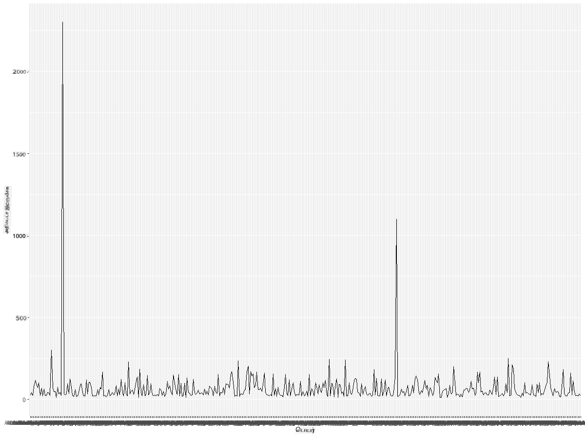
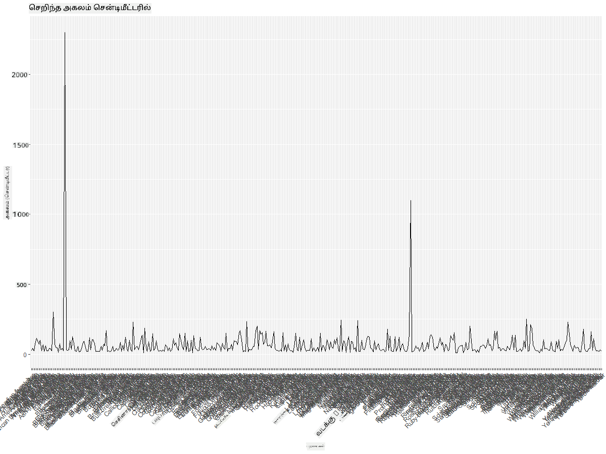
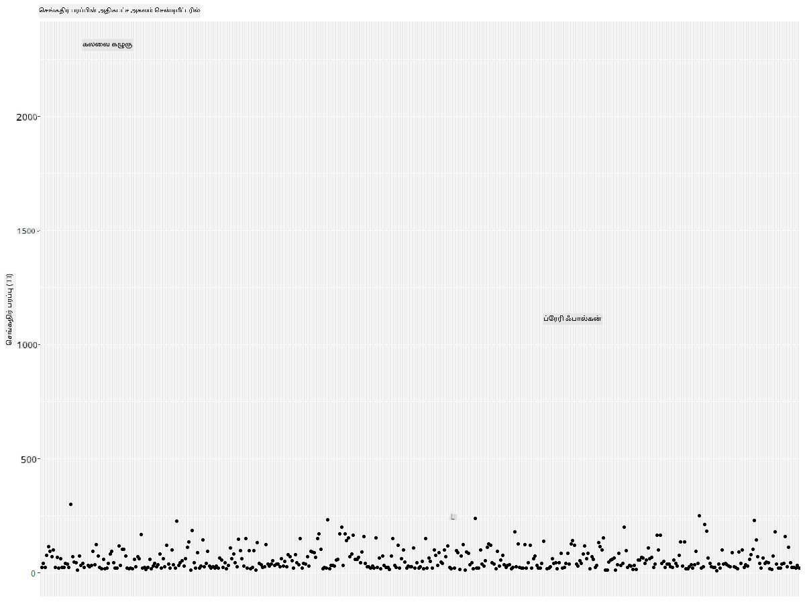
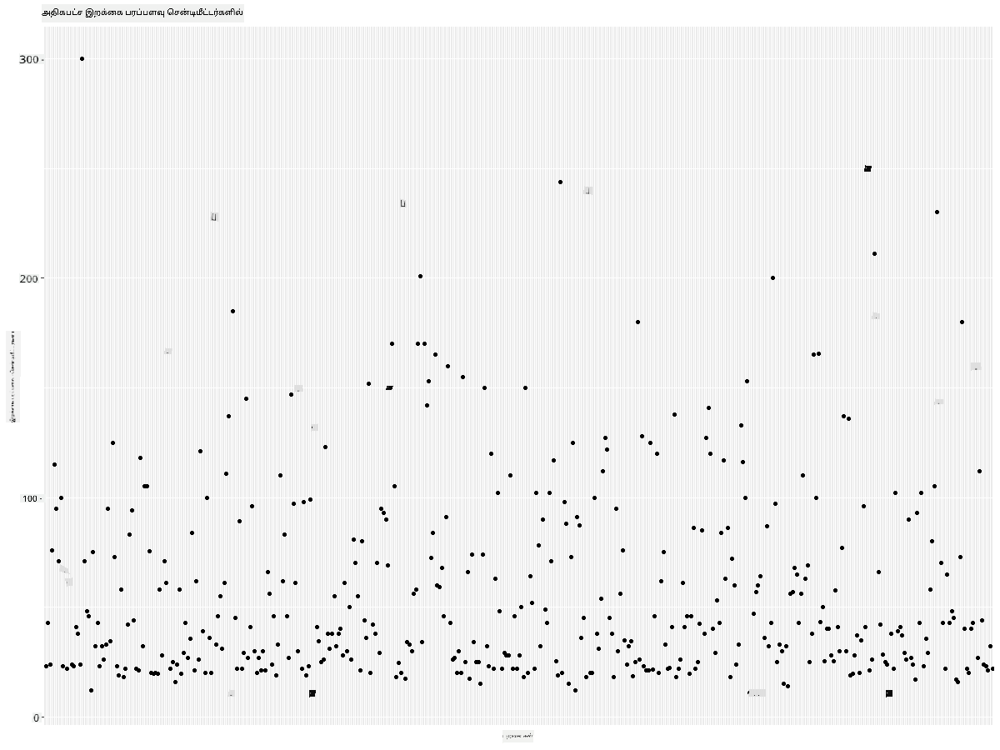
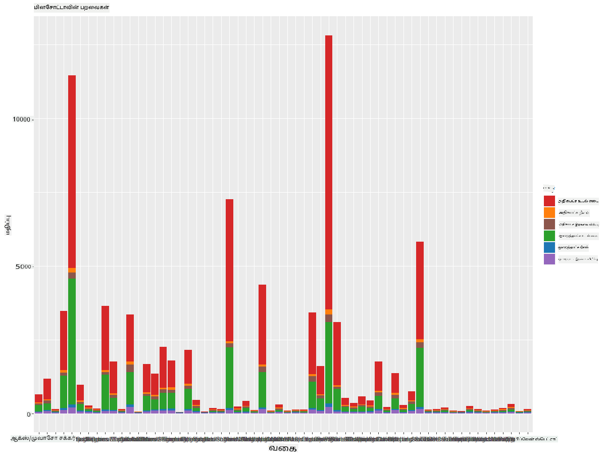
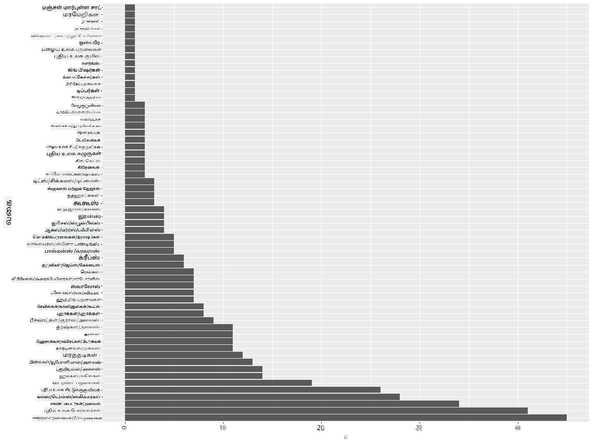
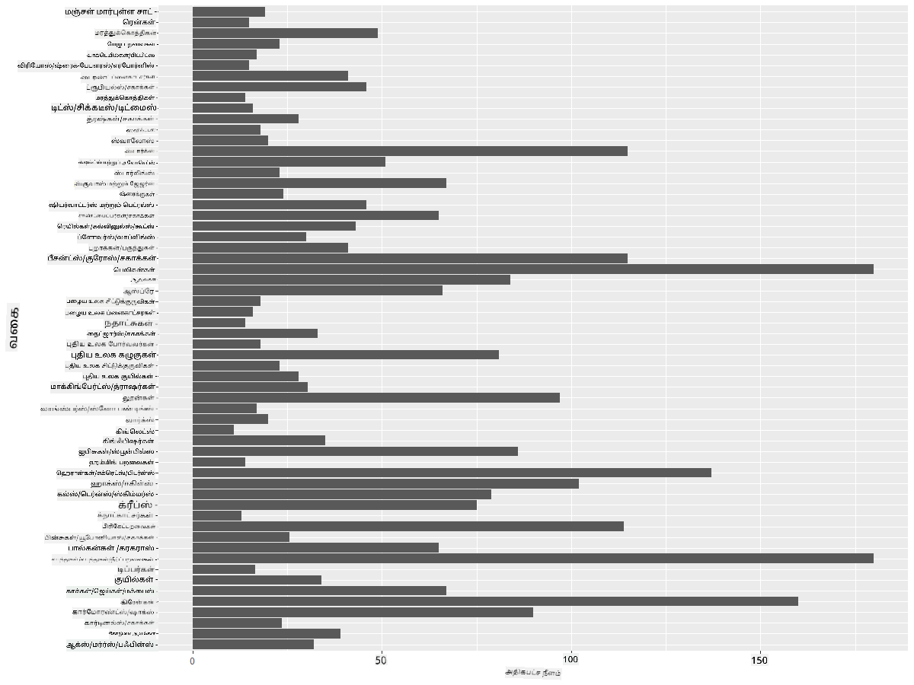
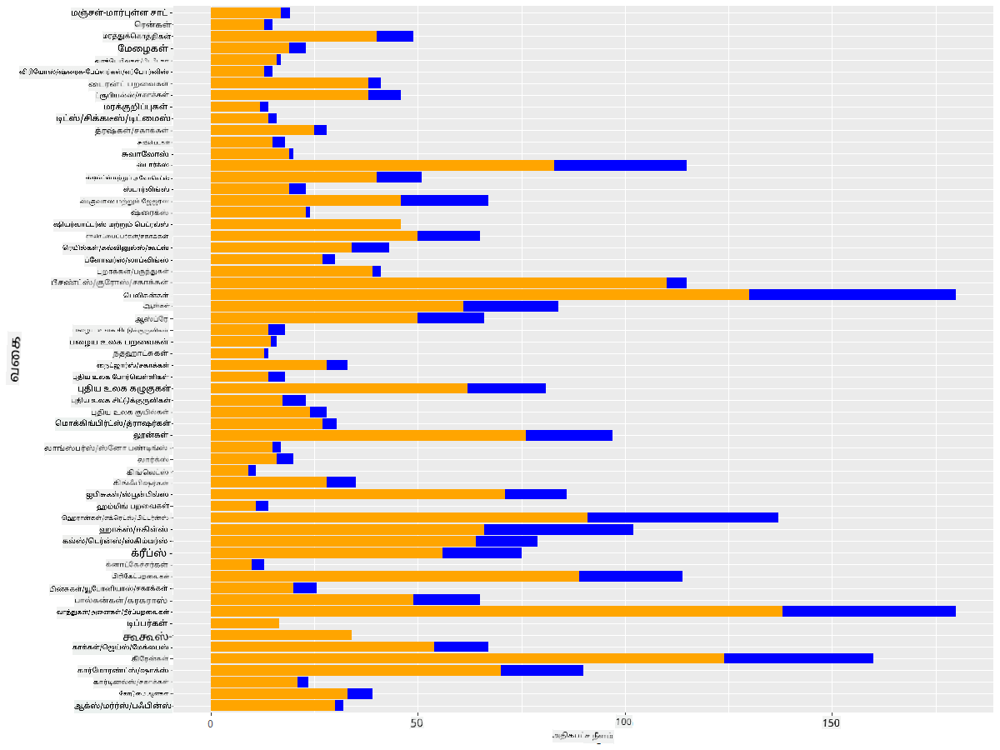

<!--
CO_OP_TRANSLATOR_METADATA:
{
  "original_hash": "22acf28f518a4769ea14fa42f4734b9f",
  "translation_date": "2025-10-11T16:01:27+00:00",
  "source_file": "3-Data-Visualization/R/09-visualization-quantities/README.md",
  "language_code": "ta"
}
-->
# அளவுகளை காட்சிப்படுத்துதல்
| ](https://github.com/microsoft/Data-Science-For-Beginners/blob/main/sketchnotes/09-Visualizing-Quantities.png)|
|:---:|
| அளவுகளை காட்சிப்படுத்துதல் - _Sketchnote by [@nitya](https://twitter.com/nitya)_ |

இந்த பாடத்தில், அளவின் கருத்தை மையமாகக் கொண்டு, சுவாரஸ்யமான காட்சிகளை உருவாக்குவதற்கான பல R பைப்ரரிகள் மற்றும் தொகுப்புகளைப் பயன்படுத்துவது எப்படி என்பதை நீங்கள் ஆராய்வீர்கள். மினசோட்டாவின் பறவைகள் பற்றிய சுத்தமான தரவுத்தொகுப்பைப் பயன்படுத்தி, உள்ளூர் வனவிலங்குகள் பற்றிய பல சுவாரஸ்யமான தகவல்களை நீங்கள் கற்றுக்கொள்ளலாம்.  
## [பாடத்திற்கு முன் வினாடி வினா](https://purple-hill-04aebfb03.1.azurestaticapps.net/quiz/16)

## ggplot2 மூலம் இறகுகளின் அகலத்தை கவனிக்கவும்
பல வகையான எளிய மற்றும் சிக்கலான வரைபடங்களை உருவாக்க ஒரு சிறந்த நூலகம் [ggplot2](https://cran.r-project.org/web/packages/ggplot2/index.html) ஆகும். பொதுவாக, இந்த நூலகங்களைப் பயன்படுத்தி தரவுகளை வரைபடமாக்கும் செயல்முறை உங்கள் தரவுத்தொகுப்பில் நீங்கள் இலக்காகக் கொண்ட பகுதிகளை அடையாளம் காணுதல், தேவையான மாற்றங்களைச் செய்யுதல், அதன் x மற்றும் y அச்சு மதிப்புகளை ஒதுக்குதல், எந்த வகையான வரைபடத்தை காட்ட வேண்டும் என்பதை முடிவு செய்தல், பின்னர் வரைபடத்தை காட்டுதல் ஆகியவற்றை உள்ளடக்கியது.

`ggplot2` என்பது The Grammar of Graphics அடிப்படையில் காட்சிகளை உருவாக்குவதற்கான ஒரு முறை. [Grammar of Graphics](https://en.wikipedia.org/wiki/Ggplot2) என்பது தரவுக் காட்சிப்படுத்தலுக்கான ஒரு பொதுவான திட்டமாகும், இது அளவுகள் மற்றும் அடுக்குகள் போன்ற அர்த்தமான கூறுகளாக வரைபடங்களை பிரிக்கிறது. மற்றொரு வார்த்தையில், குறைந்த அளவு குறியீட்டுடன் ஒரே மாறி அல்லது பல மாறி தரவுகளுக்கான வரைபடங்களை உருவாக்கும் எளிமை `ggplot2` ஐ R இல் காட்சிப்படுத்தலுக்கான மிகவும் பிரபலமான தொகுப்பாக மாற்றுகிறது. பயனர் `ggplot2` ஐ எவ்வாறு மாறிகளை அழகிய வடிவமைப்புகளுக்கு வரைபடமாக்குவது, எந்த காட்சிப்படுத்தல் முறைகளைப் பயன்படுத்துவது என்பதைச் சொல்கிறார், `ggplot2` மீதமுள்ளவற்றை கவனிக்கிறது.

> ✅ Plot = Data + Aesthetics + Geometry  
> - Data என்பது தரவுத்தொகுப்பை குறிக்கிறது  
> - Aesthetics என்பது ஆய்வு செய்ய வேண்டிய மாறிகளை (x மற்றும் y மாறிகள்) குறிக்கிறது  
> - Geometry என்பது வரைபடத்தின் வகையை (line plot, bar plot, etc.) குறிக்கிறது  

உங்கள் தரவின் அடிப்படையில் மற்றும் நீங்கள் கூற விரும்பும் கதையின் அடிப்படையில் சிறந்த Geometry (வரைபட வகை) ஐத் தேர்ந்தெடுக்கவும்.

> - போக்குகளை பகுப்பாய்வு செய்ய: line, column  
> - மதிப்புகளை ஒப்பிட: bar, column, pie, scatterplot  
> - பாகங்கள் முழுமையுடன் தொடர்புடையவை என்பதை காட்ட: pie  
> - தரவின் பகிர்வை காட்ட: scatterplot, bar  
> - மதிப்புகளுக்கிடையேயான உறவுகளை காட்ட: line, scatterplot, bubble  

✅ ggplot2 க்கான இந்த விளக்கமான [cheatsheet](https://nyu-cdsc.github.io/learningr/assets/data-visualization-2.1.pdf) ஐப் பார்வையிடவும்.

## பறவைகளின் இறகுகளின் அதிகபட்ச அகலத்தைப் பற்றிய line plot உருவாக்கவும்

R console ஐ திறந்து தரவுத்தொகுப்பை இறக்குமதி செய்யவும்.  
> குறிப்பு: தரவுத்தொகுப்பு இந்த repo இன் root இல் `/data` கோப்பகத்தில் சேமிக்கப்பட்டுள்ளது.

தரவுத்தொகுப்பை இறக்குமதி செய்து, தரவின் தலைப்பைப் (மேலே உள்ள 5 வரிசைகள்) கவனிக்கவும்.

```r
birds <- read.csv("../../data/birds.csv",fileEncoding="UTF-8-BOM")
head(birds)
```
தரவின் தலைப்பில் உரை மற்றும் எண்களின் கலவை உள்ளது:

|      | Name                         | ScientificName         | Category              | Order        | Family   | Genus       | ConservationStatus | MinLength | MaxLength | MinBodyMass | MaxBodyMass | MinWingspan | MaxWingspan |
| ---: | :--------------------------- | :--------------------- | :-------------------- | :----------- | :------- | :---------- | :----------------- | --------: | --------: | ----------: | ----------: | ----------: | ----------: |
|    0 | Black-bellied whistling-duck | Dendrocygna autumnalis | Ducks/Geese/Waterfowl | Anseriformes | Anatidae | Dendrocygna | LC                 |        47 |        56 |         652 |        1020 |          76 |          94 |
|    1 | Fulvous whistling-duck       | Dendrocygna bicolor    | Ducks/Geese/Waterfowl | Anseriformes | Anatidae | Dendrocygna | LC                 |        45 |        53 |         712 |        1050 |          85 |          93 |
|    2 | Snow goose                   | Anser caerulescens     | Ducks/Geese/Waterfowl | Anseriformes | Anatidae | Anser       | LC                 |        64 |        79 |        2050 |        4050 |         135 |         165 |
|    3 | Ross's goose                 | Anser rossii           | Ducks/Geese/Waterfowl | Anseriformes | Anatidae | Anser       | LC                 |      57.3 |        64 |        1066 |        1567 |         113 |         116 |
|    4 | Greater white-fronted goose  | Anser albifrons        | Ducks/Geese/Waterfowl | Anseriformes | Anatidae | Anser       | LC                 |        64 |        81 |        1930 |        3310 |         130 |         165 |

இவ்வழக்கமான பறவைகளுக்கான அதிகபட்ச இறகுகளின் அகலத்தைப் பார்வையிட நீங்கள் விரும்பினால், சில எண் தரவுகளை அடிப்படையான line plot மூலம் வரைபடமாக்குவோம்.

```r
install.packages("ggplot2")
library("ggplot2")
ggplot(data=birds, aes(x=Name, y=MaxWingspan,group=1)) +
  geom_line() 
```
இங்கே, நீங்கள் `ggplot2` தொகுப்பை நிறுவி, `library("ggplot2")` கட்டளையைப் பயன்படுத்தி அதை workspace இல் இறக்குமதி செய்கிறீர்கள். ggplot இல் எந்தவொரு வரைபடத்தையும் வரைபடமாக்க `ggplot()` செயல்பாடு பயன்படுத்தப்படுகிறது, மேலும் நீங்கள் dataset, x மற்றும் y மாறிகளை பண்புகளாக குறிப்பிடுகிறீர்கள். இந்தக் கட்டத்தில், நாம் line plot ஐ வரைபடமாக்க `geom_line()` செயல்பாட்டைப் பயன்படுத்துகிறோம்.



உடனடியாக நீங்கள் என்ன கவனிக்கிறீர்கள்? குறைந்தது ஒரு outlier இருப்பது போல தெரிகிறது - அது ஒரு பெரிய இறகுகளின் அகலமாக இருக்கிறது! 2000+ சென்டிமீட்டர் அகலம் என்பது 20 மீட்டருக்கு மேல் சமமாகும் - மினசோட்டாவில் ப்டெரோடாக்டில்கள் சுற்றி வருகிறதா? ஆராய்வோம்.

Excel இல் ஒரு விரைவான வரிசைப்படுத்தலைச் செய்யலாம், ஆனால், நீங்கள் visualization செயல்முறையை plot இல் இருந்து தொடரலாம்.

x-axis இல் எந்த வகையான பறவைகள் உள்ளன என்பதை காட்ட labels ஐச் சேர்க்கவும்:

```r
ggplot(data=birds, aes(x=Name, y=MaxWingspan,group=1)) +
  geom_line() +
  theme(axis.text.x = element_text(angle = 45, hjust=1))+
  xlab("Birds") +
  ylab("Wingspan (CM)") +
  ggtitle("Max Wingspan in Centimeters")
```
நாம் `theme` இல் கோணத்தை குறிப்பிடுகிறோம் மற்றும் `xlab()` மற்றும் `ylab()` இல் x மற்றும் y அச்சு labels ஐ குறிப்பிடுகிறோம். `ggtitle()` வரைபடத்திற்கு ஒரு பெயரை வழங்குகிறது.



labels ஐ 45 degree கோணத்தில் சுழற்றியிருந்தாலும், அவற்றை படிக்க மிகவும் அதிகமாக உள்ளது. வேறொரு உத்தியை முயற்சிப்போம்: outliers ஐ மட்டும் label செய்யவும் மற்றும் labels ஐ chart இல் அமைக்கவும். நீங்கள் labeling க்கு இடம் செய்ய scatter chart ஐ பயன்படுத்தலாம்:

```r
ggplot(data=birds, aes(x=Name, y=MaxWingspan,group=1)) +
  geom_point() +
  geom_text(aes(label=ifelse(MaxWingspan>500,as.character(Name),'')),hjust=0,vjust=0) + 
  theme(axis.title.x=element_blank(), axis.text.x=element_blank(), axis.ticks.x=element_blank())
  ylab("Wingspan (CM)") +
  ggtitle("Max Wingspan in Centimeters") + 
```
இங்கே என்ன நடக்கிறது? நீங்கள் scatter points ஐ plot செய்ய `geom_point()` செயல்பாட்டைப் பயன்படுத்துகிறீர்கள். இதன் மூலம், `MaxWingspan > 500` கொண்ட பறவைகளுக்கான labels ஐச் சேர்த்தீர்கள் மற்றும் plot ஐ declutter செய்ய x axis labels ஐ மறைத்தீர்கள்.

நீங்கள் என்ன கண்டுபிடிக்கிறீர்கள்?



## உங்கள் தரவுகளை வடிகட்டவும்

Bald Eagle மற்றும் Prairie Falcon, மிகப்பெரிய பறவைகள் என்று தோன்றினாலும், அவற்றின் அதிகபட்ச இறகுகளின் அகலத்தில் கூடுதல் 0 சேர்க்கப்பட்டுள்ளது. 25 மீட்டர் அகலத்துடன் ஒரு Bald Eagle ஐ நீங்கள் சந்திக்க வாய்ப்பு இல்லை, ஆனால், இருந்தால், தயவுசெய்து எங்களுக்கு தெரியப்படுத்துங்கள்! இந்த இரண்டு outliers இல்லாமல் ஒரு புதிய dataframe ஐ உருவாக்குவோம்:

```r
birds_filtered <- subset(birds, MaxWingspan < 500)

ggplot(data=birds_filtered, aes(x=Name, y=MaxWingspan,group=1)) +
  geom_point() +
  ylab("Wingspan (CM)") +
  xlab("Birds") +
  ggtitle("Max Wingspan in Centimeters") + 
  geom_text(aes(label=ifelse(MaxWingspan>500,as.character(Name),'')),hjust=0,vjust=0) +
  theme(axis.text.x=element_blank(), axis.ticks.x=element_blank())
```
நாம் ஒரு புதிய dataframe `birds_filtered` ஐ உருவாக்கி, பின்னர் scatter plot ஐ வரைபடமாக்கினோம். outliers ஐ வடிகட்டுவதன் மூலம், உங்கள் தரவுகள் இப்போது cohesive மற்றும் புரிந்துகொள்ளக்கூடியதாக உள்ளது.



இப்போது, குறைந்தது wingspan அடிப்படையில் சுத்தமான dataset உள்ளது, இந்த பறவைகள் பற்றிய மேலும் பல விஷயங்களை கண்டறிவோம்.

line மற்றும் scatter plots தரவின் மதிப்புகள் மற்றும் அவற்றின் பகிர்வைப் பற்றிய தகவல்களை காட்ட முடியும், ஆனால், இந்த dataset இல் உள்ள மதிப்புகளைப் பற்றி சிந்திக்க வேண்டும். நீங்கள் அளவின் அடிப்படையில் பின்வரும் கேள்விகளுக்கு பதிலளிக்க visualizations உருவாக்கலாம்:

> பறவைகளின் வகைகள் எத்தனை, அவற்றின் எண்ணிக்கை என்ன?  
> எத்தனை பறவைகள் அழிந்துவிட்டன, ஆபத்தானவை, அரிதானவை அல்லது பொதுவானவை?  
> Linnaeus இன் terminology இல் பல்வேறு genus மற்றும் orders எத்தனை உள்ளன?  
## Bar charts ஐ ஆராயுங்கள்

Bar charts தரவின் குழுக்களை காட்ட தேவையான போது பயனுள்ளதாக இருக்கும். இந்த dataset இல் உள்ள பறவைகளின் வகைகளை ஆராய்ந்து, எது அதிகமாக உள்ளது என்பதைப் பார்ப்போம்.  
Filtered data இல் bar chart ஐ உருவாக்குவோம்.

```r
install.packages("dplyr")
install.packages("tidyverse")

library(lubridate)
library(scales)
library(dplyr)
library(ggplot2)
library(tidyverse)

birds_filtered %>% group_by(Category) %>%
  summarise(n=n(),
  MinLength = mean(MinLength),
  MaxLength = mean(MaxLength),
  MinBodyMass = mean(MinBodyMass),
  MaxBodyMass = mean(MaxBodyMass),
  MinWingspan=mean(MinWingspan),
  MaxWingspan=mean(MaxWingspan)) %>% 
  gather("key", "value", - c(Category, n)) %>%
  ggplot(aes(x = Category, y = value, group = key, fill = key)) +
  geom_bar(stat = "identity") +
  scale_fill_manual(values = c("#D62728", "#FF7F0E", "#8C564B","#2CA02C", "#1F77B4", "#9467BD")) +                   
  xlab("Category")+ggtitle("Birds of Minnesota")

```
கீழே உள்ள snippet இல், [dplyr](https://www.rdocumentation.org/packages/dplyr/versions/0.7.8) மற்றும் [lubridate](https://www.rdocumentation.org/packages/lubridate/versions/1.8.0) தொகுப்புகளை நிறுவி, தரவுகளை manipulate மற்றும் group செய்ய உதவுகிறது, பின்னர் stacked bar chart ஐ plot செய்ய உதவுகிறது. முதலில், நீங்கள் பறவையின் `Category` மூலம் தரவுகளை குழுவாக்கி, பின்னர் `MinLength`, `MaxLength`, `MinBodyMass`, `MaxBodyMass`, `MinWingspan`, `MaxWingspan` களங்களை சுருக்குகிறீர்கள். பின்னர், `ggplot2` தொகுப்பைப் பயன்படுத்தி bar chart ஐ plot செய்து, வெவ்வேறு category க்கான நிறங்களை மற்றும் labels ஐ குறிப்பிடுகிறீர்கள்.



இந்த bar chart, எனினும், படிக்க முடியாதது, ஏனெனில் குழுவாக்கப்படாத தரவுகள் மிகவும் அதிகமாக உள்ளன. நீங்கள் plot செய்ய விரும்பும் தரவுகளை மட்டும் தேர்ந்தெடுக்க வேண்டும், எனவே பறவையின் category அடிப்படையில் length ஐப் பார்ப்போம்.

உங்கள் தரவுகளை பறவையின் category ஐ மட்டும் உள்ளடக்க வடிகட்டவும்.

வகைகள் பல உள்ளதால், இந்த chart ஐ vertical ஆகக் காட்டவும் மற்றும் அனைத்து தரவுகளுக்கும் height ஐ சரிசெய்யவும்:

```r
birds_count<-dplyr::count(birds_filtered, Category, sort = TRUE)
birds_count$Category <- factor(birds_count$Category, levels = birds_count$Category)
ggplot(birds_count,aes(Category,n))+geom_bar(stat="identity")+coord_flip()
```
முதலில், `Category` column இல் unique values ஐ count செய்து, பின்னர் அவற்றை ஒரு புதிய dataframe `birds_count` இல் sort செய்கிறீர்கள். இந்த sort செய்யப்பட்ட தரவுகள் அதே அளவில் factor செய்யப்படுகிறது, எனவே அது sort செய்யப்பட்ட முறையில் plot செய்யப்படுகிறது. `ggplot2` ஐப் பயன்படுத்தி, பின்னர் bar chart இல் தரவுகளை plot செய்கிறீர்கள். `coord_flip()` horizontal bars ஐ plot செய்கிறது.



இந்த bar chart, ஒவ்வொரு category இல் உள்ள பறவைகளின் எண்ணிக்கையை ஒரு நல்ல பார்வையை வழங்குகிறது. ஒரு கணத்தில், இந்த பகுதியில் உள்ள மிகப்பெரிய பறவைகள் Ducks/Geese/Waterfowl category இல் உள்ளன என்பதை நீங்கள் காணலாம். மினசோட்டா '10,000 ஏரிகளின் நிலம்' என்பதால் இது ஆச்சரியமாக இல்லை!

✅ இந்த dataset இல் மற்ற count களை முயற்சிக்கவும். உங்களுக்கு ஏதேனும் ஆச்சரியமாக இருக்கிறதா?

## தரவுகளை ஒப்பிடுதல்

குழுவாக்கப்பட்ட தரவுகளின் பல்வேறு ஒப்பீடுகளை முயற்சிக்க, புதிய axes ஐ உருவாக்கலாம். பறவையின் category அடிப்படையில் MaxLength ஐ ஒப்பிட முயற்சிக்கவும்:

```r
birds_grouped <- birds_filtered %>%
  group_by(Category) %>%
  summarise(
  MaxLength = max(MaxLength, na.rm = T),
  MinLength = max(MinLength, na.rm = T)
           ) %>%
  arrange(Category)
  
ggplot(birds_grouped,aes(Category,MaxLength))+geom_bar(stat="identity")+coord_flip()
```
நாம் `birds_filtered` தரவுகளை `Category` மூலம் குழுவாக்கி, பின்னர் bar graph ஐ plot செய்கிறோம்.



இங்கே எந்த ஆச்சரியமும் இல்லை: hummingbirds க்கு Pelicans அல்லது Geese க்கு ஒப்பிட MaxLength மிகவும் குறைவாக உள்ளது. தரவு தர்க்கரீதியாக பொருந்தும் போது நல்லது!

Bar charts இன் visualizations ஐ superimpose செய்து மேலும் சுவாரஸ்யமாக உருவாக்கலாம். ஒரு குறிப்பிட்ட பறவையின் category இல் Minimum மற்றும் Maximum Length ஐ superimpose செய்யலாம்:

```r
ggplot(data=birds_grouped, aes(x=Category)) +
  geom_bar(aes(y=MaxLength), stat="identity", position ="identity",  fill='blue') +
  geom_bar(aes(y=MinLength), stat="identity", position="identity", fill='orange')+
  coord_flip()
```


## 🚀 சவால்

இந்த பறவைகள் dataset ஒரு குறிப்பிட்ட ecosystem இல் உள்ள பல்வேறு வகையான பறவைகள் பற்றிய தகவல்களை வழங்குகிறது. இணையத்தில் தேடுங்கள் மற்றும் பிற பறவைகள் சார்ந்த dataset களை கண்டுபிடிக்க முயற்சிக்கவும். இந்த பறவைகள் பற்றிய charts மற்றும் graphs ஐ உருவாக்கி, நீங்கள் அறியாத உண்மைகளை கண்டறிய முயற்சிக்கவும்.  
## [பாடத்திற்கு பின் வினாடி வினா](https://purple-hill-04aebfb03.1.azurestaticapps.net/quiz/17)

## மதிப்பீடு மற்றும் சுயபடிப்பு

இந்த முதல் பாடம் `ggplot2` ஐப் பயன்படுத்தி அளவுகளை காட்சிப்படுத்துவது எப்படி என்பதை உங்களுக்கு சில தகவல்களை வழங்கியுள்ளது. காட்சிப்படுத்தலுக்கான dataset களை வேலை செய்ய மற்ற வழிகளைப் பற்றி ஆராயுங்கள். [Lattice](https://stat.ethz.ch/R-manual/R-devel/library/lattice/html/Lattice.html) மற்றும் [Plotly](https://github.com/plotly/plotly.R#readme) போன்ற தொகுப்புகளைப் பயன்படுத்தி காட்சிப்படுத்த dataset களை ஆராய்ந்து பாருங்கள்.

## பணிக்கட்டளை
[Lines, Scatters, and Bars](assignment.md)

---

**அறிவிப்பு**:  
இந்த ஆவணம் [Co-op Translator](https://github.com/Azure/co-op-translator) என்ற AI மொழிபெயர்ப்பு சேவையை பயன்படுத்தி மொழிபெயர்க்கப்பட்டுள்ளது. நாங்கள் துல்லியத்திற்காக முயற்சிக்கிறோம், ஆனால் தானியங்கி மொழிபெயர்ப்புகளில் பிழைகள் அல்லது தவறுகள் இருக்கக்கூடும் என்பதை தயவுசெய்து கவனத்தில் கொள்ளவும். அதன் சொந்த மொழியில் உள்ள மூல ஆவணம் அதிகாரப்பூர்வ ஆதாரமாக கருதப்பட வேண்டும். முக்கியமான தகவல்களுக்கு, தொழில்முறை மனித மொழிபெயர்ப்பு பரிந்துரைக்கப்படுகிறது. இந்த மொழிபெயர்ப்பைப் பயன்படுத்துவதால் ஏற்படும் எந்த தவறான புரிதல்களுக்கும் அல்லது தவறான விளக்கங்களுக்கும் நாங்கள் பொறுப்பல்ல.