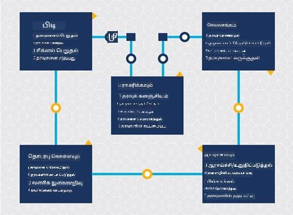
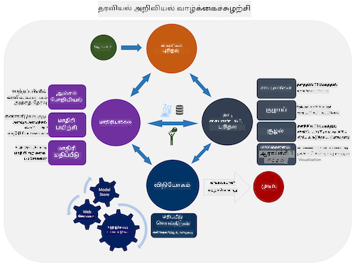
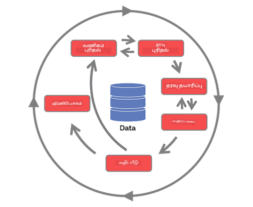

<!--
CO_OP_TRANSLATOR_METADATA:
{
  "original_hash": "07e12a25d20b8f191e3cb651c27fdb2b",
  "translation_date": "2025-10-11T15:47:35+00:00",
  "source_file": "4-Data-Science-Lifecycle/14-Introduction/README.md",
  "language_code": "ta"
}
-->
# தரவியல் அறிவியல் வாழ்க்கைச் சுழற்சியின் அறிமுகம்

| ](../../sketchnotes/14-DataScience-Lifecycle.png)|
|:---:|
| தரவியல் அறிவியல் வாழ்க்கைச் சுழற்சியின் அறிமுகம் - _Sketchnote by [@nitya](https://twitter.com/nitya)_ |

## [முன்-வகுப்பு வினாடி வினா](https://ff-quizzes.netlify.app/en/ds/quiz/26)

இந்த நேரத்தில், தரவியல் அறிவியல் என்பது ஒரு செயல்முறை என்பதை நீங்கள் உணர்ந்திருப்பீர்கள். இந்த செயல்முறையை 5 நிலைகளாக பிரிக்கலாம்:

- தரவுகளைப் பெறுதல்
- செயலாக்கம்
- பகுப்பாய்வு
- தொடர்பு
- பராமரிப்பு

இந்த பாடம் வாழ்க்கைச் சுழற்சியின் 3 பகுதிகளை மையமாகக் கொண்டுள்ளது: தரவுகளைப் பெறுதல், செயலாக்கம் மற்றும் பராமரிப்பு.

> [Berkeley School of Information](https://ischoolonline.berkeley.edu/data-science/what-is-data-science/) எடுத்த படம்

## தரவுகளைப் பெறுதல்

வாழ்க்கைச் சுழற்சியின் முதல் நிலை மிகவும் முக்கியமானது, ஏனெனில் அடுத்த நிலைகள் இதற்கு சார்ந்தவை. இது இரண்டு நிலைகளை ஒன்றாக இணைத்தது போலவே உள்ளது: தரவுகளைப் பெறுதல் மற்றும் தீர்க்க வேண்டிய நோக்கங்கள் மற்றும் பிரச்சினைகளை வரையறுத்தல்.  
திட்டத்தின் நோக்கங்களை வரையறுப்பது பிரச்சினை அல்லது கேள்வியின் ஆழமான சூழலை தேவைப்படும். முதலில், பிரச்சினையைத் தீர்க்கத் தேவையானவர்களை அடையாளம் காண வேண்டும் மற்றும் அவர்களிடம் தரவுகளைப் பெற வேண்டும். இவர்கள் ஒரு நிறுவனத்தின் பங்குதாரர்கள் அல்லது திட்டத்தின் ஆதரவாளர்கள் ஆகியோர் இருக்கலாம், அவர்கள் இந்த திட்டத்தால் யார் அல்லது என்ன பயன் பெறுவார்கள் என்பதை அடையாளம் காண உதவுவார்கள், மேலும் ஏன் அவர்கள் இதைத் தேவைப்படுகிறார்கள் என்பதையும் விளக்குவார்கள். நன்றாக வரையறுக்கப்பட்ட ஒரு நோக்கம் அளவிடக்கூடியதாகவும் கணக்கிடக்கூடியதாகவும் இருக்க வேண்டும், ஏற்கத்தக்க முடிவை வரையறுக்க.

தரவியல் அறிவியலாளர்கள் கேட்கக்கூடிய கேள்விகள்:
-	இந்த பிரச்சினை முன்பு அணுகப்பட்டதா? என்ன கண்டறியப்பட்டது?
-	நோக்கம் மற்றும் இலக்கு அனைவராலும் புரிந்துகொள்ளப்பட்டதா?
-	தெளிவின்மை உள்ளதா, அதை எவ்வாறு குறைக்கலாம்?
-	எந்த கட்டுப்பாடுகள் உள்ளன?
-	இறுதியில் முடிவு எப்படி இருக்கும்?
-	எவ்வளவு வளங்கள் (நேரம், மனிதர்கள், கணினி) கிடைக்கின்றன?

அடுத்தது, இந்த வரையறுக்கப்பட்ட இலக்குகளை அடைய தேவையான தரவுகளை அடையாளம் காணுதல், சேகரித்தல், பின்னர் ஆராய்வது. இந்தப் பெறும் படியில், தரவியல் அறிவியலாளர்கள் தரவின் அளவு மற்றும் தரத்தை மதிப்பீடு செய்ய வேண்டும். இது பெறப்பட்டது விரும்பிய முடிவை அடைய உதவுமா என்பதை உறுதிப்படுத்த சில தரவுகளை ஆராய்வதைத் தேவைப்படும்.  

தரவியல் அறிவியலாளர்கள் தரவைப் பற்றி கேட்கக்கூடிய கேள்விகள்:
-	என்ன தரவுகள் ஏற்கனவே எனக்கு கிடைக்கின்றன?
-	இந்த தரவின் உரிமையாளர் யார்?
-	தனியுரிமை தொடர்பான கவலைகள் என்ன?
-	இந்த பிரச்சினையைத் தீர்க்க எனக்கு போதுமானது உள்ளதா?
-	இந்த பிரச்சினைக்கு தரவின் தரம் ஏற்கத்தக்கதா?
-	இந்த தரவின் மூலம் கூடுதல் தகவலைக் கண்டறிந்தால், நாம் இலக்குகளை மாற்ற அல்லது மறுபரிசீலனை செய்ய வேண்டுமா?

## செயலாக்கம்

வாழ்க்கைச் சுழற்சியின் செயலாக்க நிலை தரவுகளில் முறைமைகளை கண்டறிதல் மற்றும் மாதிரிகளை உருவாக்குவதில் மையமாக உள்ளது. செயலாக்க நிலையில் பயன்படுத்தப்படும் சில தொழில்நுட்பங்கள் முறைமைகளை கண்டறிய புள்ளியியல் முறைகளை தேவைப்படும். பொதுவாக, இது ஒரு பெரிய தரவுத்தொகுப்புடன் மனிதனால் செய்ய மிகவும் சிரமமான பணியாக இருக்கும், மேலும் செயல்முறையை வேகமாக செய்ய கணினிகளின் உதவியை நம்பும். இந்த நிலை தரவியல் அறிவியல் மற்றும் இயந்திரக் கற்றல் இணையும் இடமாகும். முதல் பாடத்தில் நீங்கள் கற்றது போல, இயந்திரக் கற்றல் என்பது தரவுகளைப் புரிந்துகொள்ள மாதிரிகளை உருவாக்கும் செயல்முறையாகும். மாதிரிகள் என்பது தரவிலுள்ள மாறிலிகளுக்கிடையிலான உறவின் பிரதிநிதியாகும், இது முடிவுகளை முன்னறிவிக்க உதவுகிறது.

இந்த நிலையில் பொதுவாக பயன்படுத்தப்படும் தொழில்நுட்பங்கள் ML for Beginners பாடத்திட்டத்தில் உள்ளன. அவற்றைப் பற்றி மேலும் அறிய இணைப்புகளைப் பின்பற்றவும்:

- [வகைப்படுத்தல்](https://github.com/microsoft/ML-For-Beginners/tree/main/4-Classification): தரவுகளை வகைகளாக ஒழுங்குபடுத்துதல்.
- [குழுவாக்கம்](https://github.com/microsoft/ML-For-Beginners/tree/main/5-Clustering): தரவுகளை ஒரே மாதிரியான குழுக்களாக பிரித்தல்.
- [மீள்பரிசீலனை](https://github.com/microsoft/ML-For-Beginners/tree/main/2-Regression): மாறிலிகளுக்கிடையிலான உறவுகளைத் தீர்மானித்து மதிப்புகளை முன்னறிவிக்க அல்லது கணிக்க.

## பராமரிப்பு
வாழ்க்கைச் சுழற்சியின் வரைபடத்தில், பராமரிப்பு தரவுகளைப் பெறுதல் மற்றும் செயலாக்கத்திற்கிடையே இருப்பதை நீங்கள் கவனித்திருக்கலாம். பராமரிப்பு என்பது திட்டத்தின் முழு செயல்முறையின் போது தரவுகளை நிர்வகித்தல், சேமித்தல் மற்றும் பாதுகாப்பது போன்ற தொடர்ச்சியான செயல்முறையாகும், மேலும் திட்டத்தின் முழு காலத்திலும் இதை கருத்தில் கொள்ள வேண்டும்.

### தரவுகளை சேமித்தல்
தரவுகளை எங்கு மற்றும் எப்படி சேமிக்க வேண்டும் என்பதற்கான கருத்துக்கள் அதன் சேமிப்பு செலவையும், தரவுகளை எவ்வளவு வேகமாக அணுக முடியும் என்பதையும் பாதிக்கலாம். இவ்வகையான முடிவுகள் தரவியல் அறிவியலாளரால் மட்டுமே எடுக்கப்படாது, ஆனால் தரவுகள் எவ்வாறு சேமிக்கப்படுகின்றன என்பதின் அடிப்படையில் அவர்கள் அதை எவ்வாறு வேலை செய்ய வேண்டும் என்பதற்கான தேர்வுகளைச் செய்ய நேரிடலாம்.

இன்றைய தரவுகளை சேமிக்கும் முறைகள் சிலவற்றின் அம்சங்கள் இவை:

**உள்ளக vs வெளிநகல் vs பொதுவான அல்லது தனிப்பட்ட மேகம்**

உள்ளக refers to hosting managing the data on your own equipment, like owning a server with hard drives that store the data, while off premise relies on equipment that you don’t own, such as a data center. The public cloud is a popular choice for storing data that requires no knowledge of how or where exactly the data is stored, where public refers to a unified underlying infrastructure that is shared by all who use the cloud. Some organizations have strict security policies that require that they have complete access to the equipment where the data is hosted and will rely on a private cloud that provides its own cloud services. You’ll learn more about data in the cloud in [later lessons](https://github.com/microsoft/Data-Science-For-Beginners/tree/main/5-Data-Science-In-Cloud).

**குளிர் vs சூடான தரவுகள்**

When training your models, you may require more training data. If you’re content with your model, more data will arrive for a model to serve its purpose. In any case the cost of storing and accessing data will increase as you accumulate more of it. Separating rarely used data, known as cold data from frequently accessed hot data can be a cheaper data storage option through hardware or software services. If cold data needs to be accessed, it may take a little longer to retrieve in comparison to hot data.

### தரவுகளை நிர்வகித்தல்
As you work with data you may discover that some of the data needs to be cleaned using some of the techniques covered in the lesson focused on [data preparation](https://github.com/microsoft/Data-Science-For-Beginners/tree/main/2-Working-With-Data/08-data-preparation) to build accurate models.  When new data arrives, it will need some of the same applications to maintain consistency in quality. Some projects will involve use of an automated tool for cleansing, aggregation, and compression before the data is moved to its final location. Azure Data Factory is an example of one of these tools.

### தரவுகளை பாதுகாப்பது
One of the main goals of securing data is ensuring that those working it are in control of what is collected and in what context it is being used. Keeping data secure involves limiting access to only those who need it, adhering to local laws and regulations, as well as maintaining ethical standards, as covered in the [ethics lesson](https://github.com/microsoft/Data-Science-For-Beginners/tree/main/1-Introduction/02-ethics). 

Here’s some things that a team may do with security in mind:
- Confirm that all data is encrypted
- Provide customers information on how their data is used
- Remove data access from those who have left the project 
- Let only certain project members alter the data

## 🚀 சவால்

தரவியல் அறிவியல் வாழ்க்கைச் சுழற்சியின் பல பதிப்புகள் உள்ளன, ஒவ்வொரு படியும் வெவ்வேறு பெயர்களையும், நிலைகளின் எண்ணிக்கையையும் கொண்டிருக்கலாம், ஆனால் இந்த பாடத்தில் குறிப்பிடப்பட்ட செயல்முறைகளை கொண்டிருக்கும்.

[Team Data Science Process lifecycle](https://docs.microsoft.com/en-us/azure/architecture/data-science-process/lifecycle) மற்றும் [Cross-industry standard process for data mining](https://www.datascience-pm.com/crisp-dm-2/) ஆகியவற்றை ஆராயுங்கள். இரண்டு முறைகளின் 3 ஒற்றுமைகள் மற்றும் வேறுபாடுகளை குறிப்பிடுங்கள்.

|Team Data Science Process (TDSP)|Cross-industry standard process for data mining (CRISP-DM)|
|--|--|
| |  |
| Image by [Microsoft](https://docs.microsoft.comazure/architecture/data-science-process/lifecycle) | Image by [Data Science Process Alliance](https://www.datascience-pm.com/crisp-dm-2/) |

## [பாடத்திற்குப் பின் வினாடி வினா](https://ff-quizzes.netlify.app/en/ds/quiz/27)

## மதிப்பீடு & சுயபடிப்பு

தரவியல் அறிவியல் வாழ்க்கைச் சுழற்சியைப் பயன்படுத்துவது பல வேடங்கள் மற்றும் பணிகளை உள்ளடக்கியது, இதில் சிலர் ஒவ்வொரு நிலையின் குறிப்பிட்ட பகுதிகளில் கவனம் செலுத்தலாம். Team Data Science Process சில வளங்களை வழங்குகிறது, இது திட்டத்தில் ஒருவருக்கு என்ன வகையான வேடங்கள் மற்றும் பணிகள் இருக்கலாம் என்பதை விளக்குகிறது.

* [Team Data Science Process roles and tasks](https://docs.microsoft.com/en-us/azure/architecture/data-science-process/roles-tasks)
* [Execute data science tasks: exploration, modeling, and deployment](https://docs.microsoft.com/en-us/azure/architecture/data-science-process/execute-data-science-tasks)

## பணிக்கட்டளை

[தரவுத்தொகுப்பை மதிப்பீடு செய்தல்](assignment.md)

---

**குறிப்பு**:  
இந்த ஆவணம் [Co-op Translator](https://github.com/Azure/co-op-translator) என்ற AI மொழிபெயர்ப்பு சேவையைப் பயன்படுத்தி மொழிபெயர்க்கப்பட்டுள்ளது. நாங்கள் துல்லியத்திற்காக முயற்சிக்கிறோம், ஆனால் தானியங்கி மொழிபெயர்ப்புகளில் பிழைகள் அல்லது தவறான தகவல்கள் இருக்கக்கூடும் என்பதை தயவுசெய்து கவனத்தில் கொள்ளுங்கள். அதன் தாய்மொழியில் உள்ள மூல ஆவணம் அதிகாரப்பூர்வ ஆதாரமாக கருதப்பட வேண்டும். முக்கியமான தகவல்களுக்கு, தொழில்முறை மனித மொழிபெயர்ப்பு பரிந்துரைக்கப்படுகிறது. இந்த மொழிபெயர்ப்பைப் பயன்படுத்துவதால் ஏற்படும் எந்த தவறான புரிதல்கள் அல்லது தவறான விளக்கங்களுக்கு நாங்கள் பொறுப்பல்ல.