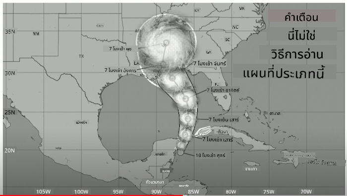
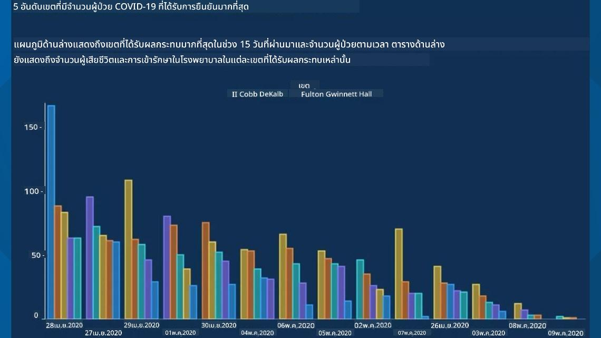
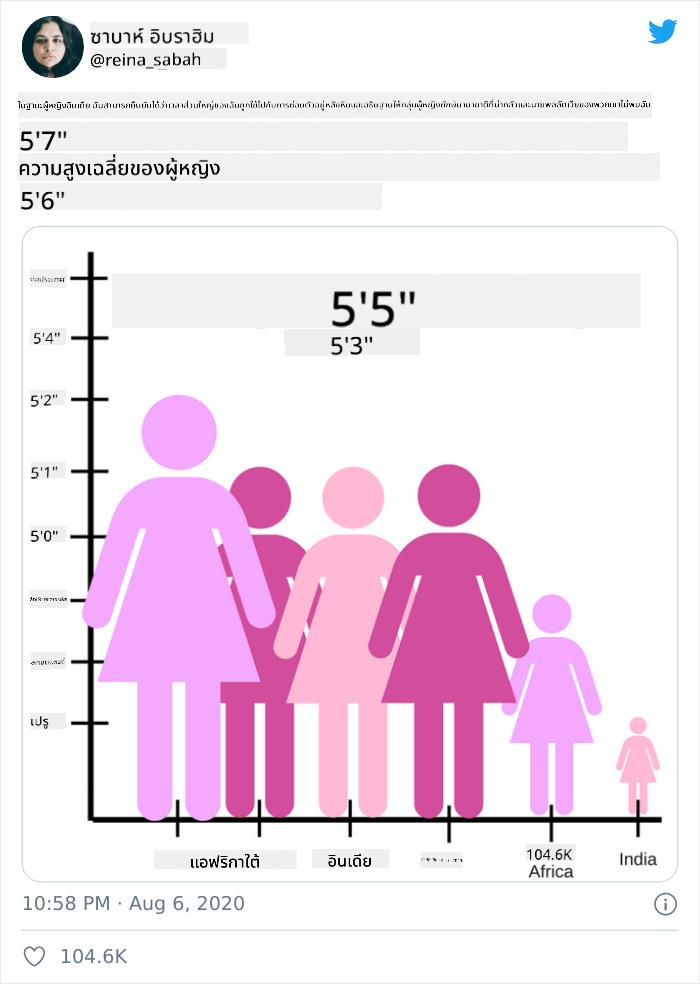
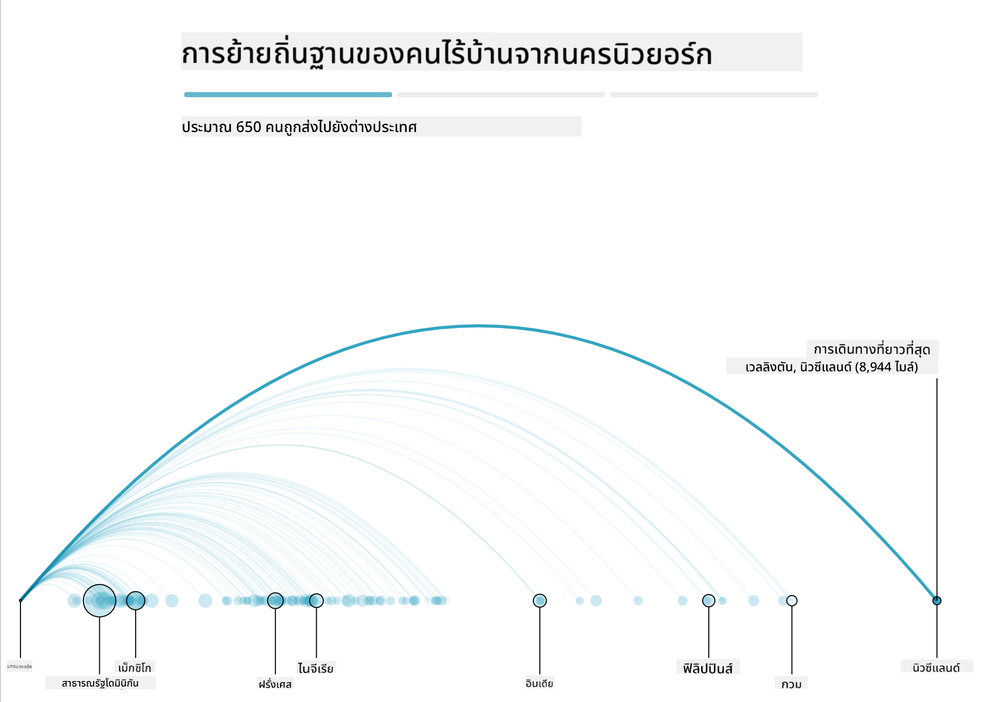

<!--
CO_OP_TRANSLATOR_METADATA:
{
  "original_hash": "0b380bb6d34102bb061eb41de23d9834",
  "translation_date": "2025-09-04T18:51:05+00:00",
  "source_file": "3-Data-Visualization/13-meaningful-visualizations/README.md",
  "language_code": "th"
}
-->
# การสร้างภาพข้อมูลที่มีความหมาย

| ](../../sketchnotes/13-MeaningfulViz.png)|
|:---:|
| การสร้างภาพข้อมูลที่มีความหมาย - _Sketchnote โดย [@nitya](https://twitter.com/nitya)_ |

> "ถ้าคุณทรมานข้อมูลนานพอ มันจะยอมรับทุกอย่างที่คุณต้องการ" -- [Ronald Coase](https://en.wikiquote.org/wiki/Ronald_Coase)

หนึ่งในทักษะพื้นฐานของนักวิทยาศาสตร์ข้อมูลคือความสามารถในการสร้างภาพข้อมูลที่มีความหมาย ซึ่งช่วยตอบคำถามที่คุณอาจมี ก่อนที่จะสร้างภาพข้อมูล คุณต้องมั่นใจว่าข้อมูลนั้นได้รับการทำความสะอาดและเตรียมพร้อมแล้วเหมือนที่คุณทำในบทเรียนก่อนหน้า หลังจากนั้นคุณสามารถเริ่มตัดสินใจว่าจะนำเสนอข้อมูลอย่างไรให้ดีที่สุด

ในบทเรียนนี้ คุณจะได้เรียนรู้:

1. วิธีเลือกประเภทกราฟที่เหมาะสม
2. วิธีหลีกเลี่ยงการสร้างกราฟที่หลอกลวง
3. วิธีการใช้สี
4. วิธีการจัดสไตล์กราฟเพื่อให้อ่านง่าย
5. วิธีสร้างกราฟแบบเคลื่อนไหวหรือแบบ 3 มิติ
6. วิธีสร้างภาพข้อมูลที่สร้างสรรค์

## [แบบทดสอบก่อนเรียน](https://purple-hill-04aebfb03.1.azurestaticapps.net/quiz/24)

## เลือกประเภทกราฟที่เหมาะสม

ในบทเรียนก่อนหน้า คุณได้ทดลองสร้างภาพข้อมูลที่น่าสนใจโดยใช้ Matplotlib และ Seaborn ในการสร้างกราฟ โดยทั่วไป คุณสามารถเลือก [ประเภทกราฟที่เหมาะสม](https://chartio.com/learn/charts/how-to-select-a-data-vizualization/) สำหรับคำถามที่คุณต้องการตอบโดยใช้ตารางนี้:

| สิ่งที่คุณต้องการทำ       | คุณควรใช้:                     |
| -------------------------- | ------------------------------- |
| แสดงแนวโน้มข้อมูลตามเวลา | Line                            |
| เปรียบเทียบหมวดหมู่       | Bar, Pie                        |
| เปรียบเทียบยอดรวม         | Pie, Stacked Bar                |
| แสดงความสัมพันธ์          | Scatter, Line, Facet, Dual Line |
| แสดงการกระจายตัว          | Scatter, Histogram, Box         |
| แสดงสัดส่วน               | Pie, Donut, Waffle              |

> ✅ ขึ้นอยู่กับลักษณะของข้อมูล คุณอาจต้องแปลงข้อมูลจากข้อความเป็นตัวเลขเพื่อให้กราฟรองรับได้

## หลีกเลี่ยงการหลอกลวง

แม้ว่านักวิทยาศาสตร์ข้อมูลจะระมัดระวังในการเลือกกราฟที่เหมาะสมกับข้อมูล แต่ก็ยังมีวิธีมากมายที่ข้อมูลสามารถถูกนำเสนอในลักษณะที่พิสูจน์จุดยืนบางอย่าง โดยมักจะทำให้ข้อมูลเสียหาย มีตัวอย่างมากมายของกราฟและอินโฟกราฟิกที่หลอกลวง!

[](https://www.youtube.com/watch?v=oX74Nge8Wkw "How charts lie")

> 🎥 คลิกที่ภาพด้านบนเพื่อดูการบรรยายเกี่ยวกับกราฟที่หลอกลวง

กราฟนี้กลับด้านแกน X เพื่อแสดงสิ่งที่ตรงกันข้ามกับความจริงตามวันที่:


[กราฟนี้](https://media.firstcoastnews.com/assets/WTLV/images/170ae16f-4643-438f-b689-50d66ca6a8d8/170ae16f-4643-438f-b689-50d66ca6a8d8_1140x641.jpg) หลอกลวงยิ่งกว่า เพราะสายตาจะถูกดึงไปทางขวาเพื่อสรุปว่าเมื่อเวลาผ่านไป จำนวนผู้ติดเชื้อ COVID ในแต่ละเขตลดลง แต่ถ้าคุณดูวันที่อย่างละเอียด คุณจะพบว่ามันถูกจัดเรียงใหม่เพื่อให้ดูเหมือนว่ามีแนวโน้มลดลง



ตัวอย่างที่มีชื่อเสียงนี้ใช้สีและกลับด้านแกน Y เพื่อหลอกลวง: แทนที่จะสรุปว่าการเสียชีวิตจากอาวุธปืนเพิ่มขึ้นหลังจากการผ่านกฎหมายที่สนับสนุนอาวุธปืน สายตากลับถูกหลอกให้คิดว่าตรงกันข้าม:


กราฟแปลก ๆ นี้แสดงให้เห็นว่าสัดส่วนสามารถถูกปรับเปลี่ยนได้อย่างน่าขบขัน:



การเปรียบเทียบสิ่งที่ไม่สามารถเปรียบเทียบได้เป็นอีกหนึ่งกลยุทธ์ที่ไม่ซื่อสัตย์ มี [เว็บไซต์ที่ยอดเยี่ยม](https://tylervigen.com/spurious-correlations) ที่รวบรวม 'ความสัมพันธ์ที่ผิดพลาด' โดยแสดง 'ข้อเท็จจริง' ที่เชื่อมโยงสิ่งต่าง ๆ เช่น อัตราการหย่าร้างในรัฐเมนและการบริโภคมาการีน กลุ่ม Reddit ยังรวบรวม [การใช้ข้อมูลที่น่าเกลียด](https://www.reddit.com/r/dataisugly/top/?t=all) อีกด้วย

สิ่งสำคัญคือต้องเข้าใจว่าสายตาสามารถถูกหลอกได้ง่ายเพียงใดจากกราฟที่หลอกลวง แม้ว่าความตั้งใจของนักวิทยาศาสตร์ข้อมูลจะดี แต่การเลือกประเภทกราฟที่ไม่เหมาะสม เช่น กราฟวงกลมที่แสดงหมวดหมู่มากเกินไป ก็สามารถหลอกลวงได้

## สี

คุณได้เห็นในกราฟ 'ความรุนแรงจากอาวุธปืนในฟลอริดา' ว่าสีสามารถเพิ่มความหมายเพิ่มเติมให้กับกราฟ โดยเฉพาะกราฟที่ไม่ได้ออกแบบโดยใช้ไลบรารี เช่น Matplotlib และ Seaborn ซึ่งมาพร้อมกับไลบรารีสีและพาเลตที่ผ่านการตรวจสอบแล้ว หากคุณกำลังสร้างกราฟด้วยตัวเอง ลองศึกษาทฤษฎีสีเล็กน้อย [ทฤษฎีสี](https://colormatters.com/color-and-design/basic-color-theory)

> ✅ โปรดทราบว่าเมื่อออกแบบกราฟ การเข้าถึงเป็นแง่มุมสำคัญของการสร้างภาพข้อมูล ผู้ใช้บางคนอาจมีปัญหาการมองเห็นสี - กราฟของคุณแสดงผลได้ดีสำหรับผู้ใช้ที่มีความบกพร่องทางสายตาหรือไม่?

ระวังเมื่อเลือกสีสำหรับกราฟของคุณ เพราะสีสามารถสื่อความหมายที่คุณไม่ได้ตั้งใจได้ 'ผู้หญิงสีชมพู' ในกราฟ 'ความสูง' ด้านบนสื่อความหมายที่ 'เป็นผู้หญิง' ซึ่งเพิ่มความแปลกประหลาดให้กับกราฟนั้นเอง

แม้ว่า [ความหมายของสี](https://colormatters.com/color-symbolism/the-meanings-of-colors) อาจแตกต่างกันในแต่ละส่วนของโลก และมีแนวโน้มที่จะเปลี่ยนแปลงตามเฉดสี โดยทั่วไป ความหมายของสีรวมถึง:

| สี      | ความหมาย             |
| ------ | ------------------- |
| แดง    | พลัง                |
| น้ำเงิน | ความไว้วางใจ ความภักดี |
| เหลือง | ความสุข ความระมัดระวัง |
| เขียว  | ระบบนิเวศ โชค ความอิจฉา |
| ม่วง   | ความสุข             |
| ส้ม    | ความสดใส           |

หากคุณได้รับมอบหมายให้สร้างกราฟที่มีสีแบบกำหนดเอง ให้มั่นใจว่ากราฟของคุณทั้งเข้าถึงได้และสีที่คุณเลือกสอดคล้องกับความหมายที่คุณต้องการสื่อ

## การจัดสไตล์กราฟเพื่อให้อ่านง่าย

กราฟจะไม่มีความหมายหากอ่านไม่ออก! ใช้เวลาสักครู่เพื่อพิจารณาการจัดสไตล์ความกว้างและความสูงของกราฟของคุณให้เหมาะสมกับข้อมูล หากตัวแปรหนึ่ง (เช่น ทั้ง 50 รัฐ) จำเป็นต้องแสดง ให้แสดงในแนวตั้งบนแกน Y หากเป็นไปได้ เพื่อหลีกเลี่ยงกราฟที่ต้องเลื่อนในแนวนอน

ใส่ป้ายกำกับแกน ให้คำอธิบายประกอบหากจำเป็น และเสนอคำแนะนำเพิ่มเติมเพื่อให้เข้าใจข้อมูลได้ดีขึ้น

หากข้อมูลของคุณเป็นข้อความและมีความยาวบนแกน X คุณสามารถปรับมุมข้อความเพื่อให้อ่านง่ายขึ้น [Matplotlib](https://matplotlib.org/stable/tutorials/toolkits/mplot3d.html) มีการสร้างกราฟแบบ 3 มิติ หากข้อมูลของคุณรองรับ กราฟข้อมูลที่ซับซ้อนสามารถสร้างได้โดยใช้ `mpl_toolkits.mplot3d`


## การแสดงกราฟแบบเคลื่อนไหวและแบบ 3 มิติ

ภาพข้อมูลที่ดีที่สุดบางส่วนในปัจจุบันเป็นแบบเคลื่อนไหว Shirley Wu มีตัวอย่างที่น่าทึ่งที่สร้างด้วย D3 เช่น '[film flowers](http://bl.ocks.org/sxywu/raw/d612c6c653fb8b4d7ff3d422be164a5d/)' ซึ่งแต่ละดอกไม้เป็นภาพข้อมูลของภาพยนตร์ อีกตัวอย่างหนึ่งสำหรับ Guardian คือ 'bussed out' ซึ่งเป็นประสบการณ์แบบโต้ตอบที่รวมภาพข้อมูลกับ Greensock และ D3 พร้อมบทความแบบเลื่อนเพื่อแสดงวิธีที่ NYC จัดการกับปัญหาคนไร้บ้านโดยการส่งพวกเขาออกจากเมือง



> "Bussed Out: How America Moves its Homeless" จาก [the Guardian](https://www.theguardian.com/us-news/ng-interactive/2017/dec/20/bussed-out-america-moves-homeless-people-country-study). ภาพข้อมูลโดย Nadieh Bremer & Shirley Wu

แม้ว่าบทเรียนนี้จะไม่เพียงพอที่จะสอนไลบรารีภาพข้อมูลที่ทรงพลังเหล่านี้ ลองใช้ D3 ในแอป Vue.js โดยใช้ไลบรารีเพื่อแสดงภาพข้อมูลของหนังสือ "Dangerous Liaisons" เป็นเครือข่ายสังคมแบบเคลื่อนไหว

> "Les Liaisons Dangereuses" เป็นนวนิยายที่นำเสนอในรูปแบบจดหมาย เขียนในปี 1782 โดย Choderlos de Laclos เล่าเรื่องราวการวางแผนทางสังคมที่โหดร้ายและไร้ศีลธรรมของตัวละครเอกสองคนในชนชั้นสูงของฝรั่งเศสในศตวรรษที่ 18 Vicomte de Valmont และ Marquise de Merteuil ทั้งคู่พบจุดจบของตัวเองในที่สุด แต่ไม่ใช่ก่อนที่จะสร้างความเสียหายทางสังคมอย่างมาก นวนิยายนี้ดำเนินเรื่องผ่านจดหมายที่เขียนถึงบุคคลต่าง ๆ ในวงสังคมของพวกเขา วางแผนแก้แค้นหรือเพียงแค่สร้างปัญหา สร้างภาพข้อมูลของจดหมายเหล่านี้เพื่อค้นหาตัวละครสำคัญในเรื่องราวนี้ในเชิงภาพ

คุณจะสร้างแอปเว็บที่แสดงมุมมองแบบเคลื่อนไหวของเครือข่ายสังคมนี้ โดยใช้ไลบรารีที่สร้างขึ้นเพื่อสร้าง [ภาพของเครือข่าย](https://github.com/emiliorizzo/vue-d3-network) โดยใช้ Vue.js และ D3 เมื่อแอปทำงาน คุณสามารถลากโหนดบนหน้าจอเพื่อปรับเปลี่ยนข้อมูลได้


## โปรเจกต์: สร้างกราฟเพื่อแสดงเครือข่ายโดยใช้ D3.js

> โฟลเดอร์บทเรียนนี้มีโฟลเดอร์ `solution` ซึ่งคุณสามารถค้นหาโปรเจกต์ที่เสร็จสมบูรณ์เพื่อใช้อ้างอิงได้

1. ทำตามคำแนะนำในไฟล์ README.md ในโฟลเดอร์ starter ที่ root ตรวจสอบให้แน่ใจว่าคุณมี NPM และ Node.js ทำงานบนเครื่องของคุณก่อนติดตั้ง dependencies ของโปรเจกต์

2. เปิดโฟลเดอร์ `starter/src` คุณจะพบโฟลเดอร์ `assets` ซึ่งมีไฟล์ .json ที่มีจดหมายทั้งหมดจากนวนิยาย โดยมีหมายเลข พร้อมคำอธิบาย 'to' และ 'from'

3. เติมโค้ดใน `components/Nodes.vue` เพื่อเปิดใช้งานภาพข้อมูล มองหาวิธีที่เรียกว่า `createLinks()` และเพิ่มลูปซ้อนดังต่อไปนี้

วนลูปผ่านออบเจ็กต์ .json เพื่อจับข้อมูล 'to' และ 'from' สำหรับจดหมาย และสร้างออบเจ็กต์ `links` เพื่อให้ไลบรารีภาพข้อมูลสามารถใช้งานได้:

```javascript
//loop through letters
      let f = 0;
      let t = 0;
      for (var i = 0; i < letters.length; i++) {
          for (var j = 0; j < characters.length; j++) {
              
            if (characters[j] == letters[i].from) {
              f = j;
            }
            if (characters[j] == letters[i].to) {
              t = j;
            }
        }
        this.links.push({ sid: f, tid: t });
      }
  ```

รันแอปของคุณจากเทอร์มินัล (npm run serve) และสนุกกับภาพข้อมูล!

## 🚀 ความท้าทาย

สำรวจอินเทอร์เน็ตเพื่อค้นหาภาพข้อมูลที่หลอกลวง ผู้เขียนหลอกผู้ใช้อย่างไร และเป็นการตั้งใจหรือไม่? ลองแก้ไขภาพข้อมูลเพื่อแสดงให้เห็นว่าควรมีลักษณะอย่างไร

## [แบบทดสอบหลังเรียน](https://ff-quizzes.netlify.app/en/ds/)

## ทบทวนและศึกษาด้วยตนเอง

นี่คือบทความบางส่วนเกี่ยวกับภาพข้อมูลที่หลอกลวง:

https://gizmodo.com/how-to-lie-with-data-visualization-1563576606

http://ixd.prattsi.org/2017/12/visual-lies-usability-in-deceptive-data-visualizations/

ดูภาพข้อมูลที่น่าสนใจเหล่านี้เกี่ยวกับทรัพย์สินและสิ่งประดิษฐ์ทางประวัติศาสตร์:

https://handbook.pubpub.org/

ดูบทความนี้เกี่ยวกับวิธีที่การเคลื่อนไหวสามารถเพิ่มประสิทธิภาพให้กับภาพข้อมูลของคุณ:

https://medium.com/@EvanSinar/use-animation-to-supercharge-data-visualization-cd905a882ad4

## งานที่ได้รับมอบหมาย

[สร้างภาพข้อมูลแบบกำหนดเองของคุณเอง](assignment.md)

---

**ข้อจำกัดความรับผิดชอบ**:  
เอกสารนี้ได้รับการแปลโดยใช้บริการแปลภาษา AI [Co-op Translator](https://github.com/Azure/co-op-translator) แม้ว่าเราจะพยายามให้การแปลมีความถูกต้องมากที่สุด แต่โปรดทราบว่าการแปลโดยอัตโนมัติอาจมีข้อผิดพลาดหรือความไม่ถูกต้อง เอกสารต้นฉบับในภาษาดั้งเดิมควรถือเป็นแหล่งข้อมูลที่เชื่อถือได้ สำหรับข้อมูลที่สำคัญ ขอแนะนำให้ใช้บริการแปลภาษามืออาชีพ เราไม่รับผิดชอบต่อความเข้าใจผิดหรือการตีความที่ผิดพลาดซึ่งเกิดจากการใช้การแปลนี้