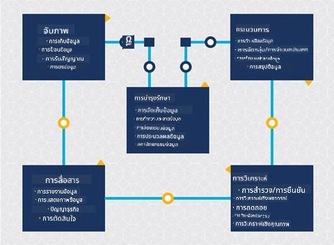
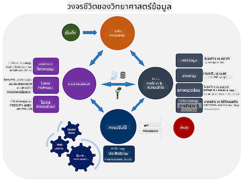
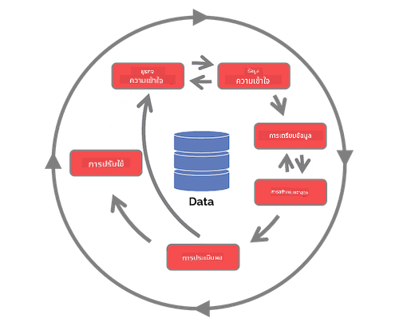

<!--
CO_OP_TRANSLATOR_METADATA:
{
  "original_hash": "79ca8a5a3135e94d2d43f56ba62d5205",
  "translation_date": "2025-09-04T18:47:37+00:00",
  "source_file": "4-Data-Science-Lifecycle/14-Introduction/README.md",
  "language_code": "th"
}
-->
# การแนะนำวงจรชีวิตของวิทยาศาสตร์ข้อมูล

| ](../../sketchnotes/14-DataScience-Lifecycle.png)|
|:---:|
| การแนะนำวงจรชีวิตของวิทยาศาสตร์ข้อมูล - _สเก็ตโน้ตโดย [@nitya](https://twitter.com/nitya)_ |

## [แบบทดสอบก่อนเรียน](https://red-water-0103e7a0f.azurestaticapps.net/quiz/26)

ณ จุดนี้ คุณอาจตระหนักแล้วว่าวิทยาศาสตร์ข้อมูลเป็นกระบวนการ กระบวนการนี้สามารถแบ่งออกเป็น 5 ขั้นตอน:

- การเก็บข้อมูล
- การประมวลผล
- การวิเคราะห์
- การสื่อสาร
- การบำรุงรักษา

บทเรียนนี้มุ่งเน้นไปที่ 3 ส่วนของวงจรชีวิต: การเก็บข้อมูล การประมวลผล และการบำรุงรักษา

> ภาพโดย [Berkeley School of Information](https://ischoolonline.berkeley.edu/data-science/what-is-data-science/)

## การเก็บข้อมูล

ขั้นตอนแรกของวงจรชีวิตมีความสำคัญมาก เนื่องจากขั้นตอนถัดไปจะขึ้นอยู่กับมัน โดยพื้นฐานแล้วเป็นการรวมสองขั้นตอนเข้าด้วยกัน: การรวบรวมข้อมูลและการกำหนดวัตถุประสงค์และปัญหาที่ต้องแก้ไข  
การกำหนดเป้าหมายของโครงการจะต้องมีการทำความเข้าใจเชิงลึกเกี่ยวกับปัญหาหรือคำถาม ก่อนอื่นเราต้องระบุและรวบรวมผู้ที่ต้องการแก้ปัญหาของพวกเขา ซึ่งอาจเป็นผู้มีส่วนได้ส่วนเสียในธุรกิจหรือผู้สนับสนุนโครงการที่สามารถช่วยระบุว่าใครหรืออะไรจะได้รับประโยชน์จากโครงการนี้ รวมถึงสิ่งที่พวกเขาต้องการและเหตุผล เป้าหมายที่กำหนดไว้อย่างดีควรสามารถวัดผลและคำนวณได้เพื่อกำหนดผลลัพธ์ที่ยอมรับได้

คำถามที่นักวิทยาศาสตร์ข้อมูลอาจถาม:
- ปัญหานี้เคยถูกแก้ไขมาก่อนหรือไม่? มีการค้นพบอะไรบ้าง?
- ทุกคนที่เกี่ยวข้องเข้าใจวัตถุประสงค์และเป้าหมายหรือไม่?
- มีความคลุมเครือหรือไม่ และจะลดความคลุมเครือได้อย่างไร?
- มีข้อจำกัดอะไรบ้าง?
- ผลลัพธ์สุดท้ายจะมีลักษณะอย่างไร?
- มีทรัพยากร (เวลา คน เครื่องมือคำนวณ) เพียงพอหรือไม่?

ขั้นตอนถัดไปคือการระบุ รวบรวม และสำรวจข้อมูลที่จำเป็นเพื่อบรรลุเป้าหมายที่กำหนดไว้ ในขั้นตอนการรวบรวมนี้ นักวิทยาศาสตร์ข้อมูลต้องประเมินปริมาณและคุณภาพของข้อมูลด้วย ซึ่งต้องมีการสำรวจข้อมูลเพื่อยืนยันว่าข้อมูลที่รวบรวมมานั้นจะช่วยให้บรรลุผลลัพธ์ที่ต้องการ

คำถามที่นักวิทยาศาสตร์ข้อมูลอาจถามเกี่ยวกับข้อมูล:
- ข้อมูลที่มีอยู่แล้วมีอะไรบ้าง?
- ใครเป็นเจ้าของข้อมูลนี้?
- มีข้อกังวลด้านความเป็นส่วนตัวหรือไม่?
- มีข้อมูลเพียงพอที่จะแก้ปัญหานี้หรือไม่?
- คุณภาพของข้อมูลเหมาะสมกับปัญหานี้หรือไม่?
- หากค้นพบข้อมูลเพิ่มเติมจากข้อมูลนี้ ควรพิจารณาเปลี่ยนหรือกำหนดเป้าหมายใหม่หรือไม่?

## การประมวลผล

ขั้นตอนการประมวลผลในวงจรชีวิตมุ่งเน้นไปที่การค้นหารูปแบบในข้อมูลและการสร้างแบบจำลอง เทคนิคบางอย่างที่ใช้ในขั้นตอนการประมวลผลต้องการวิธีการทางสถิติเพื่อค้นหารูปแบบ โดยทั่วไปแล้วจะเป็นงานที่น่าเบื่อสำหรับมนุษย์ในการจัดการกับชุดข้อมูลขนาดใหญ่ และจะต้องพึ่งพาคอมพิวเตอร์เพื่อช่วยเร่งกระบวนการ ขั้นตอนนี้ยังเป็นจุดที่วิทยาศาสตร์ข้อมูลและการเรียนรู้ของเครื่อง (Machine Learning) มาบรรจบกัน ดังที่คุณได้เรียนรู้ในบทเรียนแรก การเรียนรู้ของเครื่องคือกระบวนการสร้างแบบจำลองเพื่อทำความเข้าใจข้อมูล แบบจำลองเป็นตัวแทนของความสัมพันธ์ระหว่างตัวแปรในข้อมูลที่ช่วยทำนายผลลัพธ์

เทคนิคทั่วไปที่ใช้ในขั้นตอนนี้ครอบคลุมในหลักสูตร ML for Beginners สามารถติดตามลิงก์เพื่อเรียนรู้เพิ่มเติม:

- [การจัดหมวดหมู่](https://github.com/microsoft/ML-For-Beginners/tree/main/4-Classification): การจัดระเบียบข้อมูลเป็นหมวดหมู่เพื่อการใช้งานที่มีประสิทธิภาพมากขึ้น
- [การจัดกลุ่ม](https://github.com/microsoft/ML-For-Beginners/tree/main/5-Clustering): การจัดกลุ่มข้อมูลที่มีความคล้ายคลึงกัน
- [การถดถอย](https://github.com/microsoft/ML-For-Beginners/tree/main/2-Regression): การกำหนดความสัมพันธ์ระหว่างตัวแปรเพื่อทำนายหรือคาดการณ์ค่า

## การบำรุงรักษา

ในแผนภาพวงจรชีวิต คุณอาจสังเกตเห็นว่าการบำรุงรักษาอยู่ระหว่างการเก็บข้อมูลและการประมวลผล การบำรุงรักษาเป็นกระบวนการต่อเนื่องในการจัดการ จัดเก็บ และรักษาความปลอดภัยของข้อมูลตลอดกระบวนการของโครงการ และควรได้รับการพิจารณาตลอดระยะเวลาของโครงการ

### การจัดเก็บข้อมูล
การพิจารณาว่าจะจัดเก็บข้อมูลอย่างไรและที่ไหนสามารถส่งผลต่อค่าใช้จ่ายในการจัดเก็บข้อมูล รวมถึงประสิทธิภาพของการเข้าถึงข้อมูลได้เร็วแค่ไหน การตัดสินใจเหล่านี้อาจไม่ได้ทำโดยนักวิทยาศาสตร์ข้อมูลเพียงคนเดียว แต่พวกเขาอาจต้องเลือกวิธีการทำงานกับข้อมูลตามวิธีการจัดเก็บข้อมูล

นี่คือบางแง่มุมของระบบจัดเก็บข้อมูลสมัยใหม่ที่อาจส่งผลต่อการเลือกเหล่านี้:

**ในสถานที่ vs นอกสถานที่ vs คลาวด์สาธารณะหรือคลาวด์ส่วนตัว**

ในสถานที่หมายถึงการจัดการข้อมูลบนอุปกรณ์ของคุณเอง เช่น การเป็นเจ้าของเซิร์ฟเวอร์ที่มีฮาร์ดไดรฟ์สำหรับจัดเก็บข้อมูล ในขณะที่นอกสถานที่พึ่งพาอุปกรณ์ที่คุณไม่ได้เป็นเจ้าของ เช่น ศูนย์ข้อมูล คลาวด์สาธารณะเป็นตัวเลือกยอดนิยมสำหรับการจัดเก็บข้อมูลที่ไม่ต้องการความรู้เกี่ยวกับวิธีการหรือสถานที่จัดเก็บข้อมูล โดยที่ "สาธารณะ" หมายถึงโครงสร้างพื้นฐานพื้นฐานที่ใช้ร่วมกันโดยทุกคนที่ใช้คลาวด์ บางองค์กรมีนโยบายความปลอดภัยที่เข้มงวดซึ่งกำหนดให้พวกเขาต้องเข้าถึงอุปกรณ์ที่จัดเก็บข้อมูลได้อย่างสมบูรณ์ และจะพึ่งพาคลาวด์ส่วนตัวที่ให้บริการคลาวด์ของตนเอง คุณจะได้เรียนรู้เพิ่มเติมเกี่ยวกับข้อมูลในคลาวด์ใน [บทเรียนถัดไป](https://github.com/microsoft/Data-Science-For-Beginners/tree/main/5-Data-Science-In-Cloud)

**ข้อมูลเย็น vs ข้อมูลร้อน**

เมื่อฝึกอบรมแบบจำลองของคุณ คุณอาจต้องการข้อมูลการฝึกอบรมเพิ่มเติม หากคุณพอใจกับแบบจำลองของคุณ ข้อมูลเพิ่มเติมจะมาถึงเพื่อให้แบบจำลองทำหน้าที่ของมัน ในกรณีใด ๆ ค่าใช้จ่ายในการจัดเก็บและเข้าถึงข้อมูลจะเพิ่มขึ้นเมื่อคุณสะสมข้อมูลมากขึ้น การแยกข้อมูลที่ไม่ค่อยได้ใช้หรือที่เรียกว่าข้อมูลเย็นออกจากข้อมูลที่เข้าถึงบ่อยหรือข้อมูลร้อน อาจเป็นตัวเลือกการจัดเก็บข้อมูลที่ถูกกว่าผ่านบริการฮาร์ดแวร์หรือซอฟต์แวร์ หากต้องการเข้าถึงข้อมูลเย็น อาจใช้เวลานานกว่าเล็กน้อยเมื่อเทียบกับข้อมูลร้อน

### การจัดการข้อมูล
เมื่อคุณทำงานกับข้อมูล คุณอาจพบว่าข้อมูลบางส่วนต้องได้รับการทำความสะอาดโดยใช้เทคนิคบางอย่างที่ครอบคลุมในบทเรียนที่เน้นเรื่อง [การเตรียมข้อมูล](https://github.com/microsoft/Data-Science-For-Beginners/tree/main/2-Working-With-Data/08-data-preparation) เพื่อสร้างแบบจำลองที่แม่นยำ เมื่อข้อมูลใหม่มาถึง จะต้องมีการประยุกต์ใช้เทคนิคเดียวกันเพื่อรักษาความสม่ำเสมอในคุณภาพ โครงการบางโครงการจะเกี่ยวข้องกับการใช้เครื่องมืออัตโนมัติสำหรับการทำความสะอาด การรวมข้อมูล และการบีบอัดก่อนที่ข้อมูลจะถูกย้ายไปยังตำแหน่งสุดท้าย Azure Data Factory เป็นตัวอย่างหนึ่งของเครื่องมือเหล่านี้

### การรักษาความปลอดภัยของข้อมูล
หนึ่งในเป้าหมายหลักของการรักษาความปลอดภัยข้อมูลคือการรับรองว่าผู้ที่ทำงานกับข้อมูลสามารถควบคุมสิ่งที่รวบรวมและบริบทที่ใช้ได้ การรักษาความปลอดภัยข้อมูลเกี่ยวข้องกับการจำกัดการเข้าถึงเฉพาะผู้ที่ต้องการข้อมูล ปฏิบัติตามกฎหมายและข้อบังคับในท้องถิ่น รวมถึงรักษามาตรฐานทางจริยธรรม ดังที่ครอบคลุมใน [บทเรียนจริยธรรม](https://github.com/microsoft/Data-Science-For-Beginners/tree/main/1-Introduction/02-ethics)

นี่คือสิ่งที่ทีมอาจทำโดยคำนึงถึงความปลอดภัย:
- ยืนยันว่าข้อมูลทั้งหมดถูกเข้ารหัส
- ให้ข้อมูลแก่ลูกค้าเกี่ยวกับวิธีการใช้ข้อมูลของพวกเขา
- ลบการเข้าถึงข้อมูลจากผู้ที่ออกจากโครงการ
- อนุญาตให้สมาชิกโครงการบางคนเท่านั้นแก้ไขข้อมูล

## 🚀 ความท้าทาย

มีหลายเวอร์ชันของวงจรชีวิตวิทยาศาสตร์ข้อมูล ซึ่งแต่ละขั้นตอนอาจมีชื่อและจำนวนขั้นตอนที่แตกต่างกัน แต่จะมีกระบวนการเดียวกันที่กล่าวถึงในบทเรียนนี้

สำรวจ [วงจรชีวิตกระบวนการวิทยาศาสตร์ข้อมูลทีม (TDSP)](https://docs.microsoft.com/en-us/azure/architecture/data-science-process/lifecycle) และ [กระบวนการมาตรฐานข้ามอุตสาหกรรมสำหรับการทำเหมืองข้อมูล (CRISP-DM)](https://www.datascience-pm.com/crisp-dm-2/) ระบุ 3 ความเหมือนและความแตกต่างระหว่างทั้งสอง

|กระบวนการวิทยาศาสตร์ข้อมูลทีม (TDSP)|กระบวนการมาตรฐานข้ามอุตสาหกรรมสำหรับการทำเหมืองข้อมูล (CRISP-DM)|
|--|--|
| |  |
| ภาพโดย [Microsoft](https://docs.microsoft.comazure/architecture/data-science-process/lifecycle) | ภาพโดย [Data Science Process Alliance](https://www.datascience-pm.com/crisp-dm-2/) |

## [แบบทดสอบหลังเรียน](https://ff-quizzes.netlify.app/en/ds/)

## ทบทวนและศึกษาด้วยตนเอง

การประยุกต์ใช้วงจรชีวิตวิทยาศาสตร์ข้อมูลเกี่ยวข้องกับบทบาทและงานหลายอย่าง ซึ่งบางคนอาจมุ่งเน้นไปที่ส่วนเฉพาะของแต่ละขั้นตอน กระบวนการวิทยาศาสตร์ข้อมูลทีมให้ทรัพยากรบางอย่างที่อธิบายประเภทของบทบาทและงานที่ใครบางคนอาจมีในโครงการ

* [บทบาทและงานในกระบวนการวิทยาศาสตร์ข้อมูลทีม](https://docs.microsoft.com/en-us/azure/architecture/data-science-process/roles-tasks)
* [ดำเนินการงานวิทยาศาสตร์ข้อมูล: การสำรวจ การสร้างแบบจำลอง และการปรับใช้](https://docs.microsoft.com/en-us/azure/architecture/data-science-process/execute-data-science-tasks)

## งานที่ได้รับมอบหมาย

[การประเมินชุดข้อมูล](assignment.md)

---

**ข้อจำกัดความรับผิดชอบ**:  
เอกสารนี้ได้รับการแปลโดยใช้บริการแปลภาษา AI [Co-op Translator](https://github.com/Azure/co-op-translator) แม้ว่าเราจะพยายามให้การแปลมีความถูกต้องมากที่สุด แต่โปรดทราบว่าการแปลอัตโนมัติอาจมีข้อผิดพลาดหรือความไม่ถูกต้อง เอกสารต้นฉบับในภาษาดั้งเดิมควรถือเป็นแหล่งข้อมูลที่เชื่อถือได้ สำหรับข้อมูลที่สำคัญ ขอแนะนำให้ใช้บริการแปลภาษามืออาชีพ เราไม่รับผิดชอบต่อความเข้าใจผิดหรือการตีความผิดที่เกิดจากการใช้การแปลนี้