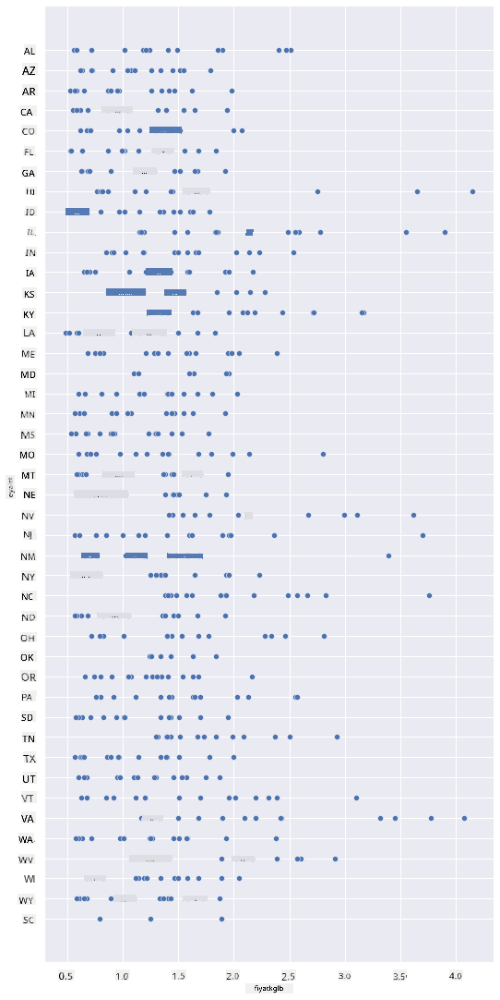
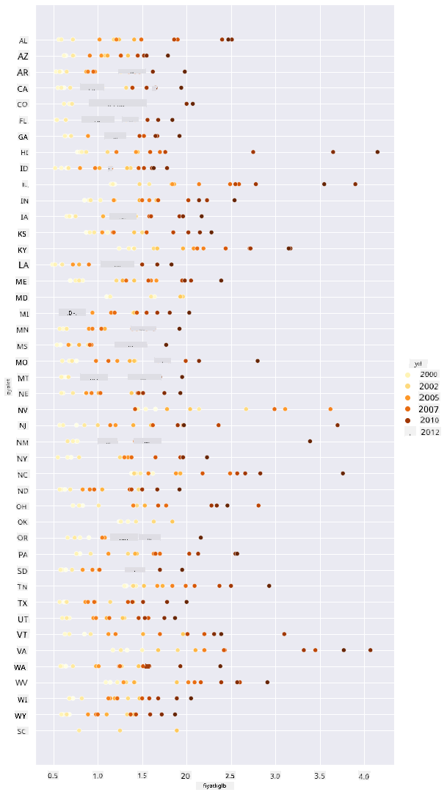
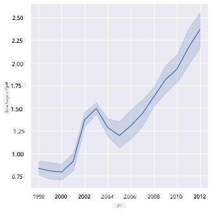
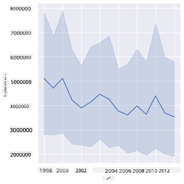
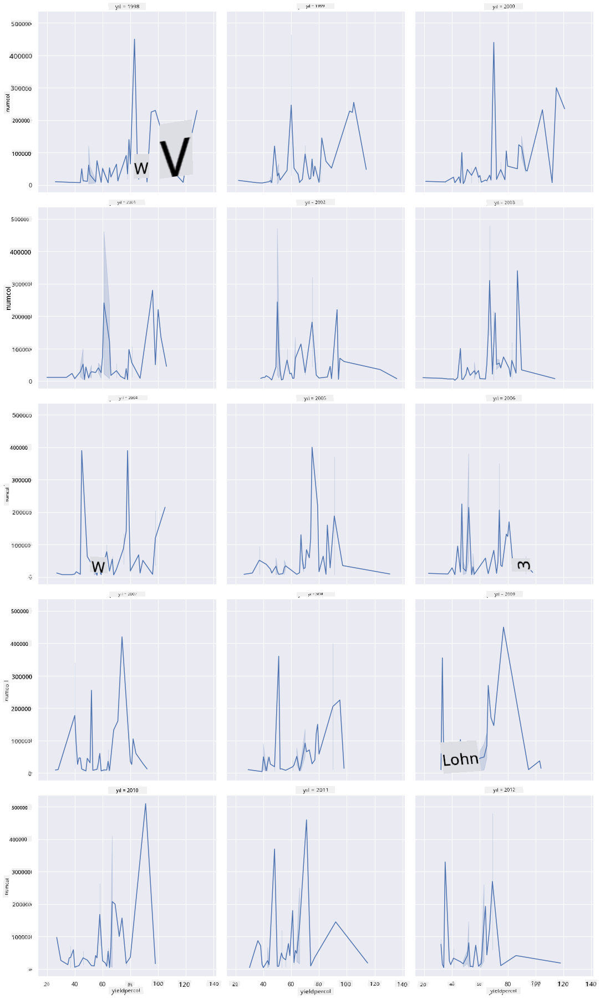
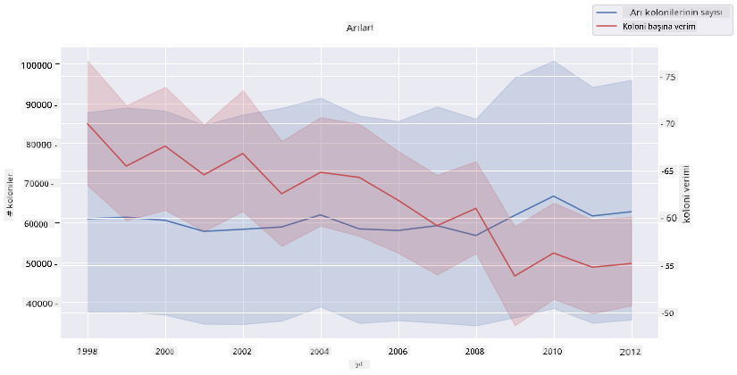

<!--
CO_OP_TRANSLATOR_METADATA:
{
  "original_hash": "b29e427401499e81f4af55a8c4afea76",
  "translation_date": "2025-09-04T18:13:57+00:00",
  "source_file": "3-Data-Visualization/12-visualization-relationships/README.md",
  "language_code": "tr"
}
-->
# İlişkileri Görselleştirme: Bal Hakkında Her Şey 🍯

| ](../../sketchnotes/12-Visualizing-Relationships.png)|
|:---:|
|İlişkileri Görselleştirme - _Sketchnote by [@nitya](https://twitter.com/nitya)_ |

Araştırmamızın doğa odaklı temasına devam ederek, Amerika Birleşik Devletleri Tarım Bakanlığı'ndan ([United States Department of Agriculture](https://www.nass.usda.gov/About_NASS/index.php)) alınan bir veri setine göre çeşitli bal türleri arasındaki ilişkileri göstermek için ilginç görselleştirmeler keşfedelim.

Yaklaşık 600 öğeden oluşan bu veri seti, birçok ABD eyaletindeki bal üretimini göstermektedir. Örneğin, bir eyaletteki kolonilerin sayısını, koloni başına verimi, toplam üretimi, stokları, pound başına fiyatı ve 1998-2012 yılları arasında üretilen balın değerini inceleyebilirsiniz. Her eyalet için her yıl bir satır bulunmaktadır.

Bir eyaletin yıllık üretimi ile o eyaletteki bal fiyatı arasındaki ilişkiyi görselleştirmek ilginç olabilir. Alternatif olarak, eyaletlerin koloni başına bal verimi arasındaki ilişkiyi görselleştirebilirsiniz. Bu zaman aralığı, ilk olarak 2006 yılında görülen 'Koloni Çöküş Bozukluğu' (CCD) (http://npic.orst.edu/envir/ccd.html) gibi yıkıcı bir dönemi kapsadığı için çalışılması anlamlı bir veri setidir. 🐝

## [Ders Öncesi Test](https://purple-hill-04aebfb03.1.azurestaticapps.net/quiz/22)

Bu derste, daha önce kullandığınız Seaborn kütüphanesini, değişkenler arasındaki ilişkileri görselleştirmek için kullanabilirsiniz. Özellikle Seaborn'un `relplot` fonksiyonunu kullanarak, veri bilimcilerin değişkenlerin birbirleriyle nasıl ilişkili olduğunu daha iyi anlamalarını sağlayan '[istatistiksel ilişkiler](https://seaborn.pydata.org/tutorial/relational.html?highlight=relationships)' için hızlı bir şekilde dağılım grafikleri ve çizgi grafikleri oluşturabilirsiniz.

## Dağılım Grafikleri

Bal fiyatının eyalet bazında yıllar içinde nasıl değiştiğini göstermek için bir dağılım grafiği kullanın. Seaborn, `relplot` kullanarak eyalet verilerini gruplar ve hem kategorik hem de sayısal veriler için veri noktalarını görüntüler.

Hadi verileri ve Seaborn'u içe aktararak başlayalım:

```python
import pandas as pd
import matplotlib.pyplot as plt
import seaborn as sns
honey = pd.read_csv('../../data/honey.csv')
honey.head()
```
Bal verilerinin yıl ve pound başına fiyat gibi birkaç ilginç sütuna sahip olduğunu fark ediyorsunuz. Bu verileri ABD eyaletlerine göre gruplayarak keşfedelim:

| eyalet | numcol | yieldpercol | totalprod | stocks   | priceperlb | prodvalue | year |
| ----- | ------ | ----------- | --------- | -------- | ---------- | --------- | ---- |
| AL    | 16000  | 71          | 1136000   | 159000   | 0.72       | 818000    | 1998 |
| AZ    | 55000  | 60          | 3300000   | 1485000  | 0.64       | 2112000   | 1998 |
| AR    | 53000  | 65          | 3445000   | 1688000  | 0.59       | 2033000   | 1998 |
| CA    | 450000 | 83          | 37350000  | 12326000 | 0.62       | 23157000  | 1998 |
| CO    | 27000  | 72          | 1944000   | 1594000  | 0.7        | 1361000   | 1998 |

Balın pound başına fiyatı ile ABD'deki üretim eyaletleri arasındaki ilişkiyi göstermek için temel bir dağılım grafiği oluşturun. `y` eksenini tüm eyaletleri gösterecek kadar uzun yapın:

```python
sns.relplot(x="priceperlb", y="state", data=honey, height=15, aspect=.5);
```


Şimdi, aynı verileri yıllar içinde fiyatın nasıl değiştiğini göstermek için bal renk şemasıyla gösterin. Bunu, yıllar içinde değişimi göstermek için bir 'hue' parametresi ekleyerek yapabilirsiniz:

> ✅ Seaborn'da kullanabileceğiniz [renk paletleri hakkında daha fazla bilgi edinin](https://seaborn.pydata.org/tutorial/color_palettes.html) - güzel bir gökkuşağı renk şeması deneyin!

```python
sns.relplot(x="priceperlb", y="state", hue="year", palette="YlOrBr", data=honey, height=15, aspect=.5);
```


Bu renk şeması değişikliğiyle, yıllar içinde pound başına bal fiyatında belirgin bir artış olduğunu açıkça görebilirsiniz. Gerçekten de, verilerde bir örnek seti inceleyerek (örneğin Arizona eyaletini seçerek) yıllar içinde fiyat artışlarının bir modelini, birkaç istisna dışında görebilirsiniz:

| eyalet | numcol | yieldpercol | totalprod | stocks  | priceperlb | prodvalue | year |
| ----- | ------ | ----------- | --------- | ------- | ---------- | --------- | ---- |
| AZ    | 55000  | 60          | 3300000   | 1485000 | 0.64       | 2112000   | 1998 |
| AZ    | 52000  | 62          | 3224000   | 1548000 | 0.62       | 1999000   | 1999 |
| AZ    | 40000  | 59          | 2360000   | 1322000 | 0.73       | 1723000   | 2000 |
| AZ    | 43000  | 59          | 2537000   | 1142000 | 0.72       | 1827000   | 2001 |
| AZ    | 38000  | 63          | 2394000   | 1197000 | 1.08       | 2586000   | 2002 |
| AZ    | 35000  | 72          | 2520000   | 983000  | 1.34       | 3377000   | 2003 |
| AZ    | 32000  | 55          | 1760000   | 774000  | 1.11       | 1954000   | 2004 |
| AZ    | 36000  | 50          | 1800000   | 720000  | 1.04       | 1872000   | 2005 |
| AZ    | 30000  | 65          | 1950000   | 839000  | 0.91       | 1775000   | 2006 |
| AZ    | 30000  | 64          | 1920000   | 902000  | 1.26       | 2419000   | 2007 |
| AZ    | 25000  | 64          | 1600000   | 336000  | 1.26       | 2016000   | 2008 |
| AZ    | 20000  | 52          | 1040000   | 562000  | 1.45       | 1508000   | 2009 |
| AZ    | 24000  | 77          | 1848000   | 665000  | 1.52       | 2809000   | 2010 |
| AZ    | 23000  | 53          | 1219000   | 427000  | 1.55       | 1889000   | 2011 |
| AZ    | 22000  | 46          | 1012000   | 253000  | 1.79       | 1811000   | 2012 |

Bu ilerlemeyi görselleştirmenin bir başka yolu, renk yerine boyut kullanmaktır. Renk körü kullanıcılar için bu daha iyi bir seçenek olabilir. Görselleştirmenizi, fiyat artışını nokta çevresinin artışıyla gösterecek şekilde düzenleyin:

```python
sns.relplot(x="priceperlb", y="state", size="year", data=honey, height=15, aspect=.5);
```
Noktaların boyutlarının kademeli olarak arttığını görebilirsiniz.


Bu basit bir arz ve talep meselesi mi? İklim değişikliği ve koloni çöküşü gibi faktörler nedeniyle, yıllar içinde satın alınabilir bal miktarı azalıyor ve bu nedenle fiyat mı artıyor?

Bu veri setindeki bazı değişkenler arasında bir korelasyon bulmak için çizgi grafiklerini keşfedelim.

## Çizgi Grafikleri

Soru: Balın pound başına fiyatında yıllar içinde net bir artış var mı? Bunu en kolay şekilde tek bir çizgi grafiği oluşturarak keşfedebilirsiniz:

```python
sns.relplot(x="year", y="priceperlb", kind="line", data=honey);
```
Cevap: Evet, 2003 yılı civarındaki bazı istisnalar dışında:



✅ Seaborn, bir çizgi etrafında verileri birleştirerek "her x değerindeki birden fazla ölçümü, ortalama ve ortalama etrafındaki %95 güven aralığını çizerek" görüntüler. [Kaynak](https://seaborn.pydata.org/tutorial/relational.html). Bu zaman alıcı davranış, `ci=None` eklenerek devre dışı bırakılabilir.

Soru: Peki, 2003 yılında bal arzında bir artış görebilir miyiz? Yıllar içinde toplam üretime bakarsanız ne olur?

```python
sns.relplot(x="year", y="totalprod", kind="line", data=honey);
```



Cevap: Pek değil. Toplam üretime bakarsanız, aslında o yıl artmış gibi görünüyor, ancak genel olarak bu yıllar boyunca üretilen bal miktarı düşüşte.

Soru: Bu durumda, 2003 civarındaki bal fiyatındaki artışa ne sebep olmuş olabilir?

Bunu keşfetmek için bir facet grid oluşturabilirsiniz.

## Facet Gridler

Facet gridler, veri setinizin bir yönünü (bizim durumumuzda 'yıl'ı seçebilirsiniz) alır ve Seaborn, seçtiğiniz x ve y koordinatları için daha kolay görsel karşılaştırma sağlamak amacıyla her bir facet için bir grafik oluşturur. 2003 yılı bu tür bir karşılaştırmada öne çıkıyor mu?

Seaborn'un [belgelerinde önerildiği](https://seaborn.pydata.org/generated/seaborn.FacetGrid.html?highlight=facetgrid#seaborn.FacetGrid) gibi `relplot` kullanmaya devam ederek bir facet grid oluşturun.

```python
sns.relplot(
    data=honey, 
    x="yieldpercol", y="numcol",
    col="year", 
    col_wrap=3,
    kind="line"
```
Bu görselleştirmede, koloni başına verim ve koloni sayısını yıllar içinde yan yana, sütunlar için wrap 3 olarak ayarlanmış şekilde karşılaştırabilirsiniz:



Bu veri seti için, eyaletler ve yıllar arasında koloni sayısı ve verim açısından dikkat çeken bir şey yok. Bu iki değişken arasında bir korelasyon bulmanın farklı bir yolu var mı?

## Çift Çizgi Grafikleri

Seaborn'un 'despine' özelliğini kullanarak üst ve sağ kenarları kaldırın ve Matplotlib'den [ax.twinx](https://matplotlib.org/stable/api/_as_gen/matplotlib.axes.Axes.twinx.html) kullanarak iki çizgi grafiği üst üste bindirin. Twinx, bir grafiğin x eksenini paylaşmasını ve iki y ekseni görüntülemesini sağlar. Koloni başına verim ve koloni sayısını üst üste bindirerek gösterin:

```python
fig, ax = plt.subplots(figsize=(12,6))
lineplot = sns.lineplot(x=honey['year'], y=honey['numcol'], data=honey, 
                        label = 'Number of bee colonies', legend=False)
sns.despine()
plt.ylabel('# colonies')
plt.title('Honey Production Year over Year');

ax2 = ax.twinx()
lineplot2 = sns.lineplot(x=honey['year'], y=honey['yieldpercol'], ax=ax2, color="r", 
                         label ='Yield per colony', legend=False) 
sns.despine(right=False)
plt.ylabel('colony yield')
ax.figure.legend();
```


2003 yılı civarında göze çarpan bir şey olmasa da, bu dersi biraz daha mutlu bir notla bitirmemizi sağlıyor: genel olarak azalan koloni sayısına rağmen, koloni sayısı sabitleniyor, ancak koloni başına verim azalıyor.

Haydi arılar, haydi!

🐝❤️
## 🚀 Meydan Okuma

Bu derste, dağılım grafikleri ve çizgi gridlerinin diğer kullanım alanlarını, özellikle facet gridlerini biraz daha öğrendiniz. Daha önceki derslerde kullandığınız farklı bir veri seti kullanarak bir facet grid oluşturmayı deneyin. Bunları oluşturmanın ne kadar sürdüğünü ve bu teknikleri kullanırken kaç tane grid çizmeniz gerektiğine dikkat etmeniz gerektiğini not edin.

## [Ders Sonrası Test](https://ff-quizzes.netlify.app/en/ds/)

## İnceleme ve Kendi Kendine Çalışma

Çizgi grafikleri basit veya oldukça karmaşık olabilir. [Seaborn belgelerinde](https://seaborn.pydata.org/generated/seaborn.lineplot.html) çizgi grafikleri oluşturmanın çeşitli yolları hakkında biraz okuyun. Bu derste oluşturduğunuz çizgi grafiklerini belgelerde listelenen diğer yöntemlerle geliştirmeyi deneyin.
## Ödev

[Arı kovanına dalın](assignment.md)

---

**Feragatname**:  
Bu belge, AI çeviri hizmeti [Co-op Translator](https://github.com/Azure/co-op-translator) kullanılarak çevrilmiştir. Doğruluk için çaba göstersek de, otomatik çevirilerin hata veya yanlışlık içerebileceğini lütfen unutmayın. Belgenin orijinal dili, yetkili kaynak olarak kabul edilmelidir. Kritik bilgiler için profesyonel insan çevirisi önerilir. Bu çevirinin kullanımından kaynaklanan yanlış anlamalar veya yanlış yorumlamalar için sorumluluk kabul edilmez.