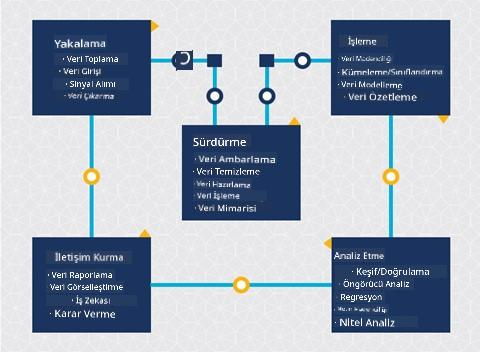
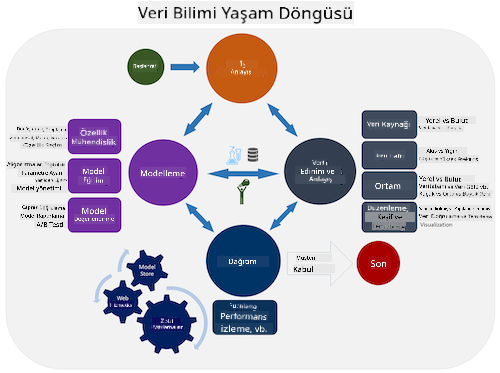

<!--
CO_OP_TRANSLATOR_METADATA:
{
  "original_hash": "07e12a25d20b8f191e3cb651c27fdb2b",
  "translation_date": "2025-09-06T20:57:54+00:00",
  "source_file": "4-Data-Science-Lifecycle/14-Introduction/README.md",
  "language_code": "tr"
}
-->
# Veri Bilimi Yaşam Döngüsüne Giriş

| ](../../sketchnotes/14-DataScience-Lifecycle.png)|
|:---:|
| Veri Bilimi Yaşam Döngüsüne Giriş - _Sketchnote by [@nitya](https://twitter.com/nitya)_ |

## [Ders Öncesi Quiz](https://ff-quizzes.netlify.app/en/ds/quiz/26)

Bu noktada, veri biliminin bir süreç olduğunu muhtemelen fark etmişsinizdir. Bu süreç 5 aşamaya ayrılabilir:

- Veri Toplama
- İşleme
- Analiz
- İletişim
- Bakım

Bu ders, yaşam döngüsünün 3 kısmına odaklanıyor: veri toplama, işleme ve bakım.

> Fotoğraf: [Berkeley School of Information](https://ischoolonline.berkeley.edu/data-science/what-is-data-science/)

## Veri Toplama

Yaşam döngüsünün ilk aşaması çok önemlidir çünkü sonraki aşamalar buna bağlıdır. Bu aşama, pratikte iki aşamanın birleştirilmiş halidir: veriyi edinmek ve ele alınması gereken amaçları ve problemleri tanımlamak.  
Projenin hedeflerini tanımlamak, problem veya sorunun daha derin bir bağlamını gerektirir. Öncelikle, problemini çözmek isteyen kişileri belirlememiz ve edinmemiz gerekir. Bunlar, bir işletmedeki paydaşlar veya projeyi destekleyen sponsorlar olabilir. Bu kişiler, bu projeden kimlerin veya nelerin fayda sağlayacağını, neye ihtiyaç duyduklarını ve neden ihtiyaç duyduklarını belirlemeye yardımcı olabilir. İyi tanımlanmış bir hedef, kabul edilebilir bir sonucu tanımlamak için ölçülebilir ve nicel olmalıdır.

Bir veri bilimcinin sorabileceği sorular:
- Bu problem daha önce ele alındı mı? Ne keşfedildi?
- Amaç ve hedef, tüm ilgili kişiler tarafından anlaşılıyor mu?
- Belirsizlik var mı ve bunu nasıl azaltabiliriz?
- Kısıtlamalar nelerdir?
- Nihai sonuç nasıl görünebilir?
- Ne kadar kaynak (zaman, insan, hesaplama) mevcut?

Sonraki adım, tanımlanan hedeflere ulaşmak için gereken veriyi belirlemek, toplamak ve ardından keşfetmektir. Bu edinim aşamasında, veri bilimciler ayrıca verinin miktarını ve kalitesini değerlendirmelidir. Bu, elde edilen verinin istenen sonuca ulaşmayı destekleyeceğini doğrulamak için biraz veri keşfi gerektirir.

Bir veri bilimcinin veri hakkında sorabileceği sorular:
- Hangi veri zaten elimde mevcut?
- Bu verinin sahibi kim?
- Gizlilikle ilgili endişeler nelerdir?
- Bu problemi çözmek için yeterli veri var mı?
- Veri, bu problem için kabul edilebilir kalitede mi?
- Bu veri aracılığıyla ek bilgiler keşfedersem, hedefleri değiştirmeyi veya yeniden tanımlamayı düşünmeli miyiz?

## İşleme

Yaşam döngüsünün işleme aşaması, verideki desenleri keşfetmeye ve modellemeye odaklanır. İşleme aşamasında kullanılan bazı teknikler, desenleri ortaya çıkarmak için istatistiksel yöntemler gerektirir. Genellikle, bu büyük bir veri setiyle insan için zahmetli bir görev olur ve süreci hızlandırmak için bilgisayarlara güvenilir. Bu aşama aynı zamanda veri bilimi ve makine öğreniminin kesiştiği yerdir. İlk derste öğrendiğiniz gibi, makine öğrenimi, veriyi anlamak için modeller oluşturma sürecidir. Modeller, verideki değişkenler arasındaki ilişkiyi temsil eder ve sonuçları tahmin etmeye yardımcı olur.

Bu aşamada kullanılan yaygın teknikler, ML for Beginners müfredatında ele alınmıştır. Daha fazla bilgi edinmek için bağlantıları takip edin:

- [Sınıflandırma](https://github.com/microsoft/ML-For-Beginners/tree/main/4-Classification): Veriyi daha verimli kullanım için kategorilere ayırma.
- [Kümeleme](https://github.com/microsoft/ML-For-Beginners/tree/main/5-Clustering): Veriyi benzer gruplara ayırma.
- [Regresyon](https://github.com/microsoft/ML-For-Beginners/tree/main/2-Regression): Değişkenler arasındaki ilişkileri belirleyerek değerleri tahmin etme veya öngörme.

## Bakım

Yaşam döngüsü diyagramında, bakımın veri toplama ve işleme arasında yer aldığını fark etmiş olabilirsiniz. Bakım, bir projenin süreci boyunca veriyi yönetme, depolama ve güvence altına alma gibi sürekli bir süreçtir ve projenin tamamı boyunca dikkate alınmalıdır.

### Veri Depolama

Verinin nasıl ve nerede depolandığına ilişkin kararlar, depolama maliyetini ve veriye erişim hızını etkileyebilir. Bu tür kararlar genellikle yalnızca bir veri bilimci tarafından alınmaz, ancak veri bilimciler, verinin nasıl depolandığına bağlı olarak verilerle nasıl çalışacaklarına dair seçimler yapabilirler.

Modern veri depolama sistemlerinin bu seçimleri etkileyebilecek bazı yönleri:

**Yerinde vs yer dışında vs genel veya özel bulut**

Yerinde depolama, veriyi kendi ekipmanınızda barındırmayı ifade eder; örneğin, veriyi depolayan sabit disklerle bir sunucuya sahip olmak. Yer dışında depolama ise sahip olmadığınız bir ekipmana, örneğin bir veri merkezine dayanır. Genel bulut, verinin tam olarak nasıl veya nerede depolandığını bilmenizi gerektirmeyen popüler bir seçenektir. Genel, bulutu kullanan herkes tarafından paylaşılan birleşik bir altyapıyı ifade eder. Bazı kuruluşlar, verinin barındırıldığı ekipmana tamamen erişim gerektiren katı güvenlik politikalarına sahiptir ve kendi bulut hizmetlerini sağlayan özel bir buluta güvenebilir. Bulutta veri hakkında daha fazla bilgi edinmek için [ilerleyen derslere](https://github.com/microsoft/Data-Science-For-Beginners/tree/main/5-Data-Science-In-Cloud) göz atabilirsiniz.

**Soğuk vs sıcak veri**

Modellerinizi eğitirken daha fazla eğitim verisine ihtiyaç duyabilirsiniz. Modelinizden memnunsanız, modelin amacına hizmet etmesi için daha fazla veri gelecektir. Her durumda, daha fazla veri biriktirdikçe veriyi depolama ve erişim maliyeti artacaktır. Nadiren kullanılan veriyi, yani soğuk veriyi sıkça erişilen sıcak veriden ayırmak, donanım veya yazılım hizmetleri aracılığıyla daha ucuz bir veri depolama seçeneği olabilir. Soğuk veriye erişilmesi gerektiğinde, sıcak veriye kıyasla biraz daha uzun sürebilir.

### Veri Yönetimi

Verilerle çalışırken, bazı verilerin [veri hazırlama](https://github.com/microsoft/Data-Science-For-Beginners/tree/main/2-Working-With-Data/08-data-preparation) dersinde ele alınan tekniklerden bazılarını kullanarak temizlenmesi gerektiğini keşfedebilirsiniz. Yeni veri geldiğinde, kalite tutarlılığını korumak için aynı uygulamalara ihtiyaç duyulacaktır. Bazı projeler, verinin nihai konumuna taşınmadan önce temizleme, birleştirme ve sıkıştırma işlemleri için otomatik bir araç kullanılmasını içerebilir. Azure Data Factory, bu araçlardan birine örnektir.

### Veriyi Güvence Altına Alma

Veriyi güvence altına almanın ana hedeflerinden biri, veriyi işleyenlerin ne toplandığını ve hangi bağlamda kullanıldığını kontrol etmelerini sağlamaktır. Veriyi güvence altına almak, yalnızca ihtiyaç duyanların erişimini sınırlamayı, yerel yasa ve düzenlemelere uymayı ve [etik dersinde](https://github.com/microsoft/Data-Science-For-Beginners/tree/main/1-Introduction/02-ethics) ele alınan etik standartları korumayı içerir.

Bir ekibin güvenlik göz önünde bulundurularak yapabileceği bazı şeyler:
- Tüm verilerin şifreli olduğundan emin olmak
- Müşterilere verilerinin nasıl kullanıldığı hakkında bilgi sağlamak
- Projeden ayrılanların veri erişimini kaldırmak
- Sadece belirli proje üyelerinin veriyi değiştirmesine izin vermek

## 🚀 Zorluk

Veri Bilimi Yaşam Döngüsünün birçok versiyonu vardır; her adım farklı isimlere ve aşama sayısına sahip olabilir, ancak bu derste belirtilen aynı süreçleri içerir.

[Team Data Science Process yaşam döngüsünü](https://docs.microsoft.com/en-us/azure/architecture/data-science-process/lifecycle) ve [Endüstriler arası veri madenciliği için standart süreci](https://www.datascience-pm.com/crisp-dm-2/) keşfedin. İkisi arasındaki 3 benzerlik ve farklılığı adlandırın.

|Team Data Science Process (TDSP)|Endüstriler arası veri madenciliği için standart süreç (CRISP-DM)|
|--|--|
| |  |
| Görsel: [Microsoft](https://docs.microsoft.comazure/architecture/data-science-process/lifecycle) | Görsel: [Data Science Process Alliance](https://www.datascience-pm.com/crisp-dm-2/) |

## [Ders Sonrası Quiz](https://ff-quizzes.netlify.app/en/ds/quiz/27)

## Gözden Geçirme ve Kendi Kendine Çalışma

Veri Bilimi Yaşam Döngüsünü uygulamak, bir projenin her aşamasının belirli bölümlerine odaklanabilecek birden fazla rol ve görevi içerir. Team Data Science Process, bir projede birinin sahip olabileceği rol ve görev türlerini açıklayan birkaç kaynak sağlar.

* [Team Data Science Process rol ve görevleri](https://docs.microsoft.com/en-us/azure/architecture/data-science-process/roles-tasks)
* [Veri bilimi görevlerini yürütme: keşif, modelleme ve dağıtım](https://docs.microsoft.com/en-us/azure/architecture/data-science-process/execute-data-science-tasks)

## Ödev

[Bir Veri Setini Değerlendirme](assignment.md)

---

**Feragatname**:  
Bu belge, [Co-op Translator](https://github.com/Azure/co-op-translator) adlı yapay zeka çeviri hizmeti kullanılarak çevrilmiştir. Doğruluk için çaba göstersek de, otomatik çevirilerin hata veya yanlışlıklar içerebileceğini lütfen unutmayın. Belgenin orijinal dili, yetkili kaynak olarak kabul edilmelidir. Kritik bilgiler için profesyonel insan çevirisi önerilir. Bu çevirinin kullanımından kaynaklanan yanlış anlama veya yanlış yorumlamalardan sorumlu değiliz.