<!--
CO_OP_TRANSLATOR_METADATA:
{
  "original_hash": "39f3b3a9d873eaa522c2e792ce0ca503",
  "translation_date": "2025-09-04T18:04:34+00:00",
  "source_file": "5-Data-Science-In-Cloud/18-Low-Code/README.md",
  "language_code": "tr"
}
-->
# Bulutta Veri Bilimi: "Düşük Kod/Hiç Kod" Yöntemi

| ](../../sketchnotes/18-DataScience-Cloud.png)|
|:---:|
| Bulutta Veri Bilimi: Düşük Kod - _Sketchnote by [@nitya](https://twitter.com/nitya)_ |

İçindekiler:

- [Bulutta Veri Bilimi: "Düşük Kod/Hiç Kod" Yöntemi](../../../../5-Data-Science-In-Cloud/18-Low-Code)
  - [Ders Öncesi Test](../../../../5-Data-Science-In-Cloud/18-Low-Code)
  - [1. Giriş](../../../../5-Data-Science-In-Cloud/18-Low-Code)
    - [1.1 Azure Machine Learning Nedir?](../../../../5-Data-Science-In-Cloud/18-Low-Code)
    - [1.2 Kalp Yetmezliği Tahmin Projesi:](../../../../5-Data-Science-In-Cloud/18-Low-Code)
    - [1.3 Kalp Yetmezliği Veri Seti:](../../../../5-Data-Science-In-Cloud/18-Low-Code)
  - [2. Azure ML Studio'da Düşük Kod/Hiç Kod ile Model Eğitimi](../../../../5-Data-Science-In-Cloud/18-Low-Code)
    - [2.1 Azure ML Çalışma Alanı Oluşturma](../../../../5-Data-Science-In-Cloud/18-Low-Code)
    - [2.2 Hesaplama Kaynakları](../../../../5-Data-Science-In-Cloud/18-Low-Code)
      - [2.2.1 Hesaplama Kaynakları için Doğru Seçenekleri Belirleme](../../../../5-Data-Science-In-Cloud/18-Low-Code)
      - [2.2.2 Hesaplama Kümesi Oluşturma](../../../../5-Data-Science-In-Cloud/18-Low-Code)
    - [2.3 Veri Setini Yükleme](../../../../5-Data-Science-In-Cloud/18-Low-Code)
    - [2.4 AutoML ile Düşük Kod/Hiç Kod Eğitimi](../../../../5-Data-Science-In-Cloud/18-Low-Code)
  - [3. Düşük Kod/Hiç Kod Model Dağıtımı ve Uç Nokta Tüketimi](../../../../5-Data-Science-In-Cloud/18-Low-Code)
    - [3.1 Model Dağıtımı](../../../../5-Data-Science-In-Cloud/18-Low-Code)
    - [3.2 Uç Nokta Tüketimi](../../../../5-Data-Science-In-Cloud/18-Low-Code)
  - [🚀 Meydan Okuma](../../../../5-Data-Science-In-Cloud/18-Low-Code)
  - [Ders Sonrası Test](../../../../5-Data-Science-In-Cloud/18-Low-Code)
  - [Gözden Geçirme ve Kendi Kendine Çalışma](../../../../5-Data-Science-In-Cloud/18-Low-Code)
  - [Ödev](../../../../5-Data-Science-In-Cloud/18-Low-Code)

## [Ders Öncesi Test](https://ff-quizzes.netlify.app/en/ds/)

## 1. Giriş
### 1.1 Azure Machine Learning Nedir?

Azure bulut platformu, yeni çözümler geliştirmenize yardımcı olmak için tasarlanmış 200'den fazla ürün ve bulut hizmetinden oluşur. Veri bilimciler, verileri keşfetmek ve ön işlemek, çeşitli model eğitim algoritmalarını denemek ve doğru modeller üretmek için çok fazla çaba harcarlar. Bu görevler zaman alıcıdır ve genellikle pahalı hesaplama donanımının verimsiz kullanımına yol açar.

[Azure ML](https://docs.microsoft.com/azure/machine-learning/overview-what-is-azure-machine-learning?WT.mc_id=academic-77958-bethanycheum&ocid=AID3041109), Azure'da makine öğrenimi çözümleri oluşturmak ve işletmek için bulut tabanlı bir platformdur. Veri bilimcilerin verileri hazırlamasına, modelleri eğitmesine, tahmin hizmetlerini yayınlamasına ve kullanımını izlemesine yardımcı olan çok çeşitli özellikler ve yetenekler içerir. En önemlisi, model eğitimiyle ilgili zaman alıcı görevlerin çoğunu otomatikleştirerek verimliliklerini artırır; ve yalnızca kullanıldığında maliyet oluşturarak büyük veri hacimlerini işlemek için etkili bir şekilde ölçeklenen bulut tabanlı hesaplama kaynaklarını kullanmalarını sağlar.

Azure ML, geliştiriciler ve veri bilimciler için makine öğrenimi iş akışlarıyla ilgili tüm araçları sağlar. Bunlar şunları içerir:

- **Azure Machine Learning Studio**: Model eğitimi, dağıtımı, otomasyonu, takibi ve varlık yönetimi için düşük kod ve hiç kod seçenekleri sunan bir web portalıdır. Studio, Azure Machine Learning SDK ile entegre bir deneyim sağlar.
- **Jupyter Notebooks**: ML modellerini hızlı bir şekilde prototiplemek ve test etmek için kullanılır.
- **Azure Machine Learning Designer**: Modülleri sürükleyip bırakma yöntemiyle deneyler oluşturmanıza ve düşük kodlu bir ortamda ardışık düzenleri dağıtmanıza olanak tanır.
- **Otomatik Makine Öğrenimi Arayüzü (AutoML)**: Makine öğrenimi modeli geliştirme sürecindeki yinelemeli görevleri otomatikleştirir, yüksek ölçek, verimlilik ve üretkenlikle ML modelleri oluşturmanıza olanak tanır, model kalitesini korurken.
- **Veri Etiketleme**: Verileri otomatik olarak etiketlemek için destekli bir ML aracıdır.
- **Visual Studio Code için Makine Öğrenimi Uzantısı**: ML projeleri oluşturmak ve yönetmek için tam özellikli bir geliştirme ortamı sağlar.
- **Makine Öğrenimi CLI**: Azure ML kaynaklarını komut satırından yönetmek için komutlar sağlar.
- **PyTorch, TensorFlow, Scikit-learn gibi açık kaynaklı çerçevelerle entegrasyon**: Eğitim, dağıtım ve uçtan uca makine öğrenimi sürecini yönetmek için.
- **MLflow**: Makine öğrenimi deneylerinizin yaşam döngüsünü yönetmek için açık kaynaklı bir kütüphanedir. **MLFlow Takibi**, deney ortamınızdan bağımsız olarak eğitim çalıştırma metriklerinizi ve model eserlerinizi kaydeden ve izleyen bir MLflow bileşenidir.

### 1.2 Kalp Yetmezliği Tahmin Projesi:

Projeler yapmak ve oluşturmak, becerilerinizi ve bilginizi test etmenin en iyi yoludur. Bu derste, Azure ML Studio'da kalp yetmezliği saldırılarını tahmin etmek için bir veri bilimi projesi oluşturmanın iki farklı yolunu keşfedeceğiz: Düşük Kod/Hiç Kod ve Azure ML SDK kullanarak. Aşağıdaki şemada gösterildiği gibi:


Her yöntemin kendi avantajları ve dezavantajları vardır. Düşük Kod/Hiç Kod yöntemi, bir GUI (Grafiksel Kullanıcı Arayüzü) ile etkileşim gerektirdiğinden, kod bilgisi olmadan başlamayı kolaylaştırır. Bu yöntem, projenin uygulanabilirliğini hızlı bir şekilde test etmeyi ve POC (Kavram Kanıtı) oluşturmayı sağlar. Ancak, proje büyüdükçe ve üretime hazır hale gelmesi gerektiğinde, GUI üzerinden kaynak oluşturmak uygun olmaz. Kaynakların oluşturulmasından modelin dağıtımına kadar her şeyi programlı bir şekilde otomatikleştirmemiz gerekir. İşte bu noktada Azure ML SDK'yı nasıl kullanacağınızı bilmek kritik hale gelir.

|                   | Düşük Kod/Hiç Kod | Azure ML SDK              |
|-------------------|------------------|---------------------------|
| Kod Bilgisi       | Gerekli değil    | Gerekli                  |
| Geliştirme Süresi | Hızlı ve kolay   | Kod bilgisine bağlı       |
| Üretime Hazır     | Hayır            | Evet                      |

### 1.3 Kalp Yetmezliği Veri Seti:

Kardiyovasküler hastalıklar (CVD'ler), dünya çapında ölümlerin %31'ini oluşturarak küresel olarak bir numaralı ölüm nedenidir. Tütün kullanımı, sağlıksız beslenme ve obezite, fiziksel hareketsizlik ve zararlı alkol kullanımı gibi çevresel ve davranışsal risk faktörleri tahmin modelleri için özellik olarak kullanılabilir. Bir CVD'nin gelişme olasılığını tahmin edebilmek, yüksek riskli kişilerde saldırıları önlemek için büyük fayda sağlayabilir.

Kaggle, bu proje için kullanacağımız [Kalp Yetmezliği veri setini](https://www.kaggle.com/andrewmvd/heart-failure-clinical-data) halka açık hale getirmiştir. Veri setini şimdi indirebilirsiniz. Bu, 13 sütun (12 özellik ve 1 hedef değişken) ve 299 satırdan oluşan bir tabular veri setidir.

|    | Değişken Adı              | Tür             | Açıklama                                                | Örnek             |
|----|---------------------------|-----------------|--------------------------------------------------------|-------------------|
| 1  | age                       | sayısal         | Hastanın yaşı                                          | 25                |
| 2  | anaemia                   | boolean         | Kırmızı kan hücreleri veya hemoglobin azalması         | 0 veya 1          |
| 3  | creatinine_phosphokinase  | sayısal         | Kanda CPK enzimi seviyesi                              | 542               |
| 4  | diabetes                  | boolean         | Hastanın diyabeti olup olmadığı                        | 0 veya 1          |
| 5  | ejection_fraction         | sayısal         | Her kasılmada kalpten çıkan kan yüzdesi                | 45                |
| 6  | high_blood_pressure       | boolean         | Hastanın hipertansiyonu olup olmadığı                  | 0 veya 1          |
| 7  | platelets                 | sayısal         | Kanda bulunan trombositler                             | 149000            |
| 8  | serum_creatinine          | sayısal         | Kanda serum kreatinin seviyesi                         | 0.5               |
| 9  | serum_sodium              | sayısal         | Kanda serum sodyum seviyesi                            | jun               |
| 10 | sex                       | boolean         | Kadın veya erkek                                       | 0 veya 1          |
| 11 | smoking                   | boolean         | Hastanın sigara içip içmediği                          | 0 veya 1          |
| 12 | time                      | sayısal         | Takip süresi (gün)                                     | 4                 |
|----|---------------------------|-----------------|--------------------------------------------------------|-------------------|
| 21 | DEATH_EVENT [Hedef]       | boolean         | Takip süresi boyunca hastanın ölüp ölmediği            | 0 veya 1          |

Veri setini aldıktan sonra, Azure'da projeye başlayabiliriz.

## 2. Azure ML Studio'da Düşük Kod/Hiç Kod ile Model Eğitimi
### 2.1 Azure ML Çalışma Alanı Oluşturma
Azure ML'de bir model eğitmek için önce bir Azure ML çalışma alanı oluşturmanız gerekir. Çalışma alanı, Azure Machine Learning için üst düzey bir kaynaktır ve Azure Machine Learning kullanırken oluşturduğunuz tüm eserlerle çalışmak için merkezi bir yer sağlar. Çalışma alanı, günlükler, metrikler, çıktılar ve komut dosyalarınızın bir anlık görüntüsü dahil olmak üzere tüm eğitim çalıştırmalarının geçmişini tutar. Bu bilgileri, hangi eğitim çalıştırmasının en iyi modeli ürettiğini belirlemek için kullanırsınız. [Daha fazla bilgi edinin](https://docs.microsoft.com/azure/machine-learning/concept-workspace?WT.mc_id=academic-77958-bethanycheum&ocid=AID3041109)

En güncel işletim sisteminizle uyumlu tarayıcıyı kullanmanız önerilir. Desteklenen tarayıcılar şunlardır:

- Microsoft Edge (Yeni Microsoft Edge, en son sürüm. Microsoft Edge legacy değil)
- Safari (en son sürüm, yalnızca Mac)
- Chrome (en son sürüm)
- Firefox (en son sürüm)

Azure Machine Learning'i kullanmak için Azure aboneliğinizde bir çalışma alanı oluşturun. Daha sonra bu çalışma alanını, makine öğrenimi iş yüklerinizle ilgili veri, hesaplama kaynakları, kod, modeller ve diğer eserleri yönetmek için kullanabilirsiniz.

> **_NOT:_** Azure aboneliğiniz, Azure Machine Learning çalışma alanı aboneliğinizde var olduğu sürece veri depolama için küçük bir miktar ücretlendirilir, bu nedenle artık kullanmadığınızda Azure Machine Learning çalışma alanını silmenizi öneririz.

1. Microsoft kimlik bilgilerinizi kullanarak [Azure portalına](https://ms.portal.azure.com/) giriş yapın.
2. **＋Kaynak Oluştur** seçeneğini seçin.
   
   

   Makine Öğrenimi için arama yapın ve Makine Öğrenimi kutucuğunu seçin.

   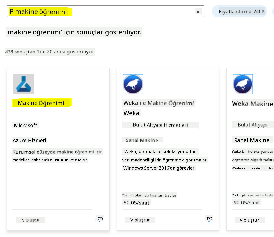

   Oluştur düğmesine tıklayın.

   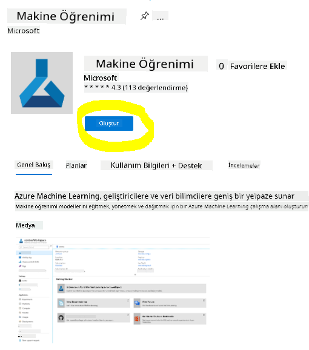

   Ayarları şu şekilde doldurun:
   - Abonelik: Azure aboneliğiniz
   - Kaynak grubu: Bir kaynak grubu oluşturun veya seçin
   - Çalışma alanı adı: Çalışma alanınız için benzersiz bir ad girin
   - Bölge: Size en yakın coğrafi bölgeyi seçin
   - Depolama hesabı: Çalışma alanınız için oluşturulacak varsayılan yeni depolama hesabını not edin
   - Anahtar kasası: Çalışma alanınız için oluşturulacak varsayılan yeni anahtar kasasını not edin
   - Uygulama içgörüleri: Çalışma alanınız için oluşturulacak varsayılan yeni uygulama içgörüleri kaynağını not edin
   - Kapsayıcı kaydı: Yok (bir model ilk kez bir kapsayıcıya dağıtıldığında otomatik olarak oluşturulacaktır)

    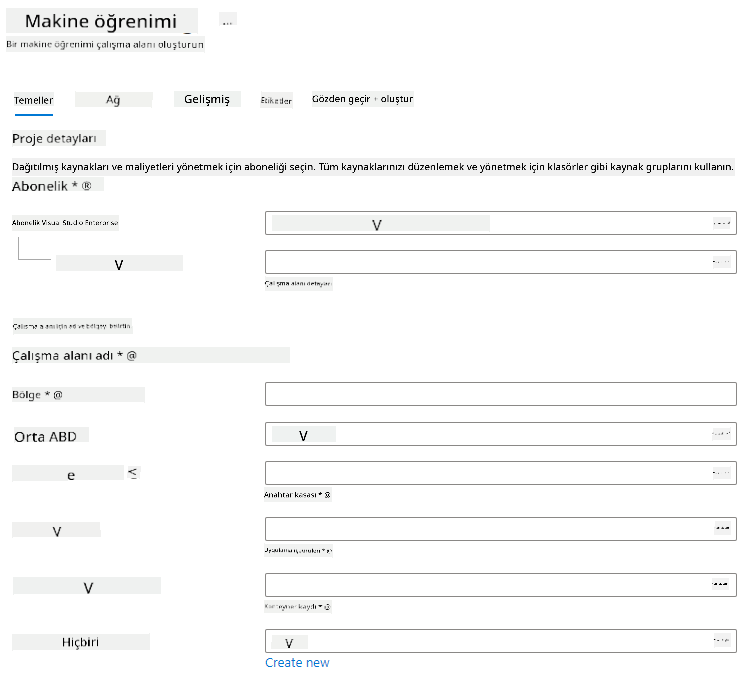

   - İnceleme + oluştur düğmesine ve ardından oluştur düğmesine tıklayın.
3. Çalışma alanınızın oluşturulmasını bekleyin (bu birkaç dakika sürebilir). Daha sonra portalda ona gidin. Makine Öğrenimi Azure hizmeti aracılığıyla bulabilirsiniz.
4. Çalışma alanınızın Genel Bakış sayfasında, Azure Machine Learning stüdyosunu başlatın (veya yeni bir tarayıcı sekmesi açın ve https://ml.azure.com adresine gidin) ve Microsoft hesabınızı kullanarak Azure Machine Learning stüdyosuna giriş yapın. İstendiğinde, Azure dizininizi ve aboneliğinizi ve Azure Machine Learning çalışma alanınızı seçin.
   
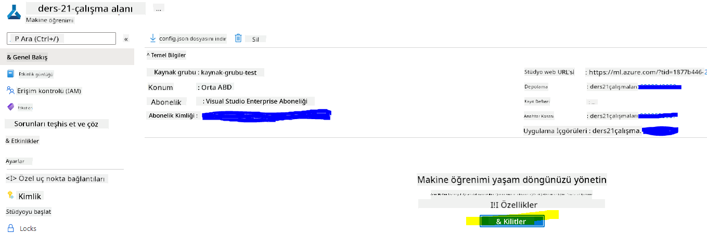

5. Azure Machine Learning stüdyosunda, arayüzdeki çeşitli sayfaları görüntülemek için sol üstteki ☰ simgesini değiştirin. Çalışma alanınızdaki kaynakları yönetmek için bu sayfaları kullanabilirsiniz.

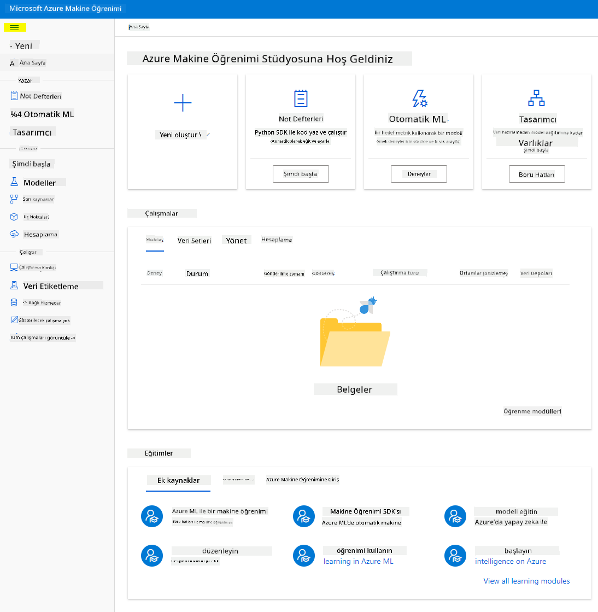

Çalışma alanınızı Azure portalını kullanarak yönetebilirsiniz, ancak veri bilimciler ve Makine Öğrenimi operasyon mühendisleri için Azure Machine Learning Studio, çalışma alanı kaynaklarını yönetmek için daha odaklanmış bir kullanıcı arayüzü sağlar.

### 2.2 Hesaplama Kaynakları

Hesaplama Kaynakları, model eğitimi ve veri keşfi süreçlerini çalıştırabileceğiniz bulut tabanlı kaynaklardır. Oluşturabileceğiniz dört tür hesaplama kaynağı vardır:

- **Hesaplama Örnekleri**: Veri bilimcilerin veri ve modellerle çalışmak için kullanabileceği geliştirme iş istasyonları. Bu, bir Sanal Makine (VM) oluşturmayı ve bir notebook örneği başlatmayı içerir. Daha sonra bir notebook'tan bir hesaplama kümesi çağırarak bir model eğitebilirsiniz.
- **Hesaplama Kümeleri**: Deney kodunun isteğe bağlı işlenmesi için ölçeklenebilir VM kümeleri. Bir model eğitirken buna ihtiyacınız olacak. Hesaplama kümeleri ayrıca özel GPU veya CPU kaynaklarını da kullanabilir.
- **Tahmin Kümeleri**: Eğitilmiş modellerinizi kullanan tahmin hizmetleri için dağıtım hedefleri.
- **Bağlı Hesaplama**: Mevcut Azure hesaplama kaynaklarına, örneğin Sanal Makineler veya Azure Databricks kümelerine bağlantılar.

#### 2.2.1 Hesaplama Kaynaklarınız için Doğru Seçenekleri Seçmek

Bir hesaplama kaynağı oluştururken dikkate alınması gereken bazı önemli faktörler vardır ve bu seçimler kritik kararlar olabilir.

**CPU mu yoksa GPU mu gerekiyor?**

CPU (Merkezi İşlem Birimi), bir bilgisayar programını oluşturan talimatları çalıştıran elektronik devredir. GPU (Grafik İşlem Birimi), grafikle ilgili kodları çok yüksek bir hızda çalıştırabilen özel bir elektronik devredir.

CPU ve GPU mimarisi arasındaki temel fark, CPU'nun geniş bir görev yelpazesini hızlı bir şekilde (CPU saat hızı ile ölçülür) işlemek için tasarlanmış olmasıdır, ancak aynı anda çalıştırılabilecek görevlerin eşzamanlılığı sınırlıdır. GPU'lar paralel hesaplama için tasarlanmıştır ve bu nedenle derin öğrenme görevlerinde çok daha iyidir.

| CPU                                     | GPU                         |
|-----------------------------------------|-----------------------------|
| Daha ucuz                               | Daha pahalı                 |
| Daha düşük eşzamanlılık seviyesi        | Daha yüksek eşzamanlılık seviyesi |
| Derin öğrenme modellerini eğitmede daha yavaş | Derin öğrenme için ideal    |

**Küme Boyutu**

Daha büyük kümeler daha pahalıdır ancak daha iyi yanıt süresi sağlar. Bu nedenle, zamanınız varsa ancak yeterli bütçeniz yoksa küçük bir küme ile başlamalısınız. Tersine, bütçeniz varsa ancak zamanınız sınırlıysa, daha büyük bir küme ile başlamalısınız.

**VM Boyutu**

Zaman ve bütçe kısıtlamalarınıza bağlı olarak, RAM, disk, çekirdek sayısı ve saat hızının boyutunu değiştirebilirsiniz. Bu parametrelerin tümünü artırmak daha maliyetli olacaktır, ancak daha iyi performans sağlayacaktır.

**Adanmış mı yoksa Düşük Öncelikli Örnekler mi?**

Düşük öncelikli bir örnek, kesintiye uğrayabilir anlamına gelir: Temelde, Microsoft Azure bu kaynakları alıp başka bir göreve atayabilir ve böylece bir işi kesintiye uğratabilir. Adanmış bir örnek, yani kesintiye uğramaz, işin sizin izniniz olmadan asla sonlandırılmayacağı anlamına gelir. Bu, zaman ve bütçe arasında başka bir değerlendirme noktasıdır, çünkü kesintiye uğrayabilir örnekler adanmış olanlardan daha ucuzdur.

#### 2.2.2 Bir Hesaplama Kümesi Oluşturma

Daha önce oluşturduğumuz [Azure ML çalışma alanına](https://ml.azure.com/) gidin, hesaplama sekmesine tıklayın ve az önce tartıştığımız farklı hesaplama kaynaklarını (örneğin, hesaplama örnekleri, hesaplama kümeleri, çıkarım kümeleri ve bağlı hesaplama) görebilirsiniz. Bu proje için model eğitimi için bir hesaplama kümesine ihtiyacımız olacak. Studio'da "Hesaplama" menüsüne, ardından "Hesaplama kümesi" sekmesine tıklayın ve bir hesaplama kümesi oluşturmak için "+ Yeni" düğmesine tıklayın.

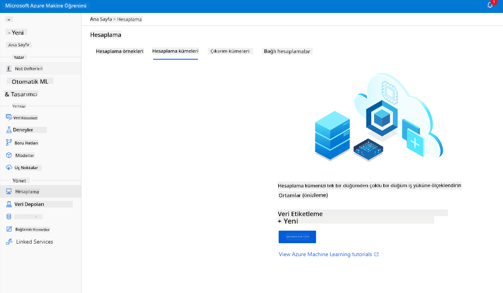

1. Seçeneklerinizi seçin: Adanmış mı yoksa Düşük öncelikli mi, CPU mu GPU mu, VM boyutu ve çekirdek sayısı (bu proje için varsayılan ayarları koruyabilirsiniz).
2. İleri düğmesine tıklayın.


3. Küme için bir hesaplama adı verin.
4. Seçeneklerinizi seçin: Minimum/Maksimum düğüm sayısı, ölçek küçültmeden önceki boşta geçen saniye, SSH erişimi. Minimum düğüm sayısı 0 ise, küme boşta olduğunda para tasarrufu yaparsınız. Maksimum düğüm sayısı ne kadar yüksek olursa, eğitim o kadar kısa sürer. Önerilen maksimum düğüm sayısı 3'tür.  
5. "Oluştur" düğmesine tıklayın. Bu adım birkaç dakika sürebilir.

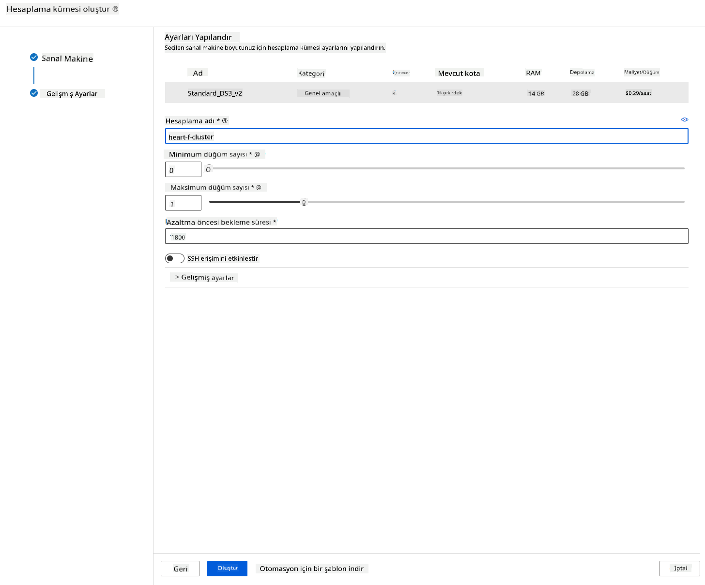

Harika! Artık bir Hesaplama kümesine sahibiz, verileri Azure ML Studio'ya yüklememiz gerekiyor.

### 2.3 Veri Kümesini Yükleme

1. Daha önce oluşturduğumuz [Azure ML çalışma alanına](https://ml.azure.com/) gidin, sol menüde "Veri Kümeleri"ne tıklayın ve bir veri kümesi oluşturmak için "+ Veri Kümesi Oluştur" düğmesine tıklayın. Daha önce indirdiğimiz Kaggle veri kümesini seçerek "Yerel dosyalardan" seçeneğini seçin.
   
   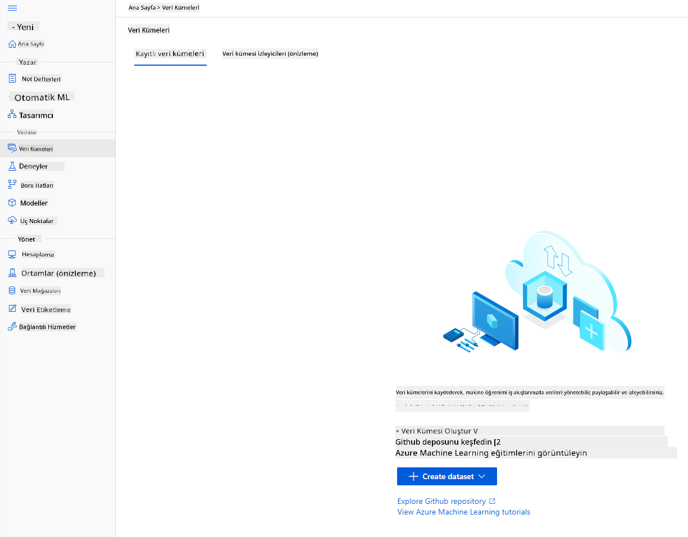

2. Veri kümenize bir ad, tür ve açıklama verin. İleri'ye tıklayın. Verileri dosyalardan yükleyin. İleri'ye tıklayın.
   
   

3. Şemada, aşağıdaki özellikler için veri türünü Boolean olarak değiştirin: anemi, diyabet, yüksek tansiyon, cinsiyet, sigara içme ve ÖLÜM_OLAYI. İleri'ye tıklayın ve Oluştur'a tıklayın.
   
   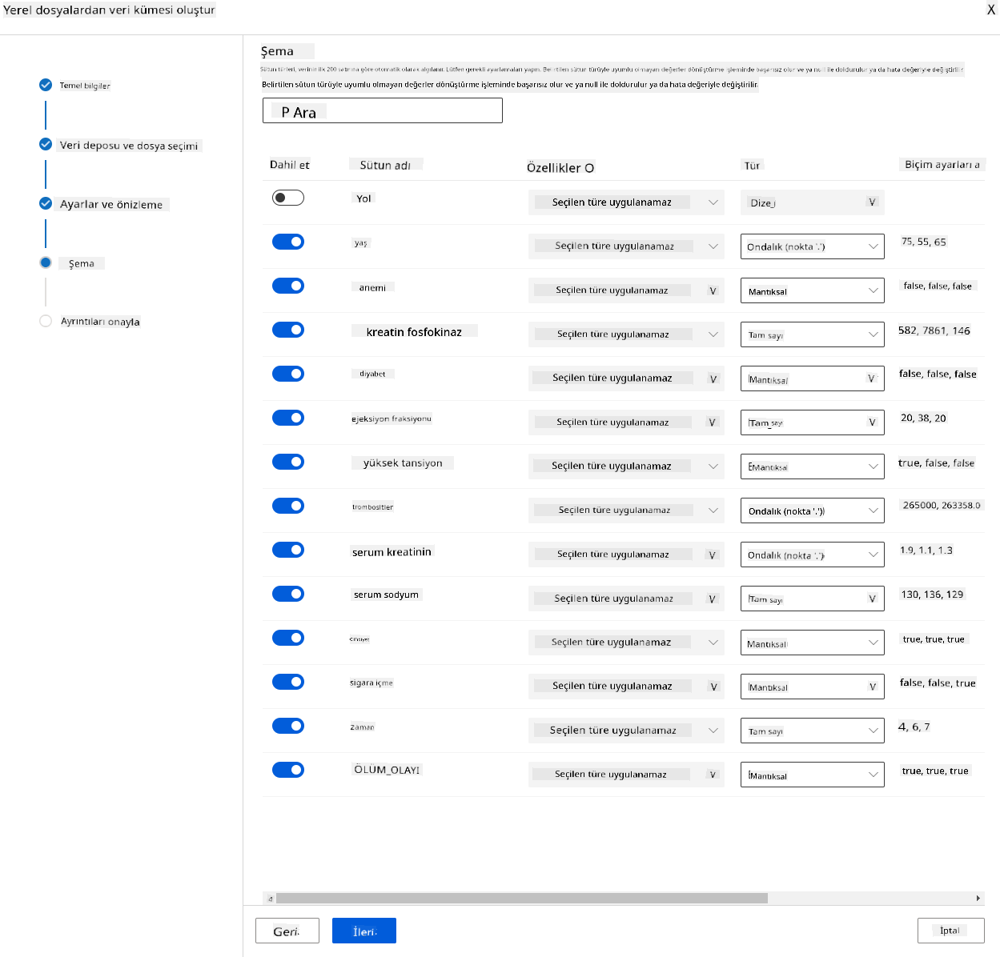

Harika! Artık veri kümesi yerinde ve hesaplama kümesi oluşturuldu, modelin eğitimine başlayabiliriz!

### 2.4 Düşük Kod/Hiç Kod ile AutoML Eğitimi

Geleneksel makine öğrenimi modeli geliştirme, kaynak yoğun, önemli alan bilgisi gerektiren ve düzinelerce modeli üretmek ve karşılaştırmak için zaman alan bir süreçtir. Otomatik makine öğrenimi (AutoML), makine öğrenimi modeli geliştirme sürecindeki zaman alıcı, tekrarlayan görevleri otomatikleştirme sürecidir. Veri bilimciler, analistler ve geliştiricilerin yüksek ölçek, verimlilik ve üretkenlikle ML modelleri oluşturmasına olanak tanır, tüm bunları model kalitesini koruyarak yapar. Üretime hazır ML modellerini elde etme süresini büyük ölçüde azaltır ve bunu büyük bir kolaylık ve verimlilikle sağlar. [Daha fazla bilgi edinin](https://docs.microsoft.com/azure/machine-learning/concept-automated-ml?WT.mc_id=academic-77958-bethanycheum&ocid=AID3041109)

1. Daha önce oluşturduğumuz [Azure ML çalışma alanına](https://ml.azure.com/) gidin, sol menüde "Otomatik ML"ye tıklayın ve az önce yüklediğiniz veri kümesini seçin. İleri'ye tıklayın.

   

2. Yeni bir deney adı, hedef sütun (ÖLÜM_OLAYI) ve oluşturduğumuz hesaplama kümesini girin. İleri'ye tıklayın.
   
   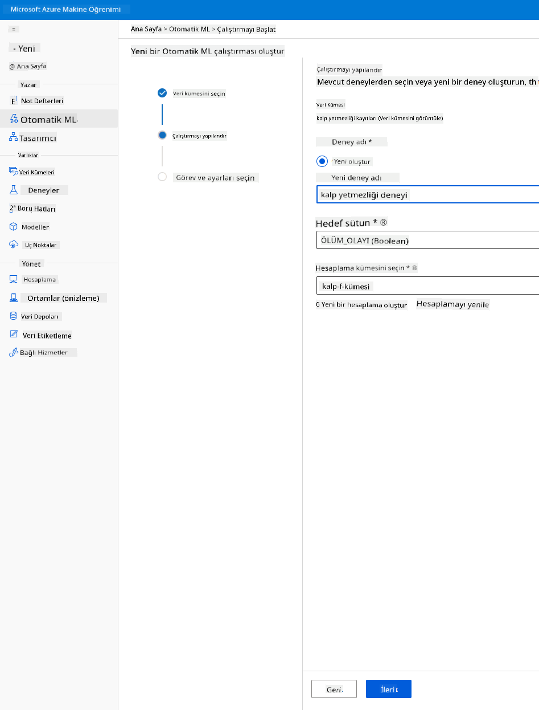

3. "Sınıflandırma"yı seçin ve Bitir'e tıklayın. Bu adım, hesaplama kümenizin boyutuna bağlı olarak 30 dakika ile 1 saat arasında sürebilir.
    
    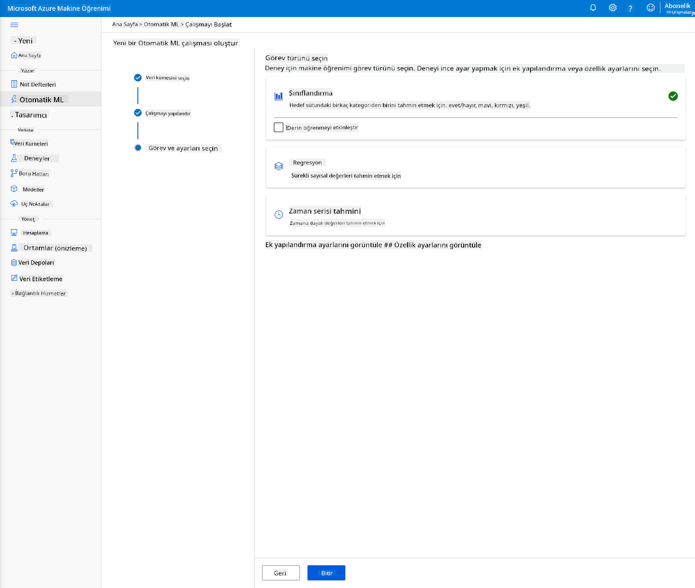

4. Çalışma tamamlandığında, "Otomatik ML" sekmesine tıklayın, çalışmanıza tıklayın ve "En iyi model özeti" kartındaki Algoritmaya tıklayın.
    
    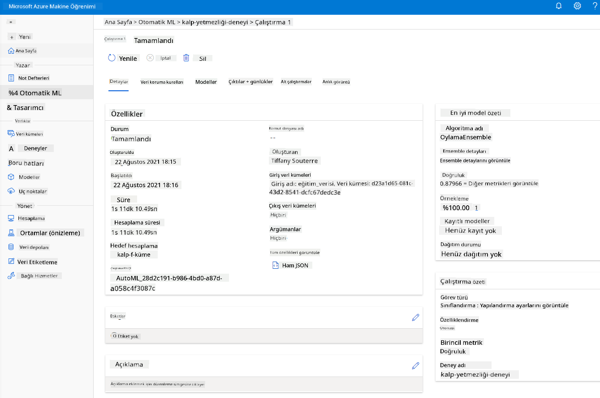

Burada AutoML tarafından oluşturulan en iyi modelin ayrıntılı bir açıklamasını görebilirsiniz. Modeller sekmesinde oluşturulan diğer modelleri de keşfedebilirsiniz. Açıklamalar (önizleme düğmesi) bölümünde modelleri birkaç dakika inceleyin. Kullanmak istediğiniz modeli seçtikten sonra (burada AutoML tarafından seçilen en iyi modeli seçiyoruz), nasıl dağıtılacağını göreceğiz.

## 3. Düşük Kod/Hiç Kod Model Dağıtımı ve Uç Nokta Tüketimi
### 3.1 Model Dağıtımı

Otomatik makine öğrenimi arayüzü, en iyi modeli birkaç adımda bir web hizmeti olarak dağıtmanıza olanak tanır. Dağıtım, modelin yeni verilere dayalı tahminler yapabilmesi ve potansiyel fırsat alanlarını belirleyebilmesi için entegrasyonudur. Bu proje için bir web hizmetine dağıtım, tıbbi uygulamaların modelden yararlanarak hastalarının kalp krizi riskini canlı olarak tahmin edebilmesini sağlar.

En iyi model açıklamasında "Dağıt" düğmesine tıklayın.
    
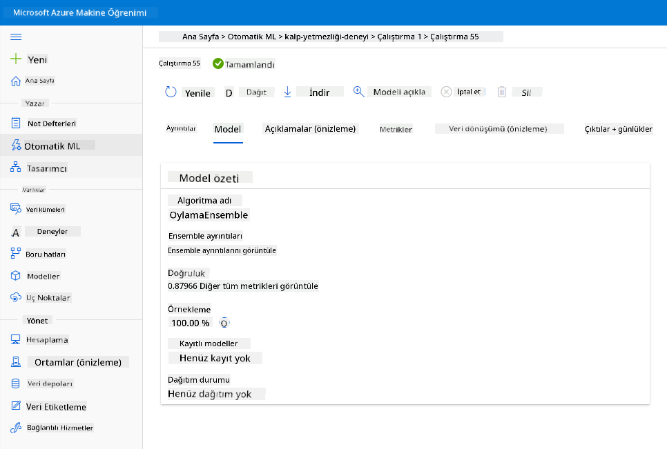

15. Bir ad, açıklama, hesaplama türü (Azure Container Instance), kimlik doğrulamasını etkinleştirin ve Dağıt'a tıklayın. Bu adım yaklaşık 20 dakika sürebilir. Dağıtım süreci, modeli kaydetme, kaynakları oluşturma ve web hizmeti için yapılandırmayı içerir. Dağıtım durumu altında bir durum mesajı görünür. Dağıtım durumunu kontrol etmek için periyodik olarak Yenile'ye tıklayın. Durum "Sağlıklı" olduğunda dağıtılmış ve çalışıyor olacaktır.

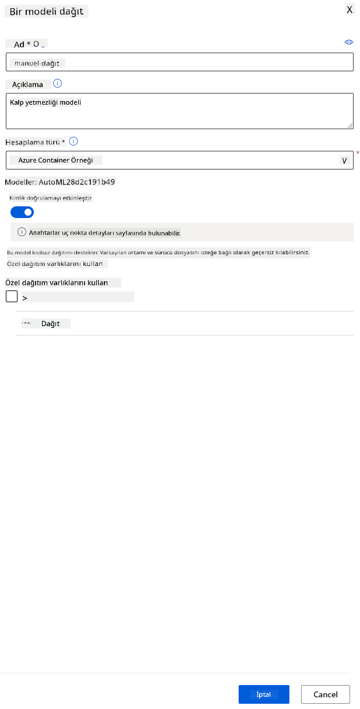

16. Dağıtım tamamlandığında, Uç Nokta sekmesine tıklayın ve az önce dağıttığınız uç noktaya tıklayın. Burada uç nokta hakkında bilmeniz gereken tüm ayrıntıları bulabilirsiniz.


Harika! Artık bir model dağıttık, uç noktanın tüketimine başlayabiliriz.

### 3.2 Uç Nokta Tüketimi

"Tüket" sekmesine tıklayın. Burada tüketim seçeneğinde REST uç noktası ve bir Python betiği bulabilirsiniz. Python kodunu okumak için biraz zaman ayırın.

Bu betik doğrudan yerel makinenizden çalıştırılabilir ve uç noktanızı tüketir.

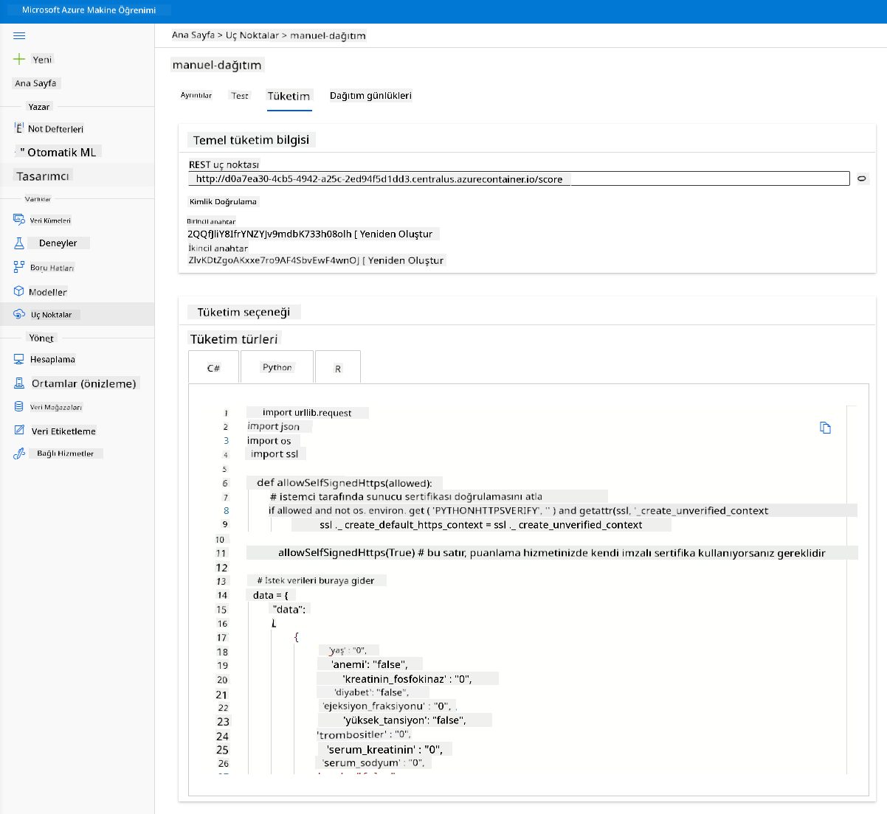

Bu iki kod satırını kontrol etmek için bir dakika ayırın:

```python
url = 'http://98e3715f-xxxx-xxxx-xxxx-9ec22d57b796.centralus.azurecontainer.io/score'
api_key = '' # Replace this with the API key for the web service
```
`url` değişkeni, tüketim sekmesinde bulunan REST uç noktasıdır ve `api_key` değişkeni, tüketim sekmesinde bulunan birincil anahtardır (yalnızca kimlik doğrulamayı etkinleştirdiyseniz). Betik, uç noktayı bu şekilde tüketebilir.

18. Betiği çalıştırdığınızda şu çıktıyı görmelisiniz:
    ```python
    b'"{\\"result\\": [true]}"'
    ```
Bu, verilen veriler için kalp yetmezliği tahmininin doğru olduğu anlamına gelir. Bu mantıklıdır çünkü betikte otomatik olarak oluşturulan verilere daha yakından bakarsanız, her şey varsayılan olarak 0 ve yanlış durumdadır. Verileri şu örnek girişle değiştirebilirsiniz:

```python
data = {
    "data":
    [
        {
            'age': "0",
            'anaemia': "false",
            'creatinine_phosphokinase': "0",
            'diabetes': "false",
            'ejection_fraction': "0",
            'high_blood_pressure': "false",
            'platelets': "0",
            'serum_creatinine': "0",
            'serum_sodium': "0",
            'sex': "false",
            'smoking': "false",
            'time': "0",
        },
        {
            'age': "60",
            'anaemia': "false",
            'creatinine_phosphokinase': "500",
            'diabetes': "false",
            'ejection_fraction': "38",
            'high_blood_pressure': "false",
            'platelets': "260000",
            'serum_creatinine': "1.40",
            'serum_sodium': "137",
            'sex': "false",
            'smoking': "false",
            'time': "130",
        },
    ],
}
```
Betik şu sonucu döndürmelidir:
    ```python
    b'"{\\"result\\": [true, false]}"'
    ```

Tebrikler! Dağıtılan modeli tükettiniz ve Azure ML'de eğittiniz!

> **_NOT:_** Projeyi tamamladıktan sonra tüm kaynakları silmeyi unutmayın.
## 🚀 Meydan Okuma

AutoML tarafından oluşturulan en iyi modeller için model açıklamalarına ve ayrıntılarına yakından bakın. En iyi modelin diğerlerinden neden daha iyi olduğunu anlamaya çalışın. Hangi algoritmalar karşılaştırıldı? Aralarındaki farklar nelerdir? Bu durumda en iyi model neden daha iyi performans gösteriyor?

## [Ders sonrası test](https://ff-quizzes.netlify.app/en/ds/)

## Gözden Geçirme ve Kendi Kendine Çalışma

Bu derste, bulutta düşük kod/hiç kod yöntemiyle kalp yetmezliği riskini tahmin etmek için bir modeli nasıl eğiteceğinizi, dağıtacağınızı ve tüketeceğinizi öğrendiniz. Henüz yapmadıysanız, AutoML tarafından oluşturulan en iyi modeller için model açıklamalarına daha derinlemesine dalın ve en iyi modelin diğerlerinden neden daha iyi olduğunu anlamaya çalışın.

Düşük kod/hiç kod AutoML hakkında daha fazla bilgi edinmek için bu [belgeyi](https://docs.microsoft.com/azure/machine-learning/tutorial-first-experiment-automated-ml?WT.mc_id=academic-77958-bethanycheum&ocid=AID3041109) okuyabilirsiniz.

## Ödev

[Azure ML'de Düşük Kod/Hiç Kod Veri Bilimi Projesi](assignment.md)

---

**Feragatname**:  
Bu belge, AI çeviri hizmeti [Co-op Translator](https://github.com/Azure/co-op-translator) kullanılarak çevrilmiştir. Doğruluğu sağlamak için çaba göstersek de, otomatik çevirilerin hata veya yanlışlık içerebileceğini lütfen unutmayın. Belgenin orijinal dili, yetkili kaynak olarak kabul edilmelidir. Kritik bilgiler için profesyonel insan çevirisi önerilir. Bu çevirinin kullanımından kaynaklanan yanlış anlamalar veya yanlış yorumlamalar için sorumluluk kabul etmiyoruz.