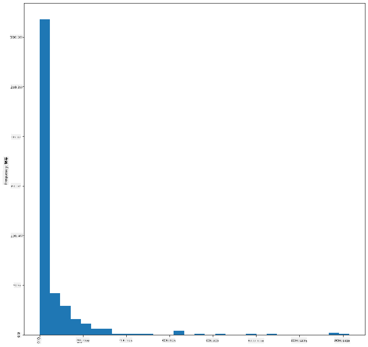
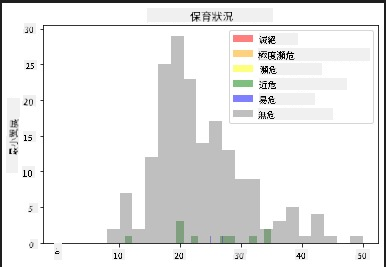
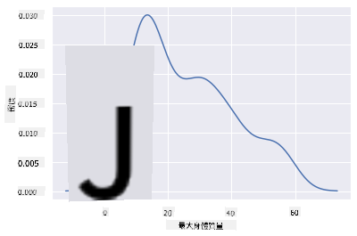
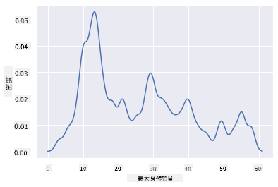
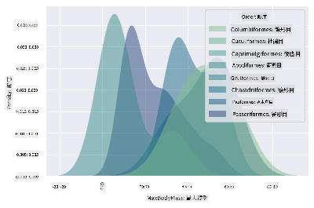

<!--
CO_OP_TRANSLATOR_METADATA:
{
  "original_hash": "02ce904bc1e2bfabb7dc05c25aae375c",
  "translation_date": "2025-09-04T12:36:37+00:00",
  "source_file": "3-Data-Visualization/10-visualization-distributions/README.md",
  "language_code": "tw"
}
-->
# 視覺化分佈

| 繪製的速記筆記](../../sketchnotes/10-Visualizing-Distributions.png)|
|:---:|
| 視覺化分佈 - _速記筆記由 [@nitya](https://twitter.com/nitya) 繪製_ |

在上一課中，你學到了一些關於明尼蘇達州鳥類數據集的有趣事實。透過視覺化異常值，你發現了一些錯誤的數據，並且檢視了不同鳥類分類在最大長度上的差異。

## [課前測驗](https://purple-hill-04aebfb03.1.azurestaticapps.net/quiz/18)
## 探索鳥類數據集

另一種深入了解數據的方法是檢視其分佈，也就是數據沿著某個軸的排列方式。例如，你可能想了解這個數據集中鳥類的最大翼展或最大體重的分佈情況。

讓我們來探索一些關於這個數據集中分佈的事實。在本課文件夾根目錄中的 _notebook.ipynb_ 文件中，導入 Pandas、Matplotlib 和你的數據：

```python
import pandas as pd
import matplotlib.pyplot as plt
birds = pd.read_csv('../../data/birds.csv')
birds.head()
```

|      | 名稱                         | 學名                   | 分類                  | 目          | 科       | 屬         | 保育狀態           | 最小長度 | 最大長度 | 最小體重   | 最大體重   | 最小翼展   | 最大翼展   |
| ---: | :--------------------------- | :--------------------- | :-------------------- | :----------- | :------- | :---------- | :----------------- | --------: | --------: | ----------: | ----------: | ----------: | ----------: |
|    0 | 黑腹樹鴨                     | Dendrocygna autumnalis | 鴨/鵝/水禽            | 雁形目       | 鴨科     | 樹鴨屬     | LC                 |        47 |        56 |         652 |        1020 |          76 |          94 |
|    1 | 棕樹鴨                       | Dendrocygna bicolor    | 鴨/鵝/水禽            | 雁形目       | 鴨科     | 樹鴨屬     | LC                 |        45 |        53 |         712 |        1050 |          85 |          93 |
|    2 | 雪鵝                         | Anser caerulescens     | 鴨/鵝/水禽            | 雁形目       | 鴨科     | 雁屬       | LC                 |        64 |        79 |        2050 |        4050 |         135 |         165 |
|    3 | 羅斯鵝                       | Anser rossii           | 鴨/鵝/水禽            | 雁形目       | 鴨科     | 雁屬       | LC                 |      57.3 |        64 |        1066 |        1567 |         113 |         116 |
|    4 | 大白額雁                     | Anser albifrons        | 鴨/鵝/水禽            | 雁形目       | 鴨科     | 雁屬       | LC                 |        64 |        81 |        1930 |        3310 |         130 |         165 |

通常，你可以快速檢視數據的分佈方式，方法是使用像上一課中那樣的散點圖：

```python
birds.plot(kind='scatter',x='MaxLength',y='Order',figsize=(12,8))

plt.title('Max Length per Order')
plt.ylabel('Order')
plt.xlabel('Max Length')

plt.show()
```


這提供了每個鳥類目身體長度的一般分佈概況，但這並不是顯示真實分佈的最佳方式。這項任務通常是透過建立直方圖來完成的。

## 使用直方圖

Matplotlib 提供了非常好的方法來使用直方圖視覺化數據分佈。這種圖表類似於柱狀圖，分佈可以透過柱狀的升降來觀察。要建立直方圖，你需要數值型數據。要建立直方圖，你可以繪製一個圖表，將類型定義為 'hist' 以表示直方圖。此圖表顯示了整個數據集的最大體重分佈。透過將提供的數據陣列分成較小的區間，它可以顯示數據值的分佈：

```python
birds['MaxBodyMass'].plot(kind = 'hist', bins = 10, figsize = (12,12))
plt.show()
```


如你所見，這個數據集中的 400 多種鳥類大多數的最大體重都低於 2000。透過將 `bins` 參數設置為更高的數字，例如 30，可以獲得更多的洞察：

```python
birds['MaxBodyMass'].plot(kind = 'hist', bins = 30, figsize = (12,12))
plt.show()
```


此圖表顯示了更細緻的分佈方式。透過確保僅選擇特定範圍內的數據，可以建立一個不那麼偏向左側的圖表：

篩選數據以僅獲取體重低於 60 的鳥類，並顯示 40 個 `bins`：

```python
filteredBirds = birds[(birds['MaxBodyMass'] > 1) & (birds['MaxBodyMass'] < 60)]      
filteredBirds['MaxBodyMass'].plot(kind = 'hist',bins = 40,figsize = (12,12))
plt.show()     
```


✅ 嘗試其他篩選條件和數據點。若要查看數據的完整分佈，移除 `['MaxBodyMass']` 篩選器以顯示標籤分佈。

直方圖還提供了一些漂亮的顏色和標籤增強功能可以嘗試：

建立一個 2D 直方圖來比較兩個分佈之間的關係。讓我們比較 `MaxBodyMass` 和 `MaxLength`。Matplotlib 提供了一種內建方式來透過更亮的顏色顯示收斂：

```python
x = filteredBirds['MaxBodyMass']
y = filteredBirds['MaxLength']

fig, ax = plt.subplots(tight_layout=True)
hist = ax.hist2d(x, y)
```
沿著預期軸線，這兩個元素之間似乎存在預期的相關性，其中有一個特別強的收斂點：


直方圖對於數值型數據默認效果很好。如果你需要根據文字數據查看分佈該怎麼辦？

## 使用文字數據探索數據集的分佈

此數據集還包括關於鳥類分類及其屬、種、科以及保育狀態的良好信息。讓我們深入了解這些保育信息。鳥類根據其保育狀態的分佈是什麼樣的？

> ✅ 在數據集中，使用了幾個縮寫來描述保育狀態。這些縮寫來自 [IUCN 紅色名錄分類](https://www.iucnredlist.org/)，該組織記錄了物種的狀態。
> 
> - CR: 極危
> - EN: 瀕危
> - EX: 滅絕
> - LC: 無危
> - NT: 近危
> - VU: 易危

這些是基於文字的值，因此你需要進行轉換以建立直方圖。使用篩選後的鳥類數據框，顯示其保育狀態及其最小翼展。你看到了什麼？

```python
x1 = filteredBirds.loc[filteredBirds.ConservationStatus=='EX', 'MinWingspan']
x2 = filteredBirds.loc[filteredBirds.ConservationStatus=='CR', 'MinWingspan']
x3 = filteredBirds.loc[filteredBirds.ConservationStatus=='EN', 'MinWingspan']
x4 = filteredBirds.loc[filteredBirds.ConservationStatus=='NT', 'MinWingspan']
x5 = filteredBirds.loc[filteredBirds.ConservationStatus=='VU', 'MinWingspan']
x6 = filteredBirds.loc[filteredBirds.ConservationStatus=='LC', 'MinWingspan']

kwargs = dict(alpha=0.5, bins=20)

plt.hist(x1, **kwargs, color='red', label='Extinct')
plt.hist(x2, **kwargs, color='orange', label='Critically Endangered')
plt.hist(x3, **kwargs, color='yellow', label='Endangered')
plt.hist(x4, **kwargs, color='green', label='Near Threatened')
plt.hist(x5, **kwargs, color='blue', label='Vulnerable')
plt.hist(x6, **kwargs, color='gray', label='Least Concern')

plt.gca().set(title='Conservation Status', ylabel='Min Wingspan')
plt.legend();
```



最小翼展與保育狀態之間似乎沒有良好的相關性。使用此方法測試數據集中的其他元素。你也可以嘗試不同的篩選條件。你是否發現任何相關性？

## 密度圖

你可能注意到到目前為止我們看到的直方圖是“階梯式”的，並未以平滑的弧線呈現。若要顯示更平滑的密度圖，你可以嘗試使用密度圖。

若要使用密度圖，請熟悉一個新的繪圖庫 [Seaborn](https://seaborn.pydata.org/generated/seaborn.kdeplot.html)。

載入 Seaborn，嘗試建立一個基本的密度圖：

```python
import seaborn as sns
import matplotlib.pyplot as plt
sns.kdeplot(filteredBirds['MinWingspan'])
plt.show()
```


你可以看到此圖表回應了之前的最小翼展數據；它只是稍微平滑了一些。根據 Seaborn 的文檔，“相較於直方圖，KDE 可以生成一個更少雜亂且更易於解釋的圖表，尤其是在繪製多個分佈時。但如果基礎分佈是有界的或不平滑的，它可能會引入失真。與直方圖一樣，表示的質量也取決於良好平滑參數的選擇。” [來源](https://seaborn.pydata.org/generated/seaborn.kdeplot.html)。換句話說，異常值一如既往地會使你的圖表表現不佳。

如果你想重新檢視第二個圖表中那條鋸齒狀的 MaxBodyMass 線，你可以使用此方法非常好地將其平滑化：

```python
sns.kdeplot(filteredBirds['MaxBodyMass'])
plt.show()
```


如果你想要一條平滑但不過於平滑的線，請編輯 `bw_adjust` 參數：

```python
sns.kdeplot(filteredBirds['MaxBodyMass'], bw_adjust=.2)
plt.show()
```


✅ 閱讀此類圖表可用的參數並進行實驗！

此類圖表提供了非常具有解釋性的視覺化效果。例如，透過幾行代碼，你可以顯示每個鳥類目最大體重的密度：

```python
sns.kdeplot(
   data=filteredBirds, x="MaxBodyMass", hue="Order",
   fill=True, common_norm=False, palette="crest",
   alpha=.5, linewidth=0,
)
```



你還可以在一個圖表中映射多個變量的密度。測試鳥類的最大長度和最小長度與其保育狀態的關係：

```python
sns.kdeplot(data=filteredBirds, x="MinLength", y="MaxLength", hue="ConservationStatus")
```


或許值得研究根據鳥類長度的“易危”群體是否具有意義。

## 🚀 挑戰

直方圖是一種比基本散點圖、柱狀圖或折線圖更為複雜的圖表類型。上網搜索直方圖的良好使用範例。它們如何使用、展示了什麼，以及它們通常在哪些領域或研究範疇中使用？

## [課後測驗](https://ff-quizzes.netlify.app/en/ds/)

## 回顧與自學

在本課中，你使用了 Matplotlib 並開始使用 Seaborn 來顯示更為複雜的圖表。研究 Seaborn 中的 `kdeplot`，這是一種“在一個或多個維度上的連續概率密度曲線”。閱讀 [文檔](https://seaborn.pydata.org/generated/seaborn.kdeplot.html) 以了解其工作原理。

## 作業

[應用你的技能](assignment.md)

---

**免責聲明**：  
本文件使用 AI 翻譯服務 [Co-op Translator](https://github.com/Azure/co-op-translator) 進行翻譯。我們致力於提供準確的翻譯，但請注意，自動翻譯可能包含錯誤或不準確之處。應以原始語言的文件作為權威來源。對於關鍵資訊，建議尋求專業人工翻譯。我們對因使用此翻譯而產生的任何誤解或錯誤解讀概不負責。