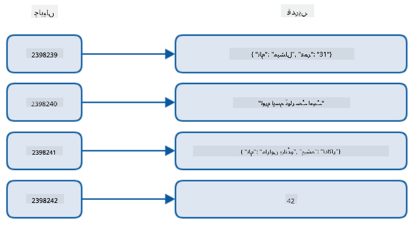
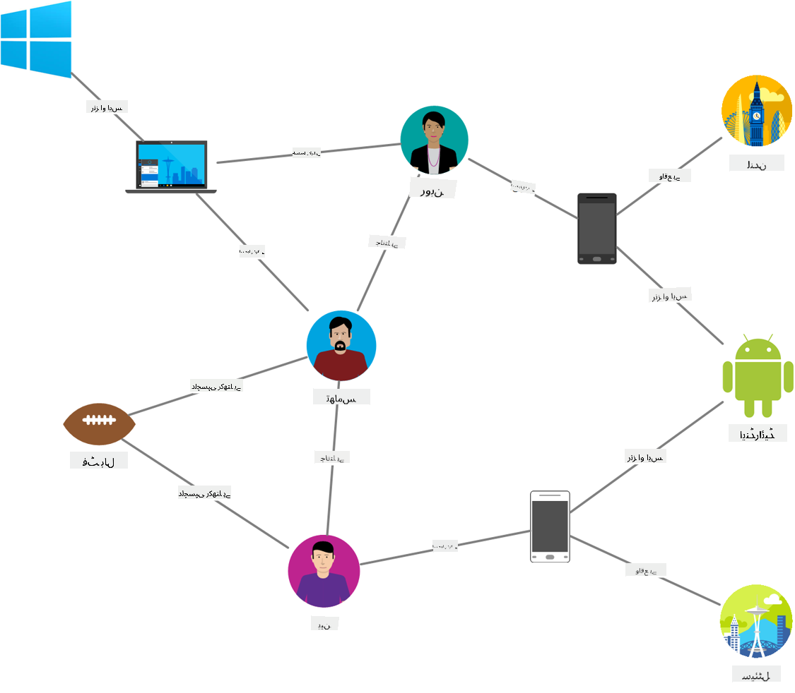
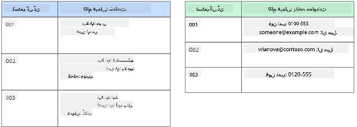
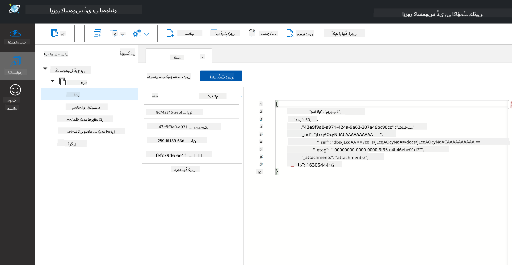

<!--
CO_OP_TRANSLATOR_METADATA:
{
  "original_hash": "54c5a1c74aecb69d2f9099300a4b7eea",
  "translation_date": "2025-09-04T15:56:01+00:00",
  "source_file": "2-Working-With-Data/06-non-relational/README.md",
  "language_code": "ur"
}
-->
# غیر تعلقاتی ڈیٹا کے ساتھ کام کرنا

| کی طرف سے اسکیچ نوٹ ](../../sketchnotes/06-NoSQL.png)|
|:---:|
|NoSQL ڈیٹا کے ساتھ کام کرنا - _[@nitya](https://twitter.com/nitya) کی طرف سے اسکیچ نوٹ_ |

## [لیکچر سے پہلے کا کوئز](https://purple-hill-04aebfb03.1.azurestaticapps.net/quiz/10)

ڈیٹا صرف تعلقاتی ڈیٹا بیس تک محدود نہیں ہے۔ یہ سبق غیر تعلقاتی ڈیٹا پر مرکوز ہے اور اسپریڈشیٹس اور NoSQL کی بنیادی باتوں کا احاطہ کرے گا۔

## اسپریڈشیٹس

اسپریڈشیٹس ڈیٹا کو ذخیرہ کرنے اور اس کی جانچ کرنے کا ایک مقبول طریقہ ہیں کیونکہ اسے ترتیب دینے اور شروع کرنے میں کم محنت درکار ہوتی ہے۔ اس سبق میں آپ اسپریڈشیٹ کے بنیادی اجزاء، فارمولے اور فنکشنز کے بارے میں سیکھیں گے۔ مثالیں مائیکروسافٹ ایکسل کے ساتھ دکھائی جائیں گی، لیکن زیادہ تر حصے اور موضوعات دوسرے اسپریڈشیٹ سافٹ ویئر کے مقابلے میں ملتے جلتے نام اور مراحل رکھیں گے۔


اسپریڈشیٹ ایک فائل ہے اور کمپیوٹر، ڈیوائس، یا کلاؤڈ بیسڈ فائل سسٹم کے فائل سسٹم میں قابل رسائی ہوگی۔ سافٹ ویئر خود براؤزر بیسڈ ہو سکتا ہے یا ایک ایپلیکیشن جو کمپیوٹر پر انسٹال کی جانی چاہیے یا ایپ کے طور پر ڈاؤن لوڈ کی جانی چاہیے۔ ایکسل میں ان فائلوں کو **ورک بکس** کے طور پر بھی بیان کیا جاتا ہے اور یہ اصطلاح اس سبق کے باقی حصے میں استعمال کی جائے گی۔

ایک ورک بک میں ایک یا زیادہ **ورک شیٹس** ہوتی ہیں، جہاں ہر ورک شیٹ کو ٹیبز کے ذریعے لیبل کیا جاتا ہے۔ ورک شیٹ کے اندر مستطیلیں ہوتی ہیں جنہیں **سیلز** کہا جاتا ہے، جو اصل ڈیٹا پر مشتمل ہوتی ہیں۔ ایک سیل قطار اور کالم کے چوراہے پر ہوتا ہے، جہاں کالم حروف تہجی کے حروف سے لیبل کیے جاتے ہیں اور قطاریں عددی طور پر لیبل کی جاتی ہیں۔ کچھ اسپریڈشیٹس میں پہلے چند قطاروں میں ہیڈرز ہوتے ہیں جو سیل میں موجود ڈیٹا کو بیان کرتے ہیں۔

ایکسل ورک بک کے ان بنیادی عناصر کے ساتھ، ہم [مائیکروسافٹ ٹیمپلیٹس](https://templates.office.com/) سے ایک انوینٹری پر مرکوز مثال استعمال کریں گے تاکہ اسپریڈشیٹ کے کچھ اضافی حصوں کا جائزہ لیا جا سکے۔

### انوینٹری کا انتظام کرنا

"InventoryExample" نامی اسپریڈشیٹ فائل انوینٹری میں موجود اشیاء کی فارمیٹ شدہ اسپریڈشیٹ ہے جس میں تین ورک شیٹس ہیں، جہاں ٹیبز کو "Inventory List"، "Inventory Pick List" اور "Bin Lookup" کے طور پر لیبل کیا گیا ہے۔ انوینٹری لسٹ ورک شیٹ کی قطار 4 ہیڈر ہے، جو ہیڈر کالم میں ہر سیل کی قدر کو بیان کرتی ہے۔


ایسے مواقع ہوتے ہیں جہاں ایک سیل اپنی قدر پیدا کرنے کے لیے دوسرے سیلز کی قدروں پر منحصر ہوتا ہے۔ انوینٹری لسٹ اسپریڈشیٹ اپنی انوینٹری میں موجود ہر آئٹم کی لاگت کو ٹریک کرتی ہے، لیکن اگر ہمیں انوینٹری میں موجود ہر چیز کی قدر جاننے کی ضرورت ہو تو کیا ہوگا؟ [**فارمولے**](https://support.microsoft.com/en-us/office/overview-of-formulas-34519a4e-1e8d-4f4b-84d4-d642c4f63263) سیل ڈیٹا پر کارروائی کرتے ہیں اور اس مثال میں انوینٹری کی لاگت کا حساب لگانے کے لیے استعمال کیے جاتے ہیں۔ اس اسپریڈشیٹ نے انوینٹری ویلیو کالم میں ایک فارمولہ استعمال کیا ہے تاکہ مقدار کو QTY ہیڈر کے تحت اور اس کی لاگت کو COST ہیڈر کے تحت سیلز کے ذریعے ضرب دے کر ہر آئٹم کی قدر کا حساب لگایا جا سکے۔ کسی سیل پر ڈبل کلک کرنے یا اسے نمایاں کرنے سے فارمولہ ظاہر ہوگا۔ آپ دیکھیں گے کہ فارمولے ایک مساوی نشان سے شروع ہوتے ہیں، اس کے بعد حساب یا آپریشن ہوتا ہے۔


ہم انوینٹری ویلیو کی تمام قدروں کو شامل کرنے کے لیے ایک اور فارمولہ استعمال کر سکتے ہیں تاکہ اس کی کل قدر حاصل کی جا سکے۔ یہ ہر سیل کو شامل کرکے حساب لگایا جا سکتا ہے، لیکن یہ ایک محنت طلب کام ہو سکتا ہے۔ ایکسل میں [**فنکشنز**](https://support.microsoft.com/en-us/office/sum-function-043e1c7d-7726-4e80-8f32-07b23e057f89) ہیں، یا سیل قدروں پر حساب لگانے کے لیے پہلے سے طے شدہ فارمولے۔ فنکشنز کو دلائل کی ضرورت ہوتی ہے، جو حساب لگانے کے لیے درکار قدریں ہوتی ہیں۔ جب فنکشنز کو ایک سے زیادہ دلائل کی ضرورت ہوتی ہے، تو انہیں ایک خاص ترتیب میں درج کرنے کی ضرورت ہوگی ورنہ فنکشن صحیح قدر کا حساب نہیں لگا سکتا۔ اس مثال میں SUM فنکشن استعمال کیا گیا ہے، اور انوینٹری ویلیو پر موجود قدروں کو کل پیدا کرنے کے لیے دلیل کے طور پر استعمال کیا گیا ہے جو قطار 3، کالم B کے تحت درج ہے (جسے B3 بھی کہا جاتا ہے)۔

## NoSQL

NoSQL ایک چھتری اصطلاح ہے جو غیر تعلقاتی ڈیٹا کو ذخیرہ کرنے کے مختلف طریقوں کو بیان کرتی ہے اور اسے "غیر-SQL"، "غیر تعلقاتی" یا "صرف SQL نہیں" کے طور پر سمجھا جا سکتا ہے۔ اس قسم کے ڈیٹا بیس سسٹمز کو 4 اقسام میں تقسیم کیا جا سکتا ہے۔


> [Michał Białecki Blog](https://www.michalbialecki.com/2018/03/18/azure-cosmos-db-key-value-database-cloud/) سے ماخذ

[کلیدی-قدر](https://docs.microsoft.com/en-us/azure/architecture/data-guide/big-data/non-relational-data#keyvalue-data-stores) ڈیٹا بیس منفرد کلیدوں کو جوڑتے ہیں، جو ایک منفرد شناخت کنندہ ہوتا ہے جو ایک قدر سے وابستہ ہوتا ہے۔ یہ جوڑے ایک [ہیش ٹیبل](https://www.hackerearth.com/practice/data-structures/hash-tables/basics-of-hash-tables/tutorial/) کے ذریعے ذخیرہ کیے جاتے ہیں جس میں ایک مناسب ہیشنگ فنکشن ہوتا ہے۔


> [Microsoft](https://docs.microsoft.com/en-us/azure/cosmos-db/graph/graph-introduction#graph-database-by-example) سے ماخذ

[گراف](https://docs.microsoft.com/en-us/azure/architecture/data-guide/big-data/non-relational-data#graph-data-stores) ڈیٹا بیس ڈیٹا میں تعلقات کو بیان کرتے ہیں اور نوڈز اور ایجز کے مجموعے کے طور پر پیش کیے جاتے ہیں۔ ایک نوڈ ایک ہستی کی نمائندگی کرتا ہے، کچھ ایسا جو حقیقی دنیا میں موجود ہوتا ہے جیسے ایک طالب علم یا بینک اسٹیٹمنٹ۔ ایجز دو ہستیوں کے درمیان تعلقات کی نمائندگی کرتے ہیں۔ ہر نوڈ اور ایج میں اضافی معلومات فراہم کرنے کے لیے پراپرٹیز ہوتی ہیں۔



[کالمی](https://docs.microsoft.com/en-us/azure/architecture/data-guide/big-data/non-relational-data#columnar-data-stores) ڈیٹا اسٹورز ڈیٹا کو کالمز اور قطاروں میں منظم کرتے ہیں جیسے تعلقاتی ڈیٹا ڈھانچہ لیکن ہر کالم کو گروپس میں تقسیم کیا جاتا ہے جنہیں کالم فیملی کہا جاتا ہے، جہاں ایک کالم کے تحت تمام ڈیٹا متعلقہ ہوتا ہے اور اسے ایک یونٹ میں بازیافت اور تبدیل کیا جا سکتا ہے۔

### Azure Cosmos DB کے ساتھ دستاویزی ڈیٹا اسٹورز

[دستاویزی](https://docs.microsoft.com/en-us/azure/architecture/data-guide/big-data/non-relational-data#document-data-stores) ڈیٹا اسٹورز کلیدی-قدر ڈیٹا اسٹور کے تصور پر مبنی ہوتے ہیں اور فیلڈز اور اشیاء کے سلسلے پر مشتمل ہوتے ہیں۔ اس سیکشن میں Cosmos DB ایمولیٹر کے ساتھ دستاویزی ڈیٹا بیسز کو دریافت کیا جائے گا۔

Cosmos DB ڈیٹا بیس "صرف SQL نہیں" کی تعریف پر پورا اترتا ہے، جہاں Cosmos DB کا دستاویزی ڈیٹا بیس ڈیٹا کو استفسار کرنے کے لیے SQL پر انحصار کرتا ہے۔ [پچھلا سبق](../05-relational-databases/README.md) SQL پر زبان کی بنیادی باتوں کا احاطہ کرتا ہے، اور ہم یہاں دستاویزی ڈیٹا بیس پر کچھ وہی استفسارات لاگو کر سکیں گے۔ ہم Cosmos DB ایمولیٹر استعمال کریں گے، جو ہمیں ایک کمپیوٹر پر مقامی طور پر ایک دستاویزی ڈیٹا بیس بنانے اور دریافت کرنے کی اجازت دیتا ہے۔ ایمولیٹر کے بارے میں مزید پڑھیں [یہاں](https://docs.microsoft.com/en-us/azure/cosmos-db/local-emulator?tabs=ssl-netstd21)۔

ایک دستاویز فیلڈز اور آبجیکٹ قدروں کا مجموعہ ہے، جہاں فیلڈز بیان کرتے ہیں کہ آبجیکٹ قدر کیا نمائندگی کرتی ہے۔ نیچے ایک دستاویز کی مثال دی گئی ہے۔

```json
{
    "firstname": "Eva",
    "age": 44,
    "id": "8c74a315-aebf-4a16-bb38-2430a9896ce5",
    "_rid": "bHwDAPQz8s0BAAAAAAAAAA==",
    "_self": "dbs/bHwDAA==/colls/bHwDAPQz8s0=/docs/bHwDAPQz8s0BAAAAAAAAAA==/",
    "_etag": "\"00000000-0000-0000-9f95-010a691e01d7\"",
    "_attachments": "attachments/",
    "_ts": 1630544034
}
```

اس دستاویز میں دلچسپی کے فیلڈز ہیں: `firstname`, `id`, اور `age`۔ باقی فیلڈز جو انڈر سکور کے ساتھ ہیں Cosmos DB کے ذریعے تیار کیے گئے تھے۔

#### Cosmos DB ایمولیٹر کے ساتھ ڈیٹا دریافت کرنا

آپ ایمولیٹر کو [ونڈوز کے لیے یہاں](https://aka.ms/cosmosdb-emulator) ڈاؤن لوڈ اور انسٹال کر سکتے ہیں۔ macOS اور Linux کے لیے ایمولیٹر چلانے کے اختیارات کے بارے میں اس [دستاویز](https://docs.microsoft.com/en-us/azure/cosmos-db/local-emulator?tabs=ssl-netstd21#run-on-linux-macos) کا حوالہ دیں۔

ایمولیٹر ایک براؤزر ونڈو لانچ کرتا ہے، جہاں ایکسپلورر ویو آپ کو دستاویزات دریافت کرنے کی اجازت دیتا ہے۔


اگر آپ ساتھ چل رہے ہیں، تو "Start with Sample" پر کلک کریں تاکہ SampleDB نامی ایک نمونہ ڈیٹا بیس تیار کیا جا سکے۔ اگر آپ SampleDB کو تیر پر کلک کرکے وسعت دیتے ہیں تو آپ کو `Persons` نامی ایک کنٹینر ملے گا، ایک کنٹینر اشیاء کے مجموعے کو رکھتا ہے، جو کنٹینر کے اندر دستاویزات ہیں۔ آپ `Items` کے تحت چار انفرادی دستاویزات کو دریافت کر سکتے ہیں۔



#### Cosmos DB ایمولیٹر کے ساتھ دستاویزی ڈیٹا پر استفسار کرنا

ہم نمونہ ڈیٹا پر استفسار بھی کر سکتے ہیں نئے SQL Query بٹن پر کلک کرکے (بائیں سے دوسرا بٹن)۔

`SELECT * FROM c` کنٹینر میں موجود تمام دستاویزات کو واپس کرتا ہے۔ آئیے ایک where clause شامل کریں اور ان سب کو تلاش کریں جن کی عمر 40 سے کم ہے۔

`SELECT * FROM c where c.age < 40`


استفسار دو دستاویزات واپس کرتا ہے، نوٹ کریں کہ ہر دستاویز کے لیے عمر کی قدر 40 سے کم ہے۔

#### JSON اور دستاویزات

اگر آپ جاوا اسکرپٹ آبجیکٹ نوٹیشن (JSON) سے واقف ہیں تو آپ دیکھیں گے کہ دستاویزات JSON سے ملتی جلتی نظر آتی ہیں۔ اس ڈائریکٹری میں `PersonsData.json` نامی ایک فائل موجود ہے جس میں مزید ڈیٹا موجود ہے جسے آپ ایمولیٹر میں `Upload Item` بٹن کے ذریعے Persons کنٹینر میں اپ لوڈ کر سکتے ہیں۔

زیادہ تر معاملات میں، APIs جو JSON ڈیٹا واپس کرتے ہیں انہیں براہ راست منتقل کیا جا سکتا ہے اور دستاویزی ڈیٹا بیسز میں ذخیرہ کیا جا سکتا ہے۔ نیچے ایک اور دستاویز ہے، یہ مائیکروسافٹ ٹویٹر اکاؤنٹ سے ٹویٹس کی نمائندگی کرتا ہے جو ٹویٹر API کا استعمال کرتے ہوئے حاصل کیے گئے تھے، پھر Cosmos DB میں داخل کیے گئے۔

```json
{
    "created_at": "2021-08-31T19:03:01.000Z",
    "id": "1432780985872142341",
    "text": "Blank slate. Like this tweet if you’ve ever painted in Microsoft Paint before. https://t.co/cFeEs8eOPK",
    "_rid": "dhAmAIUsA4oHAAAAAAAAAA==",
    "_self": "dbs/dhAmAA==/colls/dhAmAIUsA4o=/docs/dhAmAIUsA4oHAAAAAAAAAA==/",
    "_etag": "\"00000000-0000-0000-9f84-a0958ad901d7\"",
    "_attachments": "attachments/",
    "_ts": 1630537000
```

اس دستاویز میں دلچسپی کے فیلڈز ہیں: `created_at`, `id`, اور `text`۔

## 🚀 چیلنج

ایک `TwitterData.json` فائل موجود ہے جسے آپ SampleDB ڈیٹا بیس میں اپ لوڈ کر سکتے ہیں۔ یہ تجویز کیا جاتا ہے کہ آپ اسے ایک علیحدہ کنٹینر میں شامل کریں۔ یہ درج ذیل طریقے سے کیا جا سکتا ہے:

1. اوپر دائیں جانب نئے کنٹینر بٹن پر کلک کریں
1. موجودہ ڈیٹا بیس (SampleDB) کو منتخب کریں اور کنٹینر کے لیے ایک کنٹینر آئی ڈی بنائیں
1. پارٹیشن کلید کو `/id` پر سیٹ کریں
1. OK پر کلک کریں (آپ اس ویو میں باقی معلومات کو نظر انداز کر سکتے ہیں کیونکہ یہ ایک چھوٹا ڈیٹا سیٹ ہے جو آپ کی مشین پر مقامی طور پر چل رہا ہے)
1. اپنے نئے کنٹینر کو کھولیں اور `Upload Item` بٹن کے ساتھ ٹویٹر ڈیٹا فائل اپ لوڈ کریں

کچھ SELECT استفسارات چلانے کی کوشش کریں تاکہ ان دستاویزات کو تلاش کیا جا سکے جن کے text فیلڈ میں مائیکروسافٹ موجود ہو۔ اشارہ: [LIKE کلیدی لفظ](https://docs.microsoft.com/en-us/azure/cosmos-db/sql/sql-query-keywords#using-like-with-the--wildcard-character) استعمال کرنے کی کوشش کریں۔

## [لیکچر کے بعد کا کوئز](https://ff-quizzes.netlify.app/en/ds/)

## جائزہ اور خود مطالعہ

- اس اسپریڈشیٹ میں کچھ اضافی فارمیٹنگ اور خصوصیات شامل کی گئی ہیں جن کا احاطہ اس سبق میں نہیں کیا گیا۔ اگر آپ مزید سیکھنے میں دلچسپی رکھتے ہیں تو مائیکروسافٹ کے پاس ایکسل پر [دستاویزات اور ویڈیوز کی بڑی لائبریری](https://support.microsoft.com/excel) موجود ہے۔

- اس معماری دستاویز میں غیر تعلقاتی ڈیٹا کی مختلف اقسام کی خصوصیات کی تفصیلات دی گئی ہیں: [غیر تعلقاتی ڈیٹا اور NoSQL](https://docs.microsoft.com/en-us/azure/architecture/data-guide/big-data/non-relational-data)

- Cosmos DB ایک کلاؤڈ بیسڈ غیر تعلقاتی ڈیٹا بیس ہے جو اس سبق میں ذکر کردہ مختلف NoSQL اقسام کو بھی ذخیرہ کر سکتا ہے۔ ان اقسام کے بارے میں مزید جاننے کے لیے اس [Cosmos DB Microsoft Learn Module](https://docs.microsoft.com/en-us/learn/paths/work-with-nosql-data-in-azure-cosmos-db/) کو دیکھیں۔

## اسائنمنٹ

[Soda Profits](assignment.md)

---

**ڈسکلیمر**:  
یہ دستاویز AI ترجمہ سروس [Co-op Translator](https://github.com/Azure/co-op-translator) کا استعمال کرتے ہوئے ترجمہ کی گئی ہے۔ ہم درستگی کے لیے کوشش کرتے ہیں، لیکن براہ کرم آگاہ رہیں کہ خودکار ترجمے میں غلطیاں یا عدم درستگی ہو سکتی ہیں۔ اصل دستاویز، جو اس کی اصل زبان میں ہے، کو مستند ذریعہ سمجھا جانا چاہیے۔ اہم معلومات کے لیے، پیشہ ور انسانی ترجمہ کی سفارش کی جاتی ہے۔ اس ترجمے کے استعمال سے پیدا ہونے والی کسی بھی غلط فہمی یا غلط تشریح کے لیے ہم ذمہ دار نہیں ہیں۔