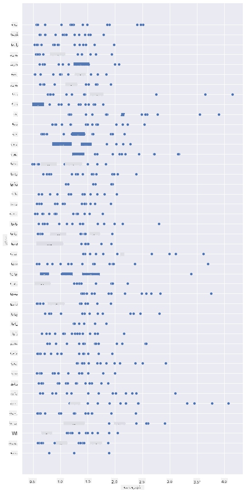
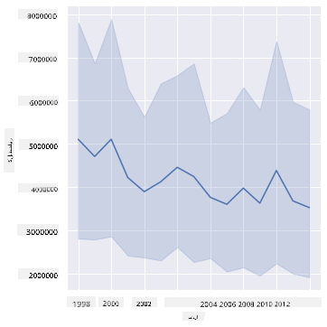
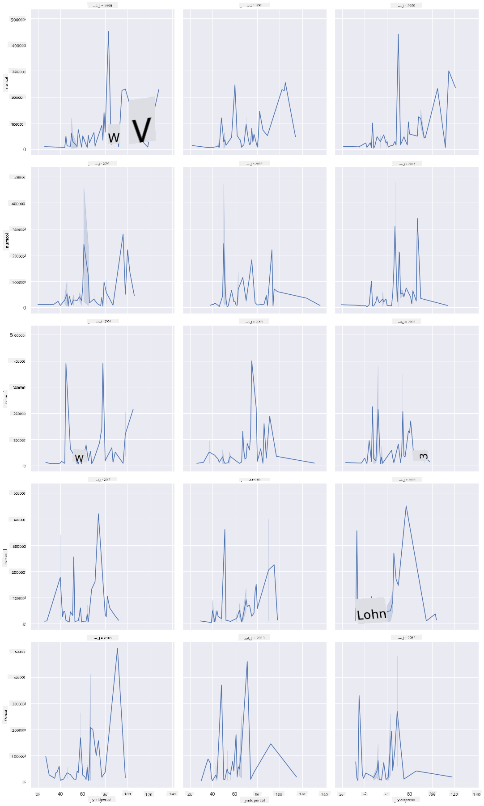
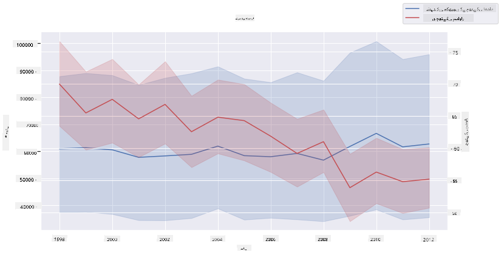

<!--
CO_OP_TRANSLATOR_METADATA:
{
  "original_hash": "0764fd4077f3f04a1d968ec371227744",
  "translation_date": "2025-09-06T11:28:36+00:00",
  "source_file": "3-Data-Visualization/12-visualization-relationships/README.md",
  "language_code": "ur"
}
-->
# شہد کے تعلقات کی بصری نمائندگی: شہد کے بارے میں سب کچھ 🍯

| ](../../sketchnotes/12-Visualizing-Relationships.png)|
|:---:|
|تعلقات کی بصری نمائندگی - _Sketchnote by [@nitya](https://twitter.com/nitya)_ |

ہماری تحقیق کے قدرتی پہلو کو جاری رکھتے ہوئے، آئیے مختلف اقسام کے شہد کے درمیان تعلقات کو ظاہر کرنے کے لیے دلچسپ بصری نمائندگیوں کو دریافت کریں، جو کہ [امریکہ کے محکمہ زراعت](https://www.nass.usda.gov/About_NASS/index.php) سے حاصل کردہ ڈیٹا سیٹ پر مبنی ہیں۔

یہ ڈیٹا سیٹ تقریباً 600 اشیاء پر مشتمل ہے جو امریکہ کی مختلف ریاستوں میں شہد کی پیداوار کو ظاہر کرتا ہے۔ مثال کے طور پر، آپ دیکھ سکتے ہیں کہ کسی دی گئی ریاست میں 1998 سے 2012 کے درمیان ہر سال کے لیے کالونیوں کی تعداد، فی کالونی پیداوار، کل پیداوار، ذخائر، فی پاؤنڈ قیمت، اور پیداوار کی قیمت کیا تھی۔

یہ دلچسپ ہوگا کہ کسی دی گئی ریاست کی سالانہ پیداوار اور اس ریاست میں شہد کی قیمت کے درمیان تعلق کو بصری طور پر دکھایا جائے۔ متبادل طور پر، آپ ریاستوں کی فی کالونی شہد کی پیداوار کے درمیان تعلق کو ظاہر کر سکتے ہیں۔ یہ سال 2006 میں پہلی بار دیکھے گئے 'کالونی کولیپس ڈس آرڈر' (CCD) (http://npic.orst.edu/envir/ccd.html) کے دور کو بھی شامل کرتا ہے، اس لیے یہ مطالعہ کے لیے ایک اہم ڈیٹا سیٹ ہے۔ 🐝

## [لیکچر سے پہلے کا کوئز](https://ff-quizzes.netlify.app/en/ds/quiz/22)

اس سبق میں، آپ Seaborn کا استعمال کر سکتے ہیں، جسے آپ پہلے بھی استعمال کر چکے ہیں، جو متغیرات کے درمیان تعلقات کو بصری طور پر ظاہر کرنے کے لیے ایک اچھی لائبریری ہے۔ خاص طور پر دلچسپ بات یہ ہے کہ Seaborn کے `relplot` فنکشن کا استعمال، جو اسکیٹر پلاٹس اور لائن پلاٹس کے ذریعے '[شماریاتی تعلقات](https://seaborn.pydata.org/tutorial/relational.html?highlight=relationships)' کو تیزی سے ظاہر کرنے کی اجازت دیتا ہے، جس سے ڈیٹا سائنسدان کو یہ سمجھنے میں مدد ملتی ہے کہ متغیرات ایک دوسرے سے کیسے جڑے ہوئے ہیں۔

## اسکیٹر پلاٹس

اسکیٹر پلاٹ کا استعمال کرتے ہوئے دکھائیں کہ شہد کی قیمت سال بہ سال، ہر ریاست کے لیے کیسے بدلی ہے۔ Seaborn، `relplot` کا استعمال کرتے ہوئے، ریاستی ڈیٹا کو آسانی سے گروپ کرتا ہے اور زمرہ وار اور عددی ڈیٹا کے لیے ڈیٹا پوائنٹس دکھاتا ہے۔

آئیے ڈیٹا اور Seaborn کو درآمد کرنے سے شروع کریں:

```python
import pandas as pd
import matplotlib.pyplot as plt
import seaborn as sns
honey = pd.read_csv('../../data/honey.csv')
honey.head()
```
آپ دیکھیں گے کہ شہد کے ڈیٹا میں کئی دلچسپ کالمز ہیں، جن میں سال اور فی پاؤنڈ قیمت شامل ہیں۔ آئیے اس ڈیٹا کو دریافت کریں، جو امریکی ریاستوں کے لحاظ سے گروپ کیا گیا ہے:

| ریاست | کالونیوں کی تعداد | فی کالونی پیداوار | کل پیداوار | ذخائر   | فی پاؤنڈ قیمت | پیداوار کی قیمت | سال |
| ----- | ------------------ | ------------------ | ----------- | -------- | -------------- | ---------------- | ---- |
| AL    | 16000             | 71                | 1136000     | 159000   | 0.72           | 818000          | 1998 |
| AZ    | 55000             | 60                | 3300000     | 1485000  | 0.64           | 2112000         | 1998 |
| AR    | 53000             | 65                | 3445000     | 1688000  | 0.59           | 2033000         | 1998 |
| CA    | 450000            | 83                | 37350000    | 12326000 | 0.62           | 23157000        | 1998 |
| CO    | 27000             | 72                | 1944000     | 1594000  | 0.7            | 1361000         | 1998 |

ایک بنیادی اسکیٹر پلاٹ بنائیں تاکہ شہد کی فی پاؤنڈ قیمت اور اس کی امریکی ریاست کے درمیان تعلق کو دکھایا جا سکے۔ `y` محور کو اتنا لمبا بنائیں کہ تمام ریاستیں نظر آئیں:

```python
sns.relplot(x="priceperlb", y="state", data=honey, height=15, aspect=.5);
```


اب، اسی ڈیٹا کو شہد کے رنگ سکیم کے ساتھ دکھائیں تاکہ یہ ظاہر ہو کہ قیمت سال بہ سال کیسے بدلی ہے۔ آپ یہ 'hue' پیرامیٹر شامل کرکے کر سکتے ہیں تاکہ سال بہ سال تبدیلی کو دکھایا جا سکے:

> ✅ Seaborn میں استعمال ہونے والے [رنگ سکیمز کے بارے میں مزید جانیں](https://seaborn.pydata.org/tutorial/color_palettes.html) - ایک خوبصورت رینبو رنگ سکیم آزمائیں!

```python
sns.relplot(x="priceperlb", y="state", hue="year", palette="YlOrBr", data=honey, height=15, aspect=.5);
```


اس رنگ سکیم کی تبدیلی کے ساتھ، آپ واضح طور پر دیکھ سکتے ہیں کہ شہد کی فی پاؤنڈ قیمت میں سال بہ سال ایک مضبوط ترقی ہو رہی ہے۔ درحقیقت، اگر آپ ڈیٹا کے ایک نمونے کو جانچنے کے لیے دیکھیں (مثال کے طور پر، ایریزونا ریاست کو منتخب کریں) تو آپ دیکھ سکتے ہیں کہ قیمت میں سال بہ سال اضافے کا ایک نمونہ موجود ہے، چند استثنائی صورتوں کے ساتھ:

| ریاست | کالونیوں کی تعداد | فی کالونی پیداوار | کل پیداوار | ذخائر  | فی پاؤنڈ قیمت | پیداوار کی قیمت | سال |
| ----- | ------------------ | ------------------ | ----------- | ------- | -------------- | ---------------- | ---- |
| AZ    | 55000             | 60                | 3300000     | 1485000 | 0.64           | 2112000         | 1998 |
| AZ    | 52000             | 62                | 3224000     | 1548000 | 0.62           | 1999000         | 1999 |
| AZ    | 40000             | 59                | 2360000     | 1322000 | 0.73           | 1723000         | 2000 |
| AZ    | 43000             | 59                | 2537000     | 1142000 | 0.72           | 1827000         | 2001 |
| AZ    | 38000             | 63                | 2394000     | 1197000 | 1.08           | 2586000         | 2002 |
| AZ    | 35000             | 72                | 2520000     | 983000  | 1.34           | 3377000         | 2003 |
| AZ    | 32000             | 55                | 1760000     | 774000  | 1.11           | 1954000         | 2004 |
| AZ    | 36000             | 50                | 1800000     | 720000  | 1.04           | 1872000         | 2005 |
| AZ    | 30000             | 65                | 1950000     | 839000  | 0.91           | 1775000         | 2006 |
| AZ    | 30000             | 64                | 1920000     | 902000  | 1.26           | 2419000         | 2007 |
| AZ    | 25000             | 64                | 1600000     | 336000  | 1.26           | 2016000         | 2008 |
| AZ    | 20000             | 52                | 1040000     | 562000  | 1.45           | 1508000         | 2009 |
| AZ    | 24000             | 77                | 1848000     | 665000  | 1.52           | 2809000         | 2010 |
| AZ    | 23000             | 53                | 1219000     | 427000  | 1.55           | 1889000         | 2011 |
| AZ    | 22000             | 46                | 1012000     | 253000  | 1.79           | 1811000         | 2012 |

ایک اور طریقہ یہ ہے کہ اس ترقی کو رنگ کے بجائے سائز کے ذریعے دکھایا جائے۔ رنگ نابینا صارفین کے لیے، یہ ایک بہتر آپشن ہو سکتا ہے۔ اپنی بصری نمائندگی کو اس طرح ایڈٹ کریں کہ قیمت میں اضافے کو نقطے کے دائرے کے سائز میں اضافے کے ذریعے دکھایا جائے:

```python
sns.relplot(x="priceperlb", y="state", size="year", data=honey, height=15, aspect=.5);
```
آپ دیکھ سکتے ہیں کہ نقطوں کے سائز میں بتدریج اضافہ ہو رہا ہے۔


کیا یہ صرف طلب اور رسد کا معاملہ ہے؟ موسمیاتی تبدیلی اور کالونی کولیپس جیسے عوامل کی وجہ سے، کیا سال بہ سال خریداری کے لیے کم شہد دستیاب ہے، اور اس لیے قیمت بڑھ رہی ہے؟

اس ڈیٹا سیٹ میں کچھ متغیرات کے درمیان تعلق کو دریافت کرنے کے لیے، آئیے کچھ لائن چارٹس کا جائزہ لیں۔

## لائن چارٹس

سوال: کیا شہد کی فی پاؤنڈ قیمت میں سال بہ سال واضح اضافہ ہوا ہے؟ آپ یہ سب سے آسانی سے ایک سنگل لائن چارٹ بنا کر دریافت کر سکتے ہیں:

```python
sns.relplot(x="year", y="priceperlb", kind="line", data=honey);
```
جواب: ہاں، کچھ استثنائی صورتوں کے ساتھ، خاص طور پر 2003 کے آس پاس:


✅ چونکہ Seaborn ایک لائن کے ارد گرد ڈیٹا کو جمع کر رہا ہے، یہ "ہر x ویلیو پر متعدد پیمائشوں کو اوسط اور اوسط کے ارد گرد 95% اعتماد کے وقفے کو پلاٹ کر کے ظاہر کرتا ہے"۔ [ماخذ](https://seaborn.pydata.org/tutorial/relational.html)۔ اس وقت لینے والے رویے کو `ci=None` شامل کر کے غیر فعال کیا جا سکتا ہے۔

سوال: ٹھیک ہے، کیا ہم 2003 میں شہد کی فراہمی میں بھی اضافہ دیکھ سکتے ہیں؟ اگر آپ کل پیداوار کو سال بہ سال دیکھیں تو کیا ہوگا؟

```python
sns.relplot(x="year", y="totalprod", kind="line", data=honey);
```



جواب: واقعی نہیں۔ اگر آپ کل پیداوار کو دیکھیں، تو یہ خاص سال میں درحقیقت بڑھتی ہوئی نظر آتی ہے، حالانکہ عمومی طور پر ان سالوں کے دوران شہد کی پیداوار میں کمی ہو رہی ہے۔

سوال: اس صورت میں، 2003 کے آس پاس شہد کی قیمت میں اضافے کی وجہ کیا ہو سکتی ہے؟

یہ دریافت کرنے کے لیے، آپ ایک فیسٹ گرڈ کا جائزہ لے سکتے ہیں۔

## فیسٹ گرڈز

فیسٹ گرڈز آپ کے ڈیٹا سیٹ کے ایک پہلو کو لیتے ہیں (ہمارے معاملے میں، آپ 'سال' کو منتخب کر سکتے ہیں تاکہ بہت زیادہ فیسٹس پیدا نہ ہوں)۔ پھر Seaborn آپ کے منتخب کردہ x اور y کوآرڈینیٹس کے لیے ہر فیسٹ کا ایک پلاٹ بنا سکتا ہے تاکہ بصری موازنہ آسان ہو۔ کیا 2003 اس قسم کے موازنہ میں نمایاں نظر آتا ہے؟

فیسٹ گرڈ بنانے کے لیے `relplot` کا استعمال جاری رکھیں جیسا کہ [Seaborn کی دستاویزات](https://seaborn.pydata.org/generated/seaborn.FacetGrid.html?highlight=facetgrid#seaborn.FacetGrid) میں تجویز کیا گیا ہے۔

```python
sns.relplot(
    data=honey, 
    x="yieldpercol", y="numcol",
    col="year", 
    col_wrap=3,
    kind="line"
    )
```
اس بصری نمائندگی میں، آپ فی کالونی پیداوار اور کالونیوں کی تعداد کو سال بہ سال، ریاست بہ ریاست، 3 کالمز کے ساتھ موازنہ کر سکتے ہیں:



اس ڈیٹا سیٹ کے لیے، کالونیوں کی تعداد اور ان کی پیداوار کے حوالے سے سال بہ سال اور ریاست بہ ریاست کچھ خاص نمایاں نہیں ہوتا۔ کیا ان دو متغیرات کے درمیان تعلق تلاش کرنے کے لیے دیکھنے کا کوئی مختلف طریقہ ہے؟

## دوہری لائن پلاٹس

Seaborn کے 'despine' کا استعمال کرتے ہوئے دو لائن پلاٹس کو ایک دوسرے کے اوپر سپر امپوز کرنے کی کوشش کریں تاکہ ان کے اوپر اور دائیں اسپائنز کو ہٹا دیا جائے، اور `ax.twinx` کا استعمال کریں [جو Matplotlib سے ماخوذ ہے](https://matplotlib.org/stable/api/_as_gen/matplotlib.axes.Axes.twinx.html)۔ Twinx ایک چارٹ کو x محور کا اشتراک کرنے اور دو y محور کو ظاہر کرنے کی اجازت دیتا ہے۔ تو، فی کالونی پیداوار اور کالونیوں کی تعداد کو سپر امپوزڈ دکھائیں:

```python
fig, ax = plt.subplots(figsize=(12,6))
lineplot = sns.lineplot(x=honey['year'], y=honey['numcol'], data=honey, 
                        label = 'Number of bee colonies', legend=False)
sns.despine()
plt.ylabel('# colonies')
plt.title('Honey Production Year over Year');

ax2 = ax.twinx()
lineplot2 = sns.lineplot(x=honey['year'], y=honey['yieldpercol'], ax=ax2, color="r", 
                         label ='Yield per colony', legend=False) 
sns.despine(right=False)
plt.ylabel('colony yield')
ax.figure.legend();
```


اگرچہ 2003 کے آس پاس آنکھ کو کچھ خاص نظر نہیں آتا، لیکن یہ ہمیں اس سبق کو ایک خوشگوار نوٹ پر ختم کرنے کی اجازت دیتا ہے: اگرچہ مجموعی طور پر کالونیوں کی تعداد میں کمی ہو رہی ہے، کالونیوں کی تعداد مستحکم ہو رہی ہے، چاہے ان کی فی کالونی پیداوار کم ہو رہی ہو۔

چلو، شہد کی مکھیوں، چلو!

🐝❤️
## 🚀 چیلنج

اس سبق میں، آپ نے اسکیٹر پلاٹس اور لائن گرڈز کے دیگر استعمالات کے بارے میں تھوڑا سا مزید سیکھا، بشمول فیسٹ گرڈز۔ اپنے آپ کو چیلنج کریں کہ کسی مختلف ڈیٹا سیٹ کا استعمال کرتے ہوئے ایک فیسٹ گرڈ بنائیں، شاید وہی جو آپ نے ان اسباق سے پہلے استعمال کیا ہو۔ نوٹ کریں کہ انہیں بنانے میں کتنا وقت لگتا ہے اور آپ کو ان تکنیکوں کا استعمال کرتے ہوئے کتنے گرڈز بنانے کی ضرورت ہے۔

## [لیکچر کے بعد کا کوئز](https://ff-quizzes.netlify.app/en/ds/quiz/23)

## جائزہ اور خود مطالعہ

لائن پلاٹس سادہ یا کافی پیچیدہ ہو سکتے ہیں۔ [Seaborn کی دستاویزات](https://seaborn.pydata.org/generated/seaborn.lineplot.html) میں تھوڑا سا مطالعہ کریں کہ آپ انہیں بنانے کے مختلف طریقے کیا ہیں۔ ان طریقوں کو استعمال کرتے ہوئے اس سبق میں بنائے گئے لائن چارٹس کو بہتر بنانے کی کوشش کریں۔
## اسائنمنٹ

[شہد کے چھتے میں غوطہ لگائیں](assignment.md)

---

**ڈسکلیمر**:  
یہ دستاویز AI ترجمہ سروس [Co-op Translator](https://github.com/Azure/co-op-translator) کا استعمال کرتے ہوئے ترجمہ کی گئی ہے۔ ہم درستگی کے لیے کوشش کرتے ہیں، لیکن براہ کرم آگاہ رہیں کہ خودکار ترجمے میں غلطیاں یا عدم درستگی ہو سکتی ہیں۔ اصل دستاویز، جو اس کی اصل زبان میں ہے، کو مستند ذریعہ سمجھا جانا چاہیے۔ اہم معلومات کے لیے، پیشہ ور انسانی ترجمہ کی سفارش کی جاتی ہے۔ اس ترجمے کے استعمال سے پیدا ہونے والی کسی بھی غلط فہمی یا غلط تشریح کے لیے ہم ذمہ دار نہیں ہیں۔