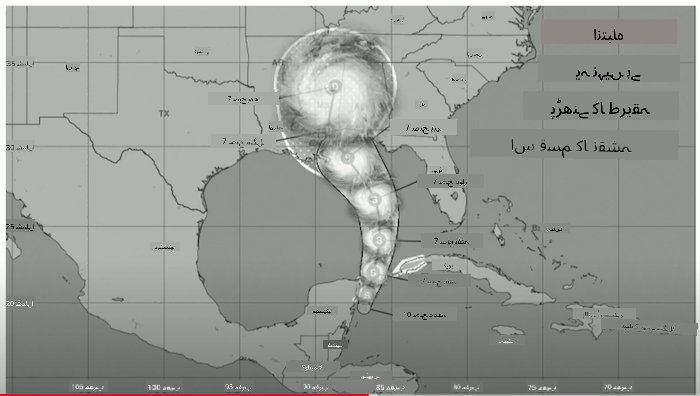
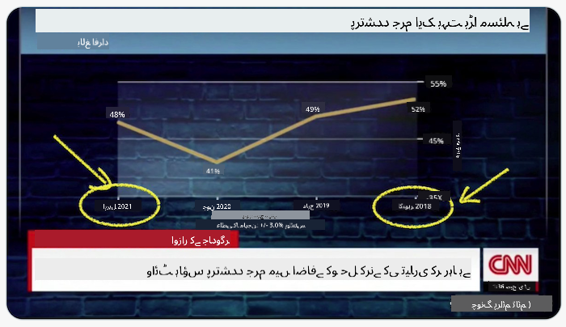
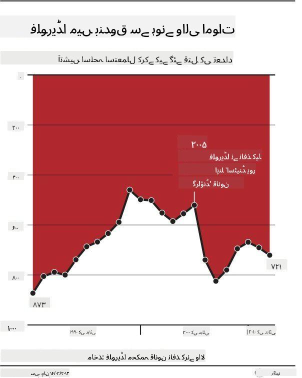
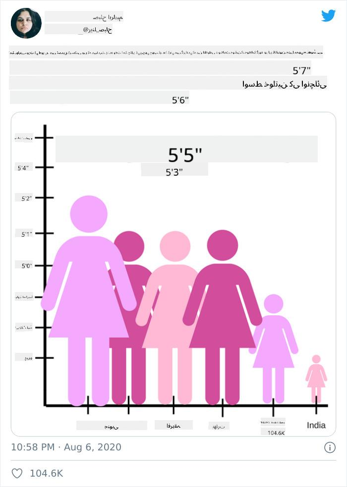
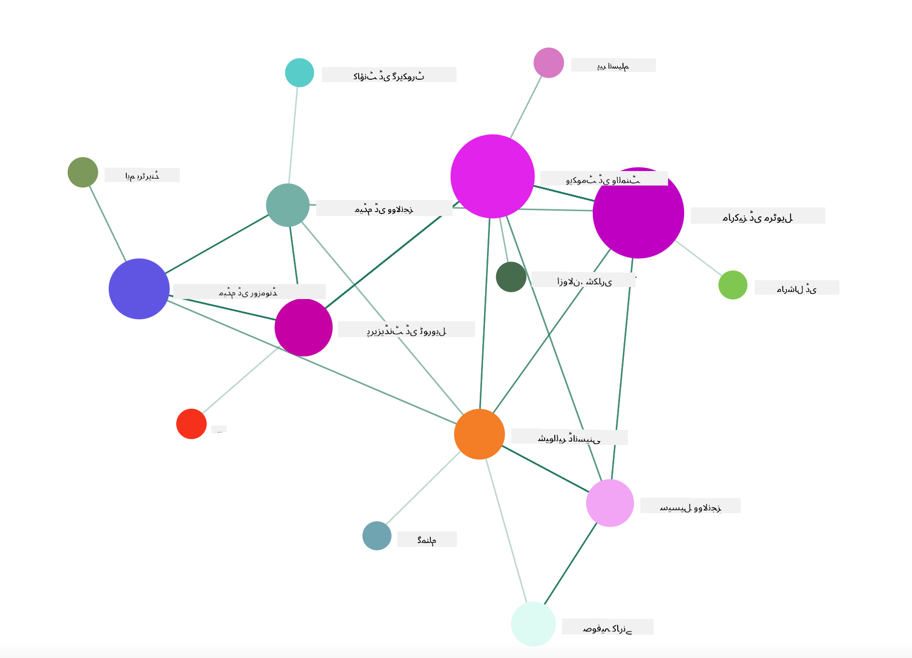

<!--
CO_OP_TRANSLATOR_METADATA:
{
  "original_hash": "0b380bb6d34102bb061eb41de23d9834",
  "translation_date": "2025-09-04T16:03:51+00:00",
  "source_file": "3-Data-Visualization/13-meaningful-visualizations/README.md",
  "language_code": "ur"
}
-->
# بامعنی بصری نمائیاں بنانا

| ](../../sketchnotes/13-MeaningfulViz.png)|
|:---:|
| بامعنی بصری نمائیاں - _اسکیچ نوٹ از [@nitya](https://twitter.com/nitya)_ |

> "اگر آپ ڈیٹا کو کافی دیر تک اذیت دیں، تو یہ کچھ بھی قبول کر لے گا" -- [رونالڈ کوس](https://en.wikiquote.org/wiki/Ronald_Coase)

ڈیٹا سائنسدان کی بنیادی مہارتوں میں سے ایک یہ ہے کہ وہ بامعنی بصری نمائیاں بنا سکے جو آپ کے سوالات کے جوابات دینے میں مدد کرے۔ ڈیٹا کو بصری بنانے سے پہلے، آپ کو یہ یقینی بنانا ہوگا کہ اسے صاف اور تیار کیا گیا ہے، جیسا کہ آپ نے پچھلے اسباق میں کیا تھا۔ اس کے بعد، آپ فیصلہ کر سکتے ہیں کہ ڈیٹا کو بہترین طریقے سے کیسے پیش کیا جائے۔

اس سبق میں، آپ جائزہ لیں گے:

1. صحیح چارٹ قسم کا انتخاب کیسے کریں
2. دھوکہ دہی سے بچنے والے چارٹ کیسے بنائیں
3. رنگ کے ساتھ کام کیسے کریں
4. اپنے چارٹس کو پڑھنے کے قابل بنانے کے لیے اسٹائل کیسے کریں
5. متحرک یا 3D چارٹ حل کیسے بنائیں
6. تخلیقی بصری نمائیاں کیسے بنائیں

## [سبق سے پہلے کا کوئز](https://purple-hill-04aebfb03.1.azurestaticapps.net/quiz/24)

## صحیح چارٹ قسم کا انتخاب کریں

پچھلے اسباق میں، آپ نے میٹپلاٹ لِب اور سیبورن کا استعمال کرتے ہوئے مختلف قسم کی دلچسپ بصری نمائیاں بنانے کا تجربہ کیا۔ عام طور پر، آپ اس جدول کا استعمال کرتے ہوئے [صحیح قسم کا چارٹ](https://chartio.com/learn/charts/how-to-select-a-data-vizualization/) منتخب کر سکتے ہیں جو آپ کے سوال کے مطابق ہو:

| آپ کو ضرورت ہے:            | آپ کو استعمال کرنا چاہیے:       |
| -------------------------- | ------------------------------- |
| وقت کے ساتھ ڈیٹا کے رجحانات دکھائیں | لائن                            |
| زمرے کا موازنہ کریں         | بار، پائی                        |
| کل کا موازنہ کریں           | پائی، اسٹیکڈ بار                |
| تعلقات دکھائیں             | اسکیٹر، لائن، فیسٹ، ڈوئل لائن   |
| تقسیمات دکھائیں            | اسکیٹر، ہسٹوگرام، باکس         |
| تناسب دکھائیں              | پائی، ڈونٹ، وافل              |

> ✅ آپ کے ڈیٹا کی ساخت کے مطابق، آپ کو اسے متن سے عددی میں تبدیل کرنے کی ضرورت ہو سکتی ہے تاکہ ایک مخصوص چارٹ اس کی حمایت کرے۔

## دھوکہ دہی سے بچیں

چاہے ڈیٹا سائنسدان صحیح ڈیٹا کے لیے صحیح چارٹ کا انتخاب کرنے میں محتاط ہو، پھر بھی ڈیٹا کو اس طرح پیش کرنے کے کئی طریقے ہیں جو کسی نقطہ کو ثابت کرتے ہیں، اکثر ڈیٹا کو نقصان پہنچانے کی قیمت پر۔ دھوکہ دہی والے چارٹس اور انفوگرافکس کی بہت سی مثالیں موجود ہیں!

[](https://www.youtube.com/watch?v=oX74Nge8Wkw "چارٹس کیسے جھوٹ بولتے ہیں")

> 🎥 دھوکہ دہی والے چارٹس کے بارے میں کانفرنس کی بات چیت کے لیے اوپر دی گئی تصویر پر کلک کریں

یہ چارٹ X محور کو الٹ دیتا ہے تاکہ تاریخ کی بنیاد پر سچائی کے برعکس دکھایا جا سکے:



[یہ چارٹ](https://media.firstcoastnews.com/assets/WTLV/images/170ae16f-4643-438f-b689-50d66ca6a8d8/170ae16f-4643-438f-b689-50d66ca6a8d8_1140x641.jpg) اور بھی دھوکہ دہی والا ہے، کیونکہ آنکھ دائیں طرف کھینچتی ہے تاکہ یہ نتیجہ اخذ کرے کہ وقت کے ساتھ، مختلف کاؤنٹیز میں COVID کیسز کم ہو گئے ہیں۔ درحقیقت، اگر آپ تاریخوں کو قریب سے دیکھیں تو آپ کو معلوم ہوگا کہ انہیں دھوکہ دہی والے نیچے کے رجحان کو دینے کے لیے دوبارہ ترتیب دیا گیا ہے۔


یہ بدنام زمانہ مثال رنگ اور الٹے Y محور کا استعمال کرتی ہے تاکہ دھوکہ دیا جا سکے: بندوق کے موافق قانون سازی کے پاس ہونے کے بعد بندوق کی اموات میں اضافہ ہوا، درحقیقت آنکھ کو یہ سوچنے کے لیے دھوکہ دیا جاتا ہے کہ اس کے برعکس سچ ہے:



یہ عجیب چارٹ دکھاتا ہے کہ تناسب کو کیسے جوڑ توڑ کیا جا سکتا ہے، مزاحیہ اثر کے لیے:



ناقابل موازنہ کا موازنہ کرنا ایک اور مشکوک چال ہے۔ ایک [شاندار ویب سائٹ](https://tylervigen.com/spurious-correlations) ہے جو 'غلط تعلقات' کے بارے میں ہے، 'حقائق' دکھاتی ہے جیسے مین میں طلاق کی شرح اور مارجرین کی کھپت۔ ایک ریڈٹ گروپ بھی ڈیٹا کے [بدصورت استعمال](https://www.reddit.com/r/dataisugly/top/?t=all) کو جمع کرتا ہے۔

یہ سمجھنا ضروری ہے کہ دھوکہ دہی والے چارٹس کے ذریعے آنکھ کو کتنی آسانی سے دھوکہ دیا جا سکتا ہے۔ چاہے ڈیٹا سائنسدان کا ارادہ اچھا ہو، چارٹ کی غلط قسم کا انتخاب، جیسے کہ بہت زیادہ زمرے دکھانے والا پائی چارٹ، دھوکہ دہی ہو سکتا ہے۔

## رنگ

آپ نے اوپر 'فلوریڈا گن وائلنس' چارٹ میں دیکھا کہ رنگ چارٹس میں اضافی معنی فراہم کر سکتا ہے، خاص طور پر وہ جو میٹپلاٹ لِب اور سیبورن جیسی لائبریریوں کا استعمال کرتے ہوئے ڈیزائن نہیں کیے گئے ہیں جو مختلف تصدیق شدہ رنگ لائبریریوں اور پیلیٹس کے ساتھ آتے ہیں۔ اگر آپ ہاتھ سے چارٹ بنا رہے ہیں، تو [رنگ کے اصول](https://colormatters.com/color-and-design/basic-color-theory) کا تھوڑا مطالعہ کریں۔

> ✅ چارٹس ڈیزائن کرتے وقت، یہ جان لیں کہ رسائی بصری نمائیاں کا ایک اہم پہلو ہے۔ آپ کے کچھ صارفین رنگ کے اندھے ہو سکتے ہیں - کیا آپ کا چارٹ بصری معذوری والے صارفین کے لیے اچھی طرح سے ظاہر ہوتا ہے؟

اپنے چارٹ کے لیے رنگ منتخب کرتے وقت محتاط رہیں، کیونکہ رنگ وہ معنی دے سکتا ہے جو آپ نہیں چاہتے۔ اوپر 'اونچائی' چارٹ میں 'گلابی خواتین' ایک واضح 'نسوانی' معنی فراہم کرتی ہیں جو چارٹ کی عجیب و غریبیت میں اضافہ کرتی ہیں۔

جبکہ [رنگ کے معنی](https://colormatters.com/color-symbolism/the-meanings-of-colors) دنیا کے مختلف حصوں میں مختلف ہو سکتے ہیں، اور ان کے شیڈ کے مطابق معنی بدلنے کا رجحان رکھتے ہیں۔ عام طور پر، رنگ کے معنی شامل ہیں:

| رنگ    | معنی               |
| ------ | ------------------- |
| سرخ    | طاقت               |
| نیلا   | اعتماد، وفاداری    |
| پیلا   | خوشی، احتیاط       |
| سبز    | ماحولیات، قسمت، حسد|
| جامنی  | خوشی               |
| نارنجی | چمک                |

اگر آپ کو کسٹم رنگوں کے ساتھ چارٹ بنانے کا کام دیا گیا ہے، تو یقینی بنائیں کہ آپ کے چارٹس دونوں قابل رسائی ہیں اور آپ کے منتخب کردہ رنگ اس معنی کے مطابق ہیں جو آپ پہنچانا چاہتے ہیں۔

## اپنے چارٹس کو پڑھنے کے قابل بنانے کے لیے اسٹائل کریں

چارٹس بامعنی نہیں ہیں اگر وہ پڑھنے کے قابل نہیں ہیں! اپنے چارٹ کی چوڑائی اور اونچائی کو اپنے ڈیٹا کے ساتھ اچھی طرح سے پیمانہ کرنے کے لیے اسٹائل کرنے پر غور کریں۔ اگر ایک متغیر (جیسے تمام 50 ریاستیں) کو ظاہر کرنے کی ضرورت ہو، تو انہیں Y محور پر عمودی طور پر دکھائیں اگر ممکن ہو تاکہ افقی طور پر سکرول کرنے والے چارٹ سے بچا جا سکے۔

اپنے محور کو لیبل کریں، اگر ضروری ہو تو ایک لیجنڈ فراہم کریں، اور ڈیٹا کی بہتر تفہیم کے لیے ٹول ٹپس پیش کریں۔

اگر آپ کا ڈیٹا X محور پر متنی اور تفصیلی ہے، تو بہتر پڑھنے کے لیے متن کو زاویہ دیں۔ [میٹپلاٹ لِب](https://matplotlib.org/stable/tutorials/toolkits/mplot3d.html) 3D پلاٹنگ پیش کرتا ہے، اگر آپ کا ڈیٹا اس کی حمایت کرتا ہے۔ نفیس بصری نمائیاں `mpl_toolkits.mplot3d` کا استعمال کرتے ہوئے تیار کی جا سکتی ہیں۔


## متحرک اور 3D چارٹ ڈسپلے

آج کی بہترین بصری نمائیاں متحرک ہیں۔ شیرلی وو نے D3 کے ساتھ حیرت انگیز نمائیاں بنائی ہیں، جیسے '[فلم فلاورز](http://bl.ocks.org/sxywu/raw/d612c6c653fb8b4d7ff3d422be164a5d/)'، جہاں ہر پھول ایک فلم کی نمائندگی کرتا ہے۔ گارڈین کے لیے ایک اور مثال 'بسڈ آؤٹ' ہے، ایک انٹرایکٹو تجربہ جو بصری نمائیاں کو گرینساک اور D3 کے ساتھ اسکرولی ٹیلنگ آرٹیکل فارمیٹ کے ساتھ جوڑتا ہے تاکہ دکھایا جا سکے کہ NYC اپنے بے گھر افراد کو شہر سے باہر بسوں کے ذریعے کیسے ہینڈل کرتا ہے۔


> "بسڈ آؤٹ: امریکہ اپنے بے گھر افراد کو کیسے منتقل کرتا ہے" [گارڈین](https://www.theguardian.com/us-news/ng-interactive/2017/dec/20/bussed-out-america-moves-homeless-people-country-study) سے۔ بصری نمائیاں نادیہ بریمر اور شیرلی وو کے ذریعہ

جبکہ یہ سبق ان طاقتور بصری نمائیاں لائبریریوں کو سکھانے کے لیے گہرائی میں جانے کے لیے ناکافی ہے، D3 کو Vue.js ایپ میں آزمانے کی کوشش کریں، ایک لائبریری کا استعمال کرتے ہوئے کتاب "خطرناک تعلقات" کو ایک متحرک سوشل نیٹ ورک کے طور پر دکھانے کے لیے۔

> "لیز لیزون ڈینجرس" ایک خطی ناول ہے، یا ایک ناول جو خطوط کی ایک سیریز کے طور پر پیش کیا گیا ہے۔ 1782 میں چودرلو ڈی لاکلو نے لکھا، یہ کہانی بتاتا ہے کہ فرانسیسی اشرافیہ کے دو مرکزی کردار، ویکومٹ ڈی والمنٹ اور مارکیز ڈی مرٹویل، کے اخلاقی طور پر دیوالیہ سماجی چالوں کی۔ دونوں آخر میں اپنی تباہی سے ملتے ہیں لیکن سماجی نقصان پہنچانے سے پہلے نہیں۔ ناول خطوط کی ایک سیریز کے طور پر کھلتا ہے جو ان کے حلقوں میں مختلف لوگوں کو لکھے گئے ہیں، انتقام کی منصوبہ بندی یا صرف پریشانی پیدا کرنے کے لیے۔ ان خطوط کی نمائیاں بنائیں تاکہ بیانیہ کے بڑے کرداروں کو بصری طور پر دریافت کیا جا سکے۔

آپ ایک ویب ایپ مکمل کریں گے جو اس سوشل نیٹ ورک کا متحرک منظر دکھائے گی۔ یہ ایک لائبریری کا استعمال کرتا ہے جو Vue.js اور D3 کا استعمال کرتے ہوئے ایک [نیٹ ورک کی نمائیاں](https://github.com/emiliorizzo/vue-d3-network) بنانے کے لیے بنایا گیا تھا۔ جب ایپ چل رہی ہو، آپ اسکرین پر نوڈز کو گھسیٹ سکتے ہیں تاکہ ڈیٹا کو ادھر ادھر منتقل کریں۔



## پروجیکٹ: D3.js کا استعمال کرتے ہوئے نیٹ ورک دکھانے کے لیے چارٹ بنائیں

> اس سبق کے فولڈر میں ایک `حل` فولڈر شامل ہے جہاں آپ مکمل پروجیکٹ کو اپنے حوالہ کے لیے تلاش کر سکتے ہیں۔

1. اسٹارٹر فولڈر کی روٹ میں README.md فائل میں دی گئی ہدایات پر عمل کریں۔ اس بات کو یقینی بنائیں کہ آپ کے مشین پر NPM اور Node.js چل رہے ہیں اس سے پہلے کہ آپ اپنے پروجیکٹ کی ڈیپینڈنسیز انسٹال کریں۔

2. `starter/src` فولڈر کھولیں۔ آپ کو ایک `assets` فولڈر ملے گا جہاں آپ ایک .json فائل تلاش کر سکتے ہیں جس میں ناول کے تمام خطوط، نمبر کے ساتھ، 'to' اور 'from' کی تشریح کے ساتھ ہیں۔

3. `components/Nodes.vue` میں کوڈ مکمل کریں تاکہ نمائیاں کو فعال کیا جا سکے۔ `createLinks()` نامی طریقہ تلاش کریں اور درج ذیل نیسٹڈ لوپ شامل کریں۔

.json آبجیکٹ کے ذریعے لوپ کریں تاکہ خطوط کے 'to' اور 'from' ڈیٹا کو حاصل کیا جا سکے اور `links` آبجیکٹ کو بنائیں تاکہ نمائیاں لائبریری اسے استعمال کر سکے:

```javascript
//loop through letters
      let f = 0;
      let t = 0;
      for (var i = 0; i < letters.length; i++) {
          for (var j = 0; j < characters.length; j++) {
              
            if (characters[j] == letters[i].from) {
              f = j;
            }
            if (characters[j] == letters[i].to) {
              t = j;
            }
        }
        this.links.push({ sid: f, tid: t });
      }
  ```

اپنی ایپ کو ٹرمینل سے چلائیں (npm run serve) اور نمائیاں کا لطف اٹھائیں!

## 🚀 چیلنج

انٹرنیٹ کا دورہ کریں تاکہ دھوکہ دہی والی نمائیاں دریافت کریں۔ مصنف صارف کو کیسے دھوکہ دیتا ہے، اور کیا یہ جان بوجھ کر ہے؟ نمائیاں کو درست کرنے کی کوشش کریں تاکہ دکھایا جا سکے کہ انہیں کیسے نظر آنا چاہیے۔

## [سبق کے بعد کا کوئز](https://ff-quizzes.netlify.app/en/ds/)

## جائزہ اور خود مطالعہ

دھوکہ دہی والی ڈیٹا نمائیاں کے بارے میں پڑھنے کے لیے یہاں کچھ مضامین ہیں:

https://gizmodo.com/how-to-lie-with-data-visualization-1563576606

http://ixd.prattsi.org/2017/12/visual-lies-usability-in-deceptive-data-visualizations/

تاریخی اثاثوں اور نوادرات کے لیے دلچسپ نمائیاں دیکھیں:

https://handbook.pubpub.org/

اس مضمون کو دیکھیں کہ متحرک نمائیاں آپ کی بصری نمائیاں کو کیسے بہتر بنا سکتی ہیں:

https://medium.com/@EvanSinar/use-animation-to-supercharge-data-visualization-cd905a882ad4

## اسائنمنٹ

[اپنی مرضی کی نمائیاں بنائیں](assignment.md)

---

**ڈسکلیمر**:  
یہ دستاویز AI ترجمہ سروس [Co-op Translator](https://github.com/Azure/co-op-translator) کا استعمال کرتے ہوئے ترجمہ کی گئی ہے۔ ہم درستگی کے لیے کوشش کرتے ہیں، لیکن براہ کرم آگاہ رہیں کہ خودکار ترجمے میں غلطیاں یا غیر درستیاں ہو سکتی ہیں۔ اصل دستاویز کو اس کی اصل زبان میں مستند ذریعہ سمجھا جانا چاہیے۔ اہم معلومات کے لیے، پیشہ ور انسانی ترجمہ کی سفارش کی جاتی ہے۔ ہم اس ترجمے کے استعمال سے پیدا ہونے والی کسی بھی غلط فہمی یا غلط تشریح کے ذمہ دار نہیں ہیں۔