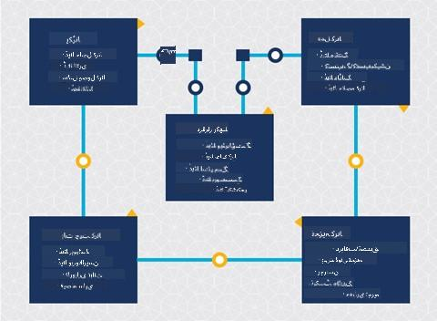
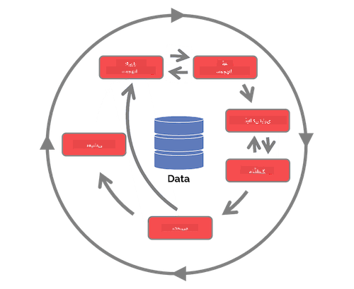

<!--
CO_OP_TRANSLATOR_METADATA:
{
  "original_hash": "07e12a25d20b8f191e3cb651c27fdb2b",
  "translation_date": "2025-09-06T20:24:33+00:00",
  "source_file": "4-Data-Science-Lifecycle/14-Introduction/README.md",
  "language_code": "ur"
}
-->
# ڈیٹا سائنس کے لائف سائیکل کا تعارف

| کی اسکیچ نوٹ ](../../sketchnotes/14-DataScience-Lifecycle.png)|
|:---:|
| ڈیٹا سائنس کے لائف سائیکل کا تعارف - _[@nitya](https://twitter.com/nitya) کی اسکیچ نوٹ_ |

## [لیکچر سے پہلے کا کوئز](https://ff-quizzes.netlify.app/en/ds/quiz/26)

اس مرحلے پر آپ کو شاید یہ احساس ہو گیا ہوگا کہ ڈیٹا سائنس ایک عمل ہے۔ اس عمل کو پانچ مراحل میں تقسیم کیا جا سکتا ہے:

- ڈیٹا حاصل کرنا
- پراسیسنگ
- تجزیہ
- مواصلات
- دیکھ بھال

یہ سبق لائف سائیکل کے تین حصوں پر مرکوز ہے: ڈیٹا حاصل کرنا، پراسیسنگ اور دیکھ بھال۔

> تصویر [Berkeley School of Information](https://ischoolonline.berkeley.edu/data-science/what-is-data-science/) کی جانب سے

## ڈیٹا حاصل کرنا

لائف سائیکل کا پہلا مرحلہ بہت اہم ہے کیونکہ اگلے مراحل اس پر منحصر ہیں۔ یہ عملی طور پر دو مراحل کو ایک میں جوڑتا ہے: ڈیٹا حاصل کرنا اور مقصد اور مسائل کی وضاحت کرنا جنہیں حل کرنے کی ضرورت ہے۔  
پروجیکٹ کے اہداف کی وضاحت کے لیے مسئلے یا سوال کے بارے میں گہری تفہیم کی ضرورت ہوگی۔ سب سے پہلے، ہمیں ان افراد یا اداروں کی شناخت اور حصول کرنا ہوگا جنہیں اپنے مسئلے کا حل چاہیے۔ یہ کاروبار کے اسٹیک ہولڈرز یا پروجیکٹ کے اسپانسرز ہو سکتے ہیں، جو یہ شناخت کرنے میں مدد کر سکتے ہیں کہ اس پروجیکٹ سے کون یا کیا فائدہ اٹھائے گا اور انہیں کیوں ضرورت ہے۔ ایک اچھی طرح سے وضاحت شدہ مقصد قابل پیمائش اور مقداری ہونا چاہیے تاکہ ایک قابل قبول نتیجہ کی وضاحت کی جا سکے۔

ڈیٹا سائنسدان درج ذیل سوالات پوچھ سکتے ہیں:
- کیا اس مسئلے کو پہلے حل کرنے کی کوشش کی گئی ہے؟ کیا دریافت ہوا؟
- کیا مقصد اور ہدف تمام متعلقہ افراد کے لیے واضح ہے؟
- کیا کوئی ابہام ہے اور اسے کیسے کم کیا جا سکتا ہے؟
- کیا پابندیاں ہیں؟
- ممکنہ طور پر حتمی نتیجہ کیسا ہوگا؟
- کتنے وسائل (وقت، افراد، کمپیوٹیشنل) دستیاب ہیں؟

اگلا مرحلہ ڈیٹا کی شناخت، جمع کرنا اور پھر اس کی جانچ کرنا ہے جو ان وضاحت شدہ اہداف کو حاصل کرنے کے لیے ضروری ہے۔ اس مرحلے میں، ڈیٹا سائنسدانوں کو ڈیٹا کی مقدار اور معیار کا بھی جائزہ لینا ہوگا۔ اس کے لیے کچھ ڈیٹا کی جانچ پڑتال ضروری ہے تاکہ یہ تصدیق کی جا سکے کہ جو ڈیٹا حاصل کیا گیا ہے وہ مطلوبہ نتیجہ تک پہنچنے میں مدد دے گا۔

ڈیٹا کے بارے میں ڈیٹا سائنسدان درج ذیل سوالات پوچھ سکتے ہیں:
- میرے پاس پہلے سے کون سا ڈیٹا دستیاب ہے؟
- اس ڈیٹا کا مالک کون ہے؟
- کیا پرائیویسی کے خدشات ہیں؟
- کیا میرے پاس اس مسئلے کو حل کرنے کے لیے کافی ڈیٹا ہے؟
- کیا یہ ڈیٹا اس مسئلے کے لیے قابل قبول معیار کا ہے؟
- اگر میں اس ڈیٹا کے ذریعے اضافی معلومات دریافت کروں، تو کیا ہمیں اہداف کو تبدیل یا دوبارہ وضاحت کرنے پر غور کرنا چاہیے؟

## پراسیسنگ

لائف سائیکل کا پراسیسنگ مرحلہ ڈیٹا میں پیٹرنز دریافت کرنے اور ماڈلنگ پر مرکوز ہے۔ اس مرحلے میں استعمال ہونے والی کچھ تکنیکوں کے لیے شماریاتی طریقے ضروری ہیں تاکہ پیٹرنز کو سمجھا جا سکے۔ عام طور پر، یہ کام انسان کے لیے بڑے ڈیٹا سیٹ کے ساتھ کرنا مشکل ہوگا، اور کمپیوٹرز پر انحصار کیا جائے گا تاکہ عمل کو تیز کیا جا سکے۔ یہ وہ مرحلہ ہے جہاں ڈیٹا سائنس اور مشین لرننگ آپس میں ملتے ہیں۔ جیسا کہ آپ نے پہلے سبق میں سیکھا، مشین لرننگ ڈیٹا کو سمجھنے کے لیے ماڈلز بنانے کا عمل ہے۔ ماڈلز ڈیٹا میں متغیرات کے درمیان تعلقات کی نمائندگی کرتے ہیں جو نتائج کی پیش گوئی میں مدد کرتے ہیں۔

اس مرحلے میں استعمال ہونے والی عام تکنیکیں ML for Beginners کے نصاب میں شامل ہیں۔ مزید جاننے کے لیے لنکس پر عمل کریں:

- [Classification](https://github.com/microsoft/ML-For-Beginners/tree/main/4-Classification): ڈیٹا کو زمرہ جات میں منظم کرنا تاکہ اسے زیادہ مؤثر طریقے سے استعمال کیا جا سکے۔
- [Clustering](https://github.com/microsoft/ML-For-Beginners/tree/main/5-Clustering): ڈیٹا کو ایک جیسے گروپس میں تقسیم کرنا۔
- [Regression](https://github.com/microsoft/ML-For-Beginners/tree/main/2-Regression): متغیرات کے درمیان تعلقات کا تعین کرنا تاکہ اقدار کی پیش گوئی یا پیش بینی کی جا سکے۔

## دیکھ بھال

لائف سائیکل کے خاکے میں، آپ نے دیکھا ہوگا کہ دیکھ بھال ڈیٹا حاصل کرنے اور پراسیسنگ کے درمیان موجود ہے۔ دیکھ بھال ایک جاری عمل ہے جس میں پروجیکٹ کے دوران ڈیٹا کا انتظام، ذخیرہ اور تحفظ شامل ہے، اور اسے پورے پروجیکٹ کے دوران مدنظر رکھا جانا چاہیے۔

### ڈیٹا ذخیرہ کرنا

ڈیٹا کو کیسے اور کہاں ذخیرہ کیا جائے، اس کے بارے میں غور و فکر اس کے ذخیرہ کرنے کی لاگت اور ڈیٹا تک رسائی کی رفتار کو متاثر کر سکتا ہے۔ ایسے فیصلے عام طور پر صرف ڈیٹا سائنسدان کے ذریعے نہیں کیے جاتے، لیکن وہ ڈیٹا کے ساتھ کام کرنے کے طریقے پر اثر ڈال سکتے ہیں، اس بات پر منحصر ہے کہ ڈیٹا کیسے ذخیرہ کیا گیا ہے۔

جدید ڈیٹا اسٹوریج سسٹمز کے کچھ پہلو جو ان انتخاب کو متاثر کر سکتے ہیں:

**آن پریمیس بمقابلہ آف پریمیس بمقابلہ پبلک یا پرائیویٹ کلاؤڈ**

آن پریمیس کا مطلب ہے کہ ڈیٹا کو اپنی ذاتی مشینری پر ذخیرہ کرنا، جیسے کہ اپنے سرور پر ہارڈ ڈرائیوز کے ذریعے ڈیٹا ذخیرہ کرنا، جبکہ آف پریمیس کا مطلب ہے کہ ڈیٹا کو ایسی مشینری پر ذخیرہ کرنا جو آپ کی ملکیت نہیں ہے، جیسے کہ ڈیٹا سینٹر۔ پبلک کلاؤڈ ایک مقبول انتخاب ہے جہاں ڈیٹا ذخیرہ کرنے کے لیے کسی خاص معلومات کی ضرورت نہیں ہوتی کہ ڈیٹا کہاں اور کیسے ذخیرہ کیا گیا ہے۔ پبلک کلاؤڈ میں بنیادی انفراسٹرکچر تمام صارفین کے لیے مشترکہ ہوتا ہے۔ کچھ تنظیمیں سخت سیکیورٹی پالیسیوں کی وجہ سے پرائیویٹ کلاؤڈ کا انتخاب کرتی ہیں، جو اپنی کلاؤڈ سروسز فراہم کرتی ہیں۔ آپ کلاؤڈ میں ڈیٹا کے بارے میں مزید معلومات [بعد کے اسباق](https://github.com/microsoft/Data-Science-For-Beginners/tree/main/5-Data-Science-In-Cloud) میں سیکھیں گے۔

**کولڈ بمقابلہ ہاٹ ڈیٹا**

جب آپ اپنے ماڈلز کو تربیت دے رہے ہوں، تو آپ کو زیادہ تربیتی ڈیٹا کی ضرورت ہو سکتی ہے۔ اگر آپ اپنے ماڈل سے مطمئن ہیں، تو مزید ڈیٹا ماڈل کے مقصد کو پورا کرنے کے لیے آئے گا۔ کسی بھی صورت میں، جیسے جیسے ڈیٹا بڑھتا ہے، اس کے ذخیرہ کرنے اور رسائی کی لاگت میں اضافہ ہوگا۔ کم استعمال ہونے والے ڈیٹا، جسے کولڈ ڈیٹا کہا جاتا ہے، کو زیادہ بار استعمال ہونے والے ہاٹ ڈیٹا سے الگ کرنا ایک سستا ڈیٹا اسٹوریج آپشن ہو سکتا ہے۔ اگر کولڈ ڈیٹا تک رسائی کی ضرورت ہو، تو اسے ہاٹ ڈیٹا کے مقابلے میں حاصل کرنے میں زیادہ وقت لگ سکتا ہے۔

### ڈیٹا کا انتظام

جب آپ ڈیٹا کے ساتھ کام کرتے ہیں، تو آپ کو معلوم ہو سکتا ہے کہ کچھ ڈیٹا کو صاف کرنے کی ضرورت ہے، جیسا کہ [ڈیٹا تیاری](https://github.com/microsoft/Data-Science-For-Beginners/tree/main/2-Working-With-Data/08-data-preparation) کے سبق میں شامل تکنیکوں کے ذریعے، تاکہ درست ماڈلز بنائے جا سکیں۔ جب نیا ڈیٹا آتا ہے، تو اسے معیار میں مستقل مزاجی برقرار رکھنے کے لیے انہی تکنیکوں کی ضرورت ہوگی۔ کچھ پروجیکٹس میں ڈیٹا کو صاف کرنے، جمع کرنے، اور کمپریس کرنے کے لیے خودکار ٹولز کا استعمال شامل ہوگا، اس سے پہلے کہ ڈیٹا کو اس کے حتمی مقام پر منتقل کیا جائے۔ Azure Data Factory ان ٹولز کی ایک مثال ہے۔

### ڈیٹا کا تحفظ

ڈیٹا کو محفوظ رکھنے کا ایک اہم مقصد یہ ہے کہ اس پر کام کرنے والے افراد اس بات پر قابو رکھ سکیں کہ کیا جمع کیا جا رہا ہے اور کس سیاق و سباق میں استعمال کیا جا رہا ہے۔ ڈیٹا کو محفوظ رکھنے میں صرف ان افراد کو رسائی دینا شامل ہے جنہیں اس کی ضرورت ہے، مقامی قوانین اور ضوابط کی پابندی کرنا، اور اخلاقی معیارات کو برقرار رکھنا، جیسا کہ [اخلاقیات کے سبق](https://github.com/microsoft/Data-Science-For-Beginners/tree/main/1-Introduction/02-ethics) میں شامل ہے۔

یہاں کچھ اقدامات ہیں جو ٹیم سیکیورٹی کو مدنظر رکھتے ہوئے کر سکتی ہے:
- تصدیق کریں کہ تمام ڈیٹا انکرپٹڈ ہے
- صارفین کو یہ معلومات فراہم کریں کہ ان کا ڈیٹا کیسے استعمال کیا جا رہا ہے
- پروجیکٹ چھوڑنے والے افراد سے ڈیٹا تک رسائی ختم کریں
- صرف مخصوص پروجیکٹ ممبران کو ڈیٹا میں تبدیلی کرنے کی اجازت دیں

## 🚀 چیلنج

ڈیٹا سائنس کے لائف سائیکل کے کئی ورژن موجود ہیں، جہاں ہر مرحلے کے مختلف نام اور مراحل کی تعداد ہو سکتی ہے، لیکن اس سبق میں ذکر کردہ عمل شامل ہوں گے۔

[Team Data Science Process lifecycle](https://docs.microsoft.com/en-us/azure/architecture/data-science-process/lifecycle) اور [Cross-industry standard process for data mining](https://www.datascience-pm.com/crisp-dm-2/) کو دریافت کریں۔ ان دونوں کے درمیان 3 مماثلتیں اور فرق بتائیں۔

|Team Data Science Process (TDSP)|Cross-industry standard process for data mining (CRISP-DM)|
|--|--|
| |  |
| تصویر [Microsoft](https://docs.microsoft.comazure/architecture/data-science-process/lifecycle) کی جانب سے | تصویر [Data Science Process Alliance](https://www.datascience-pm.com/crisp-dm-2/) کی جانب سے |

## [لیکچر کے بعد کا کوئز](https://ff-quizzes.netlify.app/en/ds/quiz/27)

## جائزہ اور خود مطالعہ

ڈیٹا سائنس کے لائف سائیکل کو اپنانا متعدد کرداروں اور کاموں پر مشتمل ہوتا ہے، جہاں کچھ افراد ہر مرحلے کے مخصوص حصوں پر توجہ مرکوز کر سکتے ہیں۔ Team Data Science Process کچھ وسائل فراہم کرتا ہے جو وضاحت کرتے ہیں کہ کسی پروجیکٹ میں کسی کا کردار اور کام کیا ہو سکتا ہے۔

* [Team Data Science Process کے کردار اور کام](https://docs.microsoft.com/en-us/azure/architecture/data-science-process/roles-tasks)
* [ڈیٹا سائنس کے کام انجام دینا: دریافت، ماڈلنگ، اور تعیناتی](https://docs.microsoft.com/en-us/azure/architecture/data-science-process/execute-data-science-tasks)

## اسائنمنٹ

[ڈیٹا سیٹ کا جائزہ لینا](assignment.md)

---

**ڈسکلیمر**:  
یہ دستاویز AI ترجمہ سروس [Co-op Translator](https://github.com/Azure/co-op-translator) کا استعمال کرتے ہوئے ترجمہ کی گئی ہے۔ ہم درستگی کے لیے کوشش کرتے ہیں، لیکن براہ کرم آگاہ رہیں کہ خودکار ترجمے میں غلطیاں یا عدم درستگی ہو سکتی ہیں۔ اصل دستاویز، جو اس کی اصل زبان میں ہے، کو مستند ذریعہ سمجھا جانا چاہیے۔ اہم معلومات کے لیے، پیشہ ور انسانی ترجمہ کی سفارش کی جاتی ہے۔ اس ترجمے کے استعمال سے پیدا ہونے والی کسی بھی غلط فہمی یا غلط تشریح کے لیے ہم ذمہ دار نہیں ہیں۔