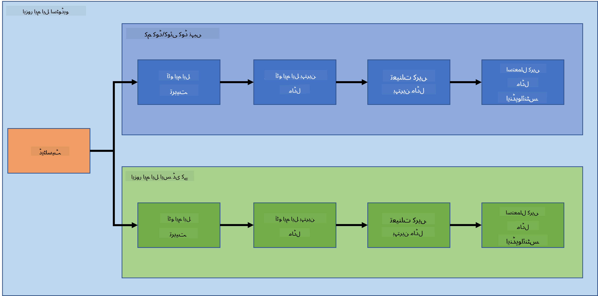
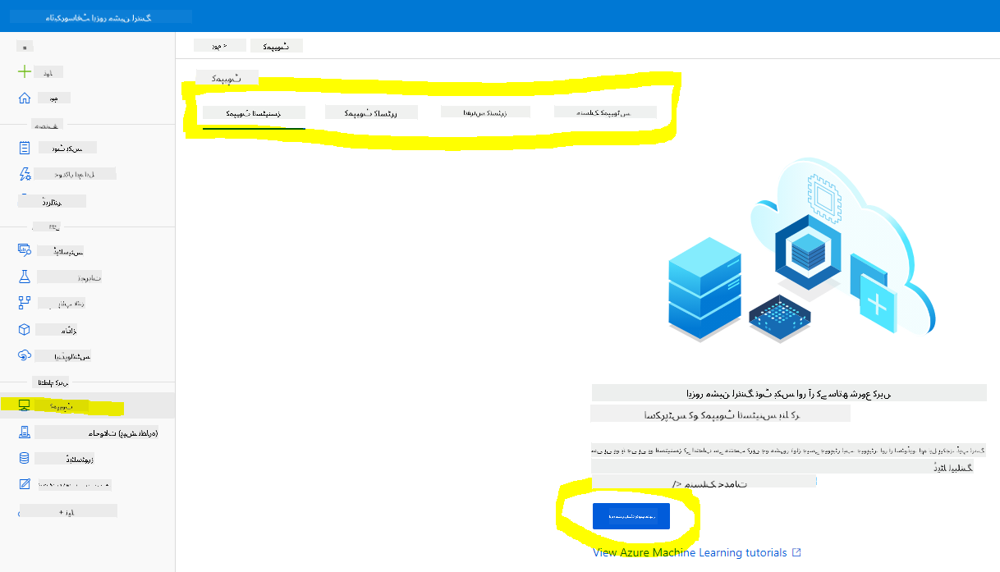
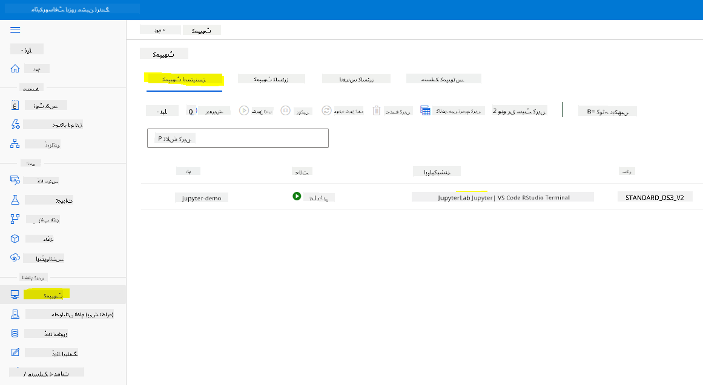

<!--
CO_OP_TRANSLATOR_METADATA:
{
  "original_hash": "5da2d6b3736f6d668b89de9bf3bdd31b",
  "translation_date": "2025-09-04T15:55:12+00:00",
  "source_file": "5-Data-Science-In-Cloud/19-Azure/README.md",
  "language_code": "ur"
}
-->
# کلاؤڈ میں ڈیٹا سائنس: "Azure ML SDK" کا طریقہ

| کی اسکیچ نوٹ ](../../sketchnotes/19-DataScience-Cloud.png)|
|:---:|
| کلاؤڈ میں ڈیٹا سائنس: Azure ML SDK - _[@nitya](https://twitter.com/nitya) کی اسکیچ نوٹ_ |

فہرستِ مضامین:

- [کلاؤڈ میں ڈیٹا سائنس: "Azure ML SDK" کا طریقہ](../../../../5-Data-Science-In-Cloud/19-Azure)
  - [لیکچر سے پہلے کا کوئز](../../../../5-Data-Science-In-Cloud/19-Azure)
  - [1. تعارف](../../../../5-Data-Science-In-Cloud/19-Azure)
    - [1.1 Azure ML SDK کیا ہے؟](../../../../5-Data-Science-In-Cloud/19-Azure)
    - [1.2 دل کی ناکامی کی پیشن گوئی کا منصوبہ اور ڈیٹا سیٹ کا تعارف](../../../../5-Data-Science-In-Cloud/19-Azure)
  - [2. Azure ML SDK کے ساتھ ماڈل کی تربیت](../../../../5-Data-Science-In-Cloud/19-Azure)
    - [2.1 Azure ML ورک اسپیس بنائیں](../../../../5-Data-Science-In-Cloud/19-Azure)
    - [2.2 کمپیوٹ انسٹینس بنائیں](../../../../5-Data-Science-In-Cloud/19-Azure)
    - [2.3 ڈیٹا سیٹ لوڈ کرنا](../../../../5-Data-Science-In-Cloud/19-Azure)
    - [2.4 نوٹ بکس بنانا](../../../../5-Data-Science-In-Cloud/19-Azure)
    - [2.5 ماڈل کی تربیت](../../../../5-Data-Science-In-Cloud/19-Azure)
      - [2.5.1 ورک اسپیس، تجربہ، کمپیوٹ کلسٹر اور ڈیٹا سیٹ سیٹ اپ کریں](../../../../5-Data-Science-In-Cloud/19-Azure)
      - [2.5.2 AutoML کنفیگریشن اور تربیت](../../../../5-Data-Science-In-Cloud/19-Azure)
  - [3. Azure ML SDK کے ساتھ ماڈل کی تعیناتی اور اینڈ پوائنٹ کا استعمال](../../../../5-Data-Science-In-Cloud/19-Azure)
    - [3.1 بہترین ماڈل کو محفوظ کرنا](../../../../5-Data-Science-In-Cloud/19-Azure)
    - [3.2 ماڈل کی تعیناتی](../../../../5-Data-Science-In-Cloud/19-Azure)
    - [3.3 اینڈ پوائنٹ کا استعمال](../../../../5-Data-Science-In-Cloud/19-Azure)
  - [🚀 چیلنج](../../../../5-Data-Science-In-Cloud/19-Azure)
  - [لیکچر کے بعد کا کوئز](../../../../5-Data-Science-In-Cloud/19-Azure)
  - [جائزہ اور خود مطالعہ](../../../../5-Data-Science-In-Cloud/19-Azure)
  - [اسائنمنٹ](../../../../5-Data-Science-In-Cloud/19-Azure)

## [لیکچر سے پہلے کا کوئز](https://purple-hill-04aebfb03.1.azurestaticapps.net/quiz/36)

## 1. تعارف

### 1.1 Azure ML SDK کیا ہے؟

ڈیٹا سائنسدان اور AI ڈویلپرز Azure Machine Learning SDK کا استعمال کرتے ہیں تاکہ Azure Machine Learning سروس کے ساتھ مشین لرننگ ورک فلو بنائیں اور چلائیں۔ آپ اس سروس کے ساتھ کسی بھی Python ماحول میں تعامل کر سکتے ہیں، جیسے Jupyter Notebooks، Visual Studio Code، یا آپ کا پسندیدہ Python IDE۔

SDK کے اہم شعبے شامل ہیں:

- مشین لرننگ تجربات میں استعمال ہونے والے ڈیٹا سیٹس کی زندگی کے دورانیے کو دریافت کریں، تیار کریں اور منظم کریں۔
- کلاؤڈ وسائل کا انتظام کریں تاکہ مشین لرننگ تجربات کی نگرانی، لاگنگ، اور تنظیم کی جا سکے۔
- ماڈلز کو مقامی طور پر یا کلاؤڈ وسائل کے ذریعے تربیت دیں، بشمول GPU-تیز رفتار ماڈل کی تربیت۔
- خودکار مشین لرننگ کا استعمال کریں، جو کنفیگریشن پیرامیٹرز اور تربیتی ڈیٹا کو قبول کرتا ہے۔ یہ الگورتھمز اور ہائپر پیرامیٹر سیٹنگز کے ذریعے خود بخود تکرار کرتا ہے تاکہ پیشن گوئی چلانے کے لیے بہترین ماڈل تلاش کیا جا سکے۔
- ویب سروسز کو تعینات کریں تاکہ آپ کے تربیت یافتہ ماڈلز کو RESTful سروسز میں تبدیل کیا جا سکے، جنہیں کسی بھی ایپلیکیشن میں استعمال کیا جا سکتا ہے۔

[Azure Machine Learning SDK کے بارے میں مزید جانیں](https://docs.microsoft.com/python/api/overview/azure/ml?WT.mc_id=academic-77958-bethanycheum&ocid=AID3041109)

[پچھلے سبق](../18-Low-Code/README.md) میں، ہم نے دیکھا کہ کس طرح کم کوڈ/کوئی کوڈ طریقے سے ماڈل کو تربیت، تعینات اور استعمال کیا جا سکتا ہے۔ ہم نے دل کی ناکامی کے ڈیٹا سیٹ کا استعمال کرتے ہوئے دل کی ناکامی کی پیشن گوئی کا ماڈل تیار کیا۔ اس سبق میں، ہم بالکل وہی کام کریں گے لیکن Azure Machine Learning SDK کا استعمال کرتے ہوئے۔



### 1.2 دل کی ناکامی کی پیشن گوئی کا منصوبہ اور ڈیٹا سیٹ کا تعارف

دل کی ناکامی کی پیشن گوئی کے منصوبے اور ڈیٹا سیٹ کے تعارف کے لیے [یہاں دیکھیں](../18-Low-Code/README.md)۔

## 2. Azure ML SDK کے ساتھ ماڈل کی تربیت
### 2.1 Azure ML ورک اسپیس بنائیں

سادگی کے لیے، ہم جیوپیٹر نوٹ بک پر کام کریں گے۔ اس کا مطلب ہے کہ آپ کے پاس پہلے سے ہی ایک ورک اسپیس اور کمپیوٹ انسٹینس موجود ہے۔ اگر آپ کے پاس پہلے سے ورک اسپیس موجود ہے، تو آپ براہ راست سیکشن 2.3 نوٹ بک تخلیق پر جا سکتے ہیں۔

اگر نہیں، تو براہ کرم [پچھلے سبق](../18-Low-Code/README.md) کے سیکشن **2.1 Azure ML ورک اسپیس بنائیں** میں دی گئی ہدایات پر عمل کریں تاکہ ورک اسپیس بنایا جا سکے۔

### 2.2 کمپیوٹ انسٹینس بنائیں

[Azure ML ورک اسپیس](https://ml.azure.com/) میں جو ہم نے پہلے بنایا تھا، کمپیوٹ مینو پر جائیں اور آپ کو دستیاب مختلف کمپیوٹ وسائل نظر آئیں گے۔



آئیے جیوپیٹر نوٹ بک فراہم کرنے کے لیے ایک کمپیوٹ انسٹینس بنائیں۔
1. + نیو بٹن پر کلک کریں۔
2. اپنے کمپیوٹ انسٹینس کو ایک نام دیں۔
3. اپنے اختیارات منتخب کریں: CPU یا GPU، VM سائز اور کور نمبر۔
4. کریئیٹ بٹن پر کلک کریں۔

مبارک ہو، آپ نے ابھی ایک کمپیوٹ انسٹینس بنایا ہے! ہم اس کمپیوٹ انسٹینس کو نوٹ بک بنانے کے لیے استعمال کریں گے [نوٹ بکس بنانے کے سیکشن](../../../../5-Data-Science-In-Cloud/19-Azure) میں۔

### 2.3 ڈیٹا سیٹ لوڈ کرنا
اگر آپ نے ابھی تک ڈیٹا سیٹ اپ لوڈ نہیں کیا ہے، تو براہ کرم [پچھلے سبق](../18-Low-Code/README.md) کے سیکشن **2.3 ڈیٹا سیٹ لوڈ کرنا** کا حوالہ دیں۔

### 2.4 نوٹ بکس بنانا

> **_نوٹ:_** اگلے مرحلے کے لیے آپ یا تو ایک نیا نوٹ بک شروع سے بنا سکتے ہیں، یا آپ [نوٹ بک جو ہم نے بنایا تھا](notebook.ipynb) کو اپنے Azure ML اسٹوڈیو میں اپ لوڈ کر سکتے ہیں۔ اسے اپ لوڈ کرنے کے لیے، بس "نوٹ بک" مینو پر کلک کریں اور نوٹ بک اپ لوڈ کریں۔

نوٹ بکس ڈیٹا سائنس کے عمل کا ایک بہت اہم حصہ ہیں۔ ان کا استعمال ایکسپلورٹری ڈیٹا اینالیسس (EDA) کرنے، کمپیوٹ کلسٹر کو ماڈل کی تربیت کے لیے کال کرنے، یا انفرینس کلسٹر کو اینڈ پوائنٹ تعینات کرنے کے لیے کیا جا سکتا ہے۔

نوٹ بک بنانے کے لیے، ہمیں ایک کمپیوٹ نوڈ کی ضرورت ہے جو جیوپیٹر نوٹ بک انسٹینس فراہم کر رہا ہو۔ [Azure ML ورک اسپیس](https://ml.azure.com/) پر واپس جائیں اور کمپیوٹ انسٹینسز پر کلک کریں۔ کمپیوٹ انسٹینسز کی فہرست میں آپ کو [کمپیوٹ انسٹینس جو ہم نے پہلے بنایا تھا](../../../../5-Data-Science-In-Cloud/19-Azure) نظر آنا چاہیے۔

1. ایپلیکیشنز سیکشن میں، جیوپیٹر آپشن پر کلک کریں۔
2. "ہاں، میں سمجھتا ہوں" باکس کو ٹک کریں اور جاری رکھنے کے بٹن پر کلک کریں۔

3. یہ آپ کے جیوپیٹر نوٹ بک انسٹینس کے ساتھ ایک نیا براؤزر ٹیب کھولنا چاہیے۔ نوٹ بک بنانے کے لیے "نیو" بٹن پر کلک کریں۔


اب جب کہ ہمارے پاس ایک نوٹ بک ہے، ہم Azure ML SDK کے ساتھ ماڈل کی تربیت شروع کر سکتے ہیں۔

### 2.5 ماڈل کی تربیت

سب سے پہلے، اگر آپ کو کبھی شک ہو، تو [Azure ML SDK دستاویزات](https://docs.microsoft.com/python/api/overview/azure/ml?WT.mc_id=academic-77958-bethanycheum&ocid=AID3041109) کا حوالہ دیں۔ اس میں ان تمام ماڈیولز کی ضروری معلومات موجود ہیں جنہیں ہم اس سبق میں دیکھنے جا رہے ہیں۔

#### 2.5.1 ورک اسپیس، تجربہ، کمپیوٹ کلسٹر اور ڈیٹا سیٹ سیٹ اپ کریں

آپ کو درج ذیل کوڈ کا استعمال کرتے ہوئے کنفیگریشن فائل سے `ورک اسپیس` لوڈ کرنے کی ضرورت ہے:

```python
from azureml.core import Workspace
ws = Workspace.from_config()
```

یہ `Workspace` قسم کا ایک آبجیکٹ واپس کرتا ہے جو ورک اسپیس کی نمائندگی کرتا ہے۔ پھر آپ کو درج ذیل کوڈ کا استعمال کرتے ہوئے ایک `تجربہ` بنانا ہوگا:

```python
from azureml.core import Experiment
experiment_name = 'aml-experiment'
experiment = Experiment(ws, experiment_name)
```
ورک اسپیس سے تجربہ حاصل کرنے یا بنانے کے لیے، آپ تجربہ کا نام استعمال کرتے ہوئے درخواست کرتے ہیں۔ تجربہ کا نام 3-36 حروف کا ہونا چاہیے، ایک حرف یا نمبر سے شروع ہونا چاہیے، اور صرف حروف، نمبر، انڈر سکورز، اور ڈیشز پر مشتمل ہو سکتا ہے۔ اگر ورک اسپیس میں تجربہ نہیں ملا، تو ایک نیا تجربہ بنایا جاتا ہے۔

اب آپ کو درج ذیل کوڈ کا استعمال کرتے ہوئے تربیت کے لیے ایک کمپیوٹ کلسٹر بنانا ہوگا۔ نوٹ کریں کہ یہ مرحلہ چند منٹ لے سکتا ہے۔

```python
from azureml.core.compute import AmlCompute

aml_name = "heart-f-cluster"
try:
    aml_compute = AmlCompute(ws, aml_name)
    print('Found existing AML compute context.')
except:
    print('Creating new AML compute context.')
    aml_config = AmlCompute.provisioning_configuration(vm_size = "Standard_D2_v2", min_nodes=1, max_nodes=3)
    aml_compute = AmlCompute.create(ws, name = aml_name, provisioning_configuration = aml_config)
    aml_compute.wait_for_completion(show_output = True)

cts = ws.compute_targets
compute_target = cts[aml_name]
```

آپ ورک اسپیس سے ڈیٹا سیٹ کو ڈیٹا سیٹ کے نام کا استعمال کرتے ہوئے درج ذیل طریقے سے حاصل کر سکتے ہیں:

```python
dataset = ws.datasets['heart-failure-records']
df = dataset.to_pandas_dataframe()
df.describe()
```
#### 2.5.2 AutoML کنفیگریشن اور تربیت

AutoML کنفیگریشن سیٹ کرنے کے لیے، [AutoMLConfig کلاس](https://docs.microsoft.com/python/api/azureml-train-automl-client/azureml.train.automl.automlconfig(class)?WT.mc_id=academic-77958-bethanycheum&ocid=AID3041109) کا استعمال کریں۔

جیسا کہ دستاویز میں بیان کیا گیا ہے، آپ بہت سے پیرامیٹرز کے ساتھ کھیل سکتے ہیں۔ اس منصوبے کے لیے، ہم درج ذیل پیرامیٹرز استعمال کریں گے:

- `experiment_timeout_minutes`: تجربہ کو خود بخود روکنے اور نتائج کو دستیاب کرنے سے پہلے تجربہ کو چلانے کی اجازت دی گئی زیادہ سے زیادہ وقت (منٹوں میں)۔
- `max_concurrent_iterations`: تجربہ کے لیے اجازت دی گئی زیادہ سے زیادہ بیک وقت تربیتی تکرار۔
- `primary_metric`: تجربہ کی حیثیت کا تعین کرنے کے لیے استعمال ہونے والا بنیادی میٹرک۔
- `compute_target`: Azure Machine Learning کمپیوٹ ٹارگٹ جس پر خودکار مشین لرننگ تجربہ چلایا جائے گا۔
- `task`: چلانے کے لیے کام کی قسم۔ اقدار 'classification'، 'regression'، یا 'forecasting' ہو سکتی ہیں، اس پر منحصر ہے کہ خودکار ML مسئلہ کو حل کرنا ہے۔
- `training_data`: تجربہ کے اندر استعمال ہونے والے تربیتی ڈیٹا۔ اس میں تربیتی خصوصیات اور ایک لیبل کالم (اختیاری طور پر نمونہ وزن کالم) دونوں شامل ہونے چاہئیں۔
- `label_column_name`: لیبل کالم کا نام۔
- `path`: Azure Machine Learning پروجیکٹ فولڈر کا مکمل راستہ۔
- `enable_early_stopping`: اگر اسکور قلیل مدتی میں بہتر نہیں ہو رہا ہے تو ابتدائی ختم کرنے کو فعال کریں۔
- `featurization`: اشارہ کہ آیا فیچرائزیشن مرحلہ خود بخود کیا جانا چاہیے یا نہیں، یا آیا حسب ضرورت فیچرائزیشن استعمال کی جانی چاہیے۔
- `debug_log`: ڈیبگ معلومات لکھنے کے لیے لاگ فائل۔

```python
from azureml.train.automl import AutoMLConfig

project_folder = './aml-project'

automl_settings = {
    "experiment_timeout_minutes": 20,
    "max_concurrent_iterations": 3,
    "primary_metric" : 'AUC_weighted'
}

automl_config = AutoMLConfig(compute_target=compute_target,
                             task = "classification",
                             training_data=dataset,
                             label_column_name="DEATH_EVENT",
                             path = project_folder,  
                             enable_early_stopping= True,
                             featurization= 'auto',
                             debug_log = "automl_errors.log",
                             **automl_settings
                            )
```
اب جب کہ آپ کی کنفیگریشن سیٹ ہو گئی ہے، آپ درج ذیل کوڈ کا استعمال کرتے ہوئے ماڈل کو تربیت دے سکتے ہیں۔ یہ مرحلہ آپ کے کلسٹر کے سائز پر منحصر ہے، ایک گھنٹے تک لے سکتا ہے۔

```python
remote_run = experiment.submit(automl_config)
```
آپ مختلف تجربات دکھانے کے لیے RunDetails ویجیٹ چلا سکتے ہیں۔
```python
from azureml.widgets import RunDetails
RunDetails(remote_run).show()
```
## 3. Azure ML SDK کے ساتھ ماڈل کی تعیناتی اور اینڈ پوائنٹ کا استعمال

### 3.1 بہترین ماڈل کو محفوظ کرنا

`remote_run` [AutoMLRun](https://docs.microsoft.com/python/api/azureml-train-automl-client/azureml.train.automl.run.automlrun?WT.mc_id=academic-77958-bethanycheum&ocid=AID3041109) قسم کا ایک آبجیکٹ ہے۔ اس آبجیکٹ میں `get_output()` طریقہ موجود ہے جو بہترین رن اور متعلقہ فٹ شدہ ماڈل واپس کرتا ہے۔

```python
best_run, fitted_model = remote_run.get_output()
```
آپ بہترین ماڈل کے لیے استعمال کیے گئے پیرامیٹرز کو صرف فٹ شدہ ماڈل کو پرنٹ کرکے دیکھ سکتے ہیں اور بہترین ماڈل کی خصوصیات کو [get_properties()](https://docs.microsoft.com/python/api/azureml-core/azureml.core.run(class)?view=azure-ml-py#azureml_core_Run_get_properties?WT.mc_id=academic-77958-bethanycheum&ocid=AID3041109) طریقہ استعمال کرکے دیکھ سکتے ہیں۔

```python
best_run.get_properties()
```

اب ماڈل کو [register_model](https://docs.microsoft.com/python/api/azureml-train-automl-client/azureml.train.automl.run.automlrun?view=azure-ml-py#register-model-model-name-none--description-none--tags-none--iteration-none--metric-none-?WT.mc_id=academic-77958-bethanycheum&ocid=AID3041109) طریقہ کے ساتھ رجسٹر کریں۔
```python
model_name = best_run.properties['model_name']
script_file_name = 'inference/score.py'
best_run.download_file('outputs/scoring_file_v_1_0_0.py', 'inference/score.py')
description = "aml heart failure project sdk"
model = best_run.register_model(model_name = model_name,
                                model_path = './outputs/',
                                description = description,
                                tags = None)
```
### 3.2 ماڈل کی تعیناتی

ایک بار بہترین ماڈل محفوظ ہو جائے، ہم اسے [InferenceConfig](https://docs.microsoft.com/python/api/azureml-core/azureml.core.model.inferenceconfig?view=azure-ml-py?ocid=AID3041109) کلاس کے ساتھ تعینات کر سکتے ہیں۔ InferenceConfig تعیناتی کے لیے استعمال ہونے والے کسٹم ماحول کے لیے کنفیگریشن سیٹنگز کی نمائندگی کرتا ہے۔ [AciWebservice](https://docs.microsoft.com/python/api/azureml-core/azureml.core.webservice.aciwebservice?view=azure-ml-py) کلاس Azure Container Instances پر ایک ویب سروس اینڈ پوائنٹ کے طور پر تعینات مشین لرننگ ماڈل کی نمائندگی کرتا ہے۔ ایک تعینات شدہ سروس ماڈل، اسکرپٹ، اور متعلقہ فائلوں سے بنائی جاتی ہے۔ نتیجے میں ویب سروس ایک لوڈ بیلنسڈ، HTTP اینڈ پوائنٹ کے ساتھ ایک REST API ہے۔ آپ اس API کو ڈیٹا بھیج سکتے ہیں اور ماڈل کے ذریعے واپس کی گئی پیشن گوئی حاصل کر سکتے ہیں۔

ماڈل کو [deploy](https://docs.microsoft.com/python/api/azureml-core/azureml.core.model(class)?view=azure-ml-py#deploy-workspace--name--models--inference-config-none--deployment-config-none--deployment-target-none--overwrite-false--show-output-false-?WT.mc_id=academic-77958-bethanycheum&ocid=AID3041109) طریقہ کے ساتھ تعینات کیا جاتا ہے۔

```python
from azureml.core.model import InferenceConfig, Model
from azureml.core.webservice import AciWebservice

inference_config = InferenceConfig(entry_script=script_file_name, environment=best_run.get_environment())

aciconfig = AciWebservice.deploy_configuration(cpu_cores = 1,
                                               memory_gb = 1,
                                               tags = {'type': "automl-heart-failure-prediction"},
                                               description = 'Sample service for AutoML Heart Failure Prediction')

aci_service_name = 'automl-hf-sdk'
aci_service = Model.deploy(ws, aci_service_name, [model], inference_config, aciconfig)
aci_service.wait_for_deployment(True)
print(aci_service.state)
```
یہ مرحلہ چند منٹ لے سکتا ہے۔

### 3.3 اینڈ پوائنٹ کا استعمال

آپ اپنے اینڈ پوائنٹ کو ایک نمونہ ان پٹ بنا کر استعمال کرتے ہیں:

```python
data = {
    "data":
    [
        {
            'age': "60",
            'anaemia': "false",
            'creatinine_phosphokinase': "500",
            'diabetes': "false",
            'ejection_fraction': "38",
            'high_blood_pressure': "false",
            'platelets': "260000",
            'serum_creatinine': "1.40",
            'serum_sodium': "137",
            'sex': "false",
            'smoking': "false",
            'time': "130",
        },
    ],
}

test_sample = str.encode(json.dumps(data))
```
اور پھر آپ اس ان پٹ کو پیشن گوئی کے لیے اپنے ماڈل کو بھیج سکتے ہیں:
```python
response = aci_service.run(input_data=test_sample)
response
```  
یہ آؤٹ پٹ `'{"result": [false]}'` ہونا چاہیے۔ اس کا مطلب یہ ہے کہ جو مریض کا ڈیٹا ہم نے اینڈ پوائنٹ کو بھیجا، اس نے پیش گوئی `false` دی، یعنی یہ شخص دل کے دورے کا شکار ہونے کا امکان نہیں رکھتا۔

مبارک ہو! آپ نے ابھی Azure ML SDK کے ساتھ Azure ML پر ماڈل کو ڈیپلائے اور استعمال کیا!

> **_نوٹ:_** جب آپ پروجیکٹ مکمل کر لیں، تو تمام وسائل کو حذف کرنا نہ بھولیں۔

## 🚀 چیلنج

SDK کے ذریعے آپ اور بھی بہت کچھ کر سکتے ہیں، بدقسمتی سے ہم اس سبق میں سب کچھ نہیں دیکھ سکتے۔ لیکن اچھی خبر یہ ہے کہ SDK کی ڈاکیومنٹیشن کو سمجھنے کا طریقہ سیکھنا آپ کو خود سے بہت آگے لے جا سکتا ہے۔ Azure ML SDK کی ڈاکیومنٹیشن دیکھیں اور `Pipeline` کلاس تلاش کریں جو آپ کو پائپ لائنز بنانے کی اجازت دیتی ہے۔ پائپ لائن مختلف مراحل کا مجموعہ ہے جو ورک فلو کے طور پر چلائے جا سکتے ہیں۔

**اشارہ:** [SDK ڈاکیومنٹیشن](https://docs.microsoft.com/python/api/overview/azure/ml/?view=azure-ml-py?WT.mc_id=academic-77958-bethanycheum&ocid=AID3041109) پر جائیں اور سرچ بار میں "Pipeline" جیسے کلیدی الفاظ ٹائپ کریں۔ آپ کو سرچ نتائج میں `azureml.pipeline.core.Pipeline` کلاس ملنی چاہیے۔

## [لیکچر کے بعد کا کوئز](https://ff-quizzes.netlify.app/en/ds/)

## جائزہ اور خود مطالعہ

اس سبق میں، آپ نے سیکھا کہ Azure ML SDK کے ذریعے کلاؤڈ میں دل کے دورے کے خطرے کی پیش گوئی کے لیے ماڈل کو ٹرین، ڈیپلائے اور استعمال کیسے کیا جائے۔ مزید معلومات کے لیے اس [ڈاکیومنٹیشن](https://docs.microsoft.com/python/api/overview/azure/ml/?view=azure-ml-py?WT.mc_id=academic-77958-bethanycheum&ocid=AID3041109) کو دیکھیں۔ Azure ML SDK کے ساتھ اپنا ماڈل بنانے کی کوشش کریں۔

## اسائنمنٹ

[Azure ML SDK کا استعمال کرتے ہوئے ڈیٹا سائنس پروجیکٹ](assignment.md)  

---

**ڈسکلیمر**:  
یہ دستاویز AI ترجمہ سروس [Co-op Translator](https://github.com/Azure/co-op-translator) کا استعمال کرتے ہوئے ترجمہ کی گئی ہے۔ ہم درستگی کے لیے کوشش کرتے ہیں، لیکن براہ کرم آگاہ رہیں کہ خودکار ترجمے میں غلطیاں یا عدم درستگی ہو سکتی ہیں۔ اصل دستاویز، جو اس کی مقامی زبان میں ہے، کو مستند ذریعہ سمجھا جانا چاہیے۔ اہم معلومات کے لیے، پیشہ ور انسانی ترجمہ کی سفارش کی جاتی ہے۔ اس ترجمے کے استعمال سے پیدا ہونے والی کسی بھی غلط فہمی یا غلط تشریح کے لیے ہم ذمہ دار نہیں ہیں۔