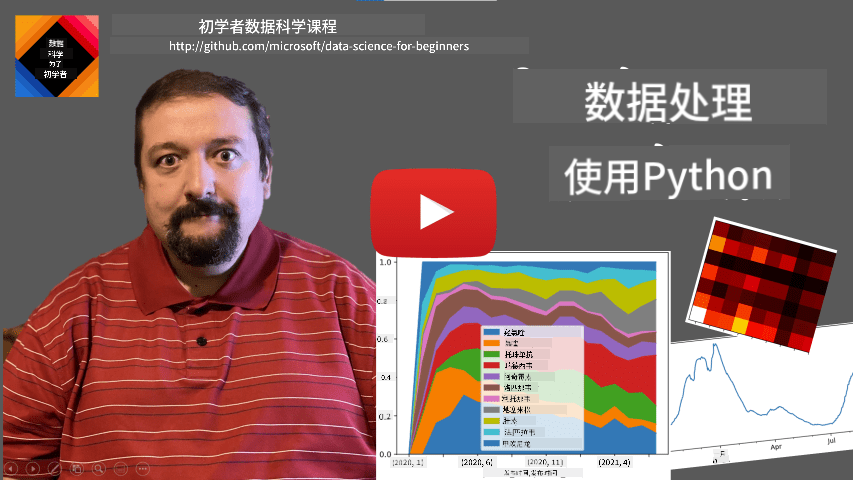
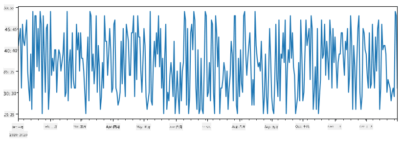
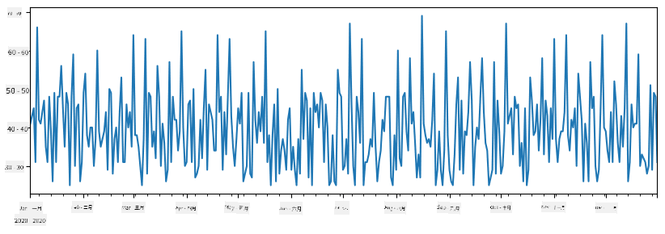
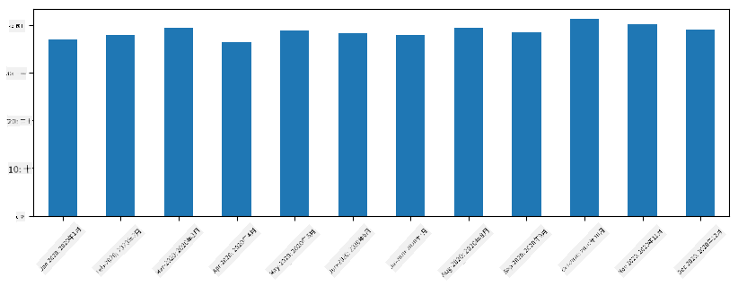
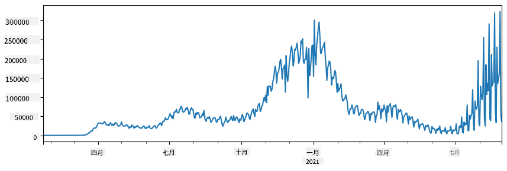
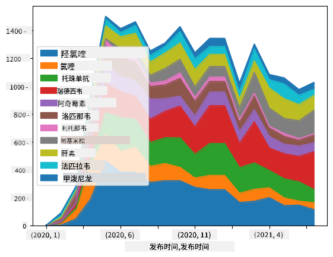

<!--
CO_OP_TRANSLATOR_METADATA:
{
  "original_hash": "57f7db1f4c3ae3361c1d1fbafcdd690c",
  "translation_date": "2025-09-04T12:17:44+00:00",
  "source_file": "2-Working-With-Data/07-python/README.md",
  "language_code": "zh"
}
-->
# 使用数据：Python和Pandas库

|  ](../../sketchnotes/07-WorkWithPython.png) |
| :-------------------------------------------------------------------------------------------------------: |
|                 使用Python - _Sketchnote by [@nitya](https://twitter.com/nitya)_                          |

[](https://youtu.be/dZjWOGbsN4Y)

虽然数据库提供了非常高效的方式来存储数据并通过查询语言进行查询，但最灵活的数据处理方式是编写自己的程序来操作数据。在许多情况下，使用数据库查询可能更有效。然而，当需要更复杂的数据处理时，SQL可能无法轻松完成这些任务。  
数据处理可以用任何编程语言编写，但有些语言在处理数据方面更高级。数据科学家通常偏好以下语言之一：

* **[Python](https://www.python.org/)** 是一种通用编程语言，由于其简单性，通常被认为是初学者的最佳选择之一。Python有许多附加库，可以帮助解决许多实际问题，例如从ZIP压缩文件中提取数据或将图片转换为灰度。除了数据科学，Python还常用于Web开发。
* **[R](https://www.r-project.org/)** 是一个传统工具箱，专为统计数据处理而开发。它包含大量的库资源（CRAN），使其成为数据处理的良好选择。然而，R不是通用编程语言，很少在数据科学领域之外使用。
* **[Julia](https://julialang.org/)** 是另一种专为数据科学开发的语言。它旨在提供比Python更好的性能，是科学实验的绝佳工具。

在本课程中，我们将重点使用Python进行简单的数据处理。我们假设您对该语言有基本的了解。如果您想深入学习Python，可以参考以下资源之一：

* [通过Turtle Graphics和分形趣味学习Python](https://github.com/shwars/pycourse) - 基于GitHub的Python编程快速入门课程
* [迈出Python的第一步](https://docs.microsoft.com/en-us/learn/paths/python-first-steps/?WT.mc_id=academic-77958-bethanycheum) [Microsoft Learn](http://learn.microsoft.com/?WT.mc_id=academic-77958-bethanycheum)上的学习路径

数据可以有多种形式。在本课程中，我们将考虑三种数据形式——**表格数据**、**文本**和**图像**。

我们将专注于一些数据处理的示例，而不是全面介绍所有相关库。这将帮助您了解可能的操作，并让您知道在需要时可以在哪里找到解决方案。

> **最有用的建议**：当您需要对数据执行某些操作但不知道如何操作时，可以尝试在互联网上搜索。[Stackoverflow](https://stackoverflow.com/)通常包含许多关于Python的典型任务的有用代码示例。

## [课前测验](https://purple-hill-04aebfb03.1.azurestaticapps.net/quiz/12)

## 表格数据和数据框

在我们讨论关系型数据库时，您已经接触过表格数据。当您拥有大量数据，并且数据存储在许多不同的关联表中时，使用SQL来处理它是非常合理的。然而，在许多情况下，我们有一个数据表，并需要对这些数据进行一些**理解**或**洞察**，例如分布、值之间的相关性等。在数据科学中，我们经常需要对原始数据进行一些转换，然后进行可视化。这两个步骤都可以通过Python轻松完成。

Python中有两个最有用的库可以帮助您处理表格数据：
* **[Pandas](https://pandas.pydata.org/)** 允许您操作所谓的**数据框（Dataframes）**，它类似于关系表。您可以拥有命名的列，并对行、列以及整个数据框执行各种操作。
* **[Numpy](https://numpy.org/)** 是一个用于处理**张量（Tensors）**的库，即多维**数组（Arrays）**。数组的值具有相同的底层类型，它比数据框更简单，但提供了更多的数学操作，并减少了开销。

此外，还有几个您应该了解的库：
* **[Matplotlib](https://matplotlib.org/)** 是一个用于数据可视化和绘制图表的库
* **[SciPy](https://www.scipy.org/)** 是一个包含一些额外科学函数的库。在讨论概率和统计时，我们已经接触过这个库

以下是您通常在Python程序开头导入这些库的代码：
```python
import numpy as np
import pandas as pd
import matplotlib.pyplot as plt
from scipy import ... # you need to specify exact sub-packages that you need
``` 

Pandas围绕几个基本概念展开。

### Series（序列）

**Series** 是一组值的序列，类似于列表或numpy数组。主要区别在于Series还有一个**索引**，当我们对Series进行操作（例如相加）时，会考虑索引。索引可以简单到整数行号（从列表或数组创建Series时默认使用的索引），也可以具有复杂结构，例如日期区间。

> **注意**：在配套的笔记本文件 [`notebook.ipynb`](notebook.ipynb) 中有一些Pandas的入门代码。我们这里只列出一些示例，您可以查看完整的笔记本文件。

举个例子：我们想分析冰淇淋店的销售情况。让我们生成一段时间内的销售数据（每天售出的商品数量）：
```python
start_date = "Jan 1, 2020"
end_date = "Mar 31, 2020"
idx = pd.date_range(start_date,end_date)
print(f"Length of index is {len(idx)}")
items_sold = pd.Series(np.random.randint(25,50,size=len(idx)),index=idx)
items_sold.plot()
```


假设每周我们都会举办一次朋友聚会，并额外购买10盒冰淇淋用于聚会。我们可以创建另一个以周为索引的Series来展示这一点：
```python
additional_items = pd.Series(10,index=pd.date_range(start_date,end_date,freq="W"))
```
当我们将两个Series相加时，就得到了总数量：
```python
total_items = items_sold.add(additional_items,fill_value=0)
total_items.plot()
```


> **注意** 我们没有使用简单的语法 `total_items+additional_items`。如果使用这种方式，我们会在结果Series中得到许多`NaN`（*Not a Number*）值。这是因为在`additional_items`的某些索引点上缺少值，而将`NaN`与任何值相加都会得到`NaN`。因此，我们需要在相加时指定`fill_value`参数。

对于时间序列，我们还可以使用不同的时间间隔对序列进行**重采样**。例如，假设我们想计算每月的平均销售量，可以使用以下代码：
```python
monthly = total_items.resample("1M").mean()
ax = monthly.plot(kind='bar')
```


### DataFrame（数据框）

数据框本质上是具有相同索引的多个Series的集合。我们可以将几个Series组合成一个数据框：
```python
a = pd.Series(range(1,10))
b = pd.Series(["I","like","to","play","games","and","will","not","change"],index=range(0,9))
df = pd.DataFrame([a,b])
```
这将创建如下的水平表：
|     | 0   | 1    | 2   | 3   | 4      | 5   | 6      | 7    | 8    |
| --- | --- | ---- | --- | --- | ------ | --- | ------ | ---- | ---- |
| 0   | 1   | 2    | 3   | 4   | 5      | 6   | 7      | 8    | 9    |
| 1   | I   | like | to  | use | Python | and | Pandas | very | much |

我们还可以将Series作为列，并使用字典指定列名：
```python
df = pd.DataFrame({ 'A' : a, 'B' : b })
```
这将生成如下表格：

|     | A   | B      |
| --- | --- | ------ |
| 0   | 1   | I      |
| 1   | 2   | like   |
| 2   | 3   | to     |
| 3   | 4   | use    |
| 4   | 5   | Python |
| 5   | 6   | and    |
| 6   | 7   | Pandas |
| 7   | 8   | very   |
| 8   | 9   | much   |

**注意** 我们还可以通过转置前一个表格来获得这种表格布局，例如：
```python
df = pd.DataFrame([a,b]).T..rename(columns={ 0 : 'A', 1 : 'B' })
```
这里`.T`表示转置数据框的操作，即交换行和列，而`rename`操作允许我们重命名列以匹配前面的示例。

以下是我们可以对数据框执行的一些最重要操作：

**列选择**。我们可以通过写`df['A']`选择单个列——此操作返回一个Series。我们还可以通过写`df[['B','A']]`选择列的子集到另一个数据框——此操作返回另一个数据框。

**按条件过滤**某些行。例如，要仅保留列`A`大于5的行，我们可以写`df[df['A']>5]`。

> **注意**：过滤的工作原理如下。表达式`df['A']<5`返回一个布尔Series，指示原始Series`df['A']`中每个元素的表达式是否为`True`或`False`。当布尔Series用作索引时，它返回数据框中的行子集。因此，不能使用任意Python布尔表达式，例如写`df[df['A']>5 and df['A']<7]`是错误的。相反，您应该使用布尔Series上的特殊`&`操作，写`df[(df['A']>5) & (df['A']<7)]`（*括号在这里很重要*）。

**创建新的可计算列**。我们可以通过使用直观的表达式轻松为数据框创建新的可计算列：
```python
df['DivA'] = df['A']-df['A'].mean() 
``` 
此示例计算列A与其平均值的偏差。实际发生的情况是我们计算了一个Series，然后将此Series分配给左侧，创建了另一个列。因此，我们不能使用与Series不兼容的任何操作，例如以下代码是错误的：
```python
# Wrong code -> df['ADescr'] = "Low" if df['A'] < 5 else "Hi"
df['LenB'] = len(df['B']) # <- Wrong result
``` 
后一个示例虽然语法正确，但会给出错误结果，因为它将Series`B`的长度分配给列中的所有值，而不是分配给每个元素的长度。

如果需要计算类似这样的复杂表达式，可以使用`apply`函数。最后一个示例可以写成如下：
```python
df['LenB'] = df['B'].apply(lambda x : len(x))
# or 
df['LenB'] = df['B'].apply(len)
```

执行上述操作后，我们将得到以下数据框：

|     | A   | B      | DivA | LenB |
| --- | --- | ------ | ---- | ---- |
| 0   | 1   | I      | -4.0 | 1    |
| 1   | 2   | like   | -3.0 | 4    |
| 2   | 3   | to     | -2.0 | 2    |
| 3   | 4   | use    | -1.0 | 3    |
| 4   | 5   | Python | 0.0  | 6    |
| 5   | 6   | and    | 1.0  | 3    |
| 6   | 7   | Pandas | 2.0  | 6    |
| 7   | 8   | very   | 3.0  | 4    |
| 8   | 9   | much   | 4.0  | 4    |

**基于数字选择行**可以使用`iloc`构造。例如，要选择数据框中的前5行：
```python
df.iloc[:5]
```

**分组**通常用于获得类似于Excel中的*数据透视表*的结果。假设我们想计算列`A`的平均值，按`LenB`的每个值分组。我们可以按`LenB`分组数据框，然后调用`mean`：
```python
df.groupby(by='LenB').mean()
```
如果我们需要计算组中的平均值和元素数量，可以使用更复杂的`aggregate`函数：
```python
df.groupby(by='LenB') \
 .aggregate({ 'DivA' : len, 'A' : lambda x: x.mean() }) \
 .rename(columns={ 'DivA' : 'Count', 'A' : 'Mean'})
```
这将生成以下表格：

| LenB | Count | Mean     |
| ---- | ----- | -------- |
| 1    | 1     | 1.000000 |
| 2    | 1     | 3.000000 |
| 3    | 2     | 5.000000 |
| 4    | 3     | 6.333333 |
| 6    | 2     | 6.000000 |

### 获取数据
我们已经看到，从 Python 对象构建 Series 和 DataFrame 是多么简单。然而，数据通常以文本文件或 Excel 表格的形式出现。幸运的是，Pandas 为我们提供了一种简单的方法来从磁盘加载数据。例如，读取 CSV 文件就像这样简单：
```python
df = pd.read_csv('file.csv')
```
我们将在“挑战”部分中看到更多加载数据的示例，包括从外部网站获取数据。

### 打印和绘图

数据科学家经常需要探索数据，因此能够可视化数据非常重要。当 DataFrame 很大时，我们通常只需要打印出前几行来确保我们做的一切都是正确的。这可以通过调用 `df.head()` 来完成。如果你在 Jupyter Notebook 中运行它，它会以漂亮的表格形式打印出 DataFrame。

我们还看到了使用 `plot` 函数来可视化某些列的用法。虽然 `plot` 对许多任务非常有用，并通过 `kind=` 参数支持许多不同的图表类型，但你始终可以使用原始的 `matplotlib` 库来绘制更复杂的内容。我们将在单独的课程中详细介绍数据可视化。

这个概述涵盖了 Pandas 的最重要概念，但这个库非常丰富，你可以用它做的事情没有限制！现在让我们应用这些知识来解决具体问题。

## 🚀 挑战 1：分析 COVID 传播

我们将关注的第一个问题是 COVID-19 的流行病传播建模。为此，我们将使用由 [约翰霍普金斯大学](https://jhu.edu/) [系统科学与工程中心](https://systems.jhu.edu/) (CSSE) 提供的不同国家感染人数数据。数据集可以在 [这个 GitHub 仓库](https://github.com/CSSEGISandData/COVID-19) 中找到。

由于我们想展示如何处理数据，我们邀请你打开 [`notebook-covidspread.ipynb`](notebook-covidspread.ipynb) 并从头到尾阅读它。你还可以执行单元格，并完成我们在最后为你留下的一些挑战。



> 如果你不知道如何在 Jupyter Notebook 中运行代码，请查看 [这篇文章](https://soshnikov.com/education/how-to-execute-notebooks-from-github/)。

## 处理非结构化数据

虽然数据通常以表格形式出现，但在某些情况下我们需要处理较少结构化的数据，例如文本或图像。在这种情况下，为了应用我们上面看到的数据处理技术，我们需要以某种方式**提取**结构化数据。以下是一些示例：

* 从文本中提取关键词，并查看这些关键词出现的频率
* 使用神经网络从图片中提取有关对象的信息
* 获取视频摄像头画面中人物的情感信息

## 🚀 挑战 2：分析 COVID 论文

在这个挑战中，我们将继续关注 COVID 疫情的主题，并专注于处理相关的科学论文。有一个 [CORD-19 数据集](https://www.kaggle.com/allen-institute-for-ai/CORD-19-research-challenge)，其中包含超过 7000 篇（撰写时）关于 COVID 的论文，提供了元数据和摘要（其中约一半还提供了全文）。

使用 [Text Analytics for Health](https://docs.microsoft.com/azure/cognitive-services/text-analytics/how-tos/text-analytics-for-health/?WT.mc_id=academic-77958-bethanycheum) 认知服务分析此数据集的完整示例已在 [这篇博客文章](https://soshnikov.com/science/analyzing-medical-papers-with-azure-and-text-analytics-for-health/) 中描述。我们将讨论此分析的简化版本。

> **NOTE**: 我们没有在此仓库中提供数据集副本。你可能需要先从 [Kaggle 上的这个数据集](https://www.kaggle.com/allen-institute-for-ai/CORD-19-research-challenge?select=metadata.csv) 下载 [`metadata.csv`](https://www.kaggle.com/allen-institute-for-ai/CORD-19-research-challenge?select=metadata.csv) 文件。可能需要注册 Kaggle。你也可以从 [这里](https://ai2-semanticscholar-cord-19.s3-us-west-2.amazonaws.com/historical_releases.html) 下载数据集，无需注册，但它将包括所有全文以及元数据文件。

打开 [`notebook-papers.ipynb`](notebook-papers.ipynb) 并从头到尾阅读它。你还可以执行单元格，并完成我们在最后为你留下的一些挑战。



## 处理图像数据

最近，开发了非常强大的 AI 模型，可以帮助我们理解图像。使用预训练的神经网络或云服务可以解决许多任务。以下是一些示例：

* **图像分类**，可以帮助你将图像分类到预定义的类别中。你可以使用诸如 [Custom Vision](https://azure.microsoft.com/services/cognitive-services/custom-vision-service/?WT.mc_id=academic-77958-bethanycheum) 的服务轻松训练自己的图像分类器。
* **对象检测**，用于检测图像中的不同对象。诸如 [计算机视觉](https://azure.microsoft.com/services/cognitive-services/computer-vision/?WT.mc_id=academic-77958-bethanycheum) 的服务可以检测许多常见对象，你还可以训练 [Custom Vision](https://azure.microsoft.com/services/cognitive-services/custom-vision-service/?WT.mc_id=academic-77958-bethanycheum) 模型来检测一些特定的兴趣对象。
* **人脸检测**，包括年龄、性别和情感检测。这可以通过 [Face API](https://azure.microsoft.com/services/cognitive-services/face/?WT.mc_id=academic-77958-bethanycheum) 完成。

所有这些云服务都可以通过 [Python SDKs](https://docs.microsoft.com/samples/azure-samples/cognitive-services-python-sdk-samples/cognitive-services-python-sdk-samples/?WT.mc_id=academic-77958-bethanycheum) 调用，因此可以轻松地集成到你的数据探索工作流中。

以下是一些从图像数据源探索数据的示例：
* 在博客文章 [如何在没有编码的情况下学习数据科学](https://soshnikov.com/azure/how-to-learn-data-science-without-coding/) 中，我们探索 Instagram 照片，试图了解是什么让人们对照片点赞更多。我们首先使用 [计算机视觉](https://azure.microsoft.com/services/cognitive-services/computer-vision/?WT.mc_id=academic-77958-bethanycheum) 从图片中提取尽可能多的信息，然后使用 [Azure Machine Learning AutoML](https://docs.microsoft.com/azure/machine-learning/concept-automated-ml/?WT.mc_id=academic-77958-bethanycheum) 构建可解释的模型。
* 在 [面部研究工作坊](https://github.com/CloudAdvocacy/FaceStudies) 中，我们使用 [Face API](https://azure.microsoft.com/services/cognitive-services/face/?WT.mc_id=academic-77958-bethanycheum) 提取活动照片中人物的情感，以试图了解是什么让人们感到快乐。

## 结论

无论你已经拥有结构化数据还是非结构化数据，使用 Python 都可以完成与数据处理和理解相关的所有步骤。这可能是数据处理最灵活的方式，这也是为什么大多数数据科学家将 Python 作为主要工具的原因。如果你对数据科学之旅是认真的，深入学习 Python 可能是一个好主意！

## [课后测验](https://ff-quizzes.netlify.app/en/ds/)

## 复习与自学

**书籍**
* [Wes McKinney. Python for Data Analysis: Data Wrangling with Pandas, NumPy, and IPython](https://www.amazon.com/gp/product/1491957662)

**在线资源**
* 官方 [10 分钟 Pandas](https://pandas.pydata.org/pandas-docs/stable/user_guide/10min.html) 教程
* [Pandas 可视化文档](https://pandas.pydata.org/pandas-docs/stable/user_guide/visualization.html)

**学习 Python**
* [通过 Turtle Graphics 和分形以有趣的方式学习 Python](https://github.com/shwars/pycourse)
* [通过 Microsoft Learn 学习路径](https://docs.microsoft.com/learn/paths/python-first-steps/?WT.mc_id=academic-77958-bethanycheum) [迈出 Python 的第一步](http://learn.microsoft.com/?WT.mc_id=academic-77958-bethanycheum)

## 作业

[对上述挑战进行更详细的数据研究](assignment.md)

## 致谢

本课程由 [Dmitry Soshnikov](http://soshnikov.com) 倾情创作。

---

**免责声明**：  
本文档使用AI翻译服务 [Co-op Translator](https://github.com/Azure/co-op-translator) 进行翻译。尽管我们努力确保翻译的准确性，但请注意，自动翻译可能包含错误或不准确之处。原始语言的文档应被视为权威来源。对于重要信息，建议使用专业人工翻译。我们不对因使用此翻译而产生的任何误解或误读承担责任。