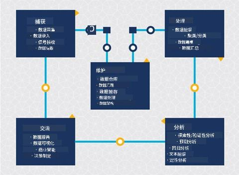
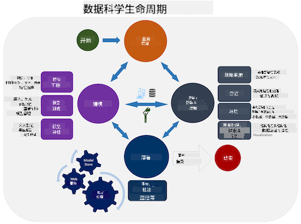
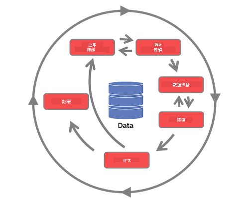

<!--
CO_OP_TRANSLATOR_METADATA:
{
  "original_hash": "79ca8a5a3135e94d2d43f56ba62d5205",
  "translation_date": "2025-09-04T12:20:28+00:00",
  "source_file": "4-Data-Science-Lifecycle/14-Introduction/README.md",
  "language_code": "zh"
}
-->
# 数据科学生命周期简介

| ](../../sketchnotes/14-DataScience-Lifecycle.png)|
|:---:|
| 数据科学生命周期简介 - _Sketchnote by [@nitya](https://twitter.com/nitya)_ |

## [课前测验](https://red-water-0103e7a0f.azurestaticapps.net/quiz/26)

到目前为止，你可能已经意识到数据科学是一个过程。这个过程可以分为五个阶段：

- 数据捕获
- 数据处理
- 数据分析
- 数据沟通
- 数据维护

本课程重点讲解生命周期的三个部分：数据捕获、数据处理和数据维护。

> 图片来源：[伯克利信息学院](https://ischoolonline.berkeley.edu/data-science/what-is-data-science/)

## 数据捕获

生命周期的第一阶段非常重要，因为后续阶段都依赖于它。实际上，这个阶段可以看作是两个阶段的结合：获取数据以及定义需要解决的目标和问题。  
定义项目目标需要深入了解问题或问题背景。首先，我们需要识别并获取那些需要解决问题的人。这些可能是企业的利益相关者或项目的赞助者，他们可以帮助确定谁或什么会从这个项目中受益，以及他们需要什么和为什么需要它。一个明确的目标应该是可衡量和量化的，以定义可接受的结果。

数据科学家可能会问的问题：
- 这个问题以前是否被研究过？发现了什么？
- 所有相关人员是否都理解目标和目的？
- 是否存在模糊性？如何减少模糊性？
- 有哪些约束条件？
- 最终结果可能是什么样子？
- 有多少资源（时间、人力、计算能力）可用？

接下来是识别、收集并最终探索实现这些目标所需的数据。在数据获取的这一步，数据科学家还需要评估数据的数量和质量。这需要一些数据探索，以确认所获取的数据是否能够支持实现预期结果。

数据科学家可能会问关于数据的问题：
- 我已经有哪些数据？
- 谁拥有这些数据？
- 有哪些隐私问题？
- 我是否有足够的数据来解决这个问题？
- 数据的质量是否适合解决这个问题？
- 如果通过这些数据发现了额外的信息，我们是否应该考虑改变或重新定义目标？

## 数据处理

生命周期的处理阶段专注于发现数据中的模式以及建模。一些处理阶段使用的技术需要统计方法来揭示模式。通常，对于一个大型数据集来说，这将是一个繁琐的任务，因此需要依赖计算机来加快处理速度。在这个阶段，数据科学和机器学习会交叉。正如你在第一课中学到的，机器学习是构建模型以理解数据的过程。模型是数据中变量之间关系的表示，帮助预测结果。

此阶段常用的技术在《机器学习初学者》课程中有详细介绍。点击以下链接了解更多：

- [分类](https://github.com/microsoft/ML-For-Beginners/tree/main/4-Classification)：将数据组织到类别中以提高使用效率。
- [聚类](https://github.com/microsoft/ML-For-Beginners/tree/main/5-Clustering)：将数据分组到相似的群组中。
- [回归](https://github.com/microsoft/ML-For-Beginners/tree/main/2-Regression)：确定变量之间的关系以预测或预估值。

## 数据维护

在生命周期图中，你可能注意到维护位于数据捕获和数据处理之间。维护是一个持续的过程，贯穿项目的整个过程，包括管理、存储和保护数据。

### 数据存储
数据存储的方式和位置会影响存储成本以及数据访问的性能。这些决策通常不会由数据科学家单独做出，但他们可能需要根据数据存储方式做出如何使用数据的选择。

以下是现代数据存储系统的一些方面，这些方面可能会影响决策：

**本地存储 vs 外部存储 vs 公有云或私有云**

本地存储指的是使用自己的设备管理数据，例如拥有一个存储数据的服务器；而外部存储依赖于你不拥有的设备，例如数据中心。公有云是存储数据的流行选择，它不需要了解数据具体存储的位置或方式，其中“公有”指的是所有使用云服务的人共享统一的基础设施。一些组织有严格的安全政策，要求完全访问存储数据的设备，因此会选择提供专属云服务的私有云。你将在[后续课程](https://github.com/microsoft/Data-Science-For-Beginners/tree/main/5-Data-Science-In-Cloud)中学习更多关于云中的数据。

**冷数据 vs 热数据**

在训练模型时，你可能需要更多的训练数据。如果你对模型满意，更多的数据会到来以支持模型的用途。无论如何，随着数据的积累，存储和访问数据的成本都会增加。将很少使用的冷数据与频繁访问的热数据分离，可以通过硬件或软件服务实现更便宜的数据存储选项。如果需要访问冷数据，可能会比热数据的检索时间稍长。

### 数据管理
在处理数据时，你可能会发现一些数据需要使用[数据准备](https://github.com/microsoft/Data-Science-For-Beginners/tree/main/2-Working-With-Data/08-data-preparation)课程中介绍的技术进行清理，以构建准确的模型。当新数据到来时，也需要应用相同的技术以保持质量的一致性。一些项目会使用自动化工具来清理、聚合和压缩数据，然后将其移动到最终存储位置。Azure Data Factory 就是其中一个工具的例子。

### 数据安全
数据安全的主要目标之一是确保数据的收集和使用在控制范围内。保持数据安全包括限制访问权限，仅允许需要数据的人访问，遵守当地法律法规，以及维护伦理标准，这些内容在[伦理课程](https://github.com/microsoft/Data-Science-For-Beginners/tree/main/1-Introduction/02-ethics)中有介绍。

团队可能会采取以下措施以确保数据安全：
- 确保所有数据都已加密
- 向客户提供关于其数据使用方式的信息
- 移除已离开项目人员的数据访问权限
- 仅允许特定项目成员修改数据

## 🚀 挑战

数据科学生命周期有许多版本，每个版本的步骤可能有不同的名称和阶段数量，但都会包含本课程中提到的相同过程。

探索[团队数据科学过程生命周期](https://docs.microsoft.com/en-us/azure/architecture/data-science-process/lifecycle)和[跨行业数据挖掘标准过程](https://www.datascience-pm.com/crisp-dm-2/)。列举两者的三个相似点和不同点。

|团队数据科学过程 (TDSP)|跨行业数据挖掘标准过程 (CRISP-DM)|
|--|--|
| |  |
| 图片来源：[Microsoft](https://docs.microsoft.comazure/architecture/data-science-process/lifecycle) | 图片来源：[数据科学过程联盟](https://www.datascience-pm.com/crisp-dm-2/) |

## [课后测验](https://ff-quizzes.netlify.app/en/ds/)

## 复习与自学

应用数据科学生命周期涉及多个角色和任务，其中一些可能专注于每个阶段的特定部分。团队数据科学过程提供了一些资源，解释了项目中可能涉及的角色和任务类型。

* [团队数据科学过程中的角色和任务](https://docs.microsoft.com/en-us/azure/architecture/data-science-process/roles-tasks)
* [执行数据科学任务：探索、建模和部署](https://docs.microsoft.com/en-us/azure/architecture/data-science-process/execute-data-science-tasks)

## 作业

[评估数据集](assignment.md)

---

**免责声明**：  
本文档使用AI翻译服务[Co-op Translator](https://github.com/Azure/co-op-translator)进行翻译。尽管我们尽力确保准确性，但请注意，自动翻译可能包含错误或不准确之处。应以原始语言的文档作为权威来源。对于关键信息，建议使用专业人工翻译。对于因使用本翻译而引起的任何误解或误读，我们概不负责。