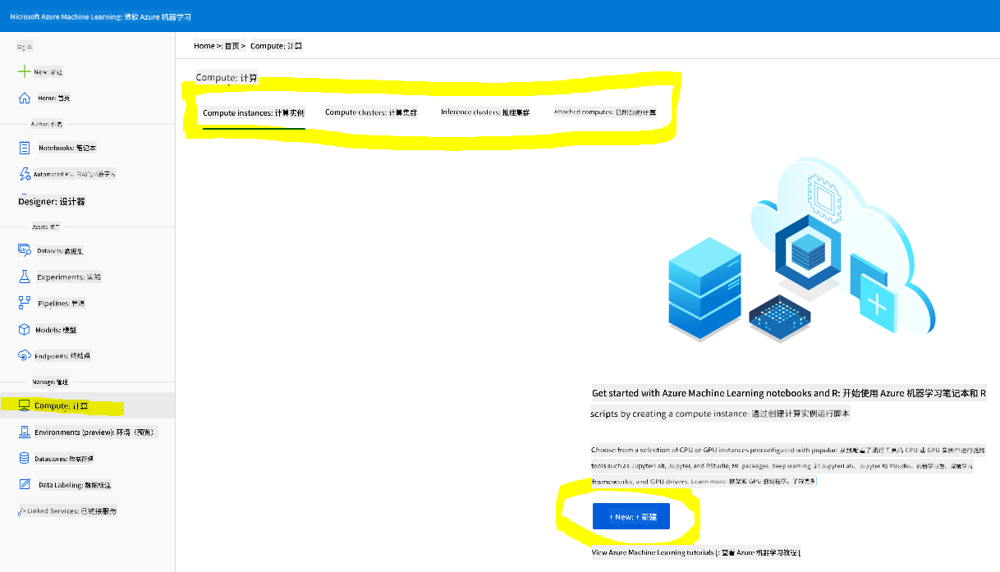

<!--
CO_OP_TRANSLATOR_METADATA:
{
  "original_hash": "5da2d6b3736f6d668b89de9bf3bdd31b",
  "translation_date": "2025-09-04T12:16:28+00:00",
  "source_file": "5-Data-Science-In-Cloud/19-Azure/README.md",
  "language_code": "zh"
}
-->
# 云中的数据科学：使用 "Azure ML SDK"

| 绘制的草图笔记](../../sketchnotes/19-DataScience-Cloud.png)|
|:---:|
| 云中的数据科学：Azure ML SDK - _草图笔记由 [@nitya](https://twitter.com/nitya) 提供_ |

目录：

- [云中的数据科学：使用 "Azure ML SDK"](../../../../5-Data-Science-In-Cloud/19-Azure)
  - [课前测验](../../../../5-Data-Science-In-Cloud/19-Azure)
  - [1. 介绍](../../../../5-Data-Science-In-Cloud/19-Azure)
    - [1.1 什么是 Azure ML SDK？](../../../../5-Data-Science-In-Cloud/19-Azure)
    - [1.2 心力衰竭预测项目和数据集介绍](../../../../5-Data-Science-In-Cloud/19-Azure)
  - [2. 使用 Azure ML SDK 训练模型](../../../../5-Data-Science-In-Cloud/19-Azure)
    - [2.1 创建 Azure ML 工作区](../../../../5-Data-Science-In-Cloud/19-Azure)
    - [2.2 创建计算实例](../../../../5-Data-Science-In-Cloud/19-Azure)
    - [2.3 加载数据集](../../../../5-Data-Science-In-Cloud/19-Azure)
    - [2.4 创建笔记本](../../../../5-Data-Science-In-Cloud/19-Azure)
    - [2.5 训练模型](../../../../5-Data-Science-In-Cloud/19-Azure)
      - [2.5.1 设置工作区、实验、计算集群和数据集](../../../../5-Data-Science-In-Cloud/19-Azure)
      - [2.5.2 自动化机器学习配置和训练](../../../../5-Data-Science-In-Cloud/19-Azure)
  - [3. 使用 Azure ML SDK 部署模型和消费端点](../../../../5-Data-Science-In-Cloud/19-Azure)
    - [3.1 保存最佳模型](../../../../5-Data-Science-In-Cloud/19-Azure)
    - [3.2 模型部署](../../../../5-Data-Science-In-Cloud/19-Azure)
    - [3.3 消费端点](../../../../5-Data-Science-In-Cloud/19-Azure)
  - [🚀 挑战](../../../../5-Data-Science-In-Cloud/19-Azure)
  - [课后测验](../../../../5-Data-Science-In-Cloud/19-Azure)
  - [复习与自学](../../../../5-Data-Science-In-Cloud/19-Azure)
  - [作业](../../../../5-Data-Science-In-Cloud/19-Azure)

## [课前测验](https://purple-hill-04aebfb03.1.azurestaticapps.net/quiz/36)

## 1. 介绍

### 1.1 什么是 Azure ML SDK？

数据科学家和 AI 开发者使用 Azure Machine Learning SDK 来构建和运行基于 Azure Machine Learning 服务的机器学习工作流。你可以在任何 Python 环境中与该服务交互，包括 Jupyter Notebooks、Visual Studio Code 或你喜欢的 Python IDE。

SDK 的主要功能包括：

- 探索、准备和管理机器学习实验中使用的数据集的生命周期。
- 管理云资源以监控、记录和组织机器学习实验。
- 在本地或使用云资源（包括 GPU 加速的模型训练）训练模型。
- 使用自动化机器学习（AutoML），通过配置参数和训练数据，自动迭代算法和超参数设置，找到最佳模型以进行预测。
- 部署 Web 服务，将训练好的模型转换为可在任何应用程序中消费的 RESTful 服务。

[了解更多关于 Azure Machine Learning SDK 的信息](https://docs.microsoft.com/python/api/overview/azure/ml?WT.mc_id=academic-77958-bethanycheum&ocid=AID3041109)

在[上一课](../18-Low-Code/README.md)中，我们学习了如何以低代码/无代码的方式训练、部署和消费模型。我们使用了心力衰竭数据集来生成心力衰竭预测模型。在本课中，我们将使用 Azure Machine Learning SDK 完成相同的任务。


### 1.2 心力衰竭预测项目和数据集介绍

查看[这里](../18-Low-Code/README.md)了解心力衰竭预测项目和数据集的介绍。

## 2. 使用 Azure ML SDK 训练模型

### 2.1 创建 Azure ML 工作区

为了简化操作，我们将在 Jupyter Notebook 中工作。这意味着你已经有一个工作区和一个计算实例。如果你已经有一个工作区，可以直接跳到 2.3 节的笔记本创建部分。

如果没有，请按照[上一课](../18-Low-Code/README.md)中 **2.1 创建 Azure ML 工作区** 的说明创建工作区。

### 2.2 创建计算实例

在我们之前创建的 [Azure ML 工作区](https://ml.azure.com/)中，进入计算菜单，你会看到可用的不同计算资源。



让我们创建一个计算实例来提供 Jupyter Notebook。
1. 点击 + New 按钮。
2. 为你的计算实例命名。
3. 选择你的选项：CPU 或 GPU、虚拟机大小和核心数量。
4. 点击 Create 按钮。

恭喜，你刚刚创建了一个计算实例！我们将在[创建笔记本部分](../../../../5-Data-Science-In-Cloud/19-Azure)中使用这个计算实例。

### 2.3 加载数据集

如果你还没有上传数据集，请参考[上一课](../18-Low-Code/README.md)中的 **2.3 加载数据集** 部分。

### 2.4 创建笔记本

> **_注意：_** 接下来的步骤中，你可以选择从头创建一个新笔记本，或者上传我们之前创建的 [notebook](notebook.ipynb) 到你的 Azure ML Studio。要上传笔记本，只需点击 "Notebook" 菜单并上传笔记本文件。

笔记本是数据科学过程中非常重要的一部分。它们可以用于进行探索性数据分析（EDA）、调用计算集群训练模型、调用推理集群部署端点。

要创建一个笔记本，我们需要一个提供 Jupyter Notebook 实例的计算节点。返回 [Azure ML 工作区](https://ml.azure.com/)，点击计算实例。在计算实例列表中，你应该能看到[我们之前创建的计算实例](../../../../5-Data-Science-In-Cloud/19-Azure)。

1. 在 Applications 部分，点击 Jupyter 选项。
2. 勾选 "Yes, I understand" 框并点击 Continue 按钮。

3. 这会打开一个新的浏览器标签页，显示你的 Jupyter Notebook 实例。点击 "New" 按钮创建一个笔记本。


现在我们有了一个笔记本，可以开始使用 Azure ML SDK 训练模型了。

### 2.5 训练模型

首先，如果你有任何疑问，请参考 [Azure ML SDK 文档](https://docs.microsoft.com/python/api/overview/azure/ml?WT.mc_id=academic-77958-bethanycheum&ocid=AID3041109)。文档中包含了理解本课中涉及模块的所有必要信息。

#### 2.5.1 设置工作区、实验、计算集群和数据集

你需要使用以下代码从配置文件加载 `workspace`：

```python
from azureml.core import Workspace
ws = Workspace.from_config()
```

这会返回一个表示工作区的 `Workspace` 对象。然后你需要使用以下代码创建一个 `experiment`：

```python
from azureml.core import Experiment
experiment_name = 'aml-experiment'
experiment = Experiment(ws, experiment_name)
```

要从工作区获取或创建实验，你需要通过实验名称请求实验。实验名称必须是 3-36 个字符，以字母或数字开头，并且只能包含字母、数字、下划线和短划线。如果在工作区中找不到实验，则会创建一个新实验。

现在你需要使用以下代码为训练创建一个计算集群。注意，这一步可能需要几分钟。

```python
from azureml.core.compute import AmlCompute

aml_name = "heart-f-cluster"
try:
    aml_compute = AmlCompute(ws, aml_name)
    print('Found existing AML compute context.')
except:
    print('Creating new AML compute context.')
    aml_config = AmlCompute.provisioning_configuration(vm_size = "Standard_D2_v2", min_nodes=1, max_nodes=3)
    aml_compute = AmlCompute.create(ws, name = aml_name, provisioning_configuration = aml_config)
    aml_compute.wait_for_completion(show_output = True)

cts = ws.compute_targets
compute_target = cts[aml_name]
```

你可以通过以下方式从工作区获取数据集：

```python
dataset = ws.datasets['heart-failure-records']
df = dataset.to_pandas_dataframe()
df.describe()
```

#### 2.5.2 自动化机器学习配置和训练

要设置 AutoML 配置，请使用 [AutoMLConfig 类](https://docs.microsoft.com/python/api/azureml-train-automl-client/azureml.train.automl.automlconfig(class)?WT.mc_id=academic-77958-bethanycheum&ocid=AID3041109)。

根据文档描述，你可以调整许多参数。对于本项目，我们将使用以下参数：

- `experiment_timeout_minutes`：实验允许运行的最大时间（以分钟为单位），超时后实验会自动停止并生成结果。
- `max_concurrent_iterations`：实验允许的最大并发训练迭代次数。
- `primary_metric`：用于确定实验状态的主要指标。
- `compute_target`：运行自动化机器学习实验的 Azure Machine Learning 计算目标。
- `task`：要运行的任务类型。值可以是 'classification'、'regression' 或 'forecasting'，具体取决于要解决的自动化机器学习问题类型。
- `training_data`：实验中使用的训练数据。应包含训练特征和标签列（可选的样本权重列）。
- `label_column_name`：标签列的名称。
- `path`：Azure Machine Learning 项目文件夹的完整路径。
- `enable_early_stopping`：是否启用早停，如果短期内分数没有改善则终止。
- `featurization`：指示是否自动进行特征化步骤，或使用自定义特征化。
- `debug_log`：写入调试信息的日志文件。

```python
from azureml.train.automl import AutoMLConfig

project_folder = './aml-project'

automl_settings = {
    "experiment_timeout_minutes": 20,
    "max_concurrent_iterations": 3,
    "primary_metric" : 'AUC_weighted'
}

automl_config = AutoMLConfig(compute_target=compute_target,
                             task = "classification",
                             training_data=dataset,
                             label_column_name="DEATH_EVENT",
                             path = project_folder,  
                             enable_early_stopping= True,
                             featurization= 'auto',
                             debug_log = "automl_errors.log",
                             **automl_settings
                            )
```

现在你已经设置了配置，可以使用以下代码训练模型。这一步可能需要长达一小时，具体取决于集群大小。

```python
remote_run = experiment.submit(automl_config)
```

你可以运行 RunDetails 小部件来显示不同的实验。

```python
from azureml.widgets import RunDetails
RunDetails(remote_run).show()
```

## 3. 使用 Azure ML SDK 部署模型和消费端点

### 3.1 保存最佳模型

`remote_run` 是一个 [AutoMLRun](https://docs.microsoft.com/python/api/azureml-train-automl-client/azureml.train.automl.run.automlrun?WT.mc_id=academic-77958-bethanycheum&ocid=AID3041109) 类型的对象。该对象包含 `get_output()` 方法，可返回最佳运行及其对应的拟合模型。

```python
best_run, fitted_model = remote_run.get_output()
```

你可以通过打印 `fitted_model` 查看最佳模型使用的参数，并通过 [get_properties()](https://docs.microsoft.com/python/api/azureml-core/azureml.core.run(class)?view=azure-ml-py#azureml_core_Run_get_properties?WT.mc_id=academic-77958-bethanycheum&ocid=AID3041109) 方法查看最佳模型的属性。

```python
best_run.get_properties()
```

现在使用 [register_model](https://docs.microsoft.com/python/api/azureml-train-automl-client/azureml.train.automl.run.automlrun?view=azure-ml-py#register-model-model-name-none--description-none--tags-none--iteration-none--metric-none-?WT.mc_id=academic-77958-bethanycheum&ocid=AID3041109) 方法注册模型。

```python
model_name = best_run.properties['model_name']
script_file_name = 'inference/score.py'
best_run.download_file('outputs/scoring_file_v_1_0_0.py', 'inference/score.py')
description = "aml heart failure project sdk"
model = best_run.register_model(model_name = model_name,
                                model_path = './outputs/',
                                description = description,
                                tags = None)
```

### 3.2 模型部署

保存最佳模型后，我们可以使用 [InferenceConfig](https://docs.microsoft.com/python/api/azureml-core/azureml.core.model.inferenceconfig?view=azure-ml-py?ocid=AID3041109) 类部署模型。InferenceConfig 表示用于部署的自定义环境的配置设置。[AciWebservice](https://docs.microsoft.com/python/api/azureml-core/azureml.core.webservice.aciwebservice?view=azure-ml-py) 类表示部署为 Azure 容器实例上的 Web 服务端点的机器学习模型。部署的服务由模型、脚本和相关文件创建。生成的 Web 服务是一个负载均衡的 HTTP 端点，带有 REST API。你可以向该 API 发送数据并接收模型返回的预测。

使用 [deploy](https://docs.microsoft.com/python/api/azureml-core/azureml.core.model(class)?view=azure-ml-py#deploy-workspace--name--models--inference-config-none--deployment-config-none--deployment-target-none--overwrite-false--show-output-false-?WT.mc_id=academic-77958-bethanycheum&ocid=AID3041109) 方法部署模型。

```python
from azureml.core.model import InferenceConfig, Model
from azureml.core.webservice import AciWebservice

inference_config = InferenceConfig(entry_script=script_file_name, environment=best_run.get_environment())

aciconfig = AciWebservice.deploy_configuration(cpu_cores = 1,
                                               memory_gb = 1,
                                               tags = {'type': "automl-heart-failure-prediction"},
                                               description = 'Sample service for AutoML Heart Failure Prediction')

aci_service_name = 'automl-hf-sdk'
aci_service = Model.deploy(ws, aci_service_name, [model], inference_config, aciconfig)
aci_service.wait_for_deployment(True)
print(aci_service.state)
```

这一步可能需要几分钟。

### 3.3 消费端点

你可以通过创建一个示例输入来消费端点：

```python
data = {
    "data":
    [
        {
            'age': "60",
            'anaemia': "false",
            'creatinine_phosphokinase': "500",
            'diabetes': "false",
            'ejection_fraction': "38",
            'high_blood_pressure': "false",
            'platelets': "260000",
            'serum_creatinine': "1.40",
            'serum_sodium': "137",
            'sex': "false",
            'smoking': "false",
            'time': "130",
        },
    ],
}

test_sample = str.encode(json.dumps(data))
```

然后将该输入发送到模型以获取预测：
```python
response = aci_service.run(input_data=test_sample)
response
```
这应该输出 `'{"result": [false]}'`。这意味着我们发送到端点的患者输入生成了预测 `false`，表示此人不太可能发生心脏病。

恭喜！你刚刚使用 Azure ML SDK 消耗了在 Azure ML 上部署和训练的模型！

> **_注意:_** 完成项目后，别忘了删除所有资源。

## 🚀 挑战

通过 SDK 你可以做很多其他事情，但遗憾的是我们无法在这节课中全部讲解。不过好消息是，学会快速浏览 SDK 文档可以让你在学习中走得更远。查看 Azure ML SDK 文档，找到允许你创建管道的 `Pipeline` 类。管道是可以作为工作流执行的一系列步骤的集合。

**提示:** 访问 [SDK 文档](https://docs.microsoft.com/python/api/overview/azure/ml/?view=azure-ml-py?WT.mc_id=academic-77958-bethanycheum&ocid=AID3041109)，在搜索栏中输入关键词如 "Pipeline"。你应该能在搜索结果中找到 `azureml.pipeline.core.Pipeline` 类。

## [课后测验](https://ff-quizzes.netlify.app/en/ds/)

## 复习与自学

在本课中，你学习了如何在云端使用 Azure ML SDK 训练、部署和消耗一个模型来预测心脏病风险。查看这个 [文档](https://docs.microsoft.com/python/api/overview/azure/ml/?view=azure-ml-py?WT.mc_id=academic-77958-bethanycheum&ocid=AID3041109)，获取更多关于 Azure ML SDK 的信息。尝试使用 Azure ML SDK 创建你自己的模型。

## 作业

[使用 Azure ML SDK 的数据科学项目](assignment.md)

---

**免责声明**：  
本文档使用AI翻译服务 [Co-op Translator](https://github.com/Azure/co-op-translator) 进行翻译。尽管我们努力确保翻译的准确性，但请注意，自动翻译可能包含错误或不准确之处。原始语言的文档应被视为权威来源。对于关键信息，建议使用专业人工翻译。我们不对因使用此翻译而产生的任何误解或误读承担责任。